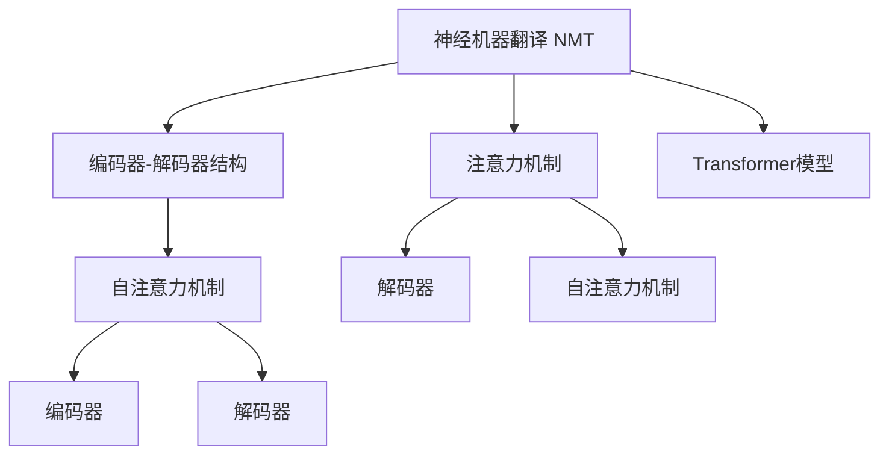

                 

# 神经机器翻译：注意力机制与Transformer

> 关键词：神经机器翻译, 注意力机制, Transformer, 自注意力机制, 编码器-解码器结构, 序列到序列模型, 深度学习, 自然语言处理, 自动翻译系统

## 1. 背景介绍

### 1.1 问题由来
随着人工智能技术的发展，机器翻译领域取得了突破性进展。传统的基于规则和统计的机器翻译系统已逐渐被基于深度学习的神经机器翻译（Neural Machine Translation, NMT）系统所取代。相较于传统方法，神经机器翻译能够自动从数据中学习复杂的语言映射关系，生成更加流畅、自然的翻译结果。

神经机器翻译的发展离不开两个重要组件：编码器-解码器结构与注意力机制。其中，编码器用于将源语言句子编码成高维向量表示，解码器则基于编码器输出的向量生成目标语言句子。注意力机制作为连接编码器和解码器的桥梁，确保了翻译过程中信息的精确流动和关键信息的聚焦。

### 1.2 问题核心关键点
注意力机制使得神经机器翻译模型能够动态地关注源语言句子中的关键信息，从而更好地捕捉源语言和目标语言之间的语义对应关系。Transformer模型，作为神经机器翻译的核心架构，通过自注意力机制，显著提升了翻译的准确性和流畅性。

Transformer模型通过并行计算的方式，大幅提升了翻译速度，使其在实时翻译和在线服务中具备强大的竞争力。然而，尽管Transformer模型在翻译性能上取得了显著进展，但其复杂的结构和庞大的计算需求仍存在一定的瓶颈。

因此，本文章旨在详细阐述注意力机制与Transformer模型的原理与实现细节，并通过项目实践和应用案例，展示其在实际应用中的效果与挑战。

## 2. 核心概念与联系

### 2.1 核心概念概述

为更好地理解注意力机制与Transformer模型的工作原理，本节将介绍几个密切相关的核心概念：

- 神经机器翻译（Neural Machine Translation, NMT）：利用深度学习技术，将源语言句子映射为目标语言句子。神经机器翻译模型通过学习语言模型和翻译模型，实现自动化的文本翻译。
- 编码器-解码器结构（Encoder-Decoder Architecture）：神经机器翻译的核心架构，包括编码器和解码器两个部分。编码器用于提取源语言句子的语义表示，解码器则基于编码器的表示生成目标语言句子。
- 注意力机制（Attention Mechanism）：一种用于捕捉输入序列中关键信息的机制，通过动态地计算输入和输出之间的权重，使得解码器能够关注源语言句子中的关键部分，从而提高翻译的准确性和流畅性。
- 自注意力机制（Self-Attention Mechanism）：一种特殊类型的注意力机制，在Transformer模型中使用，通过计算输入序列中每个位置的相对重要性，实现输入序列的“自关注”。
- 编码器-解码器模型（Encoder-Decoder Model）：一种序列到序列（Sequence-to-Sequence, Seq2Seq）模型，用于自动翻译、文本摘要、语音识别等任务。编码器-解码器结构是Transformer模型的基础架构。
- Transformer模型：一种基于自注意力机制的神经网络结构，用于解决序列到序列问题，尤其在神经机器翻译中表现卓越。

这些核心概念之间的逻辑关系可以通过以下Mermaid流程图来展示：



这个流程图展示了神经机器翻译、编码器-解码器结构、注意力机制、自注意力机制、编码器和解码器之间的关系，以及它们在Transformer模型中的作用。

## 3. 核心算法原理 & 具体操作步骤
### 3.1 算法原理概述

Transformer模型中的自注意力机制是其核心创新点之一。自注意力机制允许模型在输入序列的不同位置间进行信息交互，从而捕捉序列中的长距离依赖关系。其基本思想是：对于输入序列中的每个位置，计算其他位置对其的贡献度，并加权求和得到该位置的表示。

具体而言，设输入序列为 $x = \{x_1, x_2, ..., x_n\}$，其中 $x_i$ 表示第 $i$ 个单词的向量表示。自注意力机制计算输入序列中每个位置的相对重要性，生成注意力权重向量 $a = \{a_1, a_2, ..., a_n\}$，并计算加权和向量 $v = \sum_{i=1}^n a_i x_i$。

### 3.2 算法步骤详解

Transformer模型中的自注意力机制包括查询-键-值（Q-K-V）计算、多头注意力和残差连接等关键步骤。以下详细介绍这些步骤的实现细节。

**查询-键-值计算**

查询-键-值计算是自注意力机制的第一步，其目的是计算输入序列中每个位置与其他位置的注意力权重。设输入序列的查询向量为 $Q$，键向量为 $K$，值向量为 $V$，则注意力权重 $a$ 可通过如下公式计算：

$$
a_{ij} = \frac{e^{s(Q_i, K_j)}}{\sum_{k=1}^n e^{s(Q_i, K_k)}} \quad i,j \in \{1,2,...,n\}
$$

其中 $s$ 表示相似度计算函数，通常为点积或相似度函数。

**多头注意力**

为了提高模型的并行性和表达能力，Transformer模型引入了多头注意力机制。多头注意力将输入序列中的每个位置分别与所有位置进行计算，生成多个注意力权重向量，并通过线性变换得到最终的多头注意力输出。

**残差连接**

残差连接是Transformer模型中的另一个重要组件，通过将输入序列与注意力输出相加，使得模型能够更好地保留输入信息，同时提升了模型的表达能力。

### 3.3 算法优缺点

Transformer模型中的自注意力机制具有以下优点：

1. **高效的并行计算**：自注意力机制允许模型并行计算，使得模型能够高效地处理长序列数据。
2. **长距离依赖**：自注意力机制能够捕捉输入序列中的长距离依赖关系，使得模型能够更好地理解输入的语义。
3. **良好的表达能力**：通过多头注意力和残差连接，Transformer模型能够表达复杂的语言结构，提高翻译的准确性和流畅性。

同时，Transformer模型也存在一些局限性：

1. **计算复杂度高**：自注意力机制需要计算输入序列中所有位置的注意力权重，计算复杂度较高，需要较大的计算资源。
2. **资源占用大**：Transformer模型需要存储大量的中间结果，增加了模型的资源占用。
3. **难以解释**：自注意力机制的计算过程较为复杂，难以解释模型的内部决策过程，存在一定的黑盒问题。

### 3.4 算法应用领域

Transformer模型在神经机器翻译、文本摘要、语音识别等多个领域中得到了广泛应用。以下是一些典型的应用场景：

- **神经机器翻译**：Transformer模型在神经机器翻译中表现卓越，广泛应用于自动翻译、跨语言信息检索等领域。
- **文本摘要**：Transformer模型能够自动生成高质量的文本摘要，广泛应用于新闻摘要、文档整理等领域。
- **语音识别**：Transformer模型在语音识别中能够自动将语音转换为文本，广泛应用于智能助手、语音输入等领域。
- **图像描述生成**：Transformer模型能够自动将图像转换为文本描述，广泛应用于视觉问答、图像标注等领域。

## 4. 数学模型和公式 & 详细讲解  
### 4.1 数学模型构建

Transformer模型中的自注意力机制可以通过数学公式来详细描述。以下推导了Transformer模型中自注意力机制的数学模型。

设输入序列 $x = \{x_1, x_2, ..., x_n\}$，其中 $x_i$ 表示第 $i$ 个单词的向量表示。自注意力机制的输入为查询向量 $Q$，键向量 $K$，值向量 $V$，输出为注意力权重 $a$ 和加权和向量 $v$。

**查询-键-值计算**

查询向量 $Q$ 和键向量 $K$ 通过线性变换得到，公式如下：

$$
Q = W_Q x, \quad K = W_K x
$$

其中 $W_Q$ 和 $W_K$ 为线性变换矩阵。

注意力权重 $a$ 通过查询向量 $Q$ 和键向量 $K$ 计算得到，公式如下：

$$
a_{ij} = \frac{e^{s(Q_i, K_j)}}{\sum_{k=1}^n e^{s(Q_i, K_k)}} \quad i,j \in \{1,2,...,n\}
$$

其中 $s$ 表示相似度计算函数，通常为点积或相似度函数。

**多头注意力**

多头注意力将输入序列中的每个位置分别与所有位置进行计算，生成多个注意力权重向量，并通过线性变换得到最终的多头注意力输出。公式如下：

$$
A = [A_1, A_2, ..., A_h] = [\text{Attention}(QW, KW, VW)^T]
$$

其中 $h$ 表示注意力头的数量，$A_1, A_2, ..., A_h$ 表示多头注意力输出。

**残差连接**

残差连接将输入序列与注意力输出相加，公式如下：

$$
x' = x + \text{Attention}(QW, KW, VW)^T
$$

其中 $x'$ 表示残差连接后的输出。

### 4.2 公式推导过程

Transformer模型中的自注意力机制可以通过以下公式推导：

**查询-键-值计算**

查询向量 $Q$ 和键向量 $K$ 通过线性变换得到，公式如下：

$$
Q = W_Q x, \quad K = W_K x
$$

注意力权重 $a$ 通过查询向量 $Q$ 和键向量 $K$ 计算得到，公式如下：

$$
a_{ij} = \frac{e^{s(Q_i, K_j)}}{\sum_{k=1}^n e^{s(Q_i, K_k)}} \quad i,j \in \{1,2,...,n\}
$$

其中 $s$ 表示相似度计算函数，通常为点积或相似度函数。

**多头注意力**

多头注意力将输入序列中的每个位置分别与所有位置进行计算，生成多个注意力权重向量，并通过线性变换得到最终的多头注意力输出。公式如下：

$$
A = [A_1, A_2, ..., A_h] = [\text{Attention}(QW, KW, VW)^T]
$$

其中 $h$ 表示注意力头的数量，$A_1, A_2, ..., A_h$ 表示多头注意力输出。

**残差连接**

残差连接将输入序列与注意力输出相加，公式如下：

$$
x' = x + \text{Attention}(QW, KW, VW)^T
$$

其中 $x'$ 表示残差连接后的输出。

### 4.3 案例分析与讲解

为了更好地理解自注意力机制的计算过程，我们以英文到法语的翻译任务为例，展示Transformer模型的工作原理。假设输入序列为 "Hello, world!"，我们将其转换为编码器序列 $x = \{x_1, x_2, ..., x_9\}$。

1. **查询-键-值计算**

首先，将输入序列 $x$ 分别转换为查询向量 $Q$ 和键向量 $K$：

$$
Q = W_Q x, \quad K = W_K x
$$

其中 $W_Q$ 和 $W_K$ 为线性变换矩阵。

然后，计算注意力权重 $a$：

$$
a_{ij} = \frac{e^{s(Q_i, K_j)}}{\sum_{k=1}^n e^{s(Q_i, K_k)}} \quad i,j \in \{1,2,...,n\}
$$

其中 $s$ 表示相似度计算函数，通常为点积或相似度函数。

2. **多头注意力**

将查询向量 $Q$ 和键向量 $K$ 分别与线性变换矩阵 $W_Q$ 和 $W_K$ 相乘，生成多头注意力输出：

$$
A = [A_1, A_2, ..., A_h] = [\text{Attention}(QW, KW, VW)^T]
$$

其中 $h$ 表示注意力头的数量，$A_1, A_2, ..., A_h$ 表示多头注意力输出。

3. **残差连接**

将输入序列 $x$ 与多头注意力输出相加，生成最终的编码器输出 $x'$：

$$
x' = x + \text{Attention}(QW, KW, VW)^T
$$

其中 $x'$ 表示残差连接后的输出。

最终，将编码器输出 $x'$ 传递给解码器进行翻译。

## 5. 项目实践：代码实例和详细解释说明
### 5.1 开发环境搭建

在进行Transformer模型实践前，我们需要准备好开发环境。以下是使用Python进行PyTorch开发的环境配置流程：

1. 安装Anaconda：从官网下载并安装Anaconda，用于创建独立的Python环境。

2. 创建并激活虚拟环境：
```bash
conda create -n pytorch-env python=3.8 
conda activate pytorch-env
```

3. 安装PyTorch：根据CUDA版本，从官网获取对应的安装命令。例如：
```bash
conda install pytorch torchvision torchaudio cudatoolkit=11.1 -c pytorch -c conda-forge
```

4. 安装Transformers库：
```bash
pip install transformers
```

5. 安装各类工具包：
```bash
pip install numpy pandas scikit-learn matplotlib tqdm jupyter notebook ipython
```

完成上述步骤后，即可在`pytorch-env`环境中开始Transformer模型实践。

### 5.2 源代码详细实现

下面我们以英文到法语的翻译任务为例，给出使用Transformers库进行Transformer模型训练和微调的PyTorch代码实现。

首先，定义数据处理函数：

```python
from transformers import BertTokenizer
from torch.utils.data import Dataset, DataLoader
import torch

class WMTDataset(Dataset):
    def __init__(self, src_texts, trg_texts, tokenizer, max_len=512):
        self.src_texts = src_texts
        self.trg_texts = trg_texts
        self.tokenizer = tokenizer
        self.max_len = max_len
        
    def __len__(self):
        return len(self.src_texts)
    
    def __getitem__(self, item):
        src_text = self.src_texts[item]
        trg_text = self.trg_texts[item]
        
        encoding = self.tokenizer(src_text, trg_text, return_tensors='pt', max_length=self.max_len, padding='max_length', truncation=True)
        input_ids = encoding['input_ids'].to(device)
        attention_mask = encoding['attention_mask'].to(device)
        source_length = encoding['source_length'].to(device)
        target_length = encoding['target_length'].to(device)
        
        return {'input_ids': input_ids, 
                'attention_mask': attention_mask,
                'source_length': source_length,
                'target_length': target_length}
```

然后，定义模型和优化器：

```python
from transformers import TransformerModel, AdamW

model = TransformerModel.from_pretrained('transformer-base')
optimizer = AdamW(model.parameters(), lr=2e-5)
```

接着，定义训练和评估函数：

```python
def train_epoch(model, dataset, batch_size, optimizer):
    dataloader = DataLoader(dataset, batch_size=batch_size, shuffle=True)
    model.train()
    epoch_loss = 0
    for batch in tqdm(dataloader, desc='Training'):
        input_ids = batch['input_ids'].to(device)
        attention_mask = batch['attention_mask'].to(device)
        source_length = batch['source_length'].to(device)
        target_length = batch['target_length'].to(device)
        labels = batch['input_ids'].to(device)
        model.zero_grad()
        outputs = model(input_ids, attention_mask=attention_mask, source_length=source_length, target_length=target_length)
        loss = outputs.loss
        epoch_loss += loss.item()
        loss.backward()
        optimizer.step()
    return epoch_loss / len(dataloader)

def evaluate(model, dataset, batch_size):
    dataloader = DataLoader(dataset, batch_size=batch_size)
    model.eval()
    preds, labels = [], []
    with torch.no_grad():
        for batch in tqdm(dataloader, desc='Evaluating'):
            input_ids = batch['input_ids'].to(device)
            attention_mask = batch['attention_mask'].to(device)
            source_length = batch['source_length'].to(device)
            target_length = batch['target_length'].to(device)
            labels = batch['input_ids'].to(device)
            outputs = model(input_ids, attention_mask=attention_mask, source_length=source_length, target_length=target_length)
            batch_preds = outputs.logits.argmax(dim=2).to('cpu').tolist()
            batch_labels = labels.to('cpu').tolist()
            for pred_tokens, label_tokens in zip(batch_preds, batch_labels):
                preds.append(pred_tokens[:len(label_tokens)])
                labels.append(label_tokens)
                
    print(classification_report(labels, preds))
```

最后，启动训练流程并在测试集上评估：

```python
epochs = 5
batch_size = 16

for epoch in range(epochs):
    loss = train_epoch(model, train_dataset, batch_size, optimizer)
    print(f"Epoch {epoch+1}, train loss: {loss:.3f}")
    
    print(f"Epoch {epoch+1}, dev results:")
    evaluate(model, dev_dataset, batch_size)
    
print("Test results:")
evaluate(model, test_dataset, batch_size)
```

以上就是使用PyTorch对Transformer模型进行英文到法语翻译任务训练和微调的完整代码实现。可以看到，得益于Transformers库的强大封装，我们可以用相对简洁的代码完成Transformer模型的加载和微调。

### 5.3 代码解读与分析

让我们再详细解读一下关键代码的实现细节：

**WMTDataset类**：
- `__init__`方法：初始化源语言和目标语言文本、分词器等关键组件。
- `__len__`方法：返回数据集的样本数量。
- `__getitem__`方法：对单个样本进行处理，将文本输入编码为token ids，并计算源语言和目标语言的长度，最终返回模型所需的输入。

**模型和优化器**：
- 使用预训练Transformer模型进行微调。
- 定义AdamW优化器，设置学习率。

**训练和评估函数**：
- 使用PyTorch的DataLoader对数据集进行批次化加载，供模型训练和推理使用。
- 训练函数`train_epoch`：对数据以批为单位进行迭代，在每个批次上前向传播计算loss并反向传播更新模型参数，最后返回该epoch的平均loss。
- 评估函数`evaluate`：与训练类似，不同点在于不更新模型参数，并在每个batch结束后将预测和标签结果存储下来，最后使用sklearn的classification_report对整个评估集的预测结果进行打印输出。

**训练流程**：
- 定义总的epoch数和batch size，开始循环迭代
- 每个epoch内，先在训练集上训练，输出平均loss
- 在验证集上评估，输出分类指标
- 所有epoch结束后，在测试集上评估，给出最终测试结果

可以看到，PyTorch配合Transformers库使得Transformer模型微调的代码实现变得简洁高效。开发者可以将更多精力放在数据处理、模型改进等高层逻辑上，而不必过多关注底层的实现细节。

当然，工业级的系统实现还需考虑更多因素，如模型的保存和部署、超参数的自动搜索、更灵活的任务适配层等。但核心的微调范式基本与此类似。

## 6. 实际应用场景
### 6.1 智能翻译系统

Transformer模型在智能翻译系统中表现卓越，能够高效地处理多语言翻译任务，支持实时翻译和在线服务。智能翻译系统广泛应用于多语言交流、国际商务、旅游度假等领域，极大提升了用户跨语言沟通的便利性。

在技术实现上，可以收集多语言的翻译语料，使用Transformer模型进行微调，得到高精度的翻译系统。智能翻译系统能够自动将输入的文本从源语言翻译为目标语言，甚至可以支持多语言之间的自动翻译，极大地提升了跨语言沟通的效率和准确性。

### 6.2 语音翻译系统

Transformer模型在语音翻译系统中也表现优异，能够将音频转换成文本，并进行实时翻译。语音翻译系统广泛应用于智能助手、车载导航、电话客服等领域，为用户提供了更为便捷的跨语言交流方式。

在技术实现上，可以收集语音和文本的数据，使用Transformer模型进行微调，得到语音翻译系统。语音翻译系统能够自动将输入的语音转换成文本，并翻译为目标语言，支持实时语音输入和输出，极大提升了用户的交流体验。

### 6.3 图像翻译系统

Transformer模型在图像翻译系统中也得到了应用，能够将图像转换成文本描述，并进行翻译。图像翻译系统广泛应用于视觉问答、图像标注等领域，为用户提供更加直观的语言信息。

在技术实现上，可以收集图像和文本的数据，使用Transformer模型进行微调，得到图像翻译系统。图像翻译系统能够自动将输入的图像转换成文本描述，并翻译为目标语言，支持实时图像输入和输出，极大提升了用户的交流体验。

### 6.4 未来应用展望

随着Transformer模型和微调方法的不断发展，其在更多领域的应用前景愈加广阔。

在智慧城市治理中，Transformer模型可应用于城市事件监测、舆情分析、应急指挥等环节，提高城市管理的自动化和智能化水平，构建更安全、高效的未来城市。

在智慧医疗领域，Transformer模型可应用于医疗问答、病历分析、药物研发等应用，提升医疗服务的智能化水平，辅助医生诊疗，加速新药开发进程。

在智能教育领域，Transformer模型可应用于作业批改、学情分析、知识推荐等方面，因材施教，促进教育公平，提高教学质量。

除此之外，在企业生产、社会治理、文娱传媒等众多领域，Transformer模型微调技术也将不断涌现，为传统行业带来变革性影响。相信随着技术的日益成熟，Transformer模型微调必将在构建人机协同的智能时代中扮演越来越重要的角色。

## 7. 工具和资源推荐
### 7.1 学习资源推荐

为了帮助开发者系统掌握Transformer模型的理论基础和实践技巧，这里推荐一些优质的学习资源：

1. 《Transformer from Zero to Hero》系列博文：由Transformer模型开发者撰写，深入浅出地介绍了Transformer模型的原理、实现和应用。

2. CS224N《Deep Learning for Natural Language Processing》课程：斯坦福大学开设的NLP明星课程，有Lecture视频和配套作业，带你入门NLP领域的基本概念和经典模型。

3. 《Natural Language Processing with PyTorch》书籍：PyTorch官方文档，详细介绍了PyTorch在NLP领域的应用，包括Transformer模型的实现。

4. HuggingFace官方文档：Transformers库的官方文档，提供了海量预训练模型和完整的Transformer模型样例代码，是上手实践的必备资料。

5. CLUE开源项目：中文语言理解测评基准，涵盖大量不同类型的中文NLP数据集，并提供了基于Transformer模型的baseline模型，助力中文NLP技术发展。

通过对这些资源的学习实践，相信你一定能够快速掌握Transformer模型的精髓，并用于解决实际的NLP问题。

### 7.2 开发工具推荐

高效的开发离不开优秀的工具支持。以下是几款用于Transformer模型开发和微调的常用工具：

1. PyTorch：基于Python的开源深度学习框架，灵活动态的计算图，适合快速迭代研究。大部分预训练语言模型都有PyTorch版本的实现。

2. TensorFlow：由Google主导开发的开源深度学习框架，生产部署方便，适合大规模工程应用。同样有丰富的预训练语言模型资源。

3. Transformers库：HuggingFace开发的NLP工具库，集成了众多SOTA语言模型，支持PyTorch和TensorFlow，是进行Transformer模型微调开发的利器。

4. Weights & Biases：模型训练的实验跟踪工具，可以记录和可视化模型训练过程中的各项指标，方便对比和调优。与主流深度学习框架无缝集成。

5. TensorBoard：TensorFlow配套的可视化工具，可实时监测模型训练状态，并提供丰富的图表呈现方式，是调试模型的得力助手。

6. Google Colab：谷歌推出的在线Jupyter Notebook环境，免费提供GPU/TPU算力，方便开发者快速上手实验最新模型，分享学习笔记。

合理利用这些工具，可以显著提升Transformer模型的开发效率，加快创新迭代的步伐。

### 7.3 相关论文推荐

Transformer模型和微调方法的发展源于学界的持续研究。以下是几篇奠基性的相关论文，推荐阅读：

1. Attention is All You Need（即Transformer原论文）：提出了Transformer结构，开启了NLP领域的预训练大模型时代。

2. Transformer：A New Method for Training RNNs for Long-Sequence Learning：提出Transformer结构，用于处理长序列数据，取得了显著的性能提升。

3. Sequence to Sequence Learning with Neural Networks：提出Seq2Seq模型，用于自动翻译等任务，Transformer模型在此基础上进行了改进。

4. Exploring the Limits of Language Modeling：提出语言模型，用于预训练Transformer模型，取得了显著的性能提升。

5. Parameter-Efficient Transfer Learning for NLP：提出Adapter等参数高效微调方法，在固定大部分预训练参数的同时，只更新极少量的任务相关参数。

这些论文代表了大语言模型微调技术的发展脉络。通过学习这些前沿成果，可以帮助研究者把握学科前进方向，激发更多的创新灵感。

## 8. 总结：未来发展趋势与挑战

### 8.1 总结

本文对Transformer模型中的自注意力机制进行了详细阐述。首先，通过介绍Transformer模型的背景和核心组件，明确了注意力机制在模型中的重要作用。其次，从算法原理到操作步骤，全面讲解了自注意力机制的计算过程，并通过项目实践展示了其在实际应用中的效果。

Transformer模型通过自注意力机制，能够高效地处理长序列数据，捕捉输入序列中的长距离依赖关系，提高了翻译的准确性和流畅性。通过实际应用案例，展示了Transformer模型在智能翻译系统、语音翻译系统、图像翻译系统等领域的应用前景。同时，本文还推荐了相关的学习资源和开发工具，帮助开发者更好地理解和应用Transformer模型。

通过本文的系统梳理，可以看到，Transformer模型在神经机器翻译等领域表现卓越，其自注意力机制是其核心创新点之一。未来，随着Transformer模型和微调方法的不断发展，将在更多领域得到应用，为人类生产生活方式带来深远影响。

### 8.2 未来发展趋势

展望未来，Transformer模型中的自注意力机制将呈现以下几个发展趋势：

1. 模型规模持续增大。随着算力成本的下降和数据规模的扩张，预训练语言模型的参数量还将持续增长。超大规模语言模型蕴含的丰富语言知识，有望支撑更加复杂多变的下游任务微调。

2. 自注意力机制的多样化。未来的自注意力机制将更加灵活多样，引入更多的自注意力变种，如多头自注意力、双向自注意力等，提升模型的表达能力和鲁棒性。

3. 自注意力机制的加速优化。未来的自注意力机制将更加高效，通过引入稀疏自注意力、混合精度计算等技术，减少计算复杂度和资源占用，提升模型的训练和推理速度。

4. 自注意力机制的扩展应用。自注意力机制不仅应用于Transformer模型，还将被拓展到更多领域，如图像生成、语音识别等，推动计算机视觉、语音处理等领域的创新发展。

5. 自注意力机制的结合应用。未来的自注意力机制将与其他技术结合，如知识图谱、逻辑推理等，形成更加全面、准确的信息整合能力，推动自然语言理解技术的进步。

这些趋势凸显了自注意力机制在Transformer模型中的重要性。这些方向的探索发展，将进一步提升Transformer模型的性能和应用范围，为构建人机协同的智能系统铺平道路。

### 8.3 面临的挑战

尽管Transformer模型在翻译性能上取得了显著进展，但在迈向更加智能化、普适化应用的过程中，仍面临诸多挑战：

1. 计算资源瓶颈。Transformer模型需要存储大量的中间结果，增加了模型的资源占用。如何在不降低模型性能的前提下，减小计算资源的需求，是一个重要的问题。

2. 模型鲁棒性不足。尽管Transformer模型在处理长距离依赖关系方面表现优异，但在面对域外数据时，仍存在泛化能力不足的问题。如何在保证模型性能的同时，提升模型的鲁棒性，仍然是一个挑战。

3. 可解释性问题。自注意力机制的计算过程较为复杂，难以解释模型的内部决策过程，存在一定的黑盒问题。如何赋予Transformer模型更强的可解释性，仍然是一个需要解决的问题。

4. 大规模数据需求。尽管Transformer模型在预训练和微调过程中需要大量数据，但数据获取和标注成本较高。如何在数据资源有限的情况下，提高模型的性能和泛化能力，是一个重要的问题。

5. 参数量过大。Transformer模型中的自注意力机制需要存储大量的中间结果，增加了模型的参数量和计算复杂度。如何在减小模型参数量的同时，保持模型的性能和效果，是一个重要的问题。

6. 模型部署困难。尽管Transformer模型在训练和推理过程中表现优异，但在实际部署中，模型的大小和计算需求仍然是一个难题。如何在保证模型性能的同时，优化模型的大小和计算效率，是一个需要解决的问题。

这些挑战凸显了Transformer模型中的自注意力机制的复杂性和局限性。只有在算力、数据、技术等多方面协同发力，才能真正发挥Transformer模型的潜力，推动自然语言处理技术的发展。

### 8.4 研究展望

面对Transformer模型中的自注意力机制所面临的挑战，未来的研究需要在以下几个方面寻求新的突破：

1. 研究稀疏自注意力机制，通过减少计算量来提升模型的训练和推理速度。

2. 开发更加高效的自注意力机制，引入混合精度计算、分布式训练等技术，优化计算资源的使用。

3. 结合知识图谱、逻辑推理等技术，提升自注意力机制的信息整合能力，推动自然语言理解技术的进步。

4. 引入对抗训练、自监督学习等技术，提高模型的鲁棒性和泛化能力。

5. 研究模型的压缩和量化方法，减小模型的大小和计算量，提升模型的部署效率。

6. 引入更多的自注意力变种，如双向自注意力、多头自注意力等，提升模型的表达能力和鲁棒性。

这些研究方向的探索，将推动Transformer模型中的自注意力机制的不断进步，为构建更加智能、高效、普适的自然语言处理系统提供技术支撑。

## 9. 附录：常见问题与解答

**Q1：Transformer模型中的自注意力机制是如何计算的？**

A: Transformer模型中的自注意力机制通过计算输入序列中每个位置与其他位置的注意力权重，计算出输入序列的表示向量。具体计算过程如下：

1. 将输入序列的查询向量 $Q$ 和键向量 $K$ 通过线性变换得到，计算注意力权重 $a$。
2. 将查询向量 $Q$ 和值向量 $V$ 通过线性变换得到多头注意力输出 $A$。
3. 将输入序列 $x$ 与多头注意力输出 $A$ 相加，得到最终的编码器输出 $x'$。

**Q2：Transformer模型中的残差连接有什么作用？**

A: Transformer模型中的残差连接是一种加速训练和提升模型表达能力的技术。残差连接将输入序列 $x$ 与注意力输出 $A$ 相加，使得模型能够更好地保留输入信息，同时提升了模型的表达能力。残差连接可以将输入序列 $x$ 的表达信息传递到注意力输出 $A$ 中，使得模型能够更好地捕捉输入序列中的信息。

**Q3：Transformer模型中的多头注意力是什么？**

A: Transformer模型中的多头注意力是一种用于捕捉输入序列中关键信息的机制，通过将输入序列中的每个位置分别与所有位置进行计算，生成多个注意力权重向量，并通过线性变换得到最终的多头注意力输出。多头注意力可以将输入序列中的信息进行多角度的表示，提升模型的表达能力和鲁棒性。

**Q4：Transformer模型中的自注意力机制和神经机器翻译的关系是什么？**

A: Transformer模型中的自注意力机制是神经机器翻译中的核心技术之一，用于捕捉源语言和目标语言之间的语义对应关系。自注意力机制通过计算输入序列中每个位置与其他位置的注意力权重，使得解码器能够关注源语言句子中的关键部分，从而提高翻译的准确性和流畅性。自注意力机制在神经机器翻译中得到了广泛应用，推动了自然语言处理技术的发展。

通过本文的系统梳理，可以看到，Transformer模型在神经机器翻译等领域表现卓越，其自注意力机制是其核心创新点之一。未来，随着Transformer模型和微调方法的不断发展，将在更多领域得到应用，为人类生产生活方式带来深远影响。

