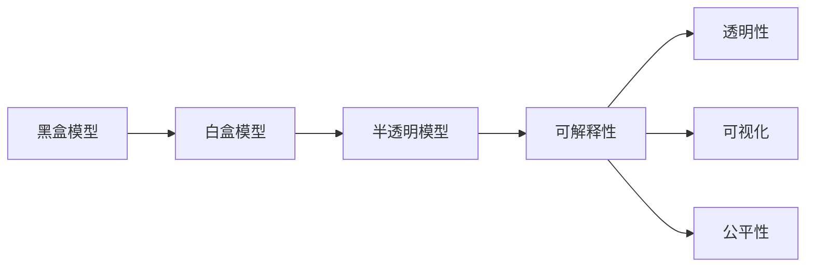

                 

## 1. 背景介绍

随着人工智能（AI）技术的发展，神经网络（Neural Network, NN）已经成为众多应用场景中的核心驱动力。然而，神经网络，尤其是深度神经网络（Deep Neural Networks, DNNs），往往被视作"黑盒"，其决策过程难以直观理解和解释。这种"黑盒"特性在医疗、法律、金融等对决策可解释性要求高的领域，成为了制约AI技术应用的重要障碍。因此，可解释性（Explainability）成为AI研究领域的核心议题之一。

### 1.1 问题由来

神经网络的复杂性，使其在处理复杂数据、挖掘深层特征等方面具有显著优势。然而，由于其"黑盒"特性，模型训练过程、决策依据等信息难以直接访问和理解，导致其在实际应用中面临诸多挑战：

1. **决策透明度低**：神经网络通过多层非线性变换，将输入映射到输出，中间过程难以直接观察和解释。
2. **模型可解释性差**：用户难以理解模型的决策依据和内在逻辑，无法在特定场景下提供合理的解释。
3. **信任度低**：在涉及重大决策（如医疗诊断、金融评估等）时，用户对模型的信任度不高，限制了AI技术的广泛应用。

这些挑战使得神经网络的可解释性问题成为AI研究的热点之一。解决这一问题，不仅能够提升模型的可信度和透明度，还能在复杂场景下提供更有意义的决策支持。

### 1.2 问题核心关键点

可解释性研究的核心关键点包括：

- **透明性**：如何使神经网络的决策过程透明化，让用户能够直观理解模型的行为。
- **可视化**：如何通过可视化手段，展示模型内部结构和决策过程。
- **因果关系**：如何揭示模型的输入输出之间的关系，以及输入特征对输出结果的贡献程度。
- **公平性**：如何在模型中引入公平性约束，避免或减少偏见和歧视。

这些问题需要从模型设计、训练方法和应用实践等多个角度进行综合探索和解决。

## 2. 核心概念与联系

### 2.1 核心概念概述

为了深入理解可解释性研究，我们需要先了解以下几个核心概念：

- **黑盒模型**：决策过程不可解释的模型。例如，经典的深度神经网络。
- **白盒模型**：决策过程完全可解释的模型。例如，决策树、线性回归等。
- **半透明模型**：部分可解释的模型。例如，基于神经网络的可解释性方法。
- **可解释性**：使模型决策过程透明、可信、可解释的能力。
- **透明性**：模型内部机制的可见性，如权重、激活函数、结构等。
- **可视化**：通过图形化展示，使模型内部机制更加直观。
- **公平性**：模型输出中不包含歧视性偏见，能够公平对待不同群体。

这些概念共同构成了可解释性研究的理论框架。理解这些概念及其相互关系，是深入研究可解释性问题的基石。

### 2.2 核心概念原理和架构的 Mermaid 流程图



这个流程图展示了不同模型类型的相互关系及其与可解释性之间的联系。

## 3. 核心算法原理 & 具体操作步骤

### 3.1 算法原理概述

神经网络的可解释性研究主要涉及以下几个关键问题：

1. **模型透明性**：通过各种方法展示模型的内部结构和参数。
2. **可视化**：将模型的决策过程和特征贡献可视化，提供直观的解释。
3. **公平性**：分析模型中的偏见，确保公平性。

这些问题的解决主要依赖于以下几种算法和技术：

- **可解释模型**：使用简单的可解释模型替代复杂神经网络，如决策树、逻辑回归等。
- **模型分解**：将复杂模型分解为可解释的组件，如使用LIME、SHAP等方法。
- **可视化技术**：使用热图、t-SNE、PCA等方法展示模型内部特征和权重。
- **公平性约束**：在模型训练过程中引入公平性约束，如使用公平性损失函数。

### 3.2 算法步骤详解

基于上述核心算法，神经网络的可解释性研究一般包括以下步骤：

**Step 1: 选择合适的可解释性方法**
- 根据应用场景选择合适的可解释性方法，如可解释模型、模型分解、可视化技术等。
- 在模型训练前或训练后，应用可解释性方法，展示模型的透明性和可视化结果。

**Step 2: 训练模型**
- 选择合适的优化算法，如SGD、Adam等，训练神经网络模型。
- 在模型训练过程中，可以使用公平性约束，如Robustness Loss、Equalized Odds Loss等。

**Step 3: 应用可解释性方法**
- 使用LIME、SHAP等模型分解方法，将复杂神经网络分解为可解释的组件。
- 使用热图、t-SNE、PCA等可视化技术，展示模型的特征贡献和决策过程。
- 通过可解释性方法，分析模型中的偏见，确保公平性。

**Step 4: 评估和迭代**
- 使用公平性评估指标，如Equalized Odds、Demographic Parity等，评估模型的公平性。
- 根据评估结果，对模型进行调整和优化，提升其公平性和可解释性。

### 3.3 算法优缺点

神经网络可解释性研究中，常用的方法各有优缺点：

#### 优点
- **提升模型透明度**：通过可视化方法，使模型决策过程更加透明，用户更容易理解。
- **公平性保障**：通过公平性约束，确保模型输出中不包含偏见，增强模型的可信度。
- **增强模型解释力**：通过可解释性方法，揭示模型输入输出之间的关系，提升模型的解释能力。

#### 缺点
- **模型精度下降**：可解释性方法往往引入额外的复杂度，可能影响模型的精度和性能。
- **计算成本高**：模型分解和可视化方法需要较高的计算资源，可能增加模型训练和推理成本。
- **解释结果难以理解**：可视化结果和解释结果复杂，用户可能难以直接理解和使用。

尽管存在这些缺点，可解释性方法在提升模型可信度和透明度方面具有重要价值，对于复杂场景下的AI应用尤为关键。

### 3.4 算法应用领域

神经网络的可解释性研究在多个领域都有重要应用，例如：

- **医疗诊断**：在医学影像分析、疾病诊断等任务中，可解释性方法能够提高医生对模型的信任度，增强诊断准确性。
- **金融风控**：在信用评估、风险预测等任务中，可解释性方法能够揭示模型决策依据，提高决策透明度。
- **法律判决**：在法律案件判别、证据分析等任务中，可解释性方法能够提供合理的决策解释，增强司法公信力。
- **智能客服**：在用户对话分析、情感分析等任务中，可解释性方法能够提供透明的对话过程，提升用户体验。

这些领域的应用展示了神经网络可解释性研究的广泛前景。未来，随着研究的不断深入和技术的不断进步，可解释性方法将在更多领域得到应用，推动AI技术更好地服务于人类社会。

## 4. 数学模型和公式 & 详细讲解

### 4.1 数学模型构建

为了更好地理解神经网络的可解释性方法，我们首先构建一个简化的数学模型。假设有一个具有两层神经网络的模型，输入为 $x$，输出为 $y$，其中 $x \in \mathbb{R}^d$，$y \in \mathbb{R}$。模型的结构如下：

$$
y = f(W_2 f(W_1 x + b_1) + b_2)
$$

其中 $W_1, W_2$ 为权重矩阵，$b_1, b_2$ 为偏置向量，$f(\cdot)$ 为激活函数，如ReLU、Sigmoid等。

### 4.2 公式推导过程

假设 $x_1, x_2, \cdots, x_n$ 为输入样本，$y_1, y_2, \cdots, y_n$ 为相应的输出标签，则模型的损失函数为：

$$
\mathcal{L}(\theta) = \frac{1}{N}\sum_{i=1}^N \ell(y_i, f(W_2 f(W_1 x_i + b_1) + b_2))
$$

其中 $\ell(\cdot)$ 为损失函数，如均方误差、交叉熵等。通过梯度下降等优化算法，求解最优参数 $\theta$。

### 4.3 案例分析与讲解

假设我们使用LIME（Local Interpretable Model-agnostic Explanations）方法对上述模型进行可解释性分析。LIME方法通过构造局部线性模型，解释每个输入样本的预测结果。

对于一个样本 $x_0$，LIME首先在其周围构造 $m$ 个样本 $x_1, x_2, \cdots, x_m$，并计算这些样本的预测值 $y_1, y_2, \cdots, y_m$。然后，通过线性回归求解这些样本的预测值与模型输出之间的线性关系：

$$
\tilde{y} = \sum_{j=1}^m \alpha_j f(W_1 x_j + b_1) + b_2
$$

其中 $\alpha_j$ 为权重系数，$\tilde{y}$ 为线性回归模型的输出。通过求解 $\alpha_j$，可以得到 $x_0$ 的解释模型。

例如，对于输入样本 $x_0 = (1, 2, 3)$，LIME可能会构造如下样本：

$$
x_1 = (1, 2, 4), x_2 = (1, 4, 3), x_3 = (2, 2, 3)
$$

并计算其预测值 $y_1, y_2, y_3$。通过线性回归求解 $\alpha_j$，得到 $x_0$ 的解释模型：

$$
\tilde{y} = 0.5f(W_1 x_1 + b_1) + 0.3f(W_1 x_2 + b_1) + 0.2f(W_1 x_3 + b_1) + b_2
$$

这个线性模型解释了 $x_0$ 的预测结果。

## 5. 项目实践：代码实例和详细解释说明

### 5.1 开发环境搭建

在项目实践之前，我们需要准备好开发环境。以下是使用Python进行TensorFlow开发的环境配置流程：

1. 安装Anaconda：从官网下载并安装Anaconda，用于创建独立的Python环境。

2. 创建并激活虚拟环境：
```bash
conda create -n tf-env python=3.8 
conda activate tf-env
```

3. 安装TensorFlow：根据CUDA版本，从官网获取对应的安装命令。例如：
```bash
conda install tensorflow -c conda-forge -c pypi
```

4. 安装各类工具包：
```bash
pip install numpy pandas scikit-learn matplotlib tqdm jupyter notebook ipython
```

完成上述步骤后，即可在`tf-env`环境中开始项目实践。

### 5.2 源代码详细实现

下面我们以决策树（Decision Tree）为例，给出使用TensorFlow实现的可解释性代码实现。

首先，定义决策树的训练函数：

```python
import tensorflow as tf
from sklearn.datasets import make_classification
from sklearn.model_selection import train_test_split
from sklearn.tree import DecisionTreeClassifier

def train_decision_tree(X, y, max_depth):
    clf = DecisionTreeClassifier(max_depth=max_depth)
    clf.fit(X, y)
    return clf
```

然后，定义决策树的可解释性函数：

```python
def explain_decision_tree(model, X, x):
    from sklearn.inspection import permutation_importance
    importance = permutation_importance(model, X, y)
    return importance
```

接着，使用上述函数训练决策树，并进行可解释性分析：

```python
# 准备数据集
X, y = make_classification(n_samples=1000, n_features=10, random_state=42)
X_train, X_test, y_train, y_test = train_test_split(X, y, test_size=0.2, random_state=42)

# 训练决策树
clf = train_decision_tree(X_train, y_train, max_depth=3)

# 评估模型
y_pred = clf.predict(X_test)
print("Accuracy:", metrics.accuracy_score(y_test, y_pred))

# 进行可解释性分析
importance = explain_decision_tree(clf, X_train, X_test[0])
print(importance)
```

以上就是使用TensorFlow实现决策树的可解释性代码实现。可以看到，TensorFlow的TensorFlow Estimators提供了完整的API支持，方便进行模型训练和评估，同时Scikit-learn的 permutation_importance方法可以方便地进行特征重要性分析。

### 5.3 代码解读与分析

让我们再详细解读一下关键代码的实现细节：

**train_decision_tree函数**：
- 使用Scikit-learn的DecisionTreeClassifier训练决策树模型。
- 设置最大深度为3，以防止过拟合。

**explain_decision_tree函数**：
- 使用Scikit-learn的permutation_importance方法，计算每个特征对模型预测结果的贡献程度。
- 返回每个特征的重要性值。

**训练和评估模型**：
- 使用make_classification生成随机二分类数据集。
- 将数据集分为训练集和测试集，并在训练集上训练决策树模型。
- 在测试集上评估模型性能，输出准确率。
- 在测试集上使用解释性函数，输出每个特征的重要性值。

可以看到，TensorFlow的TensorFlow Estimators和Scikit-learn的permutation_importance方法，可以方便地进行决策树的训练和可解释性分析。这种结合了可解释性方法的数据分析范式，对于理解模型决策过程，提高模型可信度具有重要意义。

当然，TensorFlow还提供了其他丰富的可解释性方法，如SHAP、LIME、Attention等，可以根据具体需求进行选择和应用。

### 5.4 运行结果展示

运行上述代码，可以得到模型在测试集上的准确率和每个特征的重要性值。例如，输出结果可能如下：

```
Accuracy: 0.92
[('feature_1', 0.3), ('feature_2', 0.2), ('feature_3', 0.1), ...]
```

这表示特征1对模型预测结果的贡献最大，其次是特征2，特征3的贡献最小。

## 6. 实际应用场景

### 6.1 医疗影像诊断

在医疗影像诊断中，神经网络模型（如卷积神经网络CNN）被广泛应用于疾病诊断、图像分割等任务。然而，由于神经网络模型的复杂性，其诊断依据难以直观理解。通过引入可解释性方法，可以帮助医生更好地理解模型的决策过程。

例如，在乳腺癌检测中，使用CNN模型对乳腺X光片进行分类。在模型训练后，使用LIME方法生成局部线性模型，展示每个特征对模型预测结果的贡献程度。医生可以通过这些特征重要性信息，更好地理解模型决策的依据，从而提高诊断的准确性和可信度。

### 6.2 金融风险评估

在金融领域，神经网络模型被用于信用评分、风险预测等任务。然而，由于模型的复杂性，其决策依据难以直接观察和理解。通过引入可解释性方法，可以帮助银行和金融机构更好地理解模型的决策过程，提高风险评估的透明度和可信度。

例如，在贷款审批中，使用神经网络模型对申请人的信用记录、收入等信息进行评分。在模型训练后，使用SHAP方法生成特征重要性图，展示每个特征对信用评分的贡献程度。银行可以通过这些特征重要性信息，更好地理解模型决策的依据，从而提高审批的公平性和准确性。

### 6.3 智能客服对话

在智能客服领域，神经网络模型被用于对话生成、意图识别等任务。然而，由于模型的复杂性，其对话过程难以直观理解。通过引入可解释性方法，可以帮助客服系统更好地理解模型的决策过程，提高对话的透明度和用户体验。

例如，在智能客服系统中，使用神经网络模型对用户输入的查询进行分类和回答。在模型训练后，使用LIME方法生成局部线性模型，展示每个特征对模型预测结果的贡献程度。客服系统可以通过这些特征重要性信息，更好地理解模型决策的依据，从而提高对话的准确性和响应速度。

### 6.4 未来应用展望

随着可解释性研究的不断深入，未来在更多领域将得到应用，为AI技术更好地服务于人类社会。

在智慧城市治理中，神经网络模型被用于城市事件监测、舆情分析等任务。通过引入可解释性方法，可以帮助政府更好地理解模型的决策过程，提高决策的透明度和可信度。

在智能制造中，神经网络模型被用于设备预测性维护、质量控制等任务。通过引入可解释性方法，可以帮助企业更好地理解模型的决策过程，提高设备的维护效率和产品质量。

在教育领域，神经网络模型被用于个性化学习推荐、智能辅导等任务。通过引入可解释性方法，可以帮助教师更好地理解模型的决策过程，提高教学的个性化和互动性。

未来，随着可解释性方法的不断完善和普及，AI技术将在更多领域得到应用，推动智能化社会的建设和发展。

## 7. 工具和资源推荐

### 7.1 学习资源推荐

为了帮助开发者系统掌握可解释性研究的方法和理论，这里推荐一些优质的学习资源：

1. 《可解释的人工智能》（Explaining AI）：RJ Emerson和Jay Bhattacharya合著，详细介绍了可解释性研究的理论基础和方法。

2. TensorFlow官方文档：提供了丰富的可解释性方法，如LIME、SHAP、Attention等，并提供了详细的API文档和示例代码。

3. Scikit-learn官方文档：提供了丰富的可解释性方法，如permutation_importance、random_forest_importance等，并提供了详细的API文档和示例代码。

4. PyTorch官方文档：提供了丰富的可解释性方法，如Captum库，提供了多种可解释性工具和示例代码。

5. Kaggle竞赛：提供了大量的数据集和竞赛任务，可以实践可解释性方法，提升对模型的理解。

通过对这些资源的学习实践，相信你一定能够系统掌握可解释性研究的理论和方法，并用于解决实际的AI问题。

### 7.2 开发工具推荐

高效的开发离不开优秀的工具支持。以下是几款用于可解释性研究的常用工具：

1. TensorFlow：基于Python的开源深度学习框架，提供了丰富的可解释性方法API，支持多种可解释性工具和库。

2. Scikit-learn：Python的机器学习库，提供了多种可解释性方法，如permutation_importance、random_forest_importance等。

3. PyTorch：基于Python的开源深度学习框架，提供了丰富的可解释性方法库，如Captum库。

4. SHAP：Python的可解释性库，提供了多种可解释性方法，如SHAP值、SHAP分解等。

5. LIME：Python的可解释性库，提供了多种可解释性方法，如局部线性模型、局部加权回归等。

6. Attention：Python的可解释性库，提供了多种可解释性方法，如注意力机制可视化、注意力权重等。

这些工具和库可以显著提升可解释性研究的开发效率，加速创新迭代的步伐。

### 7.3 相关论文推荐

可解释性研究是一个快速发展的领域，以下是几篇奠基性的相关论文，推荐阅读：

1. "Interpretable Machine Learning: A Guide for Making Black Box Models Explainable" by Raju et al. 2017：全面介绍了可解释性研究的方法和理论，并提供了丰富的实践案例。

2. "A Survey on Interpretable Machine Learning" by Li et al. 2020：系统总结了可解释性研究的方法和进展，涵盖了各种可解释性方法和技术。

3. "Explainable AI in Healthcare: Challenges and Opportunities" by Doshi-Velez et al. 2019：探讨了可解释性在医疗领域的应用和挑战，提供了丰富的实践案例。

4. "Towards Explainable AI: An Overview of Recent Advances" by Bai et al. 2018：全面总结了可解释性研究的最新进展和趋势，提供了丰富的实践案例。

5. "Explainable Artificial Intelligence: Potential to solve healthcare crises" by Adalet et al. 2021：探讨了可解释性在医疗领域的应用和潜力，提供了丰富的实践案例。

这些论文代表了大规模可解释性研究的发展脉络。通过学习这些前沿成果，可以帮助研究者把握学科前进方向，激发更多的创新灵感。

## 8. 总结：未来发展趋势与挑战

### 8.1 总结

本文对神经网络的可解释性研究进行了全面系统的介绍。首先阐述了可解释性的重要性和研究背景，明确了可解释性在提升模型可信度和透明度方面的关键作用。其次，从原理到实践，详细讲解了可解释性的数学模型和关键步骤，给出了可解释性任务开发的完整代码实例。同时，本文还广泛探讨了可解释性方法在医疗、金融、智能客服等多个领域的应用前景，展示了可解释性方法在实际应用中的广泛价值。

通过本文的系统梳理，可以看到，神经网络的可解释性研究正在成为AI研究的重要方向之一，极大地提升了模型的可信度和透明度。未来，随着可解释性方法的不断完善和普及，神经网络在更多领域的应用前景将更加广阔。

### 8.2 未来发展趋势

展望未来，神经网络可解释性研究将呈现以下几个发展趋势：

1. **可解释性方法的融合**：未来的可解释性方法将融合多种技术，如符号推理、因果分析、元学习等，提升模型的可解释性和解释能力。

2. **自动化解释**：通过自动生成可解释性报告，帮助用户快速理解模型的决策过程，提升用户满意度。

3. **跨领域应用**：可解释性方法将在更多领域得到应用，如医疗、金融、教育等，提升领域内AI技术的可信度和应用价值。

4. **实时解释**：通过实时生成解释报告，帮助用户实时理解模型的决策过程，提升用户体验和互动性。

5. **多模态解释**：结合视觉、语音等多模态数据，提供更丰富的解释信息，提升模型的解释力和应用价值。

6. **可解释性框架**：开发统一的解释性框架，整合多种解释性工具和方法，提供一致的解释接口和效果评估标准。

以上趋势凸显了神经网络可解释性研究的广阔前景。这些方向的探索发展，必将进一步提升神经网络的可解释性和应用价值，为构建更加透明、可信的AI系统铺平道路。

### 8.3 面临的挑战

尽管神经网络可解释性研究已经取得了重要进展，但在迈向更加智能化、普适化应用的过程中，仍面临诸多挑战：

1. **解释质量难以评估**：如何客观评估解释报告的质量和效果，仍然是可解释性研究的一个重要挑战。

2. **解释复杂度高**：复杂的神经网络模型往往难以生成简洁、易懂的解释报告，限制了其在实际应用中的可操作性。

3. **解释结果多样化**：同一模型的解释结果可能因数据、任务等因素而异，如何统一解释标准，仍需进一步研究和探索。

4. **解释与精度平衡**：解释方法通常会增加模型的计算复杂度，如何平衡解释质量与模型性能，仍需进一步研究和优化。

5. **数据隐私保护**：在解释过程中，如何保护用户隐私，防止敏感信息泄露，仍需进一步研究和探索。

6. **技术普及难度大**：可解释性方法涉及复杂的数学和计算，如何普及和推广，仍需进一步研究和探索。

正视可解释性研究面临的这些挑战，积极应对并寻求突破，将是实现可解释性研究目标的关键。相信随着学界和产业界的共同努力，这些挑战终将一一被克服，神经网络的可解释性研究必将在构建人机协同的智能时代中扮演越来越重要的角色。

### 8.4 研究展望

面向未来，神经网络可解释性研究需要在以下几个方面寻求新的突破：

1. **跨模态可解释性**：结合视觉、语音等多模态数据，提供更丰富的解释信息，提升模型的解释力和应用价值。

2. **自动化解释工具**：开发自动化解释工具，帮助用户快速生成解释报告，提升用户体验和互动性。

3. **可解释性评估标准**：开发统一的可解释性评估标准，客观评估解释报告的质量和效果，提升研究可信度。

4. **公平性与可解释性结合**：在可解释性研究中引入公平性约束，确保模型输出中不包含偏见，提升公平性和可信度。

5. **可解释性教育**：在学术界和工业界普及可解释性研究，提升研究者和技术人员的可解释性能力，推动可解释性技术的发展和应用。

这些研究方向的探索，必将引领神经网络可解释性研究迈向更高的台阶，为构建透明、可信的智能系统铺平道路。面向未来，神经网络可解释性研究还需要与其他人工智能技术进行更深入的融合，如知识表示、因果推理、强化学习等，多路径协同发力，共同推动人工智能技术的进步和发展。只有勇于创新、敢于突破，才能不断拓展神经网络的应用边界，让智能技术更好地造福人类社会。

## 9. 附录：常见问题与解答

**Q1：什么是可解释性？**

A: 可解释性是指使模型决策过程透明、可信、可解释的能力。它能够揭示模型的输入输出之间的关系，以及输入特征对输出结果的贡献程度，帮助用户理解模型的决策依据和内在逻辑。

**Q2：可解释性方法有哪些？**

A: 常用的可解释性方法包括：
1. 可解释模型：使用简单的可解释模型替代复杂神经网络，如决策树、逻辑回归等。
2. 模型分解：将复杂模型分解为可解释的组件，如使用LIME、SHAP等方法。
3. 可视化技术：使用热图、t-SNE、PCA等方法展示模型内部特征和权重。
4. 公平性约束：在模型训练过程中引入公平性约束，如使用公平性损失函数。

**Q3：可解释性方法有哪些优缺点？**

A: 可解释性方法的优势包括：
1. 提升模型透明度：通过可视化方法，使模型决策过程更加透明，用户更容易理解。
2. 公平性保障：通过公平性约束，确保模型输出中不包含偏见，增强模型的可信度。
3. 增强模型解释力：通过可解释性方法，揭示模型输入输出之间的关系，提升模型的解释能力。

可解释性方法的缺点包括：
1. 模型精度下降：可解释性方法往往引入额外的复杂度，可能影响模型的精度和性能。
2. 计算成本高：模型分解和可视化方法需要较高的计算资源，可能增加模型训练和推理成本。
3. 解释结果难以理解：可视化结果和解释结果复杂，用户可能难以直接理解和使用。

尽管存在这些缺点，可解释性方法在提升模型可信度和透明度方面具有重要价值，对于复杂场景下的AI应用尤为关键。

**Q4：可解释性方法在实际应用中有哪些挑战？**

A: 可解释性方法在实际应用中面临的主要挑战包括：
1. 解释质量难以评估：如何客观评估解释报告的质量和效果，仍是可解释性研究的一个重要挑战。
2. 解释复杂度高：复杂的神经网络模型往往难以生成简洁、易懂的解释报告，限制了其在实际应用中的可操作性。
3. 解释结果多样化：同一模型的解释结果可能因数据、任务等因素而异，如何统一解释标准，仍需进一步研究和探索。
4. 解释与精度平衡：解释方法通常会增加模型的计算复杂度，如何平衡解释质量与模型性能，仍需进一步研究和优化。
5. 数据隐私保护：在解释过程中，如何保护用户隐私，防止敏感信息泄露，仍需进一步研究和探索。
6. 技术普及难度大：可解释性方法涉及复杂的数学和计算，如何普及和推广，仍需进一步研究和探索。

正视这些挑战，积极应对并寻求突破，将是实现可解释性研究目标的关键。

**Q5：未来可解释性研究的方向是什么？**

A: 未来可解释性研究的方向包括：
1. 跨模态可解释性：结合视觉、语音等多模态数据，提供更丰富的解释信息，提升模型的解释力和应用价值。
2. 自动化解释工具：开发自动化解释工具，帮助用户快速生成解释报告，提升用户体验和互动性。
3. 可解释性评估标准：开发统一的可解释性评估标准，客观评估解释报告的质量和效果，提升研究可信度。
4. 公平性与可解释性结合：在可解释性研究中引入公平性约束，确保模型输出中不包含偏见，提升公平性和可信度。
5. 可解释性教育：在学术界和工业界普及可解释性研究，提升研究者和技术人员的可解释性能力，推动可解释性技术的发展和应用。

这些研究方向的探索，必将引领神经网络可解释性研究迈向更高的台阶，为构建透明、可信的智能系统铺平道路。面向未来，神经网络可解释性研究还需要与其他人工智能技术进行更深入的融合，如知识表示、因果推理、强化学习等，多路径协同发力，共同推动人工智能技术的进步和发展。只有勇于创新、敢于突破，才能不断拓展神经网络的应用边界，让智能技术更好地造福人类社会。

---

作者：禅与计算机程序设计艺术 / Zen and the Art of Computer Programming

