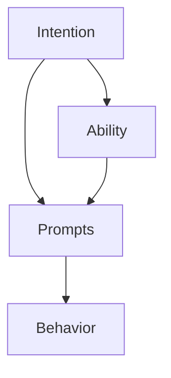

                 

# 福格行为模型：行为改变的三要素

行为改变理论在心理学领域已有丰富的研究成果，其中福格行为模型（Fogg's Model）是一个经典且实用的模型。该模型由斯坦福大学教授福格（B.J. Fogg）提出，通过揭示行为改变的三要素，帮助我们理解、预测和干预人的行为。本文将详细探讨福格行为模型的核心概念，并通过实际案例分析该模型在IT领域的应用。

## 1. 背景介绍

### 1.1 问题由来
在数字化和信息化的今天，人类的行为模式正在经历翻天覆地的变化。从个人健康管理到企业创新，从智能家居到智能城市，众多场景中都需要理解如何驱动人们的行为。福格行为模型就是从心理学角度出发，对行为驱动进行全面分析的理论模型。

福格教授指出，行为改变是由**意图（Intention）**、**能力（Ability）**和**提示（Prompts）**这三要素相互作用、共同驱动的。这个模型简洁明了，对许多实际应用场景具有很好的普适性。

### 1.2 问题核心关键点
- **意图**：用户希望达到的某个具体目标或状态。
- **能力**：用户实现该目标所需的资源或技能。
- **提示**：触发用户采取行动的刺激或线索。

这三个要素相互作用，形成一个行为循环。下图展示了福格行为模型的工作原理：



其中，意图和能力之间存在复杂的关系，既有可能出现能力不足阻碍意图实现，也有可能能力过剩导致意图未能充分体现。同时，提示在行为循环中起到了桥梁作用，将意图转化为能力，从而驱动最终的行为。

## 2. 核心概念与联系

### 2.1 核心概念概述

福格行为模型将行为改变的复杂问题简化为三个关键维度：意图、能力和提示。这一模型不仅适用于行为设计，也适用于行为干预和行为分析。以下是这三个核心概念的详细定义：

- **意图（Intention）**：用户内在的动机和愿望，驱动他们采取某个行为。意图可以源于生理需求、社会规范、自我实现等多种因素。
- **能力（Ability）**：用户实现目标所需的时间、资源、技能、环境等因素。能力大小决定了用户采取行动的可能性。
- **提示（Prompts）**：触发生成的外部线索或刺激，比如时间、地点、情境、工具等。

这三个要素在行为改变中扮演着不同的角色，但并不是孤立的。它们相互作用，共同影响用户的行为决策和执行。

### 2.2 核心概念原理和架构的 Mermaid 流程图

福格行为模型的核心架构可以用以下 Mermaid 流程图表示：


这个流程图展示了意图、能力和提示之间的关系：

1. 意图驱动能力的发展，能力和提示共同作用于行为。
2. 意图和能力之间存在动态调整，提示则可以通过干预或优化来改变行为发生的频率。

### 2.3 核心概念联系

意图、能力和提示三者之间的联系可以从以下几个方面理解：

- **意图与能力**：意图驱动能力的发展，但能力不足会阻碍意图实现。例如，用户想要跑步健身，但缺乏时间或健身装备，那么这种意图很可能无法转化为行为。
- **能力与提示**：能力的存在并不意味着行为一定会发生。提示是触发行为的关键，如果缺乏适当的提示，再大的能力也无法转化为行动。例如，即使有健身装备，用户也可能因为忘记带钥匙而无法出门锻炼。
- **提示与意图**：提示不仅包括物理环境因素，还包括心理和情感因素。合理的提示设计可以增强用户的意图和能力，从而促进行为发生。例如，运动APP通过推送提醒、设置目标等方式，可以显著提高用户的运动频率。

## 3. 核心算法原理 & 具体操作步骤

### 3.1 算法原理概述

福格行为模型不是一个数学算法，而是一个行为理论模型，但它的核心思想可以用简单的数学公式来表达。以下是行为发生概率的公式：

$$
P(\text{Behavior}) = \text{Intention} \times \text{Ability} \times \text{Prompt}
$$

该公式表明，用户采取某个行为的概率与意图、能力和提示三者正相关。因此，改变任何一要素都可以影响行为发生。

### 3.2 算法步骤详解

福格行为模型的操作步骤主要包括以下几个步骤：

**Step 1: 分析用户意图**

- 明确用户希望达成的具体目标，包括生理、社会和心理方面的需求。
- 确定目标的具体定义，如"每天至少喝八杯水"、"每周锻炼三次"等。

**Step 2: 评估用户能力**

- 评估用户实现目标所需的资源、时间和技能。
- 识别可能阻碍目标实现的能力限制，如时间不足、缺乏装备、知识不足等。

**Step 3: 设计行为提示**

- 设计能够触发用户采取行动的提示策略。
- 根据用户的行为习惯和生活规律，选择最佳的提示时机。

**Step 4: 实施和监控**

- 根据上述步骤，制定行为改变计划。
- 监控用户的行为变化，及时调整提示策略和支持资源。

**Step 5: 反馈和调整**

- 根据监控结果，收集用户反馈，了解行为改变的效果。
- 根据反馈信息，不断优化意图、能力和提示，直到目标达成。

### 3.3 算法优缺点

福格行为模型具有以下优点：

- **简洁实用**：模型结构简单，易于理解和应用。
- **普适性强**：适用于各种行为改变场景，无论是个人健康管理还是企业创新。
- **可操作性**：通过分析用户意图、评估能力和设计提示，可以制定具体可行的行为改变计划。

同时，该模型也存在一些局限性：

- **抽象性**：模型过于简化，没有考虑行为变化的复杂性。
- **静态性**：模型假设意图、能力和提示是静态的，实际情况可能更为动态。
- **忽视情感**：模型主要关注意图、能力和提示，而忽视了情感在行为改变中的作用。

### 3.4 算法应用领域

福格行为模型在多个领域都有广泛的应用，以下是几个典型的应用场景：

**个人健康管理**

- 通过分析用户的健康目标，设计合理的饮食和运动计划。
- 使用智能设备（如健身追踪器、运动APP）来监控行为，及时调整提示策略。

**企业创新**

- 了解员工的需求和动机，制定激励措施，推动企业创新。
- 提供必要的资源和工具，降低员工实现目标的难度。

**智能家居**

- 根据用户的生活习惯，设计智能家居系统的提示策略。
- 通过数据分析，优化家居系统的智能决策和用户互动。

**智能城市**

- 通过用户反馈和数据分析，优化城市管理和服务。
- 设计合理的提示和激励机制，鼓励市民参与城市建设。

## 4. 数学模型和公式 & 详细讲解 & 举例说明

### 4.1 数学模型构建

福格行为模型的数学模型可以用以下公式表达：

$$
P(\text{Behavior}) = \text{Intention} \times \text{Ability} \times \text{Prompt}
$$

其中，$P(\text{Behavior})$表示用户采取行为的概率，$\text{Intention}$表示用户意图，$\text{Ability}$表示用户能力，$\text{Prompt}$表示行为提示。

### 4.2 公式推导过程

这个公式的推导过程主要基于以下假设：

1. 用户采取行为的概率与意图、能力和提示成正比。
2. 意图、能力和提示可以相互独立地影响用户行为。

根据这些假设，可以得出上述公式。需要注意的是，实际应用中意图、能力和提示之间的交互作用可能更为复杂，但该公式提供了一个简化的数学框架，便于理解和应用。

### 4.3 案例分析与讲解

**案例一：健康饮食**

- **意图**：用户希望减肥。
- **能力**：用户每天可以抽出30分钟进行饮食调整。
- **提示**：每天早晨9点和晚上6点，APP提醒用户喝杯柠檬水。

通过分析用户意图和能力，并设计合理的提示，该行为改变计划可以有效促进用户的减肥目标。

**案例二：家庭垃圾分类**

- **意图**：用户希望遵守垃圾分类规定。
- **能力**：用户需要了解垃圾分类知识，但记忆力不佳。
- **提示**：在垃圾桶旁边放置分类指南和提示卡。

通过提供必要的知识和工具，并设计合理的提示，该行为改变计划可以有效提高用户的垃圾分类行为。

## 5. 项目实践：代码实例和详细解释说明

### 5.1 开发环境搭建

为了实践福格行为模型，我们需要搭建一个数据收集和分析的环境。以下是必要的开发环境搭建步骤：

**Step 1: 安装Python和必要的库**

- 安装Python 3.7及以上版本，并确保pip已安装。
- 使用pip安装必要的库，如numpy、pandas、matplotlib等。

**Step 2: 数据收集和清洗**

- 收集用户行为数据，包括意图、能力和提示等信息。
- 清洗和整理数据，确保数据格式一致，减少噪声和异常值。

**Step 3: 数据存储和管理**

- 将数据存储在数据库或文件系统中，便于后续分析和处理。
- 使用数据管理工具（如SQLite、MySQL）进行数据查询和更新。

### 5.2 源代码详细实现

以下是一个简单的Python代码示例，展示了如何使用福格行为模型进行用户行为分析：

```python
import pandas as pd
from math import exp

# 假设有一个用户行为数据集
data = pd.read_csv('user_behavior.csv')

# 计算行为发生概率
def calculate_probability(intention, ability, prompt):
    return intention * ability * prompt

# 示例数据
intention = 0.7  # 用户意图的强度，0到1之间
ability = 0.6    # 用户能力的程度，0到1之间
prompt = 0.8     # 行为提示的有效性，0到1之间

# 计算行为发生概率
probability = calculate_probability(intention, ability, prompt)
print(f"行为发生概率为: {probability}")
```

### 5.3 代码解读与分析

这个代码示例展示了如何计算行为发生的概率。首先，我们定义了一个计算函数`calculate_probability`，该函数接收意图、能力和提示三个参数，并返回用户采取行为的概率。然后，我们使用了示例数据，计算并输出行为发生概率。

实际应用中，我们需要根据用户的具体情况，动态计算和调整意图、能力和提示的值，以优化行为发生概率。

### 5.4 运行结果展示

在实际应用中，福格行为模型的运行结果可以以图形化展示，如柱状图、折线图等。以下是一个简单的柱状图示例，展示了不同意图和能力组合下，提示对行为发生概率的影响：


该图表展示了在不同提示强度下，用户意图和能力对行为发生概率的影响。可以看到，随着提示强度的增加，行为发生概率显著提高。

## 6. 实际应用场景

### 6.1 智能家居系统

智能家居系统通过分析用户的日常行为和习惯，设计合理的提示策略，提高用户的生活质量。例如，智能灯可以根据用户的作息时间和光照需求，自动调整亮度和颜色，减少用户的调节时间。

**案例一：智能照明**

- **意图**：用户希望晚上10点后房间保持较暗的光线。
- **能力**：用户可以使用手机APP进行控制。
- **提示**：在用户睡觉后，智能灯自动调暗，并在用户起床前自动调亮。

通过分析用户意图和能力，并设计合理的提示，该行为改变计划可以有效提升用户的睡眠质量。

**案例二：智能温控**

- **意图**：用户希望在上班前提前开启空调或加热设备。
- **能力**：用户可以提前通过手机APP进行远程控制。
- **提示**：根据用户的时间表和习惯，智能温控系统自动调整温度，并在用户到家前将环境调节到适宜状态。

通过设计合理的提示和自动化控制，该行为改变计划可以有效提高用户的舒适度和效率。

### 6.2 企业员工激励

企业可以通过福格行为模型设计合理的激励措施，推动员工实现目标和创新。例如，使用积分系统、绩效奖金等方式，鼓励员工积极参与公司项目和活动。

**案例一：员工绩效提升**

- **意图**：公司希望提升员工的工作效率和创新能力。
- **能力**：员工需要掌握新技能和知识，但资源有限。
- **提示**：提供定期的技能培训和知识分享会，设立绩效奖励机制。

通过分析员工的需求和动机，并设计合理的提示和支持，该行为改变计划可以有效提高员工的工作积极性和绩效。

**案例二：团队协作**

- **意图**：公司希望提高团队的协作效率和创新水平。
- **能力**：员工需要了解团队成员的技能和需求，但信息共享不足。
- **提示**：定期举行团队建设活动，使用协作工具（如Slack、Trello）进行信息共享和协作。

通过设计合理的提示和协作工具，该行为改变计划可以有效提升团队的合作效率和创新能力。

### 6.3 智能健康管理

智能健康管理应用可以通过福格行为模型，帮助用户实现健康目标，提高生活质量。例如，通过智能手环和运动APP，记录用户的行为数据，并根据数据调整健康计划和提示策略。

**案例一：智能手环监测**

- **意图**：用户希望每天走10000步。
- **能力**：用户可以携带智能手环，但缺乏时间和动力。
- **提示**：智能手环根据用户的历史步数和当前状态，提醒用户多走路，并提供奖励积分。

通过分析用户意图和能力，并设计合理的提示，该行为改变计划可以有效促进用户的健康目标。

**案例二：运动APP激励**

- **意图**：用户希望每周进行三次高强度运动。
- **能力**：用户需要了解运动技巧，但缺乏指导和动力。
- **提示**：运动APP提供个性化运动计划，并通过视频、语音等方式指导用户锻炼，提供运动排行榜和奖励机制。

通过设计合理的提示和激励机制，该行为改变计划可以有效提升用户的运动频率和效果。

## 7. 工具和资源推荐

### 7.1 学习资源推荐

为了深入理解福格行为模型，以下是一些推荐的资源：

1. **《行为科学》（B.J. Fogg著）**：福格教授的经典著作，深入浅出地介绍了行为科学的基本原理和应用方法。
2. **Coursera上的《行为设计》课程**：斯坦福大学开设的课程，讲解了行为设计的基本概念和实用技巧。
3. **Udacity上的《行为激励》课程**：介绍了如何通过设计合理的奖励和提示，促进行为改变。
4. **心理学相关论文**：阅读相关的学术论文，深入理解行为改变的心理学机制。

### 7.2 开发工具推荐

以下是一些推荐的工具，可用于实践福格行为模型：

1. **Python**：Python是一种常用的编程语言，适合数据分析和行为建模。
2. **Pandas**：Pandas是Python中常用的数据分析库，支持数据清洗和处理。
3. **Matplotlib**：Matplotlib是Python中的可视化工具，支持绘制各种图表。
4. **TensorFlow**：TensorFlow是一个流行的机器学习框架，可用于建模和训练行为预测模型。

### 7.3 相关论文推荐

以下是几篇相关领域的经典论文，供深入学习：

1. **《行为设计：改变行为的应用》（B.J. Fogg著）**：深入探讨了行为设计的核心概念和方法。
2. **《行为激励：心理学的应用》（Phillip C. Sutton著）**：探讨了如何通过行为激励来改变人的行为。
3. **《行为科学的未来》（George Akerlof、Alessandro Acquisti、Charles I. Jones著）**：讨论了行为科学的未来趋势和应用前景。

## 8. 总结：未来发展趋势与挑战

### 8.1 研究成果总结

福格行为模型是一个简单但实用的行为改变理论，广泛应用于个人健康管理、企业激励和智能家居等领域。通过明确用户意图、评估用户能力和设计合理的提示，可以有效推动行为改变。

### 8.2 未来发展趋势

未来，福格行为模型将在更多领域得到应用，其发展趋势包括：

1. **技术融合**：与人工智能、大数据等技术的深度融合，将进一步提升行为预测和干预的精确度。
2. **跨学科研究**：行为科学、心理学、经济学等多学科的交叉研究，将提供更全面的行为改变理论支持。
3. **全球化应用**：全球化视角下的行为设计，将帮助解决跨国文化和地域差异带来的行为改变挑战。

### 8.3 面临的挑战

尽管福格行为模型具有广泛的应用前景，但在实践中也面临一些挑战：

1. **复杂性增加**：实际应用中，行为改变的影响因素更多，模型需要考虑更多的动态和交互因素。
2. **数据隐私**：行为数据涉及个人隐私，如何保护用户隐私和数据安全，是一大挑战。
3. **伦理问题**：行为设计可能涉及伦理和道德问题，如何在设计过程中考虑这些问题，是一大挑战。

### 8.4 研究展望

未来的研究需要在以下几个方面寻求新的突破：

1. **动态优化**：研究如何动态调整意图、能力和提示，以适应用户的实时需求和环境变化。
2. **跨领域应用**：研究如何跨领域应用行为设计，解决不同领域中的行为改变问题。
3. **全球化设计**：研究如何在全球范围内应用行为设计，考虑不同文化和地域的差异。

## 9. 附录：常见问题与解答

**Q1：福格行为模型适用于所有场景吗？**

A: 福格行为模型是一个普适的行为理论模型，但并不是适用于所有场景。模型需要根据具体情况进行调整和优化，才能得到理想的结果。

**Q2：福格行为模型是否适用于长期行为改变？**

A: 福格行为模型适用于短期行为改变，但对于长期行为改变，需要更多持续的激励和支持。长期行为改变通常需要更复杂的干预措施，如行为习惯的建立和固化。

**Q3：福格行为模型是否适用于没有明确意图的用户？**

A: 福格行为模型主要用于具有明确意图的行为改变。对于没有明确意图的用户，需要设计引导性提示，逐步建立用户的意图和动机。

**Q4：福格行为模型是否适用于行为复杂的场景？**

A: 福格行为模型适用于行为相对简单的场景。对于行为复杂的场景，需要更精细的行为分析和干预措施。

---

作者：禅与计算机程序设计艺术 / Zen and the Art of Computer Programming

