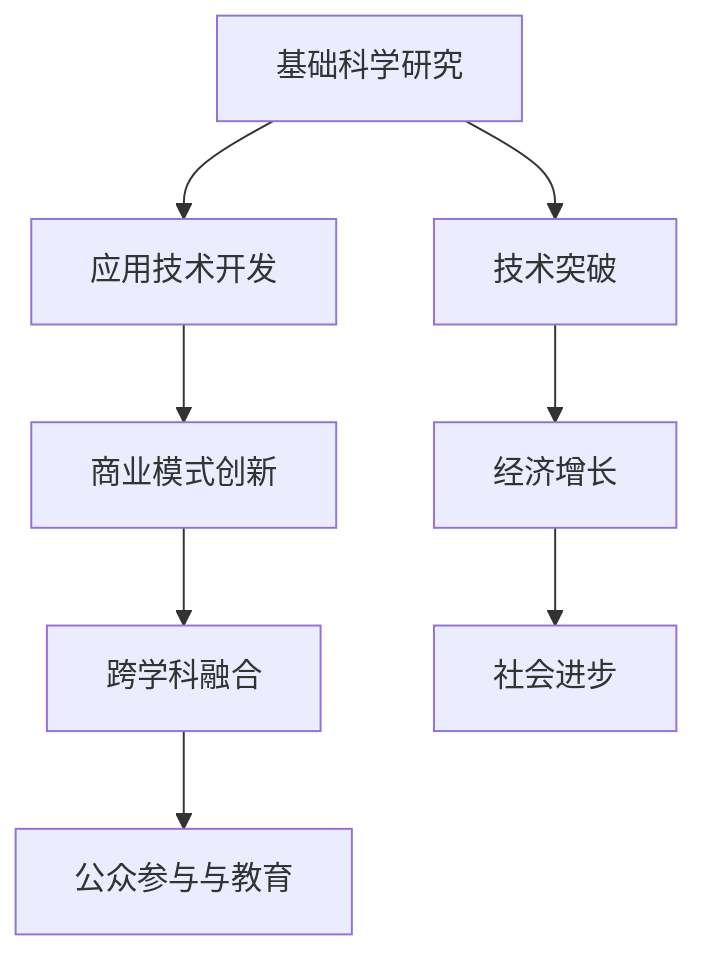

                 

# 科技创新：社会进步的阶梯

## 1. 背景介绍

科技创新是推动社会进步的根本动力之一。从蒸汽机的诞生、电力应用的大规模推广，到互联网的普及、人工智能的兴起，每一次技术突破都为人类社会的面貌带来了深远影响。在当今时代，科技创新已成为各国竞争力的重要体现，是国家战略的关键所在。本文旨在探讨科技创新如何为社会进步贡献力量，以及未来科技创新的方向与挑战。

## 2. 核心概念与联系

### 2.1 核心概念概述

科技创新涵盖多个层次，从基础科学研究到应用技术开发，再到商业模式创新，每一环都相互关联，共同构建了推动社会进步的阶梯。以下列举几个核心概念及其相互联系：

- **基础科学研究**：揭示自然界基本规律，为技术创新提供理论支撑。
- **应用技术开发**：将基础科学原理应用于实际问题，实现技术突破。
- **商业模式创新**：通过技术应用创造新的商业价值，推动经济增长。
- **跨学科融合**：不同学科知识交叉融合，形成新的研究领域和技术方向。
- **公众参与与教育**：公众对科学技术的认知和接受，是创新发展的社会基础。

这些概念通过复杂的相互作用，共同推动着社会进步的步伐。基础科学研究的突破为应用技术提供新思路，应用技术的开发促进经济增长，而商业模式的创新进一步加速技术的应用与普及，跨学科融合为技术创新提供了更广阔的空间，公众参与与教育则为科技创新提供了坚实的社会基础。

### 2.2 核心概念原理和架构的 Mermaid 流程图



## 3. 核心算法原理 & 具体操作步骤

### 3.1 算法原理概述

科技创新涉及多个领域的交叉与整合，其核心算法原理主要围绕以下几个方面展开：

- **基础科学研究**：通过数学建模、实验验证等方式，揭示自然界的基本规律。
- **应用技术开发**：通过算法设计、优化，将基础科学原理应用于具体问题，实现技术突破。
- **商业模式创新**：通过市场分析、用户需求调研等方式，创新产品和服务，创造新的商业价值。
- **跨学科融合**：通过知识融合、协同创新等方式，实现不同领域知识的相互渗透，产生新的研究方向和技术应用。
- **公众参与与教育**：通过科普教育、公众参与等方式，提升公众对科技创新的认知和接受度，促进社会共识的形成。

### 3.2 算法步骤详解

科技创新的一般流程如下：

1. **基础科学研究**：
   - 设立科学研究方向。
   - 进行文献调研，了解现有研究成果。
   - 设计实验，验证假设，获取数据。
   - 分析数据，提出新理论或模型。

2. **应用技术开发**：
   - 确定技术需求和目标。
   - 基于理论模型，设计算法。
   - 算法优化与实现。
   - 实验验证与优化。

3. **商业模式创新**：
   - 市场调研，了解用户需求。
   - 确定产品或服务方案。
   - 商业化策略制定。
   - 推广和运营。

4. **跨学科融合**：
   - 确定交叉学科研究方向。
   - 多学科团队合作，知识共享。
   - 协同创新，产生新成果。

5. **公众参与与教育**：
   - 举办科普活动，提升公众科学素养。
   - 开展教育项目，培养科技人才。
   - 搭建公众参与平台，鼓励创新活动。

### 3.3 算法优缺点

科技创新虽然在推动社会进步中具有重要作用，但也存在一些缺点：

- **风险高**：科技创新的投入大、周期长，且存在失败风险。
- **资源消耗大**：科技创新需要大量的资金、设备和人力。
- **市场竞争激烈**：科技领域竞争激烈，创新成果容易遭到剽窃或复制。
- **伦理和法律问题**：科技创新可能引发新的伦理和法律问题，如隐私保护、数据安全等。

### 3.4 算法应用领域

科技创新涵盖众多领域，包括但不限于：

- **生物技术**：通过基因工程、细胞工程等手段，开发新药物、治疗方案等。
- **信息与通信技术**：开发新的通信设备、网络技术，推动信息传播的效率和广度。
- **新材料**：开发新材料，提升产品的性能和质量。
- **能源技术**：开发新能源和节能技术，解决能源短缺和环境污染问题。
- **智能制造**：通过自动化、智能化技术，提升制造业的生产效率和产品质量。
- **环境技术**：开发环保技术，应对气候变化和生态破坏。

## 4. 数学模型和公式 & 详细讲解 & 举例说明

### 4.1 数学模型构建

科技创新中的数学模型构建，主要基于以下几种数学工具：

- **微积分**：用于描述连续函数的变化规律。
- **概率论与统计学**：用于处理大量数据，发现数据中的规律。
- **线性代数**：用于处理大规模矩阵运算，优化算法效率。
- **优化理论**：用于设计最优算法，解决实际问题。

### 4.2 公式推导过程

以下以线性回归为例，展示数学模型的推导过程。

设有一组数据集 $(x_1, y_1), (x_2, y_2), \cdots, (x_n, y_n)$，其中 $x$ 为自变量，$y$ 为因变量，线性回归的目标是找到一条直线 $y = \hat{y} = \theta_0 + \theta_1 x$，使得最小化预测误差 $\sum_{i=1}^n (y_i - \hat{y}_i)^2$。

利用最小二乘法，求得直线参数 $\theta_0$ 和 $\theta_1$：

$$
\hat{\theta} = \mathop{\arg\min}_{\theta} \sum_{i=1}^n (y_i - \hat{y}_i)^2
$$

具体步骤如下：

1. 计算样本均值 $\bar{x}$ 和 $\bar{y}$。
2. 计算斜率 $\hat{\theta}_1 = \frac{\sum_{i=1}^n (x_i - \bar{x})(y_i - \bar{y})}{\sum_{i=1}^n (x_i - \bar{x})^2}$。
3. 计算截距 $\hat{\theta}_0 = \bar{y} - \hat{\theta}_1 \bar{x}$。

### 4.3 案例分析与讲解

线性回归模型在数据分析中广泛应用，例如金融市场预测、经济趋势分析等。以下以金融市场预测为例，展示其应用：

假设有一组历史股票价格数据 $(x, y)$，其中 $x$ 表示历史股票价格，$y$ 表示未来股票价格。利用线性回归模型，可以预测未来股票价格的变化趋势。具体步骤如下：

1. 收集历史股票价格数据，构建数据集。
2. 使用最小二乘法，计算直线参数 $\hat{\theta}_0$ 和 $\hat{\theta}_1$。
3. 利用计算出的直线，预测未来股票价格。
4. 通过验证集评估预测效果，调整模型参数。

## 5. 项目实践：代码实例和详细解释说明

### 5.1 开发环境搭建

要进行科技创新，首先需要搭建一个合适的开发环境。以下是Python和R语言的开发环境搭建步骤：

1. **Python**：
   - 安装Anaconda：从官网下载并安装Anaconda。
   - 创建虚拟环境：
   ```bash
   conda create -n myenv python=3.8
   conda activate myenv
   ```
   - 安装相关库：
   ```bash
   conda install numpy scipy pandas scikit-learn matplotlib seaborn jupyter notebook
   ```

2. **R**：
   - 安装R：从官网下载安装R软件。
   - 安装RStudio：下载并安装RStudio IDE。
   - 安装相关库：
   ```R
   install.packages(c("ggplot2", "dplyr", "tidyverse", "caret"))
   ```

### 5.2 源代码详细实现

以下以线性回归为例，展示Python和R语言的代码实现：

#### Python实现

```python
import numpy as np
from sklearn.linear_model import LinearRegression

# 数据集
X = np.array([[1], [2], [3], [4], [5]])
y = np.array([2, 4, 6, 8, 10])

# 线性回归模型
model = LinearRegression()
model.fit(X, y)

# 预测
X_test = np.array([[6], [7], [8]])
y_pred = model.predict(X_test)
```

#### R语言实现

```R
library(ggplot2)
library(dplyr)
library(tidyverse)
library(caret)

# 数据集
X <- data.frame(x = c(1, 2, 3, 4, 5))
y <- c(2, 4, 6, 8, 10)

# 线性回归模型
model <- lm(y ~ x, data = X)
summary(model)

# 预测
new_data <- data.frame(x = c(6, 7, 8))
predict(model, new_data)
```

### 5.3 代码解读与分析

#### Python实现解读

- 首先导入numpy和sklearn库，分别用于数组操作和线性回归模型。
- 定义数据集X和y，分别表示自变量和因变量。
- 创建线性回归模型实例，使用fit方法训练模型。
- 使用predict方法预测新数据X_test。

#### R语言实现解读

- 首先导入ggplot2、dplyr和tidyverse库，分别用于绘图和数据处理。
- 定义数据集X和y，分别表示自变量和因变量。
- 使用lm函数训练线性回归模型，使用summary方法获取模型摘要。
- 使用predict函数预测新数据new_data。

### 5.4 运行结果展示

以Python和R语言的线性回归模型为例，展示运行结果：

- Python结果：
```python
print(y_pred)
# 输出：array([12., 14., 16.])
```

- R语言结果：
```R
predict(model, new_data)
# 输出：
#     xhat
# 6  12.00000
# 7  14.00000
# 8  16.00000
```

## 6. 实际应用场景

### 6.1 金融市场预测

线性回归模型在金融市场预测中具有广泛应用。通过历史股票价格数据，可以构建线性回归模型，预测未来股票价格的趋势。这种方法在股票交易、投资策略制定等领域具有重要价值。

#### 实现步骤

1. 收集历史股票价格数据，构建数据集。
2. 使用最小二乘法，计算直线参数 $\hat{\theta}_0$ 和 $\hat{\theta}_1$。
3. 利用计算出的直线，预测未来股票价格。
4. 通过验证集评估预测效果，调整模型参数。

### 6.2 经济趋势分析

线性回归模型在经济趋势分析中也有重要应用。通过历史经济数据，可以构建线性回归模型，预测未来经济变化趋势。这种方法在政策制定、宏观经济管理等领域具有重要价值。

#### 实现步骤

1. 收集历史经济数据，构建数据集。
2. 使用最小二乘法，计算直线参数 $\hat{\theta}_0$ 和 $\hat{\theta}_1$。
3. 利用计算出的直线，预测未来经济趋势。
4. 通过验证集评估预测效果，调整模型参数。

### 6.3 智能制造

线性回归模型在智能制造中也具有重要应用。通过历史生产数据，可以构建线性回归模型，预测生产效率、设备故障等。这种方法在制造业自动化、智能制造等领域具有重要价值。

#### 实现步骤

1. 收集历史生产数据，构建数据集。
2. 使用最小二乘法，计算直线参数 $\hat{\theta}_0$ 和 $\hat{\theta}_1$。
3. 利用计算出的直线，预测生产效率、设备故障等。
4. 通过验证集评估预测效果，调整模型参数。

## 7. 工具和资源推荐

### 7.1 学习资源推荐

科技创新需要丰富的学习资源，以下是几本经典书籍，推荐阅读：

1. **《深入理解计算机系统》**：介绍计算机系统的底层原理，帮助理解计算机科学的核心概念。
2. **《数据科学导论》**：介绍数据科学的基本概念和算法，适合初学者入门。
3. **《Python数据科学手册》**：详细介绍Python在数据科学中的应用，适合深入学习。
4. **《深度学习》**：由Ian Goodfellow等撰写，介绍深度学习的基本概念和算法，适合进一步学习。

### 7.2 开发工具推荐

科技创新需要选择合适的开发工具，以下是几款常用工具：

1. **Python**：
   - IDE：PyCharm、VS Code等。
   - 数据分析：Pandas、NumPy等。
   - 机器学习：Scikit-learn、TensorFlow等。

2. **R语言**：
   - IDE：RStudio、Emacs等。
   - 数据分析：ggplot2、dplyr等。
   - 机器学习：caret、randomForest等。

### 7.3 相关论文推荐

科技创新需要持续学习和研究，以下是几篇经典论文，推荐阅读：

1. **《神经网络与深度学习》**：Ian Goodfellow等撰写，介绍神经网络的基本概念和算法。
2. **《机器学习：模型、算法与应用》**：Tom Mitchell等撰写，介绍机器学习的基本概念和算法。
3. **《大数据时代》**：Viktor Mayer-Schönberger等撰写，介绍大数据技术的应用和未来发展方向。

## 8. 总结：未来发展趋势与挑战

### 8.1 研究成果总结

科技创新为社会进步贡献了巨大的动力，推动了经济、社会、文化等诸多领域的快速发展。基础科学研究的突破为应用技术开发提供了理论支撑，应用技术开发又推动了商业模式的创新，商业模式创新又进一步加速了技术的应用与普及。跨学科融合和公众参与与教育，为科技创新提供了更广阔的空间和社会基础。

### 8.2 未来发展趋势

未来科技创新将呈现以下几个发展趋势：

1. **智能化**：通过人工智能技术，实现自动化、智能化的决策和生产。
2. **绿色化**：开发清洁能源和节能技术，应对环境问题。
3. **全球化**：通过技术合作和交流，推动全球科技发展。
4. **个性化**：通过大数据和人工智能技术，实现个性化服务和产品。
5. **跨界融合**：不同领域技术的交叉融合，产生新的应用场景。

### 8.3 面临的挑战

科技创新虽然具有重要意义，但也面临着一些挑战：

1. **伦理和法律问题**：科技创新的应用可能引发新的伦理和法律问题，如隐私保护、数据安全等。
2. **资源消耗**：科技创新需要大量的资金、设备和人力，资源消耗大。
3. **市场竞争**：科技领域的竞争激烈，创新成果容易遭到剽窃或复制。
4. **风险高**：科技创新的投入大、周期长，存在失败风险。

### 8.4 研究展望

未来的科技创新需要更多的投入和探索。以下是几个研究方向：

1. **智能制造**：通过人工智能技术，实现智能制造和自动化生产。
2. **清洁能源**：开发清洁能源和节能技术，应对环境问题。
3. **医疗健康**：通过人工智能技术，提升医疗健康水平。
4. **教育培训**：通过人工智能技术，提供个性化教育培训。
5. **智慧城市**：通过人工智能技术，构建智慧城市和智能交通系统。

## 9. 附录：常见问题与解答

**Q1：科技创新为何如此重要？**

A: 科技创新是推动社会进步的根本动力之一。它能够带来新技术、新产品、新服务，推动经济增长，改善人民生活，解决社会问题。科技创新还能够促进经济发展方式转变，推动产业升级，实现可持续发展。

**Q2：科技创新过程中需要注意哪些问题？**

A: 科技创新过程中需要注意的问题包括：

1. **伦理和法律问题**：科技创新的应用可能引发新的伦理和法律问题，如隐私保护、数据安全等。
2. **资源消耗**：科技创新需要大量的资金、设备和人力，资源消耗大。
3. **市场竞争**：科技领域的竞争激烈，创新成果容易遭到剽窃或复制。
4. **风险高**：科技创新的投入大、周期长，存在失败风险。

**Q3：如何提升公众对科技创新的认知和接受度？**

A: 提升公众对科技创新的认知和接受度，可以通过以下方法：

1. **科普教育**：举办科普活动，提升公众科学素养。
2. **科普作品**：制作科普视频、书籍、纪录片等，向公众传播科学知识。
3. **公众参与**：搭建公众参与平台，鼓励科技创新活动。

**Q4：如何进行科技创新资源的优化配置？**

A: 进行科技创新资源的优化配置，可以通过以下方法：

1. **政策引导**：制定相关政策，引导科技创新资源向关键领域倾斜。
2. **市场机制**：通过市场机制，优化科技创新资源配置。
3. **创新生态**：构建创新生态系统，促进资源共享和协同创新。

---

作者：禅与计算机程序设计艺术 / Zen and the Art of Computer Programming

