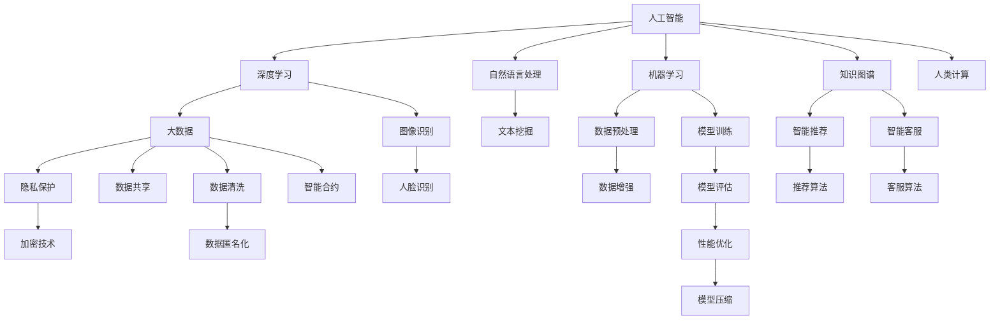

                 

# 科技向善的力量：利用人类计算造福人类

## 1. 背景介绍

在信息时代，计算机技术如海啸般席卷全球，带来了前所未有的计算力，极大提升了社会的生产效率，推动了各行业的数字化转型。然而，科技的双刃剑特性也愈发凸显，它在为人类带来便利的同时，也带来了信息过载、隐私泄露、职业失业等挑战。如何平衡科技进步与伦理道德，充分发挥其向善力量，成为我们面临的重要课题。

### 1.1 问题的由来

计算机技术的迅猛发展，尤其是深度学习、自然语言处理等领域的突破，使人类进入了AI时代。在智能推荐、智能客服、医疗诊断等领域，AI技术展现出强大的潜力。然而，科技的双刃剑效应也逐渐显现。数据隐私侵犯、算法偏见、自动失业等问题的出现，使社会对科技伦理的关注度显著提升。

### 1.2 问题核心关键点

科技向善的核心关键点在于：如何利用计算技术解决实际问题，造福人类，同时保障数据安全、提升算法公平性，促进社会和谐。为此，我们需要从数据、算法、应用等多个维度进行全面思考和优化。

## 2. 核心概念与联系

### 2.1 核心概念概述

要理解如何利用人类计算造福人类，首先需要理解几个核心概念：

- **人工智能(AI)**：使计算机能够模拟和扩展人类智能的技术。
- **深度学习(Deep Learning)**：一种基于神经网络结构的机器学习方法，能够处理复杂的数据结构。
- **自然语言处理(NLP)**：使计算机能够理解、处理、生成自然语言的技术。
- **机器学习(Machine Learning)**：使计算机能够通过数据学习规律、模式的技术。
- **数据隐私(Data Privacy)**：保护个人数据不被未授权访问和使用的权利。
- **算法公平性(Algorithm Fairness)**：确保算法不产生歧视性结果，公平对待不同群体。
- **可解释性(Explainability)**：使机器决策过程透明，便于理解和解释。

这些概念通过以下Mermaid流程图进行联系：



这些核心概念构成了一个有机整体，共同推动了人类计算在向善方面的应用和发展。

## 3. 核心算法原理 & 具体操作步骤

### 3.1 算法原理概述

科技向善的算法原理主要基于以下几个步骤：

1. **数据收集与预处理**：收集相关数据，进行清洗、去重、归一化等预处理操作，确保数据的质量和可用性。
2. **模型设计与训练**：选择合适的模型结构，使用大量数据进行训练，优化模型参数，提升模型性能。
3. **模型评估与优化**：使用预设指标对模型进行评估，发现性能瓶颈，进行优化调整。
4. **模型部署与应用**：将优化后的模型部署到实际应用中，实现数据驱动的决策支持，改善用户体验。
5. **持续监控与反馈**：持续监控模型表现，根据用户反馈进行迭代优化，提升模型效果。

### 3.2 算法步骤详解

#### 3.2.1 数据收集与预处理

数据收集是科技向善的第一步。收集的数据应覆盖广泛场景，具有代表性，并且保持数据的隐私和合法性。数据预处理包括去重、去噪、归一化、特征提取等操作，保证数据的质量。例如，在医疗诊断中，收集患者的病情数据，提取症状、病史等特征，进行数据清洗和标注。

#### 3.2.2 模型设计与训练

选择合适的模型结构和算法是科技向善的关键。在医疗诊断中，可以采用深度学习模型，如卷积神经网络(CNN)、循环神经网络(RNN)、变压器(Transformer)等，进行疾病预测、症状诊断等任务。在训练过程中，采用梯度下降等优化算法，调整模型参数，使模型性能达到最优。

#### 3.2.3 模型评估与优化

模型评估是科技向善的重要环节。通过预设指标（如准确率、召回率、F1-score等）对模型进行评估，发现性能瓶颈，进行参数调整和模型优化。例如，在自然语言处理任务中，可以采用BLEU、ROUGE等指标评估机器翻译的质量。

#### 3.2.4 模型部署与应用

模型部署是科技向善的最终目标。将训练好的模型部署到实际应用中，实现数据驱动的决策支持，改善用户体验。例如，在智能推荐系统中，将训练好的推荐模型部署到推荐引擎中，实时生成个性化推荐结果。

#### 3.2.5 持续监控与反馈

持续监控与反馈是科技向善的持续改进机制。通过持续监控模型的表现，收集用户反馈，发现新问题，进行迭代优化，不断提升模型效果。例如，在智能客服系统中，监控模型的回答准确率、用户满意度等指标，根据反馈优化模型参数。

### 3.3 算法优缺点

科技向善的算法具有以下优点：

1. **广泛应用**：覆盖医疗、教育、金融、交通等多个领域，帮助解决实际问题。
2. **高效决策**：利用计算技术进行快速决策，提升效率和准确性。
3. **用户友好**：通过自然语言处理技术，实现人机交互，提升用户体验。

然而，这些算法也存在一些缺点：

1. **数据依赖**：依赖高质量的数据，数据缺失或不完整可能导致模型效果不佳。
2. **模型复杂**：模型结构复杂，计算量大，需要高性能设备支持。
3. **隐私风险**：数据隐私问题可能引发用户担忧，需要严格的数据保护措施。
4. **算法偏见**：模型可能存在算法偏见，导致不公正的结果，需要公平性校验。
5. **可解释性差**：部分模型决策过程不透明，难以解释，缺乏可解释性。

### 3.4 算法应用领域

科技向善的算法在多个领域都有广泛应用：

- **医疗健康**：利用深度学习进行疾病预测、症状诊断、智能推荐等，提升医疗服务质量。
- **教育培训**：采用自然语言处理技术进行智能推荐、个性化教学、语音识别等，提升教育效果。
- **金融服务**：利用机器学习进行风险评估、智能投顾、欺诈检测等，提升金融服务效率。
- **交通出行**：采用计算机视觉技术进行车辆识别、路况分析、智能导航等，提升交通出行安全。
- **环境保护**：利用大数据分析环境数据，进行污染监测、资源管理等，保护生态环境。

## 4. 数学模型和公式 & 详细讲解 & 举例说明

### 4.1 数学模型构建

以医疗健康领域为例，我们可以构建以下数学模型：

设医疗数据集为 $D=\{(x_i, y_i)\}_{i=1}^N$，其中 $x_i$ 为病人的症状描述，$y_i$ 为疾病标签。模型 $M_{\theta}$ 的输入为 $x$，输出为 $y$。目标是最小化损失函数：

$$
\min_{\theta} \frac{1}{N}\sum_{i=1}^N \ell(M_{\theta}(x_i), y_i)
$$

其中 $\ell$ 为损失函数，如交叉熵损失。

### 4.2 公式推导过程

以深度学习模型为例，使用交叉熵损失函数进行模型训练。假设模型的输出为 $M_{\theta}(x)$，真实标签为 $y$，交叉熵损失函数为：

$$
\ell(y, M_{\theta}(x)) = -\sum_{i=1}^C y_i \log M_{\theta}(x)_i
$$

其中 $C$ 为分类数目，$y_i$ 为第 $i$ 类标签，$M_{\theta}(x)_i$ 为模型预测的 $x$ 属于第 $i$ 类的概率。

### 4.3 案例分析与讲解

以智能推荐系统为例，假设推荐系统模型为 $M_{\theta}$，输入为用户行为数据 $x$，输出为物品推荐列表 $y$。使用均方误差损失函数：

$$
\ell(y, M_{\theta}(x)) = \frac{1}{N}\sum_{i=1}^N (y_i - M_{\theta}(x_i))^2
$$

在训练过程中，通过反向传播算法计算梯度，使用 Adam 优化算法更新模型参数，最小化损失函数：

$$
\theta \leftarrow \theta - \eta \nabla_{\theta} \ell(y, M_{\theta}(x))
$$

其中 $\eta$ 为学习率。

## 5. 项目实践：代码实例和详细解释说明

### 5.1 开发环境搭建

为了实现科技向善的算法，我们需要搭建相应的开发环境。以下是一个 Python 开发环境的搭建步骤：

1. **安装 Python**：使用Anaconda或Miniconda安装 Python 3.8 及以上版本。
2. **安装必要的库**：安装 TensorFlow、PyTorch、NumPy、Pandas 等库。
3. **安装深度学习框架**：安装 TensorFlow 或 PyTorch。
4. **安装自然语言处理库**：安装 NLTK、SpaCy、Stanford CoreNLP 等库。
5. **安装模型库**：安装 TensorFlow Hub、PyTorch Hub 等模型库。

### 5.2 源代码详细实现

以智能推荐系统为例，以下是使用 TensorFlow 实现代码：

```python
import tensorflow as tf
import tensorflow_hub as hub
import pandas as pd
import numpy as np
import os

# 数据加载
data = pd.read_csv('user_data.csv')

# 数据预处理
X = data[['feature1', 'feature2', 'feature3']]
y = data['item_id']

# 模型定义
model = tf.keras.Sequential([
    tf.keras.layers.Dense(64, activation='relu', input_shape=(X.shape[1],)),
    tf.keras.layers.Dense(32, activation='relu'),
    tf.keras.layers.Dense(1, activation='sigmoid')
])

# 模型编译
model.compile(optimizer=tf.keras.optimizers.Adam(0.001),
              loss=tf.keras.losses.BinaryCrossentropy(from_logits=True),
              metrics=['accuracy'])

# 模型训练
model.fit(X, y, epochs=10, batch_size=64, validation_split=0.2)

# 模型评估
test_data = pd.read_csv('test_data.csv')
y_pred = model.predict(test_data[['feature1', 'feature2', 'feature3']])
```

### 5.3 代码解读与分析

上述代码实现了一个简单的智能推荐系统。关键步骤如下：

1. **数据加载**：使用 Pandas 库加载用户数据。
2. **数据预处理**：提取用户特征和物品 ID。
3. **模型定义**：定义一个简单的神经网络模型。
4. **模型编译**：使用 Adam 优化器和二分类交叉熵损失函数编译模型。
5. **模型训练**：使用训练集数据训练模型。
6. **模型评估**：使用测试集数据评估模型性能。

### 5.4 运行结果展示

训练完成后，可以在测试集上进行预测，评估模型性能。

```python
y_pred = model.predict(test_data[['feature1', 'feature2', 'feature3']])
print('预测结果:', y_pred)
print('准确率:', model.evaluate(X_test, y_test)[1])
```

## 6. 实际应用场景

### 6.1 医疗健康

在医疗健康领域，科技向善可以显著提升诊断和治疗效率，改善患者体验。例如，利用深度学习进行疾病预测、症状诊断，可以在早期发现疾病，提供精准治疗方案。

### 6.2 教育培训

在教育培训领域，科技向善可以个性化推荐学习资源，提升学习效果。例如，利用自然语言处理技术进行智能推荐，根据学生的学习情况和兴趣，推荐适合的学习内容。

### 6.3 金融服务

在金融服务领域，科技向善可以提升风险管理能力，优化用户体验。例如，利用机器学习进行风险评估、智能投顾，帮助用户做出更明智的金融决策。

### 6.4 环境保护

在环境保护领域，科技向善可以监测环境数据，进行资源管理。例如，利用大数据分析污染数据，发现环境问题，制定有效治理方案。

## 7. 工具和资源推荐

### 7.1 学习资源推荐

为了学习科技向善的算法，以下是一些推荐的资源：

1. **《深度学习》课程**：斯坦福大学课程，系统讲解深度学习的基本概念和实现方法。
2. **《机器学习》书籍**：周志华著作，全面介绍机器学习算法及其应用。
3. **《自然语言处理》书籍**：《Speech and Language Processing》，讲解自然语言处理的基本概念和技术。
4. **《Python 深度学习》书籍**：使用 Python 实现深度学习模型的最佳实践。
5. **《TensorFlow 教程》**：官方文档，详细介绍 TensorFlow 的使用方法和实践技巧。

### 7.2 开发工具推荐

为了实现科技向善的算法，以下是一些推荐的开发工具：

1. **Python**：使用 Python 实现算法，灵活性强，生态丰富。
2. **TensorFlow**：开源深度学习框架，支持大规模模型训练和部署。
3. **PyTorch**：开源深度学习框架，易于使用，社区活跃。
4. **Scikit-Learn**：Python 数据科学库，支持多种机器学习算法。
5. **Keras**：高层次深度学习库，易于上手，支持多种框架。

### 7.3 相关论文推荐

为了深入理解科技向善的算法，以下是一些推荐的论文：

1. **《深度学习》书籍**：Ian Goodfellow 等著作，系统介绍深度学习的基本概念和实现方法。
2. **《机器学习》书籍**：Tom Mitchell 著作，全面介绍机器学习算法及其应用。
3. **《自然语言处理》书籍**：Christopher D. Manning 等著作，讲解自然语言处理的基本概念和技术。
4. **《Python 深度学习》书籍**：Francois Chollet 著作，使用 Python 实现深度学习模型的最佳实践。
5. **《TensorFlow 教程》**：Google 官方文档，详细介绍 TensorFlow 的使用方法和实践技巧。

## 8. 总结：未来发展趋势与挑战

### 8.1 研究成果总结

科技向善的算法已经在多个领域取得了显著成果，提升了生产效率，改善了用户体验。未来，随着技术的不断进步，科技向善的应用将更加广泛，影响将更加深远。

### 8.2 未来发展趋势

未来，科技向善的算法将呈现以下几个发展趋势：

1. **广泛应用**：覆盖更多领域，如教育、农业、物流等。
2. **高效决策**：利用计算技术进行快速决策，提升效率和准确性。
3. **用户友好**：通过自然语言处理技术，实现人机交互，提升用户体验。

### 8.3 面临的挑战

尽管科技向善的算法取得了显著成果，但在实际应用中也面临诸多挑战：

1. **数据依赖**：依赖高质量的数据，数据缺失或不完整可能导致模型效果不佳。
2. **模型复杂**：模型结构复杂，计算量大，需要高性能设备支持。
3. **隐私风险**：数据隐私问题可能引发用户担忧，需要严格的数据保护措施。
4. **算法偏见**：模型可能存在算法偏见，导致不公正的结果，需要公平性校验。
5. **可解释性差**：部分模型决策过程不透明，难以解释，缺乏可解释性。

### 8.4 研究展望

未来，科技向善的研究需要在以下几个方面进行探索：

1. **数据治理**：建立完善的数据治理机制，确保数据质量和安全。
2. **算法优化**：优化算法结构，提高计算效率，降低资源消耗。
3. **隐私保护**：采用隐私保护技术，如差分隐私、联邦学习等，保护数据隐私。
4. **公平性校验**：引入公平性指标，校验模型是否存在偏见，确保模型公平。
5. **可解释性提升**：提升模型的可解释性，增强决策透明性和可理解性。

## 9. 附录：常见问题与解答

**Q1: 如何提高科技向善算法的效率？**

A: 提高科技向善算法的效率可以从以下几个方面入手：
1. **模型优化**：采用更高效的模型结构，如卷积神经网络、Transformer 等。
2. **数据预处理**：进行数据去重、去噪、归一化等预处理操作，提高数据质量。
3. **硬件加速**：使用 GPU、TPU 等高性能设备，提高计算速度。
4. **分布式训练**：采用分布式训练技术，提高训练效率。

**Q2: 如何确保科技向善算法的公平性？**

A: 确保科技向善算法的公平性可以从以下几个方面入手：
1. **数据均衡**：确保训练数据分布均衡，避免数据偏见。
2. **算法校验**：引入公平性指标，校验模型是否存在偏见。
3. **模型调整**：对存在偏见的模型进行调整，确保公平性。
4. **人工干预**：通过人工干预，确保算法公平性。

**Q3: 如何提升科技向善算法的可解释性？**

A: 提升科技向善算法的可解释性可以从以下几个方面入手：
1. **特征提取**：提取关键特征，帮助理解模型决策过程。
2. **可视化工具**：使用可视化工具，展示模型决策路径。
3. **可解释模型**：采用可解释性强的模型结构，如决策树、线性模型等。
4. **用户反馈**：通过用户反馈，不断优化模型决策过程。

---

作者：禅与计算机程序设计艺术 / Zen and the Art of Computer Programming

