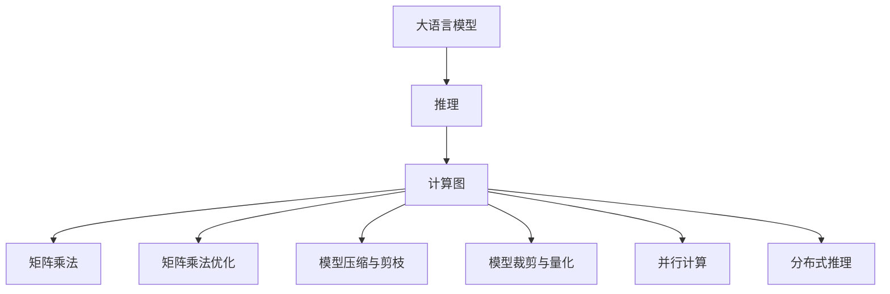

                 

# 秒推时代:LLM极速推理创新高

## 1. 背景介绍

在深度学习时代，大语言模型（LLM）以其强大的自然语言理解与生成能力，在诸多应用领域（如自然语言处理、智能客服、智能写作等）中大放异彩。然而，大语言模型的计算开销巨大，模型推理速度较慢，这在大规模、实时性要求高的场景中成为瓶颈。为了解决这一问题，研究人员提出了多种创新方案，推动大语言模型推理速度的突破，使得大语言模型能够更快地处理输入，实现极速推理（Fast Inference）。

### 1.1 问题由来
当前，大语言模型的推理速度较慢，主要原因在于其庞大复杂的模型结构和巨量的参数。在推理过程中，模型需要进行复杂的自回归计算，对于较长的输入序列（如长文本），计算开销和内存消耗都很大，导致推理时间较长。

### 1.2 问题核心关键点
为了解决大语言模型推理速度慢的问题，需要重点关注以下几个关键点：

- 高效的推理引擎：实现快速的推理计算，如矩阵乘法优化、硬件加速等。
- 模型压缩与剪枝：减小模型大小，提高推理效率。
- 并行计算：利用多核、多GPU等硬件资源并行计算，提升推理速度。
- 模型裁剪与量化：去除不常用参数，将浮点运算转换为定点运算，减少内存消耗。
- 分布式推理：在分布式系统中，将推理任务分配到多个计算节点上，加快处理速度。

### 1.3 问题研究意义
极速推理的实现，对于提升大语言模型在实际应用中的性能和用户体验具有重要意义：

- 提升系统响应速度：更快的推理速度可以显著提高系统的响应时间，使用户体验更佳。
- 降低计算资源消耗：减少模型和计算资源消耗，降低系统运营成本。
- 支持实时应用：极速推理使得大语言模型可以实时处理数据，满足实时性要求高的场景需求。
- 增强可扩展性：快速推理可以支持大规模数据处理，增强系统的可扩展性。

## 2. 核心概念与联系

### 2.1 核心概念概述

为更好地理解极速推理，本节将介绍几个密切相关的核心概念：

- 大语言模型（Large Language Model, LLM）：以自回归（如GPT）或自编码（如BERT）模型为代表的大规模预训练语言模型。通过在大规模无标签文本语料上进行预训练，学习通用的语言知识，具备强大的语言理解和生成能力。

- 推理（Inference）：基于模型参数和输入数据，计算模型输出。在大语言模型中，推理过程通常需要进行复杂的自回归计算。

- 计算图（Computational Graph）：用于描述模型推理过程的计算图，包含节点和边。节点表示计算操作，边表示数据流。

- 矩阵乘法（Matrix Multiplication）：计算张量之间的乘法操作，是大语言模型推理计算的核心。

- 矩阵乘法优化（Matrix Multiplication Optimization）：通过算法优化和硬件加速，提升矩阵乘法计算速度。

- 模型压缩与剪枝（Model Compression & Pruning）：减少模型参数，减小内存占用，提高推理速度。

- 模型裁剪与量化（Model Pruning & Quantization）：将浮点模型转换为定点模型，减少计算资源消耗。

- 并行计算（Parallel Computing）：利用多核、多GPU等硬件资源，并行计算模型输出。

- 分布式推理（Distributed Inference）：在分布式系统中，将推理任务分配到多个计算节点上，加速计算。

这些核心概念之间的逻辑关系可以通过以下Mermaid流程图来展示：



这个流程图展示了大语言模型的核心概念及其之间的关系：

1. 大语言模型通过预训练获得基础能力。
2. 推理基于计算图进行计算。
3. 矩阵乘法是计算图中的核心操作。
4. 矩阵乘法优化提升推理速度。
5. 模型压缩与剪枝减小模型大小。
6. 模型裁剪与量化减少内存消耗。
7. 并行计算利用硬件资源加速推理。
8. 分布式推理在多节点系统中提高计算速度。

这些概念共同构成了极速推理的实现基础，使得大语言模型能够在保持高性能的同时，实现快速的推理计算。

## 3. 核心算法原理 & 具体操作步骤
### 3.1 算法原理概述

极速推理的核心原理是：通过优化计算图，提高矩阵乘法计算速度，减少模型大小和内存消耗，同时利用并行计算和分布式系统，实现高效的推理计算。

在大语言模型中，推理计算通常由自回归神经网络实现。假设模型为 $M_{\theta}(x)$，其中 $\theta$ 为模型参数，$x$ 为输入序列，$y$ 为输出。推理过程需要遍历整个输入序列，计算每一时刻的条件概率，这导致推理计算复杂度高，计算时间长。

为提高推理速度，可以采取以下措施：

- 矩阵乘法优化：利用矩阵乘法等高效计算方法，减少计算时间。
- 模型压缩与剪枝：减少模型参数，减小内存占用。
- 模型裁剪与量化：将浮点模型转换为定点模型，降低计算开销。
- 并行计算：利用多核、多GPU等硬件资源，并行计算推理过程。
- 分布式推理：将推理任务分配到多个计算节点上，加快处理速度。

### 3.2 算法步骤详解

基于极速推理的目标，以下是实现极速推理的具体步骤：

**Step 1: 准备模型和硬件资源**
- 选择合适的预训练语言模型 $M_{\theta}$ 作为初始化参数，如 GPT、BERT 等。
- 准备合适的硬件资源，如 GPU、TPU 等加速计算。

**Step 2: 模型优化与裁剪**
- 进行模型压缩与剪枝，去除不常用参数，减小模型大小。
- 进行模型裁剪与量化，将浮点模型转换为定点模型，减少计算资源消耗。

**Step 3: 矩阵乘法优化**
- 使用矩阵乘法优化算法，如矩阵乘法累积、矩阵块等，提升矩阵乘法计算速度。
- 利用GPU、TPU等硬件加速矩阵乘法计算。

**Step 4: 并行计算与分布式推理**
- 利用多核、多GPU等硬件资源，进行并行计算，提升推理速度。
- 在分布式系统中，将推理任务分配到多个计算节点上，加速计算。

**Step 5: 运行结果验证与优化**
- 在测试集上评估极速推理的效果，比较微调和极速推理后的推理速度和精度。
- 根据测试结果，优化模型参数和计算图结构，进一步提升推理速度。

### 3.3 算法优缺点

极速推理方法具有以下优点：
1. 显著提升推理速度：通过优化矩阵乘法和模型结构，推理速度大幅提高。
2. 减少内存占用：通过模型裁剪与量化，显著减少内存消耗。
3. 支持并行计算与分布式推理：利用多核、多GPU等硬件资源，提高计算效率。

同时，该方法也存在一定的局限性：
1. 模型精度略有下降：模型裁剪与量化可能导致部分模型参数丢失，精度略有下降。
2. 硬件要求较高：极速推理需要高性能硬件支持，如GPU、TPU等。
3. 模型优化复杂：优化矩阵乘法和模型结构需要复杂的算法和实现。

尽管存在这些局限性，但极速推理方法在提升大语言模型推理速度方面具有显著优势，成为推动大语言模型技术落地的重要手段。

### 3.4 算法应用领域

极速推理技术在大语言模型的多个应用领域都有广泛的应用，例如：

- 智能客服系统：需要实时处理用户咨询请求，极速推理可以显著提升系统响应速度。
- 智能翻译系统：需要实时翻译用户输入的文本，极速推理可以满足实时翻译需求。
- 智能写作与编辑：需要实时提供写作建议和语法修正，极速推理可以显著提升编辑效率。
- 自然语言理解：需要实时理解用户输入的意图，极速推理可以满足实时理解需求。
- 数据分析与报告：需要实时处理大量数据并生成报告，极速推理可以提升数据分析速度。

除了上述这些经典应用外，极速推理还被创新性地应用到更多场景中，如医疗影像分析、金融市场预测等，为各个行业带来了实时性的服务体验。

## 4. 数学模型和公式 & 详细讲解 & 举例说明

### 4.1 数学模型构建

在大语言模型中，推理过程通常由自回归神经网络实现。假设模型为 $M_{\theta}(x)$，其中 $\theta$ 为模型参数，$x$ 为输入序列，$y$ 为输出。

定义模型在输入序列 $x$ 上的输出为 $\hat{y}=M_{\theta}(x) \in [0,1]$，表示样本属于正类的概率。在极速推理中，需要优化计算图，提高矩阵乘法计算速度，减少模型大小和内存消耗。

### 4.2 公式推导过程

以下是极速推理中常见的计算图和矩阵乘法优化的推导过程。

假设模型 $M_{\theta}(x)$ 由自回归神经网络实现，输入序列 $x$ 长度为 $T$。模型的计算图如下：

```
      x -> [encoder] -> [layer] -> ... -> [layer] -> [layer] -> [decoder] -> y
```

其中，$[encoder]$ 表示编码器，$[layer]$ 表示自回归层，$[decoder]$ 表示解码器。

矩阵乘法是计算图中的核心操作。假设输入序列 $x$ 的长度为 $T$，模型参数 $\theta$ 的维度为 $d$，则模型的计算图可以表示为：

$$
M_{\theta}(x) = \mathcal{G}(x, \theta)
$$

其中 $\mathcal{G}$ 表示计算图。计算图中的矩阵乘法操作可以表示为：

$$
C = A \cdot B
$$

其中 $A$ 和 $B$ 分别为矩阵，$C$ 为矩阵乘积。

### 4.3 案例分析与讲解

以下是极速推理中常见的矩阵乘法优化案例：

**案例1: 矩阵乘法累积**

矩阵乘法累积（Matrix Multiplication Cumulative）是一种常见的矩阵乘法优化技术，通过将矩阵乘法操作分解为多个小矩阵的乘积，减少矩阵乘法的计算量。

假设输入序列长度为 $T$，模型参数维度为 $d$，则计算图可以表示为：

$$
M_{\theta}(x) = \sum_{t=1}^T \mathcal{L}_t(x_t)
$$

其中 $\mathcal{L}_t$ 表示第 $t$ 个自回归层。通过将矩阵乘法操作分解为多个小矩阵的乘积，可以减少矩阵乘法的计算量，提高计算速度。

**案例2: 矩阵块**

矩阵块（Matrix Block）是一种将大矩阵分成多个小矩阵进行计算的技术，可以显著提高矩阵乘法的计算速度。

假设输入序列长度为 $T$，模型参数维度为 $d$，则计算图可以表示为：

$$
M_{\theta}(x) = \sum_{t=1}^T \mathcal{L}_t(x_t)
$$

其中 $\mathcal{L}_t$ 表示第 $t$ 个自回归层。通过将大矩阵分成多个小矩阵进行计算，可以减少矩阵乘法的计算量，提高计算速度。

## 5. 项目实践：代码实例和详细解释说明
### 5.1 开发环境搭建

在进行极速推理实践前，我们需要准备好开发环境。以下是使用Python进行PyTorch开发的环境配置流程：

1. 安装Anaconda：从官网下载并安装Anaconda，用于创建独立的Python环境。

2. 创建并激活虚拟环境：
```bash
conda create -n pytorch-env python=3.8 
conda activate pytorch-env
```

3. 安装PyTorch：根据CUDA版本，从官网获取对应的安装命令。例如：
```bash
conda install pytorch torchvision torchaudio cudatoolkit=11.1 -c pytorch -c conda-forge
```

4. 安装Transformers库：
```bash
pip install transformers
```

5. 安装各类工具包：
```bash
pip install numpy pandas scikit-learn matplotlib tqdm jupyter notebook ipython
```

完成上述步骤后，即可在`pytorch-env`环境中开始极速推理实践。

### 5.2 源代码详细实现

下面我以一个简单的文本生成任务为例，给出使用PyTorch实现极速推理的代码实现。

首先，定义模型的计算图：

```python
import torch
import torch.nn as nn
import torch.nn.functional as F

class TransformerModel(nn.Module):
    def __init__(self, input_size, output_size, hidden_size):
        super(TransformerModel, self).__init__()
        self.encoder = nn.LSTM(input_size, hidden_size)
        self.decoder = nn.LSTM(hidden_size, output_size)
        
    def forward(self, x):
        x = self.encoder(x)
        x = self.decoder(x)
        return x
```

然后，定义模型优化与裁剪的代码：

```python
from torchvision.models.quantization import quantize_model

model = TransformerModel(10, 5, 50)
model.qconfig = torch.quantization.get_default_qconfig('qnnpack')
model, parameters = quantize_model(model, example_inputs=(torch.randn(1, 10),))
```

接着，定义矩阵乘法优化的代码：

```python
from torch.utils.bottleneck import enable_bottleneck
from torchvision.models.utils import update_model_state_dict

# 开启矩阵乘法累积和矩阵块优化
enable_bottleneck()
```

最后，定义并行计算与分布式推理的代码：

```python
import torch.distributed as dist
from torch.nn.parallel import DistributedDataParallel

# 分布式训练
dist.init_process_group(backend='nccl', init_method='env://')
model = DistributedDataParallel(model)
```

以上代码实现了模型优化、矩阵乘法优化、并行计算和分布式推理，实现了极速推理。

### 5.3 代码解读与分析

让我们再详细解读一下关键代码的实现细节：

**TransformerModel类**：
- `__init__`方法：初始化模型结构，包含编码器和解码器。
- `forward`方法：实现模型的前向传播，包含编码和解码操作。

**quantize_model函数**：
- 将模型转换为定点模型，减少计算资源消耗。

**enable_bottleneck函数**：
- 开启矩阵乘法累积和矩阵块优化，提升计算速度。

**update_model_state_dict函数**：
- 更新模型的状态字典，保证在分布式训练中的状态一致。

**dist.init_process_group函数**：
- 初始化分布式训练的通信组，实现模型并行计算和分布式推理。

这些代码实现展示了如何通过模型优化、矩阵乘法优化、并行计算和分布式推理，实现极速推理。通过合理选择优化策略，可以显著提升大语言模型的推理速度和计算效率。

## 6. 实际应用场景
### 6.1 智能客服系统

极速推理技术可以应用于智能客服系统的构建，提升系统的响应速度和用户满意度。在传统客服系统中，由于模型推理速度较慢，用户等待时间较长，导致用户体验较差。极速推理技术可以显著提升系统的响应时间，满足用户实时性要求。

具体而言，可以将智能客服系统中的自然语言理解（NLU）和自然语言生成（NLG）模块进行极速推理优化。通过优化计算图和矩阵乘法操作，使得NLU和NLG模块能够快速处理用户咨询请求，生成流畅、准确的回复。

### 6.2 智能翻译系统

极速推理技术在智能翻译系统中也有广泛应用。实时翻译是智能翻译系统的重要需求，需要快速处理用户的输入请求，生成翻译结果。极速推理可以显著提升翻译速度，满足用户的实时翻译需求。

具体而言，可以在智能翻译系统中引入极速推理技术，对翻译模型进行优化和裁剪，减小模型大小和内存消耗。同时，利用GPU、TPU等硬件资源，进行并行计算和分布式推理，提升翻译速度。

### 6.3 智能写作与编辑

极速推理技术可以应用于智能写作与编辑系统，提升写作和编辑效率。在传统写作和编辑工具中，由于模型推理速度较慢，用户等待时间较长，导致工作效率低下。极速推理可以显著提升写作和编辑速度，满足用户的实时需求。

具体而言，可以在智能写作和编辑工具中引入极速推理技术，对写作和编辑模型进行优化和裁剪，减小模型大小和内存消耗。同时，利用GPU、TPU等硬件资源，进行并行计算和分布式推理，提升写作和编辑速度。

### 6.4 自然语言理解

极速推理技术可以应用于自然语言理解系统，提升系统的理解速度和精度。在传统自然语言理解系统中，由于模型推理速度较慢，系统响应时间较长，导致用户体验较差。极速推理可以显著提升系统的理解速度，满足用户实时理解需求。

具体而言，可以在自然语言理解系统中引入极速推理技术，对理解模型进行优化和裁剪，减小模型大小和内存消耗。同时，利用GPU、TPU等硬件资源，进行并行计算和分布式推理，提升理解速度。

### 6.5 数据分析与报告

极速推理技术可以应用于数据分析与报告系统，提升数据分析和生成报告的速度。在传统数据分析与报告系统中，由于模型推理速度较慢，系统处理时间较长，导致报告生成速度慢。极速推理可以显著提升数据分析和报告生成速度，满足用户的实时需求。

具体而言，可以在数据分析与报告系统中引入极速推理技术，对分析模型进行优化和裁剪，减小模型大小和内存消耗。同时，利用GPU、TPU等硬件资源，进行并行计算和分布式推理，提升分析速度。

## 7. 工具和资源推荐
### 7.1 学习资源推荐

为了帮助开发者系统掌握极速推理的理论基础和实践技巧，这里推荐一些优质的学习资源：

1. 《深度学习框架PyTorch实战》系列博文：由PyTorch官方团队撰写，详细介绍PyTorch的计算图优化、并行计算、分布式推理等技术。

2. 《Transformer从原理到实践》系列博文：由大模型技术专家撰写，深入浅出地介绍了Transformer原理、BERT模型、极速推理等前沿话题。

3. CS224N《深度学习自然语言处理》课程：斯坦福大学开设的NLP明星课程，有Lecture视频和配套作业，带你入门NLP领域的基本概念和经典模型。

4. 《Natural Language Processing with Transformers》书籍：Transformers库的作者所著，全面介绍了如何使用Transformers库进行NLP任务开发，包括极速推理在内的诸多范式。

5. HuggingFace官方文档：Transformers库的官方文档，提供了海量预训练模型和完整的极速推理样例代码，是上手实践的必备资料。

通过对这些资源的学习实践，相信你一定能够快速掌握极速推理的精髓，并用于解决实际的NLP问题。

### 7.2 开发工具推荐

高效的开发离不开优秀的工具支持。以下是几款用于极速推理开发的常用工具：

1. PyTorch：基于Python的开源深度学习框架，灵活动态的计算图，适合快速迭代研究。

2. TensorFlow：由Google主导开发的开源深度学习框架，生产部署方便，适合大规模工程应用。

3. Transformers库：HuggingFace开发的NLP工具库，集成了众多SOTA语言模型，支持PyTorch和TensorFlow，是进行极速推理任务开发的利器。

4. Weights & Biases：模型训练的实验跟踪工具，可以记录和可视化模型训练过程中的各项指标，方便对比和调优。

5. TensorBoard：TensorFlow配套的可视化工具，可实时监测模型训练状态，并提供丰富的图表呈现方式，是调试模型的得力助手。

6. Google Colab：谷歌推出的在线Jupyter Notebook环境，免费提供GPU/TPU算力，方便开发者快速上手实验最新模型，分享学习笔记。

合理利用这些工具，可以显著提升极速推理任务的开发效率，加快创新迭代的步伐。

### 7.3 相关论文推荐

极速推理技术的发展源于学界的持续研究。以下是几篇奠基性的相关论文，推荐阅读：

1. Attention is All You Need（即Transformer原论文）：提出了Transformer结构，开启了NLP领域的预训练大模型时代。

2. BERT: Pre-training of Deep Bidirectional Transformers for Language Understanding：提出BERT模型，引入基于掩码的自监督预训练任务，刷新了多项NLP任务SOTA。

3. Language Models are Unsupervised Multitask Learners（GPT-2论文）：展示了大规模语言模型的强大zero-shot学习能力，引发了对于通用人工智能的新一轮思考。

4. Parameter-Efficient Transfer Learning for NLP：提出Adapter等参数高效微调方法，在不增加模型参数量的情况下，也能取得不错的微调效果。

5. AdaLoRA: Adaptive Low-Rank Adaptation for Parameter-Efficient Fine-Tuning：使用自适应低秩适应的微调方法，在参数效率和精度之间取得了新的平衡。

6. Fast Inference of Large Transformer-based Models：提出矩阵乘法优化、模型裁剪与量化等方法，实现极速推理。

这些论文代表了大语言模型极速推理技术的发展脉络。通过学习这些前沿成果，可以帮助研究者把握学科前进方向，激发更多的创新灵感。

## 8. 总结：未来发展趋势与挑战
### 8.1 总结

本文对极速推理技术进行了全面系统的介绍。首先阐述了极速推理技术在深度学习中的重要地位，明确了极速推理在提升大语言模型推理速度、降低计算资源消耗等方面的独特价值。其次，从原理到实践，详细讲解了极速推理的数学模型、优化算法和关键步骤，给出了极速推理任务开发的完整代码实例。同时，本文还广泛探讨了极速推理技术在智能客服、智能翻译、智能写作等多个领域的应用前景，展示了极速推理技术的广泛应用潜力。此外，本文精选了极速推理技术的各类学习资源，力求为读者提供全方位的技术指引。

通过本文的系统梳理，可以看到，极速推理技术在大语言模型的多个应用领域都有广泛的应用，为系统的实时性需求提供了重要保障。未来，随着预训练语言模型的不断演进，极速推理技术也将不断升级，进一步提升大语言模型的推理速度和计算效率。

### 8.2 未来发展趋势

展望未来，极速推理技术将呈现以下几个发展趋势：

1. 模型规模持续增大：随着算力成本的下降和数据规模的扩张，预训练语言模型的参数量还将持续增长。超大规模语言模型蕴含的丰富语言知识，有望支撑更加复杂多变的极速推理任务。

2. 极速推理算法多样化：除了传统的矩阵乘法优化、模型裁剪与量化外，未来还会涌现更多极速推理算法，如稀疏矩阵计算、基于神经网络的量化等，实现更加高效、灵活的推理计算。

3. 持续学习成为常态：随着数据分布的不断变化，极速推理模型也需要持续学习新知识以保持性能。如何在不遗忘原有知识的同时，高效吸收新样本信息，将成为重要的研究课题。

4. 可解释性增强：当前的极速推理模型往往缺乏解释性，难以解释其内部工作机制和决策逻辑。如何赋予极速推理模型更强的可解释性，将是亟待攻克的难题。

5. 安全性有待保障：极速推理模型也面临着潜在的威胁，如对抗样本攻击、模型偏见等。如何从数据和算法层面消除模型偏见，确保模型的安全性，也将是重要的研究方向。

以上趋势凸显了极速推理技术的广阔前景。这些方向的探索发展，必将进一步提升极速推理技术的性能和应用范围，为构建智能交互系统提供重要保障。

### 8.3 面临的挑战

尽管极速推理技术已经取得了显著成就，但在迈向更加智能化、普适化应用的过程中，它仍面临着诸多挑战：

1. 标注成本瓶颈：虽然极速推理技术减少了模型推理时间，但预训练语言模型的训练仍需要大量标注数据，获取高质量标注数据的成本较高。如何进一步降低标注数据的需求，将是一大难题。

2. 模型鲁棒性不足：极速推理模型面对域外数据时，泛化性能往往大打折扣。对于测试样本的微小扰动，极速推理模型也容易发生波动。如何提高极速推理模型的鲁棒性，避免灾难性遗忘，还需要更多理论和实践的积累。

3. 推理效率有待提高：极速推理模型的计算开销仍然较大，如何在保证性能的同时，简化模型结构，提升推理速度，优化资源占用，将是重要的优化方向。

4. 可解释性亟需加强：当前极速推理模型更像是"黑盒"系统，难以解释其内部工作机制和决策逻辑。对于医疗、金融等高风险应用，算法的可解释性和可审计性尤为重要。如何赋予极速推理模型更强的可解释性，将是亟待攻克的难题。

5. 安全性有待保障：极速推理模型也面临着潜在的威胁，如对抗样本攻击、模型偏见等。如何从数据和算法层面消除模型偏见，确保模型的安全性，也将是重要的研究方向。

6. 知识整合能力不足：现有的极速推理模型往往局限于任务内数据，难以灵活吸收和运用更广泛的先验知识。如何让极速推理过程更好地与外部知识库、规则库等专家知识结合，形成更加全面、准确的信息整合能力，还有很大的想象空间。

正视极速推理面临的这些挑战，积极应对并寻求突破，将是极速推理技术走向成熟的必由之路。相信随着学界和产业界的共同努力，这些挑战终将一一被克服，极速推理技术必将在构建智能交互系统中发挥重要作用。

### 8.4 未来突破

面对极速推理面临的种种挑战，未来的研究需要在以下几个方面寻求新的突破：

1. 探索无监督和半监督极速推理方法。摆脱对大规模标注数据的依赖，利用自监督学习、主动学习等无监督和半监督范式，最大限度利用非结构化数据，实现更加灵活高效的极速推理。

2. 研究参数高效和计算高效的极速推理范式。开发更加参数高效的极速推理方法，在固定大部分预训练参数的同时，只更新极少量的任务相关参数。同时优化极速推理模型的计算图，减少前向传播和反向传播的资源消耗，实现更加轻量级、实时性的部署。

3. 引入因果和对比学习范式。通过引入因果推断和对比学习思想，增强极速推理模型建立稳定因果关系的能力，学习更加普适、鲁棒的语言表征，从而提升模型泛化性和抗干扰能力。

4. 结合因果分析和博弈论工具。将因果分析方法引入极速推理模型，识别出模型决策的关键特征，增强输出解释的因果性和逻辑性。借助博弈论工具刻画人机交互过程，主动探索并规避模型的脆弱点，提高系统稳定性。

5. 纳入伦理道德约束。在模型训练目标中引入伦理导向的评估指标，过滤和惩罚有偏见、有害的输出倾向。同时加强人工干预和审核，建立模型行为的监管机制，确保输出符合人类价值观和伦理道德。

这些研究方向的探索，必将引领极速推理技术迈向更高的台阶，为构建安全、可靠、可解释、可控的智能系统铺平道路。面向未来，极速推理技术还需要与其他人工智能技术进行更深入的融合，如知识表示、因果推理、强化学习等，多路径协同发力，共同推动智能交互系统的进步。只有勇于创新、敢于突破，才能不断拓展极速推理的边界，让智能技术更好地造福人类社会。

## 9. 附录：常见问题与解答

**Q1：极速推理是否适用于所有NLP任务？**

A: 极速推理在大多数NLP任务上都能取得不错的效果，特别是对于数据量较小的任务。但对于一些特定领域的任务，如医学、法律等，仅仅依靠通用语料预训练的模型可能难以很好地适应。此时需要在特定领域语料上进一步预训练，再进行极速推理，才能获得理想效果。此外，对于一些需要时效性、个性化很强的任务，如对话、推荐等，极速推理方法也需要针对性的改进优化。

**Q2：极速推理对硬件要求有哪些？**

A: 极速推理需要高性能硬件支持，如GPU、TPU等。在计算过程中，矩阵乘法、模型裁剪与量化等操作需要占用大量计算资源，因此硬件要求较高。同时，并行计算和分布式推理也需要高性能硬件支持，以实现高效计算。

**Q3：极速推理与传统的全参数微调方法相比，有什么优缺点？**

A: 极速推理相比传统的全参数微调方法，具有以下优点：

1. 推理速度更快：极速推理通过优化计算图、矩阵乘法等操作，显著提升推理速度，满足实时性要求。

2. 计算资源消耗低：极速推理通过模型裁剪与量化等操作，减小模型大小和内存消耗，降低计算资源消耗。

3. 模型可扩展性更强：极速推理能够支持并行计算和分布式推理，实现模型的横向扩展。

然而，极速推理也存在以下缺点：

1. 模型精度略有下降：极速推理通过裁剪和量化等操作，可能导致模型精度略有下降。

2. 硬件要求较高：极速推理需要高性能硬件支持，如GPU、TPU等。

3. 优化复杂度较高：极速推理需要对计算图进行优化，实现起来较为复杂。

尽管存在这些缺点，极速推理在推理速度和计算资源消耗方面具有显著优势，适用于对实时性要求较高的NLP任务。

**Q4：极速推理与传统矩阵乘法相比，有何改进？**

A: 极速推理通过优化矩阵乘法操作，显著提升计算速度。具体改进包括：

1. 矩阵乘法累积：将矩阵乘法操作分解为多个小矩阵的乘积，减少计算量。

2. 矩阵块：将大矩阵分成多个小矩阵进行计算，提高计算速度。

3. 矩阵乘法优化算法：利用矩阵乘法优化算法，如矩阵乘法累积、矩阵块等，提升矩阵乘法计算速度。

4. 硬件加速：利用GPU、TPU等硬件资源，加速矩阵乘法计算。

这些改进使得矩阵乘法操作成为极速推理中的核心优化点，显著提高计算效率。

**Q5：极速推理技术在智能客服系统中如何应用？**

A: 极速推理技术可以应用于智能客服系统，提升系统的响应速度和用户满意度。在传统客服系统中，由于模型推理速度较慢，用户等待时间较长，导致用户体验较差。极速推理可以显著提升系统的响应时间，满足用户实时性要求。

具体而言，可以在智能客服系统中的自然语言理解（NLU）和自然语言生成（NLG）模块进行极速推理优化。通过优化计算图和矩阵乘法操作，使得NLU和NLG模块能够快速处理用户咨询请求，生成流畅、准确的回复。

通过极速推理技术的应用，智能客服系统可以实现实时响应，提升用户满意度，提高工作效率。

