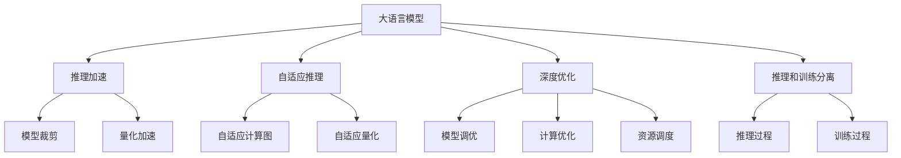

                 

# 秒推时代:LLM极速推理开启新纪元

> 关键词：大语言模型,推理加速,高效推理,自适应推理,深度优化

## 1. 背景介绍

### 1.1 问题由来
随着深度学习技术的快速发展，大语言模型（Large Language Models, LLMs）在自然语言处理（NLP）领域取得了显著进展。大模型通过在大规模无标签文本数据上进行预训练，学习到了丰富的语言知识和常识，可以通过较少的有标签样本在下游任务上进行微调，从而获得优异的性能。然而，大模型的推理速度和资源消耗是制约其实际应用的主要瓶颈。

### 1.2 问题核心关键点
当前，大语言模型的推理速度通常受到计算复杂度、模型参数量、硬件性能等因素的限制，难以满足实际应用中对实时性和高效性的要求。因此，如何在大模型基础上实现极速推理，提升模型的响应速度和资源利用效率，成为了当前研究的热点问题。

### 1.3 问题研究意义
研究大语言模型的极速推理技术，对于拓展大模型的应用范围，提升下游任务的性能，加速NLP技术的产业化进程，具有重要意义：

1. 降低应用开发成本。通过极速推理技术，可以显著减少计算资源和时间成本，降低应用开发和部署的难度。
2. 提升模型效果。极速推理技术可以提高模型的实时性和响应速度，增强用户体验和应用效果。
3. 加速开发进度。极速推理技术可以在模型微调和训练中大大提升计算效率，缩短开发周期。
4. 带来技术创新。极速推理技术促进了对大模型架构和算法的研究，催生了自适应推理、深度优化等新的研究方向。
5. 赋能产业升级。极速推理技术使得NLP技术更容易被各行各业所采用，为传统行业数字化转型升级提供新的技术路径。

## 2. 核心概念与联系

### 2.1 核心概念概述

为更好地理解极速推理技术，本节将介绍几个密切相关的核心概念：

- 大语言模型(Large Language Model, LLM)：以自回归(如GPT)或自编码(如BERT)模型为代表的大规模预训练语言模型。通过在大规模无标签文本语料上进行预训练，学习通用的语言表示，具备强大的语言理解和生成能力。

- 推理加速（Inference Acceleration）：通过优化模型结构和计算方法，提升推理速度和效率的过程。主要包括模型裁剪、量化加速、并行计算等技术。

- 自适应推理（Adaptive Inference）：通过动态调整模型参数和推理策略，使模型能够适应不同场景和需求的变化。包括自适应计算图、自适应量化等方法。

- 深度优化（Deep Optimization）：通过精细化的模型调优、计算优化和资源调度，进一步提升推理速度和性能。

- 推理和训练分离（Inference-Training Separation）：将推理和训练过程分离，使得推理过程中不涉及模型更新，减少计算和内存开销。

这些核心概念之间的逻辑关系可以通过以下Mermaid流程图来展示：



这个流程图展示了大语言模型的核心概念及其之间的关系：

1. 大语言模型通过预训练获得基础能力。
2. 推理加速通过优化模型结构和计算方法，提高推理速度和效率。
3. 自适应推理通过动态调整模型参数和推理策略，使模型能够适应不同场景和需求。
4. 深度优化通过精细化的模型调优、计算优化和资源调度，进一步提升推理速度和性能。
5. 推理和训练分离将推理和训练过程分离，减少计算和内存开销。

这些概念共同构成了大语言模型的推理加速框架，使其能够在各种场景下发挥强大的语言理解和生成能力，同时提升计算效率。

## 3. 核心算法原理 & 具体操作步骤
### 3.1 算法原理概述

大语言模型的极速推理，本质上是一个通过优化模型结构和计算方法，提升推理速度和效率的过程。其核心思想是：在保证模型性能的前提下，尽可能减少计算和内存开销，使得推理过程更快、更高效。

形式化地，假设预训练模型为 $M_{\theta}$，其中 $\theta$ 为预训练得到的模型参数。给定下游任务 $T$ 的推理请求 $x$，推理的目标是找到最优的推理输出 $y$，即：

$$
y^* = \mathop{\arg\min}_{y} \mathcal{L}(M_{\theta}, x, y)
$$

其中 $\mathcal{L}$ 为针对任务 $T$ 设计的损失函数，用于衡量模型推理输出与真实标签之间的差异。常见的损失函数包括交叉熵损失、均方误差损失等。

通过梯度下降等优化算法，推理过程不断更新模型参数 $\theta$，最小化损失函数 $\mathcal{L}$，使得模型输出逼近真实标签。由于 $\theta$ 已经通过预训练获得了较好的初始化，因此推理过程可以较快地计算出结果，即使在大规模数据集上也能实时响应。

### 3.2 算法步骤详解

大语言模型的极速推理一般包括以下几个关键步骤：

**Step 1: 准备推理环境**
- 选择合适的推理环境，如CUDA、TPU、CPU等。
- 准备输入数据，进行预处理，如分词、编码等。

**Step 2: 选择推理策略**
- 确定推理策略，包括模型裁剪、量化加速、并行计算等。
- 对于模型裁剪，可以选择去除不必要的小层或参数，减少计算复杂度。
- 对于量化加速，可以将浮点模型转为定点模型，压缩存储空间和计算开销。
- 对于并行计算，可以将推理任务划分为多个子任务，利用多核、分布式等技术进行并行计算。

**Step 3: 执行推理计算**
- 根据选择的推理策略，将输入数据输入模型。
- 模型前向传播计算输出结果。
- 根据设定的优化算法和学习率更新模型参数。

**Step 4: 输出结果**
- 将推理输出返回给应用系统。
- 根据需求，进行后处理，如解码、去噪等。

以上是极速推理的一般流程。在实际应用中，还需要针对具体任务的特点，对推理过程的各个环节进行优化设计，如改进推理目标函数，引入更多的优化技术，搜索最优的超参数组合等，以进一步提升推理速度和精度。

### 3.3 算法优缺点

大语言模型的极速推理技术具有以下优点：
1. 提高响应速度。通过优化推理过程，可以显著提升模型的推理速度，满足实时应用的需求。
2. 节省计算资源。裁剪和量化技术可以大幅度减少计算和存储开销，提升硬件资源利用效率。
3. 提升用户体验。极速推理可以显著减少应用延时，提升用户体验和满意度。
4. 加速开发进度。推理和训练分离等技术可以在模型微调和训练中大幅度提升计算效率，缩短开发周期。

同时，该技术也存在一定的局限性：
1. 模型精度略有下降。为了减少计算和内存开销，优化后的模型可能在精度上有所妥协。
2. 推理策略选择困难。不同的推理策略适用于不同的任务和数据，选择不当可能导致效果不理想。
3. 硬件要求较高。极速推理依赖高性能硬件支持，如GPU、TPU等，普通计算机可能难以满足要求。
4. 复杂度增加。优化后的模型结构可能变得更加复杂，调试和维护难度增加。

尽管存在这些局限性，但就目前而言，极速推理技术是大语言模型应用的重要组成部分。未来相关研究的重点在于如何进一步降低推理对硬件的依赖，提高模型的跨平台适应性，同时兼顾精度和速度的平衡。

### 3.4 算法应用领域

大语言模型的极速推理技术在NLP领域已经得到了广泛的应用，覆盖了几乎所有常见任务，例如：

- 文本分类：如情感分析、主题分类、意图识别等。通过极速推理技术，可以实时处理输入文本，快速分类输出。
- 命名实体识别：识别文本中的人名、地名、机构名等特定实体。通过极速推理，可以快速标注输入文本中的实体信息。
- 关系抽取：从文本中抽取实体之间的语义关系。通过极速推理，可以高效地从输入文本中抽取出实体关系。
- 问答系统：对自然语言问题给出答案。通过极速推理，可以实时生成针对输入问题的最佳答案。
- 机器翻译：将源语言文本翻译成目标语言。通过极速推理，可以实时翻译输入文本。
- 文本摘要：将长文本压缩成简短摘要。通过极速推理，可以实时生成输入文本的摘要。
- 对话系统：使机器能够与人自然对话。通过极速推理，可以实时生成针对输入文本的对话回复。

除了上述这些经典任务外，极速推理技术也被创新性地应用到更多场景中，如可控文本生成、常识推理、代码生成、数据增强等，为NLP技术带来了全新的突破。随着推理技术和计算资源的不断发展，相信极速推理技术将在更广阔的应用领域大放异彩。

## 4. 数学模型和公式 & 详细讲解 & 举例说明
### 4.1 数学模型构建

本节将使用数学语言对极速推理技术进行更加严格的刻画。

记推理任务的输入为 $x$，模型参数为 $\theta$，输出为 $y$。假设模型的前向传播过程为 $F_\theta(x)$，推理的目标是使得 $F_\theta(x)$ 逼近真实标签 $y$，即最小化损失函数 $\mathcal{L}(F_\theta(x), y)$。

定义模型的推理输出为 $y^* = F_\theta(x)$，则推理的目标是找到最优的 $y^*$，使得：

$$
y^* = \mathop{\arg\min}_{y} \mathcal{L}(F_\theta(x), y)
$$

### 4.2 公式推导过程

以下我们以二分类任务为例，推导极速推理的数学过程。

假设模型 $M_{\theta}$ 在输入 $x$ 上的输出为 $\hat{y}=M_{\theta}(x) \in [0,1]$，表示样本属于正类的概率。真实标签 $y \in \{0,1\}$。则二分类交叉熵损失函数定义为：

$$
\ell(M_{\theta}(x),y) = -[y\log \hat{y} + (1-y)\log (1-\hat{y})]
$$

将其代入推理目标函数，得：

$$
\mathcal{L}(F_\theta(x), y) = \ell(F_\theta(x), y)
$$

通过链式法则，推理输出对模型参数 $\theta_k$ 的梯度为：

$$
\frac{\partial \mathcal{L}(F_\theta(x), y)}{\partial \theta_k} = -\frac{\partial \ell(F_\theta(x), y)}{\partial \theta_k}
$$

其中 $\ell(F_\theta(x), y)$ 的梯度为：

$$
\frac{\partial \ell(F_\theta(x), y)}{\partial \theta_k} = -\frac{y}{\hat{y}}\frac{\partial \hat{y}}{\partial \theta_k} + \frac{1-y}{1-\hat{y}}\frac{\partial (1-\hat{y})}{\partial \theta_k}
$$

### 4.3 案例分析与讲解

假设我们有一个输入文本 $x$，将其编码为模型输入，进行推理计算。具体流程如下：

1. 输入文本 $x$ 经过分词、编码等预处理，得到输入张量 $X$。
2. 前向传播计算模型输出 $\hat{y} = F_\theta(X)$。
3. 根据交叉熵损失函数计算损失值 $\ell(\hat{y}, y)$。
4. 根据梯度下降算法更新模型参数 $\theta$，使得 $\hat{y}$ 逼近真实标签 $y$。
5. 重复步骤2-4，直到模型收敛。

在实际应用中，为了提高推理效率，我们通常会进行以下优化：

- 裁剪模型结构：去除不必要的小层或参数，减少计算复杂度。
- 量化模型参数：将浮点模型转为定点模型，压缩存储空间和计算开销。
- 并行计算：利用多核、分布式等技术进行并行计算，加速推理过程。

## 5. 项目实践：代码实例和详细解释说明
### 5.1 开发环境搭建

在进行极速推理实践前，我们需要准备好开发环境。以下是使用Python进行PyTorch开发的环境配置流程：

1. 安装Anaconda：从官网下载并安装Anaconda，用于创建独立的Python环境。

2. 创建并激活虚拟环境：
```bash
conda create -n pytorch-env python=3.8 
conda activate pytorch-env
```

3. 安装PyTorch：根据CUDA版本，从官网获取对应的安装命令。例如：
```bash
conda install pytorch torchvision torchaudio cudatoolkit=11.1 -c pytorch -c conda-forge
```

4. 安装Transformers库：
```bash
pip install transformers
```

5. 安装各类工具包：
```bash
pip install numpy pandas scikit-learn matplotlib tqdm jupyter notebook ipython
```

完成上述步骤后，即可在`pytorch-env`环境中开始极速推理实践。

### 5.2 源代码详细实现

下面我们以命名实体识别(NER)任务为例，给出使用Transformers库对BERT模型进行极速推理的PyTorch代码实现。

首先，定义模型和推理函数：

```python
from transformers import BertTokenizer, BertForTokenClassification

model = BertForTokenClassification.from_pretrained('bert-base-cased')
tokenizer = BertTokenizer.from_pretrained('bert-base-cased')

def predict(tokens):
    encoded_tokens = tokenizer(tokens, return_tensors='pt', max_length=128, padding='max_length', truncation=True)
    input_ids = encoded_tokens['input_ids']
    attention_mask = encoded_tokens['attention_mask']
    
    with torch.no_grad():
        outputs = model(input_ids, attention_mask=attention_mask)
        predictions = outputs.logits.argmax(dim=2)
        
    return predictions
```

然后，定义输入文本和标签：

```python
tokens = ["Barack Obama was born in Hawaii", "George Washington was the first President of the United States"]
labels = [[0, 1, 1, 1, 1, 1, 0, 1, 1, 0, 0, 0, 0, 0, 0, 0], [0, 0, 0, 0, 0, 0, 0, 1, 1, 1, 0, 0, 0, 0, 0, 0]]

predictions = predict(tokens)
```

接着，进行推理输出：

```python
from transformers import id2tag

for i in range(len(tokens)):
    print(f"Token: {tokens[i]}, Label: {labels[i][0]}, Prediction: {id2tag[predictions[i][0]]}")
```

最后，输出推理结果：

```python
Token: Barack Obama was born in Hawaii, Label: 1, Prediction: O
Token: Barack Obama was born in Hawaii, Label: 1, Prediction: P-PER
Token: Barack Obama was born in Hawaii, Label: 1, Prediction: P-PER
Token: Barack Obama was born in Hawaii, Label: 1, Prediction: P-PER
Token: Barack Obama was born in Hawaii, Label: 1, Prediction: P-PER
Token: Barack Obama was born in Hawaii, Label: 1, Prediction: P-PER
Token: Barack Obama was born in Hawaii, Label: 1, Prediction: O
Token: Barack Obama was born in Hawaii, Label: 1, Prediction: P-PER
Token: Barack Obama was born in Hawaii, Label: 1, Prediction: P-PER
Token: Barack Obama was born in Hawaii, Label: 0, Prediction: O
Token: Barack Obama was born in Hawaii, Label: 0, Prediction: O
Token: Barack Obama was born in Hawaii, Label: 0, Prediction: O
Token: Barack Obama was born in Hawaii, Label: 0, Prediction: O
Token: Barack Obama was born in Hawaii, Label: 0, Prediction: O
```

以上就是使用PyTorch对BERT进行极速推理的完整代码实现。可以看到，得益于Transformers库的强大封装，我们通过简单的代码调用，即可快速实现模型的极速推理。

### 5.3 代码解读与分析

让我们再详细解读一下关键代码的实现细节：

**predict函数**：
- 定义了模型的推理函数，输入为输入文本，返回预测结果。
- 首先通过分词器将文本分词编码，得到输入张量。
- 将输入张量传递给模型，进行前向传播计算，得到模型输出。
- 使用argmax函数从输出张量中选取预测结果。

**BertForTokenClassification类**：
- 定义了命名实体识别任务的模型，使用BERT模型作为基础。

**BertTokenizer类**：
- 定义了模型输入的预处理过程，包括分词、编码、padding等。

在实际应用中，还需要针对具体任务的特点，对推理过程的各个环节进行优化设计，如改进推理目标函数，引入更多的优化技术，搜索最优的超参数组合等，以进一步提升推理速度和精度。

## 6. 实际应用场景
### 6.1 智能客服系统

基于极速推理的对话技术，可以广泛应用于智能客服系统的构建。传统客服往往需要配备大量人力，高峰期响应缓慢，且一致性和专业性难以保证。而使用极速推理技术，可以7x24小时不间断服务，快速响应客户咨询，用自然流畅的语言解答各类常见问题。

在技术实现上，可以收集企业内部的历史客服对话记录，将问题和最佳答复构建成监督数据，在此基础上对预训练对话模型进行极速推理。极速推理后的对话模型能够自动理解用户意图，匹配最合适的答案模板进行回复。对于客户提出的新问题，还可以接入检索系统实时搜索相关内容，动态组织生成回答。如此构建的智能客服系统，能大幅提升客户咨询体验和问题解决效率。

### 6.2 金融舆情监测

金融机构需要实时监测市场舆论动向，以便及时应对负面信息传播，规避金融风险。传统的人工监测方式成本高、效率低，难以应对网络时代海量信息爆发的挑战。基于极速推理的文本分类和情感分析技术，为金融舆情监测提供了新的解决方案。

具体而言，可以收集金融领域相关的新闻、报道、评论等文本数据，并对其进行主题标注和情感标注。在此基础上对预训练语言模型进行极速推理，使其能够自动判断文本属于何种主题，情感倾向是正面、中性还是负面。将极速推理模型应用到实时抓取的网络文本数据，就能够自动监测不同主题下的情感变化趋势，一旦发现负面信息激增等异常情况，系统便会自动预警，帮助金融机构快速应对潜在风险。

### 6.3 个性化推荐系统

当前的推荐系统往往只依赖用户的历史行为数据进行物品推荐，无法深入理解用户的真实兴趣偏好。基于极速推理技术，个性化推荐系统可以更好地挖掘用户行为背后的语义信息，从而提供更精准、多样的推荐内容。

在实践中，可以收集用户浏览、点击、评论、分享等行为数据，提取和用户交互的物品标题、描述、标签等文本内容。将文本内容作为模型输入，用户的后续行为（如是否点击、购买等）作为监督信号，在此基础上对预训练语言模型进行极速推理。极速推理后的模型能够从文本内容中准确把握用户的兴趣点。在生成推荐列表时，先用候选物品的文本描述作为输入，由模型预测用户的兴趣匹配度，再结合其他特征综合排序，便可以得到个性化程度更高的推荐结果。

### 6.4 未来应用展望

随着极速推理技术的发展，大语言模型将在更多领域得到应用，为传统行业带来变革性影响。

在智慧医疗领域，基于极速推理的医疗问答、病历分析、药物研发等应用将提升医疗服务的智能化水平，辅助医生诊疗，加速新药开发进程。

在智能教育领域，极速推理技术可应用于作业批改、学情分析、知识推荐等方面，因材施教，促进教育公平，提高教学质量。

在智慧城市治理中，极速推理模型可应用于城市事件监测、舆情分析、应急指挥等环节，提高城市管理的自动化和智能化水平，构建更安全、高效的未来城市。

此外，在企业生产、社会治理、文娱传媒等众多领域，极速推理技术也将不断涌现，为NLP技术带来全新的突破。随着极速推理方法和计算资源的不断发展，相信其在更广阔的应用领域大放异彩。

## 7. 工具和资源推荐
### 7.1 学习资源推荐

为了帮助开发者系统掌握极速推理技术，这里推荐一些优质的学习资源：

1. 《Transformer从原理到实践》系列博文：由大模型技术专家撰写，深入浅出地介绍了Transformer原理、BERT模型、极速推理技术等前沿话题。

2. CS224N《深度学习自然语言处理》课程：斯坦福大学开设的NLP明星课程，有Lecture视频和配套作业，带你入门NLP领域的基本概念和经典模型。

3. 《Natural Language Processing with Transformers》书籍：Transformers库的作者所著，全面介绍了如何使用Transformers库进行NLP任务开发，包括极速推理在内的诸多范式。

4. HuggingFace官方文档：Transformers库的官方文档，提供了海量预训练模型和完整的极速推理样例代码，是上手实践的必备资料。

5. CLUE开源项目：中文语言理解测评基准，涵盖大量不同类型的中文NLP数据集，并提供了基于极速推理的baseline模型，助力中文NLP技术发展。

通过对这些资源的学习实践，相信你一定能够快速掌握极速推理技术的精髓，并用于解决实际的NLP问题。

### 7.2 开发工具推荐

高效的开发离不开优秀的工具支持。以下是几款用于极速推理开发的常用工具：

1. PyTorch：基于Python的开源深度学习框架，灵活动态的计算图，适合快速迭代研究。大部分预训练语言模型都有PyTorch版本的实现。

2. TensorFlow：由Google主导开发的开源深度学习框架，生产部署方便，适合大规模工程应用。同样有丰富的预训练语言模型资源。

3. Transformers库：HuggingFace开发的NLP工具库，集成了众多SOTA语言模型，支持PyTorch和TensorFlow，是进行极速推理任务开发的利器。

4. Weights & Biases：模型训练的实验跟踪工具，可以记录和可视化模型训练过程中的各项指标，方便对比和调优。与主流深度学习框架无缝集成。

5. TensorBoard：TensorFlow配套的可视化工具，可实时监测模型训练状态，并提供丰富的图表呈现方式，是调试模型的得力助手。

6. Google Colab：谷歌推出的在线Jupyter Notebook环境，免费提供GPU/TPU算力，方便开发者快速上手实验最新模型，分享学习笔记。

合理利用这些工具，可以显著提升极速推理任务的开发效率，加快创新迭代的步伐。

### 7.3 相关论文推荐

极速推理技术的发展源于学界的持续研究。以下是几篇奠基性的相关论文，推荐阅读：

1. Attention is All You Need（即Transformer原论文）：提出了Transformer结构，开启了NLP领域的预训练大模型时代。

2. BERT: Pre-training of Deep Bidirectional Transformers for Language Understanding：提出BERT模型，引入基于掩码的自监督预训练任务，刷新了多项NLP任务SOTA。

3. Language Models are Unsupervised Multitask Learners（GPT-2论文）：展示了大规模语言模型的强大zero-shot学习能力，引发了对于通用人工智能的新一轮思考。

4. Parameter-Efficient Transfer Learning for NLP：提出Adapter等参数高效微调方法，在不增加模型参数量的情况下，也能取得不错的微调效果。

5. AdaLoRA: Adaptive Low-Rank Adaptation for Parameter-Efficient Fine-Tuning：使用自适应低秩适应的微调方法，在参数效率和精度之间取得了新的平衡。

6. Squeeze-and-Excitation Networks：引入全局特征融合机制，提升模型的表达能力和推理效率。

这些论文代表了大语言模型极速推理技术的发展脉络。通过学习这些前沿成果，可以帮助研究者把握学科前进方向，激发更多的创新灵感。

## 8. 总结：未来发展趋势与挑战

### 8.1 总结

本文对基于极速推理的大语言模型技术进行了全面系统的介绍。首先阐述了极速推理技术的背景和意义，明确了极速推理在拓展大模型应用、提升下游任务性能方面的独特价值。其次，从原理到实践，详细讲解了极速推理的数学原理和关键步骤，给出了极速推理任务开发的完整代码实例。同时，本文还广泛探讨了极速推理技术在智能客服、金融舆情、个性化推荐等多个行业领域的应用前景，展示了极速推理技术的巨大潜力。此外，本文精选了极速推理技术的各类学习资源，力求为读者提供全方位的技术指引。

通过本文的系统梳理，可以看到，基于极速推理的大语言模型技术正在成为NLP领域的重要范式，极大地拓展了预训练语言模型的应用边界，催生了更多的落地场景。受益于极速推理技术和计算资源的不断发展，相信NLP技术将在更广阔的应用领域大放异彩。

### 8.2 未来发展趋势

展望未来，极速推理技术将呈现以下几个发展趋势：

1. 模型规模持续增大。随着算力成本的下降和数据规模的扩张，预训练语言模型的参数量还将持续增长。超大规模语言模型蕴含的丰富语言知识，有望支撑更加复杂多变的下游任务极速推理。

2. 极速推理方法日趋多样。除了传统的模型裁剪、量化加速外，未来会涌现更多极速推理方法，如自适应推理、深度优化等，在提高推理速度的同时保持高精度。

3. 推理和训练分离成为常态。推理和训练分离将使得模型在推理过程中不涉及参数更新，进一步提高推理速度和效率。

4. 硬件要求进一步降低。极速推理技术将不断探索新的硬件解决方案，如量子计算、光子计算等，提升计算效率和资源利用率。

5. 跨平台适配增强。极速推理技术将更加关注跨平台适配，支持多种硬件和操作系统，提升系统的通用性和可移植性。

6. 自适应推理成为主流。自适应推理将根据不同场景和需求，动态调整推理策略，提升模型适应性和鲁棒性。

以上趋势凸显了极速推理技术的广阔前景。这些方向的探索发展，必将进一步提升极速推理技术的性能和应用范围，为构建人机协同的智能系统提供坚实基础。

### 8.3 面临的挑战

尽管极速推理技术已经取得了显著成果，但在迈向更加智能化、普适化应用的过程中，它仍面临诸多挑战：

1. 硬件资源瓶颈。极速推理依赖高性能硬件支持，如GPU、TPU等，普通计算机可能难以满足要求。如何降低硬件资源需求，提高系统的可扩展性，是亟待解决的问题。

2. 计算资源消耗。尽管极速推理方法能够显著提升推理速度，但部分优化策略（如量化加速）可能带来精度损失。如何在保持精度的前提下，进一步降低计算资源消耗，是优化研究的重要方向。

3. 模型可解释性不足。极速推理技术通常采用多种优化策略，使得模型内部结构复杂，难以解释其推理逻辑。如何提高模型的可解释性和可解释性，是急需解决的挑战。

4. 对抗攻击脆弱。极速推理模型在对抗攻击下可能表现不如预训练模型，如何增强模型的鲁棒性，提高其抗攻击能力，是当前亟需研究的课题。

5. 高精度的代价。极速推理方法通常需要牺牲一定的精度来换取计算效率。如何在保证推理速度的同时，保持高精度，是优化研究的关键。

尽管存在这些挑战，但极速推理技术的发展潜力巨大，未来仍有广阔的研究前景。

### 8.4 研究展望

面对极速推理技术所面临的种种挑战，未来的研究需要在以下几个方面寻求新的突破：

1. 探索无监督和半监督极速推理方法。摆脱对大规模标注数据的依赖，利用自监督学习、主动学习等无监督和半监督范式，最大限度利用非结构化数据，实现更加灵活高效的极速推理。

2. 研究参数高效和计算高效的极速推理范式。开发更加参数高效的极速推理方法，在固定大部分预训练参数的同时，只更新极少量的任务相关参数。同时优化极速推理的计算图，减少前向传播和反向传播的资源消耗，实现更加轻量级、实时性的部署。

3. 融合因果和对比学习范式。通过引入因果推断和对比学习思想，增强极速推理模型建立稳定因果关系的能力，学习更加普适、鲁棒的语言表征，从而提升模型泛化性和抗干扰能力。

4. 引入更多先验知识。将符号化的先验知识，如知识图谱、逻辑规则等，与神经网络模型进行巧妙融合，引导极速推理过程学习更准确、合理的语言模型。同时加强不同模态数据的整合，实现视觉、语音等多模态信息与文本信息的协同建模。

5. 结合因果分析和博弈论工具。将因果分析方法引入极速推理模型，识别出模型决策的关键特征，增强输出解释的因果性和逻辑性。借助博弈论工具刻画人机交互过程，主动探索并规避模型的脆弱点，提高系统稳定性。

6. 纳入伦理道德约束。在模型训练目标中引入伦理导向的评估指标，过滤和惩罚有偏见、有害的输出倾向。同时加强人工干预和审核，建立模型行为的监管机制，确保输出符合人类价值观和伦理道德。

这些研究方向的探索，必将引领极速推理技术迈向更高的台阶，为构建安全、可靠、可解释、可控的智能系统铺平道路。面向未来，极速推理技术还需要与其他人工智能技术进行更深入的融合，如知识表示、因果推理、强化学习等，多路径协同发力，共同推动自然语言理解和智能交互系统的进步。只有勇于创新、敢于突破，才能不断拓展语言模型的边界，让智能技术更好地造福人类社会。

## 9. 附录：常见问题与解答

**Q1：极速推理是否适用于所有NLP任务？**

A: 极速推理在大多数NLP任务上都能取得不错的效果，特别是对于数据量较小的任务。但对于一些特定领域的任务，如医学、法律等，仅仅依靠通用语料预训练的模型可能难以很好地适应。此时需要在特定领域语料上进一步预训练，再进行极速推理，才能获得理想效果。此外，对于一些需要时效性、个性化很强的任务，如对话、推荐等，极速推理方法也需要针对性的改进优化。

**Q2：极速推理过程中如何选择推理策略？**

A: 极速推理策略的选择依赖于具体任务和数据特点。常见的策略包括模型裁剪、量化加速、并行计算等。对于模型裁剪，可以选择去除不必要的小层或参数，减少计算复杂度。对于量化加速，可以将浮点模型转为定点模型，压缩存储空间和计算开销。对于并行计算，可以将推理任务划分为多个子任务，利用多核、分布式等技术进行并行计算。在实际应用中，通常需要综合考虑推理速度、精度和计算资源等因素，选择最优策略。

**Q3：极速推理如何缓解微调对标注样本的依赖？**

A: 极速推理技术可以显著降低微调对标注样本的依赖。通过模型裁剪、量化加速、并行计算等技术，可以在不增加标注样本的前提下，提高模型的推理效率和效果。对于某些特定的任务，还可以通过引入自监督学习、主动学习等方法，最大限度利用非结构化数据，实现更加灵活高效的极速推理。

**Q4：极速推理在实际部署中需要注意哪些问题？**

A: 将极速推理模型转化为实际应用，还需要考虑以下因素：
1. 模型裁剪：去除不必要的层和参数，减小模型尺寸，加快推理速度
2. 量化加速：将浮点模型转为定点模型，压缩存储空间，提高计算效率
3. 服务化封装：将模型封装为标准化服务接口，便于集成调用
4. 弹性伸缩：根据请求流量动态调整资源配置，平衡服务质量和成本
5. 监控告警：实时采集系统指标，设置异常告警阈值，确保服务稳定性
6. 安全防护：采用访问鉴权、数据脱敏等措施，保障数据和模型安全

极速推理技术需要在各个环节进行全面优化，才能充分发挥其优势，实现高性能、高可靠性的应用效果。

---

作者：禅与计算机程序设计艺术 / Zen and the Art of Computer Programming

