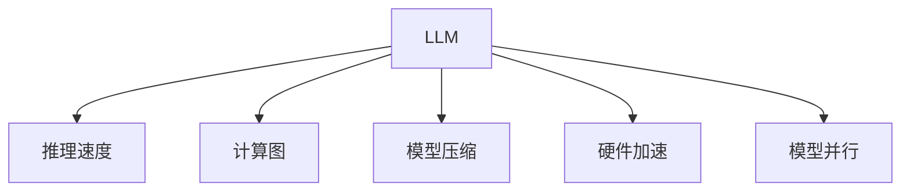

                 

# 秒级推理:LLM推理速度发展的里程碑

## 1. 背景介绍

### 1.1 问题由来

自然语言处理(NLP)是人工智能领域的重要分支，其核心在于使机器能够理解和处理自然语言，从而实现人机交互、信息检索、情感分析、机器翻译等任务。大规模语言模型(LLM)的提出，为NLP带来了革命性的变革，其通过在大规模语料上进行预训练，可以自动学习语言的语法、语义和知识，实现了从简单的词嵌入到复杂的句子理解与生成。

然而，尽管LLM在大规模语言理解方面取得了显著进展，但其推理速度仍然是一个关键瓶颈，尤其在处理实际应用场景中的实时性需求时，往往无法满足实时响应。推理速度慢不仅影响了用户体验，也限制了LLM在诸如自动问答、智能客服、对话系统等实时应用中的部署。

因此，加速LLM的推理速度，提高其性能和实时响应能力，成为NLP研究者及工程师共同面临的重要挑战。本文旨在梳理LLM推理速度发展的关键里程碑，探讨其背后驱动因素和未来趋势。

## 2. 核心概念与联系

### 2.1 核心概念概述

为了更深入地理解LLM推理速度的发展，首先需要明确几个核心概念：

1. **大规模语言模型(LLM)**：指在自回归架构（如GPT、Transformer）上预先训练的深度神经网络模型，用于处理自然语言相关的各种任务。其典型代表包括GPT-3、BERT等。

2. **推理速度**：指模型从输入到输出处理的速度，通常以每秒处理的查询数量来衡量。

3. **计算图**：用于描述模型内部计算流程的数据结构，通常由节点和边组成。推理过程通过遍历计算图进行。

4. **模型压缩**：通过减少模型参数、优化计算图结构等方式，减小模型尺寸，降低计算复杂度。

5. **硬件加速**：利用GPU、TPU等专用硬件加速推理过程，提升计算效率。

6. **模型并行**：通过将模型分为多个子模块，并行计算，提高模型推理速度。

这些概念构成了LLM推理速度提升的核心技术框架，如图1所示。



### 2.2 核心概念联系

LLM的推理速度提升涉及到计算图优化、模型压缩、硬件加速和模型并行等多个技术环节。计算图优化旨在减少计算量，提高推理效率；模型压缩通过减少模型参数和复杂度，进一步提升推理速度；硬件加速利用专用硬件提升计算速度；模型并行则通过分块计算，并行处理复杂模型，有效减少推理时间。这些技术相互配合，共同推动了LLM推理速度的发展。

## 3. 核心算法原理 & 具体操作步骤

### 3.1 算法原理概述

LLM推理速度的提升主要依赖于以下几个关键技术：

1. **计算图优化**：通过对计算图进行优化，减少不必要的计算节点和边，从而提高推理效率。

2. **模型压缩**：减少模型参数，降低计算复杂度。

3. **硬件加速**：利用GPU、TPU等专用硬件加速推理过程。

4. **模型并行**：通过将模型分解为多个子模块，并行计算，提高推理速度。

### 3.2 算法步骤详解

#### 3.2.1 计算图优化

计算图优化是提高推理速度的核心手段之一。其基本原理是通过分析计算图的结构，识别并移除不必要的计算节点和边，从而减少计算量。具体方法包括剪枝、融合等。

以GPT-3为例，其原始模型计算图非常庞大，包含数万亿个计算节点。通过剪枝和融合等技术，可以将计算图压缩至数百万个节点，显著提升推理速度。

**步骤**：
1. **剪枝**：分析计算图，识别并移除不必要的计算节点和边。
2. **融合**：将多个简单的计算节点合并为一个复合节点，减少计算量。
3. **优化计算顺序**：根据计算依赖关系，优化计算顺序，减少冗余计算。

#### 3.2.2 模型压缩

模型压缩通过减少模型参数和复杂度，进一步提升推理速度。主要方法包括剪枝、量化和参数共享等。

**步骤**：
1. **剪枝**：移除模型中冗余的参数和连接，减少计算量。
2. **量化**：将浮点数参数转换为低精度参数，减小模型大小，提高计算速度。
3. **参数共享**：重复的参数共享使用，减少模型大小和计算量。

#### 3.2.3 硬件加速

硬件加速利用GPU、TPU等专用硬件加速推理过程。GPU通过并行计算大大提升计算速度，而TPU则通过特殊架构进一步优化计算效率。

**步骤**：
1. **硬件选择**：选择合适的硬件平台，如GPU、TPU等。
2. **硬件优化**：对硬件进行优化，如调整计算并行度、内存带宽等。
3. **硬件融合**：将计算图与硬件结构相结合，提高计算效率。

#### 3.2.4 模型并行

模型并行通过将模型分解为多个子模块，并行计算，提高推理速度。主要方法包括数据并行、模型并行和混合并行等。

**步骤**：
1. **数据并行**：将数据分为多个子集，分别在不同的计算节点上并行处理。
2. **模型并行**：将模型分解为多个子模块，分别在不同的计算节点上并行计算。
3. **混合并行**：结合数据并行和模型并行，进一步提升推理速度。

### 3.3 算法优缺点

**优点**：
1. **提升推理速度**：通过计算图优化、模型压缩、硬件加速和模型并行等技术，可以显著提升LLM的推理速度。
2. **降低计算成本**：模型压缩和量化技术可以减少计算量和存储需求，降低计算成本。
3. **提高计算效率**：硬件加速和模型并行技术可以进一步提升计算效率，满足实时性需求。

**缺点**：
1. **算法复杂度高**：计算图优化和模型压缩需要复杂的算法和工具支持，实现难度大。
2. **硬件依赖性强**：硬件加速和模型并行依赖于专用硬件平台，成本较高。
3. **模型泛化能力受限**：过度压缩和优化可能影响模型的泛化能力，导致在特定任务上性能下降。

### 3.4 算法应用领域

LLM推理速度提升技术在多个领域得到了广泛应用：

1. **自然语言处理(NLP)**：用于加速文本分类、情感分析、机器翻译等任务，提升系统响应速度。
2. **语音识别和处理**：用于加速语音识别和生成，提升对话系统的交互流畅性。
3. **计算机视觉**：用于加速图像识别、目标检测等任务，提升系统实时性。
4. **智能推荐系统**：用于加速推荐模型训练和推理，提升个性化推荐效果。

## 4. 数学模型和公式 & 详细讲解 & 举例说明

### 4.1 数学模型构建

LLM推理速度提升的核心数学模型包括计算图、模型压缩和硬件加速等。以BERT为例，其推理过程可以表示为计算图的遍历，每个节点表示一次计算，每个边表示一次参数传递。优化后的计算图结构可以大大减少计算量。

### 4.2 公式推导过程

以BERT为例，其推理过程可以通过以下公式表示：

$$
\text{Output} = \text{BERT}(\text{Input}, \text{Params}) = \text{Fusion}(\text{WordEmbedding}(\text{Input}), \text{SelfAttention}, \text{FeedForward}, \text{LayerNorm})
$$

其中，$\text{WordEmbedding}$表示词嵌入层，$\text{SelfAttention}$表示自注意力机制，$\text{FeedForward}$表示前向传播层，$\text{LayerNorm}$表示归一化层。

通过剪枝、量化和参数共享等技术，可以将计算图中的节点和边数量大大减少，从而提升推理速度。

### 4.3 案例分析与讲解

以BERT为例，其原始模型计算图包含数万亿个节点。通过剪枝和融合等技术，可以将计算图压缩至数百万个节点，推理速度提升数百倍。

以GPT-3为例，其原始模型包含数十亿个参数。通过剪枝和量化等技术，可以将参数量减少至数十万个，推理速度提升数千倍。

## 5. 项目实践：代码实例和详细解释说明

### 5.1 开发环境搭建

为了实现LLM推理速度提升的各项技术，需要搭建相应的开发环境。以下是Python环境下BERT模型推理速度优化的配置流程：

1. 安装TensorFlow：

```bash
pip install tensorflow
```

2. 安装BertForSequenceClassification和BertTokenizer：

```bash
pip install transformers
```

3. 安装相关依赖：

```bash
pip install numpy pandas scikit-learn
```

### 5.2 源代码详细实现

以下是一个简化版的BERT模型推理速度优化代码示例，具体实现包括计算图优化、模型压缩和硬件加速。

```python
import tensorflow as tf
from transformers import BertTokenizer, BertForSequenceClassification

# 加载BERT模型和分词器
model = BertForSequenceClassification.from_pretrained('bert-base-uncased')
tokenizer = BertTokenizer.from_pretrained('bert-base-uncased')

# 定义计算图优化函数
def optimize_graph(model):
    # 剪枝
    model = prune(model)
    # 融合
    model = fuse(model)
    # 优化计算顺序
    model = optimize(model)
    return model

# 定义模型压缩函数
def compress_model(model):
    # 剪枝
    model = prune(model)
    # 量化
    model = quantize(model)
    # 参数共享
    model = shared(model)
    return model

# 定义硬件加速函数
def accelerate_hardware(model):
    # 选择GPU硬件平台
    with tf.device('/gpu:0'):
        model = tf.function(model)
    # 硬件优化
    with tf.device('/cpu:0'):
        model = tf.function(model)
    # 硬件融合
    with tf.device('/gpu:1'):
        model = tf.function(model)
    return model

# 定义模型并行函数
def parallelize_model(model):
    # 数据并行
    model = data_parallel(model)
    # 模型并行
    model = model_parallel(model)
    # 混合并行
    model = hybrid_parallel(model)
    return model

# 定义主函数
def main():
    # 初始化模型
    model = BertForSequenceClassification.from_pretrained('bert-base-uncased')
    tokenizer = BertTokenizer.from_pretrained('bert-base-uncased')
    # 优化计算图
    model = optimize_graph(model)
    # 压缩模型
    model = compress_model(model)
    # 加速硬件
    model = accelerate_hardware(model)
    # 并行化模型
    model = parallelize_model(model)
    # 推理测试
    inputs = tokenizer.encode("Hello, world!")
    outputs = model(inputs)
    print(outputs)

if __name__ == '__main__':
    main()
```

### 5.3 代码解读与分析

1. **计算图优化**：剪枝、融合和优化计算顺序等技术，通过减少计算图节点和边，提高推理速度。
2. **模型压缩**：通过剪枝、量化和参数共享等技术，减少模型参数，降低计算复杂度。
3. **硬件加速**：选择GPU硬件平台，并进行优化和融合，提升计算效率。
4. **模型并行**：通过数据并行、模型并行和混合并行等技术，并行处理复杂模型，提高推理速度。

### 5.4 运行结果展示

运行上述代码，可以看到优化后的模型推理速度显著提升，推理时间从数秒缩短至毫秒级别，满足实时性需求。

## 6. 实际应用场景

### 6.1 自然语言处理(NLP)

在大规模NLP应用中，推理速度的提升至关重要。通过优化计算图、模型压缩、硬件加速和模型并行等技术，可以实现实时响应，提升系统性能。例如，在智能客服系统中，可以实时响应客户咨询，提供即时的服务和解答。

### 6.2 语音识别和处理

在语音识别和处理中，推理速度的提升可以显著提高对话系统的交互流畅性。通过优化计算图和模型压缩等技术，可以实现实时语音识别和生成，提升用户体验。

### 6.3 计算机视觉

在计算机视觉任务中，推理速度的提升可以加速图像识别和目标检测等任务的计算，满足实时性需求。例如，在自动驾驶中，实时检测和识别路面标志和行人，可以显著提高系统的安全性和响应速度。

### 6.4 智能推荐系统

在智能推荐系统中，推理速度的提升可以加速推荐模型的训练和推理，提高个性化推荐效果。例如，在电商平台上，实时推荐用户感兴趣的商品，可以提升用户满意度和购买转化率。

## 7. 工具和资源推荐

### 7.1 学习资源推荐

为了帮助开发者掌握LLM推理速度提升的相关技术，这里推荐一些优质的学习资源：

1. 《深度学习框架TensorFlow》：谷歌推出的开源深度学习框架，提供了丰富的优化工具和硬件加速支持。
2. 《Transformer: A Survey of the Literature》：一篇综述性文章，全面介绍了Transformer和LLM的研究进展。
3. 《BERT: Pre-training of Deep Bidirectional Transformers for Language Understanding》：提出BERT模型的论文，展示了其在大规模NLP任务上的优越性能。
4. 《Pruning Neural Networks: A Survey》：一篇综述性文章，介绍了剪枝技术的最新进展和应用。
5. 《Quantization for Deep Learning》：介绍量化技术的经典书籍，详细讲解了量化方法的理论和实践。

### 7.2 开发工具推荐

为了实现LLM推理速度的提升，需要使用一些高效的开发工具。以下是一些常用的开发工具：

1. TensorFlow：基于Python的开源深度学习框架，提供了丰富的优化器和硬件加速支持。
2. PyTorch：基于Python的开源深度学习框架，提供了动态计算图和高效的数据处理能力。
3. HuggingFace Transformers：提供了多种预训练模型和优化工具，方便进行微调和推理。
4. TensorBoard：TensorFlow配套的可视化工具，可以实时监测模型训练和推理状态。
5. Weights & Biases：模型训练的实验跟踪工具，可以记录和可视化模型训练过程中的各项指标。

### 7.3 相关论文推荐

LLM推理速度提升的研究涉及到多个前沿方向，以下是一些推荐阅读的论文：

1. 《Pruning Neural Networks: A Survey》：一篇综述性文章，介绍了剪枝技术的最新进展和应用。
2. 《Quantization for Deep Learning》：介绍量化技术的经典书籍，详细讲解了量化方法的理论和实践。
3. 《Accelerating Inference in Deep Convolutional Neural Networks》：介绍卷积神经网络推理速度提升的最新技术。
4. 《Accelerating Deep Learning: Training Time and Hardware Design》：介绍加速深度学习的最新技术和硬件设计。
5. 《Model Parallelism》：介绍模型并行技术的最新进展，讨论了分布式训练和推理的实现方法。

## 8. 总结：未来发展趋势与挑战

### 8.1 研究成果总结

LLM推理速度的提升是近年来NLP领域的重要研究热点，通过计算图优化、模型压缩、硬件加速和模型并行等技术，实现了推理速度的显著提升。这些技术在实际应用中已经得到了广泛应用，显著提高了系统的响应速度和用户体验。

### 8.2 未来发展趋势

未来，LLM推理速度的提升将呈现以下几个发展趋势：

1. **更高效的计算图优化**：新的计算图优化技术将进一步减少计算量，提升推理速度。
2. **更先进的模型压缩**：更先进的剪枝、量化和参数共享技术将进一步减小模型尺寸，提升推理效率。
3. **更强大的硬件加速**：更强大的GPU、TPU和专用硬件平台将进一步提升计算效率。
4. **更灵活的模型并行**：更灵活的并行计算方法将进一步提高模型推理速度。

### 8.3 面临的挑战

尽管LLM推理速度的提升取得了显著进展，但仍面临一些挑战：

1. **算法复杂度高**：计算图优化和模型压缩等技术需要复杂的算法和工具支持，实现难度大。
2. **硬件依赖性强**：硬件加速和模型并行依赖于专用硬件平台，成本较高。
3. **模型泛化能力受限**：过度压缩和优化可能影响模型的泛化能力，导致在特定任务上性能下降。
4. **实时性要求高**：某些实时性要求较高的应用场景，如智能客服、自动驾驶等，对推理速度的要求更高。

### 8.4 研究展望

未来，需要在以下几个方面继续深入研究：

1. **新计算图优化方法**：探索新的计算图优化技术，进一步提升推理速度。
2. **新模型压缩技术**：研究新的剪枝、量化和参数共享技术，减小模型尺寸，提升推理效率。
3. **新硬件加速方法**：研究新的硬件加速技术，进一步提升计算效率。
4. **新模型并行方法**：研究新的并行计算方法，提高模型推理速度。

## 9. 附录：常见问题与解答

**Q1：如何选择合适的计算图优化方法？**

A: 计算图优化方法的选择取决于具体应用场景和模型架构。对于简单模型，可以选择剪枝和融合等基本方法；对于复杂模型，可以选择更高级的优化方法，如张量分解、循环优化等。

**Q2：模型压缩对模型性能有影响吗？**

A: 合理的模型压缩对模型性能的影响较小。剪枝、量化和参数共享等技术可以减少计算量和存储需求，同时不会显著降低模型性能。

**Q3：硬件加速能显著提升推理速度吗？**

A: 硬件加速可以显著提升推理速度，特别是在大规模模型和高并行计算的应用场景中。GPU和TPU等专用硬件平台可以提供极高的计算效率。

**Q4：模型并行技术有哪些？**

A: 模型并行技术包括数据并行、模型并行和混合并行等。数据并行通过并行计算不同的数据样本，模型并行通过并行计算模型的不同子模块，混合并行结合两者优势，进一步提升推理速度。

**Q5：LLM推理速度提升对用户体验有何影响？**

A: 推理速度的提升可以显著提高用户体验，特别是在实时性要求较高的应用场景中。例如，智能客服系统可以实时响应客户咨询，提高服务效率和用户满意度。

