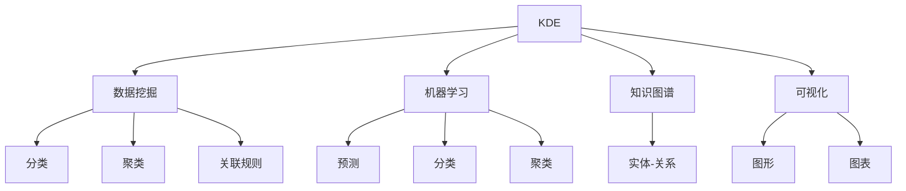

                 

# 程序员利用知识发现引擎提高创新能力

在人工智能(AI)和知识发现(Knowledge Discovery)领域，知识发现引擎(Knowledge Discovery Engine, KDE)正在逐渐成为程序员和研究人员提高创新能力的重要工具。本文将详细介绍知识发现引擎的核心概念、原理、操作步骤，并结合实际应用场景，分析其在提升编程效率、推动技术创新和促进知识共享方面的潜力和挑战。

## 1. 背景介绍

### 1.1 问题由来

在快速变化的IT行业，程序员和研究人员需要不断学习新知识、掌握新技术，以应对日益复杂的开发需求和日益激烈的市场竞争。然而，海量而零散的知识获取和整合成为难题。传统方式如搜索、阅读文献、参加会议等，虽然有效，但效率低下，难以适应现代工作节奏。知识发现引擎的诞生，提供了一种快速、高效、系统化的知识发现和应用方法，帮助程序员和研究人员在有限的时间内，掌握更多有价值的信息。

### 1.2 问题核心关键点

知识发现引擎的核心在于利用先进的数据挖掘和机器学习技术，从海量数据中自动发现潜在的知识模式，并以直观的方式呈现给用户。通过智能推荐、知识图谱、可视化等手段，知识发现引擎可以极大地加速知识获取和整合，提升程序员和研究人员的工作效率，激发更多创新灵感。

## 2. 核心概念与联系

### 2.1 核心概念概述

为更好地理解知识发现引擎，本节将介绍几个密切相关的核心概念：

- 知识发现引擎(KDE)：指利用数据挖掘、机器学习等技术，自动从海量数据中发现知识模式，并以可视化的方式呈现给用户，帮助其快速掌握关键信息的系统。
- 数据挖掘(Data Mining)：指从数据集中挖掘出有用的信息和知识的过程。数据挖掘包括分类、聚类、关联规则挖掘等多种方法。
- 机器学习(Machine Learning)：指通过算法让计算机系统自动学习数据规律，从而进行预测、分类、聚类等任务。
- 知识图谱(Knowledge Graph)：指通过语义网技术，构建的实体与实体间关系的知识网络。知识图谱是知识发现引擎的重要组成部分。
- 可视化(Visualization)：指将复杂的数据和知识以图形、图表等形式直观呈现，帮助用户快速理解数据。

这些核心概念之间的逻辑关系可以通过以下Mermaid流程图来展示：



这个流程图展示了知识发现引擎的核心概念及其之间的关系：

1. KDE将数据挖掘、机器学习和可视化整合起来，形成知识发现的全链条。
2. 数据挖掘通过分类、聚类、关联规则挖掘等方法，从数据中提取出有用信息。
3. 机器学习通过算法训练，从数据中学习规律，进行预测、分类等任务。
4. 知识图谱通过语义网技术，构建实体与关系的网络，帮助用户理解复杂信息。
5. 可视化通过图形、图表等形式，将复杂数据直观呈现，方便用户理解。

这些概念共同构成了知识发现引擎的技术基础，使得其在知识发现和应用中发挥着重要作用。

## 3. 核心算法原理 & 具体操作步骤

### 3.1 算法原理概述

知识发现引擎的核心算法原理包括以下几个方面：

- 数据预处理：对原始数据进行清洗、归一化、缺失值处理等操作，确保数据质量和一致性。
- 特征工程：通过特征选择、特征提取等方法，将原始数据转换为可供模型训练的特征向量。
- 模型训练：使用监督、无监督或半监督学习算法，在特征向量上进行训练，学习数据中的知识模式。
- 知识抽取：通过分类、聚类、关联规则等方法，从训练数据中抽取有用的知识规则和模式。
- 知识表示：将抽取的知识表示为知识图谱、知识库等形式，便于用户理解和使用。
- 知识可视化：将抽取的知识以图形、图表等形式直观展示，帮助用户快速掌握关键信息。

### 3.2 算法步骤详解

知识发现引擎的实现流程大致如下：

**Step 1: 数据收集与预处理**
- 收集目标领域的数据，如代码库、论文、专利等。
- 对数据进行清洗、去重、缺失值处理等预处理操作。
- 对数据进行特征提取和编码，生成特征向量。

**Step 2: 模型训练**
- 选择合适的算法，如分类、聚类、关联规则等，对特征向量进行训练。
- 使用交叉验证等技术，评估模型效果，选择最优模型。

**Step 3: 知识抽取与表示**
- 根据训练结果，抽取分类、聚类、关联规则等知识。
- 将知识表示为知识图谱、关系表等形式，构建知识库。

**Step 4: 知识可视化**
- 对抽取的知识进行可视化，生成图形、图表等展示形式。
- 将可视化结果展示给用户，帮助其快速掌握关键信息。

**Step 5: 知识应用与迭代**
- 将知识应用于实际项目，进行编码优化、技术创新等。
- 根据应用效果，不断优化模型和算法，进行迭代改进。

### 3.3 算法优缺点

知识发现引擎具有以下优点：

1. 高效性：自动化数据处理和模型训练，快速获取知识。
2. 全面性：结合多种数据挖掘和机器学习算法，发现更全面的知识模式。
3. 可扩展性：可以轻松扩展到多个领域和多个数据源。
4. 直观性：通过可视化展示，直观理解复杂知识。

同时，也存在一些缺点：

1. 数据质量依赖：数据质量直接影响模型效果。
2. 算法复杂性：不同算法可能需要不同的调参策略和评估指标。
3. 解释性不足：某些复杂模型难以解释，难以理解其决策过程。
4. 应用范围受限：对于特定领域的知识发现效果更好，对于泛化能力不足。

尽管存在这些缺点，但总体而言，知识发现引擎在知识发现和应用中具有重要的价值，值得进一步研究和推广。

### 3.4 算法应用领域

知识发现引擎广泛应用于多个领域，包括但不限于：

- 软件开发：通过代码库分析和编程模式挖掘，提升代码质量和编程效率。
- 科学研究：利用文献数据和知识图谱，进行知识发现和科学创新。
- 企业决策：通过市场数据分析和关联规则挖掘，辅助企业决策和业务优化。
- 健康医疗：利用病历数据和药物数据库，进行疾病预测和治疗优化。
- 金融分析：通过金融数据和市场关系分析，进行风险评估和投资优化。
- 智能制造：通过设备数据和生产流程分析，进行生产优化和质量控制。

这些应用领域展示了知识发现引擎的广泛适用性和巨大潜力。

## 4. 数学模型和公式 & 详细讲解 & 举例说明

### 4.1 数学模型构建

知识发现引擎的数学模型构建主要基于数据挖掘和机器学习的核心算法，包括分类、聚类、关联规则等。以下以分类模型为例，简要介绍其构建过程。

假设有一组训练数据集 $\{(x_i, y_i)\}_{i=1}^N$，其中 $x_i$ 为特征向量，$y_i$ 为分类标签。目标是构建一个分类模型 $M$，使得对任意输入 $x$，其输出 $M(x)$ 能够尽可能准确地预测分类标签 $y$。

### 4.2 公式推导过程

以朴素贝叶斯分类器为例，其基本公式为：

$$
P(y|x) = \frac{P(x|y)P(y)}{P(x)}
$$

其中 $P(y|x)$ 表示在特征 $x$ 条件下，分类标签 $y$ 的概率；$P(x|y)$ 表示在分类标签 $y$ 条件下，特征 $x$ 的概率；$P(y)$ 表示分类标签 $y$ 的概率；$P(x)$ 表示特征 $x$ 的概率。

朴素贝叶斯分类器的核心在于假设所有特征之间相互独立，即 $P(x|y) = \prod_{i=1}^{d} P(x_i|y)$，其中 $d$ 为特征维度。

### 4.3 案例分析与讲解

以GitHub数据为例，我们可以使用知识发现引擎来发现开源项目的编程模式和代码质量。具体步骤如下：

1. 收集GitHub的开源项目数据，包括代码、注释、commit日志等。
2. 对数据进行清洗和预处理，去除无用信息和噪声。
3. 对数据进行特征提取，生成特征向量，如代码行数、注释比例、commit频率等。
4. 使用朴素贝叶斯、随机森林等算法对特征向量进行训练，构建分类模型。
5. 将训练结果应用于实际项目，进行代码质量评估和优化。

## 5. 项目实践：代码实例和详细解释说明

### 5.1 开发环境搭建

在进行知识发现引擎的实践前，我们需要准备好开发环境。以下是使用Python进行KDE开发的环境配置流程：

1. 安装Anaconda：从官网下载并安装Anaconda，用于创建独立的Python环境。

2. 创建并激活虚拟环境：
```bash
conda create -n kde-env python=3.8 
conda activate kde-env
```

3. 安装Pandas、Numpy、Scikit-learn等必要的Python库：
```bash
pip install pandas numpy scikit-learn
```

4. 安装KDE相关的Python库，如Scikit-learn、Nltk等：
```bash
pip install scikit-learn nltk
```

完成上述步骤后，即可在`kde-env`环境中开始知识发现引擎的开发实践。

### 5.2 源代码详细实现

以下是一个简单的知识发现引擎示例，用于分析GitHub开源项目的代码质量：

```python
import pandas as pd
import numpy as np
from sklearn.feature_extraction.text import CountVectorizer
from sklearn.naive_bayes import MultinomialNB
from sklearn.pipeline import Pipeline

# 数据预处理
data = pd.read_csv('github_data.csv')
data = data.dropna()

# 特征提取
vectorizer = CountVectorizer(stop_words='english')
X = vectorizer.fit_transform(data['code'])
y = data['label']

# 模型训练
model = Pipeline([('vectorizer', vectorizer), ('clf', MultinomialNB())])
model.fit(X, y)

# 预测代码质量
new_code = vectorizer.transform(['Hello World'])
label = model.predict(new_code)

print(label)
```

在代码实现中，我们首先对原始数据进行清洗和预处理，然后使用CountVectorizer将代码转换为特征向量，并使用朴素贝叶斯分类器进行模型训练。最后，对新的代码进行特征提取和预测，得到其代码质量评估结果。

### 5.3 代码解读与分析

让我们再详细解读一下关键代码的实现细节：

**数据预处理**：
- 使用Pandas库加载数据集，去除NaN值。

**特征提取**：
- 使用CountVectorizer将代码转换为词频特征向量。
- 去除停用词，保留有意义的特征。

**模型训练**：
- 使用Pipeline构建朴素贝叶斯分类器，并将其与特征提取器集成。
- 使用交叉验证等技术评估模型效果，选择最优模型。

**代码质量评估**：
- 对新的代码进行特征提取，使用训练好的模型进行预测。
- 输出预测结果，指导开发者优化代码。

## 6. 实际应用场景

### 6.1 软件开发

在软件开发中，知识发现引擎可以自动分析代码库，提取编程模式、代码质量、功能模块等关键信息。通过知识发现，可以发现潜在的问题，提出改进建议，提升代码质量，加速开发进程。

**案例**：
- 在GitHub上，利用知识发现引擎分析数百万个开源项目的代码，发现常见的编程模式和最佳实践，帮助开发者提高编码效率和代码质量。

### 6.2 科学研究

科学研究领域，知识发现引擎可以自动化文献数据和知识图谱的挖掘，发现新的研究方向和研究成果。通过知识发现，可以加速科学创新，提升研究效率。

**案例**：
- 利用知识发现引擎分析科研论文数据，发现新的研究趋势和热点，指导科研方向。

### 6.3 企业决策

企业决策中，知识发现引擎可以自动化市场数据分析和关联规则挖掘，发现潜在的商业机会和优化方案。通过知识发现，可以辅助企业决策，提升业务效率。

**案例**：
- 利用知识发现引擎分析销售数据和市场关系，发现潜在的市场机会和客户需求，指导企业决策和业务优化。

### 6.4 健康医疗

在健康医疗领域，知识发现引擎可以自动化病历数据和药物数据库的挖掘，发现新的疾病预测和治疗方案。通过知识发现，可以提升医疗水平，优化诊疗方案。

**案例**：
- 利用知识发现引擎分析病历数据和药物数据库，发现新的疾病预测模型和治疗方案，提升诊疗效果。

### 6.5 金融分析

在金融分析中，知识发现引擎可以自动化金融数据和市场关系的挖掘，发现新的投资策略和风险评估模型。通过知识发现，可以提升投资效率，降低风险。

**案例**：
- 利用知识发现引擎分析金融数据和市场关系，发现新的投资策略和风险评估模型，指导投资决策。

### 6.6 智能制造

在智能制造中，知识发现引擎可以自动化设备数据和生产流程的挖掘，发现新的生产优化方案和质量控制策略。通过知识发现，可以提升生产效率，优化产品质量。

**案例**：
- 利用知识发现引擎分析设备数据和生产流程，发现新的生产优化方案和质量控制策略，提升生产效率和产品质量。

## 7. 工具和资源推荐

### 7.1 学习资源推荐

为了帮助开发者系统掌握知识发现引擎的理论基础和实践技巧，这里推荐一些优质的学习资源：

1. 《数据挖掘导论》系列博文：由数据挖掘专家撰写，深入浅出地介绍了数据挖掘的基本概念和核心算法。

2. 《机器学习》课程：斯坦福大学开设的机器学习明星课程，有Lecture视频和配套作业，带你入门机器学习领域的基本概念和经典模型。

3. 《数据科学入门》书籍：介绍数据科学的基本概念和实践方法，涵盖数据预处理、数据挖掘、机器学习等多个方面。

4. Kaggle平台：提供大量数据集和竞赛任务，通过实践练习，积累数据挖掘和机器学习的实战经验。

5. GitHub开源项目：搜索和参与开源项目，学习其他开发者使用知识发现引擎的实践经验。

通过对这些资源的学习实践，相信你一定能够快速掌握知识发现引擎的精髓，并用于解决实际的NLP问题。

### 7.2 开发工具推荐

高效的开发离不开优秀的工具支持。以下是几款用于知识发现引擎开发的常用工具：

1. Python：Python是数据科学和机器学习领域的主流语言，提供了丰富的库和框架支持。

2. Scikit-learn：Scikit-learn是Python中最流行的机器学习库之一，提供了多种数据挖掘和机器学习算法。

3. Pandas：Pandas是Python中用于数据处理和分析的强大库，支持各种数据格式和操作。

4. Jupyter Notebook：Jupyter Notebook是Python中用于数据科学和机器学习实验的强大工具，支持代码、结果和注释的混合展示。

5. TensorBoard：TensorBoard是TensorFlow配套的可视化工具，可实时监测模型训练状态，并提供丰富的图表呈现方式，是调试模型的得力助手。

6. Weights & Biases：模型训练的实验跟踪工具，可以记录和可视化模型训练过程中的各项指标，方便对比和调优。

合理利用这些工具，可以显著提升知识发现引擎的开发效率，加快创新迭代的步伐。

### 7.3 相关论文推荐

知识发现引擎的发展源于学界的持续研究。以下是几篇奠基性的相关论文，推荐阅读：

1. "Knowledge Discovery in Databases: A Paradigm for Generalizing Database Research"：提出了知识发现的概念和框架，奠定了知识发现的基础。

2. "A Decision-Theoretic Generalized Bayesian Network Model for Discrete Data"：介绍了贝叶斯网络模型在知识发现中的应用，是知识图谱的早期研究。

3. "Association Rules: Mining for frequent itemsets in large databases"：介绍了关联规则挖掘算法，是数据挖掘的重要基础。

4. "Hidden Markov Models for Discovery of Spatially Coherent Genes"：介绍了隐马尔可夫模型在知识发现中的应用，展示了其在生物信息学领域的潜力。

5. "Gaussian Processes for Discovering Latent Structure in Manifold-valued Data"：介绍了高斯过程模型在知识发现中的应用，展示了其在数据探索和特征发现中的优势。

这些论文代表了大数据和知识发现的研究脉络。通过学习这些前沿成果，可以帮助研究者把握学科前进方向，激发更多的创新灵感。

## 8. 总结：未来发展趋势与挑战

### 8.1 总结

本文对知识发现引擎的核心概念、原理和操作步骤进行了全面系统的介绍。首先阐述了知识发现引擎在知识获取和应用中的重要作用，明确了其在提升编程效率、推动技术创新和促进知识共享方面的独特价值。其次，从原理到实践，详细讲解了知识发现引擎的数学模型和操作步骤，给出了知识发现引擎任务开发的完整代码实例。同时，本文还广泛探讨了知识发现引擎在多个领域的应用前景，展示了其在提升工作效率和创新能力方面的潜力。

通过本文的系统梳理，可以看到，知识发现引擎为程序员和研究人员提供了一种高效、全面、系统化的知识获取和应用方法，帮助其在有限的时间内，掌握更多有价值的信息。知识发现引擎在多个领域的应用展示了其广泛适用性和巨大潜力，值得进一步研究和推广。

### 8.2 未来发展趋势

展望未来，知识发现引擎的发展趋势如下：

1. 自动化程度提升：未来的知识发现引擎将更加自动化，能够自动收集、清洗、分析和应用多种数据源。
2. 多模态数据融合：未来的知识发现引擎将支持多种数据类型，如文本、图像、音频等，实现多模态数据的协同分析和挖掘。
3. 深度学习应用：未来的知识发现引擎将更多地结合深度学习技术，提高模型的复杂度和精度。
4. 跨领域知识融合：未来的知识发现引擎将支持跨领域知识融合，实现不同领域知识的互补和整合。
5. 知识图谱应用：未来的知识发现引擎将更多地应用知识图谱技术，提供更加全面和结构化的知识库。
6. 交互式学习：未来的知识发现引擎将支持交互式学习，通过用户反馈优化模型和算法，实现个性化知识发现。

这些发展趋势展示了知识发现引擎的未来前景，相信在学界和产业界的共同努力下，知识发现引擎将不断进步，为人类智能开发提供更加强大和高效的工具。

### 8.3 面临的挑战

尽管知识发现引擎已经取得了显著进展，但在迈向更加智能化、普适化应用的过程中，仍然面临一些挑战：

1. 数据质量和完整性：数据的质量和完整性直接影响知识发现的效果，如何保证数据来源的可靠性和数据的完整性，是一个重要挑战。
2. 算法复杂度和解释性：复杂的算法和模型难以解释，难以理解其内部工作机制和决策逻辑，需要更多可解释性强的算法和模型。
3. 多模态数据融合：多模态数据的融合和分析需要更多的算法和工具支持，如何高效地融合和分析多种数据类型，仍是一个难点。
4. 跨领域知识应用：跨领域知识的应用需要更多的领域知识库和专家系统支持，如何构建和维护跨领域知识库，仍是一个挑战。
5. 实时性要求：知识发现引擎需要实时获取和分析数据，如何提高实时性，满足快速变化的应用需求，仍是一个重要挑战。
6. 隐私和安全：知识发现引擎涉及大量敏感数据，如何保护数据隐私和安全，防止数据泄露和滥用，是一个重要课题。

这些挑战需要在未来的研究中进一步解决，以推动知识发现引擎的全面应用和发展。

### 8.4 研究展望

面对知识发现引擎面临的诸多挑战，未来的研究需要在以下几个方面寻求新的突破：

1. 探索更多自动化和智能化算法：研究更多自动化和智能化的算法，提高知识发现引擎的自动化水平。
2. 结合深度学习技术：结合深度学习技术，提高知识发现引擎的复杂度和精度。
3. 支持多模态数据融合：研究更多多模态数据融合的算法和工具，提高知识发现引擎的数据融合能力。
4. 支持跨领域知识应用：研究跨领域知识应用的算法和工具，构建和维护跨领域知识库。
5. 提高实时性：研究提高知识发现引擎实时性的方法，满足快速变化的应用需求。
6. 增强可解释性：研究增强知识发现引擎可解释性的方法，提高模型的透明性和可信度。
7. 保障数据隐私和安全：研究保障数据隐私和安全的方法，确保知识发现引擎的数据安全和隐私保护。

这些研究方向的探索，必将引领知识发现引擎技术迈向更高的台阶，为构建智能系统提供更加强大和高效的工具。只有勇于创新、敢于突破，才能不断拓展知识发现引擎的边界，让智能技术更好地造福人类社会。

## 9. 附录：常见问题与解答

**Q1：知识发现引擎是否适用于所有领域？**

A: 知识发现引擎在大多数领域都具有应用潜力，但对于特定领域的知识发现效果更好。例如，在生物信息学领域，利用知识图谱和关联规则挖掘，可以发现新的生物基因关联和疾病预测模型；在金融领域，利用市场数据分析和关联规则挖掘，可以发现新的投资策略和风险评估模型。

**Q2：知识发现引擎在实际应用中需要注意哪些问题？**

A: 在实际应用中，知识发现引擎需要注意以下问题：
1. 数据质量：确保数据的质量和完整性，避免因数据问题影响结果。
2. 算法选择：选择合适的算法，避免因算法选择不当影响结果。
3. 解释性：确保算法具有可解释性，方便用户理解和使用。
4. 实时性：确保知识发现引擎能够实时获取和分析数据。
5. 隐私和安全：保护数据隐私和安全，避免数据泄露和滥用。
6. 应用效果评估：评估知识发现引擎的应用效果，持续优化模型和算法。

通过解决这些问题，可以最大限度地发挥知识发现引擎在实际应用中的价值。

**Q3：知识发现引擎如何与其他技术结合使用？**

A: 知识发现引擎可以与其他技术结合使用，例如：
1. 与机器学习结合：通过机器学习算法训练模型，提高知识发现引擎的准确性和精度。
2. 与自然语言处理结合：利用自然语言处理技术，从文本数据中提取有用的信息。
3. 与计算机视觉结合：利用计算机视觉技术，从图像数据中提取有用的信息。
4. 与数据库结合：利用数据库技术，存储和管理知识发现引擎产生的知识库。
5. 与人工智能结合：利用人工智能技术，进行知识推理和决策支持。

通过与其他技术的结合使用，可以进一步提升知识发现引擎的应用效果和实际价值。

---

作者：禅与计算机程序设计艺术 / Zen and the Art of Computer Programming

