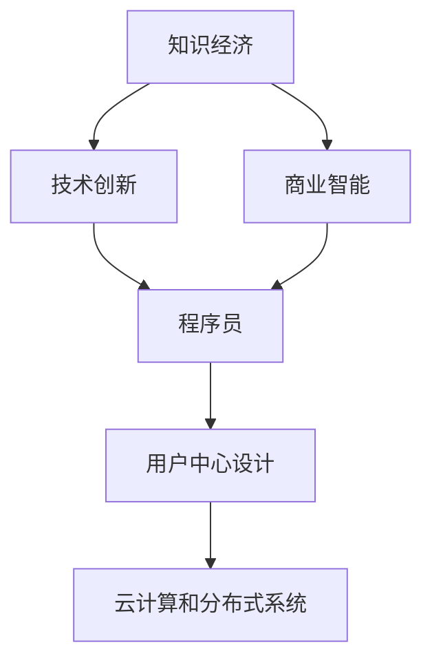

                 

# 程序员在知识经济时代的角色定位

## 1. 背景介绍

### 1.1 问题由来
随着互联网技术的迅速发展，人类社会已经进入知识经济时代。在这个时代，信息、知识和创新成为驱动经济增长的主要动力。程序员作为信息技术创新的主力军，其角色和职责也面临着深刻的变化和挑战。传统的线性软件设计和编码工作，已经逐步向更具创意和策略性的创新角色转型。

### 1.2 问题核心关键点
知识经济时代对程序员提出了更高的要求，不仅需要掌握编程和算法技能，还需要具备业务洞察、创新思维、团队合作等复合能力。核心关键点包括：
- **技术创新能力**：能够提出新算法、新架构，引领技术前沿。
- **业务理解能力**：能够理解业务需求，设计出契合实际场景的解决方案。
- **跨学科能力**：能够理解和应用其他学科知识，提升创新边界。
- **协作与沟通**：能够与产品经理、设计师、销售等部门有效沟通协作。
- **持续学习能力**：不断学习新技术，适应快速变化的技术环境。

## 2. 核心概念与联系

### 2.1 核心概念概述

为更好地理解程序员在知识经济时代的角色定位，本节将介绍几个密切相关的核心概念：

- **知识经济**：指经济活动以知识和信息的生产、传播、使用为基础，强调创新和知识资源的价值。
- **程序员**：指具备计算机科学基础，能够编写、维护和优化软件系统的人。
- **技术创新**：指通过新技术和新方法，改善和优化现有产品和服务的过程。
- **商业智能**：指将数据分析、人工智能等技术应用于商业决策，提升企业竞争力。
- **用户中心设计**：指以用户需求为中心，设计出更加人性化的产品和应用。
- **云计算和分布式系统**：指通过互联网实现大规模数据和计算资源的共享和利用。

这些核心概念之间的逻辑关系可以通过以下Mermaid流程图来展示：



这个流程图展示的知识经济时代程序员的核心概念及其之间的关系：

1. 知识经济强调知识和技术的价值。
2. 技术创新是知识经济的核心驱动力。
3. 程序员是技术创新的主要执行者。
4. 商业智能通过技术创新提升企业竞争力。
5. 用户中心设计关注用户需求，提升用户体验。
6. 云计算和分布式系统提供了技术实现的基础设施。

这些概念共同构成了程序员在知识经济时代的角色定位，使其能够在技术和商业的交汇点中发挥关键作用。

## 3. 核心算法原理 & 具体操作步骤
### 3.1 算法原理概述

在知识经济时代，程序员的核心工作不仅仅是编写代码，更在于设计和实现具有技术前瞻性、商业可行性和用户友好性的创新解决方案。以下是对程序员核心算法和操作步骤的详细介绍：

- **需求分析**：深入理解用户需求和业务场景，设计合理的系统架构和数据模型。
- **算法设计**：选择合适的算法和数据结构，构建高效、可扩展的解决方案。
- **系统实现**：通过编程语言和开发工具，将算法和数据模型转化为实际运行的系统。
- **测试与优化**：在实际应用中测试系统性能，根据反馈持续优化代码和系统架构。
- **部署与维护**：将系统部署到生产环境，持续监控和维护，确保系统稳定运行。

### 3.2 算法步骤详解

#### 3.2.1 需求分析

**步骤一：用户调研**
- 收集用户反馈和业务需求，了解用户痛点和需求。
- 组织头脑风暴和设计会议，收集多方面的意见和建议。
- 定义用户角色和场景，明确系统需要解决的问题。

**步骤二：业务建模**
- 根据用户调研结果，进行业务建模，建立业务流程和数据模型。
- 使用UML、ERD等工具，将业务需求转换为可视化模型。
- 分析数据流、流程和功能，确保业务逻辑的清晰和完整。

**步骤三：技术评估**
- 评估现有技术的可行性和适用性，选择最适合的技术方案。
- 对比不同架构和框架的优缺点，确定系统技术架构。
- 评估新技术和工具的潜力，为未来的扩展和升级做准备。

#### 3.2.2 算法设计

**步骤一：算法选择**
- 根据业务需求，选择合适的算法和数据结构。
- 考虑算法的复杂度、可扩展性和性能。
- 对算法进行初步测试和验证，确保其正确性和可行性。

**步骤二：算法实现**
- 编写代码实现算法，确保代码的可读性和可维护性。
- 使用版本控制系统，记录代码的每一次修改和更新。
- 使用单元测试和集成测试，验证代码的正确性和可靠性。

**步骤三：性能优化**
- 对代码进行性能分析，识别瓶颈和优化点。
- 使用并行计算、缓存技术、算法优化等手段提升性能。
- 持续监测系统性能，及时调整和优化代码。

#### 3.2.3 系统实现

**步骤一：框架选择**
- 选择合适的开发框架和工具，提升开发效率和代码质量。
- 使用MVC、MVVM等架构模式，将系统分为不同的模块和组件。
- 使用第三方库和插件，提升开发速度和系统功能。

**步骤二：代码实现**
- 根据技术架构，编写系统代码，实现各个模块和组件。
- 使用模块化、组件化开发方式，提高代码的可复用性和可维护性。
- 使用代码规范和最佳实践，确保代码的质量和可读性。

**步骤三：接口设计**
- 设计系统的API接口，方便与其他系统和模块交互。
- 使用RESTful API、SOAP等协议，确保接口的标准化和可靠性。
- 使用文档工具，编写接口文档，方便后续维护和开发。

#### 3.2.4 测试与优化

**步骤一：单元测试**
- 编写单元测试用例，验证代码的每个组件和函数。
- 使用测试框架，自动化运行测试用例，提升测试效率。
- 定期运行测试，及时发现和修复代码缺陷。

**步骤二：集成测试**
- 对系统进行集成测试，验证各个模块之间的协同工作。
- 使用模拟数据和测试工具，模拟真实场景下的系统运行。
- 及时调整和优化代码，确保系统的稳定性和可靠性。

**步骤三：性能测试**
- 进行系统性能测试，评估系统的响应速度和负载能力。
- 使用负载测试工具，模拟不同用户负载下的系统表现。
- 优化系统性能，提升用户体验和系统效率。

#### 3.2.5 部署与维护

**步骤一：系统部署**
- 选择合适的基础设施，部署系统到生产环境。
- 配置系统环境，确保系统在生产环境中的稳定运行。
- 进行系统备份和恢复测试，确保数据安全和系统可靠性。

**步骤二：系统监控**
- 使用监控工具，实时监测系统运行状态和性能指标。
- 设置告警机制，及时发现和处理系统异常。
- 定期进行系统维护，确保系统的稳定性和性能。

**步骤三：系统更新**
- 定期发布系统更新，修复已知缺陷和提升系统功能。
- 使用持续集成和持续交付(CI/CD)工具，提升系统更新效率。
- 定期进行系统备份，确保系统数据的安全性。

## 4. 数学模型和公式 & 详细讲解  
### 4.1 数学模型构建

在知识经济时代，程序员的核心工作不仅仅是编程，还涉及数据分析、机器学习和商业智能等领域。以下是对这些领域中数学模型和公式的详细讲解：

**数据建模**
- 使用回归分析、分类算法、聚类分析等模型，建立数据模型。
- 使用R、Python等工具，实现数据的可视化和分析。
- 使用SQL、NoSQL等数据库技术，存储和管理数据。

**机器学习**
- 使用监督学习、非监督学习、强化学习等算法，进行数据分析和预测。
- 使用TensorFlow、PyTorch等深度学习框架，实现模型的训练和优化。
- 使用Evaluate、ROC曲线等指标，评估模型的性能。

**商业智能**
- 使用数据仓库、OLAP技术，构建数据模型和分析模型。
- 使用BI工具，实现数据的可视化和报表生成。
- 使用多维数据分析技术，支持决策支持系统的开发。

### 4.2 公式推导过程

#### 4.2.1 线性回归模型

**公式推导过程**
- 假设训练样本集为$(x_i, y_i)$，其中$x_i \in \mathbb{R}^n, y_i \in \mathbb{R}$。
- 设线性回归模型为$y = \beta_0 + \beta_1 x_1 + \beta_2 x_2 + ... + \beta_n x_n$。
- 根据最小二乘法，求解模型参数$\beta$，使得$\sum_{i=1}^n (y_i - (\beta_0 + \beta_1 x_{i1} + \beta_2 x_{i2} + ... + \beta_n x_{in}))^2$最小。
- 使用矩阵形式表示为$\beta = (X^TX)^{-1}X^Ty$，其中$X$为设计矩阵，$y$为训练集标签。

**案例分析与讲解**
- 某电商网站需要对用户购买行为进行预测，假设数据集为$(x_i, y_i)$，其中$x_i$为用户的年龄、性别、收入等特征，$y_i$为用户是否购买某一产品。
- 使用线性回归模型，建立用户购买行为预测模型。
- 对模型进行训练和验证，评估模型性能。
- 根据预测结果，优化营销策略，提升销售转化率。

#### 4.2.2 决策树模型

**公式推导过程**
- 决策树模型通过递归地将数据集划分为更小的子集，构建一棵决策树。
- 每个节点表示一个特征，每个分支表示一个特征值。
- 每个叶子节点表示一个类别，叶节点的数目即为类别数目。
- 通过最大化信息增益或信息增益比，选择最优特征进行划分。

**案例分析与讲解**
- 某银行的信用评估系统需要对客户信用进行分类，假设数据集为$(x_i, y_i)$，其中$x_i$为客户的收入、消费、信用记录等特征，$y_i$为客户的信用等级。
- 使用决策树模型，构建信用评估模型。
- 对模型进行训练和验证，评估模型性能。
- 根据预测结果，优化信用评估流程，降低违约风险。

#### 4.2.3 神经网络模型

**公式推导过程**
- 神经网络模型由多层神经元组成，通过反向传播算法进行训练。
- 假设输入层为$x$，隐藏层为$h$，输出层为$y$，网络结构为$x \rightarrow h \rightarrow y$。
- 设隐藏层激活函数为$f$，输出层激活函数为$g$。
- 使用梯度下降算法，求解模型参数$\theta$，使得损失函数最小。

**案例分析与讲解**
- 某医院需要对患者的疾病进行诊断，假设数据集为$(x_i, y_i)$，其中$x_i$为患者的症状、病史等特征，$y_i$为患者的疾病类型。
- 使用神经网络模型，构建疾病诊断模型。
- 对模型进行训练和验证，评估模型性能。
- 根据预测结果，优化诊断流程，提高诊断准确率。

## 5. 项目实践：代码实例和详细解释说明
### 5.1 开发环境搭建

在进行知识经济时代的技术实践前，我们需要准备好开发环境。以下是使用Python进行PyTorch开发的环境配置流程：

1. 安装Anaconda：从官网下载并安装Anaconda，用于创建独立的Python环境。

2. 创建并激活虚拟环境：
```bash
conda create -n pytorch-env python=3.8 
conda activate pytorch-env
```

3. 安装PyTorch：根据CUDA版本，从官网获取对应的安装命令。例如：
```bash
conda install pytorch torchvision torchaudio cudatoolkit=11.1 -c pytorch -c conda-forge
```

4. 安装TensorFlow：
```bash
pip install tensorflow==2.0
```

5. 安装各类工具包：
```bash
pip install numpy pandas scikit-learn matplotlib tqdm jupyter notebook ipython
```

完成上述步骤后，即可在`pytorch-env`环境中开始技术实践。

### 5.2 源代码详细实现

下面我们以线性回归模型为例，给出使用PyTorch实现的代码实例。

```python
import torch
import torch.nn as nn
import torch.optim as optim
import numpy as np

class LinearRegression(nn.Module):
    def __init__(self, input_size, output_size):
        super(LinearRegression, self).__init__()
        self.linear = nn.Linear(input_size, output_size)

    def forward(self, x):
        out = self.linear(x)
        return out

# 准备数据
X = np.array([[1, 2, 3], [4, 5, 6], [7, 8, 9]])
y = np.array([10, 20, 30])
X = torch.from_numpy(X).float()
y = torch.from_numpy(y).float()

# 定义模型和优化器
model = LinearRegression(input_size=3, output_size=1)
optimizer = optim.SGD(model.parameters(), lr=0.01)

# 定义损失函数
criterion = nn.MSELoss()

# 训练模型
for epoch in range(1000):
    optimizer.zero_grad()
    output = model(X)
    loss = criterion(output, y)
    loss.backward()
    optimizer.step()
    if (epoch+1) % 100 == 0:
        print(f"Epoch: {epoch+1}, Loss: {loss.item():.4f}")
        
# 测试模型
test_X = np.array([[10, 11, 12]])
test_X = torch.from_numpy(test_X).float()
test_y = model(test_X)
print(f"Predicted output: {test_y.item():.4f}")
```

以上就是使用PyTorch实现线性回归模型的代码实例。可以看到，PyTorch提供了丰富的机器学习组件，可以方便地构建和训练各种模型。

### 5.3 代码解读与分析

让我们再详细解读一下关键代码的实现细节：

**LinearRegression类**
- 定义了线性回归模型，包括输入层和输出层。
- 使用`nn.Linear`构建线性层，进行特征映射。
- 重写`forward`方法，将输入映射到输出。

**数据准备**
- 使用NumPy生成训练样本。
- 将样本转换为PyTorch张量，方便模型训练。

**模型和优化器定义**
- 实例化线性回归模型，使用SGD优化器。
- 定义损失函数，使用均方误差损失。

**模型训练**
- 使用SGD优化器进行梯度下降，更新模型参数。
- 每100个epoch输出一次训练损失，监控训练过程。

**模型测试**
- 使用训练好的模型对新样本进行预测。
- 输出预测结果，评估模型性能。

## 6. 实际应用场景

### 6.1 智能客服系统

在知识经济时代，智能客服系统已经成为企业提升客户体验和服务效率的重要手段。传统的客服中心需要大量人工参与，难以满足24小时不间断服务的需求。使用微调后的机器学习模型，可以自动化处理大量客服请求，提升服务效率和质量。

具体而言，可以收集企业内部的历史客服对话记录，将问题和最佳答复构建成监督数据，在此基础上对预训练模型进行微调。微调后的对话模型能够自动理解用户意图，匹配最合适的答案模板进行回复。对于客户提出的新问题，还可以接入检索系统实时搜索相关内容，动态组织生成回答。如此构建的智能客服系统，能大幅提升客户咨询体验和问题解决效率。

### 6.2 金融风险控制

金融行业是知识经济的重要领域，对于风险控制和决策支持有着极高的要求。传统的风险控制方法往往依赖专家经验和规则，难以应对复杂多变的市场环境。使用微调后的机器学习模型，可以自动化处理和分析大量金融数据，提升风险控制的准确性和及时性。

具体而言，可以收集金融市场的交易数据、公司财务数据等，构建金融领域的监督数据集。使用微调后的机器学习模型，对市场趋势、公司财务状况等进行预测和分析，及时发现风险点，制定应对策略。同时，可以构建基于深度学习模型的金融投资策略，提高投资回报率和风险控制能力。

### 6.3 医疗诊断系统

医疗行业是知识经济的另一重要领域，对于医疗诊断和治疗有着极高的要求。传统的医疗诊断依赖医生的经验和直觉，难以应对复杂多变的病患症状。使用微调后的机器学习模型，可以自动化处理和分析大量医疗数据，提升诊断和治疗的准确性和效率。

具体而言，可以收集医院中的病患数据、医疗影像数据等，构建医疗领域的监督数据集。使用微调后的机器学习模型，对病患的病情、症状等进行预测和分析，及时发现疾病风险，制定治疗方案。同时，可以构建基于深度学习模型的医疗影像诊断系统，提高影像识别的准确性和效率。

### 6.4 未来应用展望

随着知识经济的发展，程序员的角色将更加多样化、复合化，具有更强的技术创新能力和跨学科协作能力。未来，程序员将不仅是软件开发者，更是数据分析师、商业智能专家、产品经理等多角色的集成体。同时，随着人工智能技术的发展，程序员将更多地涉及人工智能算法和模型设计，成为AI应用开发的重要力量。

1. **数据驱动决策**：未来的企业将更多依赖数据分析和机器学习模型进行决策，程序员将承担数据分析和模型构建的重要角色。
2. **跨领域协作**：未来的技术应用将涉及多个领域，程序员需要具备跨学科知识和协作能力，与产品经理、设计师、市场人员等多角色进行有效沟通和协作。
3. **人工智能应用**：未来的技术应用将更多涉及人工智能技术，程序员需要掌握深度学习、自然语言处理、计算机视觉等技术，开发出更加智能、高效的应用系统。

总之，知识经济时代程序员的角色将更加多元化和复杂化，需要在技术、业务、协作等多方面不断提升和适应，才能更好地应对未来的挑战和机遇。

## 7. 工具和资源推荐

### 7.1 学习资源推荐

为了帮助程序员系统掌握知识经济时代的技能和知识，这里推荐一些优质的学习资源：

1. 《机器学习实战》（原书第2版）：从基础理论到实际应用，全面介绍机器学习技术，适合初学者和进阶开发者。
2. 《深度学习》（Goodfellow等）：经典深度学习教材，系统介绍深度学习理论和技术，涵盖神经网络、卷积神经网络、循环神经网络等。
3. 《商业智能：原理与实践》（Holstein等）：介绍商业智能的基本原理和实现方法，适合商务分析师和技术开发者。
4. 《数据科学导论》（Tan等）：系统介绍数据科学的基本概念和应用，涵盖数据采集、数据清洗、数据可视化等。
5. 《自然语言处理综论》（Nauwerbier等）：介绍自然语言处理的基本理论和技术，涵盖语言模型、文本分类、机器翻译等。

通过对这些资源的学习实践，相信你一定能够快速掌握知识经济时代的技能和知识，为未来的职业生涯奠定坚实基础。

### 7.2 开发工具推荐

高效的开发离不开优秀的工具支持。以下是几款用于知识经济时代技术开发的工具：

1. Jupyter Notebook：基于Web的交互式编程环境，支持Python、R等编程语言，方便进行数据分析和机器学习实验。
2. TensorFlow：Google开发的深度学习框架，支持分布式计算和GPU加速，适合大规模模型训练和部署。
3. PyTorch：Facebook开发的深度学习框架，具有动态图特性和易用性，适合快速迭代和研究。
4. Docker：开源容器化平台，方便进行环境部署和应用打包，支持微服务架构和持续集成。
5. GitLab：开源项目管理平台，支持代码版本控制、持续集成、持续交付等，适合团队协作和版本管理。

合理利用这些工具，可以显著提升知识经济时代的技术开发效率，加快创新迭代的步伐。

### 7.3 相关论文推荐

知识经济时代的技术发展源于学界的持续研究。以下是几篇奠基性的相关论文，推荐阅读：

1. 《神经网络与深度学习》（Goodfellow等）：经典深度学习教材，涵盖神经网络、深度学习的基本理论和应用。
2. 《数据挖掘：概念与技术》（Hand等）：系统介绍数据挖掘的基本概念和技术，涵盖数据预处理、特征工程、分类与聚类等。
3. 《商业智能：原理与实践》（Holstein等）：介绍商业智能的基本原理和实现方法，适合商务分析师和技术开发者。
4. 《机器学习：一种现代方法》（Hastie等）：经典机器学习教材，涵盖监督学习、非监督学习、强化学习等基本算法和应用。
5. 《自然语言处理综论》（Nauwerbier等）：介绍自然语言处理的基本理论和技术，涵盖语言模型、文本分类、机器翻译等。

这些论文代表了大数据、人工智能等领域的最新研究成果，为程序员提供了全面的理论支持。

## 8. 总结：未来发展趋势与挑战

### 8.1 总结

本文对知识经济时代程序员的角色定位进行了全面系统的介绍。首先阐述了知识经济时代的技术背景和程序员角色的变化，明确了程序员在技术创新、业务理解和跨学科协作等方面的职责。其次，从算法原理和操作步骤的角度，详细讲解了程序员在知识经济时代需要掌握的关键技术和方法，包括需求分析、算法设计、系统实现、测试与优化、部署与维护等环节。同时，本文还广泛探讨了程序员在实际应用中的常见场景，展示了知识经济时代技术应用的广泛性和重要性。

通过本文的系统梳理，可以看到，知识经济时代程序员的角色定位正在发生深刻变化，需要在技术、业务、协作等多方面不断提升和适应。未来，随着技术的不断发展，程序员将更多地涉及人工智能、商业智能等前沿技术，成为推动知识经济发展的关键力量。

### 8.2 未来发展趋势

展望未来，知识经济时代的程序员将呈现以下几个发展趋势：

1. **技术创新**：未来的技术发展将更加依赖于人工智能和机器学习，程序员将更多地涉及深度学习、自然语言处理、计算机视觉等前沿技术。
2. **跨领域协作**：未来的技术应用将涉及多个领域，程序员需要具备跨学科知识和协作能力，与产品经理、设计师、市场人员等多角色进行有效沟通和协作。
3. **数据驱动决策**：未来的企业将更多依赖数据分析和机器学习模型进行决策，程序员将承担数据分析和模型构建的重要角色。
4. **人工智能应用**：未来的技术应用将更多涉及人工智能技术，程序员需要掌握深度学习、自然语言处理、计算机视觉等技术，开发出更加智能、高效的应用系统。
5. **持续学习**：未来的技术环境将更加复杂和快速变化，程序员需要持续学习和更新知识，跟上技术发展的步伐。

以上趋势凸显了知识经济时代程序员的广阔前景和挑战。这些方向的探索发展，必将进一步提升程序员的创新能力和职业竞争力，为构建智能、高效、安全的应用系统奠定坚实基础。

### 8.3 面临的挑战

尽管知识经济时代的程序员面临着广阔的前景，但在迈向更加智能化、普适化应用的过程中，仍面临诸多挑战：

1. **技术复杂性**：未来的技术应用将涉及更多的算法和工具，程序员需要具备更高的技术水平和跨学科知识。
2. **业务理解**：未来的技术应用将更多地依赖于业务需求，程序员需要深入理解业务逻辑，提供更精准的技术解决方案。
3. **跨领域协作**：未来的技术应用将涉及多个领域，程序员需要具备跨学科知识和协作能力，与多角色进行有效沟通和协作。
4. **数据安全和隐私**：未来的技术应用将更多依赖于数据分析，程序员需要具备数据安全和隐私保护的知识，确保数据使用的合法性和安全性。
5. **人工智能伦理**：未来的技术应用将更多涉及人工智能，程序员需要具备人工智能伦理的知识，确保技术应用的道德和合规性。

正视这些挑战，积极应对并寻求突破，将是大数据时代程序员迈向成熟的重要步骤。相信随着学界和产业界的共同努力，这些挑战终将一一被克服，程序员必将在构建智能、高效、安全的应用系统过程中发挥关键作用。

### 8.4 研究展望

面向未来，程序员在知识经济时代的研究方向将包括以下几个方面：

1. **深度学习和神经网络**：未来的技术发展将更多依赖于深度学习和神经网络，程序员需要掌握最新算法和工具，开发出更加高效、智能的应用系统。
2. **商业智能和大数据**：未来的企业将更多依赖于商业智能和大数据，程序员需要掌握数据挖掘、数据可视化和商业智能技术，提供数据分析和决策支持。
3. **人工智能伦理和安全**：未来的技术应用将更多涉及人工智能，程序员需要具备人工智能伦理和安全保护的知识，确保技术应用的道德和合规性。
4. **跨学科协作和知识整合**：未来的技术应用将涉及多个领域，程序员需要具备跨学科知识和协作能力，与多角色进行有效沟通和协作。

这些研究方向将引领程序员在知识经济时代的持续发展和进步，为构建智能、高效、安全的应用系统提供全面的理论和技术支持。

## 9. 附录：常见问题与解答

**Q1：知识经济时代程序员需要掌握哪些关键技能？**

A: 知识经济时代程序员需要掌握以下关键技能：
1. **编程和算法**：掌握Python、Java、C++等编程语言和基本算法，具备编程能力和问题解决能力。
2. **数据分析和机器学习**：掌握统计学、数据挖掘、机器学习等技术，具备数据分析和模型构建能力。
3. **跨领域协作**：具备跨学科知识和协作能力，与产品经理、设计师、市场人员等多角色进行有效沟通和协作。
4. **人工智能应用**：掌握深度学习、自然语言处理、计算机视觉等技术，开发出更加智能、高效的应用系统。
5. **持续学习和更新**：具备持续学习和更新知识的能力，跟上技术发展的步伐。

**Q2：知识经济时代程序员如何保持技术竞争力？**

A: 知识经济时代程序员需要不断学习和更新知识，保持技术竞争力。以下是一些具体建议：
1. **学习前沿技术**：关注前沿技术和学术研究，参加技术会议、阅读技术博客、参与开源项目等，保持技术敏感性和前瞻性。
2. **持续实践**：通过实际项目和代码实现，积累经验，提升技术水平。参加技术竞赛、参与开源项目等，提升编程和算法能力。
3. **跨领域学习**：具备跨学科知识和跨领域协作能力，学习其他领域的基本知识和思维方式，提升综合素质。
4. **团队合作**：与多角色进行有效沟通和协作，提升团队合作能力和项目管理能力。
5. **持续改进**：对技术方案和代码实现进行持续改进，提升系统性能和用户体验。

**Q3：知识经济时代程序员如何应对复杂技术环境？**

A: 知识经济时代程序员需要具备应对复杂技术环境的能力。以下是一些具体建议：
1. **技术积累**：不断积累技术知识和经验，掌握多种技术工具和框架。
2. **跨领域协作**：具备跨学科知识和协作能力，与多角色进行有效沟通和协作。
3. **问题分解**：将复杂问题分解为多个小问题，逐个解决，逐步推进技术实现。
4. **代码优化**：对代码进行持续优化，提升系统性能和可维护性。
5. **技术反思**：对技术方案和实现进行持续反思和改进，提升技术水平和解决方案的准确性。

总之，知识经济时代程序员需要在技术、业务、协作等多方面不断提升和适应，才能更好地应对未来的挑战和机遇。相信通过持续学习和实践，程序员将能够在知识经济时代发挥关键作用，推动技术的创新和应用。

---

作者：禅与计算机程序设计艺术 / Zen and the Art of Computer Programming

