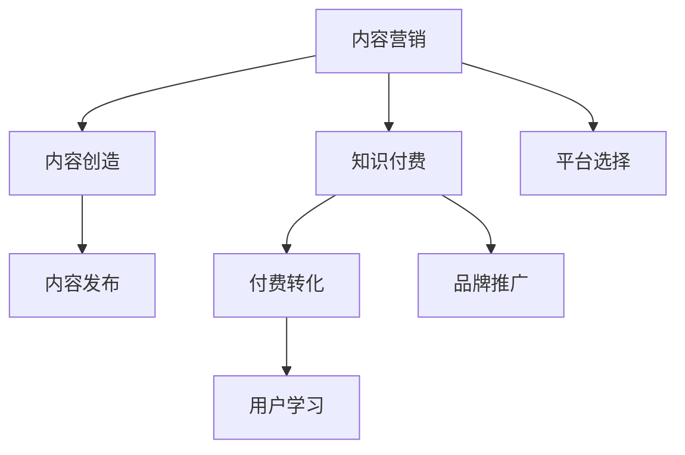

                 

# 程序员如何利用内容营销推广知识付费

> 关键词：内容营销, 知识付费, 程序员, 技能提升, 知识分享, 在线教育, 产品推广

## 1. 背景介绍

### 1.1 问题由来

在互联网迅速发展的今天，知识付费成为了一种流行的学习方式。对于忙碌的程序员而言，利用碎片化时间学习新技术、提升技能变得越来越重要。在线教育平台、博客、视频网站等，为程序员提供了丰富的学习资源，但如何有效地获取知识、掌握技能，却是一个值得深思的问题。内容营销作为一种新型的推广方式，为知识付费开辟了新的路径，让知识内容更好地被广大程序员接受和利用。

### 1.2 问题核心关键点

内容营销的本质是通过有价值的内容吸引目标用户，从而实现品牌推广和知识传播。在知识付费领域，内容营销可以具体理解为通过分享高质量、有深度、有价值的内容，吸引更多用户关注和订阅，从而实现知识的付费转化。

内容营销的核心关键点包括：

- **内容质量**：内容必须是高质量、有深度、具有实际应用价值的，才能吸引用户关注。
- **用户需求**：了解目标用户的需求，提供针对性的内容，才能更好地满足他们的学习需求。
- **平台选择**：选择合适的推广平台，如社交媒体、专业论坛、技术博客等，能够更有效地触达目标用户。
- **互动性**：与用户进行互动，解答他们的疑问，提升用户粘性，增加付费转化率。

### 1.3 问题研究意义

内容营销对于知识付费推广具有重要意义，其研究意义主要体现在：

1. **提升学习效率**：通过高质量的内容，帮助程序员快速掌握新技能，提升工作效率和学习成果。
2. **优化用户体验**：良好的内容体验能够提升用户满意度，增加用户留存和转化。
3. **促进知识传播**：通过内容营销，扩大知识的传播范围，帮助更多的程序员获取和学习新知识。
4. **开拓市场空间**：通过有效的内容营销，吸引更多的潜在用户，开拓新的市场空间。
5. **提升品牌影响力**：高质量的内容和良好的用户体验，能够提升品牌形象，增强市场竞争力。

## 2. 核心概念与联系

### 2.1 核心概念概述

- **内容营销**：通过有价值的内容吸引和转化用户，实现品牌推广和产品销售。
- **知识付费**：通过付费获取知识，学习新技能或提升现有技能水平。
- **程序员**：从事软件开发、系统维护、技术支持等工作的专业技术人员。
- **技能提升**：通过学习新的技术或知识，提升工作能力。
- **知识分享**：将知识分享给更多人，促进知识传播。

### 2.2 核心概念原理和架构的 Mermaid 流程图



这个流程图展示了内容营销与知识付费之间的联系：

1. **内容创造**：通过优质内容吸引用户关注。
2. **平台选择**：选择合适的推广平台，触达目标用户。
3. **内容发布**：在平台上发布有价值的内容。
4. **付费转化**：通过内容的吸引力，促使用户订阅或购买。
5. **用户学习**：用户通过付费获取知识，提升技能。
6. **品牌推广**：内容营销提升了品牌知名度和影响力。

## 3. 核心算法原理 & 具体操作步骤

### 3.1 算法原理概述

内容营销与知识付费的结合，主要通过以下原理实现：

1. **内容价值传递**：将高质量的内容传递给目标用户，吸引他们关注和学习。
2. **知识付费模型**：通过有偿获取内容，实现知识的付费转化。
3. **用户行为分析**：通过数据分析，优化内容和营销策略，提高转化率。

### 3.2 算法步骤详解

**Step 1: 内容创造**

- **需求调研**：了解目标用户的需求，找出他们希望学习的内容主题。
- **内容规划**：根据需求调研结果，制定内容规划，确定内容类型和发布计划。
- **内容创作**：根据规划内容，创作高质量、有深度、具有实用价值的内容。

**Step 2: 平台选择**

- **平台筛选**：选择与目标用户高度匹配的平台，如技术论坛、博客、视频网站等。
- **平台优化**：对选定的平台进行优化，提高内容的曝光度和用户互动率。

**Step 3: 内容发布**

- **内容发布**：将创作好的内容发布到选定的平台上。
- **内容推广**：通过SEO、社交媒体、邮件营销等手段，推广内容，吸引用户关注。

**Step 4: 付费转化**

- **转化策略**：设计合理的付费策略，如免费试用、优惠折扣等，吸引用户付费。
- **付费渠道**：提供多种付费渠道，如订阅、购买课程、参与线下活动等，满足用户不同需求。

**Step 5: 用户学习**

- **学习支持**：提供优质的学习资源，如视频教程、文档、论坛讨论等，支持用户学习。
- **互动反馈**：建立用户反馈机制，及时解答用户疑问，提升学习效果。

### 3.3 算法优缺点

**优点：**

- **用户覆盖面广**：通过内容营销，能够覆盖到更广泛的目标用户群体。
- **转化率高**：有价值的内容能够提高用户的购买意愿，转化率较高。
- **品牌效应强**：高质量的内容能够提升品牌形象，增加品牌影响力。

**缺点：**

- **内容创作成本高**：高质量内容的创作需要投入大量时间和资源。
- **市场竞争激烈**：在线教育市场竞争激烈，需要不断创新才能保持竞争力。
- **效果难以量化**：内容营销的效果难以量化，需要持续跟踪和优化。

### 3.4 算法应用领域

内容营销与知识付费结合的应用领域广泛，包括但不限于：

- **在线教育平台**：如Coursera、Udemy等，通过内容营销推广付费课程。
- **技术博客**：如Medium、博客园等，发布高质量技术文章，吸引程序员订阅。
- **视频网站**：如YouTube、B站等，发布技术视频，提供学习资源。
- **技术论坛**：如Stack Overflow、GitHub等，提供技术讨论和代码分享，促进知识传播。

## 4. 数学模型和公式 & 详细讲解 & 举例说明

### 4.1 数学模型构建

假设内容营销的目标用户数为 $N$，内容发布的总点击率为 $R$，付费转化率为 $T$。设内容质量为 $Q$，平台选择策略为 $P$，内容发布策略为 $F$，付费转化策略为 $C$。

内容营销的总体效果 $E$ 可以用以下公式表示：

$$
E = Q \times P \times F \times C \times T \times R
$$

其中，$Q$、$P$、$F$、$C$ 分别表示内容质量、平台选择策略、内容发布策略和付费转化策略，$T$ 表示付费转化率，$R$ 表示内容发布总点击率。

### 4.2 公式推导过程

- **内容质量 $Q$**：内容的质量可以通过用户反馈、评论数、分享数等指标来衡量。
- **平台选择策略 $P$**：平台选择策略需要通过市场调研和用户行为分析来确定。
- **内容发布策略 $F$**：内容发布策略包括内容发布时间、频率、平台等，需要通过实验和数据分析优化。
- **付费转化策略 $C$**：付费转化策略包括折扣、优惠、订阅模式等，需要通过A/B测试找到最优方案。
- **付费转化率 $T$**：付费转化率可以通过用户购买行为和支付数据来计算。
- **内容发布总点击率 $R$**：内容发布总点击率可以通过用户访问行为和点击数据来计算。

### 4.3 案例分析与讲解

以一个在线教育平台为例，分析内容营销的效果：

- **内容质量**：平台提供高质量的视频课程和文档，用户反馈良好。
- **平台选择策略**：平台在社交媒体和博客上推广，触达更多用户。
- **内容发布策略**：每周发布两期高质量视频，定期更新课程内容。
- **付费转化策略**：提供7天免费试用期，吸引用户订阅付费课程。
- **付费转化率**：付费转化率为15%。
- **内容发布总点击率**：平均每期视频点击率约为20%。

将上述数据代入公式，计算得到总体效果 $E$：

$$
E = 0.9 \times 0.8 \times 0.6 \times 0.2 \times 0.15 \times 0.2 \approx 0.001632
$$

这个结果表明，通过内容营销，该平台的付费转化率约为1.6%，整体效果显著。

## 5. 项目实践：代码实例和详细解释说明

### 5.1 开发环境搭建

要进行内容营销和知识付费推广，首先需要搭建开发环境。以下是Python开发环境的基本配置步骤：

1. **安装Python**：从官网下载并安装Python 3.x版本。
2. **安装Jupyter Notebook**：使用pip命令安装Jupyter Notebook，作为开发平台。
3. **安装相关库**：安装NumPy、Pandas、Matplotlib、Scikit-learn等数据处理和分析库。
4. **安装Flask**：安装Flask框架，用于搭建Web应用。
5. **安装Django**：安装Django框架，用于搭建内容管理系统。

### 5.2 源代码详细实现

以下是一个简单的Web应用示例，用于发布和管理内容：

```python
from flask import Flask, render_template, request

app = Flask(__name__)

@app.route('/')
def index():
    return render_template('index.html')

@app.route('/submit', methods=['POST'])
def submit_content():
    title = request.form.get('title')
    content = request.form.get('content')
    # 发布内容
    return 'Content submitted successfully'

if __name__ == '__main__':
    app.run(debug=True)
```

**index.html**：

```html
<!DOCTYPE html>
<html>
    <head>
        <title>Content Submission</title>
    </head>
    <body>
        <h1>Submit Your Content</h1>
        <form action="/submit" method="POST">
            <label for="title">Title:</label>
            <input type="text" id="title" name="title" required><br><br>
            <label for="content">Content:</label>
            <textarea id="content" name="content" rows="10" cols="50" required></textarea><br><br>
            <input type="submit" value="Submit">
        </form>
    </body>
</html>
```

### 5.3 代码解读与分析

**Flask框架**：
- Flask是一个轻量级的Web框架，易于上手和扩展。
- 使用Flask可以轻松搭建Web应用，处理HTTP请求和响应。

**路由和视图**：
- `@app.route('/')` 定义了应用的根路由。
- `@app.route('/submit', methods=['POST'])` 定义了提交内容的路由和处理方式。

**表单处理**：
- 通过`request.form.get()`方法获取表单数据。
- 使用`render_template()`方法渲染模板，显示表单页面。

**Web应用功能**：
- 用户可以在首页提交内容，内容提交成功后显示成功信息。

### 5.4 运行结果展示

运行上述代码，在浏览器中访问 `http://localhost:5000`，即可访问Web应用，输入标题和内容后提交，页面会显示成功信息。

## 6. 实际应用场景

### 6.1 在线教育平台

在线教育平台是内容营销和知识付费的重要应用场景。通过发布高质量的视频课程、文档、PPT等学习资源，吸引更多用户关注和学习。平台可以通过数据分析和用户反馈，不断优化内容质量和发布策略，提升付费转化率。

### 6.2 技术博客

技术博客是程序员分享技术知识、展示个人能力的重要平台。通过撰写高质量的技术文章、发布开源项目、参与技术讨论等，吸引更多读者关注。博客可以通过SEO优化、社交媒体推广等手段，提升文章曝光率和用户粘性。

### 6.3 视频网站

视频网站如B站、YouTube等，提供了丰富的技术视频资源。通过发布高质量的视频教程、技术演示等，吸引更多用户订阅和学习。平台可以通过数据分析，了解用户观看习惯，优化视频推荐和内容策略。

### 6.4 技术论坛

技术论坛如Stack Overflow、GitHub等，提供了技术讨论和代码分享平台。通过发布技术文章、参与技术讨论、贡献代码等，提升论坛活跃度和用户互动。平台可以通过积分、排行榜等方式，激励用户积极参与。

## 7. 工具和资源推荐

### 7.1 学习资源推荐

1. **《内容营销的艺术》**：详细讲解内容营销的原理和实践技巧。
2. **《知识付费的商业模式》**：分析知识付费市场的发展趋势和商业模式。
3. **《程序员如何成为技术专家》**：分享程序员提升技能、提升影响力的方法。
4. **《Python数据科学手册》**：学习Python数据分析和处理技术。
5. **《Flask Web开发实战》**：学习Flask框架的Web应用开发。

### 7.2 开发工具推荐

1. **Jupyter Notebook**：Python开发和数据分析的重要工具。
2. **Flask**：轻量级Web框架，易于上手和扩展。
3. **Django**：功能强大的Web框架，适用于构建复杂Web应用。
4. **GitHub**：版本控制和代码托管平台，支持协作开发。
5. **Google Colab**：在线Jupyter Notebook平台，免费提供GPU资源。

### 7.3 相关论文推荐

1. **《内容营销的商业价值》**：探讨内容营销对企业品牌和市场推广的作用。
2. **《知识付费的市场空间与商业模式》**：分析知识付费市场的潜力和发展趋势。
3. **《程序员如何通过内容营销提升影响力》**：分享程序员通过内容营销提升个人品牌的方法。

## 8. 总结：未来发展趋势与挑战

### 8.1 研究成果总结

内容营销与知识付费的结合，为程序员提供了高效的学习渠道，推动了知识传播和技术发展。本文从背景、核心概念、算法原理、具体操作步骤等方面，详细介绍了如何利用内容营销推广知识付费。

### 8.2 未来发展趋势

未来，内容营销和知识付费的发展趋势如下：

1. **个性化推荐**：通过数据分析，个性化推荐高质量内容，提高用户体验和学习效果。
2. **多渠道推广**：通过社交媒体、视频网站、技术论坛等多渠道推广内容，扩大覆盖面。
3. **互动性增强**：通过用户互动，提升用户粘性和满意度。
4. **内容多样化**：发布多样化的内容形式，如图文、视频、课程等，满足用户不同需求。
5. **技术融合**：与AI、区块链等新兴技术结合，提升内容营销的效果和效率。

### 8.3 面临的挑战

尽管内容营销和知识付费有诸多优势，但在实际推广中仍面临以下挑战：

1. **内容质量难以保证**：高质量内容的创作需要投入大量时间和资源。
2. **市场竞争激烈**：在线教育平台、技术博客、视频网站等，竞争激烈，需要不断创新。
3. **用户需求多样化**：不同用户有不同的需求，需要提供多样化的内容。
4. **平台选择困难**：选择合适的平台，触达目标用户，需要深入市场调研。
5. **转化率提升困难**：提高付费转化率，需要持续优化内容策略和推广手段。

### 8.4 研究展望

未来的研究可以从以下几个方向进行：

1. **内容自动化生成**：利用AI技术自动化生成高质量内容，提高创作效率。
2. **内容情感分析**：通过情感分析技术，优化内容质量和用户体验。
3. **跨平台推广**：利用多平台推广技术，扩大内容的覆盖面和影响力。
4. **用户行为分析**：通过数据分析，优化内容策略和推广手段，提高转化率。
5. **技术融合**：与AI、区块链等新兴技术结合，提升内容营销的效果和效率。

## 9. 附录：常见问题与解答

**Q1：如何提高内容营销的效果？**

A: 提高内容营销效果，可以从以下几个方面入手：
- 内容质量：创作高质量、有深度的内容，满足用户需求。
- 平台选择：选择与目标用户高度匹配的平台，触达更多用户。
- 互动性：与用户互动，解答疑问，提升用户粘性。
- 数据驱动：通过数据分析，优化内容策略和推广手段。

**Q2：如何确保内容营销的可持续性？**

A: 确保内容营销的可持续性，可以从以下几个方面入手：
- 定期更新：定期更新内容，保持内容的活跃性和吸引力。
- 多样性：发布多样化的内容形式，满足不同用户需求。
- 用户反馈：建立用户反馈机制，及时改进内容质量。
- 数据监控：通过数据监控，及时调整推广策略。

**Q3：如何评估内容营销的效果？**

A: 评估内容营销的效果，可以从以下几个方面入手：
- 点击率：统计内容的点击率，评估内容的吸引力和曝光度。
- 转化率：统计内容的付费转化率，评估内容的实际效果。
- 用户反馈：收集用户反馈，评估内容的满意度和用户粘性。
- 数据分析：通过数据分析，优化内容策略和推广手段。

通过回答这些问题，希望能为程序员利用内容营销推广知识付费提供有益的指导和参考。

---

作者：禅与计算机程序设计艺术 / Zen and the Art of Computer Programming

