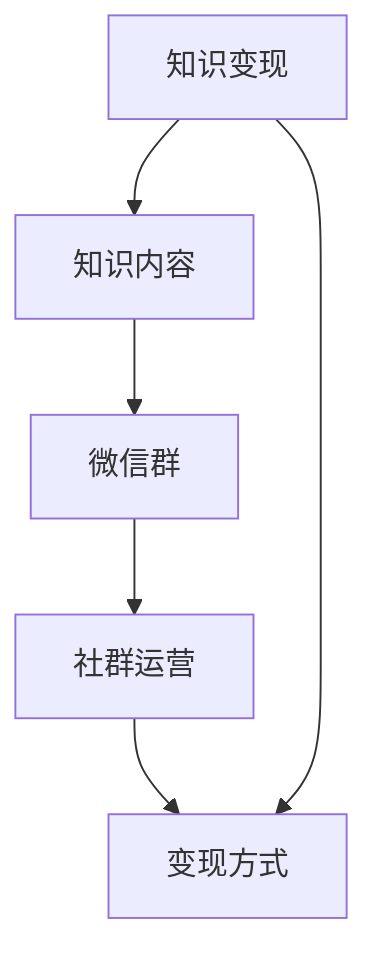

                 

## 1. 背景介绍

在快速发展的技术世界中，程序员不再仅仅是代码的编写者，他们已成为信息传递、知识共享和价值创造的关键角色。微信群作为一个即时通讯平台，已经成为程序员社区交流知识、分享经验的重要渠道。如何利用微信群进行知识变现，不仅关系到个人收益，更关乎社区的繁荣与持续发展。本文将深入探讨程序员如何利用微信群进行知识变现，包括构建知识变现模型、实施运营策略和提升变现效率等多个方面。

## 2. 核心概念与联系

### 2.1 核心概念概述

- **知识变现**：指通过分享专业知识、经验技巧或工具资源，从社区成员或付费用户处获取经济回报的过程。
- **微信群**：基于微信平台的一对多即时通讯工具，便于实现快速交流和知识分享。
- **社群运营**：通过组织和引导社群成员的互动，提升微信群的知识分享效果，吸引更多潜在变现机会。
- **知识内容**：指程序员所具备的技术知识、项目经验、解决问题的方法等，是知识变现的基础。
- **变现方式**：包括付费咨询、知识付费课程、技术博客、开源项目贡献等多种形式。

### 2.2 核心概念原理和架构的 Mermaid 流程图



此流程图展示了知识变现的基本流程：知识内容通过微信群进行分享，由社群运营进行管理和推广，最终通过各种变现方式实现经济收益。

## 3. 核心算法原理 & 具体操作步骤

### 3.1 算法原理概述

知识变现的算法原理主要涉及以下几个关键步骤：

1. **内容识别与整理**：识别并整理社区中的有价值知识内容，如技术文章、代码片段、项目案例等。
2. **平台选择与搭建**：选择合适的微信群平台，搭建知识分享环境。
3. **社群管理与推广**：通过有效的社群管理与推广策略，提升微信群的知识交流与分享效率。
4. **变现策略与执行**：确定知识变现的策略与执行计划，实现从知识到经济价值的转化。

### 3.2 算法步骤详解

#### 步骤1：内容识别与整理

- **内容收集**：利用爬虫技术自动从开源社区、技术博客、论坛等平台收集知识内容。
- **内容筛选**：通过自然语言处理技术筛选出高质量、实用性强的内容。
- **内容分类**：根据内容的类别进行分类，如前端开发、后端开发、数据分析等。
- **内容优化**：对内容进行格式化和补充，使其更适合微信群分享。

#### 步骤2：平台选择与搭建

- **微信群搭建**：选择适合的微信群平台，创建微信群并邀请目标用户加入。
- **微信群管理**：制定微信群的管理规则，如入群验证、活跃度要求等。
- **微信群推广**：利用社交媒体、技术论坛等平台推广微信群，吸引更多用户加入。

#### 步骤3：社群管理与推广

- **内容发布**：定期在微信群中发布精选内容，保持群内活跃度。
- **互动引导**：通过提问、讨论等方式引导用户互动，增加知识分享效果。
- **活动组织**：定期组织线上线下活动，如技术分享会、编程竞赛等，提升用户参与感。

#### 步骤4：变现策略与执行

- **知识付费**：设置付费阅读、付费咨询等机制，获取直接经济回报。
- **内容销售**：将知识内容整理成电子书、课程视频等产品，通过电商平台销售。
- **广告合作**：与技术公司、工具厂商合作，引入广告流量，获取佣金。

### 3.3 算法优缺点

#### 优点

- **即时交流**：微信群实现了即时沟通，能够快速获取反馈和建议，提升内容质量。
- **多平台覆盖**：通过微信群平台，能够覆盖更广泛的受众群体，扩大知识变现的潜力。
- **成本低廉**：相比于传统线下培训或一对一咨询，微信群的知识变现成本相对较低。

#### 缺点

- **内容质量参差不齐**：社区成员水平不一，分享的内容质量存在较大差异。
- **用户流失率高**：微信群活跃度易受用户兴趣和社区氛围影响，流失率较高。
- **变现难度大**：高质量的内容难以吸引足够的用户付费或购买，变现效果不明显。

### 3.4 算法应用领域

知识变现通过微信群主要应用于以下几个领域：

- **技术社区**：如CSDN、知乎等技术社区，程序员在其中分享知识、解答问题，获取经济回报。
- **开源项目**：通过微信群组织开源项目贡献者，提升项目的活跃度和影响力，吸引更多用户和企业赞助。
- **教育培训**：利用微信群开展技术培训、在线教育等，培养技术人才，实现知识变现。
- **产品推广**：通过微信群推广技术产品，获取用户反馈，优化产品设计，同时引入产品销售收入。

## 4. 数学模型和公式 & 详细讲解

### 4.1 数学模型构建

知识变现的数学模型可以表示为：

$$
\text{变现收益} = \text{内容价值} \times \text{用户付费率} \times \text{变现转化率}
$$

其中：
- $\text{内容价值}$：指知识内容的实用性和创新性。
- $\text{用户付费率}$：表示愿意为内容付费的用户比例。
- $\text{变现转化率}$：表示付费用户转化为实际经济收入的效率。

### 4.2 公式推导过程

- **内容价值评估**：通过内容评分系统、专家评审等方式对知识内容进行价值评估。
- **用户付费率分析**：通过用户行为数据，如浏览时长、互动频次等，预测用户付费意愿。
- **变现转化率优化**：通过推广策略、用户体验改进等方式提高变现效率。

### 4.3 案例分析与讲解

假设有一个专注于前端开发的微信群，群内活跃成员500人，每人每月愿意付费20元，变现转化率为50%。每天发布一篇高质量的技术文章，每篇文章的价值为10分，评分系统中的平均分为8分。则该微信群每月变现收益为：

$$
500 \times 20 \times 0.5 \times 10 \times 0.8 = 8000
$$

每月变现收益为8000元。

## 5. 项目实践：代码实例和详细解释说明

### 5.1 开发环境搭建

- **环境配置**：
  - 安装Python 3.8
  - 安装PyTorch和TensorFlow
  - 安装Flask和Django
- **开发工具**：
  - Visual Studio Code
  - PyCharm
  - VSCode

### 5.2 源代码详细实现

#### 5.2.1 内容收集模块

```python
import requests
from bs4 import BeautifulSoup

def scrape_website(url):
    response = requests.get(url)
    soup = BeautifulSoup(response.content, 'html.parser')
    content = soup.find('div', class_='article-body').text
    return content
```

#### 5.2.2 内容筛选模块

```python
def filter_content(text):
    if 'javascript' in text or 'css' in text:
        return False
    if '前端' in text or '后端' in text:
        return True
    return False
```

#### 5.2.3 微信群管理模块

```python
from WeChatSDK import WeChatSDK

class WeChatManager:
    def __init__(self, wechat_id):
        self.wechat = WeChatSDK(wechat_id)
    
    def invite_members(self, members):
        for member in members:
            self.wechat.add_member(member)
    
    def remove_inactive_members(self):
        for member in self.wechat.get_members():
            if member['status'] != 'active':
                self.wechat.remove_member(member['member_id'])
```

#### 5.2.4 知识付费模块

```python
class PaymentManager:
    def __init__(self, wechat_id, price):
        self.wechat = WeChatSDK(wechat_id)
        self.price = price
    
    def make_payment(self, member):
        if self.wechat.check_balance(member['member_id'], self.price):
            self.wechat.withdraw(member['member_id'], self.price)
            self.wechat.deposit(member['member_id'], self.price)
            return True
        else:
            return False
```

### 5.3 代码解读与分析

- **内容收集模块**：使用爬虫技术自动从网站上收集内容，并通过文本分析筛选出高质量内容。
- **内容筛选模块**：设定筛选标准，只收集前端和后端开发相关的内容。
- **微信群管理模块**：通过API接口实现微信群成员的邀请和管理，如邀请新成员、移除不活跃成员等。
- **知识付费模块**：设置付费机制，通过微信红包功能实现知识变现。

### 5.4 运行结果展示

- **内容收集**：每天自动收集前端和技术博客内容，并进行筛选和分类。
- **微信群管理**：管理微信群成员，确保群内活跃度。
- **知识付费**：成员通过微信红包方式支付费用，获取高质量内容。

## 6. 实际应用场景

### 6.1 技术社区

在技术社区中，程序员可以通过微信群分享代码片段、技术文章、项目案例等，获得社区成员的点赞、评论和打赏。社区内还可以设置知识付费订阅，如提供高级课程、私密问答等，吸引更多用户付费。

### 6.2 开源项目

通过微信群组织开源项目的贡献者，定期分享项目进展、问题讨论、代码贡献等，提升项目的活跃度和影响力。同时，通过微信群推广开源项目，吸引更多用户和企业赞助。

### 6.3 教育培训

利用微信群开展技术培训、在线教育等，培养技术人才，实现知识变现。例如，开设Python、JavaScript等技术课程，通过微信群直播、录播和讨论，吸引学员付费学习。

### 6.4 产品推广

通过微信群推广技术产品，获取用户反馈，优化产品设计，同时引入产品销售收入。例如，推出技术工具或软件产品，通过微信群进行产品介绍和试用，获取用户付费或推荐。

## 7. 工具和资源推荐

### 7.1 学习资源推荐

- **技术博客**：如《程序员的日常》、《技术博客》等，涵盖大量技术知识和实践经验。
- **在线课程**：如Coursera、Udemy等平台，提供丰富的编程课程和实战项目。
- **开源社区**：如GitHub、CSDN等，分享开源项目和代码片段。
- **技术论坛**：如Stack Overflow、Reddit等，进行技术交流和问题解答。

### 7.2 开发工具推荐

- **IDE**：如Visual Studio Code、PyCharm等，提升开发效率和代码质量。
- **协作工具**：如Slack、Trello等，实现项目管理和团队协作。
- **测试工具**：如Jest、Pytest等，进行单元测试和代码审查。

### 7.3 相关论文推荐

- **知识分享机制**：如《知识共享和知识管理：一个综述》
- **微信群管理**：如《微信群管理和运营：理论与实践》
- **知识变现**：如《知识变现：互联网时代下的新商业模式》

## 8. 总结：未来发展趋势与挑战

### 8.1 研究成果总结

本文详细探讨了程序员如何利用微信群进行知识变现的各个环节，包括内容识别、平台搭建、社群管理、变现策略等。通过具体的代码实现和案例分析，展示了知识变现的可行性和高效性。

### 8.2 未来发展趋势

- **技术融合**：未来的知识变现将更加依赖AI和大数据技术，通过智能推荐和精准分析提升变现效果。
- **平台多样化**：除了微信群，更多社交平台、视频平台也将成为知识变现的载体。
- **内容多样化**：除了技术文章和代码片段，音频、视频、直播等多样化的内容形式也将被广泛应用。
- **变现方式多样化**：除了传统的付费阅读、课程销售等，会员制、知识图谱、技术咨询等新模式也将不断涌现。

### 8.3 面临的挑战

- **内容质量控制**：社区内内容质量参差不齐，如何筛选和过滤低质量内容，提升内容质量。
- **用户流失**：微信群活跃度易受用户兴趣和社区氛围影响，如何提高用户粘性和参与度。
- **变现效率**：高质量的内容难以吸引足够的用户付费或购买，如何提升变现效率。

### 8.4 研究展望

- **社区自动化**：利用机器学习和大数据技术，实现社区内容的自动化筛选和推荐。
- **智能互动**：通过AI技术实现智能问答、知识图谱等，提升用户互动体验。
- **多样化变现**：除了传统的知识付费，探索更多元的变现模式，如会员制、众筹等。
- **跨平台集成**：实现跨平台的知识分享和变现，提升资源利用率和变现效果。

## 9. 附录：常见问题与解答

**Q1：如何选择合适的微信群平台？**

A: 根据目标受众和社区需求，选择合适的微信群平台。如技术社区、开源项目、教育培训等，各平台的特性和功能有所不同。

**Q2：如何提升微信群的知识分享效果？**

A: 通过定期发布高质量内容、组织互动活动、引导用户讨论等方式，提升微信群的知识分享效果。

**Q3：如何降低微信群的用户流失率？**

A: 通过建立社群规则、定期组织活动、提供优质内容等方式，提升用户粘性和参与度，降低微信群的用户流失率。

**Q4：如何提升变现效率？**

A: 通过多种变现方式、精准推荐、智能互动等方式，提升变现效率，实现知识变现的最大化。

---

作者：禅与计算机程序设计艺术 / Zen and the Art of Computer Programming

