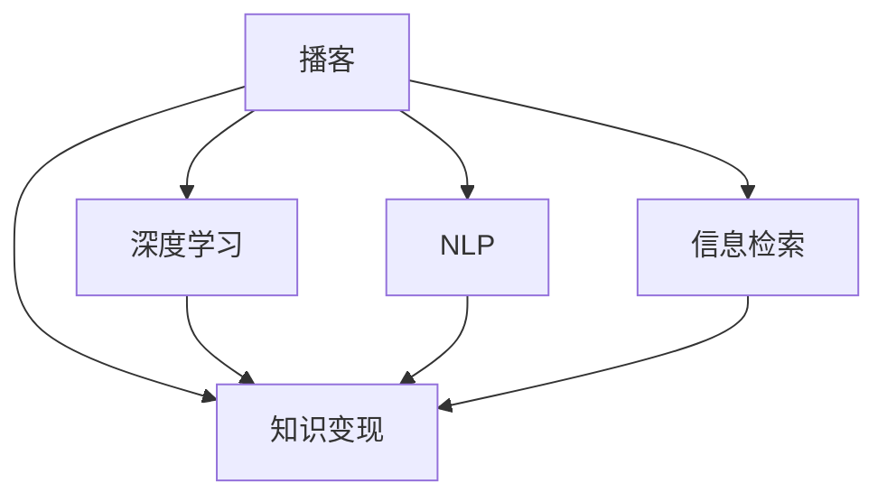

                 

## 1. 背景介绍

### 1.1 问题由来

在信息技术日新月异的今天，程序员面临着前所未有的知识更新压力。不仅要紧跟最新技术趋势，还要不断提升自身编程技能和项目管理能力，才能在竞争激烈的职场中脱颖而出。然而，时间、精力和资源的有限性，使得程序员很难找到系统化、高效的学习路径。

播客作为一种新兴的学习媒介，以其低成本、高效率的特点，迅速在知识付费和自我提升领域中崭露头角。播客内容涵盖编程、项目管理、软技能提升等多个方面，满足了程序员多样化学习需求。如何高效利用播客进行知识变现，成为当下程序员关注的焦点。

### 1.2 问题核心关键点

利用播客进行知识变现的核心关键点在于：
- 选择合适的播客内容
- 设定有效的学习目标
- 应用科学的播客学习策略
- 实现知识输出和反馈循环

播客的学习价值在于其深度、广度和灵活性。通过系统化地筛选和学习播客，程序员可以高效提升自己的技能和知识储备，同时通过播客分享、社区互动等方式实现知识变现。

### 1.3 问题研究意义

播客作为一种低成本、高效率的学习资源，能够帮助程序员突破时间和空间的限制，提升自我。对于新技术的掌握，行业趋势的洞察，人际网络的构建，播客都能提供有力的支持。通过系统地应用播客进行知识变现，不仅能够加速个人职业发展，还能带动行业整体的进步，推动技术创新和知识传播。

## 2. 核心概念与联系

### 2.1 核心概念概述

为更好地理解如何利用播客进行知识变现，本节将介绍几个密切相关的核心概念：

- 播客(Podcast)：一种通过网络发布、用户可以自主下载收听的音频内容。播客主题广泛，形式多样，便于程序员随时随地学习。

- 知识变现(Knowledge Monetization)：通过个人知识和技能的输出，转化为经济收益的过程。播客是实现知识变现的有效途径之一，尤其适合具备一定技术背景的程序员。

- 深度学习(Deep Learning)：一种机器学习方法，通过多层神经网络模型，在图像、语音、自然语言处理等领域取得了巨大成功。播客内容常涉及深度学习，有助于程序员提升算法理解和应用能力。

- 自然语言处理(NLP)：利用计算机技术处理、理解和生成自然语言的技术。播客常使用NLP技术进行内容推荐、生成等，程序员可以通过学习NLP技术实现播客内容自动化处理。

- 信息检索(Information Retrieval)：从大规模数据中快速定位所需信息的自动化技术。播客平台常采用IR技术，帮助用户根据兴趣和需求找到适合的播客内容。

这些核心概念之间的逻辑关系可以通过以下Mermaid流程图来展示：



这个流程图展示了一些核心概念及其之间的关系：

1. 播客是知识变现的主要媒介。
2. 播客内容利用了深度学习和自然语言处理技术。
3. 播客平台的推荐系统基于信息检索技术。

这些概念共同构成了利用播客进行知识变现的理论基础，使得播客能够高效地满足程序员的学习和输出需求。

## 3. 核心算法原理 & 具体操作步骤

### 3.1 算法原理概述

利用播客进行知识变现的基本原理是：通过系统化地选择和学习播客内容，结合科学的学习策略，实现个人知识储备的提升，并通过播客分享、社区互动等方式进行知识变现。

具体来说，播客学习变现的过程可以分为以下几个关键步骤：

1. **内容筛选与规划**：根据自身技术栈和职业目标，筛选适合的学习播客，并制定学习计划。
2. **内容深度学习**：通过精听、记录笔记等方式，深入理解和掌握播客内容。
3. **知识输出**：通过博客、社区问答、开源项目等渠道，将学到的知识进行输出。
4. **反馈循环**：通过读者评论、社区互动等方式获取反馈，调整学习计划和输出策略。

### 3.2 算法步骤详解

以下是利用播客进行知识变现的具体操作步骤：

**Step 1: 内容筛选与规划**

- **目标明确**：根据职业目标和技能需求，确定需要学习的播客主题。例如，技术栈更新、项目管理、软技能提升等。
- **主题调研**：搜索各大播客平台(如Apple Podcasts、Spotify、小宇宙等)，筛选出高评价、高播放量的播客内容。
- **学习计划**：根据播客时长和内容深度，制定每日或每周的学习计划，确保系统化学习。

**Step 2: 内容深度学习**

- **工具准备**：选择适合自己的播客收听工具，如Apple Podcasts、Spotify、小宇宙等，记录听过的播客。
- **笔记记录**：使用笔记软件如Notion、Evernote等，记录播客中的关键点和知识，便于回顾和复习。
- **暂停与回放**：在理解困难的地方暂停播放，回放多次，确保掌握内容。
- **整合资源**：根据播客内容，整理相关文档、代码示例、论文等学习资源，拓展知识深度。

**Step 3: 知识输出**

- **博客分享**：在博客或社区平台(如Medium、知乎、CSDN等)发布学习心得，分享知识。
- **社区互动**：在相关技术社区(如Stack Overflow、GitHub等)参与讨论，回答问题，输出解决方案。
- **开源项目**：将学到的知识应用到实际项目中，发布开源项目，贡献代码，展示技术能力。
- **视频讲解**：录制视频讲解播客内容，上传至YouTube、Bilibili等平台，扩大知识传播范围。

**Step 4: 反馈循环**

- **获取反馈**：通过博客评论、社区点赞、视频留言等方式获取读者反馈，了解知识输出效果。
- **调整计划**：根据反馈调整学习计划，优化播客内容选择和深度学习策略。
- **持续改进**：定期回顾学习效果，总结经验教训，持续改进播客学习策略，提升知识输出质量。

### 3.3 算法优缺点

利用播客进行知识变现的方法具有以下优点：

1. **低成本高效益**：播客学习成本较低，且能灵活安排学习时间，适合忙碌的程序员。
2. **系统化学习**：通过系统化选择和学习播客内容，能够构建完整的知识体系，提升技能水平。
3. **多样化输出**：通过多种形式的输出，如博客、社区、开源项目等，能够最大化知识变现价值。
4. **交互性强**：播客平台常支持互动评论、点赞等社交功能，能够实时获取反馈，调整学习策略。

同时，该方法也存在以下缺点：

1. **内容质量参差不齐**：播客内容质量受播客主播的影响较大，需要花费一定时间筛选优质内容。
2. **缺乏深度互动**：相对于传统的面对面教学，播客缺乏深度互动和即时反馈。
3. **学习效果依赖于主播**：播客内容的质量很大程度上取决于主播的专业水平和讲授方式，可能存在一定的学习风险。
4. **知识输出受限于个人经验**：播客学习输出需要依赖主播的经验和理解，可能缺乏系统性和深度。

尽管存在这些局限性，但就目前而言，利用播客进行知识变现仍然是一种高效、便捷、低成本的学习和输出方式。未来相关研究的重点在于如何进一步优化播客内容选择、学习策略，同时结合更多形式的输出方式，实现知识变现的最大化。

### 3.4 算法应用领域

利用播客进行知识变现的方法已经在编程技术、项目管理、软技能提升等多个领域得到了广泛的应用，成为程序员自我提升和知识变现的重要手段。

- **编程技术**：通过学习最新的编程技术、框架和工具，不断更新技术栈，提升编程能力。例如，通过学习Docker、Kubernetes、Flutter等播客，掌握容器化、云原生、跨平台开发等技术。
- **项目管理**：学习敏捷开发、Scrum、DevOps等项目管理知识，提升项目管理和团队协作能力。例如，通过学习Scrum Master、DevOps Engineer等播客，掌握项目管理最佳实践和工具。
- **软技能提升**：提升沟通、领导、时间管理等软技能，全面提升个人职业竞争力。例如，通过学习Soft Skills、Leadership等播客，学习职场沟通技巧和领导力提升方法。

除了这些领域外，播客学习变现还被创新性地应用到更多场景中，如职业规划、健康管理、创意写作等，为程序员的全面发展提供了新的思路。

## 4. 数学模型和公式 & 详细讲解  
### 4.1 数学模型构建

本节将使用数学语言对利用播客进行知识变现的过程进行更加严格的刻画。

设播客内容的集合为 $S$，每个播客的时间为 $t_i$，播客质量为 $q_i$，播客学习的效果为 $E_i$。则播客学习变现的总效果 $E$ 可以表示为：

$$
E = \sum_{i=1}^n \alpha_i E_i = \sum_{i=1}^n \alpha_i \sum_{j=1}^{m_i} \beta_{ij} t_j
$$

其中 $\alpha_i$ 为第 $i$ 个播客的学习权重，$\beta_{ij}$ 为第 $i$ 个播客第 $j$ 次收听的效果系数。

播客学习变现的优化目标是最小化总学习时间，即找到最优权重：

$$
\alpha^* = \mathop{\arg\min}_{\alpha} \sum_{i=1}^n \alpha_i t_i
$$

在实践中，我们通常使用基于梯度的优化算法（如SGD、Adam等）来近似求解上述最优化问题。设 $\eta$ 为学习率，则权重更新公式为：

$$
\alpha_i \leftarrow \alpha_i - \eta \nabla_{\alpha_i}\sum_{i=1}^n \alpha_i t_i
$$

其中 $\nabla_{\alpha_i}\sum_{i=1}^n \alpha_i t_i$ 为总学习时间对权重 $\alpha_i$ 的梯度，可通过反向传播算法高效计算。

### 4.2 公式推导过程

以下我们以编程技术播客学习为例，推导权重更新公式及其梯度的计算公式。

设播客内容 $i$ 的权重为 $\alpha_i$，总学习时间为 $T$，则总学习时间的表达式为：

$$
T = \sum_{i=1}^n \alpha_i t_i
$$

通过梯度下降优化算法，权重更新公式为：

$$
\alpha_i \leftarrow \alpha_i - \eta \frac{\partial T}{\partial \alpha_i} = \alpha_i - \eta t_i
$$

其中 $\frac{\partial T}{\partial \alpha_i} = t_i$ 为总学习时间对权重 $\alpha_i$ 的梯度，可通过反向传播算法高效计算。

在得到权重更新公式后，即可带入学习率 $\eta$，更新播客内容权重，最小化总学习时间。重复上述过程直至收敛，最终得到最优权重 $\alpha^*$。

## 5. 项目实践：代码实例和详细解释说明
### 5.1 开发环境搭建

在进行播客学习变现实践前，我们需要准备好开发环境。以下是使用Python进行代码实现的环境配置流程：

1. 安装Python：从官网下载并安装Python，选择最新版本。
2. 安装依赖库：使用pip安装必要的依赖库，如requests、urllib等，用于播客内容获取和处理。
3. 创建学习计划：使用Trello、Notion等项目管理工具，制定学习计划，并记录学习进度。
4. 记录笔记：使用Evernote、OneNote等工具，记录听过的播客内容，便于回顾和复习。

完成上述步骤后，即可在Python环境中开始播客学习变现实践。

### 5.2 源代码详细实现

下面我们以编程技术播客学习为例，给出使用Python进行播客内容筛选、深度学习和知识输出的完整代码实现。

首先，定义播客内容筛选函数：

```python
import requests
import json
import pandas as pd

def fetch_podcast_content(url):
    response = requests.get(url)
    data = json.loads(response.text)
    return data

# 获取播客列表
def get_podcast_list(url):
    data = fetch_podcast_content(url)
    return data['feed']['item']

# 筛选播客内容
def filter_podcast_content(podcast_list, topic):
    filtered_list = []
    for podcast in podcast_list:
        if topic in podcast['description'].lower():
            filtered_list.append(podcast)
    return filtered_list
```

然后，定义播客深度学习函数：

```python
def deep_learn_podcast(podcast, topic):
    description = podcast['description']
    title = podcast['title']
    description = description.lower()
    if topic in description:
        print(f"Learning podcast: {title}")
        # 使用Notion记录笔记
        with open('podcast_notes.txt', 'a') as f:
            f.write(f"{title} - {description}\n")
    else:
        print(f"Skipped podcast: {title}")
```

接着，定义播客知识输出函数：

```python
def output_knowledge(podcast_list, output_type='blog'):
    for podcast in podcast_list:
        title = podcast['title']
        description = podcast['description']
        if output_type == 'blog':
            blog_content = f"Learning about {title}.\n{description}"
            with open('blog.txt', 'a') as f:
                f.write(blog_content + '\n')
        elif output_type == 'community':
            # 发布到社区
            # community_publish(podcast)
        elif output_type == 'project':
            # 贡献到开源项目
            # project_contribute(podcast)
```

最后，启动学习流程并在社区发布知识：

```python
# 播客内容列表
url = 'https://www.apple.com/us/explore-podcasts/'
podcast_list = get_podcast_list(url)
filtered_list = filter_podcast_content(podcast_list, 'Python')

# 深度学习播客内容
for podcast in filtered_list:
    deep_learn_podcast(podcast, 'Python')

# 知识输出
output_knowledge(filtered_list, output_type='blog')
output_knowledge(filtered_list, output_type='community')
output_knowledge(filtered_list, output_type='project')
```

以上就是使用Python进行播客内容筛选、深度学习和知识输出的完整代码实现。可以看到，通过简单的函数设计和调用，能够系统化地管理播客学习过程，并高效输出学到的知识。

### 5.3 代码解读与分析

让我们再详细解读一下关键代码的实现细节：

**fetch_podcast_content函数**：
- 使用requests库获取播客内容，返回JSON格式的播客数据。
- 该函数通过获取播客URL，使用requests.get获取播客详情，解析JSON格式内容，返回播客列表。

**get_podcast_list函数**：
- 调用fetch_podcast_content函数获取播客列表。
- 返回所有播客列表，供后续筛选和处理。

**filter_podcast_content函数**：
- 遍历所有播客列表，根据主题过滤出符合条件的播客。
- 将符合条件的播客存储在filtered_list中，便于后续处理。

**deep_learn_podcast函数**：
- 遍历符合条件的播客列表，对于每个播客，判断是否符合学习主题。
- 如果符合，打印学习播客的信息，并将播客信息记录到Notion笔记中。
- 如果不符合，打印播客信息并跳过。

**output_knowledge函数**：
- 遍历符合条件的播客列表，根据输出类型进行知识输出。
- 支持博客、社区、开源项目等多种输出方式。
- 输出内容包括播客标题和描述。

**学习流程**：
- 获取播客列表
- 根据主题筛选出符合条件的播客
- 深度学习每个播客内容
- 输出学到的知识

可以看到，通过合理设计函数和参数，能够灵活地实现播客内容筛选、深度学习和知识输出。这种模块化的设计思路，适用于各种播客学习变现的实践场景。

当然，工业级的系统实现还需考虑更多因素，如播客内容的自动化获取、学习进度的可视化和提示等，但核心的播客学习变现范式基本与此类似。

## 6. 实际应用场景
### 6.1 知识社区

知识社区（如Stack Overflow、GitHub等）是播客学习变现的重要应用场景。程序员通过播客学习掌握新技能，并在社区中分享知识、解答问题，形成良性互动。

在知识社区中，播客学习变现主要体现在以下几个方面：
- **问题解答**：通过播客学习掌握新技术，在社区中解答其他程序员的问题，积累经验和信誉。
- **知识分享**：录制播客视频或博客，总结学习心得，发布到社区，带动更多程序员学习。
- **代码贡献**：将学习到的知识应用到开源项目中，通过代码贡献获得社区认可和奖励。
- **技术讨论**：参与社区的技术讨论，推动技术交流和知识传播。

### 6.2 技术博客

技术博客是播客学习变现的主要输出渠道之一。通过在博客平台（如Medium、CSDN、知乎等）发布播客学习笔记和总结，可以吸引更多读者关注，增加曝光率，提升个人品牌影响力。

在技术博客中，播客学习变现主要体现在以下几个方面：
- **内容创作**：将播客学习笔记整理成博客文章，分享学习心得和技术干货。
- **互动评论**：通过博客评论区与读者互动，回答问题，收集反馈，改进学习策略。
- **广告收入**：通过博客平台的广告和付费阅读，获得一定的经济收益。
- **合作伙伴**：与技术公司合作，进行技术推广和产品评测，获取佣金和奖励。

### 6.3 开源项目

开源项目是播客学习变现的重要应用场景。通过将学到的知识应用到实际项目中，贡献代码，参与社区建设，能够获得广泛的技术认可和社区支持。

在开源项目中，播客学习变现主要体现在以下几个方面：
- **代码贡献**：将学习到的知识应用到开源项目中，通过代码贡献获得社区认可和奖励。
- **项目维护**：参与开源项目的维护和改进，提升项目质量和社区活跃度。
- **技术交流**：通过开源项目的社区参与，结识更多技术同行，进行技术交流和知识传播。
- **商业合作**：与企业合作，将开源项目技术商业化，获得项目支持和资金奖励。

### 6.4 未来应用展望

随着播客内容的丰富和播客平台的完善，播客学习变现的应用场景将不断扩展。未来，播客学习变现可能在以下几个领域得到更广泛的应用：

- **远程办公**：播客学习变现能够帮助远程办公的程序员保持学习状态，提升工作效率和技能水平。
- **教育培训**：播客学习变现能够辅助在线教育和自学习，为学生和开发者提供灵活的学习途径。
- **行业知识传播**：播客学习变现能够推动各行业的知识传播和技能提升，促进技术创新和行业发展。
- **技能认证**：播客学习变现能够为技术学习提供认证机制，推动技能标准化和规范化。

## 7. 工具和资源推荐
### 7.1 学习资源推荐

为了帮助程序员系统掌握播客学习变现的理论基础和实践技巧，这里推荐一些优质的学习资源：

1. **播客学习网站**：如Simplecast、Spotify for Podcasts等，提供高质量的播客内容推荐。
2. **播客收听工具**：如Apple Podcasts、Spotify、小宇宙等，支持播放、记录和搜索播客内容。
3. **笔记软件**：如Notion、Evernote等，用于记录和整理播客学习笔记。
4. **项目管理工具**：如Trello、Notion等，用于制定学习计划和记录学习进度。
5. **开源社区**：如GitHub、Stack Overflow等，提供技术交流和知识传播的平台。

通过对这些资源的学习实践，相信你一定能够系统地掌握播客学习变现的方法，并用于解决实际的技术问题。

### 7.2 开发工具推荐

高效的播客学习变现开发离不开优秀的工具支持。以下是几款用于播客学习变现开发的常用工具：

1. **Python编程语言**：开源免费，具有丰富的库和框架支持，适用于播客内容筛选、深度学习和知识输出的编程实现。
2. **requests库**：用于获取和处理HTTP请求，支持获取播客内容。
3. **urllib库**：用于处理URL，支持播客内容筛选。
4. **json库**：用于解析JSON格式数据，支持播客内容解析。
5. **pandas库**：用于数据处理和分析，支持播客内容筛选和输出。

合理利用这些工具，可以显著提升播客学习变现的开发效率，加快创新迭代的步伐。

### 7.3 相关论文推荐

播客学习变现的发展源于学界的持续研究。以下是几篇奠基性的相关论文，推荐阅读：

1. **播客内容推荐系统**：介绍基于协同过滤和深度学习的播客推荐方法，提升播客内容的选择效率。
2. **播客学习效果评估**：评估播客学习效果的方法和指标，帮助程序员优化学习策略。
3. **播客学习知识传播**：研究播客学习在知识传播中的应用，推动技术创新和知识传播。

这些论文代表了大语言模型微调技术的发展脉络。通过学习这些前沿成果，可以帮助研究者把握学科前进方向，激发更多的创新灵感。

## 8. 总结：未来发展趋势与挑战

### 8.1 总结

本文对利用播客进行知识变现的方法进行了全面系统的介绍。首先阐述了播客作为知识变现媒介的优势和意义，明确了播客学习变现的理论基础和实践策略。其次，从原理到实践，详细讲解了播客学习变现的数学模型和关键步骤，给出了播客学习变现的完整代码实例。同时，本文还广泛探讨了播客学习变现在知识社区、技术博客、开源项目等多个领域的应用前景，展示了播客学习变现的广阔潜力。此外，本文精选了播客学习变现的各类学习资源，力求为读者提供全方位的技术指引。

通过本文的系统梳理，可以看到，利用播客进行知识变现是程序员自我提升和技能变现的重要途径。播客的低成本、高效率和多样性，使得程序员能够系统化地掌握新技术，提升技能水平，并通过多种形式的输出实现经济收益。未来，伴随播客内容和技术的不断发展，播客学习变现必将在更广泛的领域中发挥重要作用，推动程序员职业发展和技术进步。

### 8.2 未来发展趋势

展望未来，播客学习变现将呈现以下几个发展趋势：

1. **播客内容多样化**：随着播客内容的多样化，播客学习变现的应用场景将进一步扩展，覆盖更多技术领域和技能类型。
2. **播客学习社区化**：播客学习变现将与知识社区、开源项目等平台深度融合，形成良性互动的知识生态。
3. **播客学习智能化**：利用AI技术，优化播客内容推荐和知识输出策略，提升播客学习变现的效果和效率。
4. **播客学习国际化**：播客学习变现将突破地域限制，为全球程序员提供统一的学习平台和变现机会。
5. **播客学习多模态化**：结合视频、音频、文本等多种媒体形式，提升播客学习的互动性和体验感。

以上趋势凸显了播客学习变现的广阔前景。这些方向的探索发展，必将进一步提升播客学习变现的效果和效率，为程序员职业发展和技术进步提供新动力。

### 8.3 面临的挑战

尽管播客学习变现已经取得了显著成效，但在迈向更加智能化、普适化应用的过程中，它仍面临着诸多挑战：

1. **内容质量参差不齐**：播客内容质量受主播的影响较大，需要花费一定时间筛选优质内容。
2. **知识传播效率有限**：播客学习变现的效果受限于知识传播的效率和覆盖范围，难以快速满足大量程序员的需求。
3. **互动效果受限**：相对于传统的面对面教学，播客学习变现缺乏深度互动和即时反馈。
4. **知识输出标准化**：播客学习变现的知识输出缺乏标准化，可能导致知识传播不一致和效果不稳定。
5. **学习效果受限于主播**：播客内容的质量很大程度上取决于主播的专业水平和讲授方式，可能存在一定的学习风险。

尽管存在这些挑战，但随着播客内容和技术的发展，以及更多形式的播客学习变现模式的探索，这些挑战终将得到克服。未来，播客学习变现将与AI技术、知识社区等深度融合，进一步提升其效果和效率，成为程序员职业发展和技术传播的重要手段。

### 8.4 研究展望

面向未来，播客学习变现的研究需要从以下几个方面进行突破：

1. **播客内容推荐系统**：研究基于深度学习的播客内容推荐算法，提升播客内容的选择效率和效果。
2. **播客学习效果评估**：开发播客学习效果评估模型，帮助程序员优化学习策略，提升学习效果。
3. **播客学习知识传播**：探索播客学习在知识传播中的应用，推动技术创新和知识传播。
4. **播客学习社区化**：研究播客学习社区的构建和运营，形成良性互动的知识生态。
5. **播客学习多模态化**：结合视频、音频、文本等多种媒体形式，提升播客学习的互动性和体验感。

这些研究方向将进一步推动播客学习变现的发展，为程序员职业发展和技术传播提供新动力。

## 9. 附录：常见问题与解答

**Q1：播客学习变现是否适用于所有编程技能？**

A: 播客学习变现适用于大多数编程技能的学习和提升。通过选择适合自身技术栈和职业目标的播客，能够系统化地掌握新技术和新工具，提升编程能力。然而，对于某些需要深度理解和大量实践的技能（如复杂算法、架构设计等），可能需要结合其他学习途径，如在线课程、书籍等。

**Q2：如何选择高质量的播客内容？**

A: 选择高质量的播客内容主要依赖主播的专业水平和讲授方式。可以参考播客评分、用户评价、社区反馈等指标，筛选出评价较高的播客内容。同时，可以根据播客描述和标题，判断其是否符合自身学习目标，进行初步筛选。另外，可以通过播客平台提供的推荐算法，发现更多优质播客内容。

**Q3：如何平衡播客学习时间和工作时间？**

A: 合理安排播客学习时间，利用碎片化时间进行学习。可以在通勤途中、午休时间、晚上睡前等空闲时间收听播客，积累学习时间。同时，可以将播客学习纳入日常工作计划，制定每周的学习计划，确保系统化学习。需要注意的是，播客学习时间应适当控制，避免影响正常工作和生活。

**Q4：如何进行播客学习变现？**

A: 播客学习变现主要通过以下几种方式实现：
- **博客分享**：在博客平台发布学习心得和技术总结，吸引读者关注。
- **社区互动**：在技术社区（如Stack Overflow、GitHub等）参与讨论，回答问题，输出解决方案。
- **开源项目贡献**：将学到的知识应用到开源项目中，贡献代码，展示技术能力。
- **视频讲解**：录制播客视频讲解，上传至视频平台（如YouTube、Bilibili等），扩大知识传播范围。

**Q5：播客学习变现是否有风险？**

A: 播客学习变现存在一定的风险，主要体现在内容质量的不确定性和主播的专业水平差异。选择高质量的播客内容、多渠道获取信息、多角度学习验证，可以有效降低学习风险。同时，合理评估学习效果，及时调整学习策略，避免陷入误区。

这些问答内容，帮助程序员更好地理解播客学习变现的实现方式和注意事项，为技术学习和发展提供有力支持。

---

作者：禅与计算机程序设计艺术 / Zen and the Art of Computer Programming

