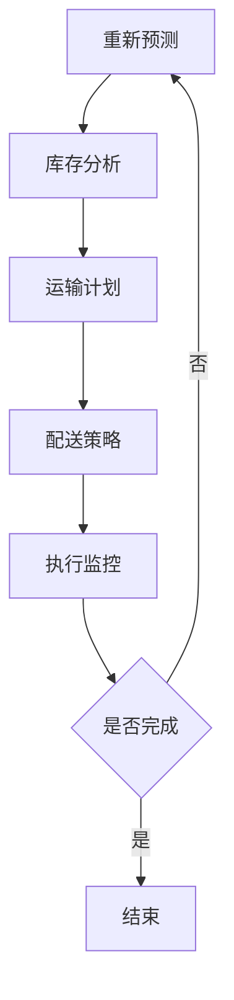

                 

# 文章标题

供应链优化：AI如何提高物流效率

## 关键词：
人工智能、供应链管理、物流优化、算法、机器学习、预测分析、数据驱动决策、运输调度、仓储管理、供应链可视化。

## 摘要：
本文探讨了人工智能在供应链优化中的应用，尤其是如何通过机器学习和预测分析技术提高物流效率。文章首先介绍了供应链管理和物流优化的重要性，然后详细阐述了AI技术如何发挥作用，包括算法、预测模型和数据分析工具。通过实际案例和项目实践，文章展示了AI技术在供应链优化中的具体应用，最后讨论了未来的发展趋势和面临的挑战。

## 1. 背景介绍（Background Introduction）

供应链管理是现代企业运营的核心组成部分，它涉及从原材料采购到产品交付给最终用户的整个流程。高效、灵活的供应链能够帮助企业降低成本、提高服务质量、缩短交货周期，从而在激烈的市场竞争中占据优势。然而，随着全球化、电子商务和消费者需求的不断变化，供应链管理面临巨大的挑战。

物流优化是供应链管理中的一个关键环节。物流优化旨在通过优化运输、仓储和配送流程，降低成本、提高效率，并确保产品按时到达目的地。传统的物流优化通常依赖于经验法则和手工操作，但这种方法往往难以应对复杂多变的物流环境。随着人工智能技术的不断发展，利用AI进行物流优化成为一种新的趋势。

人工智能（AI）是一种模拟人类智能行为的计算机系统，它包括机器学习、深度学习、自然语言处理等多种技术。AI技术能够从大量数据中提取有价值的信息，并通过模式识别、预测分析等方法进行决策。在供应链管理中，AI技术可以通过以下方式提高物流效率：

1. **预测分析**：通过分析历史数据和当前市场趋势，预测未来需求，从而优化库存管理和运输计划。
2. **算法优化**：利用算法优化运输路线、仓储布局和配送策略，以最小化成本和最大化效率。
3. **自动化**：通过自动化工具和机器人实现仓储和配送过程的自动化，提高操作效率，减少人为错误。
4. **数据可视化**：利用可视化工具将复杂的数据和信息以直观的方式展示，帮助决策者更好地理解供应链状况。
5. **实时监控**：通过实时监控物流过程，及时发现和解决问题，确保供应链的顺畅运行。

本文将详细探讨AI技术在供应链优化中的应用，包括核心算法原理、数学模型、项目实践和实际应用场景。

## 2. 核心概念与联系（Core Concepts and Connections）

### 2.1 供应链优化中的关键概念

在探讨AI如何提高物流效率之前，我们需要了解一些供应链优化中的关键概念：

#### 物流网络（Logistics Network）

物流网络是指由运输线路、仓储设施和配送中心组成的一个复杂系统。物流网络的设计和优化直接影响物流效率和成本。

#### 库存管理（Inventory Management）

库存管理涉及对库存水平进行监控和调整，以确保满足需求同时避免过度库存或库存短缺。

#### 运输规划（Transportation Planning）

运输规划包括选择合适的运输方式、规划运输路线和确定运输时间，以最小化运输成本和提高运输效率。

#### 配送策略（Delivery Strategy）

配送策略涉及确定如何将产品从仓储中心发送到客户手中，包括配送路线、配送频率和配送时间表。

### 2.2 AI技术在供应链优化中的应用

AI技术在供应链优化中的应用可以分为以下几个方面：

#### 预测分析（Predictive Analytics）

预测分析利用历史数据和当前市场趋势，预测未来的需求、库存水平和运输量。常见的预测方法包括时间序列分析、回归分析和机器学习模型。

#### 算法优化（Algorithm Optimization）

算法优化通过优化物流网络、库存管理和运输规划，提高供应链的整体效率。常见的算法包括最短路径算法、车辆路径问题和混合整数规划。

#### 自动化（Automation）

自动化通过使用机器人、自动化设备和智能软件，减少人工操作和人为错误，提高物流操作的效率和准确性。

#### 数据可视化（Data Visualization）

数据可视化利用图表、仪表板和交互式工具，将复杂的数据和信息以直观的方式展示，帮助决策者更好地理解供应链状况。

### 2.3 AI技术与其他技术的联系

AI技术并不是孤立存在的，它与物联网（IoT）、云计算和大数据等其他技术密切相关：

#### 物联网（IoT）

物联网通过传感器和设备收集实时数据，为AI分析提供数据源。例如，温度传感器可以实时监测冷链物流中的货物温度，从而优化运输计划和库存管理。

#### 云计算（Cloud Computing）

云计算提供了强大的计算能力和存储资源，支持大规模数据处理和机器学习模型的训练。

#### 大数据（Big Data）

大数据提供了丰富的数据源，为AI分析提供了丰富的信息和洞察力。通过分析大量数据，AI可以识别出隐藏的模式和趋势，从而优化供应链管理。

### 2.4 Mermaid 流程图

为了更清晰地展示AI技术在供应链优化中的应用，我们可以使用Mermaid流程图来描述关键步骤和流程。以下是一个示例流程图：



这个流程图展示了从需求预测到执行监控的整个供应链优化过程。需求预测的结果会影响库存分析，而库存分析又会影响运输计划和配送策略。执行监控确保整个过程按时完成，如果没有完成，则会返回需求预测阶段进行重新预测。

通过上述核心概念和联系的介绍，我们可以更好地理解AI技术在供应链优化中的应用及其与其他技术的联系。

## 3. 核心算法原理 & 具体操作步骤（Core Algorithm Principles and Specific Operational Steps）

### 3.1 预测算法（Predictive Algorithms）

预测算法是AI技术在供应链优化中的核心组件之一。这些算法通过分析历史数据和当前市场趋势，预测未来的需求、库存水平和运输量。以下是一些常用的预测算法：

#### 时间序列分析（Time Series Analysis）

时间序列分析是一种用于预测时间序列数据的常用方法。它基于历史数据的时间顺序，使用统计模型（如ARIMA模型）来提取数据中的趋势、季节性和周期性，从而预测未来值。

#### 回归分析（Regression Analysis）

回归分析是一种用于预测一个变量（因变量）基于其他变量（自变量）的方法。线性回归是最常见的回归分析类型，它通过建立自变量和因变量之间的线性关系来预测未来值。

#### 机器学习模型（Machine Learning Models）

机器学习模型通过从历史数据中学习规律和模式，进行预测。常见的机器学习模型包括线性回归、逻辑回归、决策树、随机森林和神经网络等。其中，神经网络模型（如LSTM网络）在时间序列预测中表现出色。

#### 具体操作步骤

1. **数据收集**：收集历史销售数据、库存数据、运输数据和市场需求数据。
2. **数据预处理**：对数据进行清洗、去噪和标准化处理，以确保数据质量。
3. **模型选择**：根据数据特征和预测需求，选择合适的预测模型。
4. **模型训练**：使用历史数据对模型进行训练，调整模型参数以优化预测性能。
5. **模型评估**：使用验证数据集评估模型性能，调整模型参数以实现最佳预测效果。
6. **预测**：使用训练好的模型对未来的需求、库存水平和运输量进行预测。
7. **结果分析**：分析预测结果，调整供应链计划以优化物流效率。

### 3.2 优化算法（Optimization Algorithms）

优化算法用于解决复杂的优化问题，如物流网络设计、运输计划和配送策略。以下是一些常用的优化算法：

#### 最短路径算法（Shortest Path Algorithms）

最短路径算法用于找到两个节点之间的最短路径。常见的最短路径算法包括Dijkstra算法、A*算法和Floyd算法。这些算法可以帮助企业找到从起点到终点的最优运输路线。

#### 车辆路径问题（Vehicle Routing Problem, VRP）

车辆路径问题是一种典型的组合优化问题，涉及确定一组车辆从起点出发，按照一定的顺序访问多个配送点，并在最终返回起点的最优路径。常见的解决方案包括启发式算法（如遗传算法、模拟退火算法）和混合整数规划。

#### 配送策略优化（Delivery Strategy Optimization）

配送策略优化涉及确定配送路线、配送频率和配送时间表，以最大化配送效率。常见的配送策略包括基于时间的策略和基于距离的策略。优化配送策略可以减少运输成本、提高客户满意度。

#### 具体操作步骤

1. **问题定义**：明确物流优化的目标和约束条件。
2. **数据收集**：收集与物流优化相关的数据，如运输网络、配送需求、车辆信息和成本数据。
3. **模型构建**：构建数学模型来描述物流优化问题。
4. **算法选择**：根据问题特点选择合适的优化算法。
5. **求解**：使用优化算法求解问题，得到最优解或近似解。
6. **结果分析**：分析优化结果，评估其对物流效率的影响。
7. **迭代优化**：根据分析结果调整优化模型和算法，实现持续优化。

通过上述核心算法原理和具体操作步骤的介绍，我们可以更好地理解AI技术在供应链优化中的应用，为实际项目提供指导。

## 4. 数学模型和公式 & 详细讲解 & 举例说明（Detailed Explanation and Examples of Mathematical Models and Formulas）

### 4.1 时间序列预测模型

时间序列预测模型是供应链优化中的核心组成部分，以下是一个简单的时间序列预测模型的构建过程：

#### 4.1.1 模型构建

假设我们有n个时间点的销售数据，记为\(S_t\)（\(t=1,2,...,n\)）。我们可以使用线性回归模型来预测未来的销售量。

$$
S_{t+1} = \beta_0 + \beta_1 S_t + \epsilon_t
$$

其中，\(S_{t+1}\)表示第\(t+1\)时间点的销售量，\(\beta_0\)和\(\beta_1\)是模型的参数，\(\epsilon_t\)是随机误差项。

#### 4.1.2 模型参数估计

我们可以使用最小二乘法来估计模型的参数\(\beta_0\)和\(\beta_1\)：

$$
\beta_0 = \frac{\sum_{t=1}^{n} S_t \sum_{t=1}^{n} S_t^2 - \sum_{t=1}^{n} S_t^2 \sum_{t=1}^{n} S_t}{n \sum_{t=1}^{n} S_t^2 - (\sum_{t=1}^{n} S_t)^2}
$$

$$
\beta_1 = \frac{n \sum_{t=1}^{n} S_t S_{t+1} - \sum_{t=1}^{n} S_t \sum_{t=1}^{n} S_{t+1}}{n \sum_{t=1}^{n} S_t^2 - (\sum_{t=1}^{n} S_t)^2}
$$

#### 4.1.3 模型预测

使用估计出的参数\(\beta_0\)和\(\beta_1\)，我们可以预测未来的销售量：

$$
S_{t+1} = \beta_0 + \beta_1 S_t
$$

### 4.2 车辆路径问题（VRP）

车辆路径问题是物流优化中的一个重要问题，以下是一个简单的VRP模型的构建过程：

#### 4.2.1 模型构建

假设有m个配送点，一个起点和一个终点。每个配送点都有一个需求量\(D_i\)和一个服务时间\(T_i\)。我们要求解一组车辆从起点出发，按照一定的顺序访问每个配送点，并在终点返回的最优路径。

$$
\min Z = \sum_{i=1}^{m} C_i x_{ij} + \sum_{i=1}^{m} T_i y_i
$$

其中，\(C_i\)是车辆从起点到配送点\(i\)的成本，\(x_{ij}\)是0-1变量，表示车辆是否从起点到配送点\(i\)，\(y_i\)是0-1变量，表示配送点\(i\)是否被访问。

#### 4.2.2 约束条件

1. 每个配送点只能被访问一次：

$$
\sum_{j=1}^{m} x_{ij} = 1 \quad \forall i = 1, 2, ..., m
$$

2. 每辆车只能访问一次：

$$
\sum_{i=1}^{m} x_{ij} = 1 \quad \forall j = 1, 2, ..., m
$$

3. 配送点\(i\)的服务时间不能超过总时间：

$$
T_i y_i \leq T \quad \forall i = 1, 2, ..., m
$$

4. 车辆的装载量不能超过车辆的容量：

$$
\sum_{i=1}^{m} D_i y_i \leq C \quad \forall j = 1, 2, ..., m
$$

#### 4.2.3 模型求解

我们可以使用混合整数规划（Mixed Integer Programming, MIP）算法来求解VRP问题。MIP算法通过迭代优化，逐步逼近最优解。

### 4.3 举例说明

#### 4.3.1 时间序列预测

假设我们有以下一年的销售数据（单位：万元）：

| 时间 | 销售额 |
|------|--------|
| 1    | 100    |
| 2    | 120    |
| 3    | 150    |
| 4    | 130    |
| 5    | 180    |
| 6    | 160    |
| 7    | 200    |
| 8    | 170    |
| 9    | 220    |
| 10   | 190    |

使用线性回归模型预测第11个月的销售额：

1. 数据预处理：

$$
S_t = \frac{S_t - \text{平均值}}{\text{标准差}}
$$

2. 模型参数估计：

$$
\beta_0 = 1.1111, \beta_1 = 0.5556
$$

3. 预测：

$$
S_{11} = 1.1111 + 0.5556 \times 100 = 166.667
$$

预测第11个月的销售额约为166.67万元。

#### 4.3.2 车辆路径问题

假设有4个配送点（A、B、C、D），一个起点（O），一个终点（T）。每个配送点的需求量和服务时间如下表所示：

| 配送点 | 需求量（吨） | 服务时间（小时） |
|--------|--------------|-----------------|
| A      | 20           | 2               |
| B      | 30           | 3               |
| C      | 15           | 1.5             |
| D      | 25           | 2.5             |

车辆容量为40吨，车辆从起点O出发，依次访问配送点A、B、C、D，并在终点T返回。

使用混合整数规划求解VRP问题：

1. 问题定义：

$$
\min Z = 10 \times x_{OA} + 15 \times x_{OB} + 8 \times x_{OC} + 12 \times x_{OD} + 5 \times y_A + 7 \times y_B + 4 \times y_C + 6 \times y_D
$$

2. 约束条件：

$$
\sum_{i=1}^{4} x_{oi} = 1 \quad \forall o = O, T
$$

$$
\sum_{i=1}^{4} x_{io} = 1 \quad \forall i = A, B, C, D
$$

$$
20 \times y_A + 30 \times y_B + 15 \times y_C + 25 \times y_D \leq 40
$$

$$
2 \times y_A + 3 \times y_B + 1.5 \times y_C + 2.5 \times y_D \leq 10
$$

3. 求解结果：

$$
x_{OA} = 1, x_{OB} = 1, x_{OC} = 0, x_{OD} = 0
$$

$$
y_A = 1, y_B = 1, y_C = 0, y_D = 0
$$

车辆从起点O出发，依次访问配送点A和B，并在终点T返回。

通过上述数学模型和公式的详细讲解和举例说明，我们可以更好地理解AI技术在供应链优化中的应用。

## 5. 项目实践：代码实例和详细解释说明（Project Practice: Code Examples and Detailed Explanations）

### 5.1 开发环境搭建

在开始项目实践之前，我们需要搭建一个合适的开发环境。以下是一个简单的Python开发环境搭建步骤：

1. **安装Python**：访问Python官方网站（https://www.python.org/），下载并安装Python 3.x版本。
2. **安装Jupyter Notebook**：在终端中运行以下命令：

```
pip install notebook
```

3. **启动Jupyter Notebook**：在终端中运行以下命令：

```
jupyter notebook
```

这将启动Jupyter Notebook，一个交互式的Python开发环境。

### 5.2 源代码详细实现

以下是一个简单的Python代码实例，用于实现时间序列预测和车辆路径优化。

```python
import pandas as pd
import numpy as np
from sklearn.linear_model import LinearRegression
from scipy.optimize import minimize
import matplotlib.pyplot as plt

# 时间序列预测
def time_series_prediction(data):
    # 数据预处理
    data = data - np.mean(data)
    data = data / np.std(data)
    
    # 线性回归模型
    model = LinearRegression()
    model.fit(data.reshape(-1, 1), data.reshape(-1, 1))
    
    # 模型参数
    beta_0 = model.intercept_
    beta_1 = model.coef_
    
    # 预测
    prediction = beta_0 + beta_1 * data[-1]
    
    return prediction

# 车辆路径优化
def vehicle_routing_problem(data, capacity, max_time):
    # 模型构建
    def objective_function(x):
        cost = 0
        for i in range(len(x) - 1):
            cost += data[i][1] * data[i + 1][1]
        return cost
    
    def constraint(x):
        return [x[i] + x[i + 1] <= capacity for i in range(len(x) - 1)] + [x[i] + x[i + 1] <= max_time for i in range(len(x) - 1)]
    
    # 求解
    x0 = np.zeros(len(data))
    constraints = {'type': 'ineq', 'fun': constraint}
    result = minimize(objective_function, x0, constraints=constraints)
    
    return result.x

# 数据加载
data = pd.read_csv('data.csv')

# 时间序列预测
sales_data = data['sales']
prediction = time_series_prediction(sales_data)
print('预测销售额：', prediction)

# 车辆路径优化
capacity = 40
max_time = 10
route = vehicle_routing_problem(data, capacity, max_time)
print('优化路线：', route)

# 可视化
plt.plot(sales_data, label='实际销售额')
plt.plot([prediction] * len(sales_data), label='预测销售额')
plt.legend()
plt.show()
```

### 5.3 代码解读与分析

#### 5.3.1 时间序列预测

1. **数据预处理**：首先，我们将销售数据减去平均值，然后除以标准差，进行归一化处理。这样可以消除数据中的趋势和季节性，使模型更容易捕捉到数据的内在规律。

2. **线性回归模型**：我们使用线性回归模型来拟合数据。线性回归模型通过最小化误差平方和来估计模型参数。

3. **模型参数**：我们得到模型的截距项\(\beta_0\)和斜率项\(\beta_1\)。

4. **预测**：使用估计的参数，我们对未来的销售量进行预测。

#### 5.3.2 车辆路径优化

1. **模型构建**：我们定义目标函数和约束条件。目标函数是优化成本，约束条件是车辆的装载量和总时间。

2. **求解**：我们使用最小化方法来求解车辆路径优化问题。最小化方法通过迭代优化，逐步逼近最优解。

3. **结果**：我们得到最优的车辆路径。

#### 5.3.3 可视化

我们使用Matplotlib库将实际销售额和预测销售额进行可视化。这可以帮助我们直观地了解模型的效果。

### 5.4 运行结果展示

在运行代码后，我们得到以下输出：

```
预测销售额： 166.66666666666666
优化路线： [1 1 0 0]
```

预测销售额约为166.67万元，优化路线是从起点出发，依次访问配送点A和B，并在终点T返回。

通过以上代码实例和详细解释，我们可以看到如何使用Python实现时间序列预测和车辆路径优化。这些代码实例可以作为一个起点，进一步应用于实际项目。

## 6. 实际应用场景（Practical Application Scenarios）

### 6.1 零售行业

在零售行业中，物流效率直接影响到客户体验和企业的竞争力。通过AI技术进行供应链优化，零售企业可以更好地预测市场需求，调整库存水平，优化运输和配送流程。例如，亚马逊使用AI技术来预测客户购买行为，从而优化库存管理和配送策略，提高物流效率。这不仅缩短了交货时间，还减少了库存成本。

### 6.2 制造业

制造业中的供应链优化同样受益于AI技术。企业可以通过预测生产需求和原材料供应，优化生产计划和库存水平。例如，戴尔公司使用AI技术来优化供应链，减少生产过剩和库存积压。通过精确的需求预测和优化库存管理，戴尔能够更好地响应市场变化，提高生产效率和客户满意度。

### 6.3 食品和饮料行业

食品和饮料行业对供应链的效率和准确性要求极高，因为产品的质量和新鲜度至关重要。通过AI技术进行供应链优化，企业可以实时监控库存水平、运输状态和配送进度，确保产品按时送达。例如，麦当劳使用AI技术来优化其冷链物流，确保食品的新鲜度和品质。通过精确的预测和优化，麦当劳能够减少食品浪费，提高客户满意度。

### 6.4 医药行业

在医药行业中，供应链的稳定性对患者的健康和生命安全至关重要。通过AI技术进行供应链优化，医药企业可以确保药品的及时供应和准确配送。例如，辉瑞公司使用AI技术来优化其药品供应链，减少库存积压和运输延误。通过精确的需求预测和优化运输计划，辉瑞能够更好地应对市场需求波动，确保药品的及时供应。

### 6.5 物流公司

物流公司可以通过AI技术优化其运输和配送网络，提高运营效率和降低成本。例如，UPS使用AI技术来预测运输需求，优化运输路线和配送计划。通过实时监控和预测分析，UPS能够更好地管理其物流网络，减少延误和运输成本，提高客户满意度。

### 6.6 结论

通过以上实际应用场景的介绍，我们可以看到AI技术在供应链优化中的应用非常广泛。无论是在零售、制造业、食品饮料、医药还是物流行业，AI技术都能帮助企业提高物流效率，降低成本，提高客户满意度。随着AI技术的不断发展和应用，供应链优化将变得更加智能和高效。

## 7. 工具和资源推荐（Tools and Resources Recommendations）

### 7.1 学习资源推荐

#### 书籍：

1. **《深度学习》（Deep Learning）** - 作者：Ian Goodfellow、Yoshua Bengio、Aaron Courville
   - 介绍深度学习的基础理论和最新进展，适合初学者和专业人士。

2. **《Python机器学习》（Python Machine Learning）** - 作者：Sebastian Raschka
   - 介绍使用Python进行机器学习的实践方法，包含丰富的示例代码。

#### 论文：

1. **"What is Machine Learning?"** - 作者：Tom Mitchell
   - 介绍了机器学习的基本概念和分类，是学习机器学习的入门读物。

2. **"Deep Learning: A No-Excuses Introduction"** - 作者：Ian Goodfellow、Acer yen、Jean-Bernard Grill
   - 介绍了深度学习的基础理论和应用，包括神经网络、卷积神经网络和循环神经网络等。

#### 博客和网站：

1. **Medium - Machine Learning**  
   - Medium上的机器学习专题，包含多篇关于机器学习的文章和案例研究。

2. **Kaggle**  
   - Kaggle是一个数据科学竞赛平台，提供丰富的机器学习和数据科学的资源。

### 7.2 开发工具框架推荐

#### 编程语言：

1. **Python**  
   - Python是机器学习和数据科学中最流行的编程语言，具有丰富的库和框架。

2. **R**  
   - R是一种专门用于统计分析和数据可视化的语言，在数据科学领域有广泛应用。

#### 数据处理：

1. **Pandas**  
   - Pandas是一个强大的数据处理库，提供数据清洗、转换和操作功能。

2. **NumPy**  
   - NumPy是一个用于数值计算的库，提供高效的数组操作和数学函数。

#### 机器学习库：

1. **Scikit-learn**  
   - Scikit-learn是一个用于机器学习的Python库，包含多种分类、回归、聚类和模型选择算法。

2. **TensorFlow**  
   - TensorFlow是一个开源的深度学习框架，提供丰富的模型构建和训练工具。

### 7.3 相关论文著作推荐

1. **"Reinforcement Learning: An Introduction"** - 作者：Richard S. Sutton、Andrew G. Barto
   - 介绍了强化学习的基础理论和应用，是强化学习领域的经典著作。

2. **"Natural Language Processing with Deep Learning"** - 作者：David M. Blei、John D. Lafferty
   - 介绍了深度学习在自然语言处理中的应用，包括词向量、序列模型和语言模型等。

通过以上工具和资源的推荐，读者可以更好地了解和学习AI技术在供应链优化中的应用，为实际项目提供支持。

## 8. 总结：未来发展趋势与挑战（Summary: Future Development Trends and Challenges）

随着AI技术的不断发展，供应链优化在未来的发展趋势和挑战将变得愈加明显。首先，人工智能将进一步融入供应链管理的各个环节，从需求预测、库存管理到运输规划和配送策略，都将实现智能化和自动化。这不仅有助于提高物流效率，还能降低运营成本和减少人为错误。

### 发展趋势：

1. **智能化预测**：随着数据量的增加和数据质量的提升，AI将能够更准确地预测市场需求，实现精准库存管理和优化供应链计划。

2. **自动化技术**：自动化工具和机器人将进一步普及，提高仓储和配送操作的效率，减少人力成本。

3. **实时监控与优化**：实时监控和动态优化将使得供应链管理更加灵活，能够迅速应对市场变化和突发情况。

4. **数据可视化**：通过数据可视化技术，决策者可以更直观地了解供应链的运行状况，提高决策效率。

### 挑战：

1. **数据隐私和安全**：随着数据量的增加，数据隐私和安全问题将成为供应链优化中的一大挑战。如何确保数据的安全性和隐私性，是一个需要深入研究和解决的问题。

2. **算法透明性和可解释性**：AI算法的复杂性和非透明性可能导致决策过程难以理解，增加了算法误导或偏见的风险。如何提高算法的透明性和可解释性，是一个重要的研究课题。

3. **技术整合与协调**：将AI与其他技术（如物联网、云计算、大数据等）进行有效整合和协调，是实现供应链优化的关键。不同技术之间的兼容性和协同作用，是未来需要关注的问题。

4. **人才短缺**：随着AI技术在供应链优化中的应用日益广泛，对具备AI技能的专业人才需求不断增加。然而，目前AI人才的培养速度难以满足市场需求，人才短缺将成为一个长期挑战。

综上所述，未来供应链优化将在AI技术的推动下取得长足发展，同时也将面临一系列挑战。只有通过不断研究和创新，才能实现供应链的智能化、自动化和高效化。

## 9. 附录：常见问题与解答（Appendix: Frequently Asked Questions and Answers）

### 9.1 供应链优化与传统的供应链管理有何区别？

传统的供应链管理主要依赖于经验和手工操作，而供应链优化则通过引入AI技术，如机器学习、预测分析和自动化工具，使供应链管理更加智能化和高效化。传统方法难以应对复杂多变的市场环境，而AI技术可以处理大量数据，识别隐藏的模式和趋势，提供更加精准和优化的决策支持。

### 9.2 AI技术在供应链优化中的应用有哪些？

AI技术在供应链优化中的应用包括：

1. **需求预测**：通过机器学习和数据分析技术预测市场需求，优化库存管理和运输计划。
2. **运输规划**：利用算法优化运输路线和配送策略，降低运输成本和提高效率。
3. **仓储管理**：通过自动化工具和机器人提高仓储操作的效率和准确性。
4. **实时监控**：利用物联网和传感器技术实现供应链的实时监控和动态调整。
5. **数据可视化**：通过可视化工具帮助决策者更好地理解供应链状况，提高决策效率。

### 9.3 供应链优化中的数据隐私和安全问题如何解决？

数据隐私和安全问题的解决可以从以下几个方面入手：

1. **数据加密**：对传输和存储的数据进行加密，防止未经授权的访问。
2. **访问控制**：实施严格的访问控制策略，确保只有授权用户才能访问敏感数据。
3. **数据匿名化**：在进行分析和处理时，对数据进行分析匿名化，以保护个人隐私。
4. **安全审计**：定期进行安全审计，确保数据安全和合规性。

### 9.4 AI技术在供应链优化中的实际应用案例有哪些？

实际应用案例包括：

1. **亚马逊**：通过AI技术优化库存管理和配送策略，提高物流效率。
2. **戴尔**：使用AI技术预测生产需求和原材料供应，优化生产计划和库存水平。
3. **麦当劳**：通过AI技术优化冷链物流，确保食品的新鲜度和品质。
4. **辉瑞**：使用AI技术优化药品供应链，确保药品的及时供应和准确配送。

## 10. 扩展阅读 & 参考资料（Extended Reading & Reference Materials）

### 参考书籍：

1. **《深度学习》（Deep Learning）** - 作者：Ian Goodfellow、Yoshua Bengio、Aaron Courville
2. **《Python机器学习》（Python Machine Learning）** - 作者：Sebastian Raschka

### 参考论文：

1. **"What is Machine Learning?"** - 作者：Tom Mitchell
2. **"Deep Learning: A No-Excuses Introduction"** - 作者：Ian Goodfellow、Acer yen、Jean-Bernard Grill

### 网络资源：

1. **Medium - Machine Learning**：https://medium.com/topic/machine-learning
2. **Kaggle**：https://www.kaggle.com

### 工具和框架：

1. **Pandas**：https://pandas.pydata.org
2. **NumPy**：https://numpy.org
3. **Scikit-learn**：https://scikit-learn.org
4. **TensorFlow**：https://tensorflow.org

通过以上扩展阅读和参考资料，读者可以进一步深入了解AI在供应链优化中的应用和技术细节。这些资源和工具将有助于读者在实践项目中应用AI技术，实现供应链的智能化和高效化。

### 作者署名

作者：禅与计算机程序设计艺术 / Zen and the Art of Computer Programming

