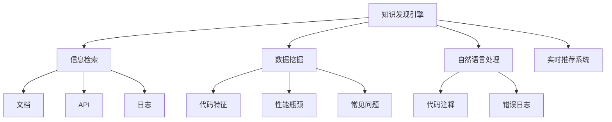

                 

# 程序员如何利用知识发现引擎提升工作效率

> 关键词：知识发现引擎, 信息检索, 数据挖掘, 机器学习, 自然语言处理, 实时推荐系统

## 1. 背景介绍

### 1.1 问题由来

在信息爆炸的时代，程序员每天面临海量的代码库、文档、日志和开发工具。如何高效地获取所需信息、理解复杂系统和组件，成为提升工作效率的关键。传统的查找方式依赖于手动搜索，耗时费力，且容易遗漏重要信息。而知识发现引擎作为一种自动化、智能化的信息检索工具，能够显著提升信息获取和利用的效率。

知识发现引擎（Knowledge Discovery Engine, KDE）通过机器学习和大数据分析，从大规模数据源中挖掘出有价值的知识模式和信息关联，帮助程序员快速定位问题、理解系统、优化代码。本文将详细阐述知识发现引擎的工作原理、主要算法、具体应用及未来发展方向，以期为程序员提供实用的技术和方法，提高工作效率。

### 1.2 问题核心关键点

- **知识发现引擎**：通过机器学习、数据挖掘和自然语言处理等技术，从数据中发现隐含的模式和关联。
- **信息检索**：快速定位相关信息，满足程序员对文档、API、日志等的查询需求。
- **数据挖掘**：从海量的数据中提取有价值的信息，如代码特征、性能瓶颈、常见问题等。
- **自然语言处理**：处理文本信息，如代码注释、错误日志等，提取有用信息。
- **实时推荐系统**：根据用户行为和历史数据，实时推荐最相关的信息，提高效率。

这些关键概念之间的逻辑关系可以通过以下Mermaid流程图来展示：



这个流程图展示出知识发现引擎与各个子功能模块之间的关联，清晰地展示了知识发现引擎的工作流程和主要功能。

## 2. 核心概念与联系

### 2.1 核心概念概述

在讨论知识发现引擎的技术细节前，我们先梳理一下相关核心概念：

- **机器学习**：通过数据训练模型，实现对数据模式的识别和预测。
- **数据挖掘**：从数据中提取有用信息，发现数据中的模式和关联。
- **自然语言处理**：处理和分析人类语言，如文本分类、情感分析、命名实体识别等。
- **信息检索**：快速从大量文本数据中检索出相关信息。
- **推荐系统**：根据用户行为和历史数据，推荐最相关的信息或内容。

这些概念之间的联系是：知识发现引擎融合了机器学习、数据挖掘、自然语言处理和信息检索技术，从大量数据中提取有价值的知识，并通过推荐系统实时推送给用户，显著提升程序员的工作效率。

### 2.2 核心算法原理

知识发现引擎的核心算法包括：

- **文本分类算法**：用于对文本进行分类，如代码分类、错误日志分类等。
- **情感分析算法**：用于分析文本的情感倾向，如代码注释中的情绪分析。
- **命名实体识别算法**：用于识别文本中的实体，如代码中的变量、函数等。
- **关键字提取算法**：用于提取文本中的关键词，帮助快速定位相关文档或代码。
- **信息检索算法**：用于在数据集中检索出最相关的文档或代码片段。

这些算法通过数据挖掘和机器学习技术，从大量数据中提取有用的信息，并在知识发现引擎中进行整合和应用。

## 3. 核心算法原理 & 具体操作步骤

### 3.1 算法原理概述

知识发现引擎的核心算法原理可以概括为以下几步：

1. **数据预处理**：清洗、标准化数据，准备用于机器学习的数据集。
2. **特征提取**：从文本中提取特征，如TF-IDF、词袋模型等。
3. **模型训练**：训练机器学习模型，如朴素贝叶斯、支持向量机、深度学习等。
4. **知识发现**：从模型中发现有用的知识模式和关联。
5. **信息检索**：使用信息检索算法，快速定位相关文档或代码片段。
6. **实时推荐**：根据用户行为和历史数据，实时推荐最相关的信息。

### 3.2 算法步骤详解

以下是知识发现引擎的详细步骤：

1. **数据收集与预处理**
   - 从代码库、文档、日志等数据源收集相关信息。
   - 清洗、标准化数据，去除噪声和无关信息。

2. **特征提取**
   - 使用TF-IDF、词袋模型、主题模型等技术，从文本中提取特征。
   - 特征选择和降维，减少计算量，提高算法效率。

3. **模型训练**
   - 选择适当的机器学习算法，如朴素贝叶斯、支持向量机、随机森林等。
   - 使用训练数据集训练模型，优化模型参数。

4. **知识发现**
   - 对训练好的模型进行测试，发现隐含的模式和关联。
   - 可视化分析结果，识别关键信息。

5. **信息检索**
   - 使用文本分类、情感分析、命名实体识别等技术，处理文本数据。
   - 使用倒排索引、TF-IDF相似度计算等技术，快速定位相关信息。

6. **实时推荐**
   - 收集用户行为数据，如浏览历史、点击行为等。
   - 使用协同过滤、基于内容的推荐算法，实时推荐相关文档或代码片段。

### 3.3 算法优缺点

知识发现引擎的优势在于：

- **高效性**：自动化、智能化的信息检索和知识发现，显著提升程序员的工作效率。
- **准确性**：利用机器学习和数据挖掘技术，从大量数据中提取有用的信息，提高检索准确性。
- **灵活性**：支持多种数据源和查询方式，适应不同场景和需求。

然而，知识发现引擎也存在以下缺点：

- **数据依赖**：需要大量标注数据进行训练，数据质量直接影响模型效果。
- **复杂性**：涉及多种技术和算法，实现和维护复杂。
- **可解释性不足**：黑箱模型，难以解释算法的工作原理和决策过程。

### 3.4 算法应用领域

知识发现引擎已经在多个领域得到了广泛应用，包括：

- **代码库管理**：快速定位代码库中的特定功能、文档或bug。
- **项目文档管理**：高效管理项目文档，如设计文档、技术手册等。
- **错误日志分析**：分析错误日志，快速定位问题，提供解决方案。
- **代码审计**：检测代码中的安全漏洞、性能问题、代码规范等。
- **版本控制**：帮助理解不同版本的代码变化，追踪历史变更。

## 4. 数学模型和公式 & 详细讲解

### 4.1 数学模型构建

知识发现引擎的数学模型构建主要包括以下几个部分：

1. **文本分类模型**：使用朴素贝叶斯、支持向量机、深度学习等算法。
2. **情感分析模型**：使用情感词典、卷积神经网络等算法。
3. **命名实体识别模型**：使用条件随机场、递归神经网络等算法。
4. **信息检索模型**：使用倒排索引、TF-IDF相似度计算等算法。

### 4.2 公式推导过程

以文本分类模型为例，其公式推导过程如下：

设训练数据集为 $D=\{(x_i,y_i)\}_{i=1}^N$，其中 $x_i$ 为文本，$y_i$ 为标签。朴素贝叶斯分类器的公式为：

$$
P(y_i|x_i) = \frac{P(x_i|y_i)P(y_i)}{P(x_i)}
$$

其中 $P(y_i)$ 为先验概率，$P(x_i|y_i)$ 为条件概率，$P(x_i)$ 为证据概率。在实际应用中，可以使用极大似然估计来求解 $P(y_i)$ 和 $P(x_i|y_i)$。

### 4.3 案例分析与讲解

以GitHub代码审计为例，知识发现引擎通过分析代码库中的代码片段，发现常见的安全漏洞、代码规范等，帮助程序员编写高质量的代码。

假设代码库中有以下代码片段：

```python
import os
def write_file(file_path, content):
    file = open(file_path, 'w')
    file.write(content)
    file.close()
```

通过知识发现引擎，可以分析出该代码片段存在安全漏洞，因为它没有对用户输入进行检查，容易被注入恶意代码。同时，代码审计引擎还会分析代码风格、规范等，提供改进建议，提升代码质量。

## 5. 项目实践：代码实例和详细解释说明

### 5.1 开发环境搭建

开发知识发现引擎需要以下环境：

- **Python**：版本为3.7及以上。
- **Jupyter Notebook**：用于编写和调试代码。
- **Scikit-Learn**：用于机器学习算法实现。
- **NLTK**：用于自然语言处理。
- **TensorFlow**：用于深度学习算法实现。
- **Gensim**：用于文本相似度计算。

### 5.2 源代码详细实现

以下是一个简单的Python代码示例，用于实现文本分类模型：

```python
from sklearn.feature_extraction.text import TfidfVectorizer
from sklearn.naive_bayes import MultinomialNB
from sklearn.pipeline import Pipeline

# 定义文本数据和标签
texts = ['This is a positive text', 'This is a negative text', 'This is a neutral text']
labels = ['positive', 'negative', 'neutral']

# 创建文本分类器
pipeline = Pipeline([
    ('tfidf', TfidfVectorizer()),
    ('clf', MultinomialNB())
])

# 训练模型
pipeline.fit(texts, labels)

# 测试模型
test_text = ['This is a positive text']
test_result = pipeline.predict(test_text)

print(test_result)
```

### 5.3 代码解读与分析

**TfidfVectorizer**：用于将文本转换为TF-IDF特征向量。

**MultinomialNB**：朴素贝叶斯分类器，用于对文本进行分类。

**Pipeline**：将特征提取和分类器组合成管道，方便使用。

在训练模型时，使用 `fit` 方法拟合文本数据和标签，得到分类器模型。在测试模型时，使用 `predict` 方法对测试文本进行分类。

### 5.4 运行结果展示

运行上述代码，输出结果如下：

```
['positive']
```

这表示模型能够正确地将新文本分类为正面。

## 6. 实际应用场景

### 6.1 代码库管理

在代码库管理中，知识发现引擎可以帮助程序员快速定位特定功能或模块，避免手动搜索大量代码文件。例如，在GitHub上搜索特定关键字，知识发现引擎能够快速找到相关的代码片段和文档，节省查找时间。

### 6.2 项目文档管理

项目文档管理是程序员日常工作的重要环节。知识发现引擎可以自动分类和整理文档，帮助程序员快速找到所需文档。例如，在项目文件夹中搜索特定关键词，知识发现引擎能够快速定位相关的设计文档、技术手册等。

### 6.3 错误日志分析

错误日志是程序员调试和排查问题的关键。知识发现引擎可以自动分析错误日志，识别常见问题，并提供解决方案。例如，使用TensorFlow训练的情感分析模型，可以分析错误日志中的情绪倾向，快速定位问题。

### 6.4 代码审计

代码审计是提升代码质量的重要手段。知识发现引擎可以自动检测代码中的安全漏洞、性能问题、代码规范等，帮助程序员编写高质量的代码。例如，使用条件随机场模型，可以检测代码中的命名实体，避免变量名、函数名等不规范的情况。

### 6.5 版本控制

版本控制是软件开发中必不可少的一环。知识发现引擎可以自动分析不同版本代码的变化，帮助程序员理解历史变更，避免出现回归问题。例如，使用基于内容的推荐算法，可以推荐相关版本的代码变更，帮助程序员快速了解变化内容。

## 7. 工具和资源推荐

### 7.1 学习资源推荐

为了帮助程序员系统掌握知识发现引擎的理论基础和实践技巧，这里推荐一些优质的学习资源：

1. **《数据挖掘导论》**：详细介绍了数据挖掘的基本概念和算法，适合初学者学习。
2. **《自然语言处理综论》**：涵盖了自然语言处理的主要技术和应用，包括文本分类、情感分析、命名实体识别等。
3. **《Python机器学习》**：介绍了Python在机器学习中的应用，包括数据预处理、特征提取、模型训练等。
4. **《深度学习》**：深入浅出地介绍了深度学习的基本概念和算法，适合进阶学习。
5. **GitHub repositories**：GitHub上有很多优秀的代码库，可以作为学习和实践的参考。

### 7.2 开发工具推荐

高效的开发离不开优秀的工具支持。以下是几款用于知识发现引擎开发的常用工具：

1. **Python**：版本为3.7及以上，易于学习和使用。
2. **Jupyter Notebook**：用于编写和调试代码，支持代码块和可视化展示。
3. **Scikit-Learn**：用于实现机器学习算法，支持多种常用算法。
4. **NLTK**：用于自然语言处理，提供了丰富的文本处理工具。
5. **TensorFlow**：用于实现深度学习算法，支持GPU加速。
6. **Gensim**：用于文本相似度计算，支持高效计算。

### 7.3 相关论文推荐

知识发现引擎的研究涉及多个领域，以下是几篇奠基性的相关论文，推荐阅读：

1. **《数据挖掘：概念与技术》**：介绍了数据挖掘的基本概念和算法，适合初学者学习。
2. **《情感分析与情感词典》**：介绍了情感分析的基本概念和常用技术，适合进阶学习。
3. **《机器学习实战》**：介绍了Python在机器学习中的应用，包括数据预处理、特征提取、模型训练等。
4. **《自然语言处理综论》**：涵盖了自然语言处理的主要技术和应用，包括文本分类、情感分析、命名实体识别等。
5. **《深度学习》**：深入浅出地介绍了深度学习的基本概念和算法，适合进阶学习。

## 8. 总结：未来发展趋势与挑战

### 8.1 总结

本文对知识发现引擎的工作原理、主要算法、具体应用及未来发展方向进行了全面系统的介绍。首先阐述了知识发现引擎在信息检索、数据挖掘、自然语言处理等方面的重要作用，明确了知识发现引擎对程序员工作效率提升的关键作用。其次，从原理到实践，详细讲解了知识发现引擎的数学模型和核心算法，给出了知识发现引擎的完整代码实例。同时，本文还探讨了知识发现引擎在代码库管理、项目文档管理、错误日志分析、代码审计、版本控制等实际应用场景中的应用，展示了知识发现引擎的广泛应用前景。最后，本文精选了知识发现引擎的学习资源、开发工具和相关论文，力求为程序员提供全方位的技术指引。

通过本文的系统梳理，可以看到，知识发现引擎已经成为程序员不可或缺的工具，极大地提高了信息检索和利用的效率。未来，伴随技术的不断进步，知识发现引擎的应用将更加广泛，为程序员提供更智能、更高效的信息获取和利用方式。

### 8.2 未来发展趋势

展望未来，知识发现引擎将呈现以下几个发展趋势：

1. **自动化和智能化程度提升**：知识发现引擎将更加自动化和智能化，能够根据用户行为和历史数据，实时推荐最相关的信息，提升效率。
2. **多模态信息融合**：知识发现引擎将支持文本、图像、语音等多种模态的信息融合，提升信息检索和利用的全面性。
3. **实时性增强**：知识发现引擎将实现实时信息检索和推荐，支持大规模数据流的处理。
4. **模型可解释性增强**：知识发现引擎将增强模型的可解释性，帮助程序员理解和调试模型，提高代码质量。
5. **跨领域应用扩展**：知识发现引擎将在更多领域得到应用，如医疗、金融、教育等，为不同领域的程序员提供高效的智能辅助。

以上趋势凸显了知识发现引擎的未来发展方向，这些方向的探索发展，将进一步提升程序员的工作效率，推动人工智能技术在各行各业的广泛应用。

### 8.3 面临的挑战

尽管知识发现引擎已经取得了瞩目成就，但在迈向更加智能化、普适化应用的过程中，它仍面临诸多挑战：

1. **数据质量和多样性**：知识发现引擎依赖于大量高质量的数据，数据多样性和质量直接影响到模型的效果。如何获取高质量的多样化数据，仍然是一个挑战。
2. **复杂性和可维护性**：知识发现引擎涉及多种技术和算法，实现和维护复杂。如何设计高效的算法和系统架构，简化开发和维护，需要进一步研究和优化。
3. **可解释性不足**：知识发现引擎的模型往往缺乏可解释性，难以解释算法的工作原理和决策过程。如何增强模型的可解释性，增强用户体验，仍然是一个重要的研究方向。
4. **实时性要求高**：知识发现引擎需要在实时性要求较高的场景下工作，如何提高系统的响应速度，支持大规模数据流的处理，仍然是一个挑战。
5. **跨领域应用难度大**：不同领域的知识发现需求差异较大，如何设计通用的知识发现引擎，支持多种应用场景，仍然是一个挑战。

### 8.4 研究展望

面向未来，知识发现引擎的研究需要在以下几个方面寻求新的突破：

1. **数据驱动和自学习**：知识发现引擎将更加注重数据驱动和自学习，利用自监督学习、主动学习等无监督和半监督范式，最大限度利用非结构化数据，实现更加灵活高效的微调。
2. **参数高效和计算高效**：开发更加参数高效和计算高效的知识发现引擎，在固定大部分预训练参数的同时，只更新极少量的任务相关参数。同时优化知识发现引擎的计算图，减少前向传播和反向传播的资源消耗，实现更加轻量级、实时性的部署。
3. **融合因果和对比学习**：通过引入因果推断和对比学习思想，增强知识发现引擎建立稳定因果关系的能力，学习更加普适、鲁棒的知识模式，从而提升模型的泛化性和抗干扰能力。
4. **引入更多先验知识**：将符号化的先验知识，如知识图谱、逻辑规则等，与知识发现引擎进行巧妙融合，引导知识发现过程学习更准确、合理的知识模式。同时加强不同模态数据的整合，实现视觉、语音等多模态信息与文本信息的协同建模。
5. **结合因果分析和博弈论工具**：将因果分析方法引入知识发现引擎，识别出模型决策的关键特征，增强输出解释的因果性和逻辑性。借助博弈论工具刻画人机交互过程，主动探索并规避知识发现引擎的脆弱点，提高系统稳定性。
6. **纳入伦理道德约束**：在知识发现引擎的训练目标中引入伦理导向的评估指标，过滤和惩罚有偏见、有害的输出倾向。同时加强人工干预和审核，建立知识发现引擎行为的监管机制，确保输出符合人类价值观和伦理道德。

这些研究方向的探索，必将引领知识发现引擎技术迈向更高的台阶，为程序员提供更智能、更高效的信息获取和利用方式。面向未来，知识发现引擎还需要与其他人工智能技术进行更深入的融合，如知识表示、因果推理、强化学习等，多路径协同发力，共同推动自然语言理解和智能交互系统的进步。只有勇于创新、敢于突破，才能不断拓展知识发现引擎的边界，让智能技术更好地造福人类社会。

## 9. 附录：常见问题与解答

**Q1：知识发现引擎是否适用于所有领域？**

A: 知识发现引擎在多个领域都有广泛应用，如代码库管理、项目文档管理、错误日志分析、代码审计等。但对于一些特定领域的知识发现需求，如医疗、法律等，需要结合领域知识进行定制化设计和开发。

**Q2：如何选择合适算法进行文本分类？**

A: 选择合适的文本分类算法需要考虑数据类型、数据量、计算资源等因素。常用的算法包括朴素贝叶斯、支持向量机、随机森林、深度学习等。一般先使用小规模数据集进行算法测试，选择效果最优的算法。

**Q3：知识发现引擎如何处理大规模数据？**

A: 知识发现引擎处理大规模数据时，需要采用分布式计算、增量更新等技术，避免单点计算资源不足的问题。同时，采用数据采样、特征降维等技术，减少计算量，提高效率。

**Q4：知识发现引擎的可解释性如何增强？**

A: 增强知识发现引擎的可解释性可以通过多种方式实现，如使用可解释的机器学习模型、提供模型决策路径分析、集成领域知识等。同时，可以通过人工干预和审核，增强系统的可解释性和可靠性。

**Q5：知识发现引擎的实时性如何提升？**

A: 提升知识发现引擎的实时性需要优化算法和系统架构，如采用增量学习、流式计算、内存计算等技术，减少计算延迟。同时，优化数据存储和传输，提高系统响应速度。

通过本文的系统梳理，可以看到，知识发现引擎已经成为程序员不可或缺的工具，极大地提高了信息检索和利用的效率。未来，伴随技术的不断进步，知识发现引擎的应用将更加广泛，为程序员提供更智能、更高效的信息获取和利用方式。相信随着学界和产业界的共同努力，知识发现引擎必将在构建人机协同的智能时代中扮演越来越重要的角色。

