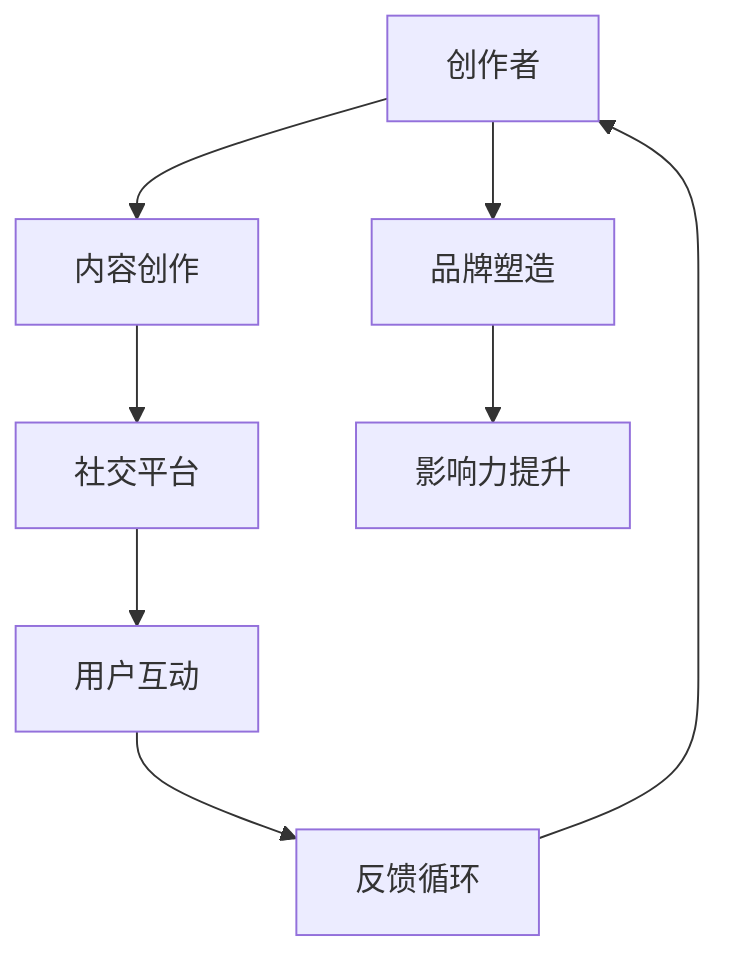

                 

# 程序员如何利用社交媒体扩大知识付费影响力

> 关键词：社交媒体,知识付费,影响力提升,内容创作,SEO优化,社交平台,数字营销,社交媒体策略,品牌塑造,网络影响力,付费课程

## 1. 背景介绍

### 1.1 问题由来
随着信息时代的到来，知识付费逐渐成为一种主流趋势。然而，知识付费内容制作者普遍面临内容吸引力不足、用户留存率低等问题。如何提升自身的影响力，吸引并留住更多用户，成为知识付费内容创作者必须面对的难题。社交媒体作为一种便捷的传播渠道，正成为程序员和知识创作者扩大自身影响力的重要手段。本文将详细介绍程序员如何利用社交媒体，实现知识付费影响力的最大化。

### 1.2 问题核心关键点
社交媒体的崛起，为知识付费内容创作者提供了更多元的传播途径。通过合理利用社交媒体，可以显著提升内容的影响力，扩大知识付费市场的覆盖范围，提升个人品牌价值，从而带来更多的付费用户。

具体核心关键点包括：

- 选择合适的社交平台。
- 制定精准的内容策略。
- 利用SEO优化提升曝光率。
- 构建完整的社交媒体矩阵。
- 制定高效的社交媒体策略。
- 打造品牌形象，提升用户粘性。

## 2. 核心概念与联系

### 2.1 核心概念概述

社交媒体作为一种信息传播和交流的平台，已成为知识付费内容创作者扩大影响力的重要渠道。通过社交媒体，创作者可以发布优质内容、与用户互动、收集反馈，形成良好的反馈循环，从而提升自身的影响力。

### 2.2 核心概念原理和架构的 Mermaid 流程图



## 3. 核心算法原理 & 具体操作步骤

### 3.1 算法原理概述

利用社交媒体扩大知识付费影响力的核心算法原理，是通过高质量内容创建与精准传播，建立内容与用户之间的信任关系，从而提升用户的付费意愿。

具体来说，包括以下步骤：

1. 内容创作：生成具有吸引力的内容，并确保内容的价值性和实用性。
2. 传播策略：选择合适的社交平台，制定适合平台的内容传播策略。
3. 互动与反馈：与用户积极互动，收集用户反馈，不断优化内容质量。
4. 品牌塑造：通过持续发布高质量内容，逐步建立个人品牌形象。
5. 影响力提升：借助社交媒体平台的推荐算法，提升内容在平台上的曝光率。

### 3.2 算法步骤详解

#### 3.2.1 内容创作

内容创作是知识付费社交媒体传播的基础。高质量的内容不仅能够吸引用户，还能提升用户对内容的认可度和付费意愿。以下是内容创作的具体步骤：

1. **确定内容主题**：根据自身专业领域，选择用户关注的热点话题或热门问题。
2. **进行内容调研**：收集相关资料，分析市场需求，了解用户痛点。
3. **制定内容计划**：制定详细的内容发布计划，确保内容创作的连续性和系统性。
4. **进行内容制作**：使用专业工具进行内容创作，确保内容的可读性和专业性。
5. **发布并宣传**：选择适当的时机和平台发布内容，并进行适当的宣传。

#### 3.2.2 传播策略

选择合适的社交平台，制定适合平台的内容传播策略，是提升内容影响力的关键步骤。以下是具体步骤：

1. **选择社交平台**：根据内容特点和受众群体，选择合适的社交平台，如微博、知乎、抖音、LinkedIn等。
2. **分析受众特点**：分析目标受众的兴趣和行为习惯，选择合适的发布时间和频率。
3. **制定传播计划**：制定详细的内容传播计划，包括内容发布、互动回复、话题标签等。
4. **执行传播计划**：严格按照传播计划执行，确保内容的定时发布和互动回复。
5. **监测效果并调整**：定期监测内容效果，根据数据调整传播策略。

#### 3.2.3 互动与反馈

与用户积极互动，收集用户反馈，是提升内容影响力的重要环节。以下是具体步骤：

1. **互动回复**：及时回复用户评论和私信，积极与用户互动。
2. **收集反馈**：收集用户的意见和建议，分析用户需求。
3. **优化内容**：根据用户反馈，优化和改进内容质量。
4. **建立社群**：建立用户社群，提供用户交流平台，增强用户粘性。
5. **发布互动内容**：定期发布互动内容，如问答、直播、讨论等。

#### 3.2.4 品牌塑造

通过持续发布高质量内容，逐步建立个人品牌形象，是提升用户信任和付费意愿的重要手段。以下是具体步骤：

1. **明确品牌定位**：根据自身特点，确定品牌定位和目标用户群体。
2. **制定品牌策略**：制定品牌传播策略，确保品牌传播的一致性和连贯性。
3. **进行品牌推广**：利用社交媒体进行品牌推广，提升品牌知名度。
4. **参与行业活动**：积极参与行业活动，提升品牌影响力。
5. **维护品牌形象**：定期维护品牌形象，保持品牌形象的一致性和专业性。

#### 3.2.5 影响力提升

借助社交媒体平台的推荐算法，提升内容在平台上的曝光率，是扩大知识付费影响力的重要步骤。以下是具体步骤：

1. **利用标签和话题**：使用热门标签和话题，提升内容的曝光率。
2. **进行内容互动**：积极参与平台互动，提升内容的热度和话题性。
3. **利用付费广告**：利用社交媒体平台的付费广告功能，提升内容的曝光率。
4. **建立长尾流量**：利用长尾关键词，吸引特定受众，提升内容的精准性。
5. **进行内容回顾**：定期回顾内容效果，调整优化内容策略。

### 3.3 算法优缺点

#### 3.3.1 优点

1. **覆盖范围广**：社交媒体覆盖的用户群体广泛，有助于提升内容的覆盖范围。
2. **传播速度快**：利用社交媒体平台，可以快速传播优质内容，提升用户认知。
3. **互动性强**：社交媒体平台提供丰富的互动工具，如评论、点赞、分享等，增强用户粘性。
4. **成本低**：相比于传统媒体，社交媒体传播成本较低，便于持续投入。
5. **可量化分析**：社交媒体平台提供丰富的数据分析工具，可以实时监测内容效果。

#### 3.3.2 缺点

1. **内容质量要求高**：社交媒体平台上的用户对内容质量要求较高，低质量内容容易引发反感。
2. **用户群体分散**：不同社交平台的用户群体特点各异，需要进行多平台运营。
3. **平台算法变化**：社交媒体平台的算法不断变化，需要持续优化内容策略。
4. **数据隐私风险**：社交媒体平台对用户数据的收集和分析，存在一定的隐私风险。
5. **内容投入大**：社交媒体运营需要大量的时间和资源投入，尤其是在初期。

### 3.4 算法应用领域

社交媒体作为知识付费内容创作者扩大影响力的重要手段，已经广泛应用于多个领域，如教育培训、软件开发、金融投资、心理咨询等。

具体应用领域包括：

1. **教育培训**：通过社交媒体平台发布教育内容，吸引用户付费学习。
2. **软件开发**：发布编程技巧、开发工具、项目经验等内容，吸引开发者付费订阅。
3. **金融投资**：分享投资经验、市场分析、财务规划等内容，吸引投资者付费学习。
4. **心理咨询**：发布心理知识、咨询案例、心理健康内容，吸引用户付费咨询。
5. **职业发展**：发布职业规划、技能提升、行业动态等内容，吸引职场人士付费学习。

## 4. 数学模型和公式 & 详细讲解 & 举例说明

### 4.1 数学模型构建

假设社交媒体平台上有 $N$ 个用户，每个用户对于内容 $i$ 的关注度为 $a_i$，内容 $i$ 的曝光量为 $b_i$，内容 $i$ 的转化率为 $c_i$，内容 $i$ 的付费量为 $d_i$。则社交媒体平台上的总付费量为：

$$
P = \sum_{i=1}^N c_i b_i a_i
$$

其中，$c_i$ 为内容 $i$ 的转化率，$b_i$ 为内容 $i$ 的曝光量，$a_i$ 为内容 $i$ 的关注度。

### 4.2 公式推导过程

利用社交媒体平台的推荐算法，可以根据用户关注度和曝光量，调整内容的发布时间和频率，提升内容的曝光量和关注度。具体推导过程如下：

1. **关注度提升**：利用社交媒体平台的互动工具，提升内容的关注度。
2. **曝光量提升**：利用社交媒体平台的算法推荐，提升内容的曝光量。
3. **转化率提升**：通过内容的优化和互动，提升内容的转化率。

### 4.3 案例分析与讲解

**案例1：编程技术分享**

某编程技术分享者通过微博和知乎两个平台进行内容创作和传播，微博主要发布技术文章和项目经验，知乎主要进行技术问答和社区互动。通过不断优化内容质量和传播策略，该分享者在两个平台上逐渐积累了大量的关注者，形成了完整的社交媒体矩阵。

**案例2：金融投资分析**

某金融投资分析师通过LinkedIn和Twitter两个平台发布市场分析和投资经验，利用平台的算法推荐和付费广告功能，提升了内容的曝光率和关注度。通过与用户积极互动，收集用户反馈，不断优化内容质量，形成了专业的品牌形象。

## 5. 项目实践：代码实例和详细解释说明

### 5.1 开发环境搭建

在进行社交媒体运营实践前，需要先搭建好开发环境。以下是基于Python的开发环境搭建流程：

1. 安装Python：从官网下载并安装Python。
2. 安装必要的库：安装Flask、Pandas、Scikit-learn、TensorFlow等必要的库。
3. 安装社交媒体API：安装Twitter API、微博API、知乎API等，以便于社交媒体内容的自动化发布和分析。
4. 配置环境变量：设置必要的API密钥、数据库连接信息等，确保API能够正常调用。
5. 搭建服务器：使用Python的Flask框架搭建服务器，确保能够自动发布和更新内容。

### 5.2 源代码详细实现

以下是使用Python Flask框架搭建社交媒体内容发布平台的代码实现。

```python
from flask import Flask, request, jsonify
import pandas as pd
import tweepy
import pymongo

app = Flask(__name__)

# 设置环境变量
TWITTER_CONSUMER_KEY = 'your_consumer_key'
TWITTER_CONSUMER_SECRET = 'your_consumer_secret'
TWITTER_ACCESS_TOKEN = 'your_access_token'
TWITTER_ACCESS_TOKEN_SECRET = 'your_access_token_secret'

# 连接Twitter API
auth = tweepy.OAuth1UserHandler(TWITTER_CONSUMER_KEY, TWITTER_CONSUMER_SECRET, TWITTER_ACCESS_TOKEN, TWITTER_ACCESS_TOKEN_SECRET)
api = tweepy.API(auth)

# 连接MongoDB数据库
client = pymongo.MongoClient('mongodb://localhost:27017/')
db = client['social_media']
collection = db['content']

# 发布内容
@app.route('/post', methods=['POST'])
def post_content():
    data = request.get_json()
    title = data['title']
    content = data['content']
    hashtags = data['hashtags']
    collection.insert_one({'title': title, 'content': content, 'hashtags': hashtags})
    api.update_status(status=content)
    return jsonify({'message': 'Content posted successfully'})

# 获取内容
@app.route('/get', methods=['GET'])
def get_content():
    results = collection.find()
    return jsonify([{'title': item['title'], 'content': item['content'], 'hashtags': item['hashtags']} for item in results])

if __name__ == '__main__':
    app.run(debug=True)
```

### 5.3 代码解读与分析

**代码解读**：

- Flask框架：搭建基于Python的Web服务器，实现内容的自动发布。
- Twitter API：连接Twitter平台，实现内容的自动发布和互动。
- MongoDB数据库：存储和管理社交媒体内容，方便数据分析和优化。
- RESTful API：提供发布和获取内容的接口，方便用户和第三方系统使用。

**代码分析**：

- Flask框架：通过Flask框架搭建Web服务器，实现内容的自动发布和互动。
- Twitter API：利用Twitter API，自动发布和更新内容，提升内容的曝光率和关注度。
- MongoDB数据库：使用MongoDB数据库，存储和管理社交媒体内容，方便数据分析和优化。
- RESTful API：提供RESTful API，方便用户和第三方系统调用，实现内容的自动化发布和管理。

### 5.4 运行结果展示

以下是基于上述代码实现的一个示例：

- 用户在Web界面提交内容发布请求，包含标题、内容和相关标签。
- 服务器接收到请求，自动将内容发布到Twitter平台，并保存到MongoDB数据库中。
- 用户可以通过Web界面，查询和分析已发布内容的效果。

## 6. 实际应用场景

### 6.1 教育培训

通过社交媒体平台，教育培训内容创作者可以发布课程预告、课程精彩片段、学生反馈等内容，吸引用户付费学习。

**实际应用**：某在线教育平台通过微信公众号和微博两个平台，发布课程预告和学员反馈，吸引了大量学生关注和付费学习。

### 6.2 软件开发

通过社交媒体平台，软件开发内容创作者可以发布技术文章、项目经验、代码示例等内容，吸引开发者付费订阅。

**实际应用**：某开源软件开发者通过GitHub和Twitter两个平台，发布技术文章和代码示例，吸引了大量开发者关注和付费订阅。

### 6.3 金融投资

通过社交媒体平台，金融投资内容创作者可以分享市场分析、投资经验、财务规划等内容，吸引投资者付费学习。

**实际应用**：某金融分析师通过LinkedIn和Twitter两个平台，发布市场分析和投资经验，吸引了大量投资者关注和付费学习。

### 6.4 未来应用展望

随着社交媒体平台的不断发展和完善，利用社交媒体扩大知识付费影响力的方法将不断创新和优化。未来，社交媒体将更多地融合AI技术，提供更加个性化和精准的内容推荐，提升内容的用户覆盖率和转化率。

## 7. 工具和资源推荐

### 7.1 学习资源推荐

1. **《Python编程：从入门到实践》**：介绍Python基础和Web开发，适合初学者学习。
2. **《Flask Web开发实战》**：详细介绍Flask框架的使用方法和实际应用，适合有基础的开发者学习。
3. **《Twitter API开发实战》**：详细介绍Twitter API的使用方法和最佳实践，适合社交媒体开发人员学习。
4. **《MongoDB实战》**：详细介绍MongoDB数据库的使用方法和高级应用，适合数据库开发人员学习。
5. **《SEO优化实战》**：详细介绍SEO优化的基本原理和实战技巧，适合网站运营人员学习。

### 7.2 开发工具推荐

1. **Flask**：轻量级的Web框架，易于上手，适合快速开发Web应用。
2. **Pandas**：数据处理和分析的Python库，适合数据处理和建模。
3. **Tweepy**：Python的Twitter API接口库，适合社交媒体开发。
4. **MongoDB**：NoSQL数据库，适合存储和管理大量非结构化数据。
5. **SEO分析工具**：如Google Analytics、百度统计等，适合网站运营人员使用。

### 7.3 相关论文推荐

1. **《社交媒体对知识付费的影响研究》**：探讨社交媒体平台对知识付费的影响，提供丰富的数据和案例分析。
2. **《基于社交媒体的内容推荐算法研究》**：详细介绍社交媒体平台的内容推荐算法，提供前沿研究方法和技术实现。
3. **《基于社交媒体的个性化广告研究》**：详细介绍社交媒体平台的个性化广告技术，提供实际应用案例。
4. **《基于社交媒体的品牌塑造策略》**：详细介绍社交媒体平台上的品牌塑造策略，提供品牌建设和传播方法。

## 8. 总结：未来发展趋势与挑战

### 8.1 研究成果总结

利用社交媒体平台扩大知识付费影响力，已成为知识创作者提升影响力的重要手段。通过高质量内容创作、精准传播策略、用户互动反馈、品牌塑造和影响力提升，能够显著提升内容的覆盖范围和用户粘性。

### 8.2 未来发展趋势

未来，社交媒体平台将更多地融合AI技术，提供更加个性化和精准的内容推荐，提升内容的用户覆盖率和转化率。社交媒体将与大数据、机器学习等技术深度融合，构建更加智能的内容推荐和互动系统，提升用户体验和品牌价值。

### 8.3 面临的挑战

尽管社交媒体平台在提升知识付费影响力方面具有重要价值，但在实际应用中也面临诸多挑战。

1. **内容质量要求高**：社交媒体平台上的用户对内容质量要求较高，低质量内容容易引发反感。
2. **用户群体分散**：不同社交平台的用户群体特点各异，需要进行多平台运营。
3. **平台算法变化**：社交媒体平台的算法不断变化，需要持续优化内容策略。
4. **数据隐私风险**：社交媒体平台对用户数据的收集和分析，存在一定的隐私风险。
5. **内容投入大**：社交媒体运营需要大量的时间和资源投入，尤其是在初期。

### 8.4 研究展望

未来，社交媒体平台的优化和创新将是提升知识付费影响力的关键。研究社交媒体平台的内容推荐算法、个性化广告技术、品牌塑造策略等，将不断提升内容的覆盖率和用户粘性，推动知识付费市场的繁荣发展。同时，如何平衡用户隐私保护和数据利用，也将成为社交媒体平台发展的重要课题。

## 9. 附录：常见问题与解答

**Q1：如何选择适合的内容主题？**

A: 选择适合的内容主题，需要根据自身专业领域和受众需求，选择热门话题或用户关注的问题。可以通过数据分析工具，如Google Trends、微博热搜等，了解热门话题和趋势，从而选择具有吸引力的内容主题。

**Q2：如何制定适合平台的内容传播策略？**

A: 制定适合平台的内容传播策略，需要了解目标平台的受众特点和行为习惯，选择合适的发布时间和频率。可以通过平台提供的分析工具，了解用户的行为数据，从而制定更加精准的内容传播策略。

**Q3：如何提升内容的关注度和曝光率？**

A: 提升内容的关注度和曝光率，需要积极与用户互动，利用社交媒体平台的互动工具，如评论、点赞、分享等，增强用户粘性。同时，利用社交媒体平台的算法推荐，提升内容的曝光量和关注度。

**Q4：如何利用Twitter API进行内容自动发布？**

A: 利用Twitter API进行内容自动发布，需要连接Twitter平台，并使用Python的Tweepy库进行API调用。可以设置自动发布任务，利用Python定时任务库，如APScheduler，实现内容的自动发布和更新。

**Q5：如何使用MongoDB存储和管理社交媒体内容？**

A: 使用MongoDB存储和管理社交媒体内容，需要连接MongoDB数据库，并使用Python的pymongo库进行数据库操作。可以设计合适的数据结构，存储和管理内容的相关信息，并使用数据分析工具，如Pandas、Scikit-learn等，进行内容的效果分析和优化。

---

作者：禅与计算机程序设计艺术 / Zen and the Art of Computer Programming

