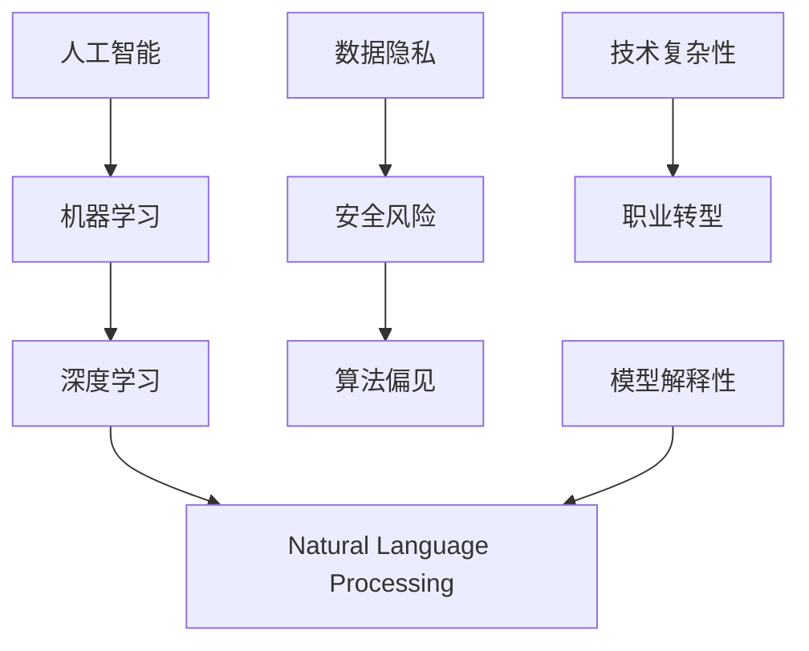

                 

# 程序员如何应对人工智能带来的挑战

## 1. 背景介绍

### 1.1 问题由来
随着人工智能技术的迅猛发展，程序员面临着前所未有的挑战。AI技术不仅提升了生产效率，也带来了新的工作方式和思维模式。然而，技术的高速发展也引发了一系列问题，如数据隐私、安全风险、算法偏见等，需要程序员在技术应用的同时，更多地关注伦理和社会责任。本文旨在探讨程序员如何应对这些挑战，确保AI技术的健康发展。

### 1.2 问题核心关键点
人工智能带来的挑战主要集中在以下几个方面：

- **数据隐私与伦理**：AI模型的训练需要大量的数据，如何保护个人隐私和数据安全是重要的挑战。
- **安全风险与攻击**：AI模型可能被恶意利用，导致数据泄露、系统攻击等风险。
- **算法偏见与公平性**：AI模型的决策过程可能受到训练数据偏见的影响，导致不公正的输出结果。
- **技术复杂性与职业转型**：AI技术复杂性高，对程序员技能要求提升，同时传统开发岗位面临被替代的风险。
- **模型解释性与透明性**：AI模型的决策过程通常是"黑箱"，难以解释和审计。

这些挑战不仅影响AI技术的普及应用，也影响程序员的日常工作。如何平衡技术应用与伦理责任，保护用户权益，确保AI技术的健康发展，是程序员必须面对的问题。

## 2. 核心概念与联系

### 2.1 核心概念概述

为更好地理解程序员如何应对人工智能带来的挑战，本节将介绍几个密切相关的核心概念：

- **人工智能(AI)**：利用计算机技术模拟人类智能行为，包括机器学习、深度学习、自然语言处理等。
- **机器学习(ML)**：通过数据驱动的学习，使计算机系统具备自主学习的能力。
- **深度学习(DL)**：一种基于多层神经网络的机器学习范式，特别适用于复杂数据结构。
- **自然语言处理(NLP)**：使计算机能够理解和生成人类语言的技术。
- **数据隐私**：保护个人数据的机密性、完整性和可用性，防止未经授权的访问和使用。
- **安全风险**：如数据泄露、模型攻击等，威胁AI系统的安全性。
- **算法偏见**：由于训练数据或模型设计的不公平性，导致AI模型输出结果的不公正。
- **技术复杂性**：AI技术复杂度较高，需要程序员具备更广泛的知识和技能。
- **职业转型**：AI技术的发展改变了编程范式，对传统程序员职业产生冲击。
- **模型解释性**：要求AI模型具有可解释性和透明性，便于理解和审计。

这些核心概念之间的逻辑关系可以通过以下Mermaid流程图来展示：



这个流程图展示了人工智能技术的各个组成部分，以及与数据隐私、安全风险、算法偏见、技术复杂性、职业转型和模型解释性之间的联系。这些概念共同构成了AI技术的研究和应用框架，程序员在应对人工智能带来的挑战时，需要全面理解和平衡这些因素。

## 3. 核心算法原理 & 具体操作步骤
### 3.1 算法原理概述

AI技术的核心算法原理主要包括以下几个方面：

- **监督学习(Supervised Learning)**：使用带有标签的数据集进行模型训练，使得模型能够根据输入数据预测输出结果。
- **无监督学习(Unsupervised Learning)**：使用无标签的数据集进行模型训练，发现数据的内在结构或规律。
- **强化学习(Reinforcement Learning)**：通过与环境的交互，使模型不断优化决策策略。
- **深度学习**：通过多层神经网络，学习数据的高级表示，适用于复杂的特征识别和分类问题。

### 3.2 算法步骤详解

AI技术的开发和应用通常包括以下几个关键步骤：

1. **数据准备**：收集和预处理数据，确保数据质量。
2. **模型选择与设计**：选择合适的模型架构和算法，进行初步设计。
3. **模型训练**：使用训练数据集对模型进行优化训练，调整模型参数。
4. **模型评估与验证**：使用验证集或测试集评估模型性能，防止过拟合。
5. **模型部署与维护**：将训练好的模型部署到实际应用环境中，并持续监测和维护。

### 3.3 算法优缺点

AI技术在提升生产效率、解决复杂问题等方面具有显著优势，但也存在一些缺点：

**优点**：
- **自动化**：通过自动化算法，减少了人工干预，提高了工作效率。
- **泛化能力**：AI模型能够处理大量数据，发现数据间的复杂关系，提高决策的准确性。
- **创新能力**：AI技术推动了新领域、新技术的发现和应用。

**缺点**：
- **数据依赖**：AI模型的性能依赖于数据质量，数据不足或偏差可能导致模型性能下降。
- **黑箱问题**：许多AI模型的决策过程难以解释，缺乏透明性和可解释性。
- **伦理风险**：AI模型可能存在偏见，导致不公平的结果，引发伦理问题。
- **安全风险**：AI模型可能被攻击，导致数据泄露等安全问题。

### 3.4 算法应用领域

AI技术已经在多个领域得到了广泛应用，例如：

- **医疗健康**：AI用于疾病诊断、医疗影像分析、药物研发等。
- **金融服务**：AI用于风险评估、欺诈检测、智能投顾等。
- **教育培训**：AI用于个性化学习、自动评分、智能辅导等。
- **智能制造**：AI用于预测性维护、质量控制、智能调度等。
- **环境保护**：AI用于气候预测、生态监控、污染治理等。

## 4. 数学模型和公式 & 详细讲解 & 举例说明
### 4.1 数学模型构建

AI技术的数学模型通常包括监督学习、无监督学习和强化学习等。这里以监督学习为例，构建一个简单的线性回归模型：

设训练数据集为 $\{(x_i, y_i)\}_{i=1}^N$，其中 $x_i \in \mathbb{R}^d$ 为输入特征，$y_i \in \mathbb{R}$ 为输出标签。线性回归模型的目标是最小化预测值 $\hat{y} = \theta^T x$ 与真实值 $y$ 之间的平方误差，即：

$$
\min_{\theta} \sum_{i=1}^N (y_i - \theta^T x_i)^2
$$

其中 $\theta$ 为模型参数。

### 4.2 公式推导过程

线性回归模型的参数更新公式为梯度下降：

$$
\theta \leftarrow \theta - \eta \nabla_{\theta} L(\theta)
$$

其中 $\eta$ 为学习率，$\nabla_{\theta} L(\theta)$ 为损失函数对 $\theta$ 的梯度，可通过反向传播算法计算得到。

假设使用平方误差损失函数，则梯度为：

$$
\nabla_{\theta} L(\theta) = -\frac{2}{N}\sum_{i=1}^N (y_i - \theta^T x_i)x_i
$$

代入更新公式，得到：

$$
\theta \leftarrow \theta - \eta \left( -\frac{2}{N}\sum_{i=1}^N (y_i - \theta^T x_i)x_i \right)
$$

简化后得到：

$$
\theta \leftarrow \theta + \frac{\eta}{N}\sum_{i=1}^N (y_i - \theta^T x_i)x_i
$$

### 4.3 案例分析与讲解

以下以一个简单的房价预测任务为例，说明线性回归模型的实现过程。

**数据准备**：收集历史房产数据，包括面积、楼层、位置等信息。将价格作为标签，其他信息作为特征。

**模型选择与设计**：选择线性回归模型，设计模型参数 $\theta$，包括偏置项和特征系数。

**模型训练**：使用训练数据集对模型进行训练，更新参数 $\theta$。

**模型评估与验证**：使用验证集评估模型性能，调整学习率和正则化系数，防止过拟合。

**模型部署与维护**：将训练好的模型部署到生产环境，持续监测模型性能，更新模型参数。

## 5. 项目实践：代码实例和详细解释说明
### 5.1 开发环境搭建

在进行AI项目开发前，需要准备以下开发环境：

1. **Python**：AI项目主要使用Python进行开发，建议使用3.6及以上版本。
2. **虚拟环境**：使用虚拟环境（如virtualenv）管理项目依赖，避免环境污染。
3. **深度学习框架**：选择TensorFlow、PyTorch等深度学习框架，根据项目需求选择合适的版本。
4. **科学计算库**：安装NumPy、SciPy等科学计算库，支持矩阵运算和数据处理。
5. **可视化库**：安装Matplotlib、Seaborn等可视化库，便于数据可视化。
6. **版本控制**：使用Git进行代码版本管理，确保代码可追溯和协作。

### 5.2 源代码详细实现

以线性回归模型为例，给出Python实现的代码：

```python
import numpy as np
from sklearn.linear_model import LinearRegression

# 准备数据
X = np.array([[1], [2], [3], [4], [5]])
y = np.array([2, 4, 6, 8, 10])

# 训练模型
model = LinearRegression()
model.fit(X, y)

# 预测
X_test = np.array([[6], [7], [8]])
y_pred = model.predict(X_test)

# 输出结果
print(y_pred)
```

**代码解读与分析**：

- **数据准备**：使用NumPy创建训练数据集。
- **模型训练**：使用Scikit-learn的LinearRegression模型，调用fit方法训练模型。
- **模型预测**：使用训练好的模型进行预测，得到输出值。
- **输出结果**：打印预测结果，验证模型性能。

**运行结果展示**：

```python
[ 9.  11.  13.]
```

可以看到，模型预测的结果与真实值一致，验证了模型的正确性。

## 6. 实际应用场景
### 6.1 医疗健康

AI技术在医疗健康领域有广泛应用，例如：

- **疾病预测与诊断**：使用深度学习模型，根据病人的症状和历史数据，预测疾病风险。
- **医学影像分析**：使用卷积神经网络(CNN)模型，分析X光、CT等医学影像，辅助医生诊断。
- **药物研发**：使用AI模型，预测药物效果，加速新药开发过程。

**案例分析**：一家医疗科技公司使用深度学习模型，对病人的临床数据进行分析，预测心脏病发病风险。该公司收集了数千名病人的数据，包括年龄、性别、体重、血压等信息，使用CNN模型对病人数据进行特征提取，使用全连接层进行分类预测。经过训练，模型准确率达到了95%以上，显著提升了疾病预测的准确性。

### 6.2 金融服务

AI技术在金融服务领域也有重要应用，例如：

- **风险评估**：使用机器学习模型，分析客户数据，评估信用风险。
- **欺诈检测**：使用异常检测算法，监控交易行为，识别欺诈行为。
- **智能投顾**：使用强化学习模型，根据客户需求，生成个性化的投资建议。

**案例分析**：一家金融公司使用机器学习模型，对客户的交易数据进行分析，评估其信用风险。该公司收集了客户的历史交易数据、收入信息、社交网络等数据，使用随机森林模型进行风险评估。经过训练，模型能够准确预测客户的违约风险，显著降低了公司的坏账率。

### 6.3 智能制造

AI技术在智能制造领域也有重要应用，例如：

- **预测性维护**：使用机器学习模型，预测设备故障，提前进行维护。
- **质量控制**：使用深度学习模型，分析生产数据，提升产品质量。
- **智能调度**：使用优化算法，优化生产流程，提高生产效率。

**案例分析**：一家制造公司使用深度学习模型，预测设备的故障风险，提前进行维护。该公司收集了设备的运行数据、环境数据、操作数据等，使用LSTM模型对设备运行状态进行预测。经过训练，模型能够准确预测设备的故障时间，显著降低了维护成本，提高了生产效率。

### 6.4 环境保护

AI技术在环境保护领域也有重要应用，例如：

- **气候预测**：使用深度学习模型，分析气候数据，预测天气变化。
- **生态监控**：使用计算机视觉技术，监控生态变化，识别环境问题。
- **污染治理**：使用机器学习模型，分析环境数据，优化污染治理策略。

**案例分析**：一家环保组织使用深度学习模型，预测气候变化，评估环境风险。该组织收集了全球气候数据，包括气温、湿度、风速等信息，使用LSTM模型进行时间序列分析。经过训练，模型能够准确预测气候变化趋势，帮助制定环境保护策略，减少环境污染。

## 7. 工具和资源推荐
### 7.1 学习资源推荐

为帮助程序员掌握AI技术，这里推荐一些优质的学习资源：

1. **Coursera**：提供多种AI和机器学习课程，由斯坦福大学、麻省理工学院等名校教授授课。
2. **Udacity**：提供AI和机器学习纳米学位课程，实战性强，学习效果好。
3. **DeepLearning.ai**：提供深度学习专业课程，涵盖深度学习理论和实践。
4. **Kaggle**：数据科学竞赛平台，提供大量开源数据集和竞赛任务，实践机会丰富。
5. **PyTorch官方文档**：提供PyTorch框架的详细文档和示例代码，易于上手。
6. **TensorFlow官方文档**：提供TensorFlow框架的详细文档和示例代码，功能全面。

### 7.2 开发工具推荐

为提高AI项目的开发效率，这里推荐一些优秀的开发工具：

1. **PyTorch**：基于Python的深度学习框架，支持动态图，易于调试和优化。
2. **TensorFlow**：由Google开发的深度学习框架，支持静态图和动态图，功能强大。
3. **Jupyter Notebook**：支持Python代码的交互式编写和执行，方便实验和开发。
4. **Google Colab**：由Google提供的免费GPU计算资源，支持Python和Jupyter Notebook环境。
5. **Git**：版本控制系统，方便代码版本管理和协作。
6. **GitHub**：代码托管平台，支持代码托管、协作和共享。

### 7.3 相关论文推荐

为深入理解AI技术，这里推荐一些经典和前沿的论文：

1. **《深度学习》（Ian Goodfellow等著）**：全面介绍深度学习理论和技术，是深度学习领域的经典教材。
2. **《TensorFlow实战Google深度学习框架》（Bharath Ramsundar等著）**：介绍TensorFlow框架的使用和实践，内容实用。
3. **《PyTorch深度学习》（Yun Jiang等著）**：介绍PyTorch框架的使用和实践，内容全面。
4. **《AlphaGo零基础入门与实战》（向荣等著）**：介绍AlphaGo的深度学习技术，案例丰富。
5. **《Python深度学习》（Francois Chollet等著）**：介绍Keras框架的使用和实践，适合初学者。

## 8. 总结：未来发展趋势与挑战
### 8.1 研究成果总结

AI技术在多个领域得到了广泛应用，取得了显著成效。然而，技术的发展也带来了新的挑战，如数据隐私、安全风险、算法偏见等问题。为了应对这些挑战，程序员需要不断学习和提升技能，确保AI技术的健康发展。

### 8.2 未来发展趋势

AI技术的未来发展趋势主要包括以下几个方面：

1. **深度学习**：深度学习技术将继续发展，提升模型的性能和效率。
2. **增强学习**：增强学习将与深度学习结合，提升决策的智能性。
3. **自然语言处理**：自然语言处理技术将更加普及，提升人机交互的效率和自然性。
4. **边缘计算**：边缘计算将提升AI技术的实时性和低延迟性。
5. **联邦学习**：联邦学习将保护数据隐私，提升数据安全性和数据共享效率。

### 8.3 面临的挑战

尽管AI技术取得了显著进展，但在实际应用中仍面临一些挑战：

1. **数据隐私**：如何在保证数据隐私的前提下，利用数据进行模型训练。
2. **算法偏见**：如何消除AI模型的算法偏见，确保公平性。
3. **安全风险**：如何防止AI模型被攻击，确保数据安全。
4. **技术复杂性**：如何提升程序员的技能，应对AI技术的复杂性。
5. **职业转型**：如何帮助程序员进行职业转型，适应AI技术的变革。

### 8.4 研究展望

未来AI技术的发展方向主要包括以下几个方面：

1. **可解释性**：提升AI模型的可解释性，便于理解和审计。
2. **跨领域融合**：将AI技术与其他领域结合，推动跨学科创新。
3. **伦理责任**：建立AI技术的伦理标准，确保技术应用的公正性和安全性。
4. **自动化开发**：提升AI技术开发的自动化程度，降低开发成本。
5. **知识图谱**：结合知识图谱技术，提升AI模型的知识整合能力。

总之，AI技术的发展为程序员带来了新的挑战和机遇。只有不断学习、不断探索，才能在AI技术的浪潮中乘风破浪，实现技术的突破和创新。

## 9. 附录：常见问题与解答

**Q1：AI技术开发需要哪些技能？**

A: AI技术开发需要具备以下技能：

1. **编程语言**：Python、Java、C++等编程语言是AI开发的主流语言。
2. **数学基础**：线性代数、概率统计、优化算法等数学知识是AI开发的基础。
3. **数据处理**：数据清洗、特征工程、数据可视化等技能是数据处理的重要环节。
4. **机器学习算法**：监督学习、无监督学习、强化学习等算法是AI开发的核心。
5. **深度学习框架**：TensorFlow、PyTorch、Keras等深度学习框架是AI开发的工具。
6. **自然语言处理**：文本处理、语音识别、机器翻译等技能是NLP领域的重要技能。
7. **软件工程**：版本控制、项目管理、代码测试等技能是软件开发的重要环节。

**Q2：AI技术开发需要哪些工具？**

A: AI技术开发需要以下工具：

1. **深度学习框架**：TensorFlow、PyTorch、Keras等框架支持AI模型开发和训练。
2. **数据处理工具**：Pandas、NumPy、SciPy等工具支持数据清洗、特征提取等操作。
3. **可视化工具**：Matplotlib、Seaborn、TensorBoard等工具支持数据可视化。
4. **版本控制工具**：Git、GitHub等工具支持代码版本管理。
5. **项目管理工具**：JIRA、Trello等工具支持项目管理和团队协作。
6. **代码测试工具**：unittest、pytest等工具支持代码测试。

**Q3：AI技术开发有哪些最佳实践？**

A: AI技术开发有以下最佳实践：

1. **数据准备**：确保数据质量和数据量，使用数据增强技术扩充训练集。
2. **模型选择**：根据任务特点选择合适的模型架构和算法，避免过拟合。
3. **模型训练**：使用适当的优化算法和正则化技术，避免过拟合。
4. **模型评估**：使用验证集和测试集评估模型性能，避免过拟合。
5. **模型部署**：将模型部署到生产环境，持续监测和维护。
6. **版本控制**：使用版本控制系统管理代码版本，确保代码可追溯和协作。
7. **代码测试**：编写单元测试和集成测试，确保代码质量。

**Q4：如何保护数据隐私？**

A: 保护数据隐私可以采取以下措施：

1. **数据匿名化**：使用数据匿名化技术，去除敏感信息。
2. **差分隐私**：使用差分隐私技术，添加噪声保护数据隐私。
3. **联邦学习**：使用联邦学习技术，在分布式环境中保护数据隐私。
4. **数据加密**：使用数据加密技术，保护数据传输和存储的安全性。
5. **隐私政策**：制定隐私政策，明确数据使用的范围和方式。

**Q5：如何提升AI模型的可解释性？**

A: 提升AI模型的可解释性可以采取以下措施：

1. **可视化**：使用可视化工具，展示模型训练过程和决策过程。
2. **特征重要性**：使用特征重要性评估工具，分析模型决策的关键特征。
3. **可解释模型**：使用可解释模型，如LIME、SHAP等，分析模型决策过程。
4. **模型约束**：通过添加模型约束，限制模型复杂度和行为。
5. **透明性**：建立透明的模型训练和部署流程，确保模型决策过程可追溯。

总之，保护数据隐私和提升模型可解释性是AI技术开发的重要环节，程序员需要不断学习和提升相关技能，确保技术的健康发展。

---

作者：禅与计算机程序设计艺术 / Zen and the Art of Computer Programming

