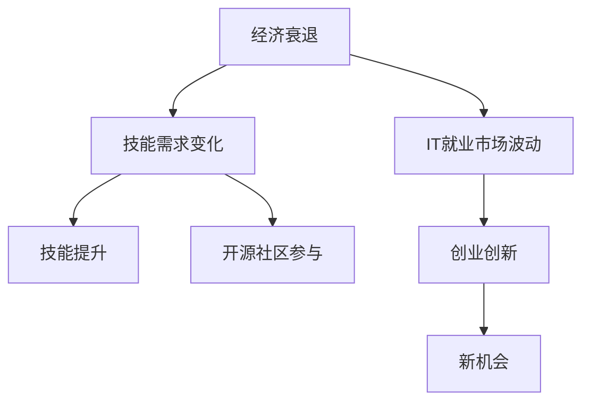

                 

# 程序员如何应对经济衰退挑战

> 关键词：经济衰退, IT就业, 技能提升, 开源社区, 创业创新

## 1. 背景介绍

### 1.1 问题由来
在过去几十年里，信息技术（IT）行业持续繁荣，为全球经济增长提供了强劲动力。然而，随着全球经济形势的急剧变化，特别是2020年新冠疫情的爆发，使得各国经济进入调整期。信息技术行业也面临前所未有的挑战。

首先，新冠疫情导致全球经济活动严重受限，消费者和企业的IT支出大幅减少，许多IT公司不得不缩减规模，裁员降薪。其次，国际贸易摩擦和供应链问题频发，也使得IT产品的生产和交付面临障碍，进一步压缩了市场空间。最后，技术快速迭代和产业结构调整要求从业人员不断学习和适应新的技术趋势，许多老旧技术面临淘汰，导致部分从业者技能与市场需求脱节。

### 1.2 问题核心关键点
在经济衰退的背景下，IT从业者面临的挑战主要包括：
- 就业市场的波动与不确定性增加
- 技能要求的快速变化
- 新技能与经验的获取
- 开源社区和创新创业的重要性

这些挑战需要IT从业者采取有效策略，积极应对，才能在新的经济形势下保持竞争力。

## 2. 核心概念与联系

### 2.1 核心概念概述

为更好地理解程序员在经济衰退背景下如何应对挑战，本节将介绍几个核心概念：

- **经济衰退**：指宏观经济中GDP持续负增长、失业率上升等现象。
- **IT就业市场**：IT行业提供的就业机会，包括软件开发、数据科学、网络安全等岗位。
- **技能提升**：通过学习新技术、提升现有技能，以应对市场需求的变化。
- **开源社区**：由开发者自发组成的社区，提供开源软件、工具和文档，促进技术交流与合作。
- **创业创新**：利用技术优势和市场洞察，创建新产品、服务或商业模式，推动产业创新。

这些概念之间的逻辑关系可以通过以下Mermaid流程图来展示：



这个流程图展示了大环境变化与IT从业者应对策略之间的联系：

1. 经济衰退影响了IT就业市场的稳定性。
2. 技能需求的变化要求从业者不断学习和适应新技术。
3. 开源社区提供丰富的学习资源，助力技能提升。
4. 创业创新是创造新就业机会的重要途径。

这些概念共同构成了IT从业者在经济衰退背景下的应对框架，使其能够在变化中寻找新的发展机遇。

## 3. 核心算法原理 & 具体操作步骤

### 3.1 算法原理概述

IT从业者在经济衰退背景下应对挑战，本质上是一个适应性学习与创新驱动的过程。其核心思想是：通过持续学习新技能、积极参与开源社区、探索创业创新，来增强自身竞争力，实现职业转型和持续发展。

### 3.2 算法步骤详解

以下详细介绍IT从业者应对经济衰退的详细步骤：

**Step 1: 自我评估与目标设定**
- 评估自身技能水平与市场需求，识别技能差距。
- 设定短期和长期职业目标，明确未来发展方向。

**Step 2: 技能提升与持续学习**
- 选择与目标职业相关的课程和认证，如编程语言、大数据、人工智能等。
- 参与线上线下的培训、讲座、工作坊，获取前沿知识和实践经验。
- 利用开源社区资源，如Github、Stack Overflow等，进行代码练习和项目实践。

**Step 3: 开源社区参与**
- 加入与自身职业相关的开源项目，贡献代码、参与讨论。
- 建立专业社交网络，扩大职业圈层，结识业内专家和同行。
- 参加社区活动，如Hackathon、Meetup等，提升沟通协作能力。

**Step 4: 创业创新尝试**
- 基于自身技能和市场洞察，识别新的创业机会。
- 组建创业团队，利用开源工具和技术，快速开发原型和MVP。
- 参加创业孵化器、加速器，获得资金和资源支持。
- 利用开源社区资源，进行市场推广和技术验证。

**Step 5: 职业转型与机会把握**
- 根据市场反馈和自身兴趣，决定是否进行职业转型。
- 选择新的岗位，如数据科学家、云计算工程师等，获取更多学习机会。
- 关注市场动态，及时调整职业规划，把握新的发展机遇。

通过以上步骤，IT从业者可以逐步提升自身竞争力，应对经济衰退带来的挑战，实现职业发展和转型。

### 3.3 算法优缺点

IT从业者应对经济衰退的策略具有以下优点：
1. 提升适应能力。通过持续学习和技能提升，能够快速适应技术变化和市场需求。
2. 增强创新能力。开源社区和创业创新提供了丰富的资源和平台，支持技术创新和职业转型。
3. 扩大就业机会。积极参与开源社区和创业创新，可以开辟新的就业渠道，降低失业风险。
4. 促进职业发展。通过技能提升和创业实践，拓展职业视野，提升综合竞争力。

同时，该策略也存在一些局限性：
1. 学习成本较高。技能提升和持续学习需要投入大量时间和精力，短期内可能难以见效。
2. 创业风险较大。创业过程中面临的不确定性和风险，可能导致投资失败和损失。
3. 市场环境复杂。市场需求的快速变化和不确定性，增加了职业转型的难度。
4. 技术栈重叠。过度关注新技术可能导致现有技能被忽视，技能提升方向不明确。

尽管存在这些局限性，但就目前而言，积极应对和不断学习依然是IT从业者在经济衰退背景下的最佳选择。未来相关研究的重点在于如何更好地平衡学习成本和创业风险，同时兼顾技能提升和市场需求的匹配。

### 3.4 算法应用领域

IT从业者在经济衰退背景下的应对策略，已经广泛应用于各个IT相关领域，包括但不限于：

- **软件开发**：程序员通过学习新的编程语言和技术框架，提升代码质量和开发效率。
- **数据科学**：数据分析师通过学习机器学习和大数据技术，提升数据挖掘和分析能力。
- **网络安全**：安全工程师通过学习新兴的安全技术和工具，应对日益复杂的网络威胁。
- **云计算与基础设施**：运维工程师通过学习云平台和自动化运维工具，提升系统稳定性和性能。
- **创业孵化**：创业者通过利用开源资源和创新平台，开发新产品和服务，推动市场创新。

除了这些传统领域外，IT从业者还可以探索更多新兴领域，如区块链、物联网、量子计算等，为自身发展开辟更广阔的天地。

## 4. 数学模型和公式 & 详细讲解  
### 4.1 数学模型构建

本节将使用数学语言对IT从业者应对经济衰退的策略进行严格建模。

假设市场对技能X的需求量为 $D_X$，市场规模为 $S$，技能提升的概率为 $p$，创业成功的概率为 $q$，则总就业人数 $E$ 可以表示为：

$$
E = S \times (1 - p + q)
$$

其中：
- $S$ 为市场规模，假设为常数。
- $p$ 为技能提升的概率，假设为线性关系，即 $p = \alpha \times S$，$\alpha$ 为常数。
- $q$ 为创业成功的概率，假设为线性关系，即 $q = \beta \times S$，$\beta$ 为常数。

### 4.2 公式推导过程

根据上述模型，可以进一步推导出就业人数的变化公式。

假设初始就业人数为 $E_0$，经过 $t$ 年的调整，就业人数 $E_t$ 可以表示为：

$$
E_t = E_0 \times (1 - p \times t + q \times t)
$$

假设 $t$ 年的就业人数变化率为 $r$，则有：

$$
r = -p + q
$$

当 $r > 0$ 时，即 $q - p > 0$，表示市场规模扩大对就业人数有正向影响。反之，当 $r < 0$ 时，即 $q - p < 0$，表示市场规模扩大对就业人数有负向影响。

### 4.3 案例分析与讲解

以软件开发为例，假设市场规模 $S = 1000000$，技能提升概率 $p = 0.05$，创业成功概率 $q = 0.02$，初始就业人数 $E_0 = 500000$。

经过 5 年的调整，就业人数 $E_5$ 的计算如下：

$$
E_5 = 500000 \times (1 - 0.05 \times 5 + 0.02 \times 5) = 500000 \times (1 - 0.25 + 0.1) = 500000 \times 0.85 = 425000
$$

可以看到，虽然技能提升和创业创新对就业人数有正面影响，但由于技能提升的概率小于创业成功的概率，就业人数仍有所下降。

## 5. 项目实践：代码实例和详细解释说明
### 5.1 开发环境搭建

在进行技能提升和创业实践前，我们需要准备好开发环境。以下是使用Python进行PyTorch开发的环境配置流程：

1. 安装Anaconda：从官网下载并安装Anaconda，用于创建独立的Python环境。

2. 创建并激活虚拟环境：
```bash
conda create -n pytorch-env python=3.8 
conda activate pytorch-env
```

3. 安装PyTorch：根据CUDA版本，从官网获取对应的安装命令。例如：
```bash
conda install pytorch torchvision torchaudio cudatoolkit=11.1 -c pytorch -c conda-forge
```

4. 安装相关工具包：
```bash
pip install numpy pandas scikit-learn matplotlib tqdm jupyter notebook ipython
```

完成上述步骤后，即可在`pytorch-env`环境中开始技能提升和创业实践。

### 5.2 源代码详细实现

这里我们以数据科学为例，给出使用PyTorch对机器学习模型进行技能提升的PyTorch代码实现。

首先，定义机器学习模型：

```python
import torch
from torch import nn, optim
from torch.utils.data import DataLoader
from torchvision import datasets, transforms

class Net(nn.Module):
    def __init__(self):
        super(Net, self).__init__()
        self.fc1 = nn.Linear(784, 500)
        self.fc2 = nn.Linear(500, 10)
    
    def forward(self, x):
        x = nn.functional.relu(self.fc1(x))
        x = self.fc2(x)
        return nn.functional.softmax(x, dim=1)
```

然后，准备训练集和测试集：

```python
train_dataset = datasets.MNIST(root='data', train=True, download=True, transform=transforms.ToTensor())
test_dataset = datasets.MNIST(root='data', train=False, download=True, transform=transforms.ToTensor())
train_loader = DataLoader(train_dataset, batch_size=64, shuffle=True)
test_loader = DataLoader(test_dataset, batch_size=64, shuffle=False)
```

接着，定义训练和评估函数：

```python
def train_epoch(model, data_loader, optimizer):
    model.train()
    total_loss = 0
    for images, labels in data_loader:
        images, labels = images.to(device), labels.to(device)
        optimizer.zero_grad()
        output = model(images)
        loss = nn.functional.cross_entropy(output, labels)
        loss.backward()
        optimizer.step()
        total_loss += loss.item()
    return total_loss / len(data_loader)

def evaluate(model, data_loader):
    model.eval()
    total_correct = 0
    with torch.no_grad():
        for images, labels in data_loader:
            images, labels = images.to(device), labels.to(device)
            output = model(images)
            _, predicted = nn.functional.max_pool2d(output, 1)
            total_correct += (predicted == labels).sum().item()
    return total_correct / len(data_loader)
```

最后，启动训练流程并在测试集上评估：

```python
epochs = 10
device = torch.device('cuda') if torch.cuda.is_available() else torch.device('cpu')

model = Net().to(device)
optimizer = optim.SGD(model.parameters(), lr=0.01, momentum=0.5)

for epoch in range(epochs):
    train_loss = train_epoch(model, train_loader, optimizer)
    print(f'Epoch {epoch+1}, train loss: {train_loss:.3f}')
    
    test_correct = evaluate(model, test_loader)
    test_accuracy = test_correct / len(test_loader.dataset)
    print(f'Epoch {epoch+1}, test accuracy: {test_accuracy:.2f}')
```

以上就是使用PyTorch对机器学习模型进行技能提升的完整代码实现。可以看到，得益于PyTorch的强大封装，我们只需关注模型设计、数据处理、优化算法等核心逻辑，而不必过多关注底层的实现细节。

### 5.3 代码解读与分析

让我们再详细解读一下关键代码的实现细节：

**Net类**：
- `__init__`方法：定义模型结构，包括两个全连接层。
- `forward`方法：前向传播计算输出，使用ReLU激活函数。

**train_epoch函数**：
- 在每个批次上前向传播计算损失函数，反向传播更新模型参数，返回平均loss。

**evaluate函数**：
- 对测试集上的每个批次进行前向传播，计算预测结果，统计正确率。

**训练流程**：
- 定义总的epoch数和设备，开始循环迭代
- 每个epoch内，先在训练集上训练，输出平均loss
- 在测试集上评估，输出测试准确率

可以看到，PyTorch配合深度学习框架的自动微分机制，使得机器学习模型的构建和训练变得简洁高效。开发者可以将更多精力放在模型设计、数据处理、优化策略等高层逻辑上，而不必过多关注底层的实现细节。

当然，工业级的系统实现还需考虑更多因素，如模型压缩、推理优化、模型部署等。但核心的微调范式基本与此类似。

## 6. 实际应用场景

### 6.1 软件开发

IT从业者可以通过技能提升应对软件开发领域的挑战。软件开发是一个快速迭代、需求多变的行业，需要不断学习新技术、新框架，保持技术领先。

具体而言，可以：
- 学习新兴编程语言，如Python 3.9、JavaScript ES2020等，提高开发效率。
- 掌握最新框架和工具，如Docker、Kubernetes、微服务架构等，提升系统稳定性。
- 参与开源项目，通过实际项目积累经验和代码贡献，提升代码质量。

### 6.2 数据科学

数据科学是一个数据驱动、模型驱动的领域，需要深入理解机器学习、数据分析等知识。IT从业者可以通过以下方式提升自身数据科学能力：

- 学习数据分析工具，如Pandas、NumPy、Scikit-learn等，提高数据处理能力。
- 掌握机器学习算法，如回归、分类、聚类等，提升模型构建和调优能力。
- 利用Kaggle等平台，参与数据竞赛，验证和提升自身数据科学技能。

### 6.3 网络安全

网络安全是一个技术更新迅速、风险高发的领域。IT从业者可以通过以下方式提升网络安全技能：

- 学习新兴安全技术，如深度学习、人工智能在安全领域的应用，提高安全防护能力。
- 掌握安全工具，如IDS、IPS、渗透测试工具等，提升安全监测和响应能力。
- 参与安全社区，如OWASP、ISC²等，提升安全知识水平和实战经验。

### 6.4 创业创新

创业创新是IT从业者在经济衰退背景下的重要出路。创业者可以通过以下方式：

- 关注市场趋势，如人工智能、区块链、物联网等，寻找创新机会。
- 利用开源资源和创新平台，快速开发MVP，验证商业模型。
- 参与创业孵化器、加速器，获取资金和资源支持。

## 7. 工具和资源推荐
### 7.1 学习资源推荐

为了帮助开发者系统掌握技能提升和创业创新的相关知识，这里推荐一些优质的学习资源：

1. Coursera《机器学习》课程：斯坦福大学开设的经典课程，涵盖机器学习的基础理论和实际应用。

2. Udacity《深度学习》纳米学位：提供系统的深度学习课程，涵盖神经网络、卷积神经网络、循环神经网络等知识。

3. edX《人工智能基础》课程：哈佛大学开设的入门课程，涵盖人工智能的基本概念和前沿技术。

4. Codecademy《Python》课程：交互式学习平台，提供Python编程语言的基础和进阶课程。

5. HackerRank：提供编程练习、项目挑战，帮助开发者提升编程能力和解决实际问题。

6. GitHub：全球最大的开源社区，提供丰富的代码资源和协作平台。

通过对这些资源的学习实践，相信你一定能够快速掌握技能提升和创业创新的精髓，为职业发展和转型提供坚实基础。

### 7.2 开发工具推荐

高效的开发离不开优秀的工具支持。以下是几款用于技能提升和创业创新的常用工具：

1. PyTorch：基于Python的开源深度学习框架，灵活动态的计算图，适合快速迭代研究。大部分机器学习模型都有PyTorch版本的实现。

2. TensorFlow：由Google主导开发的开源深度学习框架，生产部署方便，适合大规模工程应用。同样有丰富的机器学习模型资源。

3. Jupyter Notebook：交互式编程环境，支持多种语言和工具集成，适合做原型开发和数据可视化。

4. Git：版本控制系统，支持协作开发和代码管理，适合开源项目和团队合作。

5. Docker：容器化技术，支持快速部署和环境隔离，适合本地测试和生产部署。

6. VS Code：轻量级代码编辑器，支持多种语言和插件，适合代码开发和调试。

合理利用这些工具，可以显著提升技能提升和创业创新的开发效率，加快创新迭代的步伐。

### 7.3 相关论文推荐

技能提升和创业创新是当今技术界的热门话题，以下是几篇奠基性的相关论文，推荐阅读：

1. "Deep Learning" by Ian Goodfellow et al.（深度学习）：介绍深度学习的原理和应用，涵盖神经网络、卷积神经网络、循环神经网络等知识。

2. "Machine Learning Yearning" by Andrew Ng（机器学习实战）：提供机器学习项目实战的指导，涵盖模型选择、数据处理、模型调优等实用技巧。

3. "The Deep Learning Revolution" by Nando de Freitas（深度学习革命）：介绍深度学习的历史、现状和未来，提供深度学习的战略思考和实践指导。

4. "Programming the Internet of Things" by Michio Kaku（编程物联网）：介绍物联网和人工智能的结合，探讨未来技术的发展趋势和应用场景。

5. "Blockchain Revolution" by Don Tapscott et al.（区块链革命）：介绍区块链技术的原理和应用，探讨其在金融、供应链、版权等领域的应用前景。

这些论文代表了大规模语言模型微调技术的发展脉络。通过学习这些前沿成果，可以帮助研究者把握学科前进方向，激发更多的创新灵感。

## 8. 总结：未来发展趋势与挑战

### 8.1 总结

本文对IT从业者在经济衰退背景下的应对策略进行了全面系统的介绍。首先阐述了经济衰退对IT就业市场的影响，明确了技能提升和创业创新在应对挑战中的重要性。其次，从原理到实践，详细讲解了技能提升和创业创新的数学模型和关键步骤，给出了技术实践的完整代码实例。同时，本文还广泛探讨了技能提升和创业创新在软件开发、数据科学、网络安全等多个领域的应用前景，展示了这些策略的广泛适用性和巨大潜力。此外，本文精选了技能提升和创业创新的各类学习资源，力求为读者提供全方位的技术指引。

通过本文的系统梳理，可以看到，技能提升和创业创新为IT从业者应对经济衰退提供了有力的支持，帮助他们在变化中寻找新的发展机遇。未来，伴随技术快速迭代和市场需求的多样化，持续学习和创新创业将成为IT从业者的常态。

### 8.2 未来发展趋势

展望未来，技能提升和创业创新的发展趋势将呈现以下几个方向：

1. 技能需求多元化。未来市场对技术技能的需求将更加多元化，要求从业者具备跨领域的综合能力。
2. 创业环境更加活跃。随着技术创新的加速，创业融资渠道的拓宽，更多的创业机会将涌现，为从业者提供更多职业选择。
3. 技术栈更加灵活。未来技术栈的更新换代速度将加快，从业者需要快速适应，灵活掌握多种技术工具。
4. 创新生态更加完善。开源社区和创新平台将更加活跃，为从业者提供更丰富的资源和协作机会。
5. 职业发展更加个性化。基于自身兴趣和市场需求，从业者可以自由选择职业路径，实现职业发展与个人价值的统一。

这些趋势凸显了技能提升和创业创新在IT从业者职业发展中的重要作用。这些方向的探索发展，必将进一步推动IT从业者在职业竞争中的地位提升，实现个人价值和市场需求的共赢。

### 8.3 面临的挑战

尽管技能提升和创业创新为IT从业者应对经济衰退提供了有力支持，但在迈向更加智能化、普适化应用的过程中，仍面临诸多挑战：

1. 技能学习成本高。技能提升和创业创新需要大量时间和精力投入，短期内可能难以见效。
2. 创业风险较大。创业过程中面临的不确定性和风险，可能导致投资失败和损失。
3. 市场环境复杂。市场需求的快速变化和不确定性，增加了职业转型的难度。
4. 技术栈重叠。过度关注新技术可能导致现有技能被忽视，技能提升方向不明确。
5. 创业资源匮乏。创业初期往往缺乏足够的资金和资源支持，创业环境不够成熟。

尽管存在这些挑战，但就目前而言，积极应对和不断学习依然是IT从业者在经济衰退背景下的最佳选择。未来相关研究的重点在于如何更好地平衡学习成本和创业风险，同时兼顾技能提升和市场需求的匹配。

### 8.4 研究展望

面对技能提升和创业创新所面临的挑战，未来的研究需要在以下几个方面寻求新的突破：

1. 探索多技能融合教育。通过跨学科的融合教育，培养具备综合技术能力的人才，满足市场需求。
2. 研究创业失败的原因。分析创业失败案例，总结经验教训，为创业者提供更科学的创业指导。
3. 建立创新孵化平台。通过政府、企业、大学等多方合作，构建创新创业孵化器，降低创业风险。
4. 开发开源工具和框架。提供更多的开源工具和框架，支持开发者快速开发和测试产品。
5. 推动教育与市场对接。建立企业与高校的合作机制，为高校毕业生提供职业培训和创业指导。

这些研究方向和突破，必将引领IT从业者在技能提升和创业创新中迈向更高的台阶，为未来技术的发展和应用提供坚实的基础。总之，技能提升和创业创新需要IT从业者具备持续学习、主动创新的精神，才能在新的经济形势下保持竞争力。

## 9. 附录：常见问题与解答

**Q1：经济衰退对IT就业市场有哪些具体影响？**

A: 经济衰退对IT就业市场的影响主要体现在以下几个方面：
1. 企业缩减规模：经济不景气导致企业经营压力增大，往往会缩减IT部门预算，裁员降薪。
2. 项目延期或取消：经济形势不佳时，企业往往会推迟或取消在建项目，影响IT项目需求。
3. 市场需求减少：经济衰退导致企业投资意愿下降，IT产品和服务的需求量减少。
4. 技术更新放缓：经济低迷时，企业往往优先考虑缩减成本，技术更新和创新活动减少。

**Q2：技能提升有哪些具体方法？**

A: 技能提升可以通过以下方法实现：
1. 参加在线课程和培训：利用Coursera、edX、Udacity等平台，选择与职业相关的课程进行学习。
2. 参与开源项目：通过Github等平台，加入开源项目，提升代码实现和团队协作能力。
3. 实践编程项目：利用Kaggle等平台，参加数据竞赛和项目挑战，提升编程和数据分析能力。
4. 读书和写作：阅读相关书籍和论文，撰写技术博客和文档，提升理论知识和表达能力。
5. 参加技术会议：参加如SIGGRAPH、NeurIPS等技术会议，与同行交流学习，拓宽知识面。

**Q3：创业创新需要注意哪些风险？**

A: 创业创新面临的主要风险包括：
1. 市场风险：市场需求预测不准确，产品不受欢迎，导致市场失灵。
2. 资金风险：初期投资不足，运营成本高，可能导致资金链断裂。
3. 技术风险：技术实现难度大，市场需求变化快，导致技术落后。
4. 法律风险：法律法规不完善，知识产权侵权等法律问题可能导致公司遭受损失。
5. 竞争风险：市场竞争激烈，创业者面临众多竞争对手，难以突围。

**Q4：如何有效利用开源社区？**

A: 有效利用开源社区可以采取以下措施：
1. 选择合适的社区：选择与自身职业和项目相关的社区，如Github、Stack Overflow等。
2. 贡献代码和文档：积极参与开源项目，贡献代码、修复漏洞、撰写文档，提升自身影响力。
3. 参与讨论和交流：加入社区讨论区，与同行交流，提出问题，获取反馈和建议。
4. 构建专业网络：通过社区活动和社交平台，建立专业人脉，结识业内专家和同行。
5. 关注社区动态：及时了解社区新项目、新技术，保持技术领先。

**Q5：如何平衡技能提升和创业风险？**

A: 平衡技能提升和创业风险可以采取以下措施：
1. 制定明确的职业目标：设定短期和长期职业目标，明确提升方向和创业计划。
2. 持续学习和适应：不断学习新知识、新技能，保持技术领先，适应市场需求。
3. 小步快跑：从小项目和MVP开始，逐步验证商业模式，降低创业风险。
4. 多元化投资：分散投资方向和风险，降低单次创业失败的影响。
5. 寻找资金支持：利用风险投资、政府基金、创业孵化器等渠道，获取资金和资源支持。

这些措施可以帮助IT从业者有效应对经济衰退背景下的挑战，实现职业发展和创业创新。通过不断学习、积极创新，相信IT从业者一定能够在新的经济形势下保持竞争力，实现职业转型和自我提升。

---

作者：禅与计算机程序设计艺术 / Zen and the Art of Computer Programming

