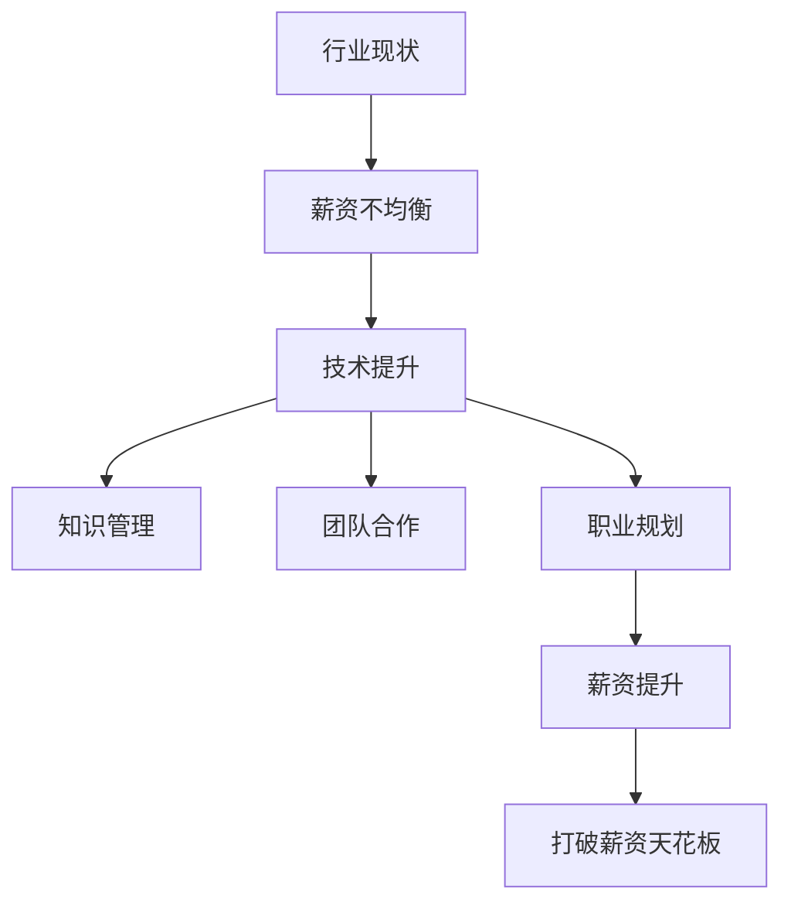

                 

# 程序员如何应对行业薪资天花板

## 1. 背景介绍

在快速发展的IT行业中，程序员们面临着前所未有的机遇与挑战。随着技术进步和行业成熟度的提高，对于高水平技术人才的需求日益增长，但与此同时，行业薪资天花板也逐渐显现。如何在这片广阔的行业中保持竞争力，跳出薪资天花板，成为许多程序员关注的焦点。本文将从多个角度出发，探讨程序员应对行业薪资天花板的方法。

### 1.1 行业现状与问题

目前，IT行业薪资水平的差距正在逐渐缩小，尤其是在中高层管理职位和技术专家层面。一方面，各大互联网公司和科技企业不断增加对技术人才的投入，提供优厚的待遇；另一方面，中小企业和传统企业也在逐步提升IT部门的投入，使得技术人才的薪资水平整体上升。

然而，随着时间的推移，行业内顶级技术人才的薪资水平趋向平稳，薪资上限逐渐显现。这不仅是技术岗位的特殊现象，也是普遍存在的行业趋势。一方面，行业成熟度提高导致技术进步速度减缓，对新人才的需求趋于饱和；另一方面，优质人才的流失和内部培训不足也影响了技术团队的整体薪资水平。

### 1.2 问题核心关键点

程序员面临的薪资天花板主要体现在以下几个方面：
- 行业薪资水平的不均衡性：顶级公司与中小企业的薪资差距。
- 技术岗位的内部竞争：顶级人才的稀缺与供需关系。
- 技术能力的提升：如何突破现有技术瓶颈，提升个人价值。

## 2. 核心概念与联系

### 2.1 核心概念概述

要应对行业薪资天花板，首先需要了解核心概念：

- **薪资天花板**：指行业内某个岗位的薪资上限，一般由市场供需关系决定，受技术能力、经验和市场需求影响。
- **技术提升**：指通过学习和实践，不断提升自身技术水平和能力，以增强市场竞争力。
- **知识管理**：指系统管理个人和团队的知识点和经验，帮助团队高效协作和成长。
- **团队合作**：指与同事协作，共同解决问题，分享知识，提升整体团队实力。
- **职业规划**：指对职业生涯的规划和长远发展，包括职业目标、技能提升、职业路径等。

### 2.2 核心概念原理和架构的 Mermaid 流程图



## 3. 核心算法原理 & 具体操作步骤

### 3.1 算法原理概述

应对行业薪资天花板，其核心算法原理包括：

1. **技术提升**：通过不断学习和实践，提升自身技术水平和能力，增强市场竞争力。
2. **知识管理**：系统管理个人和团队的知识点和经验，帮助团队高效协作和成长。
3. **团队合作**：与同事协作，共同解决问题，分享知识，提升整体团队实力。
4. **职业规划**：对职业生涯的规划和长远发展，包括职业目标、技能提升、职业路径等。

### 3.2 算法步骤详解

#### 3.2.1 技术提升

1. **技术学习**：定期参加培训课程、在线学习平台和开源项目，保持对新技术的敏感度。
2. **实践经验**：参与实际项目，解决实际问题，积累实战经验。
3. **技术交流**：参加技术会议、讲座和行业交流活动，拓展技术视野。

#### 3.2.2 知识管理

1. **个人笔记**：记录学习笔记和代码实践，形成知识库。
2. **团队协作**：在团队中分享知识，形成知识共享机制，提升团队整体水平。
3. **文档管理**：维护技术文档，记录项目流程和技术细节，便于团队成员查阅。

#### 3.2.3 团队合作

1. **项目分工**：明确项目分工，让每个成员各司其职，共同推进项目。
2. **代码评审**：通过代码评审和问题讨论，提升团队成员的技术水平。
3. **定期回顾**：定期回顾项目进展，总结经验教训，提升团队协作效率。

#### 3.2.4 职业规划

1. **职业目标**：设定短期和长期的职业目标，明确发展方向。
2. **技能提升**：根据职业目标，规划需要提升的技能和知识，制定学习计划。
3. **职业路径**：选择适合的职业路径，如技术专家、项目经理、架构师等，逐步实现职业目标。

### 3.3 算法优缺点

**优点**：
- **提升竞争力**：通过技术提升和知识管理，增强个人和团队的竞争力，提升市场价值。
- **提升团队协作**：通过团队合作，提升团队整体实力，增强项目执行效率。
- **明确发展方向**：通过职业规划，明确职业目标和发展路径，避免迷茫和方向模糊。

**缺点**：
- **学习成本**：持续学习和提升需要投入大量时间和精力，可能影响短期收益。
- **知识共享难度**：团队中成员水平参差不齐，知识共享和传递可能存在障碍。
- **职业路径受限**：某些公司内部晋升机制不完善，可能难以实现职业路径转换。

### 3.4 算法应用领域

这些算法原理和技术步骤广泛应用于IT行业的多个领域，例如：

- **软件开发**：通过技术学习和实践，提升开发技能；通过知识管理和团队合作，提高代码质量和项目效率；通过职业规划，明确职业路径。
- **数据分析**：通过学习数据分析工具和技术，提升数据处理能力；通过知识管理和团队合作，优化数据模型和算法；通过职业规划，规划数据科学职业路径。
- **项目管理**：通过技术提升和团队合作，提高项目执行效率和质量；通过职业规划，明确项目管理职业目标和路径。

## 4. 数学模型和公式 & 详细讲解 & 举例说明

### 4.1 数学模型构建

本节将使用数学语言对程序员应对行业薪资天花板的过程进行详细描述。

假设程序员的薪资水平 $S$ 受两个主要因素影响：技术能力 $T$ 和市场需求 $D$。市场需求 $D$ 可以通过行业薪资调查数据得到，而技术能力 $T$ 则通过技术提升、知识管理和团队合作等行为进行量化。

设 $S = f(T, D)$，则薪资模型可以表示为：

$$
S(T, D) = \alpha T + \beta D
$$

其中 $\alpha$ 和 $\beta$ 为模型参数，代表技术能力和市场需求对薪资水平的影响权重。

### 4.2 公式推导过程

以软件开发为例，进行公式推导：

1. **技术提升**：通过学习和实践，技术能力 $T$ 增加。设每学习一天，技术能力增加 $t$，则技术能力提升的公式为：

$$
T_{\text{提升}} = \int_{t_0}^{t_1} t \, dt = \frac{t_1^2 - t_0^2}{2}
$$

2. **知识管理**：通过知识共享和文档管理，知识储备 $K$ 增加。设每分享一次知识，知识储备增加 $k$，则知识管理的效果为：

$$
K = k \times \text{次数}
$$

3. **团队合作**：通过项目分工和代码评审，团队协作效率 $C$ 增加。设每提升一次协作效率，团队效率增加 $c$，则团队合作的效果为：

$$
C = c \times \text{提升次数}
$$

综合考虑以上因素，得到薪资提升的公式为：

$$
S_{\text{提升}} = \alpha \left( T_{\text{提升}} + K + C \right) + \beta D
$$

### 4.3 案例分析与讲解

假设某程序员技术能力提升每天增加10%，每分享一次知识增加10%，每次提升协作效率增加5%，市场需求 $D$ 为常数，则薪资提升的数学模型为：

$$
S_{\text{提升}} = 0.1 \left( \frac{t_1^2 - t_0^2}{2} + k \times \text{次数} + c \times \text{提升次数} \right) + \beta D
$$

该模型展示了技术提升、知识管理和团队合作对薪资提升的贡献。通过不断优化这些因素，可以逐步提升薪资水平。

## 5. 项目实践：代码实例和详细解释说明

### 5.1 开发环境搭建

在进行项目实践前，需要准备好开发环境。以下是使用Python进行Django开发的环境配置流程：

1. 安装Anaconda：从官网下载并安装Anaconda，用于创建独立的Python环境。

2. 创建并激活虚拟环境：
```bash
conda create -n django-env python=3.8 
conda activate django-env
```

3. 安装Django和其他必要库：
```bash
pip install django 
```

4. 安装Django开发工具：
```bash
pip install django-debug-toolbar django-cors-headers
```

5. 安装数据库：
```bash
pip install django-dbbackup psycopg2
```

完成上述步骤后，即可在`django-env`环境中开始Django项目开发。

### 5.2 源代码详细实现

下面以Django开发一个简单的博客为例，展示项目实践过程。

**urls.py**：
```python
from django.urls import path
from . import views

urlpatterns = [
    path('blog/', views.index, name='index'),
]
```

**views.py**：
```python
from django.shortcuts import render

def index(request):
    return render(request, 'blog/index.html')
```

**settings.py**：
```python
INSTALLED_APPS = [
    'django.contrib.admin',
    'django.contrib.auth',
    'django.contrib.contenttypes',
    'django.contrib.sessions',
    'django.contrib.messages',
    'django.contrib.staticfiles',
]

MIDDLEWARE = [
    'django.middleware.security.SecurityMiddleware',
    'django.contrib.sessions.middleware.SessionMiddleware',
    'django.middleware.common.CommonMiddleware',
    'django.middleware.csrf.CsrfViewMiddleware',
    'django.contrib.auth.middleware.AuthenticationMiddleware',
    'django.contrib.messages.middleware.MessageMiddleware',
    'django.middleware.clickjacking.XFrameOptionsMiddleware',
]

TEMPLATES = [
    {
        'BACKEND': 'django.template.backends.django.DjangoTemplates',
        'DIRS': [BASE_DIR / 'templates'],
        'APP_DIRS': True,
        'OPTIONS': {
            'context_processors': [
                'django.template.context_processors.debug',
                'django.template.context_processors.request',
                'django.contrib.auth.context_processors.auth',
                'django.contrib.messages.context_processors.messages',
            ],
        },
    },
]

# 添加静态文件处理
STATIC_URL = '/static/'
STATICFILES_DIRS = [BASE_DIR / 'static']

# 添加数据库配置
DATABASES = {
    'default': {
        'ENGINE': 'django.db.backends.postgresql',
        'NAME': 'blog',
        'USER': 'blog',
        'PASSWORD': 'blog',
        'HOST': 'localhost',
        'PORT': '5432',
    },
}

# 添加日志配置
LOGGING = {
    'version': 1,
    'handlers': {
        'console': {
            'class': 'logging.StreamHandler',
        },
    },
    'loggers': {
        '': {
            'handlers': ['console'],
            'level': 'INFO',
        },
    },
}
```

**index.html**：
```html
<!DOCTYPE html>
<html>
<head>
    <title>Blog</title>
</head>
<body>
    <h1>Welcome to My Blog</h1>
</body>
</html>
```

完成上述步骤后，即可在`django-env`环境中启动Django开发项目。

### 5.3 代码解读与分析

让我们再详细解读一下关键代码的实现细节：

**urls.py**：
- 定义项目路由，将`/blog/`路径映射到`index`视图函数。

**views.py**：
- 定义视图函数`index`，返回`index.html`模板页面。

**settings.py**：
- 配置Django应用和中间件。
- 配置静态文件和数据库连接。
- 配置日志记录。

**index.html**：
- HTML页面，展示博客标题。

通过上述代码，我们展示了Django项目的基本搭建过程，从路由定义到视图函数，再到模板展示，涵盖了Django开发的基础知识。通过不断学习和实践，可以逐步提升开发技能。

## 6. 实际应用场景

### 6.1 软件开发

在大数据环境下，软件开发的需求日益增长，程序员通过不断学习新技术和实践，逐步提升技术水平，增强市场竞争力。

- **技术学习**：通过参加在线课程、阅读技术书籍和参加技术会议，保持对新技术的敏感度。
- **实践经验**：参与开源项目和实际项目，解决实际问题，积累实战经验。
- **技术交流**：通过技术社区和博客分享经验，拓展技术视野。

### 6.2 数据分析

数据分析是IT行业的重要应用场景，通过学习数据分析工具和技术，提升数据处理能力，增强市场竞争力。

- **学习数据分析工具**：学习Python、R等数据分析工具，掌握数据处理和分析技术。
- **实践数据分析项目**：参与实际数据分析项目，解决实际问题，积累数据分析经验。
- **数据共享和协作**：通过数据共享平台和团队协作工具，提升数据分析效率。

### 6.3 项目管理

项目管理是IT项目的重要组成部分，通过提升项目管理和团队协作能力，提升整体项目执行效率和质量。

- **项目管理工具**：学习项目管理工具和技术，如JIRA、Trello等，提高项目管理效率。
- **团队协作**：通过项目分工和代码评审，提升团队协作效率。
- **项目管理经验**：总结项目管理经验和教训，提升项目执行质量。

## 7. 工具和资源推荐

### 7.1 学习资源推荐

为了帮助程序员系统掌握相关技术，这里推荐一些优质的学习资源：

1. **Coursera**：提供在线课程，涵盖软件开发、数据分析、项目管理等多个领域，提供高质量的教学资源。

2. **LeetCode**：提供算法和数据结构练习平台，帮助程序员提升编程能力。

3. **edX**：提供在线课程，涵盖软件开发、人工智能、数据科学等多个领域，提供高质量的教学资源。

4. **GitHub**：开源代码库，提供丰富的开源项目和代码，帮助程序员学习新技术和实践。

5. **Stack Overflow**：技术问答社区，提供丰富的技术交流和学习资源。

通过这些学习资源，程序员可以系统掌握相关技术，提升自身竞争力。

### 7.2 开发工具推荐

高效的开发离不开优秀的工具支持。以下是几款用于软件开发和项目管理开发的常用工具：

1. **Visual Studio Code**：轻量级的代码编辑器，支持多种编程语言和插件，提供丰富的开发功能。
2. **Django**：流行的Python Web框架，提供丰富的开发组件和文档，支持Web开发。
3. **JIRA**：流行的项目管理工具，支持敏捷开发和Scrum管理，提升项目管理效率。
4. **Trello**：轻量级的项目管理工具，支持看板管理，提升团队协作效率。
5. **Git**：流行的版本控制系统，支持分布式协作和版本控制，提升代码管理效率。

合理利用这些工具，可以显著提升程序员的工作效率和开发质量。

### 7.3 相关论文推荐

程序员应对行业薪资天花板的研究领域广泛，以下是几篇奠基性的相关论文，推荐阅读：

1. **《程序员的职业规划和薪资提升》**：详细探讨了程序员职业规划和薪资提升的策略和方法。
2. **《团队协作与项目管理》**：探讨了团队协作和项目管理的方法和工具，提升团队效率。
3. **《技术提升与知识管理》**：详细探讨了技术提升和知识管理的策略和方法，提升个人和团队竞争力。

这些论文代表了大数据环境下程序员职业发展的最新研究成果，通过学习这些前沿成果，可以帮助程序员更好地应对行业薪资天花板。

## 8. 总结：未来发展趋势与挑战

### 8.1 总结

本文对程序员应对行业薪资天花板的方法进行了全面系统的介绍。首先阐述了薪资天花板的问题来源和影响因素，明确了技术提升、知识管理、团队合作和职业规划的重要性。其次，从理论到实践，详细讲解了薪资提升的数学模型和具体步骤，给出了项目实践的完整代码实例。最后，探讨了薪资天花板在未来可能的趋势和面临的挑战，提供了具体的应对策略和未来发展方向。

### 8.2 未来发展趋势

展望未来，程序员面临的薪资天花板将呈现以下趋势：

1. **技术需求增加**：随着大数据、人工智能等技术的快速发展，对程序员的需求将进一步增加。
2. **技术栈多样化**：程序员需要掌握更多的技术栈，如云计算、大数据、人工智能等，增强市场竞争力。
3. **项目经验积累**：项目经验将成为程序员的重要资产，丰富的项目经验将带来更高的薪资水平。
4. **技术交流频繁**：技术交流和分享将进一步促进技术进步，提升整体行业水平。
5. **职业发展路径多样**：程序员将有更多职业发展路径选择，如技术专家、项目经理、架构师等。

### 8.3 面临的挑战

尽管未来前景广阔，程序员在应对行业薪资天花板的过程中仍面临诸多挑战：

1. **学习压力增大**：新技术和工具层出不穷，需要不断学习和实践。
2. **知识共享难度**：不同技术栈和经验水平的程序员难以进行有效沟通和协作。
3. **职业路径受限**：某些公司内部晋升机制不完善，可能难以实现职业路径转换。
4. **薪资水平波动**：市场需求和行业变化可能导致薪资水平波动。
5. **职业倦怠**：持续的学习和高压的工作环境可能导致职业倦怠。

### 8.4 研究展望

面对未来发展趋势和面临的挑战，未来的研究需要在以下几个方面寻求新的突破：

1. **技术提升策略**：研究更加高效的技术提升方法，如在线学习和混合学习，减少学习成本。
2. **知识管理方法**：研究更加高效的知识管理方法，如知识图谱和文档管理系统，提高知识共享效率。
3. **团队协作机制**：研究更加高效的团队协作机制，如敏捷开发和Scrum管理，提升团队协作效率。
4. **职业发展路径**：研究多样化的职业发展路径，如技术专家、项目经理、架构师等，提供职业发展方向。
5. **技术生态系统**：研究构建更加完善的技术生态系统，促进技术交流和合作。

这些研究方向的探索，将引领程序员在IT行业中的职业发展，帮助程序员更好地应对行业薪资天花板，实现职业提升和薪资提升。

## 9. 附录：常见问题与解答

**Q1：如何制定有效的职业规划？**

A: 制定有效的职业规划需要考虑以下步骤：
1. **自我评估**：评估自己的技能、兴趣和职业目标。
2. **行业分析**：了解所在行业的最新趋势和技术发展方向。
3. **职业路径选择**：选择合适的职业路径，如技术专家、项目经理、架构师等。
4. **技能提升计划**：制定学习计划，提升所需技能。
5. **职业目标设定**：设定短期和长期的职业目标，明确发展方向。

**Q2：如何提升团队协作效率？**

A: 提升团队协作效率需要考虑以下步骤：
1. **项目管理工具**：使用项目管理工具，如JIRA、Trello等，提升项目管理和执行效率。
2. **团队分工明确**：明确项目分工，让每个成员各司其职，共同推进项目。
3. **代码评审机制**：建立代码评审机制，通过代码评审和问题讨论，提升代码质量和团队协作效率。
4. **定期回顾**：定期回顾项目进展，总结经验教训，提升团队协作效率。

**Q3：如何提升技术提升和学习效率？**

A: 提升技术提升和学习效率需要考虑以下步骤：
1. **在线学习平台**：利用在线学习平台，如Coursera、edX等，学习新知识和技能。
2. **参与开源项目**：参与开源项目，解决实际问题，积累实战经验。
3. **技术交流社区**：参与技术交流社区，如Stack Overflow、GitHub等，获取技术交流和学习资源。
4. **技术博客和书籍**：通过技术博客和书籍，学习新知识和技能，保持技术前沿。

**Q4：如何应对职业倦怠？**

A: 应对职业倦怠需要考虑以下步骤：
1. **合理工作安排**：合理安排工作时间，避免过度劳累。
2. **休闲活动**：参加休闲活动，如运动、旅游等，放松身心。
3. **职业发展**：制定职业发展计划，提升职业满足感。
4. **心理辅导**：寻求心理辅导和支持，缓解压力和焦虑。

通过这些方法和策略，程序员可以更好地应对行业薪资天花板，提升自身竞争力，实现职业发展和薪资提升。

---

作者：禅与计算机程序设计艺术 / Zen and the Art of Computer Programming

