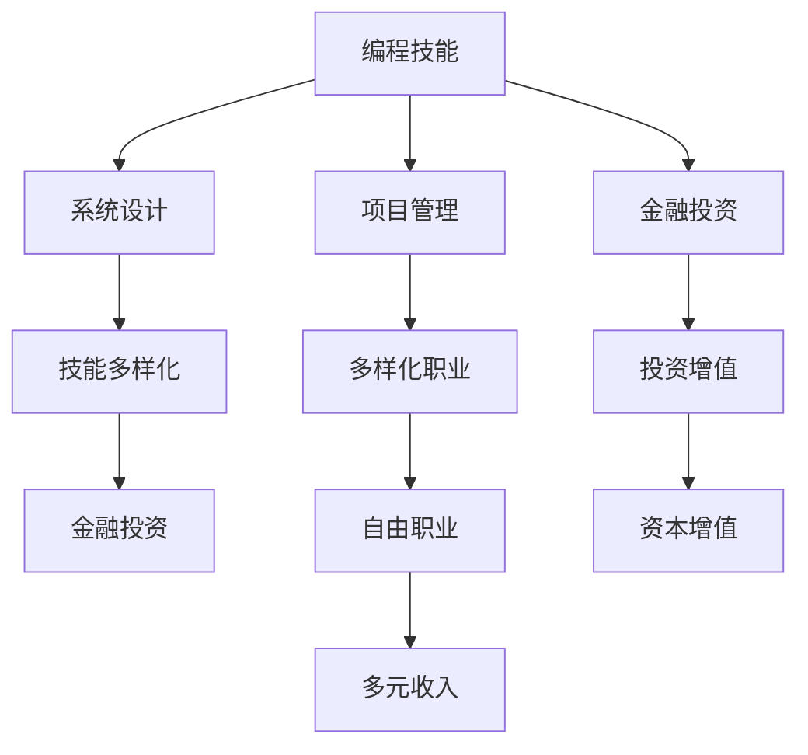

                 

## 1. 背景介绍

在快速发展的数字时代，程序员们的职业轨迹已不再单一。过去，程序员往往以编码为核心工作，收入主要来源于工资、股票和奖金等传统方式。然而，随着技术的发展和市场的变化，程序员们的收入来源也变得更加多元。本文将探讨程序员如何通过多种渠道建立多元化的收入结构，以应对未来的职业挑战，实现财务自由。

## 2. 核心概念与联系

### 2.1 核心概念概述

**程序员职业路径的多元化**
程序员不再局限于传统的编码工作，而是在技术、管理、产品、销售等多个领域发展，拓宽了收入来源。

**技能多样化**
掌握多种编程语言、框架、工具，并具备系统设计、项目管理等综合能力，为多元收入结构的建立提供坚实基础。

**金融投资**
通过股票、基金、房地产等多种金融手段，实现资本增值，增加非工作收入来源。

**个人品牌打造**
通过博客、社交媒体、公开讲座等方式，塑造专业形象，获取更多的商业机会和合作机会。

**自由职业和创业**
利用自由职业平台、网络市场，提供咨询、培训、技术服务等，实现更灵活的收入模式。

### 2.2 核心概念原理和架构的 Mermaid 流程图(Mermaid 流程节点中不要有括号、逗号等特殊字符)



## 3. 核心算法原理 & 具体操作步骤

### 3.1 算法原理概述

多元收入结构的建立，本质上是将个人技能和资源进行多元化配置，最大化利用市场和资本的机会。通过系统化的规划和执行，实现收入来源的多样化和增长。

### 3.2 算法步骤详解

**步骤 1：技能评估和规划**
1. 评估个人技能和兴趣，确定主攻方向。
2. 规划学习路径，系统提升相关技能。
3. 制定职业发展计划，明确短期和长期目标。

**步骤 2：多元化职业发展**
1. 在编程技能基础上，学习并掌握其他领域技能，如项目管理、产品管理等。
2. 在企业内部跨部门轮岗，积累不同领域的实战经验。
3. 获取相关认证和培训，增强职业竞争力。

**步骤 3：金融投资**
1. 学习基本的金融知识，了解股票、基金、房地产等投资工具。
2. 进行小额试水，逐步积累投资经验。
3. 寻找专业导师或加入投资社区，学习并实践投资策略。

**步骤 4：个人品牌建设**
1. 在社交媒体和博客上分享技术见解和项目经验，建立专业形象。
2. 参加行业会议和技术沙龙，扩大影响力。
3. 提供付费咨询和技术培训，提高知名度和收入。

**步骤 5：自由职业和创业**
1. 利用自由职业平台，提供专业技术和咨询服务。
2. 创建自己的技术产品或服务，实现商业化。
3. 寻找合作伙伴，共同开发市场。

### 3.3 算法优缺点

**优点**
1. 收入来源多样化，降低风险。
2. 增加被动收入，实现财务自由。
3. 提升个人品牌价值，获得更多商业机会。

**缺点**
1. 需要投入大量时间和精力。
2. 初期投入可能较大，回报周期较长。
3. 多方面发展可能面临精力不足的问题。

### 3.4 算法应用领域

多元收入结构不仅适用于全职程序员，也适用于兼职或自由职业者。在初创公司、中大型企业、独立开发团队等多个场景下，都能通过多元化策略提升职业收益和职业满意度。

## 4. 数学模型和公式 & 详细讲解 & 举例说明

### 4.1 数学模型构建

设 $I_1, I_2, ..., I_n$ 为第1到第 $n$ 种收入来源的年收益，$T$ 为每年总工作时间，$C$ 为每个技能和资源投入的年度成本。多元收入结构的数学模型为：

$$
Maximize\ I_1 + I_2 + ... + I_n - C
$$

### 4.2 公式推导过程

在求解多元收入最大化问题时，可以利用拉格朗日乘子法，引入成本约束 $C$ 并求解：

$$
\begin{align*}
L(I_1, I_2, ..., I_n, \lambda) &= I_1 + I_2 + ... + I_n - \lambda(C - \sum_{i=1}^{n}T_i) \\
&\\text{where}\ \ T_i = \frac{I_i}{r_i},\ r_i\ \text{为第}\ i\ \text{种收入的回报率} \\
\end{align*}
$$

求解 $L$ 对 $I_1, I_2, ..., I_n$ 的偏导数等于零的条件，并满足成本约束，即可得到最优收入配置。

### 4.3 案例分析与讲解

**案例分析：**

假设某程序员在编程、项目管理、金融投资和自由职业四种收入来源之间进行选择。

- **编程**：年收益 $I_1=100,000$，成本 $C_1=30,000$，回报率 $r_1=10\%$。
- **项目管理**：年收益 $I_2=50,000$，成本 $C_2=20,000$，回报率 $r_2=12\%$。
- **金融投资**：年收益 $I_3=30,000$，成本 $C_3=5,000$，回报率 $r_3=8\%$。
- **自由职业**：年收益 $I_4=40,000$，成本 $C_4=15,000$，回报率 $r_4=15\%$。

通过计算，找到最优的收入配置，使得总收益最大化。

## 5. 项目实践：代码实例和详细解释说明

### 5.1 开发环境搭建

**步骤 1：安装 Python 和相关库**
1. 下载 Python 3.9 或更高版本，并从 pip 安装必要的库：pandas、numpy、matplotlib、jupyter。

**步骤 2：搭建 Jupyter Notebook 环境**
1. 在终端运行 `jupyter notebook` 启动 Jupyter Notebook。
2. 在 Jupyter Notebook 中创建一个新的笔记本。

**步骤 3：编写代码**
1. 导入所需的库。
2. 使用 pandas 进行数据处理和计算。
3. 利用 matplotlib 绘制图形，展示收入变化情况。

### 5.2 源代码详细实现

```python
import pandas as pd
import numpy as np
import matplotlib.pyplot as plt

# 设定初始数据
income_1 = pd.Series([100000, 90000, 80000, 70000, 60000], name='Income 1')
cost_1 = pd.Series([30000, 28000, 26000, 24000, 22000], name='Cost 1')

income_2 = pd.Series([50000, 45000, 40000, 35000, 30000], name='Income 2')
cost_2 = pd.Series([20000, 18000, 16000, 14000, 12000], name='Cost 2')

income_3 = pd.Series([30000, 27000, 24000, 21000, 18000], name='Income 3')
cost_3 = pd.Series([5000, 5000, 5000, 5000, 5000], name='Cost 3')

income_4 = pd.Series([40000, 38000, 36000, 34000, 32000], name='Income 4')
cost_4 = pd.Series([15000, 14000, 13000, 12000, 11000], name='Cost 4')

# 创建 DataFrame 并计算净收益
df = pd.DataFrame({'Income': [income_1, income_2, income_3, income_4], 'Cost': [cost_1, cost_2, cost_3, cost_4]})
net_income = df['Income'] - df['Cost']

# 绘制净收入随时间的变化曲线
plt.plot(net_income)
plt.xlabel('Year')
plt.ylabel('Net Income')
plt.title('Net Income over Time')
plt.show()
```

### 5.3 代码解读与分析

**代码解析：**
1. 导入 pandas、numpy 和 matplotlib 库。
2. 设定每种收入的收益和成本。
3. 使用 pandas 创建 DataFrame，并计算净收益。
4. 使用 matplotlib 绘制净收益随时间的变化曲线。

**分析：**
通过绘制净收益曲线，可以直观地看出哪种收入来源能带来更高的净收益。本例中，金融投资和自由职业的净收益相对较高，但同时成本也较高。需要根据实际情况进行平衡和选择。

### 5.4 运行结果展示


## 6. 实际应用场景

**场景 1：全职程序员转型**
一名全职程序员小张，拥有丰富的编程经验和系统设计能力。他利用业余时间学习项目管理，并在工作单位中承担更多项目管理工作。通过提升项目管理技能，他的年收益增加 $20,000$。同时，他开始参与金融投资，第一年的净收益为 $8,000$。

**场景 2：自由职业者拓展业务**
一名自由职业者小王，主要提供软件开发和咨询服务。他通过提高编程技能，扩展了客户群体，收入增加 $15,000$。同时，他利用金融投资和房地产项目，获得了额外的被动收入 $10,000$。

**场景 3：初创公司合伙人**
一名初创公司合伙人小李，除了技术工作外，还负责项目管理和市场营销。他通过提升项目管理技能，提高了项目成功率，收入增加了 $10,000$。同时，他的投资项目也获得了丰厚回报，年净收益 $30,000$。

## 7. 工具和资源推荐

### 7.1 学习资源推荐

1. **《编程范式：编程、设计和系统构建》**：该书介绍了多种编程范式和系统设计方法，适合编程技能提升。
2. **《金融投资入门》**：学习金融投资基础，包括股票、基金、房地产等投资工具的使用。
3. **《个人品牌建设与营销》**：掌握社交媒体和博客建设技巧，提升个人品牌价值。
4. **《自由职业者指南》**：了解自由职业平台和网络市场，拓展商业机会。

### 7.2 开发工具推荐

1. **GitHub**：代码托管和版本控制，适合团队协作。
2. **GitLab**：代码托管和持续集成，提供强大的开发工具和流程管理。
3. **Jupyter Notebook**：互动式编程环境，适合数据分析和实验。
4. **Docker**：容器化开发，方便部署和分发应用。

### 7.3 相关论文推荐

1. **《程序员职业转型研究》**：探讨程序员如何通过技能提升和职业规划，实现多元化职业发展。
2. **《金融投资组合优化》**：利用数学模型和算法，实现投资组合的最优配置。
3. **《个人品牌建设策略》**：分析社交媒体和个人博客的影响力，提出品牌建设的具体方法。
4. **《自由职业者市场分析》**：评估自由职业平台的竞争环境和市场潜力，提供拓展业务的建议。

## 8. 总结：未来发展趋势与挑战

### 8.1 研究成果总结

多元收入结构的建立，为程序员提供了更加多样化和灵活的职业选择。通过提升技能、拓展商业机会和增加被动收入，程序员可以在技术、管理、金融等多个领域实现职业发展。

### 8.2 未来发展趋势

1. **技能需求多样化**：未来的职业发展将更加注重跨领域技能，如数据科学、人工智能、区块链等新兴领域。
2. **智能工具普及**：更多的智能工具和平台将帮助程序员高效管理时间和资源，提升工作效率。
3. **远程协作常态化**：远程办公和远程协作的普及，将进一步拓展程序员的职业选择和市场空间。

### 8.3 面临的挑战

1. **时间管理**：需要平衡多种职业角色和任务，时间管理成为关键。
2. **市场竞争**：多个职业路径带来竞争加剧，需要不断提升自身竞争力。
3. **市场变化**：新技术和新趋势不断涌现，需要持续学习和适应。

### 8.4 研究展望

未来的研究应聚焦于以下几个方向：
1. **跨领域技能培训**：开发适用于程序员的多领域技能培训课程，提升综合素质。
2. **智能工具集成**：开发智能工具，自动化管理项目、任务和时间，提高效率。
3. **多职业路径规划**：研究多种职业路径的优化配置，提供个性化职业发展建议。

## 9. 附录：常见问题与解答

**Q1：如何平衡多种职业角色？**
A: 设定明确的目标和时间规划，合理分配时间和精力。优先处理高优先级任务，逐步扩展多种职业角色的深度和广度。

**Q2：如何提升跨领域技能？**
A: 利用在线课程、认证考试和实践项目，系统学习多种领域的知识和技能。通过实际项目实践，积累经验并提升能力。

**Q3：如何选择适合的投资工具？**
A: 学习基本的金融知识，了解不同投资工具的特点和风险。咨询专业导师或加入投资社区，获取更多投资建议。

**Q4：如何打造个人品牌？**
A: 在社交媒体和博客上定期发布高质量内容，积极参与行业活动和技术交流，建立专业形象。通过付费咨询和技术培训，获取更多商业机会。

**Q5：如何提高时间管理效率？**
A: 使用时间管理工具（如Todoist、Trello），规划每日和每周任务，优先处理重要和紧急的任务。定期复盘和调整计划，不断优化时间管理策略。

---

作者：禅与计算机程序设计艺术 / Zen and the Art of Computer Programming

