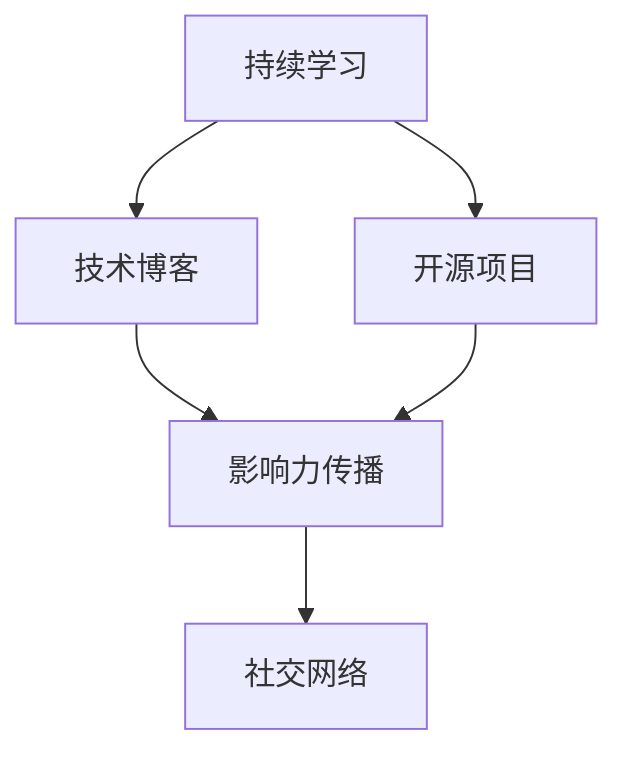

                 

# 程序员如何打造个人品牌IP

> 关键词：程序员,个人品牌,IP,技能提升,网络影响力,技术博客,开源项目,学习资源

## 1. 背景介绍

### 1.1 问题由来

在日新月异的科技时代，技术的更迭速度前所未有，但同时也带来了巨大的机遇和挑战。作为一名程序员，如何在激烈的竞争中脱颖而出，建立自己的品牌IP，成为了不少人的共同困惑。本博客旨在深入探讨如何通过技能提升、技术分享、网络影响力等手段，打造个人品牌IP，为读者提供一份实用的指南。

### 1.2 问题核心关键点

要打造个人品牌IP，核心关键点在于：

- 持续学习和技能提升
- 分享技术知识，建立个人影响力
- 通过项目实践，展示个人能力
- 利用社交网络，扩大影响范围
- 塑造独特个性，建立个人特色

这些关键点之间存在密切联系，形成一个完整的个人品牌建设体系。通过不断提升自身技术水平，并在合适平台上分享成果，逐步建立起自己的品牌形象。

## 2. 核心概念与联系

### 2.1 核心概念概述

- **个人品牌IP**：指个人在特定领域的知名度和影响力，通过持续的技术输出和成果展示，形成个人特有的风格和定位。
- **技能提升**：指通过学习和实践，不断更新和增强自身技术能力和知识水平。
- **技术博客**：指通过撰写技术文章，分享个人对技术问题的见解和解决方法，传递技术价值。
- **开源项目**：指将代码发布到公共平台，供他人下载、使用、贡献，以展示个人能力并积累影响力。
- **社交网络**：指通过社交媒体、技术社区等平台，与同行互动交流，扩大影响力和网络资源。

这些概念之间存在紧密的联系。持续的技能提升为技术博客和开源项目提供了内容基础；技术博客和开源项目则是个人品牌的有效展示渠道；而社交网络则提供了一个平台，用于扩大个人品牌的传播和影响力。

### 2.2 核心概念原理和架构的 Mermaid 流程图



这个流程图展示了核心概念之间的相互关系。持续学习是个人品牌IP的基础，通过技术博客和开源项目展示技术成果，利用社交网络扩大影响力，最终形成独特的个人品牌形象。

## 3. 核心算法原理 & 具体操作步骤

### 3.1 算法原理概述

个人品牌IP的打造，本质上是一个通过技术积累和传播来提升个人影响力的过程。这一过程可以通过以下几个步骤实现：

1. **持续学习**：通过不断学习新知识、掌握新技术，保持技术领先地位。
2. **技术分享**：将所学知识通过技术博客、开源项目等方式进行分享，建立技术权威。
3. **项目实践**：通过实际项目展示个人能力，积累实战经验。
4. **社交互动**：积极参与技术社区，与同行交流，建立人际网络。

这些步骤相辅相成，共同推动个人品牌IP的建立。

### 3.2 算法步骤详解

#### 3.2.1 持续学习

1. **选择合适的学习资源**：根据自身兴趣和职业规划，选择适合自己的学习路径和资源，如在线课程、书籍、技术博客等。
2. **制定学习计划**：明确学习目标和计划，制定每日或每周的学习任务，确保学习的连贯性和系统性。
3. **实践与巩固**：通过实际项目或练习，将所学知识转化为实践技能，加深理解和记忆。
4. **评估与调整**：定期回顾学习成果，评估学习效果，根据实际情况调整学习计划。

#### 3.2.2 技术分享

1. **撰写技术博客**：选择一个合适的平台（如GitHub Pages、Medium、CSDN等），撰写技术博客，分享个人对技术问题的见解和解决方案。
2. **参与开源项目**：选择一个适合自己的开源项目，贡献代码、文档、测试等，展示个人技术能力。
3. **建立个人网站**：创建一个个人网站，集中展示技术博客、开源项目和作品集，提升个人品牌形象。
4. **参与技术社区**：积极参与技术社区（如Stack Overflow、GitHub、知乎等），与同行交流互动，分享技术经验。

#### 3.2.3 项目实践

1. **选择项目方向**：根据自己的兴趣和市场需求，选择一个合适的项目方向，如Web开发、移动应用、数据科学等。
2. **设计项目方案**：明确项目目标和需求，设计项目的整体方案和技术架构。
3. **开发与测试**：通过编码实现项目功能，并进行全面的测试，确保项目质量。
4. **发布与展示**：将项目发布到公共平台（如GitHub、Gitee等），展示个人能力，吸引关注和贡献。

#### 3.2.4 社交互动

1. **选择合适的社交平台**：根据个人兴趣和目标受众，选择适合的社交平台（如Twitter、LinkedIn、微信等）。
2. **发布技术内容**：定期发布技术文章、代码片段、项目成果等内容，展示技术实力。
3. **参与技术讨论**：积极参与技术社区和讨论，提供帮助和解决方案，提升个人影响力。
4. **建立个人品牌形象**：在社交平台和网络社区中，建立专业、友好、积极的个人品牌形象。

### 3.3 算法优缺点

#### 3.3.1 优点

1. **持续学习与提升**：通过不断的学习和实践，保持技术领先，提升个人能力。
2. **技术分享与传播**：通过技术博客和开源项目，传播技术知识，建立技术权威。
3. **项目实践与展示**：通过实际项目展示个人能力，积累实战经验。
4. **社交互动与网络**：通过社交平台和社区，扩大个人影响力，建立人际网络。

#### 3.3.2 缺点

1. **时间成本高**：需要投入大量时间进行学习、实践和分享，对于初学者来说可能较为困难。
2. **需要高质量内容**：技术博客和开源项目需要高质量的内容和成果，对个人能力要求较高。
3. **竞争激烈**：技术领域竞争激烈，如何在众多同行中脱颖而出，需要具备一定的策略和技巧。
4. **需要持续投入**：个人品牌IP的建立不是一蹴而就的，需要持续的投入和维护。

### 3.4 算法应用领域

个人品牌IP的打造可以应用于各种技术领域，如软件开发、数据科学、人工智能等。通过不断的学习和分享，逐步建立起自己的品牌形象和影响力，为职业生涯发展提供有力支持。

## 4. 数学模型和公式 & 详细讲解 & 举例说明

### 4.1 数学模型构建

个人品牌IP的建立，可以通过一个简单的数学模型来描述。设个人品牌影响力为 $I$，个人技术能力为 $S$，社交互动能力为 $S$，则品牌影响力 $I$ 可以表示为：

$$
I = f(S, S, S)
$$

其中 $f$ 表示一个函数，综合了技术能力、社交能力和持续学习的贡献。

### 4.2 公式推导过程

假设个人技术能力 $S$ 可以通过学习提升，社交互动能力 $S$ 可以通过积极参与和维护建立。则有：

$$
S = S_0 + \sum_{i=1}^{t} w_i l_i + \sum_{j=1}^{s} v_j i_j
$$

其中 $S_0$ 为初始技术能力，$w_i$ 和 $l_i$ 为第 $i$ 次学习的权重和成果，$v_j$ 和 $i_j$ 为第 $j$ 次社交互动的权重和效果。

### 4.3 案例分析与讲解

以一名开源贡献者和技术博客作者为例：

- **技术学习**：通过参加在线课程和阅读技术书籍，提升技术能力。假设每次学习提升 $0.1$，每两周学习一次，则有：
  $$
  S = S_0 + 0.1 + 0.1 + \dots
  $$

- **开源贡献**：在GitHub上贡献代码和文档，假设每次贡献的权重为 $0.2$，共贡献了 $100$ 次，则有：
  $$
  S = S_0 + 0.2 \times 100
  $$

- **社交互动**：积极参与技术社区，与同行交流，假设每次互动提升 $0.1$，共互动了 $50$ 次，则有：
  $$
  S = S_0 + 0.1 \times 50
  $$

综合上述因素，计算品牌影响力 $I$：

$$
I = f(S, S, S) = 3S
$$

通过实际案例，可以看出持续学习、技术分享和社交互动对个人品牌IP的建立具有重要贡献。

## 5. 项目实践：代码实例和详细解释说明

### 5.1 开发环境搭建

1. **选择开发工具**：根据个人兴趣和技术栈，选择合适的开发工具和平台。如GitHub、CSDN、Medium等。
2. **配置开发环境**：根据所选平台，配置好开发环境，包括代码编辑器、版本控制等工具。
3. **创建个人网站**：选择一个合适的域名和托管平台，创建个人网站，展示技术博客、开源项目和作品集。
4. **社交媒体账号**：在社交媒体平台上创建账号，设置头像、简介和背景图，提升个人形象。

### 5.2 源代码详细实现

以下是一个简单的技术博客项目示例：

1. **博客平台选择**：选择一个合适的博客平台（如GitHub Pages、Medium、CSDN等），创建博客账号。
2. **选择博客模板**：选择一个合适的博客模板，如Jekyll、Hexo等，按照模板搭建博客。
3. **撰写博客内容**：撰写技术博客，分享个人对技术问题的见解和解决方案。
4. **发布博客文章**：将博客文章发布到所选平台，定期更新。

### 5.3 代码解读与分析

**代码示例**：

```python
# 博客内容编写
from markdown import Markdown

class BlogPost:
    def __init__(self, title, content):
        self.title = title
        self.content = content
        self.markdown = Markdown()

    def generate_html(self):
        html = self.markdown.convert(self.content)
        return html

# 创建博客文章
title = "如何使用Python进行数据清洗"
content = """
数据清洗是数据分析中的重要步骤，可以使用Python的Pandas库进行高效的数据清洗。以下是一个简单的示例代码：
```python
import pandas as pd
# 读取CSV文件
df = pd.read_csv('data.csv')
# 删除重复数据
df = df.drop_duplicates()
# 删除缺失值
df = df.dropna()
```
```

post = BlogPost(title, content)
html = post.generate_html()
print(html)
```

**解读与分析**：

- **博文编写**：使用Markdown编写博文内容，支持Markdown语法，提升文章可读性。
- **内容发布**：通过所选平台的API，将博文发布到博客平台上，支持定期更新。
- **互动评论**：设置评论区，支持读者留言和互动，提升博文互动性。

### 5.4 运行结果展示

运行上述代码，将生成一篇技术博文，发布到所选的博客平台上。读者可以通过评论和点赞，提升文章的互动性和影响力。

## 6. 实际应用场景

### 6.1 技术博客作者

通过撰写技术博客，分享技术见解和解决方案，建立起个人品牌IP。可以通过博客平台吸引读者关注，提升个人影响力。

### 6.2 开源贡献者

通过贡献代码和文档，参与开源项目，展示个人技术能力。可以在GitHub等平台上建立个人仓库，展示个人贡献和项目成果。

### 6.3 技术导师

通过编写技术书籍、发表学术论文等方式，分享专业知识，建立个人品牌。可以通过社交平台和学术社区，传播技术思想，吸引同行关注。

### 6.4 未来应用展望

未来，随着技术的不断发展，个人品牌IP的建立将更加依赖于持续的学习和创新。可以通过更多新兴平台和工具，如知识图谱、人工智能技术等，提升个人品牌影响力。

## 7. 工具和资源推荐

### 7.1 学习资源推荐

- **技术书籍**：选择经典和前沿的技术书籍，如《深入浅出数据结构与算法》、《Python核心编程》等。
- **在线课程**：选择优质的在线课程，如Coursera、edX、Udemy等平台上的课程，系统学习相关技术。
- **技术博客**：关注知名技术博客，如Stack Overflow、CSDN、Medium等，获取最新的技术动态和解决方案。

### 7.2 开发工具推荐

- **代码编辑器**：选择适合的代码编辑器，如Visual Studio Code、Atom、Sublime Text等。
- **版本控制工具**：使用Git等版本控制工具，管理代码变更和协作开发。
- **持续集成平台**：使用Jenkins、Travis CI等持续集成平台，自动化构建和部署。

### 7.3 相关论文推荐

- **数据科学论文**：选择数据科学领域的经典论文，如《数据科学导论》、《机器学习》等。
- **人工智能论文**：选择人工智能领域的经典论文，如《深度学习》、《神经网络与深度学习》等。
- **区块链论文**：选择区块链领域的经典论文，如《比特币白皮书》、《区块链技术及应用》等。

## 8. 总结：未来发展趋势与挑战

### 8.1 总结

本文详细介绍了如何通过持续学习、技术分享、项目实践和社交互动等手段，打造个人品牌IP。通过系统梳理技术博客、开源项目和社交网络的综合应用，为读者提供了实用的指南和案例分析。

### 8.2 未来发展趋势

未来，个人品牌IP的建立将更加依赖于持续学习和创新。技术博客、开源项目和社交网络等渠道的融合将更加紧密，形成更加系统和全面的品牌展示体系。

### 8.3 面临的挑战

尽管个人品牌IP的建立带来了诸多机遇，但在实际操作中也面临一些挑战：

- **时间管理**：如何平衡学习和工作，确保持续投入时间和精力。
- **内容质量**：如何保证技术博客和开源项目的高质量，吸引和保持关注。
- **技术更新**：如何及时掌握技术动态，避免内容过时。
- **社交互动**：如何积极参与和维护社交网络，扩大个人影响力。

### 8.4 研究展望

未来，需要进一步探索更多的个人品牌IP打造方法和策略，如知识图谱、人工智能技术等，提升个人品牌的影响力和可持续性。

## 9. 附录：常见问题与解答

**Q1：如何选择适合自己的开发平台和工具？**

A: 根据自身兴趣和需求，选择适合的开发平台和工具。如GitHub适合开源项目，Medium适合技术博客，CSDN适合中文技术社区。

**Q2：如何提升技术博客的质量和互动性？**

A: 使用高质量的Markdown语法，撰写清晰易懂的技术文章。设置评论区，支持读者留言和互动，提升文章的互动性。

**Q3：如何维护社交网络，扩大个人影响力？**

A: 定期发布技术文章和项目成果，积极参与技术社区和讨论，提供帮助和解决方案，提升个人影响力。

**Q4：如何处理时间和精力管理问题？**

A: 制定详细的学习计划和优先级，合理分配时间和精力，确保持续学习和实践。

**Q5：如何应对技术更新和过时问题？**

A: 持续关注技术动态和最新研究，及时更新博客和开源项目内容，保持技术领先。

---

作者：禅与计算机程序设计艺术 / Zen and the Art of Computer Programming

