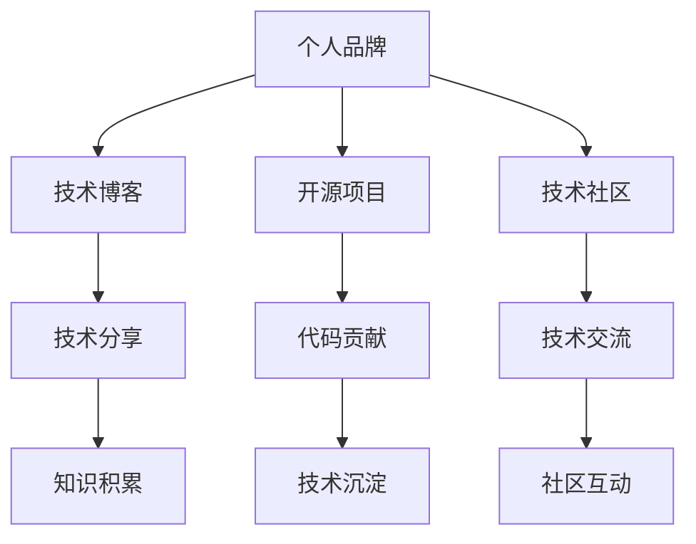
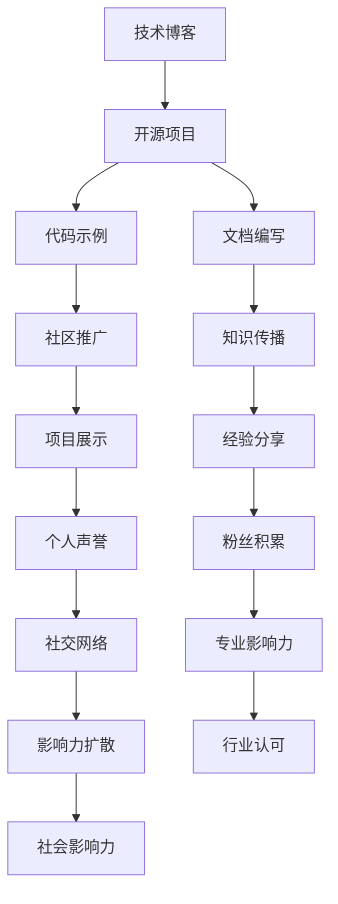

                 

# 程序员如何打造个人影响力

> 关键词：个人品牌,技术博客,开源项目,技术社区,影响力建设

## 1. 背景介绍

在信息爆炸、知识快速迭代的当今时代，技术人才不仅要有卓越的专业技能，还要善于打造个人品牌，提升在技术社区、行业界乃至社会中的影响力。个人品牌不仅是程序员自我价值的体现，也是技术社区中宝贵的知识资产。本文将探讨如何通过技术博客、开源项目、技术社区等手段，系统地打造程序员的个人影响力。

## 2. 核心概念与联系

### 2.1 核心概念概述

- **个人品牌**：指个人在技术社区和行业内形成的知名度、认可度和影响力，包括技术能力、专业声誉、社交网络等。
- **技术博客**：程序员通过撰写技术博客，分享自己的技术见解、开发经验和学习心得，建立个人知识体系的公开平台。
- **开源项目**：程序员将自己的代码和开发经验开放给社区，通过贡献代码、编写文档、优化项目等方式，积累个人技术实力和社区认可度。
- **技术社区**：如GitHub、Stack Overflow、知乎等，是程序员交流技术、分享经验、建立人脉的社交平台。
- **影响力建设**：通过技术博客、开源项目等手段，建立个人品牌，提升在技术社区和行业内的知名度和影响力。

这些核心概念之间相互关联，共同构成了程序员个人品牌建设的基础框架：

### 2.2 核心概念原理和架构的 Mermaid 流程图

以下是一个简单的Mermaid流程图，展示了个人品牌建设中各个环节的相互联系：

## 3. 核心算法原理 & 具体操作步骤

### 3.1 算法原理概述

程序员个人品牌建设的算法原理，可以概括为通过技术输出（如博客、代码、文档），不断积累和传播知识，逐步建立和提升个人在技术社区中的知名度和影响力。这个过程类似于社交网络中的“网络效应”，即个人的输出越多，获得的反馈和关注也越多，从而形成一个正向的循环。

### 3.2 算法步骤详解

**Step 1: 技术积累与输出**
- 定期撰写技术博客，分享自己的开发经验、技术见解和学习心得。
- 参与开源项目，通过贡献代码、编写文档等方式积累技术实力。
- 在技术社区活跃参与，解答问题、发布文章、参与讨论等。

**Step 2: 个人品牌构建**
- 建立个人网站或博客平台，提供一站式的技术分享和展示。
- 积极维护社交网络，如LinkedIn、GitHub等，展示个人成就和专业技能。
- 发表技术论文，在行业会议或期刊上分享研究成果。

**Step 3: 社区互动与反馈**
- 主动寻求社区反馈，根据用户评论和建议不断优化技术输出。
- 参与技术讨论，提出见解和建议，提升个人在社区中的影响力和权威性。
- 与业内专家和同行建立联系，通过网络研讨会、线下活动等方式建立人脉。

### 3.3 算法优缺点

**优点**：
- 高效积累知识。通过技术博客和开源项目，可以快速积累和传播技术知识，提升个人在社区中的知名度。
- 提升专业能力。参与开源项目和社区讨论，可以锻炼问题解决能力和技术交流能力，提升自身技术水平。
- 建立技术人脉。通过社区互动，可以结识业内专家和同行，拓展职业发展机会。

**缺点**：
- 时间成本较高。撰写博客、参与开源项目、维护社交网络都需要投入大量时间和精力。
- 个人品牌塑造需要长期坚持。品牌影响力的提升是一个长期过程，需要持续的努力和积累。
- 面临技术迭代风险。技术快速迭代，需要不断更新知识体系，保持技术领先。

### 3.4 算法应用领域

个人品牌建设的应用领域广泛，包括但不限于：
- 软件开发工程师：通过技术博客和开源项目展示开发能力，吸引雇主关注。
- 数据科学家：通过技术分享和社区互动，展示数据分析和建模能力。
- 产品经理：通过技术文章和社区讨论，理解技术实现，提升产品管理能力。
- DevOps工程师：通过开源项目和社区互动，展示自动化部署和运维能力。
- 安全专家：通过技术博客和开源项目，分享安全知识和实践经验。

## 4. 数学模型和公式 & 详细讲解 & 举例说明

### 4.1 数学模型构建

为了量化个人品牌的影响力，我们可以构建一个基于影响力的数学模型：

$$
I = \alpha \times S + \beta \times C + \gamma \times D + \delta \times F + \epsilon \times T
$$

其中：
- $I$ 表示个人品牌影响力
- $S$ 表示技术分享量（博客文章数、技术演讲次数等）
- $C$ 表示代码贡献量（GitHub上的PR数、issue数等）
- $D$ 表示文档编写量（技术博客、教程、文章等）
- $F$ 表示社区互动量（评论数、回答问题次数等）
- $T$ 表示技术时间投入量（每周技术学习时间、编程时间等）
- $\alpha, \beta, \gamma, \delta, \epsilon$ 为模型系数，表示各项因素对影响力的贡献度。

### 4.2 公式推导过程

我们假设个人品牌影响力的提升与技术分享、代码贡献、文档编写、社区互动和技术时间投入成正相关关系，即系数 $\alpha, \beta, \gamma, \delta, \epsilon$ 均为正数。

推导过程如下：

$$
\frac{\partial I}{\partial S} > 0, \frac{\partial I}{\partial C} > 0, \frac{\partial I}{\partial D} > 0, \frac{\partial I}{\partial F} > 0, \frac{\partial I}{\partial T} > 0
$$

说明技术分享、代码贡献、文档编写、社区互动和技术时间投入越多，个人品牌影响力 $I$ 的提升越显著。

### 4.3 案例分析与讲解

以开源项目贡献为例，贡献的代码量和代码质量直接影响个人在社区中的影响力。假设开源项目 A 由多个模块组成，某程序员贡献了模块 B，其代码质量和社区评价对项目 A 的影响力可以表示为：

$$
I_B = \alpha \times C_B + \beta \times R_B + \gamma \times V_B
$$

其中：
- $I_B$ 表示贡献代码 B 对项目 A 影响力的提升
- $C_B$ 表示代码 B 的复杂度（行数、算法难度等）
- $R_B$ 表示代码 B 的社区评价（评论数、投票数等）
- $V_B$ 表示代码 B 对项目 A 的性能提升贡献度

### 4.4 案例分析与讲解

以GitHub上的开源项目贡献为例，假设某程序员在GitHub上贡献了多个PR（Pull Request），其对项目的影响力可以表示为：

$$
I_{PR} = \sum_{i=1}^{n} (\alpha \times C_{PR_i} + \beta \times R_{PR_i} + \gamma \times V_{PR_i})
$$

其中 $n$ 表示PR数量，$C_{PR_i}, R_{PR_i}, V_{PR_i}$ 分别表示第 $i$ 个PR的代码复杂度、社区评价和性能提升贡献度。

## 5. 项目实践：代码实例和详细解释说明

### 5.1 开发环境搭建

要实现个人品牌建设的技术博客和开源项目，首先需要搭建开发环境：

1. 安装本地开发工具：如Python、Java、Git、Jekyll等。
2. 创建GitHub账号，并搭建GitHub仓库。
3. 安装本地IDE（如PyCharm、Visual Studio Code等）。
4. 配置代码版本控制（如GitHub Desktop）。

### 5.2 源代码详细实现

以下是一个简单的技术博客和开源项目的实现步骤：

**技术博客**：
1. 创建本地博客目录，如 `techblog`。
2. 安装Jekyll并搭建本地博客环境。
3. 创建Markdown文件，编写技术博客文章。
4. 使用Git提交本地代码至GitHub仓库。
5. 搭建静态网站，展示技术博客文章。

**开源项目**：
1. 创建GitHub仓库，如 `open-source-project`。
2. 编写代码实现项目需求。
3. 使用Git提交代码至GitHub仓库。
4. 编写README文件，介绍项目背景、使用方法和贡献指南。
5. 与社区成员互动，邀请贡献代码和文档。

### 5.3 代码解读与分析

技术博客和开源项目的关键在于持续的输出和互动。以下是对代码实现的详细解读：

**技术博客**：
- Jekyll 使用简单的Markdown语法，易于上手和维护。
- 使用Git进行版本控制，确保文章的版本管理。
- 通过静态网站展示博客文章，易于搜索引擎优化和维护。

**开源项目**：
- 使用GitHub作为版本控制和协作平台，易于代码的共享和协同开发。
- 通过README文件和贡献指南，明确项目使用方法和贡献方式，吸引社区成员参与。
- 定期发布项目更新和里程碑，保持项目的活跃度。

### 5.4 运行结果展示

运行结果展示部分，主要通过展示技术博客和开源项目的运行效果，来验证个人品牌建设的成果：

**技术博客**：
- 展示博客文章的阅读量、评论量、分享量等数据。
- 展示博客文章的SEO排名和搜索引擎流量。

**开源项目**：
- 展示GitHub上的代码提交量、PR数、 issue数等数据。
- 展示项目在GitHub上的Star数、Fork数和贡献者数。
- 展示项目的社区评价和用户反馈。

## 6. 实际应用场景

### 6.1 技术招聘

技术博客和开源项目是展示技术实力和展示开发能力的有效方式，可以帮助招聘方快速了解应聘者的技术水平和项目管理能力。

### 6.2 技术培训

通过技术博客和开源项目，可以分享技术知识和经验，帮助其他开发者学习和成长。同时，参与技术培训和讲座，提升个人在社区中的影响力和认可度。

### 6.3 技术咨询

在技术社区和行业界建立了良好的口碑后，可以通过技术博客和开源项目吸引技术咨询和商业合作的机会。

### 6.4 未来应用展望

随着技术的不断进步和社区生态的日益成熟，个人品牌建设也将迎来更多新的应用场景：

1. 多平台内容分发：技术博客和开源项目可以跨平台分发，如在知乎、CSDN、Medium等平台上发布，扩大影响范围。
2. 智能技术辅助：利用AI技术对技术博客和开源项目进行内容推荐和优化，提升用户体验和阅读量。
3. 技术生态整合：将技术博客、开源项目和社交网络整合，形成一个全面的个人技术展示平台，提升个人品牌价值。

## 7. 工具和资源推荐

### 7.1 学习资源推荐

- **Coursera**：提供顶尖大学和企业的在线课程，涵盖数据科学、编程、机器学习等多个领域。
- **Kaggle**：数据科学和机器学习竞赛平台，可以参与项目实践和社群讨论。
- **FreeCodeCamp**：提供免费的编程课程，涵盖前端开发、后端开发、数据科学等多个方向。
- **Medium**：技术社区和文章发布平台，可以分享技术博客和项目经验。

### 7.2 开发工具推荐

- **Visual Studio Code**：轻量级、功能强大的代码编辑器，支持多种编程语言和插件扩展。
- **Jekyll**：开源静态网站生成器，简单易用，适合搭建技术博客。
- **GitHub**：全球最大的开源社区，支持代码托管、版本控制、社区协作等功能。
- **PyCharm**：强大的Python IDE，支持代码编写、调试、测试、版本控制等功能。

### 7.3 相关论文推荐

- **《如何构建强大的技术社区》**：探讨如何通过技术分享、社区互动等方式，构建强大的技术社区。
- **《开源项目的最佳实践》**：详细介绍了开源项目的开发流程、版本控制、社区维护等最佳实践。
- **《技术博客的营销策略》**：分析了技术博客在内容创作、SEO优化、社区互动等方面的营销策略。

## 8. 总结：未来发展趋势与挑战

### 8.1 研究成果总结

通过技术博客和开源项目建设个人品牌，已经成为程序员个人发展的重要手段。技术分享、社区互动和开源贡献是提升个人影响力的有效途径。

### 8.2 未来发展趋势

未来的技术博客和开源项目建设将呈现以下几个趋势：
1. **多平台内容分发**：技术博客和开源项目将跨越多个平台进行内容分发，扩大影响力。
2. **智能技术辅助**：利用AI技术进行内容推荐和优化，提升用户体验。
3. **技术生态整合**：技术博客、开源项目和社交网络整合，形成全面的个人技术展示平台。

### 8.3 面临的挑战

个人品牌建设也面临一些挑战：
1. **时间管理**：技术博客和开源项目需要持续的投入时间和精力，需要有效的时间管理策略。
2. **内容质量**：持续输出高质量的内容是保持影响力的关键，需要不断提高技术水平和写作能力。
3. **社区互动**：社区互动是提升个人影响力的重要手段，需要积极参与和维护。

### 8.4 研究展望

未来的研究应关注以下几个方向：
1. **技术博客的AI辅助**：利用AI技术进行内容创作、SEO优化和社区推荐，提升技术博客的影响力。
2. **开源项目的自动化**：利用CI/CD工具和自动化测试，提升开源项目的开发效率和稳定性。
3. **技术博客的多媒体化**：引入视频、音频等多媒体内容，提升技术博客的互动性和阅读体验。

## 9. 附录：常见问题与解答

**Q1: 如何保持技术博客的持续更新？**

A: 技术博客的持续更新需要良好的时间管理和内容规划。可以制定更新计划，定期发布博客文章。同时，利用技术工具进行内容辅助，如自动化生成、多平台分发等。

**Q2: 如何提升开源项目的社区活跃度？**

A: 提升开源项目的社区活跃度需要积极参与和维护。可以通过定期发布项目更新、参与技术讨论、邀请贡献代码和文档等方式，吸引社区成员参与。

**Q3: 如何利用AI技术优化技术博客？**

A: 利用AI技术进行内容推荐和优化，可以提升技术博客的用户体验和阅读量。可以使用自然语言处理(NLP)技术进行内容分析，使用推荐系统进行内容推荐。

**Q4: 如何构建全面的个人技术展示平台？**

A: 将技术博客、开源项目和社交网络整合，构建一个全面的个人技术展示平台。可以利用网站生成器如Jekyll搭建技术博客，利用GitHub托管开源项目，利用社交网络如LinkedIn展示个人成就。

---

作者：禅与计算机程序设计艺术 / Zen and the Art of Computer Programming

