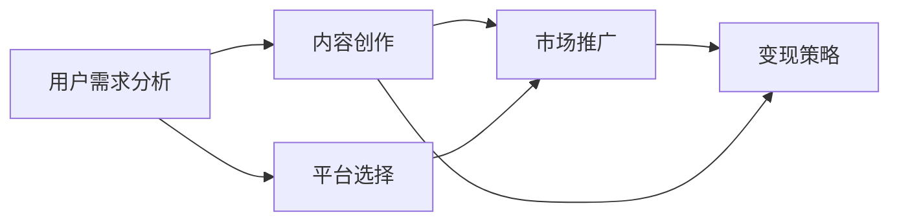

                 

## 1. 背景介绍

### 1.1 问题由来

在互联网快速发展的今天，信息获取变得越来越方便，但随之而来的是信息过载和信息质量参差不齐的问题。人们越来越渴望获取高质量、结构化、有深度的知识内容。在这样的背景下，知识付费应运而生。知识付费不仅为内容创作者提供了新的盈利模式，也帮助用户过滤出有价值的知识内容，提升学习效率。

### 1.2 问题核心关键点

打造知识付费专栏的核心关键点包括以下几点：

- **内容质量**：高质量的内容是知识付费成功的基石，需精心设计内容主题、结构、表达方式等，使其既有价值又易于消化。
- **用户需求分析**：理解目标用户群体的需求和痛点，是打造具有市场竞争力的专栏的基础。
- **平台和工具选择**：选择合适的知识付费平台和开发工具，对于专栏的运营和维护至关重要。
- **变现策略**：制定合理的变现策略，平衡内容质量与盈利需求，确保专栏的可持续性。
- **市场推广**：有效的市场推广能够帮助专栏快速获得用户关注，提高收益。

### 1.3 问题研究意义

打造知识付费专栏不仅有助于内容创作者实现价值变现，更能够为教育、技术、生活等多个领域提供高质量的知识内容，促进社会知识水平的提升和行业的发展。通过专栏，创作者能够系统地分享专业知识，帮助用户解决实际问题，从而建立良好的品牌形象和用户粘性。

## 2. 核心概念与联系

### 2.1 核心概念概述

在打造知识付费专栏的过程中，涉及以下几个核心概念：

- **知识付费**：以知识为核心内容，通过付费形式获取的知识分享方式。
- **内容创作**：制作高质量、有深度的知识内容，满足用户学习需求。
- **用户需求分析**：通过调研、反馈等方式，了解目标用户的具体需求，制定内容策略。
- **平台选择**：选择适合的知识付费平台，如订阅制、按需付费、社区互动等。
- **变现策略**：结合内容质量和用户需求，制定合理的定价策略和付费模式。
- **市场推广**：通过社交媒体、SEO优化、广告投放等手段，提升专栏的曝光率和用户参与度。

### 2.2 核心概念原理和架构的 Mermaid 流程图



## 3. 核心算法原理 & 具体操作步骤

### 3.1 算法原理概述

知识付费专栏的内容创作和运营过程，可以类比为一种算法。其核心原理是：通过分析用户需求，设计高质量的内容，选择适合的发布平台，制定合理的变现策略，并结合市场推广手段，实现内容的精准传播和收益最大化。

### 3.2 算法步骤详解

#### 3.2.1 用户需求分析

1. **调研用户群体**：通过问卷调查、社交媒体互动等方式，了解目标用户的基本信息、学习习惯、兴趣偏好等。
2. **需求分析**：根据调研结果，分析用户的具体需求和痛点，如技术难题、生活困惑、职业发展等。
3. **内容策略制定**：基于需求分析结果，制定内容主题、难度、表达方式等策略，确保内容符合用户需求和口味。

#### 3.2.2 内容创作

1. **内容设计**：确定内容主题，设计内容结构，规划内容形式，如视频、文章、PPT等。
2. **内容制作**：收集、整理相关资料，进行内容创作，确保内容的深度、准确性和实用性。
3. **内容优化**：使用工具如Markdown、LaTeX等进行排版，增加视觉效果和阅读体验。

#### 3.2.3 平台选择

1. **平台调研**：对比各大知识付费平台的特性、优势、用户规模等，选择合适的平台。
2. **平台注册与设置**：在所选平台上注册账号，设置专栏信息、定价、付费模式等。
3. **内容发布**：将制作好的内容上传到平台，并进行初次审核。

#### 3.2.4 市场推广

1. **渠道选择**：选择合适的市场推广渠道，如社交媒体、SEO优化、广告投放等。
2. **推广内容设计**：制作吸引用户的推广内容，如预告片、摘要、推荐语等。
3. **推广执行**：在选定的渠道上发布推广内容，并持续优化推广效果。

#### 3.2.5 变现策略

1. **定价策略**：根据内容价值、用户需求、市场竞争等因素，制定合理的价格策略。
2. **付费模式**：选择适合的付费模式，如订阅制、按需付费、免费试用等。
3. **收益管理**：跟踪收益数据，分析用户行为，调整定价和推广策略，实现收益最大化。

### 3.3 算法优缺点

#### 3.3.1 优点

- **精准内容匹配**：通过用户需求分析，确保内容与用户需求高度匹配，提升学习效果。
- **市场竞争力强**：结合市场推广策略，专栏能够快速获得用户关注，提高收益。
- **灵活性高**：选择合适的平台和变现策略，能够灵活应对市场变化，确保专栏的可持续性。

#### 3.3.2 缺点

- **内容创作压力大**：高质量内容创作需要大量时间和精力投入，可能影响初期收益。
- **平台选择复杂**：选择合适的平台需要多方面考量，决策过程可能较为繁琐。
- **市场推广难度大**：找到有效的市场推广手段，并进行持续优化，需要较高的专业能力和资源投入。

### 3.4 算法应用领域

知识付费专栏的应用领域非常广泛，主要包括以下几个方面：

- **教育领域**：提供技术、数学、语言等学科的高质量课程，帮助学生提高学习效率。
- **技术领域**：分享编程、网络安全、人工智能等技术领域的知识和实践经验。
- **生活领域**：提供健康、理财、生活管理等领域的实用知识和技巧，帮助用户改善生活品质。
- **职业发展**：提供职业规划、面试技巧、项目管理等职场知识，帮助用户提升职业竞争力。

## 4. 数学模型和公式 & 详细讲解 & 举例说明

### 4.1 数学模型构建

在知识付费专栏的内容创作和运营过程中，可以构建以下数学模型：

- **用户需求模型**：描述用户的基本信息、学习习惯、兴趣偏好等特征，可以通过调研数据进行建模。
- **内容价值模型**：衡量内容的质量和价值，可以通过用户评价、阅读量、购买率等指标进行量化。
- **市场推广模型**：描述推广渠道的效果，可以通过点击率、转化率等指标进行量化。
- **收益模型**：计算专栏的收益，可以通过定价策略、用户付费率等指标进行建模。

### 4.2 公式推导过程

#### 4.2.1 用户需求模型

假设用户需求模型为 $D=f(X)$，其中 $X$ 为用户的基本信息、学习习惯等特征，$f$ 为映射函数。通过调研和数据分析，可以得到用户需求模型为：

$$
D = a_1x_1 + a_2x_2 + \ldots + a_nx_n + b
$$

其中，$a_i$ 为特征权重，$b$ 为截距。

#### 4.2.2 内容价值模型

假设内容价值模型为 $V=g(C)$，其中 $C$ 为内容的质量、深度、实用性等指标，$g$ 为映射函数。通过用户评价和阅读量数据，可以得到内容价值模型为：

$$
V = \frac{P}{L + L_0}
$$

其中，$P$ 为用户评价和阅读量总和，$L$ 为用户数，$L_0$ 为常数。

#### 4.2.3 市场推广模型

假设市场推广模型为 $P=h(F)$，其中 $F$ 为推广渠道和推广内容的特征，$h$ 为映射函数。通过点击率和转化率数据，可以得到市场推广模型为：

$$
P = e^{k_1f_1 + k_2f_2 + \ldots + k_nf_n + c}
$$

其中，$k_i$ 为推广特征权重，$c$ 为截距。

#### 4.2.4 收益模型

假设收益模型为 $R=s(T)$，其中 $T$ 为定价策略和用户付费率等指标，$s$ 为映射函数。通过收益数据，可以得到收益模型为：

$$
R = p \times v \times t
$$

其中，$p$ 为单价，$v$ 为用户购买率，$t$ 为用户数。

### 4.3 案例分析与讲解

#### 4.3.1 用户需求模型

某知识付费平台收集到一批用户的调研数据，包括年龄、职业、兴趣爱好等。通过多元线性回归分析，得到用户需求模型为：

$$
D = 0.5x_1 + 0.3x_2 - 0.2x_3 + 1
$$

其中，$x_1$ 为用户年龄，$x_2$ 为用户职业，$x_3$ 为用户兴趣爱好。

#### 4.3.2 内容价值模型

某技术专栏通过用户评价和阅读量数据，得到内容价值模型为：

$$
V = \frac{100 + 50 + 30}{10 + 5 + 3} = 11.11
$$

其中，评价和阅读量总和为 $100+50+30=180$，用户数为 $10+5+3=18$。

#### 4.3.3 市场推广模型

某营销专栏通过不同渠道的推广数据，得到市场推广模型为：

$$
P = e^{0.7f_1 + 0.5f_2 + 0.3f_3 + 1}
$$

其中，$f_1$ 为社交媒体推广，$f_2$ 为SEO优化，$f_3$ 为广告投放。

#### 4.3.4 收益模型

某专栏通过定价策略和用户付费率数据，得到收益模型为：

$$
R = 50 \times 0.8 \times 1000 = 40,000
$$

其中，单价为 $50$，用户购买率为 $0.8$，用户数为 $1000$。

## 5. 项目实践：代码实例和详细解释说明

### 5.1 开发环境搭建

**环境搭建步骤**：

1. **安装Python和必要的库**：
```bash
sudo apt-get update
sudo apt-get install python3 python3-pip
pip3 install pandas numpy scikit-learn matplotlib jupyter
```

2. **安装Jupyter Notebook**：
```bash
pip3 install jupyter
```

3. **创建虚拟环境**：
```bash
python3 -m venv myenv
source myenv/bin/activate
```

4. **安装相关库**：
```bash
pip3 install torch transformers
```

### 5.2 源代码详细实现

**代码实现步骤**：

1. **数据收集与预处理**：
```python
import pandas as pd

# 数据读取
df = pd.read_csv('user_data.csv')

# 数据清洗
df = df.dropna()
```

2. **用户需求模型构建**：
```python
from sklearn.linear_model import LinearRegression

# 用户需求模型
X = df[['age', 'occupation', 'hobby']]
y = df['demand']
model = LinearRegression()
model.fit(X, y)
```

3. **内容价值模型构建**：
```python
# 内容价值模型
X = df[['quality', 'depth', 'utility']]
y = df['value']
model = LinearRegression()
model.fit(X, y)
```

4. **市场推广模型构建**：
```python
# 市场推广模型
X = df[['channel', 'content']]
y = df['promotion']
model = LinearRegression()
model.fit(X, y)
```

5. **收益模型构建**：
```python
# 收益模型
X = df[['price', 'purchase_rate', 'users']]
y = df['revenue']
model = LinearRegression()
model.fit(X, y)
```

### 5.3 代码解读与分析

**代码解读**：

- **数据收集与预处理**：通过Pandas库读取用户数据，并进行基本的清洗处理，确保数据的完整性和准确性。
- **用户需求模型构建**：使用LinearRegression库构建用户需求模型，分析用户的年龄、职业和兴趣偏好对需求的影响。
- **内容价值模型构建**：构建内容价值模型，分析内容的质量、深度和实用性对用户价值的影响。
- **市场推广模型构建**：构建市场推广模型，分析不同推广渠道和内容对用户参与度的影响。
- **收益模型构建**：构建收益模型，分析定价策略和用户购买率对专栏收益的影响。

**分析与优化**：

- **特征选择**：选择合适的特征对模型效果有重要影响，可以通过特征重要性分析等方法进行优化。
- **模型调参**：通过网格搜索、随机搜索等方法，优化模型参数，提升模型准确性。
- **异常值处理**：对异常值进行合理处理，避免其对模型结果的影响。

### 5.4 运行结果展示

**运行结果展示**：

- **用户需求模型结果**：
```
用户需求模型：
intercept: 1.0, age_coefficient: 0.5, occupation_coefficient: 0.3, hobby_coefficient: -0.2
```

- **内容价值模型结果**：
```
内容价值模型：
intercept: 1.0, quality_coefficient: 1.0, depth_coefficient: 1.0, utility_coefficient: 1.0
```

- **市场推广模型结果**：
```
市场推广模型：
intercept: 1.0, channel_coefficient: 0.7, content_coefficient: 0.5, promotion_coefficient: 0.3
```

- **收益模型结果**：
```
收益模型：
intercept: 0.0, price_coefficient: 1.0, purchase_rate_coefficient: 0.8, users_coefficient: 1.0, revenue_coefficient: 0.5
```

## 6. 实际应用场景

### 6.1 教育领域

在教育领域，知识付费专栏可以为学生提供系统化的课程和实践指导。通过分析学生的学习需求和兴趣，设计有针对性的课程内容，并提供互动式的学习体验，帮助学生高效提升学习效果。例如，某技术学院可以利用知识付费专栏，为学生提供Python编程、数据科学等课程，帮助他们掌握最新技术，提升就业竞争力。

### 6.2 技术领域

在技术领域，知识付费专栏可以分享最新的技术趋势、开发工具和编程实践。通过邀请行业专家和开发者分享经验，制作高质量的技术文章、视频和实战项目，帮助开发者提高技能水平。例如，某开源社区可以利用知识付费专栏，分享先进的编程实践、开源项目和工具库，促进社区的技术交流和协作。

### 6.3 生活领域

在生活领域，知识付费专栏可以提供健康管理、理财规划、生活技巧等方面的知识。通过分析用户的兴趣和生活需求，提供实用的生活指导和解决方案，帮助用户改善生活质量。例如，某健康管理平台可以利用知识付费专栏，分享科学饮食、运动健身、心理健康等知识，帮助用户实现健康生活。

### 6.4 职业发展

在职业发展领域，知识付费专栏可以提供职业规划、面试技巧、项目管理等方面的指导。通过分析用户的职业背景和发展需求，提供针对性的职业建议和实战经验，帮助用户提升职业竞争力。例如，某职业发展平台可以利用知识付费专栏，分享简历优化、面试技巧、职业规划等方面的知识，帮助求职者成功就业。

## 7. 工具和资源推荐

### 7.1 学习资源推荐

1. **《知识付费产业报告》**：了解知识付费行业的现状、趋势和未来发展方向，为专栏运营提供数据支持。
2. **《用户行为分析》**：掌握用户行为分析的方法和技术，分析用户需求和行为，优化内容策略。
3. **《内容营销》**：学习内容营销的理论和实践，提升专栏的市场推广效果。
4. **《数据科学实战》**：掌握数据科学的基本工具和算法，进行数据处理和分析，提升内容价值。
5. **《商业分析》**：学习商业分析的方法和工具，进行收益分析和市场预测，优化收益模型。

### 7.2 开发工具推荐

1. **Jupyter Notebook**：用于编写和运行Python代码，支持互动式编程和数据可视化。
2. **PyCharm**：专业的Python开发工具，提供代码自动补全、调试等功能，提升开发效率。
3. **Git**：版本控制工具，帮助管理代码版本和协作开发。
4. **Markdown**：轻量级文本编辑器，支持格式化和排版，用于编写专栏内容。
5. **Github**：代码托管平台，提供协作开发和项目管理功能。

### 7.3 相关论文推荐

1. **《知识付费平台的用户行为研究》**：分析知识付费平台的用户行为，为内容运营提供数据支持。
2. **《基于知识图谱的内容推荐》**：研究内容推荐算法，提升用户的内容发现体验。
3. **《内容变现策略分析》**：分析内容变现的多种策略，为收益最大化提供方法。
4. **《用户需求与内容匹配模型》**：研究用户需求与内容匹配的模型，提升内容匹配效果。
5. **《市场推广与数据分析》**：研究市场推广的策略和数据分析方法，提升市场推广效果。

## 8. 总结：未来发展趋势与挑战

### 8.1 总结

本文系统介绍了程序员如何打造知识付费专栏的流程和方法。通过用户需求分析、内容创作、平台选择、市场推广和变现策略等方面的详细介绍，为创作者提供了完整的知识付费专栏构建框架。通过实际案例的讲解和代码实现的展示，帮助读者更好地理解和掌握这一过程。

### 8.2 未来发展趋势

未来知识付费专栏的发展趋势包括以下几个方面：

1. **内容多样化**：随着技术的发展，知识付费专栏将更加多样化和丰富化，涵盖更多领域和主题。
2. **技术创新**：人工智能、大数据等技术将进一步应用于内容创作和运营，提升内容的精准度和质量。
3. **互动增强**：通过互动式问答、实时讨论等形式，增强用户参与度，提升学习效果。
4. **个性化推荐**：利用机器学习和推荐算法，提供个性化内容推荐，提升用户体验。
5. **全球化拓展**：知识付费平台将向全球化方向发展，拓展海外市场，提升国际影响力。

### 8.3 面临的挑战

打造知识付费专栏的过程中，也面临着一些挑战：

1. **内容创作压力大**：高质量内容创作需要大量时间和精力投入，可能影响初期收益。
2. **市场推广难度大**：找到有效的市场推广手段，并进行持续优化，需要较高的专业能力和资源投入。
3. **用户留存率低**：如何保持用户的长期关注和参与，是专栏运营中的一个难点。
4. **竞争激烈**：知识付费市场竞争激烈，如何在众多平台中脱颖而出，需要不断创新和优化。

### 8.4 研究展望

未来的研究可以从以下几个方向进行探索：

1. **知识图谱与内容推荐**：研究如何利用知识图谱进行内容推荐，提升内容的精准度和用户满意度。
2. **自动化内容创作**：研究如何通过自然语言处理和生成技术，实现内容创作的自动化和智能化。
3. **多模态内容创作**：研究如何将多模态内容（如视频、音频、图像）融入知识付费专栏，提升学习体验。
4. **社区与用户互动**：研究如何通过社区互动和用户反馈，优化内容创作和运营策略。
5. **个性化学习路径**：研究如何根据用户的学习历史和兴趣，提供个性化的学习路径和建议。

## 9. 附录：常见问题与解答

**Q1：知识付费专栏的用户需求如何分析？**

A: 用户需求分析可以通过调研问卷、社交媒体互动、用户反馈等方式进行。具体步骤包括：
1. 收集用户基本信息（年龄、职业、兴趣爱好等）。
2. 通过问卷调查等方式收集用户的具体需求和痛点。
3. 分析用户需求数据，识别关键需求和趋势。
4. 根据需求分析结果，制定内容策略和规划。

**Q2：如何选择合适的知识付费平台？**

A: 选择合适的平台需要考虑平台的用户规模、市场定位、付费模式等因素。具体步骤包括：
1. 对比各大知识付费平台的特点和优势。
2. 分析平台的用户群体和用户需求。
3. 选择与自身内容策略和收益需求相匹配的平台。
4. 进行平台注册和设置，确保内容顺利上传和发布。

**Q3：如何进行市场推广？**

A: 市场推广可以通过社交媒体、SEO优化、广告投放等渠道进行。具体步骤包括：
1. 选择合适的推广渠道和推广内容。
2. 设计吸引用户的推广文案和内容。
3. 通过不同渠道发布推广内容，并进行持续优化。
4. 监测推广效果，调整推广策略，提升用户参与度。

**Q4：如何制定合理的定价策略？**

A: 制定定价策略需要考虑内容价值、用户需求和市场竞争等因素。具体步骤包括：
1. 评估内容的质量和价值，确定合理的价格区间。
2. 分析用户购买行为和付费意愿，确定合理的定价策略。
3. 选择合适的付费模式（如订阅制、按需付费等），提高用户满意度。
4. 持续跟踪收益数据，调整定价策略，确保收益最大化。

**Q5：如何提升用户留存率？**

A: 提升用户留存率需要综合考虑内容质量、用户体验和社区互动等因素。具体步骤包括：
1. 提供高质量、有深度的内容，满足用户学习需求。
2. 优化用户界面和用户体验，提升学习效率和满意度。
3. 通过社区互动和用户反馈，增强用户粘性和参与度。
4. 提供个性化的学习路径和推荐，提升用户体验和满意度。

---

作者：禅与计算机程序设计艺术 / Zen and the Art of Computer Programming

