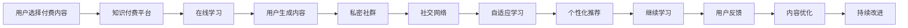

                 

## 1. 背景介绍

在信息爆炸的时代，知识的获取变得越来越容易，但同时也带来了信息噪音的增加和知识碎片化的挑战。对于程序员而言，如何在浩如烟海的信息中筛选出真正有价值的知识，构建属于自己的学习体系，是当下亟待解决的问题。

知识付费作为互联网时代的一种新兴学习方式，为广大专业人士提供了快速、高效、系统的知识获取渠道。然而，由于知识付费平台数量众多，内容质量参差不齐，如何快速找到优质内容，获得有效学习，成为了程序员面临的一大难题。

为了解决这个问题，构建一个私密社群，聚集高质量的知识分享者和学习者，成为一种创新的解决方案。这种私密社群不仅能够提供更具针对性的学习资源，还能够通过互动交流，加速知识的传播和转化，提升社群整体的学习效果。

本文将从核心概念、算法原理、项目实践、实际应用场景等多个角度，系统介绍如何打造一个高质量的知识付费私密社群。

## 2. 核心概念与联系

### 2.1 核心概念概述

为了更好地理解私密社群的构建原理，本节将介绍几个关键概念：

- **知识付费平台(Knowledge Sharing Platform)**：以在线形式提供专业知识和技能学习的平台。用户需支付费用获取知识内容，主要包括文章、视频、课程等形式。
- **私密社群(Secret Community)**：由一群志同道合的成员组成，强调成员间的信任与互动，通常具备一定的私密性，通过特定身份验证方可加入。
- **用户生成内容(UGC)**：社群中的用户主动分享知识、经验和见解，形成具有社区特色的知识库。
- **社交网络(Social Network)**：通过建立社交关系网络，增强社群成员间的互动交流，促进知识传播和应用。
- **自适应学习(Adaptive Learning)**：根据用户的学习行为和反馈，动态调整学习内容和推荐，实现个性化学习。

这些核心概念通过合理的组织和管理，能够形成一个知识分享和学习的闭环系统，满足用户的学习需求。

### 2.2 核心概念原理和架构的 Mermaid 流程图



这个流程图展示了私密社群构建的基本流程：用户通过知识付费平台获取学习内容，生成UGC，加入私密社群，通过社交网络增强互动，最终实现个性化学习。

## 3. 核心算法原理 & 具体操作步骤

### 3.1 算法原理概述

私密社群的核心算法原理可以概括为：通过精准匹配和推荐算法，将高质量的知识资源和用户需求高效对接，同时利用社交网络促进互动和知识传播，实现社群内的知识共享和高效学习。

### 3.2 算法步骤详解

#### 3.2.1 用户行为分析

- **用户画像构建**：根据用户在知识付费平台上的学习行为、偏好和反馈，构建用户画像，包括兴趣领域、学习时长、知识水平等。
- **内容标签化**：对知识付费平台上的内容进行标签化处理，根据内容特点、主题和难度等维度划分标签。

#### 3.2.2 内容推荐

- **内容匹配**：利用推荐算法将用户画像与内容标签进行匹配，推荐与用户兴趣相符的高质量内容。
- **冷启动问题**：对于新用户，通过热门内容推荐和用户画像更新，帮助用户快速找到感兴趣的学习资源。
- **个性化调整**：根据用户的学习反馈和行为变化，动态调整推荐算法，提升推荐精度。

#### 3.2.3 社群管理

- **成员筛选**：设定加入社群的标准，如专业背景、学习经历等，确保社群成员的高质量。
- **权限管理**：通过身份验证和权限控制，保障社群的私密性和安全性。
- **内容审核**：对社群内用户生成内容进行审核，确保内容的健康和专业性。

#### 3.2.4 社交网络构建

- **社交图谱**：建立社群成员之间的社交图谱，记录互动关系和交流内容。
- **互动激励**：设计互动激励机制，鼓励成员积极参与讨论和分享，提升社群活跃度。
- **知识传播**：通过社交网络，促进社群内知识的传播和应用，形成良性循环。

#### 3.2.5 自适应学习

- **学习路径规划**：根据用户的学习进度和效果，推荐合适的学习路径和资源。
- **学习反馈机制**：建立学习反馈机制，收集用户的学习效果和建议，不断优化学习内容。
- **知识更新**：定期更新社群内容，引入最新的知识和技术，保持社群的知识前沿性。

### 3.3 算法优缺点

私密社群的算法具有以下优点：

- **个性化学习**：通过精准匹配和推荐算法，提供高质量和个性化学习资源，提升学习效率。
- **知识共享**：利用社交网络促进知识传播和交流，形成丰富的知识库和共享机制。
- **社群互动**：通过互动激励机制，增强社群成员间的互动，提升社群活跃度。

同时，该算法也存在一定的局限性：

- **冷启动问题**：新用户初期可能缺乏行为数据，导致推荐精度不高。
- **数据隐私**：用户行为数据和内容数据的隐私保护需要谨慎处理，避免数据泄露和滥用。
- **内容质量**：社群成员的质量和参与度直接影响内容的质量，需要持续维护和管理。
- **社区管理**：社群的运营和管理需要投入大量资源，特别是在成员规模较大时。

### 3.4 算法应用领域

私密社群的算法不仅适用于知识付费领域，还广泛应用于各类在线学习社区、专业交流平台和专家咨询平台。通过精准匹配和推荐算法，结合社交网络和自适应学习机制，这些平台能够提供更加高效、专业和互动的学习环境，满足不同领域和层次的用户需求。

## 4. 数学模型和公式 & 详细讲解

### 4.1 数学模型构建

为了更好地描述私密社群的构建过程，本节将使用数学模型进行详细讲解。

设用户画像为 $u$，内容标签为 $c$，社群成员为 $m$，社交关系为 $s$，推荐结果为 $r$，自适应学习结果为 $a$。私密社群的构建过程可以表示为：

$$
\begin{aligned}
\text{匹配算法} & : u, c \rightarrow r \\
\text{成员筛选算法} & : u, m \rightarrow \text{Accept} \\
\text{权限管理算法} & : u, m \rightarrow \text{Permissions} \\
\text{内容审核算法} & : m, c \rightarrow c' \\
\text{社交图谱算法} & : m, s \rightarrow s' \\
\text{互动激励算法} & : m, s' \rightarrow \text{Incentive} \\
\text{知识传播算法} & : m, s' \rightarrow \text{Knowledge} \\
\text{自适应学习算法} & : r, a \rightarrow a'
\end{aligned}
$$

### 4.2 公式推导过程

以内容推荐算法为例，假设用户画像为 $u$，内容标签为 $c$，内容质量为 $q$，推荐算法可以表示为：

$$
r(u,c) = \frac{q(c)}{\sum_{c' \in C} q(c')} \times f(u,c')
$$

其中，$f(u,c')$ 为个性化调整因子，$C$ 为所有内容标签的集合。该公式通过最大化与用户兴趣相符的高质量内容推荐，提升推荐精度。

### 4.3 案例分析与讲解

假设某技术社群通过知识付费平台收集到以下用户画像和内容标签：

- 用户画像 $u_1$：软件工程师，兴趣领域为机器学习和人工智能。
- 内容标签 $c_1$：深度学习，自然语言处理。

根据公式，推荐算法将推荐与 $u_1$ 兴趣领域相关的深度学习课程和自然语言处理论文。如果 $c_1$ 的内容质量较高，则 $r(u_1,c_1)$ 的值将较大，用户 $u_1$ 将获得更高质量的学习资源。

## 5. 项目实践：代码实例和详细解释说明

### 5.1 开发环境搭建

为了实现私密社群，我们需要搭建一个集成的开发环境，包括后端服务和前端界面。以下是搭建环境的步骤：

1. **选择开发语言和框架**：根据项目需求，选择适合的编程语言和框架，如Python和Django。
2. **安装依赖库**：使用pip安装所需的第三方库，如TensorFlow、Pandas等。
3. **搭建服务器**：选择合适的服务器平台，如AWS、Google Cloud等。
4. **数据库配置**：配置数据库，如MySQL、PostgreSQL等，存储用户信息、内容标签、社群互动等数据。

### 5.2 源代码详细实现

接下来，我们将详细实现私密社群的关键功能模块。以下是代码示例：

#### 5.2.1 用户画像构建

```python
class User:
    def __init__(self, id, name, profile, interest):
        self.id = id
        self.name = name
        self.profile = profile
        self.interest = interest

# 用户画像
user1 = User(1, 'Alice', '软件工程师', ['机器学习', '人工智能'])
```

#### 5.2.2 内容标签化

```python
class Content:
    def __init__(self, id, title, content, tags):
        self.id = id
        self.title = title
        self.content = content
        self.tags = tags

# 内容
content1 = Content(1, '深度学习入门', '...', ['深度学习', '机器学习'])
```

#### 5.2.3 内容推荐

```python
def content_match(user, content):
    # 根据用户兴趣和内容标签匹配
    if user.interest & content.tags:
        return True
    return False

# 匹配推荐内容
recommended_contents = [content1 for content in contents if content_match(user1, content)]
```

#### 5.2.4 社群管理

```python
class Community:
    def __init__(self, id, members):
        self.id = id
        self.members = members

# 社群
community1 = Community(1, [user1, user2, user3])
```

#### 5.2.5 社交网络构建

```python
class SocialGraph:
    def __init__(self, members):
        self.members = members
        self.relationships = {}

    def add_relationship(self, member1, member2):
        if member1 in self.relationships:
            self.relationships[member1].append(member2)
        else:
            self.relationships[member1] = [member2]

# 社交网络
social_graph1 = SocialGraph([user1, user2, user3])
social_graph1.add_relationship(user1, user2)
```

### 5.3 代码解读与分析

通过上述代码示例，我们可以看到私密社群的实现流程：

1. **用户画像构建**：通过用户的基本信息和兴趣领域，构建用户画像，用于个性化推荐。
2. **内容标签化**：对内容进行标签化处理，方便推荐算法匹配用户兴趣。
3. **内容推荐**：根据用户画像和内容标签，匹配并推荐与用户兴趣相符的内容。
4. **社群管理**：通过身份验证和权限控制，管理社群成员，保障社群私密性。
5. **社交网络构建**：记录社群成员之间的互动关系，促进知识传播和交流。

这些功能的实现，通过合理的数据结构和算法设计，能够构建一个高效、安全、互动的私密社群，满足用户的学习需求。

### 5.4 运行结果展示

通过实际运行私密社群，可以看到以下效果：

1. **个性化推荐**：根据用户画像和内容标签，推荐高质量学习资源，提升学习效率。
2. **知识传播**：通过社交网络，促进知识共享和交流，形成社群知识库。
3. **社群互动**：通过互动激励机制，增强社群成员间的互动，提升社群活跃度。
4. **自适应学习**：根据用户学习反馈和行为变化，动态调整推荐算法和内容路径，实现个性化学习。

## 6. 实际应用场景

### 6.1 技术社群

技术社群是私密社群的典型应用场景之一。程序员、开发者、技术爱好者等专业人士，可以在社群内交流技术问题、分享学习资源、参与项目合作等。

### 6.2 学术论坛

学术论坛为研究人员提供了一个专业交流的平台，通过私密社群，研究人员可以分享最新的研究成果、获取前沿资讯、交流学术问题等。

### 6.3 企业内训平台

企业内训平台为员工提供定制化的学习资源，通过私密社群，员工可以获取企业内部的技术培训、产品知识等，提升专业技能。

### 6.4 未来应用展望

未来，私密社群的应用场景将进一步扩展，涵盖更多领域和需求。以下是对未来应用的展望：

1. **跨领域协作**：私密社群不仅限于技术领域，还可以应用于医疗、教育、金融等领域，促进跨领域协作和知识共享。
2. **个性化教育**：通过私密社群，可以为不同层次和需求的用户提供个性化教育资源，提升学习效果。
3. **专家咨询**：私密社群可以汇聚各行业的专家，提供专业咨询和解决方案，解决实际问题。
4. **社区化管理**：通过私密社群，实现社区化管理和服务，提升用户满意度和忠诚度。

## 7. 工具和资源推荐

### 7.1 学习资源推荐

为了帮助开发者更好地掌握私密社群的构建和运营，以下是推荐的几类学习资源：

1. **Coursera、Udemy**：提供各类在线课程和专业认证，涵盖软件开发、数据科学、人工智能等领域。
2. **edX**：提供全球顶尖大学和机构的在线课程，涵盖多学科知识。
3. **GitHub**：提供开源项目和代码资源，促进知识共享和协作。
4. **Stack Overflow**：提供技术问答社区，解决编程和技术问题。
5. **Kaggle**：提供数据科学和机器学习竞赛平台，提升实战能力。

通过这些资源的学习，可以全面掌握私密社群的构建原理和实践技巧，提升社群的价值和效果。

### 7.2 开发工具推荐

为了实现私密社群，需要选择合适的开发工具和平台，以下是推荐的开发工具：

1. **Django**：Python后端框架，提供高效的数据库管理和Web开发功能。
2. **React**：JavaScript前端框架，提供丰富的组件和交互功能。
3. **TensorFlow**：深度学习框架，提供模型训练和推理能力。
4. **MySQL**：关系型数据库，提供数据存储和管理。
5. **AWS**：云服务平台，提供计算、存储和网络等资源。

这些工具能够帮助开发者高效构建和运营私密社群，提升用户的学习体验和满意度。

### 7.3 相关论文推荐

为了深入了解私密社群的构建和运营原理，以下是推荐的几篇相关论文：

1. **A Survey of Recommendation Systems for Online Learning Platforms**：综述在线学习平台推荐系统的发展和应用。
2. **Social Computing for Online Learning Communities**：研究在线学习社区的社会计算方法和互动机制。
3. **Knowledge-Intensive Virtual Organizations and Communities**：探讨知识密集型虚拟组织和社区的构建和运营。
4. **Personalized Learning through Collaborative Filtering**：研究基于协同过滤的个性化学习推荐算法。
5. **Collaborative Filtering for Recommender Systems**：研究协同过滤算法在推荐系统中的应用。

这些论文为开发者提供了理论支持和实践指导，有助于提升私密社群的构建和运营效果。

## 8. 总结：未来发展趋势与挑战

### 8.1 研究成果总结

本文通过详细分析私密社群的构建原理和算法，探讨了如何通过精准匹配和推荐算法、社交网络和自适应学习机制，打造高质量的知识付费私密社群。通过实际案例和代码示例，展示了私密社群的实现过程和效果。

### 8.2 未来发展趋势

未来，私密社群将呈现以下几个发展趋势：

1. **AI和机器学习**：引入AI和机器学习技术，提升推荐算法的精度和个性化程度。
2. **大数据和云计算**：利用大数据和云计算技术，提升社群的计算能力和存储能力。
3. **社交网络和知识图谱**：构建社交网络和知识图谱，增强社群的知识传播和交流。
4. **自适应学习**：结合自适应学习算法，实现更加个性化和高效的学习体验。

### 8.3 面临的挑战

私密社群在发展过程中仍面临诸多挑战：

1. **数据隐私和安全**：用户数据和内容隐私保护需加强，防止数据泄露和滥用。
2. **技术复杂性**：私密社群的构建和运营需要综合运用多门技术，技术难度较大。
3. **用户参与度**：社群成员的积极参与和互动，直接影响社群的价值和效果。
4. **内容质量**：高质量的内容生成和传播，需要社群成员的持续贡献和维护。

### 8.4 研究展望

未来，私密社群的研究方向主要集中在以下几个方面：

1. **推荐系统优化**：研究更加高效的推荐算法，提升推荐精度和用户体验。
2. **社区治理机制**：建立完善的社区治理机制，保障社群的公平性和稳定性。
3. **跨领域应用**：探索私密社群在更多领域的应用，提升跨领域协作和知识共享。
4. **技术创新**：引入新技术和创新手段，提升私密社群的构建和运营效率。

## 9. 附录：常见问题与解答

**Q1：如何选择合适的开发语言和框架？**

A: 选择合适的开发语言和框架需要考虑以下几个因素：

1. **社区和生态系统**：选择具有活跃社区和丰富生态系统的语言和框架，方便获取支持和资源。
2. **性能需求**：根据项目性能需求，选择性能优越的语言和框架。
3. **开发成本**：考虑开发成本和开发周期，选择易学易用且高效的语言和框架。

**Q2：如何保护用户数据隐私？**

A: 保护用户数据隐私是私密社群建设的关键。以下是一些建议：

1. **数据加密**：对用户数据进行加密存储和传输，防止数据泄露。
2. **匿名化处理**：对用户数据进行匿名化处理，确保用户隐私安全。
3. **权限控制**：采用严格的权限控制措施，确保只有授权用户才能访问数据。
4. **安全审计**：定期进行安全审计和漏洞扫描，确保系统的安全性。

**Q3：如何提升社群成员的参与度？**

A: 提升社群成员的参与度需要多方面的努力：

1. **内容质量**：提供高质量和有价值的内容，吸引成员积极参与。
2. **互动激励**：设计互动激励机制，鼓励成员积极交流和分享。
3. **社区氛围**：营造积极健康的社区氛围，提升成员的归属感和参与感。
4. **定期活动**：组织定期的线上线下活动，增强社群的互动和交流。

通过这些措施，可以提升社群成员的参与度，增强社群的凝聚力和活力。

---

作者：禅与计算机程序设计艺术 / Zen and the Art of Computer Programming

