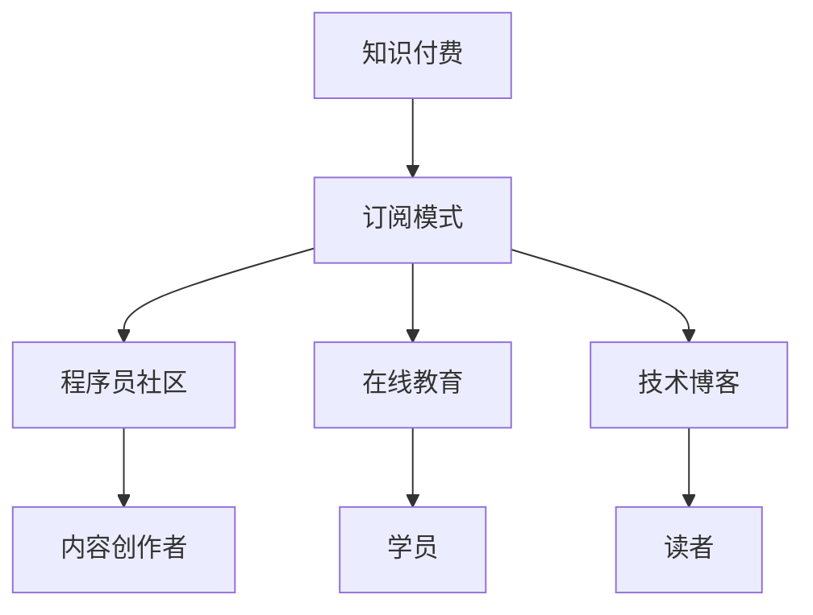

                 

# 程序员如何打造知识付费的订阅模式

> 关键词：知识付费, 订阅模式, 程序员, 在线教育, 商业模型, 技术栈

## 1. 背景介绍

### 1.1 问题由来
随着知识经济时代的到来，知识付费成为越来越多人的选择。在线教育平台、编程社区、技术博客等各类知识传播渠道涌现，为专业人士提供了展示才华、变现价值的机会。然而，知识付费并非仅限于内容创作和分享，如何构建一套完整的商业模式，实现用户、内容创作者和平台的共赢，成为当下亟待解决的难题。

### 1.2 问题核心关键点
构建知识付费订阅模式的核心在于：
1. **用户价值定位**：明确目标用户群体及其需求，为其提供定制化的知识服务。
2. **盈利模式设计**：设计合理的收费策略，确保平台和内容创作者都能从中获益。
3. **内容质量保证**：确保内容的高质量与原创性，提升用户满意度和平台信誉。
4. **用户体验优化**：提供便捷的订阅、学习和反馈机制，提高用户粘性。
5. **数据驱动决策**：通过数据分析指导内容创作和模式调整，持续优化商业模式。

### 1.3 问题研究意义
研究如何打造知识付费订阅模式，对程序员和IT行业具有重要意义：

1. **技能提升**：帮助程序员持续学习新技术、新知识，保持竞争力。
2. **职业发展**：为有志于创业的程序员提供商业模式和运营策略参考。
3. **资源整合**：促进知识创作者、平台和用户之间的良性互动和资源共享。
4. **收入多元化**：为程序员提供多元化的收入来源，缓解单一技术栈带来的收入风险。

## 2. 核心概念与联系

### 2.1 核心概念概述

为更好地理解知识付费订阅模式的构建，本节将介绍几个密切相关的核心概念：

- **知识付费**：用户为获取知识或服务而支付费用的模式。涵盖内容创作、在线课程、咨询辅导等多种形式。
- **订阅模式**：用户定期支付费用获取某项服务的模式。常见于SaaS、在线教育、媒体等。
- **程序员社区**：由程序员组成的在线交流平台，提供技术讨论、资源分享、招聘信息等服务。
- **在线教育**：通过网络提供教育服务，包括课程、培训、直播等，涵盖多个学科和技术栈。
- **技术博客**：程序员或技术专家创建的博客，分享技术见解、项目经验、学习心得等。
- **知识创作者**：生产、分享知识的专业人士，如博主、讲师、开发者等。

这些核心概念之间的逻辑关系可以通过以下Mermaid流程图来展示：



这个流程图展示的知识付费订阅模式的各个组成部分及其关联：

1. 知识付费作为整体模式，支撑多种形式的在线服务。
2. 订阅模式是其核心商业模式，通过定期付费实现平台盈利。
3. 程序员社区、在线教育和技术博客作为知识付费的子领域，分别服务于程序员群体、广大学生和技术爱好者。
4. 内容创作者为知识付费的核心，提供高质量内容以满足用户需求。

## 3. 核心算法原理 & 具体操作步骤
### 3.1 算法原理概述

知识付费订阅模式的核心算法原理在于，通过分析用户行为、支付意愿和内容需求，设计合理的定价策略和订阅方案，最大化用户价值和平台收益。

- **用户价值分析**：通过问卷调查、行为数据等方式，了解用户对知识付费的接受度和支付意愿。
- **定价策略设计**：根据用户价值分析结果，设计不同价格层次的订阅服务。
- **订阅方案优化**：基于用户反馈和数据分析，动态调整订阅方案，提升用户体验。
- **内容推荐算法**：利用推荐算法，为用户提供个性化推荐，增加用户粘性。

### 3.2 算法步骤详解

构建知识付费订阅模式的主要步骤如下：

**Step 1: 用户价值分析**

- 设计问卷调查，收集用户对知识付费的接受度、支付意愿等信息。
- 分析用户行为数据，了解其浏览、购买、订阅等关键行为。
- 通过用户画像和数据分析，确定核心用户群体和关键需求。

**Step 2: 定价策略设计**

- 根据用户价值分析结果，设计不同价格层次的订阅服务。
- 引入动态定价机制，根据市场变化和用户需求调整价格。
- 设计灵活的付费计划，如月卡、季卡、年卡等，满足不同用户的需求。

**Step 3: 订阅方案优化**

- 根据用户反馈和数据分析，动态调整订阅方案。
- 引入用户评价和评分系统，评估订阅服务质量。
- 提供试用期或免费体验，降低用户试用门槛。

**Step 4: 内容推荐算法**

- 使用协同过滤、基于内容的推荐算法，为用户提供个性化内容推荐。
- 引入深度学习模型，如Transformer、神经协同过滤等，提升推荐效果。
- 实时更新推荐内容，确保用户获得最新、最相关的信息。

**Step 5: 运营与迭代**

- 定期收集用户反馈，优化订阅服务和内容推荐。
- 引入A/B测试，验证不同的定价策略和订阅方案。
- 持续迭代优化，提升用户体验和平台收益。

### 3.3 算法优缺点

知识付费订阅模式具有以下优点：
1. 直接获取稳定收益：通过订阅费直接获取稳定收入，避免依赖广告或会员费。
2. 用户粘性高：定期付费使用户产生长期依赖，增加用户粘性和平台忠诚度。
3. 内容质量保障：平台对内容创作者有较高的要求，保证内容的高质量。
4. 多元化收入来源：除了订阅费，还可以通过广告、赞助、会员等多元化方式增加收入。

同时，该模式也存在一些缺点：
1. 用户流失风险：用户流失后难以再挽回，影响平台收益。
2. 内容创作者依赖：过于依赖内容创作者，内容供给不稳定。
3. 运营成本高：需要持续投入人力和资源进行运营和优化。
4. 市场竞争激烈：各知识付费平台竞争激烈，难以形成垄断优势。

尽管存在这些局限性，但就目前而言，知识付费订阅模式仍是最为稳定和有效的商业模式之一。未来相关研究的重点在于如何进一步降低运营成本，优化订阅方案，同时兼顾内容质量和用户满意度等因素。

### 3.4 算法应用领域

知识付费订阅模式在知识共享和在线教育领域已经得到了广泛应用，覆盖了几乎所有常见的知识传播方式，例如：

- 编程社区订阅：如CSDN、Stack Overflow等，提供技术文章、项目讨论、招聘信息等服务，通过订阅获取内容。
- 在线课程平台：如Coursera、Udacity等，提供各类在线课程，通过订阅获取课程学习服务。
- 技术博客订阅：如阮一峰、老猫等，通过订阅获取博客文章更新和独家资源。
- 编程问答社区：如知乎、GitHub等，提供编程问答、代码分享、技术交流等服务，通过订阅获取高质量内容。

除了上述这些经典应用外，知识付费订阅模式还被创新性地应用到更多场景中，如AI算法培训、开源社区会员、职业培训等，为知识创作者提供新的收入渠道。

## 4. 数学模型和公式 & 详细讲解 & 举例说明

### 4.1 数学模型构建

本节将使用数学语言对知识付费订阅模式进行更加严格的刻画。

设知识付费平台上有 $N$ 个用户，每个用户每月愿意支付的订阅费用为 $C_i$，平台提供 $K$ 种订阅服务，每项服务的定价为 $P_k$，其中 $k=1,2,...,K$。用户选择订阅服务 $k$ 的概率为 $p_k$，且满足：

$$
\sum_{k=1}^K p_k = 1
$$

用户的总收益 $R$ 为所有用户支付的订阅费用之和，即：

$$
R = \sum_{i=1}^N C_i = \sum_{i=1}^N \sum_{k=1}^K P_k p_k
$$

优化目标为最大化平台的总收益 $R$。

### 4.2 公式推导过程

为了方便推导，我们假设所有用户对订阅服务的需求为等概率分布，即 $p_k = \frac{1}{K}$。则总收益 $R$ 可以简化为：

$$
R = \frac{1}{K} \sum_{k=1}^K K P_k
$$

进一步简化，得：

$$
R = \sum_{k=1}^K P_k
$$

这表明，总收益 $R$ 与每项服务的定价 $P_k$ 成正比。为了最大化 $R$，需要选择最合理的定价策略。

### 4.3 案例分析与讲解

假设平台有三种订阅服务：基础版、中级版和高级版，每月定价分别为 $P_1 = 10$、$P_2 = 20$、$P_3 = 30$。根据用户分析，平台预计基础版、中级版和高级版的订阅用户比例为 $p_1 = 0.5$、$p_2 = 0.3$、$p_3 = 0.2$。

我们可以计算出平台总收益 $R$ 为：

$$
R = P_1 p_1 + P_2 p_2 + P_3 p_3 = 10 \times 0.5 + 20 \times 0.3 + 30 \times 0.2 = 18
$$

因此，最合理的定价策略应该是 $P_1 = 10$、$P_2 = 20$、$P_3 = 30$。

## 5. 项目实践：代码实例和详细解释说明
### 5.1 开发环境搭建

在进行知识付费订阅模式开发前，我们需要准备好开发环境。以下是使用Python进行Flask开发的环境配置流程：

1. 安装Python和Flask：
```bash
conda create -n knowledge-payment python=3.8 flask==1.1.2
conda activate knowledge-payment
pip install flask
```

2. 创建Flask项目：
```bash
mkdir knowledge-payment
cd knowledge-payment
```

3. 编写Flask应用代码：
```python
from flask import Flask, request, jsonify

app = Flask(__name__)

@app.route('/subscribe', methods=['POST'])
def subscribe():
    user = request.json['user']
    subscription = request.json['subscription']
    # 处理订阅逻辑
    return jsonify({'success': True})

if __name__ == '__main__':
    app.run(debug=True, port=5000)
```

4. 运行Flask应用：
```bash
flask run
```

### 5.2 源代码详细实现

以下是Flask应用代码的详细实现，包括订阅处理和用户管理：

```python
from flask import Flask, request, jsonify

app = Flask(__name__)

# 用户列表
users = {
    'alice': {'name': 'Alice', 'balance': 0, 'subscription': None},
    'bob': {'name': 'Bob', 'balance': 0, 'subscription': None}
}

# 订阅服务价格
subscription_prices = {
    'basic': 10,
    'premium': 20,
    'advanced': 30
}

@app.route('/subscribe', methods=['POST'])
def subscribe():
    user = request.json['user']
    subscription = request.json['subscription']
    if user in users:
        # 更新用户订阅状态
        users[user]['subscription'] = subscription
        # 更新用户余额
        users[user]['balance'] -= subscription_prices[subscription]
        return jsonify({'success': True})
    else:
        return jsonify({'success': False})

@app.route('/users', methods=['GET'])
def get_users():
    # 返回用户列表
    return jsonify(users)

if __name__ == '__main__':
    app.run(debug=True, port=5000)
```

### 5.3 代码解读与分析

让我们再详细解读一下关键代码的实现细节：

**Flask应用**：
- 使用Flask框架，创建了订阅处理接口 `/subscribe` 和用户管理接口 `/users`。
- 定义了用户列表 `users` 和订阅服务价格 `subscription_prices`。
- 订阅处理接口 `/subscribe` 接收用户和订阅服务信息，更新用户订阅状态和余额。

**用户管理接口**：
- `/users` 接口返回用户列表。

**代码实现**：
- 订阅处理接口使用 POST 方法，接收 JSON 格式的请求数据。
- 用户管理接口使用 GET 方法，返回用户列表。

### 5.4 运行结果展示

启动Flask应用后，可以在浏览器中访问 `http://localhost:5000`，进行订阅操作和用户管理。

## 6. 实际应用场景
### 6.1 知识付费平台

基于知识付费订阅模式，可以构建一个专注于程序员技能提升的知识付费平台。平台提供各类编程课程、技术博客、代码分享等服务，用户可以通过订阅获取高质量内容。

在技术实现上，可以设计基础版、中级版和高级版三种订阅服务，分别提供不同级别的学习资源和社区服务。用户可以根据需求选择订阅，平台根据订阅收益进行内容生产和维护。

### 6.2 在线学习社区

在线学习社区也可以采用知识付费订阅模式，提供视频课程、直播讲座、项目实战等服务。社区管理者可以设计不同的付费计划，如单次课程购买、月卡、季卡等，满足用户多样化的学习需求。

在实际应用中，可以引入AI推荐算法，根据用户的学习记录和偏好，推荐个性化课程和学习资源，提升学习效果。

### 6.3 编程技术交流

编程技术交流社区可以采用知识付费订阅模式，提供技术问答、代码讨论、招聘信息等服务。社区管理者可以根据用户活跃度，设计不同等级的会员权限，提供更多特权服务。

在技术实现上，可以设计免费版和付费版两种服务，免费版提供基本问答和讨论服务，付费版提供更多特权和高级功能。

### 6.4 未来应用展望

随着知识付费订阅模式的发展，未来将在更多领域得到应用，为知识创作者提供新的商业机会，为用户提供更多元化的学习资源：

- **企业内训**：企业可以采用知识付费订阅模式，为员工提供定制化的技术培训，提升员工技能，同时节约培训成本。
- **职业认证**：各类职业认证机构可以采用知识付费订阅模式，提供全面的职业培训课程，帮助学员取得认证证书。
- **开源社区**：开源社区可以采用知识付费订阅模式，提供高质量的开源项目、工具和技术支持，提升社区活跃度和贡献度。
- **教育行业**：教育机构可以采用知识付费订阅模式，提供多样化的在线课程和学习资源，满足不同年龄段和需求的用户。

未来，知识付费订阅模式将成为知识创作者和用户之间重要的连接方式，促进知识传播和应用，加速技术创新和产业发展。

## 7. 工具和资源推荐
### 7.1 学习资源推荐

为了帮助开发者系统掌握知识付费订阅模式的核心技术和实现细节，这里推荐一些优质的学习资源：

1. **《Flask Web Development》书籍**：介绍Flask框架的基础知识和高级应用，是Flask开发的必备资料。
2. **《Python Web Development》课程**：Udemy上的Python全栈开发课程，涵盖Flask、Django等主流框架，适合初学者和进阶开发者。
3. **《知识付费：订阅模式》论文**：探索知识付费订阅模式的理论基础和实现策略，提供丰富的案例分析和算法推导。
4. **《知识付费平台架构设计》白皮书**：详细介绍知识付费平台的技术架构和系统设计，提供实用的开发和运营建议。

通过对这些资源的学习实践，相信你一定能够快速掌握知识付费订阅模式的精髓，并用于解决实际的NLP问题。

### 7.2 开发工具推荐

高效的开发离不开优秀的工具支持。以下是几款用于知识付费订阅模式开发的常用工具：

1. **Python**：Python语言的灵活性和可扩展性，使其成为知识付费平台的首选语言。
2. **Flask**：轻量级的Web框架，适合快速迭代和灵活扩展。
3. **SQLite**：轻量级的数据库，适合小型知识付费平台的数据存储和管理。
4. **Redis**：内存数据库，适合处理高并发请求和缓存优化。
5. **Docker**：容器化技术，方便应用的部署和管理。
6. **Grafana**：开源数据可视化工具，适合监控和分析知识付费平台的运营数据。

合理利用这些工具，可以显著提升知识付费订阅模式的开发效率，加快创新迭代的步伐。

### 7.3 相关论文推荐

知识付费订阅模式的研究源于学界的持续研究。以下是几篇奠基性的相关论文，推荐阅读：

1. **《基于订阅模式的知识付费平台设计》**：介绍知识付费订阅模式的基本原理和实现策略，提供丰富的案例分析和算法推导。
2. **《知识付费平台的用户行为分析》**：研究用户行为对知识付费订阅模式的影响，提供基于用户行为分析的内容推荐和定价策略设计。
3. **《知识付费平台的内容质量管理》**：探讨如何保证知识付费平台的内容质量，提供内容审核和评估的机制和算法。
4. **《知识付费平台的收益最大化策略》**：研究如何通过优化订阅模式和定价策略，最大化知识付费平台的收益。

这些论文代表了大语言模型微调技术的发展脉络。通过学习这些前沿成果，可以帮助研究者把握学科前进方向，激发更多的创新灵感。

## 8. 总结：未来发展趋势与挑战
### 8.1 总结

本文对知识付费订阅模式进行了全面系统的介绍。首先阐述了知识付费订阅模式的研究背景和意义，明确了订阅模式在构建知识服务方面的独特价值。其次，从原理到实践，详细讲解了知识付费订阅模式的设计原理和操作步骤，给出了订阅模式开发的完整代码实例。同时，本文还广泛探讨了订阅模式在知识共享、在线教育、技术交流等多个领域的应用前景，展示了订阅模式在知识传播中的巨大潜力。

通过本文的系统梳理，可以看到，知识付费订阅模式正在成为知识创作者和用户之间重要的连接方式，极大地拓展了知识传播的边界，催生了更多的落地场景。得益于知识创作者、平台和用户之间的良性互动和资源共享，知识付费订阅模式必将在构建人机协同的智能时代中扮演越来越重要的角色。

### 8.2 未来发展趋势

展望未来，知识付费订阅模式将呈现以下几个发展趋势：

1. **技术创新不断**：随着AI、大数据等技术的发展，知识付费订阅模式将不断引入新技术，提升用户体验和运营效率。
2. **个性化推荐增强**：通过深度学习和推荐算法，为每个用户提供定制化的内容和个性化服务，提升用户粘性和满意度。
3. **平台生态完善**：知识付费订阅平台将不断拓展服务范围，涵盖更多领域的知识服务，形成完善的生态系统。
4. **多模态交互融合**：知识付费订阅模式将引入语音、视频等多模态交互方式，提升用户的学习效果和互动体验。
5. **社会价值扩大**：知识付费订阅模式将与社会公益和教育事业结合，推动知识共享和社会进步。

这些趋势凸显了知识付费订阅模式的广阔前景。这些方向的探索发展，必将进一步提升知识付费订阅平台的服务水平，推动知识传播和应用。

### 8.3 面临的挑战

尽管知识付费订阅模式已经取得了显著成效，但在迈向更加智能化、普适化应用的过程中，它仍面临着诸多挑战：

1. **用户流失问题**：订阅用户流失后难以挽回，影响平台收益。
2. **内容质量保障**：平台需要持续投入资源保证内容质量，避免劣质内容。
3. **运营成本高**：知识付费订阅模式需要持续运营和优化，运营成本较高。
4. **市场竞争激烈**：各知识付费平台竞争激烈，难以形成垄断优势。
5. **用户需求多样**：用户需求多样，平台需要提供多样化的服务和内容。

尽管存在这些挑战，但知识付费订阅模式仍然是最为稳定和有效的商业模式之一。未来相关研究的重点在于如何进一步降低运营成本，优化订阅方案，同时兼顾内容质量和用户满意度等因素。

### 8.4 研究展望

面对知识付费订阅模式所面临的挑战，未来的研究需要在以下几个方面寻求新的突破：

1. **用户行为分析**：通过深入分析用户行为，设计更具吸引力和定制化的订阅服务。
2. **动态定价策略**：根据市场变化和用户需求，设计动态定价策略，最大化平台收益。
3. **多模态交互设计**：引入多模态交互方式，提升用户体验和学习效果。
4. **内容质量管理**：引入内容审核和评估机制，提升内容质量。
5. **社会价值挖掘**：将知识付费订阅模式与公益和教育事业结合，推动知识共享和社会进步。

这些研究方向的探索，必将引领知识付费订阅模式向更高的台阶，为知识创作者和用户带来更多的价值。

## 9. 附录：常见问题与解答

**Q1：知识付费订阅模式是否适用于所有知识服务？**

A: 知识付费订阅模式适用于大部分知识服务，特别是需要系统化、长期学习的领域，如编程、医学、法律等。对于短期的技能培训、快速获取信息等场景，订阅模式可能不如单次购买或免费提供更合适。

**Q2：如何设计合理的定价策略？**

A: 设计合理的定价策略需要综合考虑用户需求、平台成本和市场竞争。一般建议采用阶梯定价、动态定价等方式，同时引入试用期和用户评价机制，不断优化定价策略。

**Q3：如何提升用户粘性？**

A: 提升用户粘性需要提供高质量内容和个性化服务。可以通过AI推荐算法、用户反馈机制、社交互动等方式，增加用户粘性。同时，提供多样化的订阅服务和特权，满足不同用户的需求。

**Q4：如何管理内容质量？**

A: 内容质量管理需要引入内容审核和评估机制，确保内容的高质量和原创性。可以通过专家评审、用户评分等方式，对内容进行动态管理和优化。

**Q5：如何应对市场竞争？**

A: 应对市场竞争需要不断创新和优化。可以通过技术创新、个性化服务、社会价值挖掘等方式，提升平台的竞争力和用户粘性。同时，加强与其他平台的合作，形成共赢的生态系统。

这些问题的回答展示了知识付费订阅模式的实际应用和未来发展方向。通过不断优化和创新，相信知识付费订阅模式将为知识创作者和用户带来更多价值，推动知识传播和应用。

