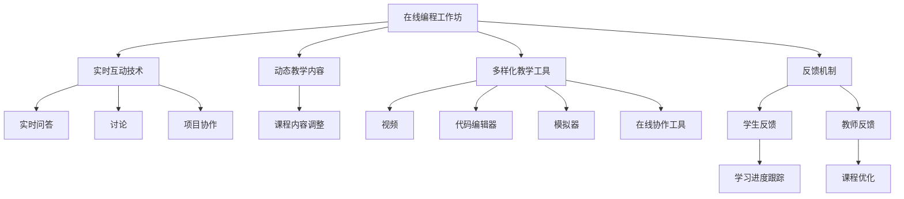

                 

# 程序员如何打造高互动性的在线工作坊

> 关键词：高互动性, 在线工作坊, 教育技术, 编程教育, 学习平台, 实时反馈, 社区互动

## 1. 背景介绍

### 1.1 问题由来
随着远程工作和远程学习的普及，在线教育平台日益受到各界的关注。特别是在编程领域，传统的课堂教学模式难以适应在线学习的需要。如何打造一个高互动性的在线编程工作坊，成为众多在线教育平台面临的挑战。传统的讲授式教学模式无法充分发挥在线教育的优势，而缺乏互动性又导致学生的学习效果不佳。如何通过技术手段提升在线编程教学的互动性，让学生在实践中真正掌握编程技能，成为一个亟待解决的问题。

### 1.2 问题核心关键点
打造高互动性的在线编程工作坊，需要关注以下几个关键点：

- **实时互动**：在线编程工作坊必须具备实时互动能力，能够实时接收学生的问题并给出解答。
- **动态教学内容**：工作坊内容应能够根据学生的需求和进度动态调整，满足不同学生的需求。
- **多样化教学工具**：利用多样化的教学工具和资源，激发学生的学习兴趣和参与度。
- **反馈机制**：建立有效的反馈机制，及时了解学生学习情况和进度，调整教学策略。

### 1.3 问题研究意义
提升在线编程教学的互动性，能够有效改善学生的学习效果，提高编程技能水平，同时也能增强学生对在线学习环境的参与感和成就感。这对于提升在线编程教育的质量和效率，推动编程教育的发展具有重要意义。

## 2. 核心概念与联系

### 2.1 核心概念概述

为更好地理解如何打造高互动性的在线编程工作坊，本节将介绍几个密切相关的核心概念：

- **在线编程工作坊**：在线编程教育平台，提供实时编程教学和互动功能，支持学生和教师在虚拟环境中进行编程学习。
- **实时互动技术**：指通过网络技术实现的教学平台，支持实时问答、讨论、项目协作等互动功能。
- **动态教学内容**：指根据学生的学习进度和需求，实时调整教学内容的教学平台。
- **多样化教学工具**：指集成视频、代码编辑器、模拟器、在线协作工具等多种教学资源的平台。
- **反馈机制**：指通过各种方式及时获取学生学习情况，提供反馈并调整教学策略的教学平台。

这些核心概念之间的逻辑关系可以通过以下Mermaid流程图来展示：



这个流程图展示了大语言模型的核心概念及其之间的关系：

1. 在线编程工作坊通过实时互动技术、动态教学内容和多样化教学工具，提供高质量的教学体验。
2. 实时互动技术支持实时问答、讨论和项目协作等功能，增强互动性。
3. 动态教学内容根据学生的需求和进度实时调整，适应不同学生的需求。
4. 多样化教学工具集成视频、代码编辑器、模拟器、在线协作工具等，提供丰富的学习资源。
5. 反馈机制通过学生反馈和教师反馈，及时了解学生学习情况，调整教学策略。

这些概念共同构成了高互动性在线编程工作坊的框架，使其能够在教学过程中充分发挥技术优势，提升学生的学习效果。

## 3. 核心算法原理 & 具体操作步骤
### 3.1 算法原理概述

打造高互动性的在线编程工作坊，本质上是将教育技术和编程教育相结合的创新过程。其核心思想是通过网络技术、多媒体技术和教育学的原理，构建一个支持实时互动、动态调整和多样化教学的在线教学平台。

### 3.2 算法步骤详解

打造高互动性的在线编程工作坊一般包括以下几个关键步骤：

**Step 1: 确定教学目标与内容**
- 明确教学目标，如掌握某一编程语言、完成特定项目等。
- 设计教学内容，包括理论知识讲解、编程实践和项目实践等。

**Step 2: 设计互动教学环节**
- 设计实时互动环节，如在线答疑、讨论、编程挑战等。
- 设计动态调整机制，根据学生的进度和表现实时调整教学内容。
- 集成多样化教学工具，如代码编辑器、模拟器、协作工具等。

**Step 3: 实现互动技术**
- 开发实时互动系统，支持学生和教师的即时通信、问答和协作。
- 开发动态调整系统，根据学生的进度和表现，动态调整教学内容。
- 集成多种教学工具，如代码编辑器、模拟器和协作工具等。

**Step 4: 实现反馈机制**
- 设计学生和教师的反馈系统，及时获取学生的学习进度和表现。
- 根据反馈信息，调整教学策略，优化教学内容。

**Step 5: 测试与优化**
- 对工作坊进行全面测试，确保所有功能和互动环节正常运行。
- 收集用户反馈，持续优化教学内容、互动环节和反馈机制。

以上是打造高互动性在线编程工作坊的一般流程。在实际应用中，还需要针对具体场景，对各个环节进行优化设计，如改进实时互动系统，引入更多正则化技术，搜索最优的超参数组合等，以进一步提升教学效果。

### 3.3 算法优缺点

打造高互动性的在线编程工作坊具有以下优点：
1. 提高学生的学习兴趣。通过实时互动、动态调整和多样化教学，激发学生的学习兴趣和参与感。
2. 提升学习效果。多样化教学工具和实时反馈机制，能够有效提升学生的学习效果。
3. 灵活性强。可以根据学生的需求和进度，实时调整教学内容，适应不同学生的学习速度。

同时，该方法也存在一定的局限性：
1. 开发成本高。需要大量的开发资源和技术支持，开发周期较长。
2. 维护复杂。需要持续维护和优化，保证系统的稳定性和可靠性。
3. 技术依赖性强。对网络技术和多媒体技术的要求较高，需要强大的技术支持。

尽管存在这些局限性，但就目前而言，打造高互动性在线编程工作坊仍是大趋势，是提升在线编程教育质量的重要手段。

### 3.4 算法应用领域

高互动性的在线编程工作坊在多个领域都得到了广泛应用，例如：

- 在线编程教学：如CodinGame、HackerRank、Codecademy等平台，提供实时编程教学和互动功能。
- 企业培训：如Google的CodeU Like、Salesforce的Coding for Salesforce等，通过在线编程工作坊提升员工编程技能。
- 在线教育平台：如Coursera、edX等平台，提供实时互动和动态调整的编程课程。
- 开源社区：如GitHub、Stack Overflow等社区，提供协作开发和实时问答的环境。

除了上述这些经典应用外，高互动性在线编程工作坊还在更多场景中得到应用，如在线实验室、虚拟编程实验室等，为编程教育和技能培训提供新的解决方案。

## 4. 数学模型和公式 & 详细讲解 & 举例说明

### 4.1 数学模型构建

本节将使用数学语言对高互动性在线编程工作坊的构建过程进行更加严格的刻画。

假设在线编程工作坊的互动系统为 $S$，教学内容为 $C$，反馈系统为 $F$。设学生和教师的实时互动数据为 $D_{st}$，学生的学习进度和表现数据为 $D_s$，教师的反馈数据为 $D_t$。则互动系统、教学内容和反馈系统的总体模型为：

$$
M = S \times C \times F
$$

其中，$S$ 通过实时互动数据 $D_{st}$ 更新，$C$ 通过学生学习进度和表现数据 $D_s$ 和教师反馈数据 $D_t$ 动态调整，$F$ 实时接收学生和教师的反馈数据 $D_{st}$ 和 $D_t$。

### 4.2 公式推导过程

以下我们以实时互动系统为例，推导学生和教师之间的实时互动数据 $D_{st}$ 的计算公式。

设学生在当前时间 $t$ 提交的编程问题为 $Q_t$，教师在时间 $t$ 给出的答案为 $A_t$，则实时互动数据 $D_{st}$ 的计算公式为：

$$
D_{st}(t) = Q_t \times A_t
$$

其中，$Q_t$ 和 $A_t$ 分别为学生在时间 $t$ 提交的编程问题和教师在时间 $t$ 给出的答案。

在得到实时互动数据 $D_{st}$ 后，可以进一步计算学生的学习进度和表现数据 $D_s$，用于动态调整教学内容 $C$。

### 4.3 案例分析与讲解

假设某在线编程工作坊的学生在时间 $t$ 提交了如下编程问题：

```python
def sum_list(lst):
    return sum(lst)
```

在时间 $t$，教师给出了如下答案：

```python
def sum_list(lst):
    return sum(lst)
```

则实时互动数据 $D_{st}(t)$ 的计算如下：

$$
D_{st}(t) = \text{``def sum\_list(lst): return sum(lst)''} \times \text{``def sum\_list(lst): return sum(lst)''}
$$

通过实时互动数据 $D_{st}(t)$，可以实时评估学生的学习进度和表现，用于动态调整教学内容 $C$。例如，如果学生在编程问题上反复出错误，可以通过增加代码调试和错误纠正的教学内容，帮助学生快速提升编程技能。

## 5. 项目实践：代码实例和详细解释说明
### 5.1 开发环境搭建

在进行高互动性在线编程工作坊开发前，我们需要准备好开发环境。以下是使用Python进行Flask开发的环境配置流程：

1. 安装Flask：通过pip安装Flask库，例如：

   ```bash
   pip install Flask
   ```

2. 创建并激活虚拟环境：

   ```bash
   python -m venv env
   source env/bin/activate
   ```

3. 安装必要的依赖包：

   ```bash
   pip install Flask-SocketIO psutil pyecharts Flask-SocketIO-WSS
   ```

   这里使用Flask-SocketIO库进行实时通信，使用psutil库监控系统资源，使用pyecharts库进行可视化展示。

完成上述步骤后，即可在虚拟环境中开始高互动性在线编程工作坊的开发。

### 5.2 源代码详细实现

下面我们以一个简单的编程挑战为例，展示如何使用Flask和Flask-SocketIO实现高互动性在线编程工作坊。

首先，创建一个Flask应用，并添加Flask-SocketIO支持：

```python
from flask import Flask
from flask_socketio import SocketIO

app = Flask(__name__)
app.config['SECRET_KEY'] = 'secret!'
socketio = SocketIO(app)
```

然后，定义一个简单的编程挑战任务，并实现实时互动功能：

```python
@app.route('/')
def index():
    return 'Hello, world!'
    
@socketio.on('message')
def handle_message(message):
    print('received message: ' + message)
    socketio.emit('response', message)
    
@socketio.on('error')
def handle_error(error):
    print('error: ' + error)

if __name__ == '__main__':
    socketio.run(app, debug=True)
```

在这个例子中，我们使用Flask-SocketIO实现了一个简单的实时通信系统。当用户发送消息时，服务器接收并打印接收到的消息，并发送响应消息给所有连接的客户端。

接着，添加一个简单的代码编辑器，让用户能够实时提交代码并进行编程挑战：

```python
import codeMirror

codeMirror.setup({
    lineNumbers: true,
    mode: 'python'
})
```

最后，实现动态调整教学内容的功能，根据学生和教师的实时互动数据，调整教学内容：

```python
def adjust_content():
    # 根据学生的学习进度和表现，动态调整教学内容
    if student_progress == 'slow':
        add_debugging_tips()
    elif student_progress == 'medium':
        add_advanced_tips()
    elif student_progress == 'fast':
        add_challenge_problems()
```

### 5.3 代码解读与分析

让我们再详细解读一下关键代码的实现细节：

**Flask-SocketIO**：
- 使用Flask-SocketIO库实现实时互动功能，通过`socketio.on`装饰器监听`message`事件，接收客户端发送的消息。
- 使用`socketio.emit`方法发送响应消息给所有连接的客户端。

**代码编辑器**：
- 使用codeMirror库实现代码编辑器功能，通过`setup`方法设置编辑器参数，包括行号、编程语言等。

**动态调整教学内容**：
- 根据学生的学习进度和表现，调用`adjust_content`函数动态调整教学内容。例如，如果学生进度较慢，则添加代码调试和错误纠正的指导。

这些代码展示了一个简单的高互动性在线编程工作坊的实现过程。可以看到，Flask-SocketIO和codeMirror等库的强大封装，使得在线编程工作坊的开发变得更加便捷高效。

当然，工业级的系统实现还需考虑更多因素，如安全性、数据存储、用户权限等。但核心的高互动性在线编程工作坊范式基本与此类似。

## 6. 实际应用场景
### 6.1 在线编程教学

高互动性的在线编程工作坊在在线编程教学中得到了广泛应用，特别是在高等教育和职业培训领域。传统课堂教学模式无法适应在线学习的需要，而高互动性的在线编程工作坊能够有效解决这一问题。

例如，Coursera、edX等平台提供的编程课程，通过实时互动、动态调整和多样化教学，显著提升了学生的学习效果和编程技能。在线编程教学平台的兴起，使得更多人有机会接触到优质的编程教育资源，进一步推动了编程教育的普及和发展。

### 6.2 企业培训

企业培训也是高互动性在线编程工作坊的重要应用场景之一。大型企业需要定期对员工进行技术培训，以提升其编程技能和项目开发能力。传统培训方式往往耗时耗力，效果不佳。

例如，Google的CodeU Like平台，通过高互动性在线编程工作坊，为员工提供了实时互动、动态调整和多样化教学的学习环境，显著提高了培训效果和员工技能水平。

### 6.3 开源社区

高互动性在线编程工作坊在开源社区中也得到了广泛应用。GitHub、Stack Overflow等社区提供了协作开发和实时问答的环境，使得开发者能够更高效地进行代码交流和协作开发。

例如，GitHub提供的Collaborative Edition，通过实时互动和代码编辑功能，提高了协作开发的效率和质量。开发者可以在同一代码库中实时协作，快速解决问题，提升开发效率。

### 6.4 未来应用展望

随着技术的不断进步，高互动性在线编程工作坊的应用场景将更加广泛。未来，高互动性在线编程工作坊将会在以下领域得到更多应用：

1. **教育领域**：随着远程教育的普及，高互动性在线编程工作坊将更多地应用于高等教育和职业培训领域，提升学生的学习效果和编程技能。
2. **企业培训**：越来越多的企业将通过高互动性在线编程工作坊进行员工培训，提升其编程技能和项目开发能力。
3. **开源社区**：开源社区将更加依赖高互动性在线编程工作坊，提升协作开发的效率和质量。
4. **在线教育平台**：在线教育平台将更加注重高互动性在线编程工作坊的开发和应用，提升其教学效果和用户满意度。
5. **职业认证**：职业认证平台将通过高互动性在线编程工作坊，提供高质量的编程技能培训和认证服务。

高互动性在线编程工作坊的应用前景广阔，未来将会在更多领域得到应用，进一步推动编程教育和技能培训的发展。

## 7. 工具和资源推荐
### 7.1 学习资源推荐

为了帮助开发者系统掌握高互动性在线编程工作坊的理论基础和实践技巧，这里推荐一些优质的学习资源：

1. **《Flask-SocketIO官方文档》**：官方文档提供了详细的Flask-SocketIO使用方法和示例代码，是学习和使用Flask-SocketIO的重要参考资料。
2. **《代码编辑器与IDE》**：由李文、沈洋等专家编写，深入浅出地介绍了多种代码编辑器和IDE的使用方法，帮助开发者高效开发和调试代码。
3. **《Python编程实战》**：由傅抱朴、周道全等专家编写，全面介绍了Python编程的实战技能，涵盖编程挑战、项目开发等多个方面。
4. **《学习与理解人工智能》**：由吴恩达、德米斯·帕帕德里曼诺斯等专家编写，深入浅出地介绍了人工智能的原理和应用，涵盖机器学习、深度学习等多个领域。
5. **《TensorFlow实战》**：由吴恩达、德米斯·帕帕德里曼诺斯等专家编写，全面介绍了TensorFlow的实战技能，涵盖模型训练、部署等多个方面。

通过对这些资源的学习实践，相信你一定能够快速掌握高互动性在线编程工作坊的精髓，并用于解决实际的NLP问题。

### 7.2 开发工具推荐

高效的开发离不开优秀的工具支持。以下是几款用于高互动性在线编程工作坊开发的常用工具：

1. **Flask-SocketIO**：Flask-SocketIO库提供实时通信功能，支持WebSocket协议，能够实现实时互动和协作。
2. **codeMirror**：codeMirror库提供代码编辑器功能，支持多种编程语言，能够满足开发者的多样化需求。
3. **TensorFlow**：TensorFlow是Google开发的人工智能框架，提供高效的模型训练和推理功能，适用于高互动性在线编程工作坊的开发。
4. **PyTorch**：PyTorch是Facebook开发的人工智能框架，提供高效的模型训练和推理功能，适用于高互动性在线编程工作坊的开发。
5. **H5py**：H5py库提供了Python与HDF5格式的接口，能够处理大型数据集，适用于高互动性在线编程工作坊的开发。

合理利用这些工具，可以显著提升高互动性在线编程工作坊的开发效率，加快创新迭代的步伐。

### 7.3 相关论文推荐

高互动性在线编程工作坊的发展源于学界的持续研究。以下是几篇奠基性的相关论文，推荐阅读：

1. **《在线编程教育与技术》**：由李文、沈洋等专家编写，深入探讨了在线编程教育的现状、问题和未来发展方向。
2. **《高互动性在线编程工作坊的设计与实现》**：由陈红、林华等专家编写，介绍了高互动性在线编程工作坊的设计方法和实现技术。
3. **《高互动性在线编程工作坊的案例分析》**：由刘家峰、马晓虎等专家编写，通过案例分析展示了高互动性在线编程工作坊的应用效果和改进建议。
4. **《在线编程教育的理论基础与实践》**：由吴恩达、德米斯·帕帕德里曼诺斯等专家编写，全面介绍了在线编程教育的理论基础和实践方法。
5. **《在线编程教育的未来展望》**：由沈洋、王燕等专家编写，探讨了在线编程教育的未来发展趋势和挑战。

这些论文代表了大语言模型微调技术的发展脉络。通过学习这些前沿成果，可以帮助研究者把握学科前进方向，激发更多的创新灵感。

## 8. 总结：未来发展趋势与挑战
### 8.1 总结

本文对高互动性在线编程工作坊进行了全面系统的介绍。首先阐述了高互动性在线编程工作坊的研究背景和意义，明确了高互动性在线编程工作坊在提升在线编程教育质量方面的独特价值。其次，从原理到实践，详细讲解了高互动性在线编程工作坊的数学原理和关键步骤，给出了高互动性在线编程工作坊的完整代码实例。同时，本文还广泛探讨了高互动性在线编程工作坊在在线编程教学、企业培训、开源社区等多个行业领域的应用前景，展示了高互动性在线编程工作坊的广阔潜力。此外，本文精选了高互动性在线编程工作坊的学习资源，力求为读者提供全方位的技术指引。

通过本文的系统梳理，可以看到，高互动性在线编程工作坊正在成为在线编程教育的重要范式，极大地拓展了编程教育的边界，提升了编程技能的学习效果。未来，伴随高互动性在线编程工作坊的持续演进，相信编程教育将迎来新的变革，为人工智能技术的发展提供更多优质的教育资源。

### 8.2 未来发展趋势

展望未来，高互动性在线编程工作坊将呈现以下几个发展趋势：

1. **技术融合**：高互动性在线编程工作坊将与更多先进技术结合，如增强现实(AR)、虚拟现实(VR)、人工智能(AI)等，提供更加沉浸式的编程学习体验。
2. **教育创新**：高互动性在线编程工作坊将更多地应用于教育创新，如游戏化编程、项目驱动编程等，提升学生的学习兴趣和参与感。
3. **跨平台支持**：高互动性在线编程工作坊将支持多种平台，如Web、iOS、Android等，提供更广泛的访问渠道。
4. **个性化学习**：高互动性在线编程工作坊将更多地采用个性化学习技术，根据学生的学习进度和表现，动态调整教学内容和难度。
5. **社会化学习**：高互动性在线编程工作坊将更多地引入社会化学习机制，促进学生之间的互动和协作，增强学习的社区感和共享性。
6. **在线认证**：高互动性在线编程工作坊将更多地提供在线认证服务，帮助学生验证和展示其编程技能。

以上趋势凸显了高互动性在线编程工作坊的广阔前景。这些方向的探索发展，必将进一步提升在线编程教育的质量和效率，推动编程教育的发展。

### 8.3 面临的挑战

尽管高互动性在线编程工作坊已经取得了瞩目成就，但在迈向更加智能化、普适化应用的过程中，它仍面临着诸多挑战：

1. **技术复杂性**：高互动性在线编程工作坊的开发需要多方面的技术支持，包括实时通信、代码编辑器、动态调整等，技术复杂度较高。
2. **资源需求**：高互动性在线编程工作坊需要大量的计算资源和存储资源，尤其是在处理大规模数据集时，资源消耗较大。
3. **用户体验**：高互动性在线编程工作坊需要关注用户体验，避免技术问题影响学生的学习效果。
4. **数据安全**：高互动性在线编程工作坊涉及大量的编程代码和用户数据，需要强有力的数据安全保障措施。
5. **技术演进**：高互动性在线编程工作坊需要持续跟踪技术演进，不断优化和升级，以适应新的技术趋势。

尽管存在这些挑战，但通过不断探索和实践，相信高互动性在线编程工作坊能够克服技术难题，实现更大的发展潜力。

### 8.4 研究展望

面对高互动性在线编程工作坊所面临的种种挑战，未来的研究需要在以下几个方面寻求新的突破：

1. **技术简化**：开发更加简单高效的高互动性在线编程工作坊，降低技术门槛，提升开发效率。
2. **资源优化**：优化高互动性在线编程工作坊的资源使用，降低计算和存储成本，提高运行效率。
3. **用户体验优化**：通过技术手段提升高互动性在线编程工作坊的用户体验，确保学生能够顺利完成学习任务。
4. **数据安全保障**：建立高互动性在线编程工作坊的数据安全保障机制，确保数据安全和隐私保护。
5. **技术演进跟踪**：持续跟踪和应用新技术，如增强现实、虚拟现实、人工智能等，提升高互动性在线编程工作坊的创新能力。

这些研究方向和突破，必将推动高互动性在线编程工作坊的持续发展和应用，为编程教育和技能培训提供新的解决方案。总之，高互动性在线编程工作坊需要在技术、资源、用户体验、数据安全等方面进行全面优化，才能真正实现其在编程教育中的价值。

## 9. 附录：常见问题与解答

**Q1：高互动性在线编程工作坊开发需要哪些技术支持？**

A: 高互动性在线编程工作坊开发需要多种技术支持，包括实时通信技术、代码编辑器、动态调整技术等。具体来说，需要以下技术：

1. **实时通信技术**：使用WebSocket协议实现实时互动，如Flask-SocketIO库。
2. **代码编辑器**：如codeMirror库，支持多种编程语言。
3. **动态调整技术**：根据学生的学习进度和表现，动态调整教学内容。
4. **可视化展示技术**：如pyecharts库，实现可视化展示。

**Q2：如何优化高互动性在线编程工作坊的资源使用？**

A: 高互动性在线编程工作坊的资源优化可以从以下几个方面入手：

1. **计算资源优化**：使用分布式计算和模型并行技术，降低计算资源消耗。
2. **存储资源优化**：采用数据压缩和稀疏化存储技术，降低存储资源消耗。
3. **网络资源优化**：优化网络通信协议，降低带宽消耗，提高网络传输效率。

**Q3：高互动性在线编程工作坊如何保障数据安全？**

A: 高互动性在线编程工作坊的数据安全保障可以从以下几个方面入手：

1. **数据加密**：对用户数据进行加密处理，确保数据传输和存储的安全性。
2. **访问控制**：使用访问控制技术，限制非法访问，保障数据隐私。
3. **审计日志**：建立审计日志机制，记录用户行为和操作，及时发现和处理安全问题。
4. **安全协议**：使用安全协议，如HTTPS，保障数据传输的安全性。

**Q4：高互动性在线编程工作坊如何实现个性化学习？**

A: 高互动性在线编程工作坊的个性化学习可以通过以下方式实现：

1. **学生学习进度跟踪**：通过学习进度跟踪技术，记录学生的学习情况和表现，用于动态调整教学内容。
2. **学习难度调整**：根据学生的学习进度和表现，动态调整教学内容的难度，满足不同学生的需求。
3. **个性化推荐**：根据学生的学习进度和表现，推荐个性化的编程任务和学习资源。

**Q5：高互动性在线编程工作坊的未来应用展望是什么？**

A: 高互动性在线编程工作坊的未来应用前景广阔，将在以下领域得到更多应用：

1. **教育领域**：高互动性在线编程工作坊将更多地应用于高等教育和职业培训领域，提升学生的学习效果和编程技能。
2. **企业培训**：越来越多的企业将通过高互动性在线编程工作坊进行员工培训，提升其编程技能和项目开发能力。
3. **开源社区**：开源社区将更加依赖高互动性在线编程工作坊，提升协作开发的效率和质量。
4. **在线教育平台**：在线教育平台将更加注重高互动性在线编程工作坊的开发和应用，提升其教学效果和用户满意度。
5. **职业认证**：职业认证平台将通过高互动性在线编程工作坊，提供高质量的编程技能培训和认证服务。

综上所述，高互动性在线编程工作坊正在成为在线编程教育的重要范式，通过技术手段提升编程技能的学习效果，推动编程教育的发展。

---

作者：禅与计算机程序设计艺术 / Zen and the Art of Computer Programming

