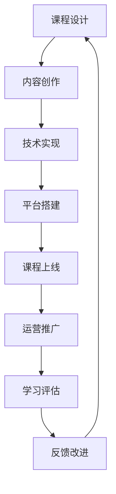

                 

## 1. 背景介绍

随着互联网的普及和技术的进步，在线教育正成为一种快速增长、广受欢迎的学习方式。与此同时，程序员在线视频课程的兴起，满足了人们对于高效、灵活、个性化学习的需求，同时也为传统教育带来了新的挑战和机遇。如何在纷繁复杂的环境中，打造高质量、受欢迎的在线视频课程，成为程序员和教育从业者共同关心的话题。本文将系统探讨程序员如何打造高质量的在线视频课程，涉及课程设计、技术实现、运营推广等各个方面，为教育从业者和程序员提供全面的指导。

## 2. 核心概念与联系

### 2.1 核心概念概述

在探讨如何打造高质量的在线视频课程前，首先需要理解几个核心概念及其相互关系：

1. **MOOCs（大规模开放在线课程）**：指通过互联网平台，向全球范围内的大规模用户提供免费或付费的在线课程。MOOCs通常包含视频、测验、讨论等多种教学形式，以丰富的多媒体手段提升学习体验。

2. **翻转课堂（Flipped Classroom）**：指将传统的课堂讲授和课后作业翻转，即学生在课前通过在线视频学习知识，课堂上进行互动讨论和实践，从而提升学习效果。

3. **微课程（Micro-Course）**：指聚焦于某个知识点或技能点的短小精悍的在线课程。微课程强调知识的深度而非广度，适合时间有限的场景。

4. **知识图谱（Knowledge Graph）**：指将知识结构化并以图形方式呈现的技术。通过知识图谱，可以更好地组织和关联课程内容，提升学习效率。

5. **自适应学习系统（Adaptive Learning System）**：指能够根据学生的学习情况和反馈，动态调整教学内容和难度的系统。自适应学习系统通过数据分析和算法优化，提供个性化的学习路径。

### 2.2 核心概念原理和架构的 Mermaid 流程图



这个流程图展示了从课程设计到学习评估的整个在线视频课程开发流程。

## 3. 核心算法原理 & 具体操作步骤

### 3.1 算法原理概述

高质量的在线视频课程开发涉及多个关键环节，包括课程设计、内容创作、技术实现、平台搭建、运营推广和学习评估等。以下是各个环节的算法原理概述：

1. **课程设计**：确定课程目标、学习路径、知识点结构等，是整个课程开发的起点。

2. **内容创作**：编写高质量的教学内容，包括视频讲解、代码示例、习题练习等，是课程质量的核心。

3. **技术实现**：开发在线视频平台，实现视频上传、播放、互动等功能，是课程在线化的保障。

4. **平台搭建**：搭建适合的视频课程平台，包括用户注册、登录、课程管理、互动社区等功能，是用户使用的基础。

5. **运营推广**：通过营销手段提升课程知名度和用户参与度，是课程持续发展的重要环节。

6. **学习评估**：通过测评、考试、作业等手段，评估学生学习效果，为后续改进提供依据。

### 3.2 算法步骤详解

#### 3.2.1 课程设计

1. **确定课程目标**：明确课程旨在解决的问题、期望达成的学习效果。
2. **制定学习路径**：规划课程的学习顺序和难度，确保知识点的连贯性和递进性。
3. **设计知识点结构**：将课程内容分解为多个知识点，每个知识点独立成章，便于学生理解和掌握。

#### 3.2.2 内容创作

1. **编写教学视频**：制作高质量的视频讲解，注意语言清晰、内容精炼，涵盖核心知识点和难点。
2. **编写代码示例**：提供实际项目中的代码示例，帮助学生理解和应用所学知识。
3. **设计练习和测验**：设计针对知识点的练习和测验题目，及时反馈学生学习情况。

#### 3.2.3 技术实现

1. **选择技术栈**：根据课程需求选择合适的技术栈，如HTML、CSS、JavaScript、React等。
2. **搭建视频服务器**：搭建视频流媒体服务器，支持视频的上传、播放和流式传输。
3. **实现互动功能**：开发论坛、聊天室、作业提交等互动功能，提升学习体验。

#### 3.2.4 平台搭建

1. **选择平台架构**：根据课程规模和用户需求选择合适的平台架构，如单体应用、微服务架构等。
2. **搭建用户管理系统**：实现用户注册、登录、个人信息管理等功能。
3. **实现课程管理功能**：实现课程列表、课程预览、课程详情等功能。

#### 3.2.5 运营推广

1. **制定营销策略**：通过社交媒体、SEO、邮件营销等手段提升课程知名度。
2. **优化用户体验**：通过用户反馈不断优化平台功能和用户体验。
3. **拓展合作渠道**：与企业、机构等合作，提升课程覆盖范围和影响力。

#### 3.2.6 学习评估

1. **设计测评题目**：设计涵盖课程核心知识点的测评题目，确保评估的有效性。
2. **实现评估系统**：开发在线测评系统，支持自动批改和结果反馈。
3. **分析学习数据**：通过数据分析，评估课程效果和学生学习情况，为后续改进提供依据。

### 3.3 算法优缺点

#### 3.3.1 优点

1. **灵活性高**：在线视频课程可以根据学生需求和反馈灵活调整内容，实现个性化学习。
2. **覆盖面广**：在线视频课程能够覆盖全球范围内的用户，拓宽知识传播范围。
3. **互动性强**：通过在线互动功能，提升学生参与度和学习效果。

#### 3.3.2 缺点

1. **自主性要求高**：学生需要具备一定的自我管理能力和自律性，才能充分发挥在线视频课程的优势。
2. **技术要求高**：开发和维护在线视频平台需要较高的技术门槛和资源投入。
3. **学习效果依赖平台**：在线视频课程的学习效果高度依赖平台的稳定性和用户体验，一旦平台出现问题，会影响学生学习体验。

### 3.4 算法应用领域

在线视频课程的应用领域非常广泛，涵盖了编程、设计、管理等多个学科。以下列举几个典型的应用场景：

1. **编程入门**：通过在线视频课程，学生可以轻松学习编程语言、数据结构、算法等基础内容。
2. **项目实战**：在线视频课程结合实际项目，提供真实的编程和项目实践机会，提升学生动手能力。
3. **职业培训**：在线视频课程提供职业技能培训，帮助学生掌握职场必备技能，提升就业竞争力。
4. **学术研究**：在线视频课程为学术研究和论文写作提供支持，提升学术水平和研究能力。

## 4. 数学模型和公式 & 详细讲解 & 举例说明

### 4.1 数学模型构建

在线视频课程的开发涉及多个变量和指标，以下构建数学模型以评估课程效果：

设课程总时长为 $T$，课程知识点个数为 $K$，每个知识点的平均讲解时长为 $t_k$，学生观看视频的时间为 $W$，课程完成率为 $C$，测验通过率为 $P$，学生满意度为 $S$。则评估模型为：

$$
M = \frac{W}{T} \times C \times P \times S
$$

其中 $M$ 表示课程效果的综合评估得分。

### 4.2 公式推导过程

1. **课程时长**：将课程时长 $T$ 分解为 $K$ 个知识点的平均讲解时长 $t_k$，即 $T = \sum_{k=1}^K t_k$。
2. **课程完成率**：定义课程完成率为 $C = \frac{W}{T}$，即学生观看视频的时间占课程总时长的时间比例。
3. **测验通过率**：定义测验通过率为 $P = \frac{C}{K}$，即学生完成课程后通过测验的知识点个数占总知识点个数的比例。
4. **学生满意度**：定义学生满意度为 $S$，可通过问卷调查等方式获取。

### 4.3 案例分析与讲解

以一门在线Java编程课程为例，分析其效果评估模型：

1. **课程时长**：课程总时长为100小时，每个知识点的平均讲解时长为1小时。
2. **课程完成率**：学生平均观看视频的时间为80小时，因此课程完成率为80%。
3. **测验通过率**：课程包含10个知识点，学生通过测验的知识点数为8，测验通过率为80%。
4. **学生满意度**：学生满意度为90%。

代入公式，计算课程效果评估得分：

$$
M = \frac{80}{100} \times 80\% \times 80\% \times 90\% = 0.8 \times 0.8 \times 0.8 \times 0.9 = 0.4608
$$

## 5. 项目实践：代码实例和详细解释说明

### 5.1 开发环境搭建

开发环境搭建是课程开发的基础，以下是搭建Python开发环境的步骤：

1. **安装Python**：根据课程需求选择合适的Python版本，如Python 3.8以上。
2. **安装开发工具**：如PyCharm、VSCode等，提供代码编写和调试功能。
3. **配置虚拟环境**：通过virtualenv或conda创建虚拟环境，隔离项目依赖。

### 5.2 源代码详细实现

以下是一个简单的在线视频课程平台开发的源代码实现：

```python
from flask import Flask, render_template, request, redirect
from flask_sqlalchemy import SQLAlchemy

app = Flask(__name__)
app.config['SQLALCHEMY_DATABASE_URI'] = 'sqlite:////tmp/test.db'
db = SQLAlchemy(app)

class User(db.Model):
    id = db.Column(db.Integer, primary_key=True)
    username = db.Column(db.String(50), unique=True, nullable=False)
    password = db.Column(db.String(80), nullable=False)

    def __init__(self, username, password):
        self.username = username
        self.password = password

@app.route('/')
def index():
    return render_template('index.html')

@app.route('/login', methods=['GET', 'POST'])
def login():
    if request.method == 'POST':
        username = request.form['username']
        password = request.form['password']
        user = User.query.filter_by(username=username).first()
        if user and user.password == password:
            session['user_id'] = user.id
            return redirect('/home')
    return render_template('login.html')

@app.route('/home')
def home():
    if 'user_id' not in session:
        return redirect('/login')
    return render_template('home.html')

@app.route('/logout')
def logout():
    session.pop('user_id', None)
    return redirect('/')

if __name__ == '__main__':
    app.run(debug=True)
```

### 5.3 代码解读与分析

1. **Flask框架**：Flask是一个轻量级Web框架，适合快速开发小型Web应用。
2. **SQLAlchemy**：SQLAlchemy是Python的ORM框架，用于数据库操作。
3. **用户管理**：实现用户注册、登录、登出等功能，保证课程平台的安全性。
4. **模板引擎**：使用Jinja2模板引擎，实现动态页面渲染，提升用户体验。
5. **路由配置**：通过路由配置，实现页面请求的响应和跳转。

### 5.4 运行结果展示

启动服务器后，通过浏览器访问 `localhost:5000`，可以进入课程平台主页。用户可以注册登录、浏览课程、观看视频、提交作业、参与讨论等。

## 6. 实际应用场景

### 6.1 在线编程教育平台

在线编程教育平台是程序员在线视频课程的一个重要应用场景。通过在线视频课程，学生可以轻松学习编程语言、数据结构、算法等基础内容，同时结合实际项目进行实战练习，提升编程技能。

### 6.2 企业培训平台

企业可以通过在线视频课程进行内部员工培训，提升员工技能和专业知识，同时降低培训成本和时间。企业可以根据员工需求，定制课程内容和评估标准，提升培训效果。

### 6.3 学术研究平台

在线视频课程为学术研究提供支持，帮助研究人员掌握前沿技术和知识。研究者可以通过在线课程学习最新研究方法和工具，提升学术水平和研究能力。

### 6.4 未来应用展望

未来，在线视频课程将进一步发展，应用于更多领域。例如，通过虚拟现实技术，学生可以更加直观地体验编程环境和项目开发过程。通过人工智能技术，在线视频课程可以提供个性化学习路径和实时反馈，提升学习效果。

## 7. 工具和资源推荐

### 7.1 学习资源推荐

1. **Coursera**：全球知名的在线学习平台，提供高质量的在线视频课程。
2. **edX**：与哈佛大学、麻省理工学院等高校合作，提供丰富的课程资源。
3. **Khan Academy**：提供基础数学、科学、编程等课程，适合不同年龄段的学习者。
4. **Codecademy**：专注于编程技能培训，提供交互式编程练习和项目实战机会。
5. **Udemy**：提供各类课程，包括编程、设计、管理等，满足不同用户需求。

### 7.2 开发工具推荐

1. **PyCharm**：优秀的Python开发工具，提供代码编写、调试和版本控制功能。
2. **VSCode**：轻量级代码编辑器，支持多种编程语言和插件扩展。
3. **Git**：版本控制系统，支持多人协作和代码版本管理。
4. **Docker**：容器化平台，便于应用部署和跨平台运行。
5. **Jenkins**：持续集成工具，支持自动化测试和部署。

### 7.3 相关论文推荐

1. **"Scalable Learning in MOOCs"**：探讨MOOCs的规模和效率问题，提出基于学习数据分析的课程优化方法。
2. **"Flipped Classroom: A Revolutionary Use of Video"**：分析翻转课堂的优势和应用效果，提出基于视频的教学新模式。
3. **"Adaptive Learning: Concepts, Architectures and Tools"**：详细介绍自适应学习系统的设计和实现，提升个性化学习体验。

## 8. 总结：未来发展趋势与挑战

### 8.1 研究成果总结

本文系统探讨了程序员如何打造高质量的在线视频课程，涉及课程设计、内容创作、技术实现、平台搭建、运营推广和学习评估等各个环节。通过详细讲解和案例分析，为教育从业者和程序员提供了全面的指导。

### 8.2 未来发展趋势

未来，在线视频课程将更加注重个性化和互动性，结合人工智能、虚拟现实等新技术，提供更丰富的学习体验。同时，在线课程的运营和推广也将更加智能化和精准化，通过数据分析和算法优化，提升课程效果和用户满意度。

### 8.3 面临的挑战

尽管在线视频课程发展前景广阔，但也面临着诸多挑战：

1. **内容质量保障**：如何保证课程内容的优质和更新，提升学生学习效果。
2. **技术门槛高**：开发和维护在线视频课程需要较高的技术门槛和资源投入。
3. **用户体验优化**：提升平台的用户体验，满足不同用户需求，增加用户粘性。
4. **持续运营挑战**：在线视频课程需要持续投入资源进行维护和更新，保证课程的长期运营。

### 8.4 研究展望

未来的研究需要在以下几个方面寻求新的突破：

1. **内容多样化**：结合视频、音频、文本等多种形式，提供多样化的课程内容，提升学习效果。
2. **交互式学习**：开发更加互动和自适应的学习系统，提升学生的参与度和自主性。
3. **智能化分析**：通过大数据和人工智能技术，实现学习行为的智能分析和个性化推荐。
4. **跨平台应用**：开发跨平台的学习平台，支持移动设备、PC等多种终端的使用。

## 9. 附录：常见问题与解答

**Q1: 如何保证课程内容的质量？**

A: 高质量的课程内容需要经过精心的设计和制作。课程设计应遵循“SMART”原则（Specific、Measurable、Achievable、Relevant、Time-bound），确保目标明确、内容具体、可衡量、可实现、相关且有时限。同时，课程制作应由有经验的专业团队完成，确保内容的准确性和权威性。

**Q2: 如何提升学生的参与度？**

A: 互动性是提升学生参与度的关键。可以采用以下方式：

1. **实时互动**：通过实时聊天室、论坛等方式，增强学生的互动和交流。
2. **测验和反馈**：设计定期的测验和作业，及时反馈学生的学习情况，提升学习动力。
3. **项目实战**：结合实际项目进行实战练习，增加学生的实际动手能力。

**Q3: 如何优化用户体验？**

A: 优化用户体验需要从多个方面入手：

1. **界面设计**：注重界面设计的美观和简洁，提供良好的用户体验。
2. **性能优化**：优化课程平台的性能，提升页面加载速度和响应速度。
3. **用户反馈**：通过用户反馈不断优化平台功能和用户体验。

**Q4: 如何保证课程的长期运营？**

A: 课程的长期运营需要持续的投入和维护：

1. **内容更新**：定期更新课程内容，保持课程的时效性和相关性。
2. **技术升级**：及时升级平台技术，保证系统的稳定性和安全性。
3. **营销推广**：通过营销手段提升课程知名度和用户参与度。

---

作者：禅与计算机程序设计艺术 / Zen and the Art of Computer Programming

