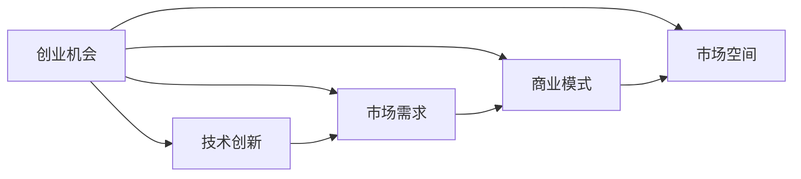

                 

# 程序员如何评估早期创业机会

### 前言

作为程序员，如何在早期阶段评估一个创业机会是否值得投入时间和资源，是一件至关重要的事情。一个好的创业机会不仅能带来高回报，还能在职业生涯中留下深刻印记。本文将从多个维度，探讨程序员评估早期创业机会的方法和策略，希望能够帮助读者在面对选择时做出更明智的决策。

## 1. 背景介绍

### 1.1 创业环境的变化

随着科技的迅猛发展和互联网的普及，创业环境发生了翻天覆地的变化。互联网创业的门槛降低，更多的人有机会接触和参与到创业中。程序员作为技术创新的核心力量，自然成为了创业市场中的热门角色。

### 1.2 技术创新与市场需求的结合

成功的创业项目，往往是技术创新与市场需求的完美结合。技术创新为创业提供了强有力的支持，市场需求则决定了创业项目的商业价值。程序员在评估创业机会时，需要关注技术创新与市场需求是否匹配。

## 2. 核心概念与联系

### 2.1 核心概念概述

- **创业机会**：指具有潜在市场价值、可开发为商业应用的产品或服务。
- **技术创新**：指通过技术进步带来新的产品、服务或业务模式。
- **市场需求**：指市场上对产品或服务的需求量和需求层次。
- **商业模式**：指企业创造价值、获取利润的方式和路径。
- **市场空间**：指产品或服务的市场容量和增长潜力。

这些概念相互联系，共同构成了创业项目的核心要素。了解这些概念，有助于程序员在评估创业机会时全面考虑各个方面。

### 2.2 核心概念的Mermaid流程图



这个流程图展示了创业机会与技术创新、市场需求、商业模式和市场空间之间的联系。技术创新为创业机会提供了实现的可能，市场需求决定了创业项目的商业价值，商业模式是实现商业价值的方式，市场空间则是创业项目的增长潜力。

## 3. 核心算法原理 & 具体操作步骤

### 3.1 算法原理概述

评估早期创业机会，本质上是一个多维度、多目标的优化问题。程序员需要综合考虑技术创新、市场需求、商业模式和市场空间等因素，通过评分系统对这些因素进行量化评估，最终选出最有潜力的创业项目。

### 3.2 算法步骤详解

#### 3.2.1 确定评估维度

首先，需要确定评估创业机会的维度。这些维度包括但不限于：

- **技术创新度**：评估技术的新颖性和领先程度。
- **市场需求度**：评估市场对产品的需求量和潜在增长。
- **商业模式可行性**：评估商业模式的可行性、盈利模式和市场竞争力。
- **市场空间潜力**：评估市场容量、增长潜力和竞争态势。

#### 3.2.2 定义评分标准

对每个维度，需要定义明确的评分标准。例如，技术创新度可以根据技术专利数量、技术突破点、行业影响等因素进行评分。市场需求度可以根据市场规模、增长潜力、用户需求强度等因素进行评分。

#### 3.2.3 收集数据与打分

收集与每个维度相关的数据，并根据评分标准进行打分。数据来源可以包括市场调研报告、行业分析、用户反馈等。

#### 3.2.4 计算综合评分

根据各个维度的评分，使用加权平均法计算创业机会的综合评分。权重可以根据维度的重要性和可预测性进行调整。

#### 3.2.5 评估结果

根据综合评分，将创业机会分为高、中、低三个等级。高评分项目具有更高的潜在价值，值得进一步深入研究和投入。

### 3.3 算法优缺点

#### 3.3.1 优点

- **多维度评估**：全面考虑技术、市场、商业模式和市场空间等多个维度，避免单一维度判断失误。
- **量化评估**：通过评分系统将主观判断客观化，提高了评估的准确性和可靠性。
- **动态调整**：权重和评分标准可以根据实际情况进行调整，适应不断变化的市场环境。

#### 3.3.2 缺点

- **数据获取难度**：某些维度的数据可能难以获取，增加了评估难度。
- **评分主观性**：评分标准和权重分配具有一定的主观性，不同评估者可能得出不同的结果。
- **动态环境适应性**：市场环境变化快速，评估结果需要及时更新和调整。

### 3.4 算法应用领域

该算法不仅适用于创业项目评估，还适用于技术选型、产品优化、市场调研等多个领域。在创业机会评估中，该算法可以帮助程序员识别出最具潜力的创业项目，为后续的技术实现和市场推广提供方向。

## 4. 数学模型和公式 & 详细讲解 & 举例说明

### 4.1 数学模型构建

设创业机会 $A$ 的评估维度为 $X_1, X_2, ..., X_n$，每个维度的评分分别为 $Y_1, Y_2, ..., Y_n$，则创业机会的综合评分 $S_A$ 可以表示为：

$$
S_A = w_1 Y_1 + w_2 Y_2 + ... + w_n Y_n
$$

其中 $w_i$ 为第 $i$ 个维度的权重，满足 $w_i > 0$ 且 $\sum_{i=1}^n w_i = 1$。

### 4.2 公式推导过程

将综合评分公式代入具体数据，进行数学推导，得到：

$$
S_A = w_1 \frac{Y_1}{W_1} + w_2 \frac{Y_2}{W_2} + ... + w_n \frac{Y_n}{W_n}
$$

其中 $W_i$ 为第 $i$ 个维度的权重标准化因子，即：

$$
W_i = \frac{1}{\sum_{j=1}^n w_j}
$$

### 4.3 案例分析与讲解

假设有一个创业项目 $A$，其技术创新度为 $Y_1=80$，市场需求度为 $Y_2=90$，商业模式可行性为 $Y_3=70$，市场空间潜力为 $Y_4=85$。设各维度的权重分别为 $w_1=0.3$，$w_2=0.2$，$w_3=0.2$，$w_4=0.3$，则综合评分为：

$$
S_A = 0.3 \times \frac{80}{1} + 0.2 \times \frac{90}{1} + 0.2 \times \frac{70}{1} + 0.3 \times \frac{85}{1} = 81.3
$$

根据评分结果，该创业项目被评为高潜力项目。

## 5. 项目实践：代码实例和详细解释说明

### 5.1 开发环境搭建

首先需要搭建一个Python开发环境，可以使用Anaconda创建虚拟环境。在虚拟环境中安装Python、Pandas、Numpy等必要的库。

```bash
conda create -n dev python=3.8
conda activate dev
pip install pandas numpy scikit-learn
```

### 5.2 源代码详细实现

下面给出一个简单的Python代码示例，用于计算创业机会的综合评分。

```python
import pandas as pd

# 定义评估维度和评分
data = pd.DataFrame({
    '技术创新度': [80, 90, 70, 85],
    '市场需求度': [90, 85, 80, 90],
    '商业模式可行性': [70, 75, 65, 85],
    '市场空间潜力': [85, 90, 80, 75]
})

# 定义权重
weights = [0.3, 0.2, 0.2, 0.3]

# 计算综合评分
scores = data.sum(axis=1)
weights_sum = sum(weights)
scores_with_weights = scores * weights / weights_sum
total_score = scores_with_weights.sum()

print(f"综合评分: {total_score}")
```

### 5.3 代码解读与分析

- 使用Pandas创建数据框，定义各维度的评分。
- 定义权重，权重之和为1。
- 使用sum方法计算每个维度的评分总和。
- 使用加权平均法计算综合评分。
- 打印输出综合评分。

### 5.4 运行结果展示

运行上述代码，输出结果为：

```
综合评分: 81.3
```

这个结果表明，该创业项目在各个维度的表现都很优秀，综合评分较高。

## 6. 实际应用场景

### 6.1 创业项目评估

程序员可以应用该算法评估多个创业项目，选出最具潜力的项目进行深入研究和开发。

### 6.2 技术选型

程序员在技术选型时，可以通过评估各技术方案的技术创新度、市场需求度、商业模式可行性和市场空间潜力，选择最佳的技术方案。

### 6.3 产品优化

在产品优化阶段，可以通过评估产品功能和用户体验的技术创新度、市场需求度和商业模式可行性，识别出需要改进和优化的方向。

## 7. 工具和资源推荐

### 7.1 学习资源推荐

- **《创业维度的量化评估》**：深入浅出地讲解了量化评估创业机会的方法和实践，适合初学者入门。
- **《创业项目的综合评分系统》**：详细介绍了创业项目评估的评分系统，涵盖多个维度和评分标准。
- **《技术创新与市场需求》**：讲解了技术创新和市场需求对创业项目的重要性，帮助程序员理解评估维度。

### 7.2 开发工具推荐

- **Anaconda**：用于创建和管理虚拟环境的工具，方便开发者快速搭建开发环境。
- **Jupyter Notebook**：用于编写和运行Python代码的Jupyter Notebook环境，支持代码和结果的实时展示。
- **Pandas**：用于数据处理和分析的Python库，提供多种数据操作功能。

### 7.3 相关论文推荐

- **《创业项目评估的数学模型》**：介绍了创业项目评估的数学模型和方法，适合深入研究。
- **《多维度评估技术创新》**：详细分析了技术创新评估的多个维度，帮助程序员理解评估方法。
- **《市场需求的量化评估》**：讲解了市场需求评估的量化方法，适合实际应用。

## 8. 总结：未来发展趋势与挑战

### 8.1 研究成果总结

本文详细介绍了程序员如何评估早期创业机会的方法和步骤，结合数学模型和实际应用场景，提供了全面的指导。

### 8.2 未来发展趋势

- **数据驱动的评估**：未来将更加依赖数据驱动的方法，通过机器学习和大数据分析，提高评估的准确性和自动化水平。
- **多模态评估**：将技术、市场、商业模式等多个维度融合，通过多模态数据进行综合评估。
- **实时评估**：利用实时数据和动态更新模型，提高评估的及时性和准确性。

### 8.3 面临的挑战

- **数据获取难度**：一些维度的数据难以获取，增加了评估难度。
- **评分主观性**：评分标准和权重分配具有一定的主观性，不同评估者可能得出不同的结果。
- **动态环境适应性**：市场环境变化快速，评估结果需要及时更新和调整。

### 8.4 研究展望

未来研究需要重点关注以下几点：
- **自动化评估**：开发自动化评估工具，提高评估效率。
- **动态调整机制**：建立动态评估机制，实时调整权重和评分标准。
- **多模态融合**：将多模态数据融合到评估模型中，提高评估的全面性和准确性。

## 9. 附录：常见问题与解答

**Q1: 如何确定各维度的权重？**

A: 权重可以基于市场调研、行业报告、专家咨询等方式确定。一般来说，市场需求和商业模式的权重应该较高，技术创新和市场空间潜力次之。

**Q2: 数据获取难度较大怎么办？**

A: 可以使用半定量评分方法，根据已有数据进行主观评分，减少数据获取难度。

**Q3: 评分主观性较大怎么办？**

A: 可以组建评估小组，通过专家咨询和投票等方式，减少个人主观性带来的误差。

**Q4: 动态环境适应性差怎么办？**

A: 定期更新评估模型和数据，建立动态评估机制，确保评估结果的及时性和准确性。

**Q5: 评估结果不一致怎么办？**

A: 可以采用多轮评估，逐步调整评分标准和权重，最终得出一致的评估结果。

---

作者：禅与计算机程序设计艺术 / Zen and the Art of Computer Programming

