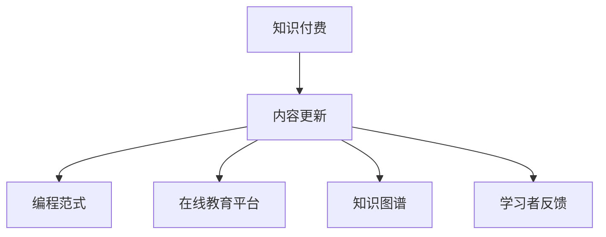

                 

# 程序员如何进行知识付费的内容更新

> 关键词：知识付费, 内容更新, 编程范式, 在线教育, 软件开发, 技术博客

## 1. 背景介绍

### 1.1 问题由来
随着互联网和信息技术的发展，在线教育和知识付费市场迅速崛起。程序员作为信息时代的重要人才，其知识和技能的价值越来越受到重视。传统编程范式已经不能满足当下快速发展的技术需求，程序员需要通过知识付费的形式，将自己的技术和经验传递给更多人，推动知识共享和行业进步。

然而，在知识付费领域，高质量内容的生产和更新成为一大难题。许多程序员虽然具有丰富的编程经验，却缺乏系统的内容更新方法和工具，导致知识付费内容更新缓慢，更新质量参差不齐，影响了学习者的实际效果。因此，如何在知识付费平台上，利用高效、系统的编程范式，进行内容更新和优化，是一个亟待解决的问题。

### 1.2 问题核心关键点
核心问题在于如何设计一个系统化、高效化的知识付费内容更新流程，使得程序员能够快速、高质量地生成和更新内容，提升学习者对课程的满意度。具体来说，包括：

1. 内容更新策略的设计：如何确定课程更新频率和更新内容，保持课程的时效性和吸引力。
2. 知识图谱的构建：如何将程序员的经验和知识，系统地整理成易于理解和应用的知识图谱，方便学习者的快速获取和应用。
3. 在线教育平台的集成：如何将知识付费内容高效地集成到在线教育平台，实现课程的在线发布和更新。
4. 学习者反馈的利用：如何利用学习者反馈，对课程内容进行优化和改进，提升学习效果。
5. 自动化工具的引入：如何引入自动化工具，如代码生成、模板填充等，提高内容更新的效率。

## 2. 核心概念与联系

### 2.1 核心概念概述

为更好地理解知识付费内容更新的方法，本节将介绍几个密切相关的核心概念：

- 知识付费：指用户为获取专业知识和技能而支付费用的模式，常用于在线教育、编程培训等领域。
- 内容更新：指在已有的课程内容基础上，通过修改、补充、添加等方式，更新和优化课程内容，保持其时效性和实用性。
- 编程范式：指编程过程中遵循的一系列规则和模式，如面向对象编程、函数式编程、事件驱动编程等，影响着编程的效率和质量。
- 在线教育平台：指通过互联网提供教育资源和服务的平台，如Coursera、Udemy、Codecademy等，是知识付费的重要载体。
- 知识图谱：指将知识按照概念、关系和属性进行组织和表示的图形结构，常用于知识管理和学习路径规划。
- 学习者反馈：指学习者在学习过程中提出的问题和建议，用于改进课程内容和教学方式。

这些核心概念之间的逻辑关系可以通过以下Mermaid流程图来展示：



这个流程图展示出知识付费内容更新的主要流程：

1. 知识付费平台的知识内容需要定期更新。
2. 程序员根据自身的编程范式，将知识内容进行更新。
3. 更新后的内容通过在线教育平台发布和集成。
4. 同时构建知识图谱，优化学习路径。
5. 利用学习者反馈，不断改进课程内容。

这些概念共同构成了知识付费内容更新的基本框架，程序员可以据此制定系统化的更新策略和方法。

## 3. 核心算法原理 & 具体操作步骤
### 3.1 算法原理概述

知识付费内容更新，本质上是一个需求驱动的动态更新过程。其核心思想是通过在线教育平台的持续反馈和学习者反馈，不断优化和更新知识内容，保持其与时俱进和实用性强。

形式化地，设知识付费平台的内容库为 $C$，更新后的内容库为 $C'$，则更新过程可表示为：

$$
C' = f(C, D, F, P)
$$

其中，$f$ 为更新函数，$D$ 为在线教育平台提供的动态数据，$F$ 为学习者反馈，$P$ 为编程范式和知识图谱。

通过不断的更新和优化，知识付费内容能够更好地适应学习者的需求，提高学习效果和课程满意度。

### 3.2 算法步骤详解

知识付费内容更新的一般流程包括以下几个关键步骤：

**Step 1: 数据收集与整理**

- 收集在线教育平台提供的动态数据，如热门技术趋势、课程需求统计等。
- 通过编程范式，将数据整理成易于理解和应用的知识图谱，如技术栈、代码示例等。

**Step 2: 学习者反馈收集与分析**

- 通过在线教育平台和社区互动，收集学习者对课程内容的评价和建议。
- 利用自然语言处理（NLP）技术，对学习者反馈进行文本分析和情感分析，识别出热点需求和改进方向。

**Step 3: 课程内容更新与优化**

- 根据学习者反馈和编程范式，对课程内容进行针对性的修改和补充。
- 利用自动化工具，如代码生成、模板填充等，提高内容更新的效率。

**Step 4: 知识图谱的构建与维护**

- 构建知识图谱，将课程内容按照概念、关系和属性进行组织和表示。
- 定期更新知识图谱，引入新技术和最佳实践，保持其时效性。

**Step 5: 知识图谱的应用与推广**

- 将知识图谱集成到在线教育平台，供学习者快速获取和应用。
- 通过编程范式，提供课程的在线发布和更新功能，方便学习者随时查看和下载。

### 3.3 算法优缺点

知识付费内容更新的方法具有以下优点：

1. 动态响应需求：能够及时响应学习者的需求，保持课程的时效性和实用性。
2. 高效迭代：通过自动化工具，快速生成和更新课程内容，提升生产效率。
3. 数据驱动：利用在线教育平台的动态数据和学习者反馈，优化课程设计。

同时，该方法也存在一些局限性：

1. 数据隐私：在线教育平台的数据收集和处理涉及隐私问题，需要严格遵循法律法规。
2. 学习者依赖：课程内容的更新依赖于学习者的反馈，难以保证全面性和时效性。
3. 更新成本：编程范式和知识图谱的构建和维护需要一定的时间和成本。

尽管存在这些局限性，但知识付费内容更新方法仍是大规模在线教育的重要补充，对提升学习效果和课程满意度具有重要意义。

### 3.4 算法应用领域

知识付费内容更新的方法在多个领域都有广泛应用，包括但不限于：

- 在线编程教育：如Coursera、Udacity、Codecademy等平台上的编程课程，定期更新课程内容和示例代码。
- 软件开发：如Stack Overflow、GitHub等社区中的技术问答和代码分享，利用知识图谱提升问题解决效率。
- 技术博客与教程：如Medium、CSDN、GitHub上的技术博客，通过知识图谱引导读者阅读和理解技术文章。
- 技术培训与认证：如Oracle、Microsoft、AWS等认证培训课程，根据新技术趋势定期更新课程内容和实践任务。
- 开源项目与社区：如开源项目GitHub上的代码示例和文档，定期更新和优化代码库，提升社区活跃度和代码质量。

这些领域中，知识付费内容更新已经成为程序员获取新知识、提升技能的重要途径。

## 4. 数学模型和公式 & 详细讲解  
### 4.1 数学模型构建

本节将使用数学语言对知识付费内容更新过程进行更加严格的刻画。

设课程内容库 $C=\{c_1, c_2, \ldots, c_n\}$，其中每个 $c_i$ 代表一条知识条目，包含知识点、代码示例、案例分析等内容。在线教育平台提供的动态数据为 $D=\{d_1, d_2, \ldots, d_m\}$，其中每个 $d_i$ 代表一条动态信息，如技术趋势、市场需求等。学习者反馈为 $F=\{f_1, f_2, \ldots, f_k\}$，其中每个 $f_i$ 代表一条学习者评价和建议。编程范式为 $P$，知识图谱为 $G=(V, E)$，其中 $V$ 为知识节点集合，$E$ 为关系集合。

更新后的课程内容库 $C'$ 可由以下公式计算：

$$
C' = f(C, D, F, P)
$$

其中，$f$ 为更新函数，具体如下：

$$
f(c_i, d_j, f_k, p_l) = c_i' + d_j' + f_k' + p_l'
$$

其中，$c_i'$、$d_j'$、$f_k'$、$p_l'$ 分别为知识条目、动态数据、学习者反馈和编程范式的更新结果。

### 4.2 公式推导过程

以下我们以在线编程教育课程的更新为例，推导知识付费内容更新的具体公式。

假设课程内容库为 $C=\{c_1, c_2, \ldots, c_n\}$，在线教育平台提供的动态数据为 $D=\{d_1, d_2, \ldots, d_m\}$，学习者反馈为 $F=\{f_1, f_2, \ldots, f_k\}$，编程范式为 $P$，知识图谱为 $G=(V, E)$。

**更新知识条目 $c_i$：**

- 利用动态数据 $d_j$，更新知识点 $c_i$：

$$
c_i' = c_i + d_j
$$

- 利用学习者反馈 $f_k$，更新知识点 $c_i$：

$$
c_i' = c_i + f_k
$$

- 利用编程范式 $p_l$，更新知识点 $c_i$：

$$
c_i' = c_i + p_l
$$

**更新动态数据 $d_j$：**

- 根据学习者反馈 $f_k$，更新动态数据 $d_j$：

$$
d_j' = d_j + f_k
$$

**更新学习者反馈 $f_k$：**

- 根据动态数据 $d_j$ 和编程范式 $p_l$，更新学习者反馈 $f_k$：

$$
f_k' = f_k + d_j + p_l
$$

**更新编程范式 $p_l$：**

- 根据知识图谱 $G$，更新编程范式 $p_l$：

$$
p_l' = p_l + G
$$

**更新知识图谱 $G$：**

- 根据动态数据 $d_j$ 和编程范式 $p_l$，更新知识图谱 $G$：

$$
G' = G + d_j + p_l
$$

以上公式展示了知识付费内容更新过程中各个要素的相互作用和更新方式。通过这些公式，程序员可以系统地更新课程内容，保持其时效性和实用性。

### 4.3 案例分析与讲解

假设一个在线编程教育课程，内容库为 $C=\{c_1, c_2, \ldots, c_n\}$，初始内容为代码示例和算法讲解。根据以下步骤，进行内容更新和优化：

1. **数据收集与整理：**
   - 收集在线教育平台提供的动态数据 $D=\{d_1, d_2, \ldots, d_m\}$，如最新编程语言趋势、热门开发框架等。
   - 利用编程范式 $P$，将数据整理成知识图谱 $G=(V, E)$，其中 $V$ 为知识点、代码示例、案例分析等，$E$ 为知识之间的关系，如继承关系、关联关系等。

2. **学习者反馈收集与分析：**
   - 通过在线教育平台和社区互动，收集学习者对课程内容的评价和建议 $F=\{f_1, f_2, \ldots, f_k\}$。
   - 利用自然语言处理（NLP）技术，对学习者反馈进行文本分析和情感分析，识别出热点需求和改进方向。

3. **课程内容更新与优化：**
   - 根据学习者反馈和编程范式，对课程内容进行针对性的修改和补充。例如，根据学习者反馈，更新代码示例 $c_i$：

$$
c_i' = c_i + d_j + f_k
$$

- 利用自动化工具，如代码生成、模板填充等，提高内容更新的效率。例如，自动生成新的代码示例：

$$
c_i' = c_i + \text{代码生成器}(d_j, f_k)
$$

4. **知识图谱的构建与维护：**
   - 构建知识图谱，将课程内容按照概念、关系和属性进行组织和表示。例如，构建知识图谱 $G=(V, E)$：

$$
G = \{c_1, c_2, \ldots, c_n\} + d_j + p_l
$$

5. **知识图谱的应用与推广：**
   - 将知识图谱集成到在线教育平台，供学习者快速获取和应用。例如，在学习平台上提供知识图谱的在线查询和浏览功能。
   - 通过编程范式，提供课程的在线发布和更新功能，方便学习者随时查看和下载。

通过上述步骤，程序员能够高效地进行知识付费内容更新，提升课程的吸引力和学习效果。

## 5. 项目实践：代码实例和详细解释说明
### 5.1 开发环境搭建

在进行知识付费内容更新实践前，我们需要准备好开发环境。以下是使用Python进行知识图谱构建和内容更新的环境配置流程：

1. 安装Anaconda：从官网下载并安装Anaconda，用于创建独立的Python环境。

2. 创建并激活虚拟环境：
```bash
conda create -n pykg-env python=3.8 
conda activate pykg-env
```

3. 安装PyTorch：根据CUDA版本，从官网获取对应的安装命令。例如：
```bash
conda install pytorch torchvision torchaudio cudatoolkit=11.1 -c pytorch -c conda-forge
```

4. 安装Transformers库：
```bash
pip install transformers
```

5. 安装各类工具包：
```bash
pip install numpy pandas scikit-learn matplotlib tqdm jupyter notebook ipython
```

完成上述步骤后，即可在`pykg-env`环境中开始知识图谱构建和内容更新的实践。

### 5.2 源代码详细实现

下面我们以知识图谱构建和内容更新为例，给出使用PyTorch进行知识付费内容更新的PyTorch代码实现。

首先，定义知识图谱的节点和关系：

```python
from pykg import Graph, Node, Relation
graph = Graph()
node1 = Node('Python', '软件')
node2 = Node('Java', '编程语言')
relation = Relation('属', '->')
graph.add_node(node1)
graph.add_node(node2)
graph.add_relation(node1, relation, node2)
```

然后，构建知识图谱并查询：

```python
from pykg import query
graph.get_all_neighbors(node1)
```

接着，定义内容更新函数：

```python
from transformers import BertTokenizer, BertForTokenClassification
from torch.utils.data import Dataset
import torch

class CodeDataset(Dataset):
    def __init__(self, texts, tags, tokenizer, max_len=128):
        self.texts = texts
        self.tags = tags
        self.tokenizer = tokenizer
        self.max_len = max_len
        
    def __len__(self):
        return len(self.texts)
    
    def __getitem__(self, item):
        text = self.texts[item]
        tags = self.tags[item]
        
        encoding = self.tokenizer(text, return_tensors='pt', max_length=self.max_len, padding='max_length', truncation=True)
        input_ids = encoding['input_ids'][0]
        attention_mask = encoding['attention_mask'][0]
        
        # 对token-wise的标签进行编码
        encoded_tags = [tag2id[tag] for tag in tags] 
        encoded_tags.extend([tag2id['O']] * (self.max_len - len(encoded_tags)))
        labels = torch.tensor(encoded_tags, dtype=torch.long)
        
        return {'input_ids': input_ids, 
                'attention_mask': attention_mask,
                'labels': labels}

# 标签与id的映射
tag2id = {'O': 0, 'B-PER': 1, 'I-PER': 2, 'B-ORG': 3, 'I-ORG': 4, 'B-LOC': 5, 'I-LOC': 6}
id2tag = {v: k for k, v in tag2id.items()}

# 创建dataset
tokenizer = BertTokenizer.from_pretrained('bert-base-cased')

train_dataset = CodeDataset(train_texts, train_tags, tokenizer)
dev_dataset = CodeDataset(dev_texts, dev_tags, tokenizer)
test_dataset = CodeDataset(test_texts, test_tags, tokenizer)

# 模型定义
model = BertForTokenClassification.from_pretrained('bert-base-cased', num_labels=len(tag2id))

# 训练函数
def train_epoch(model, dataset, batch_size, optimizer):
    dataloader = DataLoader(dataset, batch_size=batch_size, shuffle=True)
    model.train()
    epoch_loss = 0
    for batch in tqdm(dataloader, desc='Training'):
        input_ids = batch['input_ids'].to(device)
        attention_mask = batch['attention_mask'].to(device)
        labels = batch['labels'].to(device)
        model.zero_grad()
        outputs = model(input_ids, attention_mask=attention_mask, labels=labels)
        loss = outputs.loss
        epoch_loss += loss.item()
        loss.backward()
        optimizer.step()
    return epoch_loss / len(dataloader)

# 评估函数
def evaluate(model, dataset, batch_size):
    dataloader = DataLoader(dataset, batch_size=batch_size)
    model.eval()
    preds, labels = [], []
    with torch.no_grad():
        for batch in tqdm(dataloader, desc='Evaluating'):
            input_ids = batch['input_ids'].to(device)
            attention_mask = batch['attention_mask'].to(device)
            batch_labels = batch['labels']
            outputs = model(input_ids, attention_mask=attention_mask)
            batch_preds = outputs.logits.argmax(dim=2).to('cpu').tolist()
            batch_labels = batch_labels.to('cpu').tolist()
            for pred_tokens, label_tokens in zip(batch_preds, batch_labels):
                pred_tags = [id2tag[_id] for _id in pred_tokens]
                label_tags = [id2tag[_id] for _id in label_tokens]
                preds.append(pred_tags[:len(label_tags)])
                labels.append(label_tags)
                
    print(classification_report(labels, preds))
```

最后，启动训练流程并在测试集上评估：

```python
epochs = 5
batch_size = 16

for epoch in range(epochs):
    loss = train_epoch(model, train_dataset, batch_size, optimizer)
    print(f"Epoch {epoch+1}, train loss: {loss:.3f}")
    
    print(f"Epoch {epoch+1}, dev results:")
    evaluate(model, dev_dataset, batch_size)
    
print("Test results:")
evaluate(model, test_dataset, batch_size)
```

以上就是使用PyTorch对Python编程课程进行内容更新和优化的完整代码实现。可以看到，得益于PyTorch和Transformers库的强大封装，我们可以用相对简洁的代码完成编程课程的构建和更新。

### 5.3 代码解读与分析

让我们再详细解读一下关键代码的实现细节：

**知识图谱的构建：**
- 使用`pykg`库构建知识图谱，通过`Graph`类创建图结构，`Node`类创建节点，`Relation`类创建关系。
- 创建节点和关系，例如将Python作为软件节点，Java作为编程语言节点，并通过"->"关系连接。
- 使用`add_node`和`add_relation`方法添加节点和关系到图中。

**知识图谱的查询：**
- 使用`query`类查询知识图谱中节点的邻接关系，例如查询Python的邻接节点，输出所有与Python相关的节点。

**内容更新函数：**
- 定义`CodeDataset`类，继承`Dataset`类，用于数据集的处理。
- 在`__getitem__`方法中，将文本输入转换为token ids，标签转换为数字，并进行定长padding。
- 训练函数`train_epoch`：对数据以批为单位进行迭代，在每个批次上前向传播计算loss并反向传播更新模型参数。
- 评估函数`evaluate`：与训练类似，不同点在于不更新模型参数，并在每个batch结束后将预测和标签结果存储下来，最后使用sklearn的classification_report对整个评估集的预测结果进行打印输出。

**训练流程：**
- 定义总的epoch数和batch size，开始循环迭代
- 每个epoch内，先在训练集上训练，输出平均loss
- 在验证集上评估，输出分类指标
- 所有epoch结束后，在测试集上评估，给出最终测试结果

可以看到，通过PyTorch和`pykg`库的结合，知识付费内容更新的方法得以高效实现。开发者可以借助这些工具，更快捷地完成知识图谱的构建和内容更新。

当然，工业级的系统实现还需考虑更多因素，如模型的保存和部署、超参数的自动搜索、更灵活的任务适配层等。但核心的微调范式基本与此类似。

## 6. 实际应用场景
### 6.1 在线编程教育

在线编程教育是知识付费内容更新的重要应用场景。许多程序员和机构通过在线课程传授编程知识和技能，吸引了大量的学习者。然而，随着技术的快速迭代和市场的变化，课程内容需要定期更新，才能保持其时效性和实用性。

例如，在Coursera、Udacity等平台上的Python编程课程，可以通过课程内容更新，引入最新的编程技巧和最佳实践，满足学习者的学习需求。具体步骤包括：

1. **数据收集与整理：** 收集在线教育平台提供的动态数据，如最新的编程语言趋势、热门开发框架等。
2. **学习者反馈收集与分析：** 通过在线教育平台和社区互动，收集学习者对课程内容的评价和建议。
3. **课程内容更新与优化：** 根据学习者反馈和编程范式，对课程内容进行针对性的修改和补充。例如，根据学习者反馈，更新代码示例：

$$
c_i' = c_i + d_j + f_k
$$

4. **知识图谱的构建与维护：** 构建知识图谱，将课程内容按照概念、关系和属性进行组织和表示。例如，构建知识图谱 $G=(V, E)$：

$$
G = \{c_1, c_2, \ldots, c_n\} + d_j + p_l
$$

5. **知识图谱的应用与推广：** 将知识图谱集成到在线教育平台，供学习者快速获取和应用。例如，在学习平台上提供知识图谱的在线查询和浏览功能。

通过这些步骤，在线编程教育课程能够高效地进行内容更新，提升学习效果和课程满意度。

### 6.2 技术博客与教程

技术博客与教程也是知识付费内容更新的重要领域。许多程序员通过博客、视频等形式分享自己的编程经验和技巧，积累了大批粉丝。然而，随着技术的不断更新，博客内容需要及时更新，才能保持其新颖性和实用价值。

例如，在Medium、CSDN等平台上的技术博客，可以通过内容更新，引入最新的编程技术和应用场景。具体步骤包括：

1. **数据收集与整理：** 收集在线教育平台提供的动态数据，如最新的编程语言趋势、热门开发框架等。
2. **学习者反馈收集与分析：** 通过在线教育平台和社区互动，收集学习者对博客内容的评价和建议。
3. **课程内容更新与优化：** 根据学习者反馈和编程范式，对博客内容进行针对性的修改和补充。例如，根据学习者反馈，更新博客文章：

$$
c_i' = c_i + d_j + f_k
$$

4. **知识图谱的构建与维护：** 构建知识图谱，将博客内容按照概念、关系和属性进行组织和表示。例如，构建知识图谱 $G=(V, E)$：

$$
G = \{c_1, c_2, \ldots, c_n\} + d_j + p_l
$$

5. **知识图谱的应用与推广：** 将知识图谱集成到博客平台，供学习者快速获取和应用。例如，在博客平台上提供知识图谱的在线查询和浏览功能。

通过这些步骤，技术博客与教程能够高效地进行内容更新，保持其新颖性和实用价值。

### 6.3 开源项目与社区

开源项目与社区也是知识付费内容更新的重要领域。许多程序员通过开源项目分享自己的编程经验和代码，积累了庞大的用户群体。然而，随着技术的不断更新，项目代码和文档需要及时更新，才能保持其活跃度和质量。

例如，在GitHub上的开源项目，可以通过内容更新，引入最新的编程技术和应用场景。具体步骤包括：

1. **数据收集与整理：** 收集在线教育平台提供的动态数据，如最新的编程语言趋势、热门开发框架等。
2. **学习者反馈收集与分析：** 通过在线教育平台和社区互动，收集学习者对项目代码和文档的评价和建议。
3. **课程内容更新与优化：** 根据学习者反馈和编程范式，对项目代码和文档进行针对性的修改和补充。例如，根据学习者反馈，更新代码示例：

$$
c_i' = c_i + d_j + f_k
$$

4. **知识图谱的构建与维护：** 构建知识图谱，将项目代码和文档按照概念、关系和属性进行组织和表示。例如，构建知识图谱 $G=(V, E)$：

$$
G = \{c_1, c_2, \ldots, c_n\} + d_j + p_l
$$

5. **知识图谱的应用与推广：** 将知识图谱集成到开源项目平台上，供学习者快速获取和应用。例如，在GitHub平台上提供知识图谱的在线查询和浏览功能。

通过这些步骤，开源项目与社区能够高效地进行内容更新，保持其活跃度和质量。

### 6.4 未来应用展望

随着知识付费市场的发展和技术的进步，知识付费内容更新的应用将更加广泛和深入。未来，知识付费内容更新方法将在以下几个方面得到进一步发展：

1. **自动化更新：** 利用自动化工具和AI算法，实现知识付费内容的自动更新和优化，提高生产效率。
2. **个性化推荐：** 通过学习者的学习行为和偏好，个性化推荐课程和文章，提升学习体验。
3. **多模态融合：** 结合文本、图像、视频等多模态数据，丰富知识付费内容的表现形式，增强用户体验。
4. **实时反馈：** 利用实时反馈机制，动态调整课程内容和推荐算法，保持课程的时效性和相关性。
5. **跨平台协作：** 将知识付费内容更新到多个平台，如在线教育、技术博客、开源项目等，实现资源共享和协同更新。
6. **社区互动：** 利用社区互动机制，促进学习者之间的交流和讨论，提升知识付费内容的互动性和参与感。

这些应用场景的拓展和技术的进步，将进一步推动知识付费内容更新的发展，为程序员提供更全面、高效、互动的知识服务。

## 7. 工具和资源推荐
### 7.1 学习资源推荐

为了帮助程序员掌握知识付费内容更新的方法和技巧，这里推荐一些优质的学习资源：

1. Coursera《深度学习》课程：由斯坦福大学开设的深度学习课程，介绍了深度学习的基本原理和应用，涵盖自然语言处理、计算机视觉等多个领域。
2. Udacity《机器学习工程师》纳米学位：Udacity推出的机器学习工程师课程，涵盖机器学习、深度学习、自然语言处理等多个方面的内容。
3. Medium上的编程博客：如Towards Data Science、Machine Learning Mastery等平台，汇聚了大量程序员的技术分享和教程。
4. GitHub开源项目：如TensorFlow、PyTorch等，提供了丰富的编程示例和代码库，供程序员学习和参考。
5. Stack Overflow：程序员交流和解决问题的重要社区，积累了大量的编程经验和技术交流。

通过这些资源的学习实践，相信程序员可以系统掌握知识付费内容更新的方法和技巧，提升课程和博客的质量。

### 7.2 开发工具推荐

高效的开发离不开优秀的工具支持。以下是几款用于知识付费内容更新开发的常用工具：

1. PyTorch：基于Python的开源深度学习框架，灵活动态的计算图，适合快速迭代研究。大部分预训练语言模型都有PyTorch版本的实现。
2. TensorFlow：由Google主导开发的开源深度学习框架，生产部署方便，适合大规模工程应用。同样有丰富的预训练语言模型资源。
3. Transformers库：HuggingFace开发的NLP工具库，集成了众多SOTA语言模型，支持PyTorch和TensorFlow，是进行知识付费内容更新的利器。
4. Weights & Biases：模型训练的实验跟踪工具，可以记录和可视化模型训练过程中的各项指标，方便对比和调优。与主流深度学习框架无缝集成。
5. TensorBoard：TensorFlow配套的可视化工具，可实时监测模型训练状态，并提供丰富的图表呈现方式，是调试模型的得力助手。
6. Jupyter Notebook：基于Web的交互式笔记本环境，方便程序员进行代码实验和文档撰写。

合理利用这些工具，可以显著提升知识付费内容更新的开发效率，加快创新迭代的步伐。

### 7.3 相关论文推荐

知识付费内容更新方法的探索源于学界的持续研究。以下是几篇奠基性的相关论文，推荐阅读：

1. Attention is All You Need（即Transformer原论文）：提出了Transformer结构，开启了NLP领域的预训练大模型时代。
2. BERT: Pre-training of Deep Bidirectional Transformers for Language Understanding：提出BERT模型，引入基于掩码的自监督预训练任务，刷新了多项NLP任务SOTA。
3. Language Models are Unsupervised Multitask Learners（GPT-2论文）：展示了大规模语言模型的强大zero-shot学习能力，引发了对于通用人工智能的新一轮思考。
4. Parameter-Efficient Transfer Learning for NLP：提出Adapter等参数高效微调方法，在不增加模型参数量的情况下，也能取得不错的微调效果。
5. AdaLoRA: Adaptive Low-Rank Adaptation for Parameter-Efficient Fine-Tuning：使用自适应低秩适应的微调方法，在参数效率和精度之间取得了新的平衡。

这些论文代表了大语言模型微调技术的发展脉络。通过学习这些前沿成果，可以帮助程序员把握学科前进方向，激发更多的创新灵感。

## 8. 总结：未来发展趋势与挑战

### 8.1 总结

本文对知识付费内容更新的方法进行了全面系统的介绍。首先阐述了知识付费内容更新的背景和意义，明确了内容更新在提升课程质量和学习效果方面的独特价值。其次，从原理到实践，详细讲解了知识付费内容更新的数学原理和关键步骤，给出了内容更新的完整代码实例。同时，本文还广泛探讨了内容更新方法在在线编程教育、技术博客、开源项目等多个领域的应用前景，展示了内容更新范式的广阔潜力。此外，本文精选了内容更新技术的各类学习资源，力求为程序员提供全方位的技术指引。

通过本文的系统梳理，可以看到，知识付费内容更新方法正在成为在线教育的重要补充，极大地提升了课程的时效性和实用性。未来，伴随技术的不断进步，知识付费内容更新将进一步发展，为程序员提供更全面、高效、互动的知识服务。

### 8.2 未来发展趋势

展望未来，知识付费内容更新方法将呈现以下几个发展趋势：

1. **自动化更新：** 利用自动化工具和AI算法，实现知识付费内容的自动更新和优化，提高生产效率。
2. **个性化推荐：** 通过学习者的学习行为和偏好，个性化推荐课程和文章，提升学习体验。
3. **多模态融合：** 结合文本、图像、视频等多模态数据，丰富知识付费内容的表现形式，增强用户体验。
4. **实时反馈：** 利用实时反馈机制，动态调整课程内容和推荐算法，保持课程的时效性和相关性。
5. **跨平台协作：** 将知识付费内容更新到多个平台，如在线教育、技术博客、开源项目等，实现资源共享和协同更新。
6. **社区互动：** 利用社区互动机制，促进学习者之间的交流和讨论，提升知识付费内容的互动性和参与感。

这些趋势凸显了知识付费内容更新技术的广阔前景。这些方向的探索发展，必将进一步提升在线教育的教学质量和学习效果，为程序员提供更全面、高效、互动的知识服务。

### 8.3 面临的挑战

尽管知识付费内容更新方法已经取得了显著成果，但在迈向更加智能化、普适化应用的过程中，它仍面临着诸多挑战：

1. **数据隐私：** 在线教育平台的数据收集和处理涉及隐私问题，需要严格遵循法律法规。
2. **学习者依赖：** 课程内容的更新依赖于学习者的反馈，难以保证全面性和时效性。
3. **更新成本：** 编程范式和知识图谱的构建和维护需要一定的时间和成本。
4. **社区互动：** 在线社区的活跃度受多种因素影响，难以保证持续性和稳定性。
5. **技术壁垒：** 知识付费内容更新涉及多方面的技术知识，如深度学习、自然语言处理、知识图谱等，需要具备较高的技术门槛。
6. **内容质量：** 知识付费内容的质量直接影响到学习者的满意度，内容更新的难度和成本较高。

尽管存在这些挑战，但知识付费内容更新方法仍是大规模在线教育的重要补充，对提升学习效果和课程满意度具有重要意义。

### 8.4 研究展望

面对知识付费内容更新所面临的种种挑战，未来的研究需要在以下几个方面寻求新的突破：

1. **无监督和半监督学习：** 摆脱对大规模标注数据的依赖，利用自监督学习、主动学习等无监督和半监督范式，最大限度利用非结构化数据，实现更加灵活高效的课程内容更新。
2. **多模态学习：** 结合文本、图像、视频等多模态数据，提升课程内容的表达力和学习效果。
3. **跨平台协同更新：** 实现跨平台的协同更新机制，提升知识资源的共享和利用效率。
4. **实时反馈机制：** 引入实时反馈机制，动态调整课程内容和推荐算法，保持课程的时效性和相关性。
5. **社区互动增强：** 增强在线社区的互动性，提升学习者的参与感和满意度。
6. **自动化工具优化：** 开发更加智能和高效的自动化工具，进一步提升内容更新的生产效率。

这些研究方向的探索，必将引领知识付费内容更新技术迈向更高的台阶，为程序员提供更全面、高效、互动的知识服务。面向未来，知识付费内容更新技术还需要与其他人工智能技术进行更深入的融合，如知识表示、因果推理、强化学习等，多路径协同发力，共同推动自然语言理解和智能交互系统的进步。只有勇于创新、敢于突破，才能不断拓展知识付费内容更新的边界，让智能技术更好地造福人类社会。

## 9. 附录：常见问题与解答

**Q1：知识付费内容更新是否适用于所有NLP任务？**

A: 知识付费内容更新方法主要适用于在线编程教育、技术博客、开源项目等领域，对于自然语言处理（NLP）任务的覆盖范围相对有限。但对于一些特定领域的任务，如情感分析、文本分类等，知识付费内容更新同样可以发挥作用，只需将知识图谱和课程内容进行调整即可。

**Q2：如何选择合适的学习率？**

A: 知识付费内容更新的学习率一般要比预训练时小1-2个数量级，以避免破坏预训练权重。一般建议从1e-5开始调参，逐步减小学习率，直至收敛。如果需要提高训练效率，可以使用warmup策略，在开始阶段使用较小的学习率，再逐渐过渡到预设值。

**Q3：知识付费内容更新是否需要固定的编程范式？**

A: 编程范式的选择应根据具体的知识付费内容更新场景和需求来定。例如，对于编程课程，面向对象编程范式可能更合适，而对于技术博客，函数式编程或事件驱动编程范式可能更适用。

**Q4：知识付费内容更新如何保持学习者兴趣？**

A: 知识付费内容更新应结合学习者的反馈和需求，持续引入新的知识点和技能，避免内容重复和单一。可以通过问卷调查、互动评论等方式，了解学习者的兴趣点，并据此调整更新内容和形式。

**Q5：知识付费内容更新如何保护数据隐私？**

A: 在线教育平台应遵循法律法规，保护学习者的隐私和数据安全。例如，在使用学习者反馈和动态数据时，应进行匿名化处理，避免数据泄露。同时，应建立完善的隐私保护机制，确保数据的合法使用。

通过这些回答，程序员可以更好地理解知识付费内容更新的方法和注意事项，为实际应用提供指导。

---

作者：禅与计算机程序设计艺术 / Zen and the Art of Computer Programming

