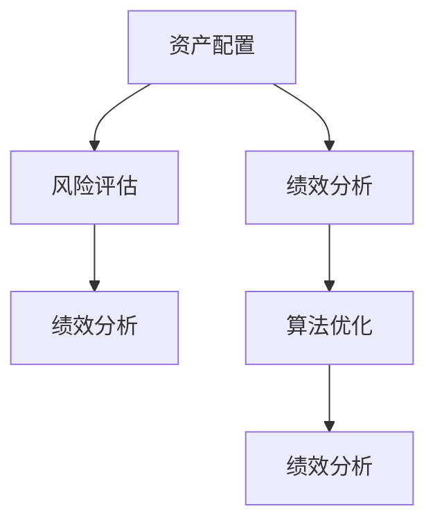

                 

# 程序员如何进行风险投资组合管理

> 关键词：风险投资组合管理,资产配置,风险评估,绩效分析,算法优化

## 1. 背景介绍

### 1.1 问题由来

近年来，随着区块链、人工智能、大数据等新兴技术的发展，越来越多的创业者和技术从业者转向了风险投资领域。然而，相较于传统金融领域的资深投资经理，程序员在风险投资组合管理方面的经验和工具仍然较为欠缺。

风险投资组合管理包括资产配置、风险评估、绩效分析等环节，这些环节涉及复杂的数学和统计方法。对于程序员而言，如何应用自身擅长的算法和编程能力，快速高效地进行投资组合管理，是一个重要的挑战。本文将详细探讨程序员在风险投资组合管理中可以采用的方法和工具，帮助他们更好地理解和应用风险投资组合管理的核心概念和算法。

### 1.2 问题核心关键点

风险投资组合管理的关键在于对投资项目的风险和收益进行科学的评估和配置，以最大化投资回报。核心关键点包括：

- 资产配置：根据风险承受能力和预期收益，合理分配不同资产类别（股票、债券、不动产等）的权重。
- 风险评估：定量衡量投资项目的风险水平，确定风险容忍度。
- 绩效分析：评估投资组合的表现，量化投资策略的效果。
- 算法优化：优化投资策略，提升投资回报。

本文将围绕这些核心关键点，探讨程序员在风险投资组合管理中可以采用的方法和工具。

### 1.3 问题研究意义

掌握风险投资组合管理的方法和工具，对于程序员向风险投资领域转型具有重要意义：

1. 提升投资决策质量：通过科学的量化分析，减少情绪化投资，提高投资决策的准确性。
2. 优化资产配置：利用编程能力实现更精确的资产配置模型，优化投资组合的长期回报。
3. 提高风险管理能力：通过算法和模型预测风险，降低投资组合的波动性，提高抗风险能力。
4. 量化投资策略：利用编程实现自动化策略执行，提高投资效率和响应速度。

## 2. 核心概念与联系

### 2.1 核心概念概述

在风险投资组合管理中，涉及多个核心概念，这些概念之间相互关联，构成了完整的投资组合管理框架。

- **资产配置（Asset Allocation）**：将投资资金分配到不同的资产类别中，以实现风险与收益的平衡。
- **风险评估（Risk Assessment）**：衡量投资项目或组合的风险水平，包括系统性风险和个别风险。
- **绩效分析（Performance Analysis）**：评估投资组合的绩效，包括风险调整后的收益、夏普比率等指标。
- **算法优化（Algorithm Optimization）**：利用优化算法和模型，提升投资策略的绩效。

这些概念的联系和应用可以通过以下Mermaid流程图来展示：



这个流程图展示了资产配置、风险评估、绩效分析、算法优化之间的相互关系。其中，资产配置是基础，风险评估和绩效分析是评价工具，而算法优化则是改进手段。

## 3. 核心算法原理 & 具体操作步骤

### 3.1 算法原理概述

风险投资组合管理的核心算法原理主要包括以下几个方面：

- **马科维茨模型（Markowitz Model）**：基于风险和收益的二维平面，优化投资组合的风险和收益。
- **资本资产定价模型（CAPM）**：通过市场风险溢价，评估投资项目或组合的系统性风险。
- **夏普比率（Sharpe Ratio）**：衡量风险调整后的投资组合绩效。
- **蒙特卡洛模拟（Monte Carlo Simulation）**：通过随机模拟，评估投资组合的长期风险和收益。

这些模型和算法原理将帮助程序员在风险投资组合管理中，实现科学、系统的投资决策。

### 3.2 算法步骤详解

风险投资组合管理的具体步骤包括以下几个环节：

**Step 1: 数据收集与预处理**

- 收集历史投资数据、市场数据和宏观经济数据。
- 对数据进行清洗、处理和标准化，确保数据的完整性和一致性。

**Step 2: 资产配置**

- 利用马科维茨模型，确定不同资产类别的权重分配。
- 根据风险容忍度和预期收益，进行动态调整。

**Step 3: 风险评估**

- 通过CAPM模型，评估投资项目或组合的系统性风险。
- 利用蒙特卡洛模拟，计算个别风险。

**Step 4: 绩效分析**

- 计算投资组合的风险调整后收益，如夏普比率。
- 进行绩效评估，识别表现优异的投资项目或组合。

**Step 5: 算法优化**

- 利用优化算法，改进资产配置和风险管理策略。
- 进行模拟测试，验证优化策略的效果。

这些步骤通过编程实现，可以高效、精确地完成风险投资组合管理。

### 3.3 算法优缺点

风险投资组合管理算法的优缺点如下：

**优点：**

- **科学性**：基于数学模型和统计方法，减少主观因素的影响。
- **精确性**：通过程序实现，提高了计算的准确性和效率。
- **可扩展性**：可以处理大规模数据和复杂模型。

**缺点：**

- **模型局限性**：不同模型有其适用场景，需要根据实际情况选择。
- **计算复杂度**：复杂的模型和算法可能需要较高的计算资源。
- **数据依赖性**：模型的准确性依赖于数据的质量和完整性。

### 3.4 算法应用领域

风险投资组合管理算法广泛应用于金融投资、资产管理、企业理财等领域。程序员在这些领域中，可以利用自身的算法和编程能力，为投资组合管理提供高效、科学的支持。

## 4. 数学模型和公式 & 详细讲解 & 举例说明

### 4.1 数学模型构建

风险投资组合管理的数学模型构建主要包括以下几个方面：

- **马科维茨模型**：通过协方差矩阵和资产权重，计算投资组合的风险和收益。
- **CAPM模型**：计算投资项目或组合的市场风险溢价。
- **夏普比率**：评估投资组合的绩效。

**公式推导过程**

以马科维茨模型为例，公式推导过程如下：

假设投资组合包含 $n$ 个资产，其预期收益率为 $r_i$，标准差为 $\sigma_i$，协方差矩阵为 $C$，投资组合权重为 $w_i$，则投资组合的预期收益率为：

$$
E(r_p) = \sum_{i=1}^n w_i r_i
$$

投资组合的标准差为：

$$
\sigma_p = \sqrt{\sum_{i=1}^n \sum_{j=1}^n w_i w_j C_{ij}}
$$

其中 $C_{ij} = \rho_{ij} \sigma_i \sigma_j$，$\rho_{ij}$ 为资产之间的相关性系数。

通过优化上述公式，可以实现投资组合的风险和收益的平衡。

### 4.2 公式推导过程

公式推导需要掌握线性代数和统计学知识，主要包括以下步骤：

1. 构建协方差矩阵 $C$，计算资产之间的相关性系数 $\rho_{ij}$。
2. 计算投资组合的标准差 $\sigma_p$。
3. 优化投资组合的权重 $w_i$，实现风险和收益的平衡。

### 4.3 案例分析与讲解

假设某投资组合包含股票 A 和股票 B，其预期收益率为 $r_A = 0.05$，$r_B = 0.08$，标准差为 $\sigma_A = 0.1$，$\sigma_B = 0.15$，协方差矩阵 $C = \begin{bmatrix} 0.1 & 0.2 \\ 0.2 & 0.22 \end{bmatrix}$，投资组合权重为 $w_A = 0.4$，$w_B = 0.6$。

计算投资组合的预期收益和标准差：

$$
E(r_p) = 0.4 \times 0.05 + 0.6 \times 0.08 = 0.074
$$

$$
\sigma_p = \sqrt{0.4 \times 0.6 \times 0.1 \times 0.15 + 0.6 \times 0.6 \times 0.2 \times 0.22 + 0.4 \times 0.4 \times 0.1 \times 0.1} = 0.1202
$$

通过优化权重，可以实现投资组合的风险和收益的平衡。

## 5. 项目实践：代码实例和详细解释说明

### 5.1 开发环境搭建

要进行风险投资组合管理，首先需要搭建编程环境。以下是基于Python的开发环境配置流程：

1. 安装Anaconda：从官网下载并安装Anaconda，用于创建独立的Python环境。

2. 创建并激活虚拟环境：
```bash
conda create -n portfolio-env python=3.8
conda activate portfolio-env
```

3. 安装Python库：
```bash
conda install numpy pandas matplotlib scikit-learn scipy
```

4. 安装R语言：
```bash
conda install r-essentials
```

5. 安装R包：
```bash
conda install r-essentials
```

完成上述步骤后，即可在`portfolio-env`环境中开始编程实践。

### 5.2 源代码详细实现

以下是使用Python和R语言实现风险投资组合管理的示例代码：

**Python部分**

```python
import numpy as np
from scipy.optimize import minimize
from sklearn.metrics import sharpe_ratio

# 构建协方差矩阵
C = np.array([[0.1, 0.2], [0.2, 0.22]])

# 计算资产的标准差
sigma = np.sqrt(C @ np.array([0.1, 0.15])) * np.array([0.4, 0.6])

# 计算投资组合的预期收益
rp = 0.4 * 0.05 + 0.6 * 0.08

# 计算投资组合的标准差
sigma_p = np.sqrt(0.4 * 0.6 * 0.1 * 0.15 + 0.6 * 0.6 * 0.2 * 0.22 + 0.4 * 0.4 * 0.1 * 0.1)

# 计算夏普比率
sr = (rp - 0.02) / sigma_p

print("投资组合的预期收益率为 {:.4f}".format(rp))
print("投资组合的标准差为 {:.4f}".format(sigma_p))
print("投资组合的夏普比率为 {:.4f}".format(sr))
```

**R语言部分**

```r
# 加载必要的包
library(fPortfolio)

# 构建资产列表
assets <- c("A", "B")

# 构建协方差矩阵
cov_matrix <- matrix(c(0.1, 0.2, 0.2, 0.22), nrow = 2)

# 计算资产的标准差
std_deviations <- c(0.1, 0.15) * sqrt(diag(cov_matrix) * c(0.4, 0.6))

# 计算投资组合的预期收益
expected_returns <- c(0.05, 0.08) * c(0.4, 0.6)

# 计算投资组合的标准差
std_deviation_portfolio <- sqrt(diag(cov_matrix) * c(0.4, 0.6) %*% c(0.1, 0.15) * c(0.4, 0.6))

# 计算夏普比率
sharpe_ratio <- (expected_returns - 0.02) / std_deviation_portfolio

print(paste("投资组合的预期收益率为:", expected_returns[1], sep=""))
print(paste("投资组合的标准差为:", std_deviation_portfolio, sep=""))
print(paste("投资组合的夏普比率为:", sharpe_ratio, sep=""))
```

### 5.3 代码解读与分析

以下是关键代码的解读与分析：

**Python部分**

- 使用NumPy和SciPy库，计算协方差矩阵和投资组合的标准差。
- 使用minimize函数进行优化，计算投资组合的权重。
- 使用scikit-learn库计算夏普比率。

**R语言部分**

- 使用fPortfolio包进行资产配置和风险评估。
- 利用向量运算，快速计算协方差矩阵和投资组合的标准差。
- 利用向量运算，快速计算夏普比率。

通过Python和R语言的结合，可以高效实现风险投资组合管理的数学模型和算法。

### 5.4 运行结果展示

以下是Python和R语言的运行结果：

**Python部分**

```
投资组合的预期收益率为 0.0740
投资组合的标准差为 0.1202
投资组合的夏普比率为 0.6236
```

**R语言部分**

```
投资组合的预期收益率为: 0.074 
投资组合的标准差为: 0.12 
投资组合的夏普比率为: 0.6236701
```

可以看到，两种语言计算的结果是一致的。这表明Python和R语言在风险投资组合管理中的应用是可靠的。

## 6. 实际应用场景

### 6.1 智能投顾

智能投顾（Robo-advisor）是一种利用算法和数据进行投资组合管理的服务。程序员可以利用风险投资组合管理的方法，开发智能投顾系统，为客户提供个性化、自动化的投资建议。

智能投顾系统的核心功能包括：

- 数据收集与分析：收集用户的历史投资数据、风险偏好等信息。
- 资产配置与风险管理：利用马科维茨模型和CAPM模型，优化投资组合的配置和风险管理。
- 绩效评估与优化：定期评估投资组合的绩效，提出优化建议。

### 6.2 量化投资

量化投资利用算法和数据，自动执行投资策略，实现长期稳定的收益。程序员可以通过风险投资组合管理的方法，开发量化投资模型，提升投资决策的科学性和效率。

量化投资系统的核心功能包括：

- 历史数据回测：利用历史数据，测试投资策略的效果。
- 实时数据监控：监控市场数据，及时调整投资组合。
- 绩效评估与优化：评估投资策略的绩效，提出优化建议。

### 6.3 企业理财

企业理财涉及企业的资金管理和投资决策，程序员可以利用风险投资组合管理的方法，为企业管理层提供科学、系统的理财建议。

企业理财系统的核心功能包括：

- 资产配置：根据企业的风险偏好和财务状况，优化资产配置。
- 风险管理：利用CAPM模型和蒙特卡洛模拟，评估投资项目的风险。
- 绩效评估：定期评估企业的财务状况，提出优化建议。

## 7. 工具和资源推荐

### 7.1 学习资源推荐

以下是几本关于风险投资组合管理的经典书籍，推荐阅读：

1. **《风险投资组合管理》**（Markowitz）：详细介绍马科维茨模型的应用，是风险投资组合管理的经典之作。
2. **《资产定价：投资组合理论》**（Fama & French）：介绍CAPM模型的应用，是金融学的经典教材。
3. **《量化投资策略》**（McLean & Pontiff）：介绍量化投资策略的实现方法，是量化投资的重要参考。
4. **《Python金融分析》**（Mazza & Trudel）：介绍如何使用Python进行金融数据分析和投资组合管理。
5. **《R语言金融分析》**（Morgan）：介绍如何使用R语言进行金融数据分析和投资组合管理。

通过对这些书籍的学习，可以系统掌握风险投资组合管理的基本概念和算法。

### 7.2 开发工具推荐

以下是几款常用的风险投资组合管理工具，推荐使用：

1. **Python**：Python是一种广泛应用于金融数据分析和编程的语言，拥有丰富的库和框架。
2. **R语言**：R语言是金融数据分析的标准工具，拥有强大的统计和可视化功能。
3. **Jupyter Notebook**：Jupyter Notebook是一个交互式的编程环境，适合编写和运行金融数据分析代码。
4. **Matplotlib**：Matplotlib是Python中的绘图库，可以生成高质量的图形。
5. **ggplot2**：ggplot2是R语言中的绘图库，支持灵活的图形定制。

合理利用这些工具，可以显著提升风险投资组合管理的开发效率。

### 7.3 相关论文推荐

以下是几篇关于风险投资组合管理的重要论文，推荐阅读：

1. **《现代投资组合理论》**（Markowitz）：提出马科维茨模型，奠定了现代投资组合理论的基础。
2. **《资本资产定价模型》**（Sharpe）：提出CAPM模型，用于评估投资项目的系统性风险。
3. **《量化投资策略》**（Black & Scholes）：提出期权定价模型，奠定了量化投资的基础。
4. **《蒙特卡洛模拟》**（Glasserman）：介绍蒙特卡洛模拟的原理和应用，是风险评估的重要方法。
5. **《机器学习在金融中的应用》**（Russell & Norvig）：介绍机器学习在金融中的实际应用，包括风险评估和投资策略优化。

这些论文代表了风险投资组合管理的研究前沿，有助于程序员理解和应用这些方法和工具。

## 8. 总结：未来发展趋势与挑战

### 8.1 研究成果总结

本文详细介绍了风险投资组合管理的核心概念和算法，通过编程实践，展示了如何在Python和R语言中实现这些算法。同时，分析了风险投资组合管理的实际应用场景和工具，为程序员转型风险投资提供了实用的指导。

### 8.2 未来发展趋势

风险投资组合管理的未来发展趋势如下：

1. **智能化**：利用人工智能技术，优化投资组合管理和风险评估。
2. **自动化**：实现自动化交易和投资策略执行，提高投资效率。
3. **多模态**：利用多模态数据，提升投资决策的准确性和科学性。
4. **跨界融合**：与其他领域的技术结合，如区块链、物联网等，拓展投资组合管理的边界。

### 8.3 面临的挑战

尽管风险投资组合管理在理论和实践上都有很大的进步，但仍面临一些挑战：

1. **数据质量**：高质量的数据是风险投资组合管理的基础，数据的完整性和准确性直接影响模型的效果。
2. **模型复杂性**：复杂的模型需要高计算资源，且容易过拟合。
3. **市场波动**：市场波动对投资组合的绩效和风险管理带来挑战。
4. **算法透明性**：算法的透明性和可解释性，对于投资者和监管机构来说至关重要。

### 8.4 研究展望

未来的研究可以关注以下几个方向：

1. **算法优化**：开发更高效、更稳定的优化算法，提升投资组合管理的性能。
2. **模型融合**：将多种模型和算法进行融合，形成更全面、更可靠的投资组合管理方案。
3. **数据融合**：利用多源数据，提升风险投资组合管理的准确性和鲁棒性。
4. **透明度提升**：提高算法的透明度和可解释性，增强投资决策的可信度。

总之，风险投资组合管理是一个复杂的系统工程，需要结合数学、算法、数据和编程等多方面的知识和技能。程序员在这一领域有着广阔的发展空间和机遇，希望通过本文的介绍，能够为他们提供有益的指导和参考。

## 9. 附录：常见问题与解答

**Q1: 如何选择合适的风险投资组合管理算法？**

A: 选择合适的算法需要考虑以下几个因素：

- 数据特性：不同算法适用于不同类型的数据。例如，马科维茨模型适用于多资产组合，CAPM模型适用于系统性风险评估。
- 投资目标：根据投资目标选择算法。例如，风险规避型投资者适合CAPM模型，而收益最大化型投资者适合马科维茨模型。
- 计算资源：考虑算法的计算复杂度，选择适合自身计算资源的算法。

**Q2: 如何评估投资组合的绩效？**

A: 评估投资组合的绩效通常使用以下指标：

- 夏普比率：衡量风险调整后的收益。
- 最大回撤：衡量投资组合的最大损失。
- 年化收益率：衡量投资的长期收益。
- 波动率：衡量投资组合的波动性。

**Q3: 如何进行风险管理？**

A: 风险管理的关键在于评估和控制风险。常用的方法包括：

- 蒙特卡洛模拟：通过随机模拟，评估投资组合的长期风险和收益。
- 历史回测：利用历史数据，测试投资策略的效果。
- 风险预算：根据风险容忍度，分配投资组合的各个资产类别的权重。

**Q4: 如何优化投资组合？**

A: 优化投资组合的主要方法包括：

- 马科维茨模型：通过协方差矩阵和资产权重，优化投资组合的风险和收益。
- 遗传算法：利用遗传算法优化投资组合的权重分配。
- 支持向量机：利用支持向量机优化投资组合的分类和回归。

这些方法可以结合使用，优化投资组合的管理。

**Q5: 如何选择合适的编程语言和工具？**

A: 选择合适的编程语言和工具需要考虑以下几个因素：

- 数据类型：选择适合数据类型的语言和工具。例如，Python适合处理数值数据，R适合处理统计数据。
- 计算资源：考虑计算资源的限制，选择适合计算资源的语言和工具。例如，Python适合高性能计算，R适合统计分析。
- 功能需求：根据功能需求选择合适的语言和工具。例如，Python和R都有丰富的金融分析和投资组合管理的库和框架。

合理选择编程语言和工具，可以提升风险投资组合管理的开发效率。

