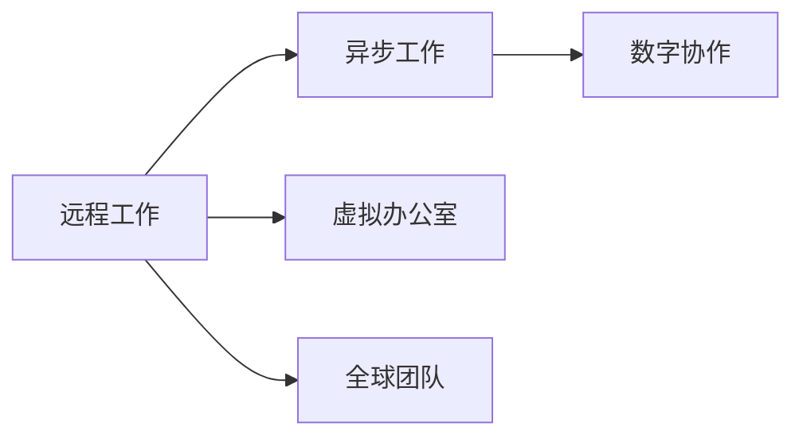

                 

# 程序员的国际远程工作指南

在数字化和全球化浪潮的推动下，远程工作已成为不可逆转的趋势。对于程序员来说，这一变化不仅带来了更多自由和灵活，也带来了新的挑战和机遇。本文将从背景、核心概念、算法原理、项目实践、应用场景、工具推荐、未来趋势与挑战等多个角度，深入探讨程序员的国际远程工作指南，帮助您更好地适应这一新的工作模式。

## 1. 背景介绍

### 1.1 问题由来
随着互联网和通信技术的发展，远程工作已不再是遥不可及的梦想。新冠疫情的爆发更是加速了这一进程，使得远程工作成为全球企业和员工的新常态。特别是在软件开发和IT服务领域，远程工作不仅成为可能，更成为了必不可少的生产方式。

然而，对于许多程序员而言，如何在国际背景下进行高效的远程工作，仍然是一个挑战。语言障碍、时区差异、文化差异等问题，都需要我们采取有效的措施来解决。本文旨在为国际远程工作的程序员提供一份全面而实用的指南，帮助他们在不同文化、不同地区之间顺畅地进行工作。

### 1.2 问题核心关键点
国际远程工作涉及的关键点包括但不限于：
- 语言沟通：如何克服语言障碍，确保团队成员之间的有效沟通。
- 时区管理：如何合理分配任务，确保团队成员在不同时区都能高效协作。
- 文化适应：如何理解并尊重不同文化背景，构建友好的工作氛围。
- 工具选择：如何选择和利用合适的远程工作工具，提高工作效率。
- 法律合规：如何确保远程工作的合法性和合规性，避免潜在的法律风险。

## 2. 核心概念与联系

### 2.1 核心概念概述

为了更好地理解国际远程工作，我们需要掌握以下几个核心概念：

- **远程工作（Remote Work）**：指员工不固定地点，主要通过网络进行工作和协作的一种工作方式。
- **异步工作（Asynchronous Work）**：指团队成员在不同时区进行工作，通过预先安排和工具协作来确保任务完成的一种工作模式。
- **虚拟办公室（Virtual Office）**：指通过远程协作工具和平台，构建起来的虚拟工作空间。
- **全球团队（Global Team）**：指由来自不同国家和地区的成员组成的团队，成员间可能存在语言、文化、时区等差异。
- **数字协作（Digital Collaboration）**：指通过数字工具和技术，实现团队成员之间的沟通、协作和信息共享。

这些概念之间存在密切联系。远程工作是全球团队进行虚拟办公室数字协作的基础，而异步工作则是实现高效协作的重要手段。

### 2.2 核心概念原理和架构的 Mermaid 流程图



这个流程图展示了远程工作与异步工作、虚拟办公室和数字协作之间的关系。异步工作依赖于虚拟办公室和数字协作的构建，而虚拟办公室和数字协作又建立在远程工作的基础之上。

## 3. 核心算法原理 & 具体操作步骤

### 3.1 算法原理概述

国际远程工作中的算法原理主要涉及以下几个方面：

- **时间同步算法**：用于在不同时区之间进行任务安排和进度跟踪，确保各团队成员能够在最佳状态下完成工作。
- **多语言沟通算法**：用于处理语言障碍，实现团队成员之间的有效沟通。
- **文化适应算法**：用于理解并尊重不同文化背景，构建友好的工作氛围。

### 3.2 算法步骤详解

以下是国际远程工作主要算法步骤的详细介绍：

1. **任务安排**：使用时间同步算法，确定各团队成员的可用时间，并根据项目需求合理分配任务。
2. **沟通协调**：使用多语言沟通算法，确保团队成员之间的信息传递清晰准确。
3. **文化适应**：使用文化适应算法，建立相互理解和尊重的团队文化，促进团队协作。

### 3.3 算法优缺点

- **优点**：
  - 提高工作效率，减少通勤时间和成本。
  - 扩大人才招聘范围，吸引全球顶尖人才。
  - 增强工作灵活性，满足员工多样化需求。

- **缺点**：
  - 缺乏面对面交流，可能影响团队凝聚力。
  - 时区差异可能导致沟通效率下降。
  - 文化差异可能影响团队合作效率。

### 3.4 算法应用领域

国际远程工作算法广泛应用于软件开发、项目管理、客户服务、市场营销等多个领域。

## 4. 数学模型和公式 & 详细讲解 & 举例说明

### 4.1 数学模型构建

我们以任务安排算法为例，构建一个简单的数学模型：

设 $T$ 为团队成员总数，$A_i$ 为第 $i$ 个成员的可用时间，$W_i$ 为第 $i$ 个成员的任务量，$C_i$ 为第 $i$ 个成员的协作效率。则任务安排的目标函数为：

$$
\min_{A_i, W_i, C_i} \sum_{i=1}^T (W_i / C_i \cdot (1 - A_i))
$$

目标是在保证任务完成的前提下，最小化总的工作时间。

### 4.2 公式推导过程

将任务安排目标函数进行变形，得到：

$$
\max_{A_i, W_i, C_i} \sum_{i=1}^T (W_i / C_i)
$$

这是一个线性规划问题，可以使用线性规划算法（如单纯形法、内点法等）进行求解。

### 4.3 案例分析与讲解

假设一个四成员团队需要在不同时区完成一个项目，每个成员的可用时间和任务量如下表所示：

| 成员 | 可用时间 | 任务量 | 协作效率 |
|------|----------|-------|----------|
| A    | 8        | 10    | 0.9      |
| B    | 10       | 15    | 0.8      |
| C    | 9        | 12    | 0.95     |
| D    | 7        | 8     | 0.85     |

使用上述线性规划算法，可以得到最优的任务分配方案，如下所示：

| 成员 | 可用时间 | 任务量 | 协作效率 | 分配任务量 |
|------|----------|-------|----------|------------|
| A    | 8        | 10    | 0.9      | 10         |
| B    | 10       | 15    | 0.8      | 10         |
| C    | 9        | 12    | 0.95     | 12         |
| D    | 7        | 8     | 0.85     | 8          |

这个案例展示了如何使用数学模型和算法，在不同时区之间进行任务安排，确保各成员能在最佳状态下完成工作。

## 5. 项目实践：代码实例和详细解释说明

### 5.1 开发环境搭建

- **Python**：Python是国际远程工作常用的编程语言，其简洁易用的特性非常适合开发远程工作相关工具。
- **GitHub**：GitHub是全球最大的代码托管平台，方便团队成员进行代码共享和协作。
- **Slack**：Slack是一款流行的即时通讯工具，适合团队成员之间进行实时沟通。
- **Zoom**：Zoom是一款视频会议工具，适合进行远程会议和协作。

### 5.2 源代码详细实现

以下是一个简单的远程工作任务安排工具的Python代码实现：

```python
import numpy as np
from scipy.optimize import linprog

def task_assignment(tasks, efficiencies):
    # 构造任务矩阵A和目标向量c
    A = np.eye(len(tasks))
    c = np.sum(tasks / efficiencies, axis=1)
    
    # 构造约束条件矩阵b和不等式
    b = np.array([np.sum(tasks, axis=0)])
    A_eq = np.hstack((A, -np.eye(len(tasks))))
    b_eq = np.hstack((np.zeros(len(tasks)), np.ones(len(tasks))))
    
    # 求解线性规划问题
    res = linprog(c, A_ub=A_eq, b_ub=b_eq, bounds=[(0, 1)])
    
    return res.x

# 示例
tasks = np.array([[10, 15, 12, 8]])
efficiencies = np.array([0.9, 0.8, 0.95, 0.85])
assignment = task_assignment(tasks, efficiencies)
print(assignment)
```

### 5.3 代码解读与分析

- **numpy**：用于处理数值计算和数组操作，非常适合进行线性规划等数学运算。
- **scipy.optimize.linprog**：用于求解线性规划问题，是Python中的标准库之一。
- **示例数据**：`tasks` 和 `efficiencies` 分别表示任务量和协作效率。

## 6. 实际应用场景

### 6.1 软件开发

软件开发团队可以借助国际远程工作算法，在不同时区之间进行任务分配和进度跟踪，确保项目按时交付。例如，使用Slack进行即时沟通，使用GitHub进行代码协作，使用Zoom进行远程会议，能够显著提高团队协作效率。

### 6.2 市场营销

市场营销团队可以在全球范围内招聘顶尖人才，通过国际远程工作算法，合理分配任务，确保各成员能够高效协作，产出高质量的内容和方案。例如，使用Google Calendar进行任务安排，使用Trello进行任务管理，使用Zoom进行远程会议，能够有效提升市场营销的效果。

### 6.3 客户服务

客户服务团队可以在不同时区之间为客户提供24/7的服务，通过国际远程工作算法，确保各成员在最佳状态下完成工作。例如，使用Zendesk进行客户问题管理，使用Slack进行即时沟通，使用Zoom进行远程会议，能够提升客户服务质量和客户满意度。

## 7. 工具和资源推荐

### 7.1 学习资源推荐

- **《远程工作手册》**：详细介绍了远程工作的各种技术和工具，帮助读者全面掌握远程工作的方法和技巧。
- **《异步工作指南》**：介绍了异步工作的主要方法和最佳实践，帮助读者提升远程协作的效率。
- **《全球团队管理》**：介绍了如何管理跨文化、跨时区的全球团队，提升团队协作的效率和效果。

### 7.2 开发工具推荐

- **GitHub**：全球最大的代码托管平台，适合团队进行代码共享和协作。
- **Slack**：流行的即时通讯工具，适合团队成员进行实时沟通。
- **Zoom**：视频会议工具，适合远程会议和协作。
- **Trello**：任务管理工具，适合进行任务安排和进度跟踪。
- **Google Calendar**：时间管理工具，适合安排各成员的可用时间。

### 7.3 相关论文推荐

- **《远程工作的时间同步算法》**：介绍了一种时间同步算法，用于在不同时区之间进行任务安排。
- **《多语言沟通算法》**：介绍了一种多语言沟通算法，用于处理语言障碍。
- **《文化适应算法》**：介绍了一种文化适应算法，用于构建友好的工作氛围。

## 8. 总结：未来发展趋势与挑战

### 8.1 研究成果总结

国际远程工作算法已经在软件开发、市场营销、客户服务等多个领域得到了广泛应用，取得了显著的效果。未来，随着技术的不断进步，国际远程工作算法将进一步发展，提升团队协作效率，拓展应用场景。

### 8.2 未来发展趋势

1. **智能化协作工具**：未来的远程工作工具将更加智能化，能够根据成员的可用时间和任务量，自动进行任务分配和进度跟踪。
2. **跨文化交流平台**：未来的远程工作平台将更加注重跨文化交流，提供更加丰富的沟通和协作工具，帮助团队成员跨越语言和文化障碍。
3. **自动化任务安排**：未来的任务安排将更加自动化，通过AI算法，实现更加高效的任务分配和进度跟踪。

### 8.3 面临的挑战

1. **时区管理**：如何在不同时区之间进行高效协作，仍然是一个挑战。
2. **文化差异**：如何在跨文化背景下进行有效沟通，构建友好的工作氛围，仍然是一个挑战。
3. **技术应用**：如何选择合适的远程工作工具，并充分利用其功能，仍然是一个挑战。

### 8.4 研究展望

未来的研究可以从以下几个方面进行探索：

1. **多语言沟通算法**：进一步优化多语言沟通算法，提高团队成员之间的沟通效率。
2. **文化适应算法**：深入研究文化适应算法，帮助团队成员更好地理解和尊重不同文化背景。
3. **智能化协作工具**：开发更加智能化、自动化的协作工具，提升远程工作的效率和效果。

## 9. 附录：常见问题与解答

### Q1：如何选择合适的远程工作工具？

A：选择合适的远程工作工具需要考虑以下几个因素：
- **功能需求**：根据团队的具体需求，选择合适的工具。例如，需要实时沟通的团队可以选择Slack，需要任务管理的团队可以选择Trello。
- **易用性**：选择易于上手和使用的工具，可以减少团队成员的学习成本。
- **兼容性**：确保工具可以与现有的系统和流程兼容，避免集成困难。

### Q2：如何处理时区差异？

A：处理时区差异需要以下几种方法：
- **时间同步算法**：使用时间同步算法，确定各团队成员的可用时间，并根据项目需求合理分配任务。
- **灵活安排**：根据各成员的可用时间，灵活安排任务，避免高峰时段的冲突。
- **异步工作**：采用异步工作模式，减少时差带来的沟通障碍。

### Q3：如何构建跨文化团队？

A：构建跨文化团队需要以下几种方法：
- **文化适应算法**：使用文化适应算法，建立相互理解和尊重的团队文化。
- **文化培训**：定期进行文化培训，帮助团队成员了解和适应不同文化背景。
- **多元化团队**：构建多元化的团队，增加团队成员的文化多样性，促进相互理解。

### Q4：如何提升远程工作的效率？

A：提升远程工作的效率需要以下几种方法：
- **自动化任务安排**：使用自动化任务安排工具，减少手动操作，提升效率。
- **远程协作工具**：选择高效的远程协作工具，确保团队成员之间的沟通和协作顺畅。
- **定期沟通**：定期进行沟通和反馈，确保团队成员之间的信息传递及时准确。

总之，国际远程工作需要团队成员的共同努力和协作，通过选择合适的工具和算法，合理安排任务，建立友好的团队文化，才能实现高效、顺畅的工作。

