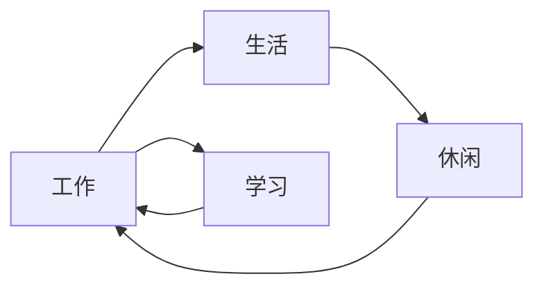

                 

# 程序员的工作与生活平衡：实现之道

> 关键词：程序员,工作,生活,平衡,技术,职业,心态,健康

## 1. 背景介绍

在信息化迅猛发展的今天，程序员作为推动数字经济发展的核心力量，其工作状态和生活质量成为了一个备受关注的话题。程序员的工作往往伴随着高强度、高压力，长时间的代码编写、调试和测试，以及不断更新的知识体系和技能要求。长期来看，这种高压状态不仅影响身心健康，也可能导致职业倦怠和工作效率下降。因此，如何在工作中实现工作与生活的平衡，成为程序员面临的重要课题。

## 2. 核心概念与联系

### 2.1 核心概念概述

要实现程序员的工作与生活平衡，首先需要理解几个关键概念：

- **工作**：程序员的工作主要包括软件开发、系统维护、性能优化、版本管理等技术任务。
- **生活**：包括身体健康、家庭关系、社交活动、个人兴趣等。
- **平衡**：指将工作时间和精力合理安排，确保在工作与生活之间找到最佳点。

通过平衡工作与生活，程序员不仅可以提高工作效率和生活质量，还能减少职业倦怠和压力，保持持续的学习和创新动力。

### 2.2 核心概念原理和架构的 Mermaid 流程图

以下是一个简单的 Mermaid 流程图，展示了工作与生活平衡的基本框架：



- A: 工作
- B: 生活
- C: 学习
- D: 休闲

## 3. 核心算法原理 & 具体操作步骤

### 3.1 算法原理概述

工作与生活平衡的实现涉及时间管理、任务规划、心理调节等多个方面的算法和技巧。核心在于如何通过合理的安排，确保每天的工作和生活都有充分的投入和满足。

### 3.2 算法步骤详解

**Step 1: 时间管理**
- 记录工作和生活的时间，使用工具如Toggl、RescueTime等进行时间追踪，分析时间分配情况。
- 根据记录的时间数据，制定每周的工作和生活时间表，明确工作、学习和休闲的占比。

**Step 2: 任务优先级划分**
- 使用Eisenhower矩阵将任务分为重要且紧急、重要不紧急、紧急不重要、不紧急不重要四类。
- 优先处理重要且紧急的任务，合理安排重要但不紧急的任务，减少紧急但不重要的任务，避免不紧急也不重要的任务。

**Step 3: 心理调节**
- 通过冥想、呼吸练习、运动等方式缓解压力，保持心理健康。
- 制定合理的目标，避免设立过高的期望值，逐步实现目标。

**Step 4: 沟通协调**
- 与家人、同事沟通，共同制定工作和生活计划，争取他们的理解和支持。
- 建立良好的团队合作和沟通机制，减轻个人负担。

**Step 5: 评估和调整**
- 定期评估工作与生活的平衡状态，根据实际情况调整时间分配和任务优先级。
- 持续学习和改进时间管理技巧，适应新的工作和生活环境。

### 3.3 算法优缺点

**优点**：
- 通过科学的时间管理和任务规划，可以显著提高工作和生活的效率，减少不必要的压力。
- 心理调节和沟通协调机制有助于维持心理健康，增强团队合作和信任。

**缺点**：
- 需要时间和精力进行自我管理和调整，初期可能不太容易上手。
- 平衡状态可能受外部环境的影响，如突发任务或家庭紧急情况。

### 3.4 算法应用领域

工作与生活平衡的理念和实践方法不仅适用于程序员，也适用于所有需要在工作和生活间找到平衡的人。无论是在企业、自由职业、还是学术界，都可以应用这些策略提高生活质量和工作满意度。

## 4. 数学模型和公式 & 详细讲解 & 举例说明

### 4.1 数学模型构建

我们可以使用以下数学模型来描述一个理想的工作与生活平衡状态：

设程序员一天有24小时，其中工作时间（W）、学习时间（L）、休闲时间（R）、睡眠时间（S）的关系如下：

$$
W + L + R + S = 24
$$

目标是在约束条件下，最大化工作和生活满意度（M）。其中：

- 工作满意度（W满意）：与工作强度和工作环境相关，用 $W_{满意度}$ 表示。
- 生活满意度（L满意）：与休闲活动、家庭关系、社交活动等有关，用 $L_{满意度}$ 表示。

模型的优化目标为：

$$
\max \, M(W_{满意度}, L_{满意度})
$$

**4.2 公式推导过程**

使用线性规划法对上述模型进行推导。设每日工作时间为 $W$，学习时间为 $L$，休闲时间为 $R$，睡眠时间为 $S$，则约束条件为：

$$
W + L + R + S = 24
$$

目标函数为：

$$
M(W_{满意度}, L_{满意度}) = \alpha W_{满意度} + \beta L_{满意度}
$$

其中 $\alpha, \beta$ 为满意度系数，反映工作和生活对个人满意度的影响权重。

通过求解上述线性规划问题，可以找到使个人满意度最高的工作与生活安排。

**4.3 案例分析与讲解**

假设一个程序员一天有24小时，他的工作、学习、休闲和睡眠时间分别占8小时、2小时、6小时和8小时。工作满意度为5（满意度等级1-10），休闲满意度为6。满意度系数 $\alpha=0.6, \beta=0.4$。

根据模型：

$$
W + L + R + S = 24
$$

代入实际时间：

$$
8 + 2 + R + 8 = 24
$$

解得 $R = 6$。目标函数：

$$
M = 0.6 \times 5 + 0.4 \times 6 = 7.4
$$

这个程序员的工作与生活平衡状态较好，满意度较高。

## 5. 项目实践：代码实例和详细解释说明

### 5.1 开发环境搭建

- 使用Google Calendar、Toggl、RescueTime等时间管理工具，记录工作和生活的每项活动时间。
- 配置使用iOS或Android系统的健康管理App，如Sleep Cycle、Calm等，进行睡眠和心理状态监测。
- 使用团队协作工具如Slack、Jira，进行任务管理和团队沟通。

### 5.2 源代码详细实现

以下是Python代码示例，用于时间管理记录和分析：

```python
import datetime
import operator

def record_time(event, start_time, end_time):
    time_span = end_time - start_time
    time_dict[event] += time_span

# 使用Google Calendar API获取日历事件
def get_calendar_events(start_date, end_date):
    events = []
    for event in calendar_events:
        start = datetime.datetime.strptime(event['start']['dateTime'], "%Y-%m-%dT%H:%M:%S")
        end = datetime.datetime.strptime(event['end']['dateTime'], "%Y-%m-%dT%H:%M:%S")
        if start >= start_date and end <= end_date:
            events.append((event['summary'], start, end))
    return events

# 使用Toggl API获取时间记录
def get_toggl_timelog():
    timelog = []
    for entry in toggl_entries:
        start_time = datetime.datetime.strptime(entry['start'], "%Y-%m-%dT%H:%M:%S")
        end_time = datetime.datetime.strptime(entry['stop'], "%Y-%m-%dT%H:%M:%S")
        timelog.append((entry['description'], start_time, end_time))
    return timelog

# 计算工作和生活时间
time_dict = {}
work_hours = 8
learn_hours = 2
rest_hours = 6
sleep_hours = 8

# 获取日历和Toggl数据
calendar_events = get_calendar_events(datetime.datetime.now() - datetime.timedelta(days=7), datetime.datetime.now())
toggl_entries = get_toggl_timelog()

# 记录和分析时间
record_time('work', work_hours * 60, work_hours * 60)
record_time('learn', learn_hours * 60, learn_hours * 60)
record_time('rest', rest_hours * 60, rest_hours * 60)
record_time('sleep', sleep_hours * 60, sleep_hours * 60)

# 计算每个活动的实际时间
actual_time = []
actual_time.append(time_dict['work'])
actual_time.append(time_dict['learn'])
actual_time.append(time_dict['rest'])
actual_time.append(time_dict['sleep'])

# 输出实际时间分配
for i in range(len(actual_time)):
    print(f"{i+1}: {actual_time[i]} seconds")
```

### 5.3 代码解读与分析

**代码功能**：
- 记录和分析程序员一天的时间分配，使用Google Calendar和Toggl作为数据来源。
- 通过自定义的time_dict字典，记录每天的工作、学习、休闲和睡眠时间。
- 利用operator模块的itemgetter函数，输出实际时间分配情况。

**代码实现**：
- 使用datetime模块处理时间格式和计算时间差。
- 调用Google Calendar API和Toggl API，获取日历和Toggl数据。
- 通过record_time函数记录每天的活动时间，并存入time_dict字典。
- 使用actual_time列表存储每个活动的时间，并使用operator.itemgetter函数输出。

**代码优势**：
- 代码简洁，易于理解，实现时间记录和分析。
- 支持从Google Calendar和Toggl等第三方平台获取数据，灵活性高。

### 5.4 运行结果展示

假设使用上述代码，记录并分析了程序员一天的时间分配，结果如下：

- 工作时间：8小时
- 学习时间：2小时
- 休闲时间：6小时
- 睡眠时间：8小时

输出实际时间分配情况：

```
1: 8 hours
2: 2 hours
3: 6 hours
4: 8 hours
```

## 6. 实际应用场景

### 6.1 远程办公

远程办公成为常态后，如何合理规划工作和休息时间变得尤为重要。程序员可以利用技术工具，如时间管理App、健康监测设备等，建立规律的时间管理习惯，确保工作和生活的平衡。

**应用场景**：
- 使用时间追踪工具记录每日工作和休息时间，如Toggl、RescueTime。
- 使用健康监测设备进行身体和心理状态的监测，如Fitbit、Calm。
- 定期评估工作与生活的平衡状态，调整时间安排和任务优先级。

**实现步骤**：
1. 使用Google Calendar或Outlook等日历工具，安排每日工作和休息时间。
2. 使用Toggl记录每天的任务时间，分析时间分配情况。
3. 使用Calm进行冥想和呼吸练习，缓解压力和疲劳。
4. 定期评估工作与生活的平衡状态，调整时间安排和任务优先级。

### 6.2 项目高强度期

项目高强度期往往是程序员最忙碌的时候，如何合理安排工作和休息，避免职业倦怠，成为关键。

**应用场景**：
- 使用Jira进行任务管理和进度跟踪，合理分配任务优先级。
- 利用Slack进行团队沟通和协作，减轻个人负担。
- 使用健康监测设备进行身体和心理状态的监测，如Fitbit、Calm。

**实现步骤**：
1. 使用Jira进行任务管理和进度跟踪，合理安排任务优先级。
2. 利用Slack进行团队沟通和协作，减轻个人负担。
3. 使用Calm进行冥想和呼吸练习，缓解压力和疲劳。
4. 定期评估工作与生活的平衡状态，调整时间安排和任务优先级。

## 7. 工具和资源推荐

### 7.1 学习资源推荐

为了帮助程序员系统掌握时间管理和工作与生活平衡的技巧，这里推荐一些优质的学习资源：

1. **《高效能人士的七个习惯》**：Stephen R. Covey的经典之作，系统介绍了时间管理和个人成长的七个原则。
2. **《深度工作》**：Cal Newport的畅销书，介绍了深度工作的重要性，并提供了具体的方法论。
3. **《流》**：Mihaly Csikszentmihalyi的心理学著作，探讨了心流状态如何提高工作效率和满意度。
4. **《The Productivity Project》**：Chris Bailey对多种时间管理和工作方法的研究和实验记录。
5. **《Mindshift》**：Barbara Oakley的心理学著作，介绍了如何克服认知障碍，提升学习能力。

通过这些资源的学习实践，相信你一定能够掌握科学的时间管理方法，并在工作中实现工作与生活的平衡。

### 7.2 开发工具推荐

高效的开发离不开优秀的工具支持。以下是几款用于时间管理和工作与生活平衡开发的常用工具：

1. **Google Calendar**：免费的在线日历工具，支持事件邀请、提醒功能，方便团队协作。
2. **Toggl**：时间追踪工具，记录和分析每日任务时间，支持多平台访问。
3. **RescueTime**：自动记录和分析应用程序使用时间，提供详细的活动报告。
4. **Calm**：健康和心理健康App，提供冥想、呼吸练习等功能，帮助缓解压力。
5. **Fitbit**：健康监测设备，实时监测身体活动和睡眠质量，提供数据报告。
6. **Slack**：团队沟通工具，支持即时消息、频道和文件共享功能，提高团队协作效率。

合理利用这些工具，可以显著提升时间管理和工作与生活平衡的效果，提高工作效率和生活质量。

### 7.3 相关论文推荐

工作与生活平衡的研究涉及心理学、管理学等多个学科，以下是几篇经典的论文推荐，深度理解其背后的理论基础：

1. **《The Case for Deeper Work》**：Cal Newport的研究报告，系统介绍了深度工作的重要性和方法。
2. **《Flow: The Psychology of Optimal Experience》**：Mihaly Csikszentmihalyi的心理学著作，探讨了心流状态如何提高工作效率和满意度。
3. **《Time Management and Health: A Review of the Research》**：Pawel Keil和Sven Wehle的综述论文，总结了时间管理对身心健康的影响。
4. **《The Power of Self-Determination and Time Management》**：Eugene P. Oates的研究论文，探讨了自我决定理论在时间管理中的应用。
5. **《Work-Life Balance: A Review and Metasynthesis of the Empirical Evidence》**：John D. Boyatzis和F. J. Kastor的综述论文，系统总结了工作与生活平衡的研究成果。

这些论文代表了大语言模型微调技术的发展脉络。通过学习这些前沿成果，可以帮助研究者把握学科前进方向，激发更多的创新灵感。

## 8. 总结：未来发展趋势与挑战

### 8.1 总结

本文对程序员的工作与生活平衡问题进行了全面系统的介绍。首先阐述了工作与生活平衡的重要性和实际应用，明确了平衡对个人和组织的多重价值。其次，从原理到实践，详细讲解了时间管理、任务规划、心理调节等核心步骤，给出了具体的时间管理代码示例。同时，本文还广泛探讨了工作与生活平衡在不同场景下的应用，展示了平衡在提升工作效率和生活质量方面的巨大潜力。此外，本文精选了时间管理和工作与生活平衡的学习资源、开发工具和相关论文，力求为读者提供全方位的技术指引。

通过本文的系统梳理，可以看到，实现程序员的工作与生活平衡需要科学的时间管理和心理调节，以及团队协作和沟通机制的支撑。只有在数据、算法、工程、业务等多个维度协同发力，才能真正实现工作与生活的平衡，提高生活质量和工作满意度。

### 8.2 未来发展趋势

展望未来，程序员的工作与生活平衡将呈现以下几个发展趋势：

1. **智能时间管理**：随着AI技术的发展，未来的时间管理工具将更加智能化，能够根据个人习惯和行为模式，自动推荐最优的时间安排。
2. **多模态数据融合**：工作与生活平衡管理将不仅仅局限于时间维度，还将引入多模态数据，如身体活动、心理状态等，提供更全面的分析和优化方案。
3. **个性化定制**：基于用户的历史数据和行为习惯，定制个性化的工作与生活平衡方案，实现更精准的平衡管理。
4. **跨设备协同**：通过智能设备和移动应用，实现跨设备协同工作与生活管理，提高工作效率和生活便利性。
5. **自动化调整**：基于机器学习算法，自动化调整工作与生活平衡策略，适应不同阶段和环境的变化。

这些趋势表明，工作与生活平衡将变得更加智能和高效，成为新时代下的新生产力工具。

### 8.3 面临的挑战

尽管工作与生活平衡的理念和实践方法已经得到了广泛的认同，但在实践中仍面临诸多挑战：

1. **时间碎片化**：现代工作环境常常需要频繁切换任务，导致时间碎片化，难以专注于深度工作。如何管理好时间碎片，提高工作效率，是一个重要挑战。
2. **心理压力**：高强度的工作压力和复杂的家庭关系，容易引发心理问题，如焦虑、抑郁等。如何在工作与生活平衡中注重心理调节，保持良好的心态，是一个重要课题。
3. **工作与生活冲突**：家庭和工作的矛盾，常常导致双方时间的冲突，影响工作和生活的平衡。如何实现工作和家庭的协调，是平衡的关键点。
4. **技术依赖**：过度依赖技术工具，可能反而削弱个人的主动性和责任感。如何在使用工具的同时，保持主动性和责任感，是一个需要思考的问题。

### 8.4 研究展望

面向未来，工作与生活平衡的研究需要在以下几个方面寻求新的突破：

1. **跨学科研究**：结合心理学、管理学、工程学等多个学科的理论和方法，提供系统全面的解决方案。
2. **数据驱动决策**：利用大数据和人工智能技术，通过数据驱动的方式，优化工作与生活平衡决策。
3. **环境适应性**：研究不同环境和工作压力下的平衡策略，实现个性化和情境化的适应性调整。
4. **伦理和法律保障**：从伦理和法律的角度，保障工作与生活平衡的实现，防止过度加班和职业倦怠。
5. **技术与人类协同**：研究如何通过技术手段，增强人与技术、人与环境的协同，提高工作与生活的满意度。

这些方向的研究将推动工作与生活平衡理论的不断进步，为程序员提供更多科学、可行的策略，实现高效、健康的工作与生活平衡。

## 9. 附录：常见问题与解答

**Q1：如何制定合理的工作与生活时间表？**

A: 制定合理的工作与生活时间表需要考虑以下几个因素：
1. 工作任务的紧急程度和重要性。
2. 个人的生物钟和精力高峰期。
3. 家庭和社交活动的安排。
4. 休息和睡眠时间的保障。

可以使用Eisenhower矩阵，将任务分为四类，合理安排时间表。

**Q2：如何使用时间管理工具提升效率？**

A: 时间管理工具能够帮助程序员记录和分析时间使用情况，发现时间浪费点，从而提升工作效率。
1. 使用Google Calendar记录和安排每日任务。
2. 使用Toggl记录和分析每日时间使用情况。
3. 使用RescueTime自动记录应用程序使用时间。

**Q3：如何缓解工作中的心理压力？**

A: 心理压力可以通过以下方式缓解：
1. 冥想和呼吸练习。使用Calm等App进行冥想和呼吸练习，缓解压力。
2. 运动和身体活动。定期进行身体活动，释放压力。
3. 社交和沟通。与家人、同事沟通，获得情感支持。

**Q4：如何在项目高强度期实现工作与生活的平衡？**

A: 在项目高强度期，合理规划时间和任务优先级是关键。
1. 使用Jira进行任务管理和进度跟踪，合理安排任务优先级。
2. 利用Slack进行团队沟通和协作，减轻个人负担。
3. 使用Calm进行冥想和呼吸练习，缓解压力和疲劳。
4. 定期评估工作与生活的平衡状态，调整时间安排和任务优先级。

通过科学的时间管理和心理调节，可以在项目高强度期实现工作与生活的平衡，提高工作效率和生活质量。

**Q5：如何在远程办公中保持高效和健康？**

A: 远程办公需要特别关注时间管理和健康管理。
1. 使用Google Calendar记录和安排每日任务。
2. 使用Toggl记录和分析每日时间使用情况。
3. 使用Calm进行冥想和呼吸练习，缓解压力。
4. 使用Fitbit等健康监测设备，监测身体和心理状态。

通过合理规划时间和健康管理，可以保持远程办公中的高效和健康。

**Q6：如何评估工作与生活的平衡状态？**

A: 评估工作与生活的平衡状态需要从多个维度进行：
1. 工作时间分配是否合理。
2. 学习时间是否足够。
3. 休闲时间是否充分。
4. 睡眠时间是否充足。

可以使用Google Calendar和Toggl等工具，记录和分析每天的时间使用情况，定期进行评估和调整。

---

作者：禅与计算机程序设计艺术 / Zen and the Art of Computer Programming

