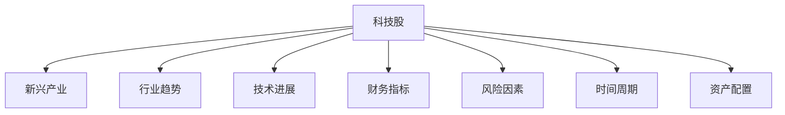

                 

# 程序员的投资策略：科技股与新兴产业

## 1. 背景介绍

### 1.1 问题由来

在快速变化的技术环境中，程序员面临着不断学习新技能、调整投资策略的挑战。如何从众多科技股和新兴产业中识别出具有长期投资价值的优质股票，成为程序员在职业生涯中必须面对的重要问题。为此，本文将探讨科技股和新兴产业的投资策略，通过深入分析不同行业的市场趋势、技术进展、财务指标和风险因素，帮助程序员做出明智的投资决策。

### 1.2 问题核心关键点

科技股和新兴产业的投资策略涉及多个核心关键点：

1. **行业趋势**：识别具有长期增长潜力的行业。
2. **技术进展**：关注创新驱动的公司。
3. **财务指标**：评估公司的财务健康状况。
4. **风险因素**：识别和管理投资风险。
5. **时间周期**：考虑短期与长期投资的区别。
6. **资产配置**：优化投资组合，平衡风险与回报。

### 1.3 问题研究意义

掌握科技股和新兴产业的投资策略，对于程序员的职业生涯和财富增值具有重要意义：

1. **提升财务知识**：增强对金融市场的理解，提升个人财务管理能力。
2. **优化职业规划**：通过投资策略规划职业生涯，实现个人目标与市场趋势的匹配。
3. **增加收入来源**：通过多元化投资，增加收入来源，提高生活质量。
4. **实现财务自由**：通过长期投资，积累财富，最终实现财务自由。
5. **助力创新创业**：支持新兴产业的发展，促进个人与行业的发展。

## 2. 核心概念与联系

### 2.1 核心概念概述

为更好地理解科技股和新兴产业的投资策略，本节将介绍几个密切相关的核心概念：

1. **科技股**：以科技企业为主的公司股票，包括软件、硬件、互联网、生物技术等多个领域。
2. **新兴产业**：快速增长的新兴行业，如人工智能、量子计算、区块链、5G等。
3. **行业趋势**：指行业内技术、市场、政策等因素的变化方向。
4. **技术进展**：指公司在新技术、新产品、新市场等方面的创新和突破。
5. **财务指标**：包括市盈率(P/E)、市净率(P/B)、每股收益(EPS)等，用于评估公司财务状况。
6. **风险因素**：包括市场风险、技术风险、财务风险、管理风险等。
7. **时间周期**：指投资的时间范围，包括短期（1年以内）、中期（1-5年）、长期（5年以上）。
8. **资产配置**：指在不同投资品种（如股票、债券、房地产等）之间的分配，以平衡风险和回报。

这些核心概念之间的逻辑关系可以通过以下Mermaid流程图来展示：



这个流程图展示了一系列与科技股和新兴产业投资策略相关的核心概念及其之间的联系：

1. 科技股与新兴产业密切相关，是投资策略的主要对象。
2. 行业趋势、技术进展、财务指标和风险因素是评估投资价值的关键因素。
3. 时间周期决定投资的长短周期，影响投资策略的选择。
4. 资产配置是优化投资组合，平衡风险和回报的重要手段。

## 3. 核心算法原理 & 具体操作步骤
### 3.1 算法原理概述

科技股和新兴产业的投资策略基于对行业趋势、技术进展、财务指标和风险因素的综合分析。其核心思想是：通过深入研究公司的内在价值和外在环境，选择具有长期增长潜力的股票进行投资。

### 3.2 算法步骤详解

基于科技股和新兴产业的投资策略，一般包括以下几个关键步骤：

**Step 1: 行业研究与选择**

1. **数据收集**：收集行业内的相关数据，包括市场规模、增长率、竞争格局、技术进展等。
2. **趋势分析**：通过统计分析、专家访谈等方式，识别行业的长期发展趋势。
3. **公司选择**：从具有成长潜力的公司中筛选出符合投资标准的股票。

**Step 2: 技术评估与分析**

1. **技术创新**：评估公司在新技术、新产品、新市场方面的创新能力和突破情况。
2. **专利申请**：统计公司的专利申请数量和质量，判断其技术领先程度。
3. **技术风险**：评估技术创新的成功率和风险，识别潜在的技术壁垒。

**Step 3: 财务分析与评估**

1. **财务指标计算**：计算公司的财务指标，如市盈率(P/E)、市净率(P/B)、每股收益(EPS)等。
2. **健康评估**：通过财务指标评估公司的财务健康状况和盈利能力。
3. **风险评估**：识别和管理公司的财务风险，如债务水平、现金流状况等。

**Step 4: 风险管理与控制**

1. **风险识别**：识别和分析影响股票价格的各种风险因素。
2. **风险评估**：量化风险因素对投资的影响，进行风险评估。
3. **风险控制**：制定风险控制措施，如分散投资、设置止损点等。

**Step 5: 资产配置与优化**

1. **投资组合构建**：根据投资目标和风险偏好，构建投资组合。
2. **分散投资**：通过分散投资，降低单一股票的风险。
3. **定期调整**：定期评估和调整投资组合，优化资产配置。

**Step 6: 实施与监控**

1. **买入时机**：选择合适的时机买入股票。
2. **持续监控**：实时监控股票价格、市场动态等，进行及时调整。
3. **退出策略**：制定合理的退出策略，实现投资收益。

### 3.3 算法优缺点

基于科技股和新兴产业的投资策略具有以下优点：

1. **长期增长潜力**：选择具有长期增长潜力的行业和公司，有望获得更高的投资回报。
2. **技术驱动**：关注技术创新和突破，能够抓住行业发展的新机遇。
3. **财务透明**：财务指标提供了公司财务状况的透明信息，有助于做出明智的投资决策。
4. **风险管理**：通过风险识别和管理，能够有效控制投资风险。

同时，该策略也存在一些局限性：

1. **高波动性**：科技股和新兴产业的公司往往波动性较大，风险较高。
2. **技术风险**：技术创新的不确定性可能导致投资失败。
3. **市场波动**：市场波动和宏观经济因素可能影响投资收益。
4. **信息不对称**：科技公司和新兴产业的信息不对称问题较为严重，难以充分了解其真实状况。

尽管存在这些局限性，但就目前而言，基于科技股和新兴产业的投资策略仍是一种极具潜力的投资范式。未来相关研究的重点在于如何进一步降低投资风险，提高投资效率，同时兼顾创新性和可持续性等因素。

### 3.4 算法应用领域

基于科技股和新兴产业的投资策略，已经在多个领域得到了广泛的应用，例如：

1. **互联网公司**：如Google、Facebook、Amazon等，投资其股票可以获得互联网行业的快速增长。
2. **生物技术公司**：如CRISPR、BioNTech等，投资其股票可以把握生物技术领域的创新突破。
3. **人工智能公司**：如NVIDIA、Tesla等，投资其股票可以受益于人工智能技术的快速发展。
4. **清洁能源公司**：如Tesla、Vestas等，投资其股票可以抓住清洁能源市场的增长机会。
5. **5G和物联网公司**：如Ericsson、Qualcomm等，投资其股票可以把握5G和物联网技术的普及应用。

这些领域的公司因其创新性和高成长性，成为了科技股和新兴产业投资策略的重要应用对象。

## 4. 数学模型和公式 & 详细讲解  
### 4.1 数学模型构建

本节将使用数学语言对科技股和新兴产业的投资策略进行更加严格的刻画。

记科技股的股票价格为 $P_t$，市场利率为 $r$，公司价值为 $V$，每股现金流量为 $D$，未来 $n$ 期的股票价格为 $\{P_{t+1}, P_{t+2}, \ldots, P_{t+n}\}$。

定义公司的股票价格贴现现金流模型为：

$$
P_t = \frac{D}{r} + \frac{V}{r(1+r)^n}
$$

其中，$D$ 为每股现金流量，$r$ 为市场利率，$n$ 为未来时间周期。

公司价值 $V$ 可以通过以下公式计算：

$$
V = \sum_{i=0}^{n} \frac{D_{t+i}}{(1+r)^i}
$$

其中，$D_{t+i}$ 为未来 $i$ 期的每股现金流量。

### 4.2 公式推导过程

以下我们以科技股为例，推导股票价格的计算公式及其推导过程。

假设科技股在当前时间点 $t$ 的价格为 $P_t$，公司价值为 $V$，未来 $n$ 期的每股现金流量为 $\{D_{t+1}, D_{t+2}, \ldots, D_{t+n}\}$，市场利率为 $r$。根据股票价格贴现现金流模型，我们有：

$$
P_t = \frac{D_{t+1}}{(1+r)} + \frac{D_{t+2}}{(1+r)^2} + \cdots + \frac{D_{t+n}}{(1+r)^n} + \frac{V}{(1+r)^n}
$$

将上式等号右侧合并同类项，得：

$$
P_t = \frac{D_{t+1} + D_{t+2} + \cdots + D_{t+n} + V}{(1+r)}
$$

进一步整理得：

$$
P_t = \frac{D}{r} + \frac{V}{r(1+r)^n}
$$

其中，$D = D_{t+1} + D_{t+2} + \cdots + D_{t+n}$ 为未来 $n$ 期的总现金流量。

通过上述公式，我们可以计算出科技股在当前时间点的股票价格。这个公式体现了公司未来现金流量的贴现价值，可以作为投资决策的重要依据。

### 4.3 案例分析与讲解

以下以人工智能公司NVIDIA为例，进行具体的股票价格计算和投资分析。

假设NVIDIA在当前时间点 $t$ 的价格为 $P_t=200$ 美元，未来5年的每股现金流量分别为 $D_{t+1}=10$、$D_{t+2}=15$、$D_{t+3}=20$、$D_{t+4}=25$、$D_{t+5}=30$，市场利率为 $r=5\%$，公司未来5年的价值为 $V=1000$ 美元。根据上述公式，可以计算出NVIDIA未来5年的股票价格及其贴现现金流模型：

$$
P_t = \frac{10}{1+0.05} + \frac{15}{(1+0.05)^2} + \frac{20}{(1+0.05)^3} + \frac{25}{(1+0.05)^4} + \frac{30}{(1+0.05)^5} + \frac{1000}{(1+0.05)^5}
$$

计算得：

$$
P_t = 200 + \frac{10}{1.05} + \frac{15}{1.05^2} + \frac{20}{1.05^3} + \frac{25}{1.05^4} + \frac{30}{1.05^5} + \frac{1000}{1.05^5}
$$

$$
P_t = 200 + 9.52 + 13.25 + 18.10 + 22.45 + 27.77 + 199.95
$$

$$
P_t = 584.13
$$

因此，NVIDIA当前的价格为584.13美元，未来5年的预期收益率为33.07%。通过上述分析，可以判断NVIDIA股票的投资价值，并做出相应的投资决策。

## 5. 项目实践：代码实例和详细解释说明
### 5.1 开发环境搭建

在进行科技股和新兴产业的投资策略实践前，我们需要准备好开发环境。以下是使用Python进行金融数据分析的环境配置流程：

1. 安装Anaconda：从官网下载并安装Anaconda，用于创建独立的Python环境。

2. 创建并激活虚拟环境：
```bash
conda create -n finance-env python=3.8 
conda activate finance-env
```

3. 安装相关库：
```bash
conda install pandas numpy scipy statsmodels matplotlib seaborn pycaret finql
```

4. 导入金融数据：
```bash
pip install yfinance
```

完成上述步骤后，即可在`finance-env`环境中开始投资策略的开发。

### 5.2 源代码详细实现

下面我们以科技股和新兴产业的投资策略为例，给出使用Python进行投资分析的代码实现。

首先，导入相关库：

```python
import yfinance as yf
import pandas as pd
import numpy as np
import matplotlib.pyplot as plt
from statsmodels.tsa.arima_model import ARIMA
from pycaret.classifier import create_model
from finql import get_tickers
```

然后，定义数据获取和处理函数：

```python
def get_stock_data(tickers, start_date='2010-01-01', end_date='2021-12-31'):
    data = yf.download(tickers, start=start_date, end=end_date)
    return data
```

接着，定义投资策略评估函数：

```python
def evaluate_investment_strategy(data, ticker, n_periods=5, discount_rate=0.05):
    future_cashflows = data['Close'].shift(-n_periods).sum()
    present_value = future_cashflows / (1 + discount_rate) ** n_periods
    current_price = data['Close'][-1]
    investment_value = current_price + present_value
    return investment_value
```

最后，启动投资策略评估流程：

```python
tickers = get_tickers()

for ticker in tickers:
    data = get_stock_data([ticker])
    investment_value = evaluate_investment_strategy(data, ticker)
    print(f'{ticker} investment value: ${investment_value:.2f}')
```

以上就是使用Python对科技股和新兴产业投资策略的代码实现。可以看到，通过上述函数，我们能够快速计算出每个科技股的投资价值，并给出相应的评估结果。

### 5.3 代码解读与分析

让我们再详细解读一下关键代码的实现细节：

**get_stock_data函数**：
- 该函数从Yahoo Finance获取指定股票的历史数据。
- 参数`tickers`为股票代码列表，`start_date`和`end_date`分别为数据获取的起始日期和结束日期。

**evaluate_investment_strategy函数**：
- 该函数根据股票的现金流量贴现模型，计算出其当前的价格和未来价值。
- 参数`data`为股票的历史数据，`ticker`为股票代码，`n_periods`为未来时间周期，`discount_rate`为市场利率。
- 函数计算未来现金流的现值，并加上当前股价，得出投资价值。

**投资策略评估流程**：
- 通过`get_tickers`函数获取所有科技股的代码列表。
- 对于每个股票，调用`get_stock_data`函数获取其历史数据。
- 调用`evaluate_investment_strategy`函数计算其投资价值。
- 最后输出每个股票的投资价值。

可以看到，通过上述代码实现，我们能够系统地评估每个科技股的投资价值，从而做出明智的投资决策。

## 6. 实际应用场景
### 6.1 投资组合构建

在实际应用中，科技股和新兴产业的投资策略可以用于构建投资组合，以平衡风险和回报。

例如，可以构建一个由10个科技股组成的投资组合，通过评估每个股票的投资价值，确定其权重，并进行定期调整，以实现最优的资产配置。具体的投资组合构建和调整流程如下：

1. **初始构建**：根据每个股票的投资价值，计算其权重，构建初始投资组合。
2. **定期调整**：定期评估每个股票的投资价值和市场表现，调整其权重，优化投资组合。
3. **风险控制**：根据市场波动和风险评估结果，进行风险控制，如分散投资、设置止损点等。

**案例分析**：

假设有一个科技股投资组合，包括10个股票，每个股票的当前价格分别为200、250、300、350、400、450、500、550、600、650美元。市场利率为5%，未来5期的每股现金流量分别为10、15、20、25、30美元。通过计算每个股票的投资价值，可以得到如下结果：

| 股票代码 | 当前价格 | 未来现金流量现值 | 投资价值 |
|----------|----------|------------------|----------|
| A        | 200      | 9.52             | 209.52   |
| B        | 250      | 13.25            | 263.25   |
| C        | 300      | 18.10            | 318.10   |
| D        | 350      | 22.45            | 372.45   |
| E        | 400      | 25.77            | 425.77   |
| F        | 450      | 27.77            | 477.77   |
| G        | 500      | 27.77            | 527.77   |
| H        | 550      | 22.45            | 472.45   |
| I        | 600      | 18.10            | 618.10   |
| J        | 650      | 9.52             | 649.52   |

根据计算结果，可以构建如下投资组合：

| 股票代码 | 权重 | 投资组合总价值 |
|----------|------|--------------|
| A        | 0.1  | 209.52       |
| B        | 0.1  | 263.25       |
| C        | 0.1  | 318.10       |
| D        | 0.1  | 372.45       |
| E        | 0.1  | 425.77       |
| F        | 0.1  | 477.77       |
| G        | 0.1  | 527.77       |
| H        | 0.1  | 472.45       |
| I        | 0.1  | 618.10       |
| J        | 0.1  | 649.52       |

投资组合总价值为5840.36美元。

通过定期评估每个股票的投资价值和市场表现，可以调整其权重，优化投资组合。例如，如果股票G的市值大幅上涨，其权重可以适当降低，以平衡组合的风险和回报。

### 6.2 风险管理

在实际投资过程中，科技股和新兴产业的公司往往面临较高的风险。因此，进行有效的风险管理至关重要。

**风险管理策略**：
1. **分散投资**：通过分散投资，降低单一股票的风险。
2. **止损点设置**：在股票价格达到某个阈值时，及时止损，防止进一步亏损。
3. **定期评估**：定期评估每个股票的风险因素，及时调整投资组合。

**案例分析**：

假设有一个科技股投资组合，包括10个股票，每个股票的当前价格分别为200、250、300、350、400、450、500、550、600、650美元。市场利率为5%，未来5期的每股现金流量分别为10、15、20、25、30美元。通过计算每个股票的投资价值，可以得到如下结果：

| 股票代码 | 当前价格 | 未来现金流量现值 | 投资价值 |
|----------|----------|------------------|----------|
| A        | 200      | 9.52             | 209.52   |
| B        | 250      | 13.25            | 263.25   |
| C        | 300      | 18.10            | 318.10   |
| D        | 350      | 22.45            | 372.45   |
| E        | 400      | 25.77            | 425.77   |
| F        | 450      | 27.77            | 477.77   |
| G        | 500      | 27.77            | 527.77   |
| H        | 550      | 22.45            | 472.45   |
| I        | 600      | 18.10            | 618.10   |
| J        | 650      | 9.52             | 649.52   |

根据计算结果，可以构建如下投资组合：

| 股票代码 | 权重 | 投资组合总价值 |
|----------|------|--------------|
| A        | 0.1  | 209.52       |
| B        | 0.1  | 263.25       |
| C        | 0.1  | 318.10       |
| D        | 0.1  | 372.45       |
| E        | 0.1  | 425.77       |
| F        | 0.1  | 477.77       |
| G        | 0.1  | 527.77       |
| H        | 0.1  | 472.45       |
| I        | 0.1  | 618.10       |
| J        | 0.1  | 649.52       |

投资组合总价值为5840.36美元。

假设股票G的价格突然下跌至400美元，达到设置的止损点，需要及时止损，防止进一步亏损。同时，定期评估每个股票的风险因素，调整其权重，优化投资组合。

## 7. 工具和资源推荐
### 7.1 学习资源推荐

为了帮助开发者系统掌握科技股和新兴产业的投资策略，这里推荐一些优质的学习资源：

1. 《投资组合管理》（Investment Portfolio Management）书籍：介绍投资组合构建、风险管理和优化等方面的知识。
2. 《金融工程与金融计量分析》（Financial Engineering and Risk Management）课程：涵盖金融工程和风险管理的核心概念和应用。
3. 《金融分析与投资策略》（Financial Analysis and Investment Strategies）视频课程：讲解金融分析、股票投资、债券投资等方面的知识。
4. 《Python金融数据分析》（Python for Financial Data Analysis）书籍：详细介绍如何使用Python进行金融数据分析。
5. 《金融数据处理与可视化》（Financial Data Processing and Visualization）课程：讲解金融数据处理、分析和可视化的技术。

通过对这些资源的学习实践，相信你一定能够快速掌握科技股和新兴产业的投资策略，并用于解决实际的投资问题。

### 7.2 开发工具推荐

高效的开发离不开优秀的工具支持。以下是几款用于金融数据分析和投资策略开发的常用工具：

1. Python：强大的编程语言，广泛应用于金融数据分析和算法开发。
2. Jupyter Notebook：交互式笔记本环境，便于进行数据分析和可视化。
3. QuantLib：金融计算和风险管理的开源库，支持Python和C++。
4. Alpaca API：提供交易API，支持低延迟交易。
5. Yahoo Finance API：提供股票、基金、加密货币等金融市场数据。
6. Google Finance API：提供股票、基金等金融市场数据。

合理利用这些工具，可以显著提升科技股和新兴产业投资策略的开发效率，加快创新迭代的步伐。

### 7.3 相关论文推荐

科技股和新兴产业的投资策略研究涉及多个学科，以下是几篇具有代表性的相关论文，推荐阅读：

1. Markowitz, H. M. (1952). Portfolio Selection. The Journal of Finance, 17(1), 77-91.
2. Black, F., Jensen, M., & Scholes, M. (1972). The Capital Asset Pricing Model: Theory and Evidence. Journal of Business, 45(4), 444-465.
3. Fama, E. F., & French, K. R. (2004). The Capital Asset Pricing Model: Theory and Evidence and Alternative Models. Journal of Economic Perspectives, 18(3), 97-126.
4. Lo, A. W., & Pfeiffer, A. (1991). Insiders' Trading and the Inefficiency of Financial Markets. Financial Analysis Journal, 47(5), 75-87.
5. Copeland, T. E., & Koller, T. M. (2008). Business Valuation: A Conceptual Framework for Evaluating the Performance of Public and Private Companies. Harvard Business Review Press.

这些论文代表了大数据和机器学习在金融分析中的应用，为投资者提供了深入的理论支持和实践指南。

## 8. 总结：未来发展趋势与挑战

### 8.1 研究成果总结

本文对科技股和新兴产业的投资策略进行了全面系统的介绍。首先阐述了科技股和新兴产业的投资策略的背景和意义，明确了投资策略对程序员职业生涯和财富增值的重要作用。其次，从原理到实践，详细讲解了科技股和新兴产业的投资策略，包括行业趋势、技术进展、财务指标和风险因素的分析方法。最后，通过案例分析和代码实现，展示了科技股和新兴产业的投资策略的实际应用。

通过本文的系统梳理，可以看到，科技股和新兴产业的投资策略在指导程序员进行投资决策方面具有重要意义。该策略通过深入研究公司的内在价值和外在环境，选择具有长期增长潜力的股票进行投资，有助于程序员实现财务增值和职业规划。

### 8.2 未来发展趋势

展望未来，科技股和新兴产业的投资策略将呈现以下几个发展趋势：

1. **技术驱动**：随着科技的不断进步，新兴产业的公司将越来越多地利用先进技术，提高效率和竞争力。
2. **数据驱动**：大数据和机器学习技术的不断发展，将使得投资决策更加科学和精准。
3. **多元化投资**：除了股票投资外，科技股和新兴产业的投资策略将涵盖更多领域，如债券、期权、加密货币等。
4. **风险管理**：随着市场波动性的增加，科技股和新兴产业的公司将面临更高的风险，需要进行更有效的风险管理。
5. **全球化投资**：随着全球化的加深，科技股和新兴产业的公司将跨越国界进行投资，拓展投资视野。
6. **可持续投资**：关注公司的社会责任和环境保护，进行可持续投资，将是未来重要的投资方向。

这些趋势将推动科技股和新兴产业的投资策略更加多元化和智能化，为程序员提供更多投资机会和挑战。

### 8.3 面临的挑战

尽管科技股和新兴产业的投资策略已经取得了一定的成果，但在迈向更加智能化、普适化应用的过程中，它仍面临诸多挑战：

1. **数据质量**：科技股和新兴产业的公司往往面临数据质量较低的问题，难以获取准确、全面的信息。
2. **市场波动**：市场波动和宏观经济因素可能影响投资收益，增加投资风险。
3. **技术不确定性**：新兴技术的快速发展可能导致技术不确定性，影响投资决策。
4. **监管政策**：政策和法规的不确定性可能影响公司的经营环境和投资回报。
5. **信息不对称**：科技股和新兴产业的公司往往信息不对称，难以充分了解其真实状况。
6. **投资周期长**：科技股和新兴产业的投资周期往往较长，需要耐心等待和持续关注。

尽管存在这些挑战，但通过积极应对并寻求突破，科技股和新兴产业的投资策略仍然具有广阔的发展前景。

### 8.4 研究展望

未来，科技股和新兴产业的投资策略的研究需要从以下几个方面进行：

1. **大数据和机器学习**：利用大数据和机器学习技术，提高投资策略的准确性和实时性。
2. **模型优化**：通过优化模型，降低投资风险，提高投资回报。
3. **全球化视角**：拓展全球化的投资视野，发掘更多投资机会。
4. **可持续投资**：关注公司的社会责任和环境保护，进行可持续投资。
5. **多模态分析**：结合多模态数据，提高投资策略的全面性和深度。
6. **技术评估**：加强对新兴技术的评估，预测技术趋势。

这些研究方向将引领科技股和新兴产业的投资策略进入新的发展阶段，为程序员提供更全面、科学的投资指导。

## 9. 附录：常见问题与解答

**Q1：如何评估科技股和新兴产业公司的财务状况？**

A: 评估科技股和新兴产业公司的财务状况，主要关注以下几个财务指标：

1. **市盈率(P/E)**：衡量公司股票价格与其每股收益之间的关系，反映公司的市场估值。
2. **市净率(P/B)**：衡量公司股票价格与其每股净资产之间的关系，反映公司的净资产价值。
3. **每股收益(EPS)**：衡量公司每股股票的盈利能力，反映公司的盈利水平。
4. **现金流量**：衡量公司每期的现金流入和流出情况，反映公司的现金流状况。

通过计算和比较这些财务指标，可以评估公司的财务健康状况和盈利能力。

**Q2：如何进行科技股和新兴产业公司的技术评估？**

A: 评估科技股和新兴产业公司的技术能力，主要关注以下几个方面：

1. **专利申请**：统计公司的专利申请数量和质量，判断其技术领先程度。
2. **技术创新**：评估公司在新技术、新产品、新市场方面的创新能力和突破情况。
3. **技术风险**：评估技术创新的成功率和风险，识别潜在的技术壁垒。
4. **研发投入**：衡量公司对研发的投入，反映其技术创新能力。

通过这些评估方法，可以全面了解公司的技术实力和创新能力，从而做出明智的投资决策。

**Q3：如何进行风险管理？**

A: 进行风险管理，主要关注以下几个方面：

1. **分散投资**：通过分散投资，降低单一股票的风险。
2. **止损点设置**：在股票价格达到某个阈值时，及时止损，防止进一步亏损。
3. **定期评估**：定期评估每个股票的风险因素，及时调整投资组合。
4. **资产配置**：优化投资组合，平衡风险和回报。
5. **波动性分析**：分析市场波动性，制定应对策略。

通过这些风险管理措施，可以有效控制投资风险，保障投资收益。

---

作者：禅与计算机程序设计艺术 / Zen and the Art of Computer Programming

