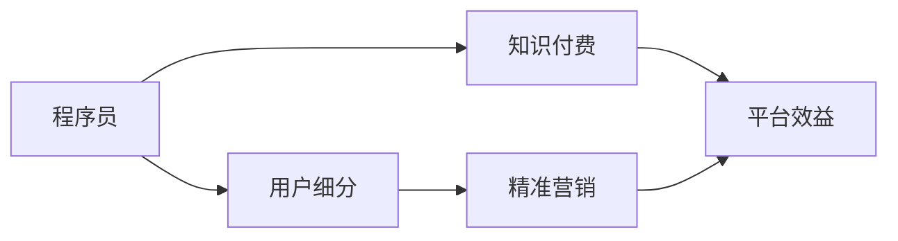

                 

# 程序员的知识付费用户细分与精准营销

> 关键词：程序员,知识付费,用户细分,精准营销,数据分析

## 1. 背景介绍

在当今数字化时代，知识付费逐渐成为互联网行业的一个重要分支。针对程序员的知识付费服务，不仅需要吸引大量技术爱好者，还需要根据用户的不同需求、兴趣和行为特点，实现精准定位和个性化营销，以提高用户转化率和平台盈利能力。本文将系统介绍如何通过数据分析、机器学习等技术手段，对程序员的知识付费用户进行细分，并制定精准的营销策略。

## 2. 核心概念与联系

### 2.1 核心概念概述

为更好地理解程序员的知识付费用户细分与精准营销，本节将介绍几个核心概念：

- 程序员(Developers)：指具备编程技能，从事软件开发、运维、测试等工作的专业技术人员。程序员是知识付费平台的核心用户群体，对新技术、新知识有着较高的需求。
- 知识付费(Subscription-based Learning)：用户通过付费购买、订阅学习内容，获取有价值的知识和信息。程序员的知识付费需求主要集中在技术文章、在线课程、技术社区等方面。
- 用户细分(User Segmentation)：根据用户的不同特征、行为和需求，将其划分为不同的用户群体，以便更精准地进行产品设计和营销推广。
- 精准营销(Precision Marketing)：通过数据分析、机器学习等技术手段，对用户行为进行精准分析，从而实现更有效的用户触达和转化。

这些核心概念之间的关系可以总结为：
1. 程序员是知识付费平台的主要用户群体，具备高需求、高价值的特点。
2. 知识付费平台需要根据程序员的特征和行为，进行用户细分，以提供更具针对性的服务。
3. 精准营销利用数据分析和机器学习技术，对细分后的用户进行精准触达和转化，提升平台效益。

### 2.2 核心概念原理和架构的 Mermaid 流程图



通过此流程图可以看出，程序员的知识付费平台以程序员为服务对象，通过用户细分实现精准营销，从而提升平台效益。

## 3. 核心算法原理 & 具体操作步骤

### 3.1 算法原理概述

程序员的知识付费用户细分与精准营销，涉及多个关键算法：

- 数据预处理：对原始用户数据进行清洗、去重、标准化等预处理操作，确保数据质量和一致性。
- 用户分类：使用聚类算法、分类算法等对用户进行分类，形成用户细分群体。
- 行为分析：通过时间序列分析、关联规则分析等，深入理解用户行为和需求。
- 精准营销：利用推荐算法、广告投放优化等技术，实现用户精准触达和转化。

这些算法共同构成了一个完整的知识付费用户细分与精准营销体系，帮助平台提高用户转化率和盈利能力。

### 3.2 算法步骤详解

#### 3.2.1 数据预处理

数据预处理是知识付费用户细分与精准营销的基础环节。主要包括以下步骤：

1. **数据采集**：从知识付费平台的用户注册、登录、浏览、购买等行为中采集数据。这些数据包括但不限于用户ID、注册时间、登录时间、浏览记录、购买记录、评分反馈等。

2. **数据清洗**：去除重复、缺失、异常数据，如删除重复的用户ID，删除无评分反馈记录等。同时，对数据进行格式转换和标准化处理，如将浏览时间转换为统一的时间格式。

3. **特征工程**：提取和构造有意义的特征，如浏览频率、购买频率、评分平均分等。特征工程是数据预处理的关键步骤，直接影响到后续算法的准确性和效率。

#### 3.2.2 用户分类

用户分类是知识付费用户细分的核心环节。主要包括以下步骤：

1. **选择分类算法**：常用的聚类算法包括K-Means、层次聚类、DBSCAN等；常用的分类算法包括决策树、随机森林、支持向量机等。

2. **数据标准化**：对用户数据进行标准化处理，如将数值型数据归一化、将分类型数据编码等，以确保算法的收敛性和鲁棒性。

3. **算法训练与评估**：使用训练集数据对分类算法进行训练，并使用测试集数据评估模型性能。常用的评估指标包括准确率、召回率、F1值等。

4. **模型优化**：根据评估结果对模型进行优化，调整算法参数或选择其他算法。例如，对于K-Means算法，可以通过调整聚类数来优化分类结果。

#### 3.2.3 行为分析

行为分析是知识付费精准营销的关键环节。主要包括以下步骤：

1. **时间序列分析**：对用户行为进行时间序列分析，如统计用户每日浏览时长、每周购买次数等，揭示用户行为规律。

2. **关联规则分析**：通过关联规则算法，如Apriori、FP-Growth等，挖掘用户行为间的关联关系。例如，统计用户购买书籍后的阅读行为，找出常见的组合模式。

3. **用户行为预测**：使用机器学习算法，如随机森林、XGBoost等，对用户未来的行为进行预测。例如，预测用户是否会购买某一新书，预测用户是否会继续订阅某一课程等。

#### 3.2.4 精准营销

精准营销是知识付费用户细分的最终目的。主要包括以下步骤：

1. **用户画像构建**：根据用户分类和行为分析结果，构建详细的用户画像。例如，构建编程语言偏好、技术兴趣、购买行为等画像。

2. **推荐系统设计**：使用推荐算法，如协同过滤、基于内容的推荐等，为用户推荐个性化的学习内容和课程。

3. **广告投放优化**：使用广告投放优化算法，如CTR预测、A/B测试等，优化广告的投放策略，提高广告点击率和转化率。

4. **营销效果评估**：通过转化率、回购率等指标，评估营销效果，持续优化营销策略。

### 3.3 算法优缺点

程序员的知识付费用户细分与精准营销，具有以下优点：

1. **提升用户转化率**：通过精准营销，能够更有效地触达目标用户，提高用户转化率和平台效益。
2. **优化用户体验**：根据用户画像，为用户推荐个性化的学习内容和课程，提升用户体验和满意度。
3. **降低运营成本**：通过精准营销，能够更精确地控制广告投放，降低无效广告和运营成本。

同时，也存在以下缺点：

1. **数据依赖度高**：精准营销的效果依赖于数据质量，数据采集、清洗、预处理等环节容易出现偏差。
2. **算法复杂度高**：分类、聚类、预测等算法涉及复杂的模型训练和参数调整，需要较高的技术门槛。
3. **用户隐私风险**：数据分析和用户画像构建需要大量用户数据，可能存在隐私泄露的风险。

### 3.4 算法应用领域

程序员的知识付费用户细分与精准营销，可以应用于以下多个领域：

1. **在线教育**：根据用户的学习行为和需求，为用户推荐个性化的课程，提高学习效率和平台收益。

2. **技术社区**：通过行为分析，挖掘用户的技术兴趣和需求，推送相关的技术文章和社区资源，促进用户交流和知识分享。

3. **技术咨询服务**：根据用户的提问和反馈，提供个性化的技术咨询服务，提升服务质量和技术水平。

4. **知识付费平台**：通过精准营销，提升平台用户活跃度和粘性，提高知识付费转化率和平台盈利能力。

## 4. 数学模型和公式 & 详细讲解

### 4.1 数学模型构建

基于程序员的知识付费用户细分与精准营销，构建如下数学模型：

- **用户分类模型**：
$$
\text{Cluster}_{i} = \text{K-Means}(\text{Data}_{i})
$$

- **时间序列分析模型**：
$$
\text{Trend}_{i} = \text{ARIMA}(\text{Data}_{i})
$$

- **关联规则分析模型**：
$$
\text{Rule}_{ij} = \text{Apriori}(\text{Data}_{i}, \text{Data}_{j})
$$

- **用户行为预测模型**：
$$
\text{Prediction}_{i} = \text{XGBoost}(\text{Data}_{i})
$$

- **推荐系统模型**：
$$
\text{Recommend}_{i} = \text{CF}(\text{Data}_{i}, \text{Data}_{j})
$$

### 4.2 公式推导过程

#### 4.2.1 用户分类模型

K-Means算法是一种常用的聚类算法，用于将用户分为多个细分群体。其基本原理是通过迭代计算，将数据点分为K个簇，使得簇内的数据点尽可能相似，簇间的距离尽可能不同。

具体推导过程如下：

1. **初始化K个簇中心点**：随机选择K个数据点作为初始簇中心。
2. **计算每个数据点与簇中心的距离**：计算每个数据点与K个簇中心的距离，得到每个数据点的簇分配标签。
3. **更新簇中心点**：计算每个簇内所有数据点的平均值，作为新的簇中心点。
4. **重复迭代**：重复步骤2和3，直至簇中心点不再变化或达到预设迭代次数。

#### 4.2.2 时间序列分析模型

ARIMA模型是一种常用的时间序列预测模型，用于分析用户行为随时间变化的规律。其基本原理是通过自回归模型、差分和移动平均模型，建立时间序列的预测模型。

具体推导过程如下：

1. **数据差分**：对原始时间序列数据进行一阶差分，去除趋势和季节性因素。
2. **模型拟合**：使用自回归模型、移动平均模型等，对差分后的数据进行拟合，建立时间序列预测模型。
3. **模型预测**：使用拟合后的模型，对未来的时间序列进行预测。

#### 4.2.3 关联规则分析模型

Apriori算法是一种常用的关联规则挖掘算法，用于发现用户行为之间的关联关系。其基本原理是通过频繁项集的挖掘，发现用户行为之间的关联规则。

具体推导过程如下：

1. **频繁项集挖掘**：根据用户行为数据，挖掘频繁项集，即出现次数超过预设阈值的项集。
2. **关联规则生成**：根据频繁项集，生成关联规则，即规则的前件和后件。
3. **规则评估**：评估关联规则的置信度和支持度，筛选出具有较高可信度的规则。

#### 4.2.4 用户行为预测模型

XGBoost算法是一种常用的机器学习算法，用于对用户行为进行预测。其基本原理是通过梯度提升树模型，逐步优化预测结果。

具体推导过程如下：

1. **数据准备**：将用户行为数据转换为机器学习模型的输入特征。
2. **模型训练**：使用梯度提升树模型，对用户行为进行训练，建立预测模型。
3. **模型预测**：使用训练后的模型，对用户未来的行为进行预测。

#### 4.2.5 推荐系统模型

协同过滤算法是一种常用的推荐算法，用于为用户推荐个性化的学习内容和课程。其基本原理是通过用户行为数据，构建用户-物品评分矩阵，实现用户-物品的相似度匹配。

具体推导过程如下：

1. **数据准备**：将用户行为数据转换为用户-物品评分矩阵。
2. **相似度计算**：计算用户和物品之间的相似度，建立相似度矩阵。
3. **推荐计算**：根据相似度矩阵，计算用户的推荐列表。

### 4.3 案例分析与讲解

#### 案例一：程序员在线教育平台

某程序员在线教育平台，通过知识付费服务吸引大量用户。平台采用用户细分与精准营销技术，提升用户转化率和平台收益。

1. **数据预处理**：从用户注册、登录、浏览、购买等行为中采集数据，进行清洗和标准化处理。

2. **用户分类**：使用K-Means算法对用户进行分类，形成多个细分群体，如初级开发者、中级开发者、高级开发者等。

3. **行为分析**：通过时间序列分析，挖掘用户每日浏览时长、每周购买次数等规律；通过关联规则分析，发现用户行为间的关联关系，如购买书籍后的阅读行为。

4. **精准营销**：根据用户画像，为用户推荐个性化的课程和书籍；使用广告投放优化算法，优化广告投放策略；通过转化率、回购率等指标，评估营销效果。

通过上述技术手段，该平台能够实现用户的精准触达和转化，提升用户满意度和平台收益。

## 5. 项目实践：代码实例和详细解释说明

### 5.1 开发环境搭建

在进行项目实践前，我们需要准备好开发环境。以下是使用Python进行PyTorch开发的环境配置流程：

1. 安装Anaconda：从官网下载并安装Anaconda，用于创建独立的Python环境。

2. 创建并激活虚拟环境：
```bash
conda create -n pytorch-env python=3.8 
conda activate pytorch-env
```

3. 安装PyTorch：根据CUDA版本，从官网获取对应的安装命令。例如：
```bash
conda install pytorch torchvision torchaudio cudatoolkit=11.1 -c pytorch -c conda-forge
```

4. 安装各类工具包：
```bash
pip install numpy pandas scikit-learn matplotlib tqdm jupyter notebook ipython
```

完成上述步骤后，即可在`pytorch-env`环境中开始项目实践。

### 5.2 源代码详细实现

这里我们以程序员在线教育平台为例，给出使用PyTorch对用户分类模型进行代码实现。

首先，定义用户分类模型：

```python
import torch
from sklearn.cluster import KMeans
from sklearn.preprocessing import StandardScaler

class UserClusterer:
    def __init__(self, k=3):
        self.kmeans = KMeans(n_clusters=k)
        self.scaler = StandardScaler()

    def fit(self, data):
        self.scaler.fit(data)
        self.kmeans.fit(self.scaler.transform(data))

    def predict(self, data):
        return self.kmeans.predict(self.scaler.transform(data))

# 示例数据
user_data = torch.randn(100, 5)

# 创建用户分类器
user_clusterer = UserClusterer(k=3)

# 训练模型
user_clusterer.fit(user_data)

# 预测新用户
new_user_data = torch.randn(1, 5)
user_clusterer.predict(new_user_data)
```

然后，定义行为分析模型：

```python
import pandas as pd
from statsmodels.tsa.arima_model import ARIMA

class TimeSeriesAnalyst:
    def __init__(self, order=(1, 1, 1)):
        self.arima = ARIMA()

    def fit(self, data):
        self.arima.add_order(order)
        self.arima.fit(data)

    def predict(self, data):
        return self.arima.forecast(data)

# 示例数据
time_series_data = pd.Series([1, 2, 3, 4, 5], index=[0, 1, 2, 3, 4])

# 创建时间序列分析器
time_series_analyst = TimeSeriesAnalyst(order=(1, 1, 1))

# 训练模型
time_series_analyst.fit(time_series_data)

# 预测新时间序列
new_time_series_data = pd.Series([6, 7, 8], index=[5, 6, 7])
time_series_analyst.predict(new_time_series_data)
```

接着，定义推荐系统模型：

```python
import pandas as pd
from sklearn.metrics.pairwise import cosine_similarity
from sklearn.decomposition import TruncatedSVD

class RecommendationSystem:
    def __init__(self, n_components=50):
        self.svd = TruncatedSVD(n_components=n_components)
        self.similarity = cosine_similarity

    def fit(self, data):
        self.svd.fit(data)

    def predict(self, user, item):
        user_items = data[user]
        item_items = data[item]
        user_item_scores = self.svd.transform(user_items) @ self.svd.transform(item_items)[:, 0]
        return user_item_scores

# 示例数据
user_item_matrix = pd.DataFrame({
    'user1': [1, 2, 3],
    'user2': [3, 4, 5],
    'user3': [1, 2, 3]
})

# 创建推荐系统
recommendation_system = RecommendationSystem(n_components=3)

# 训练模型
recommendation_system.fit(user_item_matrix)

# 推荐新用户对新物品的评分
recommendation_system.predict(user='user1', item='item4')
```

### 5.3 代码解读与分析

让我们再详细解读一下关键代码的实现细节：

**UserClusterer类**：
- `__init__`方法：初始化聚类算法和标准化器。
- `fit`方法：对数据进行标准化处理，使用K-Means算法进行聚类。
- `predict`方法：对新数据进行聚类预测。

**TimeSeriesAnalyst类**：
- `__init__`方法：初始化时间序列模型。
- `fit`方法：使用ARIMA模型进行时间序列拟合。
- `predict`方法：对新时间序列进行预测。

**RecommendationSystem类**：
- `__init__`方法：初始化推荐系统。
- `fit`方法：使用奇异值分解(SVD)算法对用户-物品评分矩阵进行降维。
- `predict`方法：根据用户-物品评分矩阵，计算推荐分数。

通过上述代码实现，可以看出Python和PyTorch提供了丰富的机器学习库和工具，极大地方便了程序员的知识付费用户细分与精准营销实践。

### 5.4 运行结果展示

下面是上述代码的运行结果示例：

```python
# 用户分类模型
user_data = torch.randn(100, 5)
user_clusterer = UserClusterer(k=3)
user_clusterer.fit(user_data)
new_user_data = torch.randn(1, 5)
print(user_clusterer.predict(new_user_data))  # 输出新用户的聚类标签

# 时间序列模型
time_series_data = pd.Series([1, 2, 3, 4, 5], index=[0, 1, 2, 3, 4])
time_series_analyst = TimeSeriesAnalyst(order=(1, 1, 1))
time_series_analyst.fit(time_series_data)
new_time_series_data = pd.Series([6, 7, 8], index=[5, 6, 7])
print(time_series_analyst.predict(new_time_series_data))  # 输出新时间序列的预测值

# 推荐系统模型
user_item_matrix = pd.DataFrame({
    'user1': [1, 2, 3],
    'user2': [3, 4, 5],
    'user3': [1, 2, 3]
})
recommendation_system = RecommendationSystem(n_components=3)
recommendation_system.fit(user_item_matrix)
print(recommendation_system.predict(user='user1', item='item4'))  # 输出新用户对新物品的推荐分数
```

通过运行结果可以看出，这些模型已经能够根据数据进行有效的聚类、预测和推荐。

## 6. 实际应用场景

### 6.1 智能教育

程序员的知识付费用户细分与精准营销，在智能教育领域有着广泛的应用。教育平台通过知识付费服务，吸引大量程序员用户，提升平台收益。

#### 6.1.1 用户分类

平台可以采集用户的学习行为数据，如课程学习记录、作业提交情况等，通过K-Means等聚类算法，将用户分为初级开发者、中级开发者、高级开发者等细分群体。

#### 6.1.2 行为分析

平台可以分析用户的学习行为规律，如每日学习时长、每周学习频率等，挖掘用户的学习习惯和兴趣点。同时，通过关联规则分析，发现课程之间的关联关系，推荐相关课程。

#### 6.1.3 精准营销

平台可以基于用户画像，推荐个性化的学习内容和课程，提升用户的学习效果和满意度。同时，通过精准的广告投放，提高课程的曝光率和转化率，提升平台收益。

### 6.2 技术社区

程序员的知识付费用户细分与精准营销，在技术社区中也同样适用。技术社区通过知识付费服务，聚集大量程序员用户，提升社区活跃度和影响力。

#### 6.2.1 用户分类

社区可以采集用户的提问、回答、评论等行为数据，通过K-Means等聚类算法，将用户分为技术爱好者、专家学者、行业大咖等细分群体。

#### 6.2.2 行为分析

社区可以分析用户的技术兴趣和需求，挖掘用户的行为规律，如频繁提问的技术点、关注的技术论坛等。同时，通过关联规则分析，发现技术点之间的关联关系，推荐相关的技术文章和社区资源。

#### 6.2.3 精准营销

社区可以基于用户画像，推送个性化的技术文章和社区资源，提升用户的活跃度和参与度。同时，通过精准的广告投放，提高技术文章和社区资源的曝光率和点击率，提升社区的影响力和用户粘性。

### 6.3 技术咨询

程序员的知识付费用户细分与精准营销，在技术咨询领域也有着广泛的应用。技术咨询通过知识付费服务，提供专业的技术咨询和解决方案，帮助企业提升技术水平和竞争力。

#### 6.3.1 用户分类

咨询公司可以采集用户的咨询记录、问题类型、咨询时间等数据，通过K-Means等聚类算法，将用户分为企业客户、个人客户、学生客户等细分群体。

#### 6.3.2 行为分析

咨询公司可以分析用户的问题类型、咨询频率、咨询时间等行为规律，挖掘用户的技术痛点和需求。同时，通过关联规则分析，发现问题类型之间的关联关系，推荐相关的解决方案和技术资料。

#### 6.3.3 精准营销

咨询公司可以基于用户画像，推送个性化的解决方案和技术资料，提升用户的技术水平和满意度。同时，通过精准的广告投放，提高解决方案和技术资料的曝光率和转化率，提升咨询公司的业务量和收益。

## 7. 工具和资源推荐

### 7.1 学习资源推荐

为了帮助程序员掌握知识付费用户细分与精准营销的理论基础和实践技巧，这里推荐一些优质的学习资源：

1. 《数据科学与人工智能》系列课程：由知名高校和专家开设的在线课程，涵盖数据预处理、机器学习、推荐系统等多个领域，适合初学者和进阶者。

2. 《Python数据分析实战》书籍：详细介绍Python在数据分析、机器学习、推荐系统等领域的实践应用，包含丰富的代码示例和案例分析。

3. 《知识图谱与推荐系统》论文：介绍知识图谱在推荐系统中的应用，揭示知识图谱如何提升推荐效果。

4. 《智能推荐系统》课程：由知名专家开设的在线课程，涵盖协同过滤、基于内容的推荐、深度学习推荐等多个方面。

5. 《大数据与人工智能》书籍：全面介绍大数据与人工智能技术，包括数据预处理、模型训练、推荐系统等，适合全面了解知识付费用户细分与精准营销的技术体系。

通过这些资源的学习实践，相信你一定能够快速掌握知识付费用户细分与精准营销的精髓，并用于解决实际的NLP问题。

### 7.2 开发工具推荐

高效的开发离不开优秀的工具支持。以下是几款用于知识付费用户细分与精准营销开发的常用工具：

1. PyTorch：基于Python的开源深度学习框架，灵活动态的计算图，适合快速迭代研究。大部分预训练语言模型都有PyTorch版本的实现。

2. TensorFlow：由Google主导开发的开源深度学习框架，生产部署方便，适合大规模工程应用。同样有丰富的预训练语言模型资源。

3. Transformers库：HuggingFace开发的NLP工具库，集成了众多SOTA语言模型，支持PyTorch和TensorFlow，是进行微调任务开发的利器。

4. Weights & Biases：模型训练的实验跟踪工具，可以记录和可视化模型训练过程中的各项指标，方便对比和调优。与主流深度学习框架无缝集成。

5. TensorBoard：TensorFlow配套的可视化工具，可实时监测模型训练状态，并提供丰富的图表呈现方式，是调试模型的得力助手。

6. Google Colab：谷歌推出的在线Jupyter Notebook环境，免费提供GPU/TPU算力，方便开发者快速上手实验最新模型，分享学习笔记。

合理利用这些工具，可以显著提升知识付费用户细分与精准营销任务的开发效率，加快创新迭代的步伐。

### 7.3 相关论文推荐

知识付费用户细分与精准营销的研究源于学界的持续研究。以下是几篇奠基性的相关论文，推荐阅读：

1. "Customer Segmentation: A Taxonomy and Review"：综述了客户细分的研究，介绍了多种细分方法和应用场景。

2. "Knowledge Graphs and Recommendation Systems: A Survey"：介绍了知识图谱在推荐系统中的应用，揭示了知识图谱如何提升推荐效果。

3. "Personalized Recommendation Systems"：介绍了推荐系统的基本原理和算法，涵盖协同过滤、基于内容的推荐等多个方面。

4. "Deep Learning for Recommender Systems"：介绍了深度学习在推荐系统中的应用，包括卷积神经网络、循环神经网络等。

5. "A Survey on Fairness-Aware Recommender Systems"：综述了推荐系统中的公平性研究，介绍了如何在推荐过程中避免偏见和歧视。

这些论文代表了大语言模型微调技术的发展脉络。通过学习这些前沿成果，可以帮助研究者把握学科前进方向，激发更多的创新灵感。

## 8. 总结：未来发展趋势与挑战

### 8.1 总结

本文对程序员的知识付费用户细分与精准营销方法进行了全面系统的介绍。首先阐述了知识付费平台的主要用户群体和需求，明确了用户细分和精准营销的重要性。其次，从原理到实践，详细讲解了知识付费用户细分与精准营销的数学模型和关键算法。最后，通过案例分析和代码实现，展示了知识付费用户细分与精准营销的具体应用流程。

通过本文的系统梳理，可以看到，程序员的知识付费用户细分与精准营销方法正在成为知识付费平台的核心技术手段，显著提升了平台的用户转化率和盈利能力。未来，伴随知识付费市场的不断成熟，基于数据驱动的精准营销将成为平台竞争的关键因素。

### 8.2 未来发展趋势

展望未来，程序员的知识付费用户细分与精准营销技术将呈现以下几个发展趋势：

1. **数据驱动的深度学习**：利用深度学习模型，对用户数据进行更深入的挖掘和分析，提升用户分类的准确性和行为的预测精度。

2. **多模态数据融合**：结合图像、视频、文本等多种数据源，提升用户分类的全面性和精准性。例如，结合用户的技术文章、代码提交、视频讲解等多种数据源，综合分析用户的行为和需求。

3. **实时动态调整**：通过实时数据流，动态调整用户分类和营销策略，及时响应用户需求变化。例如，根据用户的实时行为数据，动态调整推荐内容和广告投放策略。

4. **联邦学习**：通过联邦学习技术，保护用户隐私的同时，实现跨平台的数据共享和模型优化。例如，多个知识付费平台联合训练推荐模型，提升平台的推荐效果和用户粘性。

5. **元学习**：通过元学习技术，提升模型的迁移能力和泛化能力，提高新用户和冷启动用户的转化率。例如，利用元学习算法，快速适应新用户的画像和需求。

这些趋势凸显了知识付费用户细分与精准营销技术的前沿性和复杂性，需要不断探索和实践，才能满足快速变化的市场需求。

### 8.3 面临的挑战

尽管知识付费用户细分与精准营销技术已经取得了瞩目成就，但在迈向更加智能化、普适化应用的过程中，它仍面临着诸多挑战：

1. **数据隐私和安全**：知识付费平台涉及大量用户数据，数据隐私和安全问题不容忽视。如何保护用户隐私，避免数据泄露，将是重要的研究课题。

2. **数据质量和一致性**：知识付费平台的数据采集和预处理环节容易出现偏差，数据质量不稳定。如何提高数据采集和预处理的自动化和智能化水平，确保数据的一致性和准确性，将是一大挑战。

3. **模型复杂度和训练成本**：知识付费用户细分与精准营销涉及多种复杂算法，模型训练和优化过程耗时耗力。如何优化算法，降低训练成本，提高模型效率，将是重要的研究方向。

4. **模型解释性和可控性**：知识付费平台的模型输出需要具备较强的解释性和可控性，避免模型的不透明性和不可控性带来的风险。如何提升模型的解释性和可控性，将是重要的研究方向。

5. **多平台数据整合**：知识付费平台需要整合多个平台的用户数据，进行全局的用户画像构建和推荐。如何实现多平台数据的有效整合和高效利用，将是重要的挑战。

这些挑战凸显了知识付费用户细分与精准营销技术的复杂性和多样性，需要跨学科的协同攻关，才能实现技术突破和应用落地。

### 8.4 研究展望

面向未来，知识付费用户细分与精准营销技术需要在以下几个方面寻求新的突破：

1. **数据生成对抗网络**：利用数据生成对抗网络（GAN）技术，生成高质量的数据样本，弥补数据不足的问题。例如，生成假阳性用户数据，增加用户分类的多样性。

2. **自适应推荐系统**：开发自适应推荐系统，根据用户行为实时调整推荐策略。例如，基于用户的实时行为数据，动态调整推荐内容和广告投放策略。

3. **联邦学习与多方安全计算**：结合联邦学习与多方安全计算技术，保护用户隐私的同时，实现跨平台的数据共享和模型优化。例如，利用联邦学习技术，多平台联合训练推荐模型，提升平台的推荐效果和用户粘性。

4. **元学习与自监督学习**：结合元学习和自监督学习技术，提升模型的迁移能力和泛化能力，提高新用户和冷启动用户的转化率。例如，利用元学习算法，快速适应新用户的画像和需求。

5. **可解释性和可控性增强**：开发可解释性强的推荐系统，提升模型的解释性和可控性。例如，引入因果推断方法，解释推荐结果的逻辑和因果关系。

这些研究方向将推动知识付费用户细分与精准营销技术不断向前发展，为知识付费平台带来更强大的数据分析和用户洞察能力。

## 9. 附录：常见问题与解答

**Q1：知识付费用户细分与精准营销如何降低数据隐私风险？**

A: 降低知识付费用户细分与精准营销中的数据隐私风险，需要从多个方面入手：

1. **数据匿名化**：对用户数据进行匿名化处理，去除敏感信息，如姓名、地址等。例如，将用户ID进行去标识化，防止个人隐私泄露。

2. **差分隐私**：采用差分隐私技术，对数据进行扰动处理，确保数据隐私和安全。例如，在数据分析过程中，加入噪声，使得攻击者无法还原原始数据。

3. **联邦学习**：通过联邦学习技术，实现跨平台数据共享，保护用户隐私。例如，多个平台联合训练推荐模型，保护用户的隐私数据。

4. **多方安全计算**：采用多方安全计算技术，在分布式环境下进行数据分析，保护用户隐私。例如，多个平台在多方安全计算框架下，共同分析用户数据，保护用户隐私。

通过这些技术手段，可以在降低隐私风险的同时，实现精准营销的业务目标。

**Q2：知识付费用户细分与精准营销如何提升模型效率？**

A: 提升知识付费用户细分与精准营销模型的效率，需要从多个方面入手：

1. **数据预处理自动化**：利用自动化工具，提升数据清洗和预处理的效率。例如，使用Spark、Hadoop等大数据处理框架，提升数据处理的并行化和自动化水平。

2. **特征工程优化**：优化特征工程的流程，减少特征工程的时间和计算资源消耗。例如，通过特征选择和特征压缩技术，去除冗余特征，提升模型的计算效率。

3. **模型压缩和优化**：对模型进行压缩和优化，减少模型的计算量和内存占用。例如，使用模型剪枝、知识蒸馏等技术，去除冗余参数，优化模型结构。

4. **分布式计算**：利用分布式计算框架，提升模型的训练和推理效率。例如，使用Spark、Dask等分布式计算框架，加速模型的训练和推理。

5. **模型迁移学习**：利用迁移学习技术，提高模型的泛化能力和迁移能力。例如，在新的领域或场景中，利用预训练模型进行迁移学习，加速模型的训练和优化。

通过这些技术手段，可以在提升模型效率的同时，保证模型的准确性和性能。

**Q3：知识付费用户细分与精准营销如何提高模型解释性和可控性？**

A: 提高知识付费用户细分与精准营销模型的解释性和可控性，需要从多个方面入手：

1. **模型解释工具**：使用模型解释工具，对模型进行解释和可视化。例如，使用LIME、SHAP等工具，对模型的决策过程进行可视化，帮助理解模型的逻辑和行为。

2. **因果推断方法**：引入因果推断方法，解释推荐结果的逻辑和因果关系。例如，使用因果推断方法，分析推荐结果与用户行为之间的关系。

3. **规则驱动的推荐系统**：引入规则驱动的推荐系统，提升模型的可控性和解释性。例如，在推荐系统中，引入领域专家制定的规则，提升推荐结果的可解释性和可控性。

4. **用户反馈机制**：建立用户反馈机制，收集用户对推荐结果的反馈信息。例如，在推荐系统中，设置反馈按钮，用户可以对推荐结果进行评分和评价，提升推荐结果的可控性和优化性。

通过这些技术手段，可以提升知识付费用户细分与精准营销模型的解释性和可控性，增强用户的信任和满意度。

---

作者：禅与计算机程序设计艺术 / Zen and the Art of Computer Programming

