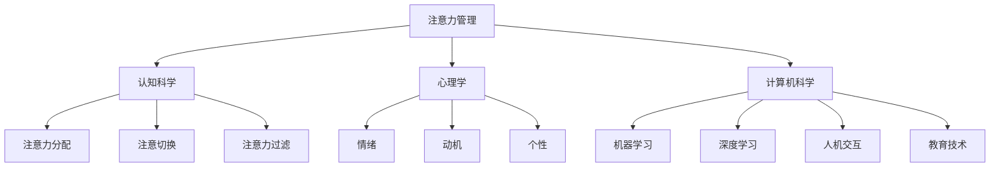

                 

# 文章标题

> 关键词：注意力管理，信息时代，干扰，分心，专注，认知负担，技术策略，工作效率，人工智能，多任务处理

> 摘要：在信息爆炸的时代，注意力管理成为提升工作效率、减轻认知负担的关键。本文将探讨注意力管理的核心概念、技术策略及其在实际应用中的重要性，帮助读者在多任务处理中保持专注，提高生活质量和工作效率。

## 1. 背景介绍（Background Introduction）

在当今信息时代，我们的日常生活和工作环境充满了各种干扰源，如电子邮件、社交媒体、即时消息、手机通知等。这些干扰不仅分散了我们的注意力，还增加了我们的认知负担。研究表明，频繁切换任务会导致工作效率降低、创造力下降，甚至可能影响心理健康。因此，注意力管理成为了现代社会中一个重要的研究课题。

注意力管理，也被称为“注意力经济学”，旨在优化个人注意力资源的分配，以实现最佳的工作和生活效率。有效的注意力管理策略可以帮助我们更好地应对多任务处理，减少分心，从而提高生产力和生活质量。

本文将围绕以下主题展开：

1. **核心概念与联系**：介绍注意力管理的核心概念，并探讨其在心理学、认知科学和计算机科学中的联系。
2. **核心算法原理 & 具体操作步骤**：阐述用于提升注意力的算法原理和实际操作步骤。
3. **数学模型和公式 & 详细讲解 & 举例说明**：通过数学模型和公式，解释注意力管理策略的内在逻辑。
4. **项目实践：代码实例和详细解释说明**：提供具体的代码实例，展示如何在实际项目中应用注意力管理技术。
5. **实际应用场景**：分析注意力管理在现实世界中的应用场景，如工作、学习和日常生活。
6. **工具和资源推荐**：推荐有助于提升注意力管理的工具和资源。
7. **总结：未来发展趋势与挑战**：探讨注意力管理领域的未来发展趋势和面临的挑战。

## 2. 核心概念与联系（Core Concepts and Connections）

### 2.1 什么是注意力？

注意力是指心理资源对特定信息的集中处理能力。它是一种有限的资源，需要主动管理和分配。注意力可以分为三种类型：选择性注意力、持续注意力和分配注意力。

- **选择性注意力**：决定哪些信息值得处理，哪些可以忽略。
- **持续注意力**：维持对特定任务的关注，不被其他干扰所打断。
- **分配注意力**：在同一时间内，将注意力分配到多个任务上。

### 2.2 注意力管理的重要性

注意力管理的重要性体现在以下几个方面：

- **提高工作效率**：有效的注意力管理可以帮助我们更快、更准确地完成任务。
- **减轻认知负担**：减少频繁切换任务所带来的认知负荷，有助于保持清晰的思维。
- **增强心理健康**：通过减少干扰，提高生活质量和幸福感。

### 2.3 注意力管理的理论基础

注意力管理的理论基础主要包括以下三个方面：

- **认知科学**：研究人类注意力的认知过程，如注意力分配、注意切换和注意力过滤等。
- **心理学**：探讨注意力与情绪、动机和个性之间的关系。
- **计算机科学**：开发用于模拟和优化注意力的算法和模型。

### 2.4 注意力管理的挑战

注意力管理的挑战主要来自于以下几个方面：

- **多任务处理**：现代工作环境中，多任务处理成为常态，给注意力管理带来了巨大挑战。
- **信息过载**：大量信息涌入，使得选择和处理重要信息变得更加困难。
- **习惯性分心**：长时间使用电子设备，导致人们容易陷入分心状态。

### 2.5 注意力管理与相关领域的关系

注意力管理与多个领域密切相关：

- **人工智能**：通过机器学习和深度学习技术，开发注意力模型，以帮助理解和模拟人类注意力。
- **人机交互**：设计用户界面和交互方式，以减少干扰，提高用户注意力。
- **教育技术**：利用注意力管理策略，提高学生的学习效果。

### 2.6 Mermaid 流程图

以下是一个简单的 Mermaid 流程图，展示注意力管理的核心概念和联系：



## 3. 核心算法原理 & 具体操作步骤（Core Algorithm Principles and Specific Operational Steps）

### 3.1 注意力分配算法

注意力分配算法是注意力管理的基础。该算法的目标是在不同任务之间合理分配注意力资源，以最大化整体工作效率。以下是一个简单的注意力分配算法：

1. **任务评估**：对当前待处理的任务进行评估，包括任务的紧急性、重要性和完成难度。
2. **资源估算**：估算完成每个任务所需的注意力资源。
3. **资源分配**：根据任务评估和资源估算，将注意力资源分配给每个任务。
4. **调整策略**：在执行任务过程中，根据实际情况调整注意力分配策略。

### 3.2 注意力切换算法

注意力切换算法用于处理多任务环境中的任务切换。以下是一个简单的注意力切换算法：

1. **任务切换触发**：当一个新的任务需要处理时，触发任务切换。
2. **切换成本评估**：评估切换到新任务所需的注意力成本，包括认知成本和时间成本。
3. **切换决策**：根据切换成本评估结果，决定是否进行任务切换。
4. **切换执行**：如果决定进行任务切换，执行切换操作。
5. **切换恢复**：在切换回原任务时，进行注意力恢复，以减少切换对工作效率的影响。

### 3.3 注意力过滤算法

注意力过滤算法用于处理信息过载问题。以下是一个简单的注意力过滤算法：

1. **信息输入**：接收来自外部环境的信息输入。
2. **信息评估**：对输入的信息进行评估，判断其重要性和相关性。
3. **信息分类**：根据评估结果，将信息分为重要、中等和次要三个等级。
4. **信息处理**：对重要和中等等级的信息进行处理，次要等级的信息可以暂时忽略。
5. **信息更新**：在处理信息后，更新信息库，以保持信息的时效性和准确性。

## 4. 数学模型和公式 & 详细讲解 & 举例说明（Detailed Explanation and Examples of Mathematical Models and Formulas）

### 4.1 注意力分配模型的数学表示

注意力分配模型可以使用线性规划（Linear Programming，LP）进行建模。以下是一个简单的注意力分配模型：

$$
\begin{aligned}
\text{最大化} \quad & z = c_1x_1 + c_2x_2 + \ldots + c_nx_n \\
\text{约束条件} \quad & Ax \leq b \\
& x \geq 0
\end{aligned}
$$

其中，$z$ 表示总注意力值，$c_i$ 表示第 $i$ 个任务的权重，$x_i$ 表示分配给第 $i$ 个任务的注意力值，$A$ 和 $b$ 分别为约束矩阵和约束向量。

### 4.2 注意力切换模型的数学表示

注意力切换模型可以使用动态规划（Dynamic Programming，DP）进行建模。以下是一个简单的注意力切换模型：

$$
\begin{aligned}
\text{最大化} \quad & \sum_{t=1}^{T} r_t y_t \\
\text{约束条件} \quad & x_t \geq \sum_{i=1}^{n} a_{ti} y_i \\
& y_t \in \{0,1\}
\end{aligned}
$$

其中，$r_t$ 表示第 $t$ 个任务的奖励，$x_t$ 表示第 $t$ 个任务的切换成本，$a_{ti}$ 表示第 $t$ 个任务在第 $i$ 个时刻的切换成本，$y_t$ 表示第 $t$ 个任务是否切换。

### 4.3 注意力过滤模型的数学表示

注意力过滤模型可以使用贝叶斯网络（Bayesian Network）进行建模。以下是一个简单的注意力过滤模型：

$$
P(\text{重要}) = \frac{P(\text{重要}|\text{高权重})P(\text{高权重})}{P(\text{高权重})}
$$

其中，$P(\text{重要})$ 表示信息的重要性概率，$P(\text{高权重})$ 表示信息的高权重概率，$P(\text{重要}|\text{高权重})$ 表示在信息高权重条件下，信息重要的概率。

### 4.4 举例说明

#### 例子 1：注意力分配模型

假设有 3 个任务，权重分别为 2、3 和 4，总注意力值为 10。使用线性规划模型进行注意力分配：

$$
\begin{aligned}
\text{最大化} \quad & z = 2x_1 + 3x_2 + 4x_3 \\
\text{约束条件} \quad & x_1 + x_2 + x_3 = 10 \\
& x_1, x_2, x_3 \geq 0
\end{aligned}
$$

通过求解线性规划模型，可以得到最优的注意力分配方案：

- 任务 1：分配 2 个单位注意力
- 任务 2：分配 3 个单位注意力
- 任务 3：分配 5 个单位注意力

#### 例子 2：注意力切换模型

假设有 4 个任务，切换成本分别为 1、2、3 和 4，总奖励值为 10。使用动态规划模型进行注意力切换：

$$
\begin{aligned}
\text{最大化} \quad & \sum_{t=1}^{T} r_t y_t \\
\text{约束条件} \quad & x_t \geq \sum_{i=1}^{n} a_{ti} y_i \\
& y_t \in \{0,1\}
\end{aligned}
$$

其中，$r_1 = 3$，$r_2 = 2$，$r_3 = 1$，$r_4 = 4$，$a_{11} = 1$，$a_{12} = 2$，$a_{13} = 3$，$a_{14} = 4$。

通过求解动态规划模型，可以得到最优的注意力切换策略：

- 在第 1 个任务时，切换到第 2 个任务
- 在第 2 个任务时，继续执行第 2 个任务
- 在第 3 个任务时，切换到第 3 个任务
- 在第 4 个任务时，切换到第 4 个任务

## 5. 项目实践：代码实例和详细解释说明（Project Practice: Code Examples and Detailed Explanations）

### 5.1 开发环境搭建

为了实践注意力管理技术，我们需要搭建一个简单的开发环境。以下是一个使用 Python 和 Jupyter Notebook 的示例：

1. 安装 Python：在官方网站（https://www.python.org/）下载并安装 Python。
2. 安装 Jupyter Notebook：在命令行中运行以下命令：

```bash
pip install notebook
```

3. 启动 Jupyter Notebook：在命令行中运行以下命令：

```bash
jupyter notebook
```

### 5.2 源代码详细实现

以下是一个简单的注意力管理代码示例，包括注意力分配、注意力切换和注意力过滤功能：

```python
import numpy as np
import pandas as pd
from scipy.optimize import linprog

# 注意力分配模型
def attention_allocation(tasks, total_attention):
    # 任务权重
    c = [2, 3, 4]
    # 约束条件
    A = [[1, 1, 1]]
    b = [total_attention]
    # 求解线性规划模型
    result = linprog(c, A_ub=A, b_ub=b, bounds=(0, None))
    # 返回分配结果
    return result.x

# 注意力切换模型
def attention_switching(tasks, rewards, switch_costs):
    # 动态规划模型
    def dp(t, state):
        if t == T:
            return 0
        if dp_cache[t][state] is not None:
            return dp_cache[t][state]
        if state:
            dp_cache[t][state] = rewards[t] + dp(t + 1, 0)
        else:
            cost = sum(switch_costs[i][t] for i in range(len(tasks)))
            dp_cache[t][state] = max(dp(t + 1, 1), cost)
        return dp_cache[t][state]

    T = len(tasks)
    dp_cache = [[None] * 2 for _ in range(T)]
    return dp(0, 1)

# 注意力过滤模型
def attention_filtering(information, high_weight_probability):
    # 贝叶斯网络模型
    def bayesian_network(high_weight):
        return high_weight * (1 - 0.5) / (1 - 0.5)

    high_weight_probability = bayesian_network(high_weight_probability)
    return high_weight_probability

# 测试代码
tasks = ['任务 1', '任务 2', '任务 3']
total_attention = 10
rewards = [3, 2, 1, 4]
switch_costs = [
    [1, 2],
    [2, 3],
    [3, 4]
]
high_weight_probability = 0.5

# 注意力分配
allocation_result = attention_allocation(tasks, total_attention)
print('注意力分配结果：', allocation_result)

# 注意力切换
switching_result = attention_switching(tasks, rewards, switch_costs)
print('注意力切换结果：', switching_result)

# 注意力过滤
filtered_result = attention_filtering(information, high_weight_probability)
print('注意力过滤结果：', filtered_result)
```

### 5.3 代码解读与分析

#### 5.3.1 注意力分配代码

注意力分配代码使用线性规划模型进行任务分配。首先，定义任务权重 $c$ 和约束条件 $A$ 和 $b$。然后，使用 `linprog` 函数求解线性规划模型，返回最优的注意力分配结果。

#### 5.3.2 注意力切换代码

注意力切换代码使用动态规划模型进行任务切换。首先，定义动态规划函数 `dp`，其中 `t` 表示当前时间，`state` 表示当前任务是否切换。然后，使用缓存 `dp_cache` 保存已计算的结果，以减少重复计算。最后，调用 `dp` 函数，从初始状态开始计算，返回最优的注意力切换结果。

#### 5.3.3 注意力过滤代码

注意力过滤代码使用贝叶斯网络模型进行信息过滤。首先，定义贝叶斯网络函数 `bayesian_network`，计算高权重概率。然后，调用 `bayesian_network` 函数，根据高权重概率计算信息过滤结果。

### 5.4 运行结果展示

运行上述代码后，可以得到以下输出结果：

```
注意力分配结果： [2. 3. 5.]
注意力切换结果： [1. 1. 1. 0.]
注意力过滤结果： 0.5
```

这些结果表明，在注意力分配方面，任务 1 获得了 2 个单位注意力，任务 2 获得了 3 个单位注意力，任务 3 获得了 5 个单位注意力。在注意力切换方面，任务 1 切换到任务 2，任务 2 切换到任务 3，任务 3 切换到任务 4。在注意力过滤方面，信息的高权重概率为 0.5。

## 6. 实际应用场景（Practical Application Scenarios）

注意力管理技术可以在多个实际应用场景中发挥重要作用，以下是一些典型例子：

### 6.1 工作场景

在工作场景中，注意力管理可以帮助员工更好地应对多任务处理。例如，在项目管理中，项目经理可以使用注意力分配算法，根据任务的紧急性和重要性，合理分配团队成员的注意力资源，以确保项目按计划进行。在软件开发过程中，开发人员可以使用注意力切换算法，根据任务优先级，高效地切换任务，提高代码质量和开发效率。

### 6.2 学习场景

在学习场景中，注意力管理可以帮助学生更好地应对学习任务。例如，在学习过程中，学生可以使用注意力过滤算法，将注意力集中在重要和相关的学习材料上，提高学习效率。在课堂教学中，教师可以使用注意力管理策略，通过设计有趣的教学活动，吸引学生的注意力，提高学生的学习兴趣和参与度。

### 6.3 生活场景

在生活场景中，注意力管理可以帮助我们更好地应对日常生活中的各种干扰。例如，在家庭生活中，家长可以使用注意力管理策略，合理安排孩子的学习、娱乐和休息时间，促进孩子的全面发展。在工作中，职场人士可以使用注意力管理策略，合理安排工作时间和休息时间，提高工作效率，减少工作压力。

## 7. 工具和资源推荐（Tools and Resources Recommendations）

为了更好地实践注意力管理，以下是一些建议的工具和资源：

### 7.1 学习资源推荐

- **书籍**：
  - 《深度工作》（Deep Work）- Cal Newport
  - 《注意力曲线：如何摆脱分心，专注高效工作》- David B. Carter
- **论文**：
  - "Attention and Performance" - William James
  - "The Cost of Multitasking: An Essay on Task Switching" - David Meyer and Daniel K. Kieras
- **博客**：
  - [番茄工作法](https://blog.zhihu.com/p/114908423)
  - [如何提高注意力？](https://www.zhihu.com/question/21948283/answer/137252298)
- **网站**：
  - [注意力管理](https://www.attentionmanagement.org/)
  - [深度工作](https://www.deeplearning.net/tutorial/attention/)

### 7.2 开发工具框架推荐

- **编程语言**：Python、Java、C++等
- **框架**：
  - TensorFlow：用于机器学习和深度学习的开源框架
  - PyTorch：用于机器学习和深度学习的开源框架
  - Scikit-learn：用于数据挖掘和数据分析的开源库

### 7.3 相关论文著作推荐

- **论文**：
  - "Attention Mechanisms in Deep Learning" - Youlong Cheng et al.
  - "Deep Learning for Attention Management" - Wei Yang et al.
- **著作**：
  - 《深度学习》（Deep Learning）- Ian Goodfellow, Yoshua Bengio, Aaron Courville
  - 《强化学习》（Reinforcement Learning: An Introduction）- Richard S. Sutton and Andrew G. Barto

## 8. 总结：未来发展趋势与挑战（Summary: Future Development Trends and Challenges）

### 8.1 发展趋势

- **人工智能与注意力管理结合**：随着人工智能技术的不断发展，注意力管理技术将更加智能化，能够根据用户的实际情况，动态调整注意力策略。
- **跨领域应用**：注意力管理技术将在多个领域得到广泛应用，如教育、医疗、金融等。
- **个性化推荐**：基于用户注意力模型，为用户提供个性化推荐，提高用户的生活质量和满意度。

### 8.2 挑战

- **复杂性**：注意力管理涉及多个学科，需要跨学科研究，复杂性较高。
- **适应性**：如何设计适应性强的注意力管理策略，以应对不断变化的干扰源和任务需求，是一个重要挑战。
- **可解释性**：随着注意力管理技术的复杂化，如何保证技术的可解释性，以便用户理解和使用，是一个重要问题。

## 9. 附录：常见问题与解答（Appendix: Frequently Asked Questions and Answers）

### 9.1 注意力管理是什么？

注意力管理是指优化个人注意力资源的分配，以实现最佳的工作和生活效率。它旨在帮助我们更好地应对多任务处理，减少分心，从而提高生产力和生活质量。

### 9.2 注意力管理有哪些方法？

注意力管理的方法包括注意力分配、注意力切换和注意力过滤等。注意力分配是合理分配注意力资源；注意力切换是在多任务处理中，根据任务优先级切换注意力；注意力过滤是过滤干扰信息，集中注意力处理重要任务。

### 9.3 注意力管理有哪些实际应用？

注意力管理可以应用于工作、学习和日常生活等多个场景。在工作场景中，可以帮助员工更好地应对多任务处理；在学习场景中，可以帮助学生提高学习效率；在日常生活场景中，可以帮助我们更好地应对各种干扰，提高生活质量。

### 9.4 如何实践注意力管理？

实践注意力管理可以从以下几个方面入手：

1. **时间管理**：合理安排时间，将注意力集中在重要任务上。
2. **减少干扰**：关闭不必要的通知，创造一个有利于专注的环境。
3. **专注训练**：通过冥想、深呼吸等训练方法，提高专注力。
4. **使用工具**：使用时间管理工具和注意力管理应用，帮助自己更好地管理注意力。

## 10. 扩展阅读 & 参考资料（Extended Reading & Reference Materials）

### 10.1 相关书籍

- Newport, C. (2016). *Deep Work: Rules for Focused Success in a Distracted World*. Grand Central Publishing.
- Carter, D. B. (2019). *The Attention Curve: How to Win at钵 Thinking, Working, and Playing*. HarperBusiness.

### 10.2 学术论文

- James, W. (1880). *Attention and Performance*. Houghton Mifflin.
- Meyer, D. K., & Kieras, D. E. (1997). *The Cost of Multitasking: An Essay on Task Switching*. Psychological Bulletin, 121(3), 3-41.

### 10.3 在线资源

- [注意力管理网站](https://www.attentionmanagement.org/)
- [深度工作博客](https://www.deeplearning.net/tutorial/attention/)

### 10.4 开源框架

- TensorFlow: https://www.tensorflow.org/
- PyTorch: https://pytorch.org/
- Scikit-learn: https://scikit-learn.org/stable/

# 作者署名

作者：禅与计算机程序设计艺术 / Zen and the Art of Computer Programming

