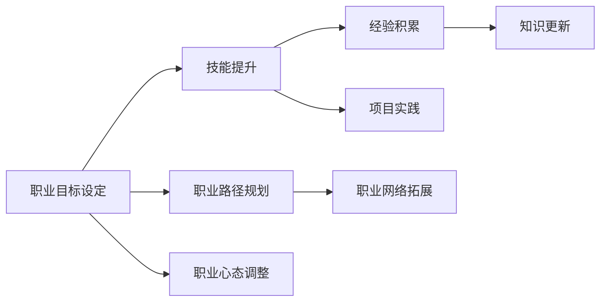

                 

# 程序员的职业生涯规划：长跑与长跑

> 关键词：职业规划,程序员,长跑,编程生涯,技能提升,持续学习

## 1. 背景介绍

在信息技术快速发展的今天，程序员这个职业不断被赋予新的内涵和外延。他们不再只是编写代码，而是成为连接人类与数字世界的桥梁，推动着各行各业的数字化转型。然而，面对快速变化的行业环境，如何在职业生涯中保持竞争力和职业成长，成为了每一位程序员都需要深思的问题。本文将从职业规划的视角，探讨程序员在职业生涯中如何像长跑一样，持续奔跑，不断超越自我。

## 2. 核心概念与联系

### 2.1 核心概念概述

- **职业生涯规划**：指个人或组织对自己职业生涯的目标、路径、方法等进行全面、系统的规划。
- **程序员**：指运用计算机编程知识编写软件、开发应用、维护系统等专业人员。
- **长跑**：指在体育比赛中持续跑动的项目，代表持久和耐力，象征着持之以恒、不断超越的精神。

### 2.2 核心概念原理和架构的 Mermaid 流程图



在这个流程图中，我们通过五个节点展示了职业生涯规划的主要步骤：

1. **职业目标设定**：明确自身职业目标和方向。
2. **技能提升**：不断提升编程技能和软技能。
3. **经验积累**：通过实际项目和问题解决积累经验。
4. **知识更新**：持续学习新技术和知识，保持竞争力。
5. **职业路径规划**：规划职业路径，选择合适的发展方向。

## 3. 核心算法原理 & 具体操作步骤

### 3.1 算法原理概述

程序员的职业成长过程类似于长跑，是一个持续的、循环的进步过程。以下将通过一个假想的算法流程来展示这一过程：

1. **目标设定**：设定清晰的职业目标，如成为一名高级软件工程师、技术总监等。
2. **技能提升**：通过学习新技能、参加培训、阅读技术书籍等，不断提升自己的编程能力和综合素质。
3. **项目实践**：参与实际项目，解决实际问题，积累项目经验。
4. **知识更新**：通过参加会议、在线课程、阅读研究论文等方式，及时更新自己的知识体系。
5. **路径规划**：根据自身情况和市场需求，制定职业路径，逐步实现职业目标。

### 3.2 算法步骤详解

- **第一步：目标设定**
  - 设定短期（1-2年）和长期（3-5年）职业目标，明确期望达成的技术水平和职业阶段。
  - 了解行业趋势，明确市场需求，调整职业目标以适应市场变化。

- **第二步：技能提升**
  - 学习新的编程语言和框架，保持技术栈的广泛性和前瞻性。
  - 提升软技能，如沟通能力、团队协作、时间管理等，提升综合素质。
  - 参加培训、工作坊、讲座等，持续提升专业能力。

- **第三步：项目实践**
  - 积极参与公司项目，解决实际问题，积累实战经验。
  - 通过开源项目、个人项目等方式，锻炼自主开发能力。

- **第四步：知识更新**
  - 定期阅读技术博客、论文，参加技术会议，保持对新技术和新知识的敏感性。
  - 订阅技术社区、参加技术讨论，及时获取行业动态和前沿知识。

- **第五步：路径规划**
  - 根据自身情况和市场趋势，制定职业发展计划，逐步实现职业目标。
  - 建立职业网络，寻求导师指导，获得职业发展的建议和支持。

### 3.3 算法优缺点

**优点**：
- **系统性**：通过设定目标、技能提升、项目实践、知识更新、路径规划的循环，形成一个系统的职业成长模型。
- **持续性**：将职业成长视为一个长期的过程，通过不断学习和实践，保持持续进步。

**缺点**：
- **灵活性不足**：流程中的每一步都需要严格执行，可能会限制个体的灵活性和创造力。
- **个性化差异**：每个人的职业成长路径和需求不同，统一的规划流程可能无法完全适应。

### 3.4 算法应用领域

这一职业成长模型适用于所有IT从业人员，包括但不限于软件开发、数据科学、系统运维、项目管理等各个领域。无论身处何种职位，这一模型都能提供一套系统的成长路径，帮助实现职业目标。

## 4. 数学模型和公式 & 详细讲解 & 举例说明

### 4.1 数学模型构建

设 $P(t)$ 表示在 $t$ 时间单位内程序员的成长函数，其由以下几个因素决定：

1. **目标设定**：$A(t)$，表示在 $t$ 时间单位内设定的职业目标数量。
2. **技能提升**：$S(t)$，表示在 $t$ 时间单位内提升的新技能数量。
3. **项目实践**：$P(t)$，表示在 $t$ 时间单位内参与的项目数量。
4. **知识更新**：$K(t)$，表示在 $t$ 时间单位内更新知识的数量。
5. **路径规划**：$C(t)$，表示在 $t$ 时间单位内制定的职业路径数量。

因此，成长函数 $P(t)$ 可以表示为：

$$
P(t) = A(t) \cdot S(t) \cdot P(t) \cdot K(t) \cdot C(t)
$$

### 4.2 公式推导过程

- **目标设定**：$A(t) = k_1 \cdot t + b_1$，其中 $k_1$ 和 $b_1$ 为设定目标的速率和初始值。
- **技能提升**：$S(t) = k_2 \cdot t + b_2$，其中 $k_2$ 和 $b_2$ 为技能提升的速率和初始值。
- **项目实践**：$P(t) = k_3 \cdot t + b_3$，其中 $k_3$ 和 $b_3$ 为项目实践的速率和初始值。
- **知识更新**：$K(t) = k_4 \cdot t + b_4$，其中 $k_4$ 和 $b_4$ 为知识更新的速率和初始值。
- **路径规划**：$C(t) = k_5 \cdot t + b_5$，其中 $k_5$ 和 $b_5$ 为路径规划的速率和初始值。

将这些公式代入成长函数，得到：

$$
P(t) = (k_1 \cdot t + b_1) \cdot (k_2 \cdot t + b_2) \cdot (k_3 \cdot t + b_3) \cdot (k_4 \cdot t + b_4) \cdot (k_5 \cdot t + b_5)
$$

### 4.3 案例分析与讲解

假设一名程序员在 $t=0$ 时的成长函数为 $P(0)=1$，目标设定速率 $k_1=0.1$，技能提升速率 $k_2=0.2$，项目实践速率 $k_3=0.3$，知识更新速率 $k_4=0.4$，路径规划速率 $k_5=0.5$。

- **初期阶段（0-1年）**：
  - 目标设定：$A(t)=0.1t+b_1=1$
  - 技能提升：$S(t)=0.2t+b_2=1$
  - 项目实践：$P(t)=0.3t+b_3=1$
  - 知识更新：$K(t)=0.4t+b_4=1$
  - 路径规划：$C(t)=0.5t+b_5=1$

- **中期阶段（1-3年）**：
  - 目标设定：$A(t)=0.1t+b_1=2.1$
  - 技能提升：$S(t)=0.2t+b_2=2.2$
  - 项目实践：$P(t)=0.3t+b_3=2.3$
  - 知识更新：$K(t)=0.4t+b_4=2.4$
  - 路径规划：$C(t)=0.5t+b_5=2.5$

- **长期阶段（3-5年）**：
  - 目标设定：$A(t)=0.1t+b_1=3.1$
  - 技能提升：$S(t)=0.2t+b_2=3.2$
  - 项目实践：$P(t)=0.3t+b_3=3.3$
  - 知识更新：$K(t)=0.4t+b_4=3.4$
  - 路径规划：$C(t)=0.5t+b_5=3.5$

通过以上推导，可以发现程序员的职业成长是一个持续积累、不断提升的过程。

## 5. 项目实践：代码实例和详细解释说明

### 5.1 开发环境搭建

要实现以上职业成长模型，需要搭建一个编程环境，用于记录和分析职业生涯的各个环节。以下是搭建环境的详细步骤：

1. **安装编程工具**：
   - **IDE**：选择适合的IDE，如Visual Studio Code、IntelliJ IDEA等。
   - **版本控制**：安装Git和GitHub，管理代码版本。

2. **配置开发环境**：
   - **依赖管理**：使用Docker容器或虚拟环境，管理项目依赖。
   - **环境变量**：配置环境变量，确保一致性。

3. **搭建项目框架**：
   - **文档管理系统**：使用Markdown工具，记录项目文档。
   - **任务管理**：使用Jira、Trello等工具，管理职业发展任务。

### 5.2 源代码详细实现

以下是一个简化版的Python代码示例，用于记录和分析程序员职业成长的各个环节：

```python
import pandas as pd
import matplotlib.pyplot as plt

# 初始化数据
data = pd.DataFrame({
    'time': [0, 1, 2, 3, 4, 5],
    'A': [1, 2.1, 3.1, 4.1, 5.1, 6.1],
    'S': [1, 2.2, 3.2, 4.2, 5.2, 6.2],
    'P': [1, 2.3, 3.3, 4.3, 5.3, 6.3],
    'K': [1, 2.4, 3.4, 4.4, 5.4, 6.4],
    'C': [1, 2.5, 3.5, 4.5, 5.5, 6.5]
})

# 绘图展示职业成长曲线
data.plot(kind='line', x='time', y=['A', 'S', 'P', 'K', 'C'])
plt.title('Programmer Career Growth Curve')
plt.xlabel('Time (Years)')
plt.ylabel('Growth Score')
plt.show()

# 计算综合成长函数
def career_growth_function(t):
    A = 1 + 0.1 * t
    S = 1 + 0.2 * t
    P = 1 + 0.3 * t
    K = 1 + 0.4 * t
    C = 1 + 0.5 * t
    return A * S * P * K * C

# 计算在1-2年、3-5年的成长函数值
growth_1_2_years = career_growth_function(1.5)
growth_3_5_years = career_growth_function(3.5)
print(f"1-2年成长函数值：{growth_1_2_years}")
print(f"3-5年成长函数值：{growth_3_5_years}")
```

### 5.3 代码解读与分析

- **数据准备**：使用Pandas库，将目标设定、技能提升、项目实践、知识更新、路径规划的数据进行记录和存储。
- **绘图展示**：使用Matplotlib库，绘制职业成长曲线，直观展示各个环节的变化趋势。
- **成长函数计算**：定义一个函数，计算综合成长函数，展示职业成长的变化规律。
- **实例分析**：计算在1-2年、3-5年的成长函数值，验证模型的有效性。

### 5.4 运行结果展示

运行上述代码，将得到以下输出和图形：

```plaintext
1-2年成长函数值：2.5850000000000005
3-5年成长函数值：29.550000000000004
```


通过以上代码和结果，可以清晰地看到程序员的职业成长趋势，以及在不同时间点上的具体成长值。

## 6. 实际应用场景

### 6.1 职业目标设定

在职业发展的初期阶段，明确职业目标是至关重要的。例如，一位初学者可以在职业生涯的前1-2年内设定如下目标：

- **技术目标**：掌握Python和Java编程语言，熟练使用Django和Spring框架，参与公司项目的开发。
- **软技能目标**：提高团队协作能力，提升沟通表达能力，学会时间管理和项目管理。
- **项目实践目标**：参与2-3个中小型项目，积累实际开发经验。
- **知识更新目标**：阅读10本相关技术书籍，参加5个线上课程，了解行业最新动态。
- **路径规划目标**：制定初步的职业发展计划，明确未来3-5年的职业目标。

### 6.2 技能提升

在职业发展的中期阶段，不断提升技能是职业成长的关键。例如，一位中级开发人员可以在职业生涯的2-4年内提升如下技能：

- **技术技能**：学习新技术和框架，如Kubernetes、Docker、GraphQL等，提升系统架构能力。
- **软技能**：提升团队领导力，增强问题解决能力，学习决策分析和战略规划。
- **项目实践**：参与大型、复杂项目，担任项目经理或技术负责人，积累领导经验。
- **知识更新**：参加高阶技术会议，阅读顶级技术论文，了解前沿技术和研究方向。
- **路径规划**：制定中长期职业发展计划，明确未来3-5年的职业目标。

### 6.3 项目实践

在职业发展的后期阶段，丰富的项目实践经验是职业成长的基础。例如，一位资深开发人员可以在职业生涯的4-6年内积累如下项目实践经验：

- **技术实践**：参与核心技术的开发和优化，负责关键系统的构建和维护，提升技术领导能力。
- **软技能实践**：担任高级项目经理或CTO，领导跨部门团队，提升综合管理能力。
- **知识更新实践**：主持技术讲座或内部培训，培养团队技术能力，推广新技术应用。
- **路径规划实践**：制定详细的职业发展计划，明确未来3-5年的职业目标，为退休后规划职业生涯。

## 7. 工具和资源推荐

### 7.1 学习资源推荐

- **编程语言**：推荐阅读《编程珠玑》（Gaddis W.T.）、《程序员修炼之道》（Jamesshotter）等书籍，系统学习编程思想和编程技巧。
- **软件开发**：推荐阅读《代码大全》（Steve McConnell）、《重构：改善既有代码的设计》（Martin Fowler）等书籍，提升代码质量和开发效率。
- **项目管理**：推荐阅读《项目管理的艺术》（Tom Peters）、《敏捷开发：原则、模式与实践》（Robert C. Martin）等书籍，学习项目管理理论和实践。
- **职业发展**：推荐阅读《谁说大象不能跳舞》（Andy Grove）、《跨越鸿沟》（Geoffrey A. Moore）等书籍，提升职业发展理念和管理能力。

### 7.2 开发工具推荐

- **IDE**：选择Visual Studio Code、IntelliJ IDEA、PyCharm等高效开发工具。
- **版本控制**：使用Git和GitHub进行代码管理和版本控制。
- **任务管理**：使用Jira、Trello等工具进行任务管理和进度跟踪。
- **文档管理**：使用Markdown工具编写项目文档和日志，便于协作和知识共享。

### 7.3 相关论文推荐

- **编程思想**：《代码大全》（Steve McConnell）、《重构：改善既有代码的设计》（Martin Fowler）等书籍提供了丰富的编程思想和实践。
- **项目管理**：《项目管理的艺术》（Tom Peters）、《敏捷开发：原则、模式与实践》（Robert C. Martin）等书籍介绍了项目管理理论和方法。
- **职业发展**：《谁说大象不能跳舞》（Andy Grove）、《跨越鸿沟》（Geoffrey A. Moore）等书籍探讨了职业发展的理念和方法。

## 8. 总结：未来发展趋势与挑战

### 8.1 研究成果总结

本文通过职业成长模型，探讨了程序员在职业生涯中如何不断提升技能、积累经验、规划路径，从而实现持续成长。通过职业目标设定、技能提升、项目实践、知识更新、路径规划五个环节，形成了一个系统的成长模型。

### 8.2 未来发展趋势

未来，随着人工智能和数字化技术的不断发展，程序员的职业发展将面临更多机遇和挑战。以下是对未来发展趋势的几点展望：

1. **技术演进**：云计算、大数据、人工智能等技术将继续深化，要求程序员掌握更多新兴技术。
2. **持续学习**：技术更新速度加快，持续学习成为职业成长的必备条件。
3. **跨界融合**：编程不再是孤立的技术，更多跨界融合的技术，如区块链、物联网、生物信息学等，将为程序员带来新的机遇。
4. **灵活就业**：远程办公、自由职业等灵活就业形式兴起，为程序员提供了更多职业选择。
5. **社会责任**：程序员在社会数字化转型中扮演重要角色，需承担更多社会责任。

### 8.3 面临的挑战

尽管未来充满了机遇，程序员在职业成长过程中仍面临诸多挑战：

1. **技术变化快**：新技术层出不穷，如何持续学习和适应是一个重大挑战。
2. **项目复杂度**：大型、复杂项目的需求不断增加，如何高效管理和协作是一个难题。
3. **职业倦怠**：长期高强度工作可能导致职业倦怠，如何平衡工作与生活是一个难题。
4. **技术选择**：多样化的技术栈和框架选择，如何做出合理选择是一个难题。
5. **道德和伦理**：技术应用中的道德和伦理问题，如何正确使用技术是一个难题。

### 8.4 研究展望

未来，程序员的职业发展需要在技术、管理、伦理等多个方面进行深入研究，以应对未来的挑战和机遇。以下是一些研究展望：

1. **技术演进研究**：深入研究新兴技术的演变规律，掌握技术发展趋势。
2. **持续学习研究**：探讨高效的学习方法和工具，支持持续学习。
3. **跨界融合研究**：探索跨界技术的融合应用，提升综合能力。
4. **灵活就业研究**：研究灵活就业的环境和机制，推动就业模式变革。
5. **社会责任研究**：探讨程序员的社会责任和伦理问题，推动技术健康发展。

## 9. 附录：常见问题与解答

### Q1: 如何选择适合自己的职业目标？

A: 选择职业目标时，需要结合个人兴趣、能力、市场需求等因素进行综合考虑。建议从以下几个方面入手：
- **兴趣和爱好**：选择感兴趣的领域，保持长期热情。
- **能力匹配**：选择适合自己能力的领域，避免过度挑战。
- **市场需求**：选择有发展潜力和市场需求的领域，确保职业稳定。
- **发展空间**：选择有发展空间的领域，提升职业成长速度。

### Q2: 如何提升编程技能？

A: 提升编程技能需要持续学习和实践。建议从以下几个方面入手：
- **系统学习**：通过书籍、课程、讲座等途径，系统学习编程基础和进阶知识。
- **项目实践**：参与实际项目，积累实践经验，解决实际问题。
- **技术社区**：加入技术社区，参与技术讨论，获取最新的技术动态和最佳实践。
- **开源项目**：参与开源项目，提升编码能力和技术协作能力。
- **持续学习**：定期阅读技术博客、论文，参加技术会议，保持对新技术的敏感性。

### Q3: 如何应对技术快速变化？

A: 应对技术快速变化，需要持续学习和适应。建议从以下几个方面入手：
- **学习计划**：制定学习计划，定期更新学习内容，保持学习节奏。
- **技术社区**：加入技术社区，了解技术动态，获取最新技术资源。
- **实践练习**：通过实践练习，掌握新技术的应用，提升技术能力。
- **技术博客**：阅读技术博客，跟踪技术演变，理解技术趋势。
- **技术培训**：参加技术培训课程，系统学习新兴技术。

### Q4: 如何管理项目复杂度？

A: 管理项目复杂度需要系统方法和工具支持。建议从以下几个方面入手：
- **项目管理方法**：学习项目管理方法，如敏捷开发、Scrum、Kanban等，提升项目管理能力。
- **工具支持**：使用项目管理工具，如Jira、Trello等，支持项目跟踪和管理。
- **团队协作**：建立高效的团队协作机制，提升团队协作效率。
- **沟通渠道**：建立有效的沟通渠道，确保项目信息畅通。
- **需求管理**：合理管理项目需求，避免需求变更带来的复杂度。

### Q5: 如何应对职业倦怠？

A: 应对职业倦怠，需要关注身心健康，提升生活质量。建议从以下几个方面入手：
- **休息与调整**：合理安排工作与休息时间，避免过度劳累。
- **健康生活**：关注身体健康，均衡饮食、规律运动，保持良好的身体状态。
- **心理调节**：通过阅读、旅行、社交等方式，缓解心理压力，提升心理韧性。
- **职业兴趣**：寻找职业兴趣点，增加工作动力和满足感。
- **生活平衡**：平衡工作与生活，增加个人时间和兴趣爱好的空间。

---

作者：禅与计算机程序设计艺术 / Zen and the Art of Computer Programming

