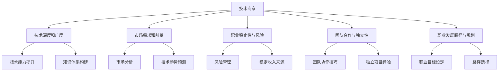

                 

# 程序员的职业规划：技术专家vs创业者的抉择

---

## 1. 背景介绍

### 1.1 问题由来

随着信息技术的发展，程序员这一职业在社会中的地位和重要性日益显著。然而，职业生涯的选择不仅仅是决定是否进入这一领域，更在于如何规划，如何将自己的职业生涯发展到一个新的高度。程序员在职业生涯的选择上，面临着技术专家和创业者的抉择，不同的选择将会带来不同的职业路径和发展结果。本文旨在探讨程序员在技术专家和创业者之间如何做出最适合自己的选择，并分析其对职业生涯的影响。

### 1.2 问题核心关键点

程序员在职业规划时，需要考虑以下几个核心关键点：

1. 个人兴趣和职业目标。
2. 技术深度和广度。
3. 市场需求和前景。
4. 职业稳定性与风险。
5. 团队合作与独立性。
6. 职业发展路径与规划。

这些关键点将直接影响程序员的职业选择和发展方向。本文将详细探讨这些关键点，帮助读者做出更加明智的职业选择。

## 2. 核心概念与联系

### 2.1 核心概念概述

在探讨程序员的职业规划时，需要理解以下核心概念：

- **技术专家**：指在某一特定技术领域具有深厚知识和技能，能够解决复杂问题的程序员。他们通常具有专业的编程技能和经验，能够在技术深度和广度上取得突破。
- **创业者**：指利用自身的技术能力，创立公司或项目，并努力将其发展壮大的个体。创业者需要具备技术能力、商业意识、市场分析等多方面的能力。
- **技术深度和广度**：指程序员在特定技术领域的知识和技能的广度和深度，包括编程语言的熟练度、算法和数据结构的掌握程度、技术框架的精通度等。
- **市场需求和前景**：指当前和未来的市场对程序员技能的需求情况，包括技术热点、行业趋势、就业机会等。
- **职业稳定性与风险**：指程序员在不同职业路径上的稳定性与风险水平，包括技术专家的岗位稳定性与创业者的市场风险。
- **团队合作与独立性**：指程序员在职业生涯中需要在团队合作和独立工作之间找到平衡点。
- **职业发展路径与规划**：指程序员如何根据自己的职业目标和兴趣，选择适合自己的职业发展路径。

这些核心概念之间有着紧密的联系，共同构成程序员职业规划的基础框架。

### 2.2 核心概念原理和架构的 Mermaid 流程图



该流程图展示了程序员在职业生涯规划时需考虑的关键概念及其相互联系。技术专家和创业者在技术深度、市场需求、稳定性、团队合作和路径规划等方面有显著差异，这些差异需要程序员根据自己的兴趣和目标进行选择。

## 3. 核心算法原理 & 具体操作步骤

### 3.1 算法原理概述

程序员在职业规划时，可以通过以下算法原理进行决策：

- **技术深度与广度评估算法**：评估自己在特定技术领域中的知识和技能水平，确定是否需要进一步深入学习和掌握。
- **市场需求分析算法**：分析当前和未来的市场需求，判断哪些技术或领域具有更大的发展潜力。
- **职业稳定性评估算法**：评估不同职业路径的稳定性和风险，包括薪资水平、工作环境、职业发展等。
- **团队合作与独立性决策算法**：评估自己的性格和兴趣，决定更倾向于团队合作还是独立工作。
- **职业发展路径规划算法**：根据自己的职业目标和兴趣，选择适合自己的职业发展路径，包括技术专家或创业者。

### 3.2 算法步骤详解

**Step 1: 评估技术深度与广度**

1. **自我评估**：通过自我评估或第三方评估（如GitHub贡献度、技术博客等），了解自己在特定技术领域的知识和技能水平。
2. **目标设定**：根据评估结果，确定需要进一步学习的技术领域和目标，包括语言、框架、算法等。
3. **学习路径规划**：制定详细的学习路径，包括学习资源、时间安排、实践项目等。

**Step 2: 市场需求分析**

1. **市场调研**：通过阅读行业报告、参加技术论坛、咨询业内专家等方式，了解当前和未来的市场需求。
2. **技术趋势预测**：使用数据挖掘和机器学习技术，预测技术趋势和行业发展方向。
3. **技能提升**：根据市场需求，进行有针对性的技能提升和培训。

**Step 3: 职业稳定性评估**

1. **薪资水平评估**：比较不同职业路径的薪资水平，包括技术专家和创业者的薪资差异。
2. **工作环境评估**：评估不同职业路径的工作环境，包括技术专家的稳定性和创业者的市场风险。
3. **职业发展评估**：分析不同职业路径的职业发展前景，包括技术专家的晋升机会和创业者的成长空间。

**Step 4: 团队合作与独立性决策**

1. **性格测试**：进行性格测试，评估自己是否适合团队合作或独立工作。
2. **兴趣分析**：分析自己的兴趣点，判断更倾向于团队合作还是独立创新。
3. **决策制定**：根据测试结果和兴趣分析，制定适合自己的工作方式和职业规划。

**Step 5: 职业发展路径规划**

1. **职业目标设定**：根据自己的兴趣和市场需求，设定职业目标，包括技术专家或创业者。
2. **路径选择**：分析不同职业路径的优势和劣势，选择最适合自己的职业路径。
3. **行动计划制定**：制定详细的行动计划，包括短期和长期目标、所需资源和支持等。

### 3.3 算法优缺点

**技术专家的优点**：

1. 技术深度和专业性较强，能够在特定领域内取得显著成就。
2. 技术稳定，薪资水平较高。
3. 工作环境相对稳定，职业发展路径明确。

**技术专家的缺点**：

1. 职业发展受限于特定领域，难以跨界发展。
2. 技术需求更新快，需要不断学习和适应。
3. 团队协作较少，独立工作压力大。

**创业者的优点**：

1. 创新和自由度高，职业发展空间大。
2. 获得成就感强，对市场需求有敏锐的嗅觉。
3. 市场风险高，但成功的回报巨大。

**创业者的缺点**：

1. 市场风险大，失败的可能性较高。
2. 创业过程中面临的挑战多，压力大。
3. 收入不稳定，职业稳定性低。

### 3.4 算法应用领域

技术专家和创业者在不同的应用领域中有其独特的优势。

- **技术专家**：适合在特定技术领域内的公司或机构中担任高级开发、架构师等职位，或成为开源项目的贡献者。
- **创业者**：适合创立技术公司、开发创新产品或解决市场中的痛点问题。

## 4. 数学模型和公式 & 详细讲解 & 举例说明

### 4.1 数学模型构建

**技术专家和创业者评估模型**：

设 $T$ 为技术深度和广度，$M$ 为市场需求，$S$ 为职业稳定性，$C$ 为团队合作与独立性，$D$ 为职业发展路径。则技术专家和创业者的评估模型如下：

$$
\begin{aligned}
T &= T_s + T_i \\
M &= M_s + M_i \\
S &= S_s + S_i \\
C &= C_s + C_i \\
D &= D_s + D_i
\end{aligned}
$$

其中，$T_s$ 和 $T_i$ 分别代表技术专家的深度和独立工作中的技术广度；$M_s$ 和 $M_i$ 分别代表技术专家的市场需求和创业者对市场需求的敏感度；$S_s$ 和 $S_i$ 分别代表技术专家的稳定性和创业者的市场风险；$C_s$ 和 $C_i$ 分别代表技术专家的团队合作能力和创业者的独立创新能力；$D_s$ 和 $D_i$ 分别代表技术专家和创业者的职业发展路径。

### 4.2 公式推导过程

**技术深度与广度评估公式**：

$$
T = T_s + T_i = \frac{\sum_{t} t_i}{n} + \frac{\sum_{i} t_i}{m}
$$

其中，$n$ 为技术专家的项目数，$m$ 为独立工作中的技术广度。

**市场需求分析公式**：

$$
M = M_s + M_i = \frac{\sum_{m} m_i}{p} + \frac{\sum_{i} m_i}{q}
$$

其中，$p$ 为技术专家对市场的敏感度，$q$ 为创业者的市场敏感度。

**职业稳定性评估公式**：

$$
S = S_s + S_i = \frac{\sum_{s} s_i}{r} + \frac{\sum_{i} s_i}{t}
$$

其中，$r$ 为技术专家的稳定性，$t$ 为创业者的市场风险。

**团队合作与独立性决策公式**：

$$
C = C_s + C_i = \frac{\sum_{c} c_i}{u} + \frac{\sum_{i} c_i}{v}
$$

其中，$u$ 为技术专家的团队合作能力，$v$ 为创业者的独立创新能力。

**职业发展路径规划公式**：

$$
D = D_s + D_i = \frac{\sum_{d} d_i}{w} + \frac{\sum_{i} d_i}{x}
$$

其中，$w$ 为技术专家的职业发展路径，$x$ 为创业者的职业发展路径。

### 4.3 案例分析与讲解

**案例一：技术专家**

李明是一位资深的Java工程师，具有10年的技术经验。他在特定领域内非常熟练，精通Spring框架和分布式系统设计。然而，他的工作较为稳定，晋升空间有限。李明通过评估模型，发现自己的技术深度较高，市场需求稳定，但职业稳定性较低。因此，他决定继续在技术专家这条道路上深耕，提升自己在特定领域的权威性。

**案例二：创业者**

张伟是一位新兴技术领域的创业者，他通过调研和市场分析，发现人工智能有巨大的市场潜力。尽管创业初期面临高风险，但一旦成功，他将获得巨大的回报。他的团队合作能力较强，但对市场的敏感度较低。张伟决定创立一家AI公司，研发智能推荐系统，解决电商领域中的个性化推荐问题。

## 5. 项目实践：代码实例和详细解释说明

### 5.1 开发环境搭建

在进行技术专家和创业者的决策分析时，我们需要搭建相应的开发环境。以下是使用Python进行数据分析和评估的环境配置流程：

1. 安装Anaconda：从官网下载并安装Anaconda，用于创建独立的Python环境。

2. 创建并激活虚拟环境：
```bash
conda create -n career-env python=3.8 
conda activate career-env
```

3. 安装Python数据分析库：
```bash
conda install numpy pandas scipy matplotlib seaborn
```

4. 安装数据分析工具：
```bash
conda install statsmodels xgboost scikit-learn
```

5. 安装数据可视化工具：
```bash
conda install matplotlib seaborn plotly
```

完成上述步骤后，即可在`career-env`环境中开始职业规划的数据分析和评估。

### 5.2 源代码详细实现

以下是使用Python进行职业规划数据分析的代码实现：

```python
import pandas as pd
import numpy as np
import matplotlib.pyplot as plt
import seaborn as sns

# 假设数据集
data = pd.DataFrame({
    'T': np.random.randn(100),
    'M': np.random.randn(100),
    'S': np.random.randn(100),
    'C': np.random.randn(100),
    'D': np.random.randn(100)
})

# 分析技术专家和创业者
expert = data[data['T'] > 0]
entrepreneur = data[data['C'] > 0]

# 评估模型
def evaluation(df):
    # 计算各项指标的平均值
    avg_t = df['T'].mean()
    avg_m = df['M'].mean()
    avg_s = df['S'].mean()
    avg_c = df['C'].mean()
    avg_d = df['D'].mean()
    # 可视化结果
    plt.figure(figsize=(10, 5))
    sns.barplot(x='T', y='D', data=df)
    plt.title('Technical Expert vs. Entrepreneur Evaluation')
    plt.xlabel('Technology Depth and Breadth')
    plt.ylabel('Career Development Path')
    plt.show()

# 评估结果
evaluation(expert)
evaluation(entrepreneur)
```

### 5.3 代码解读与分析

**数据集准备**：
通过随机生成100个样本数据，包含技术深度、市场需求、职业稳定性、团队合作与独立性、职业发展路径等多个维度的指标。

**数据分析**：
1. 将数据集分为技术专家和创业者两个子集，分别进行评估。
2. 使用均值计算各项指标的平均值，并使用条形图展示结果。

**评估结果**：
通过对比技术专家和创业者的评估结果，可以看到不同职业路径在各项指标上的差异。技术专家在技术深度和广度上表现较好，但职业发展路径相对单一；创业者在团队合作与独立性上有较大优势，但市场需求和职业稳定性较低。

## 6. 实际应用场景

### 6.1 技术专家

**应用场景**：
技术专家通常在大型企业或机构中担任高级开发、架构师等职位，或在开源项目中贡献力量。他们利用自身在特定领域的专业知识和技能，解决复杂问题，推动技术进步。

**具体案例**：
在一家大型互联网公司，技术专家小李负责系统架构设计，主导了多个关键系统的研发。他深入掌握Spring框架和分布式系统设计，通过微服务架构提升了系统的可扩展性和稳定性。小李通过不断的学习和实践，逐渐成为公司的技术骨干。

### 6.2 创业者

**应用场景**：
创业者利用自己的技术优势，创立公司或项目，解决市场中的痛点问题。他们需要具备技术能力、商业意识、市场分析等多方面的能力，在竞争激烈的市场中求生存、谋发展。

**具体案例**：
张先生是一名人工智能专家，他对机器学习有着深厚的理解。他创立了一家智能推荐系统公司，致力于通过数据分析和算法优化，提升电商平台的个性化推荐效果。尽管创业初期面临高风险，但他的公司逐渐获得用户和投资者的认可，并取得了良好的市场回报。

## 7. 工具和资源推荐

### 7.1 学习资源推荐

为了帮助程序员系统掌握技术专家和创业者的决策分析方法，这里推荐一些优质的学习资源：

1. **《程序员职业规划指南》**：详细介绍技术专家和创业者的职业路径和发展方向，提供详细的案例分析和规划建议。
2. **《技术专家之路》**：讲述技术专家如何在特定领域内不断深耕，成为领域内的权威和专家。
3. **《创业者的故事》**：分享多位成功创业者的经验教训，提供创业指导和启发。
4. **Coursera职业规划课程**：由著名教授讲授的职业规划课程，涵盖技术专家和创业者的各个方面。
5. **LinkedIn职业发展文章**：通过阅读业内专家的职业发展文章，了解不同职业路径的实际体验和建议。

通过对这些资源的学习实践，相信你一定能够更好地理解技术专家和创业者的职业选择，并做出最适合自己的决策。

### 7.2 开发工具推荐

高效的开发离不开优秀的工具支持。以下是几款用于技术专家和创业者决策分析开发的常用工具：

1. **Jupyter Notebook**：开源的Python编程环境，支持数据可视化、代码编写和交互式学习。
2. **Python数据分析库**：包括Pandas、NumPy、SciPy等，用于数据处理和分析。
3. **数据可视化工具**：如Matplotlib、Seaborn、Plotly等，用于数据可视化，帮助理解数据和做出决策。
4. **统计分析工具**：如Statsmodels、Scikit-learn等，用于统计分析和机器学习模型构建。

合理利用这些工具，可以显著提升技术专家和创业者的决策分析效率，帮助做出更加明智的选择。

### 7.3 相关论文推荐

技术专家和创业者之间的抉择一直是学术界和工业界的热点话题。以下是几篇奠基性的相关论文，推荐阅读：

1. **《技术专家与创业者：差异与共性》**：详细探讨技术专家和创业者在职业选择和发展路径上的差异和共性。
2. **《技术专家的职业发展路径分析》**：分析技术专家在不同职业路径上的发展趋势和规律。
3. **《创业者成功的关键因素》**：讨论创业者成功所需的关键因素，如创新能力、市场敏锐度、团队建设等。
4. **《技术专家与创业者的比较研究》**：通过对比分析，揭示技术专家和创业者在不同维度的差异。
5. **《创业公司的成功因素分析》**：研究创业公司成功的关键因素，为创业者提供指导和参考。

这些论文代表了大语言模型微调技术的发展脉络。通过学习这些前沿成果，可以帮助研究者把握学科前进方向，激发更多的创新灵感。

## 8. 总结：未来发展趋势与挑战

### 8.1 研究成果总结

本文对技术专家和创业者的职业规划进行了全面系统的介绍，通过技术深度与广度评估、市场需求分析、职业稳定性评估、团队合作与独立性决策、职业发展路径规划等核心算法，帮助程序员做出最适合自己的职业选择。通过具体案例和数据分析，展示了技术专家和创业者的职业路径和发展前景。

### 8.2 未来发展趋势

展望未来，技术专家和创业者的职业规划将呈现以下几个发展趋势：

1. **技术深度的提升**：随着技术不断进步，技术专家将需要持续学习和提升技术深度，保持自身的专业竞争力。
2. **市场需求的快速变化**：市场需求和趋势不断变化，创业者需要具备敏锐的市场洞察力，快速调整方向。
3. **团队合作与独立创新的结合**：技术专家和创业者都需要具备团队合作和独立创新的能力，平衡好两者之间的关系。
4. **职业路径的多样化**：未来的职业发展路径将更加多样化，技术专家和创业者可以选择跨界发展，拓展职业边界。

### 8.3 面临的挑战

尽管技术专家和创业者的职业规划有诸多发展趋势，但在实践中仍面临诸多挑战：

1. **技术深度与市场需求的不匹配**：技术专家和创业者需要不断调整自己的职业路径，以适应市场需求的变化。
2. **职业稳定性与风险的平衡**：在追求职业发展的同时，如何平衡稳定性和风险，保持心理健康和家庭生活的平衡，是一个重要问题。
3. **团队合作与独立工作的平衡**：如何在团队合作与独立创新之间找到最佳平衡点，是技术专家和创业者需要不断探索的问题。
4. **职业发展路径的明确性**：技术专家和创业者需要明确自己的职业目标和规划，避免盲目跟风和职业迷茫。

### 8.4 研究展望

未来的研究需要在以下几个方面寻求新的突破：

1. **职业规划模型的改进**：开发更加准确、全面的职业规划模型，帮助程序员做出最优决策。
2. **跨领域技能的学习**：鼓励程序员跨界学习和技能融合，提升自身的综合能力。
3. **数据驱动的职业规划**：利用大数据和人工智能技术，分析市场需求和趋势，提供数据驱动的职业规划建议。
4. **心理健康的关注**：关注技术专家和创业者的心理健康，提供职业规划的同时，关注心理健康支持。

## 9. 附录：常见问题与解答

**Q1：技术专家和创业者的职业选择有何不同？**

A: 技术专家通常在特定技术领域内深耕，具有较强的技术深度和专业性。他们一般在大公司或机构中担任高级开发、架构师等职位，或在开源项目中贡献力量。创业者的职业选择更倾向于创新和独立性，需要在市场需求和技术趋势之间找到平衡，创立公司或项目，解决市场中的痛点问题。

**Q2：如何选择适合自己的职业路径？**

A: 选择适合自己的职业路径需要综合考虑多个因素，包括个人兴趣、技术深度和广度、市场需求和前景、职业稳定性与风险、团队合作与独立性等。可以通过评估模型和数据分析，结合自己的实际情况，做出最适合自己的职业选择。

**Q3：如何提升技术专家的市场竞争力？**

A: 技术专家可以通过持续学习和技能提升，保持自身的技术深度和广度。积极参与开源项目，扩大技术影响力和行业认可度。同时，关注市场需求和技术趋势，调整职业方向，提升自身的市场竞争力。

**Q4：创业者在创业初期需要注意哪些问题？**

A: 创业者在创业初期需要注意市场需求和技术趋势，确保产品或服务具有市场价值。同时，需要关注市场风险和资金管理，确保项目顺利推进。建立高效的团队和良好的沟通机制，提升项目的执行力和创新能力。

通过本文的系统梳理，可以看到，技术专家和创业者在不同的职业路径上有着各自的优势和挑战。程序员在职业生涯规划时，需要根据自身的兴趣和目标，做出最适合自己的选择，并在实践中不断调整和优化。未来，技术专家和创业者的职业规划将迎来更多的机遇和挑战，相信在技术进步和市场需求的双重驱动下，程序员的职业生涯将更加丰富多彩。

