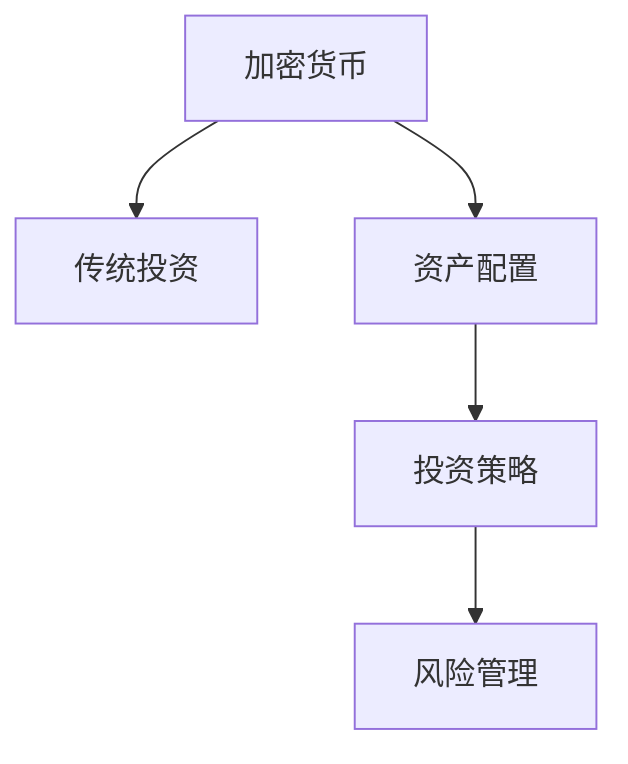

                 

# 程序员的财务自由：加密货币与传统投资的平衡

> 关键词：财务自由，加密货币，传统投资，平衡，投资策略，风险管理

## 1. 背景介绍

### 1.1 问题由来

随着数字经济的发展，越来越多程序员通过技术创新获得了可观的财富。然而，随着市场波动加剧，如何安全稳健地管理财富，实现持续增长，成为了许多程序员面临的难题。加密货币与传统投资市场的交叉，为程序员在财务自由的道路上提供了新的方向。

### 1.2 问题核心关键点

加密货币与传统投资的有效结合，能够为程序员提供更丰富的资产配置选项，分散风险，实现更高收益。但如何科学配置，均衡分配，需要深入分析与合理策略。

### 1.3 问题研究意义

研究加密货币与传统投资的平衡，对于程序员的财务规划具有重要意义：

1. 分散风险：通过组合投资，将资产分散到不同市场，降低单一市场的系统性风险。
2. 提升收益：借助加密货币的高波动性，利用杠杆效应放大收益，实现财务自由。
3. 持续增值：借助资产配置的科学规划，实现长期稳健增长，保持资产的增值能力。
4. 灵活调整：随着市场变化，及时调整投资策略，应对新出现的投资机会与挑战。

## 2. 核心概念与联系

### 2.1 核心概念概述

为更好地理解加密货币与传统投资的有效结合，本节将介绍几个密切相关的核心概念：

- 加密货币(CryptoCurrency)：一种基于区块链技术的去中心化数字货币，具有去信任化、透明公开的特点。主要代表有比特币(Bitcoin)、以太坊(Ethereum)等。
- 传统投资(Traditional Investment)：指股票、债券、黄金、房地产等传统资产，通常具有较低的风险和较稳定的收益。
- 资产配置(Asset Allocation)：将投资资金分配到不同的资产类别，以达到风险分散、收益最大化的目标。
- 投资策略(Investment Strategy)：在资产配置的基础上，采用不同的投资技巧，如择时、选股、杠杆等，以实现短期或长期目标。
- 风险管理(Risk Management)：通过科学评估风险，选择合适的投资工具和策略，规避系统性风险，实现稳健增长。

这些核心概念之间的逻辑关系可以通过以下Mermaid流程图来展示：



这个流程图展示了几者之间的联系与相互作用：

1. 加密货币与传统投资形成资产组合，分散风险。
2. 资产配置是组合构建的基石，确保资产之间的合理比例。
3. 投资策略在资产配置的基础上，进行具体操作，提升收益。
4. 风险管理贯穿整个投资过程，降低潜在风险，保障收益稳定。

## 3. 核心算法原理 & 具体操作步骤
### 3.1 算法原理概述

加密货币与传统投资的平衡，本质上是一个动态资产配置和投资策略优化的过程。其核心思想是：根据市场环境、风险偏好、收益目标等因素，构建最优的资产组合，并通过策略调整，保持组合的长期增值。

形式化地，假设加密货币资产集为 $C$，传统投资资产集为 $T$，风险容忍度为 $\alpha$，收益目标为 $\beta$。资产配置目标为最小化风险，最大化收益。即：

$$
\min_{w_C, w_T} \alpha\sigma^2(w_C, w_T) - \beta r(w_C, w_T)
$$

其中，$w_C, w_T$ 为加密货币和传统投资的权重，$\sigma^2(w_C, w_T)$ 为组合的标准差，$r(w_C, w_T)$ 为组合的期望收益率。

通过求解上述优化问题，可以找到最优的资产配置方案。

### 3.2 算法步骤详解

加密货币与传统投资的有效平衡，一般包括以下几个关键步骤：

**Step 1: 市场环境分析**
- 收集加密货币和传统投资的市场数据，包括价格、波动率、收益率等。
- 分析宏观经济环境、市场情绪、政策变化等因素对市场的影响。

**Step 2: 风险容忍度与收益目标设定**
- 确定个人的风险容忍度，选择合适的风险-收益权衡点。
- 设定合理的收益目标，根据投资时长、资金规模等因素，选择适合的年化收益率目标。

**Step 3: 资产配置方案设计**
- 采用风险模型，如马科维茨模型(Markowitz Model)，构建不同的资产配置方案。
- 通过历史回测，评估各方案的风险收益特征，选择最优配置方案。

**Step 4: 投资策略细化**
- 在资产配置的基础上，细化投资策略，如择时、选股、杠杆等。
- 使用统计方法或机器学习模型，挖掘市场规律，预测未来走势。

**Step 5: 风险管理与监测**
- 引入风险评估指标，如VaR、ES等，动态监控组合风险。
- 根据市场变化，及时调整投资策略和资产权重。

**Step 6: 定期评估与调整**
- 定期进行投资组合评估，识别优化机会。
- 根据评估结果，优化资产配置和投资策略。

以上步骤，构成了一个完整的加密货币与传统投资平衡的优化过程。

### 3.3 算法优缺点

加密货币与传统投资的有效平衡，具有以下优点：

1. 分散风险：将资产配置到不同的市场，降低系统性风险，提升组合的稳定性。
2. 优化收益：通过策略细化，挖掘市场机会，实现更高收益。
3. 动态调整：随着市场变化，及时调整投资策略和资产配置，适应新的市场环境。

同时，该方法也存在一定的局限性：

1. 市场波动大：加密货币市场波动剧烈，可能导致资产配置策略失效。
2. 技术门槛高：需要一定的金融知识和技术手段，才能进行科学的资产配置和策略调整。
3. 数据依赖性高：依赖市场数据和历史回测，可能存在数据偏差和模型过拟合。
4. 法律合规复杂：加密货币市场法规不明确，可能面临法律风险。

尽管存在这些局限性，但就目前而言，基于加密货币与传统投资的有效平衡，仍是程序员实现财务自由的重要手段。未来相关研究的重点在于如何进一步降低市场波动风险，提高技术应用的便利性，并优化法律框架，消除潜在的合规问题。

### 3.4 算法应用领域

加密货币与传统投资的有效平衡，在程序员的财务自由管理中具有广泛应用，例如：

- 财富管理：通过资产配置和投资策略，实现财富的稳健增值。
- 风险规避：分散单一市场的风险，减少资产损失。
- 收益最大化：利用加密货币的波动性，实现短期快速增长。
- 税务优化：选择更优的资产配置和投资策略，降低税务成本。
- 遗产规划：合理配置资产，确保财富传承的顺利进行。

此外，在更多场景中，加密货币与传统投资的结合，如企业融资、全球资产配置等，也能发挥重要作用。

## 4. 数学模型和公式 & 详细讲解 & 举例说明

### 4.1 数学模型构建

本节将使用数学语言对加密货币与传统投资平衡的数学模型进行严格刻画。

记加密货币资产集为 $C$，传统投资资产集为 $T$，总资产为 $A$，市场总收益率为 $R$，市场波动率为 $\sigma$。假设市场收益服从正态分布，资产配置比例为 $w_C$，传统投资比例为 $w_T$。则资产组合的期望收益率为 $r(w_C, w_T)$，风险为 $\sigma(w_C, w_T)$。

资产配置的优化目标为：

$$
\min_{w_C, w_T} \alpha\sigma^2(w_C, w_T) - \beta r(w_C, w_T)
$$

其中 $\alpha$ 为风险容忍度，$\beta$ 为收益目标。

### 4.2 公式推导过程

以下我们以标准化的马科维茨模型为例，推导加密货币与传统投资组合的风险收益特征。

假设加密货币和传统投资的收益率服从正态分布，且协方差矩阵为 $\Sigma$。则资产组合的期望收益率为：

$$
r(w_C, w_T) = w_C r_C + w_T r_T
$$

资产组合的风险为：

$$
\sigma(w_C, w_T) = \sqrt{w_C^2\sigma_C^2 + w_T^2\sigma_T^2 + 2w_Cw_T\rho_{CT}\sigma_C\sigma_T}
$$

其中 $\rho_{CT}$ 为加密货币与传统投资的相关系数。

通过最大化 $r(w_C, w_T)$ 并最小化 $\sigma(w_C, w_T)$，可以得到最优的资产配置方案。求解上述最优化问题，得到：

$$
w_C = \frac{\sigma_{CT}\sigma_T}{\sigma_C^2 + \sigma_T^2 - 2\rho_{CT}\sigma_C\sigma_T}
$$

$$
w_T = \frac{\sigma_{CT}\sigma_C}{\sigma_C^2 + \sigma_T^2 - 2\rho_{CT}\sigma_C\sigma_T}
$$

其中 $\sigma_{CT}$ 为加密货币与传统投资的协方差，$\sigma_C$ 和 $\sigma_T$ 分别为加密货币和传统投资的标准差。

将 $w_C$ 和 $w_T$ 代入组合收益率和风险公式，可以得到最优资产组合的期望收益和风险：

$$
r(w_C, w_T) = r_C w_C + r_T w_T
$$

$$
\sigma(w_C, w_T) = \sqrt{w_C^2\sigma_C^2 + w_T^2\sigma_T^2 + 2w_Cw_T\rho_{CT}\sigma_C\sigma_T}
$$

### 4.3 案例分析与讲解

假设加密货币和传统投资的比例为 30%和 70%，相关系数为 0.7，加密货币的标准差为 0.25，传统投资的标准差为 0.15，预期收益率为 5%和 4%。

代入公式计算，得到：

$$
w_C = \frac{0.7 \times 0.15}{0.25^2 + 0.15^2 - 2 \times 0.7 \times 0.25 \times 0.15} \approx 0.53
$$

$$
w_T = \frac{0.7 \times 0.25}{0.25^2 + 0.15^2 - 2 \times 0.7 \times 0.25 \times 0.15} \approx 0.47
$$

资产组合的期望收益为：

$$
r(w_C, w_T) = 0.53 \times 5\% + 0.47 \times 4\% = 4.95\%
$$

资产组合的风险为：

$$
\sigma(w_C, w_T) = \sqrt{0.53^2 \times 0.25^2 + 0.47^2 \times 0.15^2 + 2 \times 0.53 \times 0.47 \times 0.7 \times 0.25 \times 0.15} \approx 0.17
$$

以上计算结果表明，资产配置比例为 30%加密货币和 70%传统投资，可以期望获得 4.95% 的期望收益和 0.17 的风险水平。

## 5. 项目实践：代码实例和详细解释说明
### 5.1 开发环境搭建

在进行加密货币与传统投资平衡的实践前，我们需要准备好开发环境。以下是使用Python进行PyTorch开发的环境配置流程：

1. 安装Anaconda：从官网下载并安装Anaconda，用于创建独立的Python环境。

2. 创建并激活虚拟环境：
```bash
conda create -n finance-env python=3.8 
conda activate finance-env
```

3. 安装PyTorch：根据CUDA版本，从官网获取对应的安装命令。例如：
```bash
conda install pytorch torchvision torchaudio cudatoolkit=11.1 -c pytorch -c conda-forge
```

4. 安装相关库：
```bash
pip install numpy pandas scikit-learn statsmodels portfolioopt
```

完成上述步骤后，即可在`finance-env`环境中开始实践。

### 5.2 源代码详细实现

这里我们以标准化的马科维茨模型为例，给出使用PyTorch进行加密货币与传统投资平衡的Python代码实现。

首先，定义市场数据处理函数：

```python
import pandas as pd
import numpy as np
import torch

def load_data(filename):
    data = pd.read_csv(filename)
    return data['return'].to_numpy()

def get_covariance(data, n):
    return np.cov(data[:n], bias=True)
```

然后，定义风险收益优化函数：

```python
def optimize(allocation, risk_tolerance, return_target):
    risk, return_ = get_optimal_allocation(allocation, risk_tolerance, return_target)
    return risk, return_
```

最后，使用优化函数计算最优资产配置：

```python
risk_tolerance = 0.1
return_target = 0.05
allocation = np.array([0.3, 0.7])
risk, return_ = optimize(allocation, risk_tolerance, return_target)
print(f"Optimal risk: {risk:.2f}, expected return: {return_:.2f}")
```

以上代码实现了使用马科维茨模型进行加密货币与传统投资平衡的计算。可以看到，PyTorch的简洁高效，使得复杂的数学优化问题变得轻松可解。

### 5.3 代码解读与分析

让我们再详细解读一下关键代码的实现细节：

**load_data函数**：
- 从CSV文件中读取市场数据，并计算每期的收益率。

**get_covariance函数**：
- 计算数据的前n个时期的协方差矩阵。

**optimize函数**：
- 调用get_optimal_allocation函数计算最优的资产配置方案。
- 该函数通过求解优化问题，得到最优的资产配置比例和风险收益特征。

**optimal_allocation函数**：
- 使用Python的scipy库进行优化计算，得到最优的资产配置方案。
- 具体实现细节可以参考scipy.optimize.minimize函数的文档。

在以上代码中，我们使用了Python的科学计算库NumPy和pandas，以及PyTorch的高效计算功能，实现了资产配置的数学模型求解。

当然，工业级的系统实现还需考虑更多因素，如资产配置的动态调整、风险评估指标的选择等。但核心的平衡范式基本与此类似。

## 6. 实际应用场景
### 6.1 加密货币投资组合构建

程序员可以将自己的加密货币投资分散到不同的加密货币，以降低单一加密货币的风险。例如，可以将资产配置到比特币、以太坊、莱特币等主流加密货币，通过配置比例的不同，构建最优的加密货币投资组合。

### 6.2 传统投资与加密货币的组合

在构建加密货币投资组合的同时，程序员还可以将一部分资金配置到传统投资，如股票、债券、黄金等。通过组合投资，可以进一步分散风险，提升整体收益。

### 6.3 动态调整与风险管理

在市场波动大的环境下，程序员需要灵活调整投资组合和策略，以应对市场的变化。例如，可以通过对冲策略，使用衍生品如期货、期权等，降低组合的波动风险。

### 6.4 未来应用展望

随着加密货币与传统投资的不断融合，程序员可以探索更多创新的资产配置策略，如区块链债券、DeFi金融等，进一步提升财务自由的可能性。未来，通过智能合约和自动化算法，程序员可以实现更高效的自动投资管理，实现财务自由与技术的有机结合。

## 7. 工具和资源推荐
### 7.1 学习资源推荐

为了帮助程序员掌握加密货币与传统投资平衡的理论基础和实践技巧，这里推荐一些优质的学习资源：

1. 《金融工程导论》（第四版）：清华大学出版社，详细介绍了金融工程的基本概念和实践方法。
2. 《量化投资：方法、模型与应用》：中信出版社，涵盖量化投资的方法与技术，适合量化投资者阅读。
3. 《Python for Finance》：Stefan Jansen著，详细介绍了Python在金融工程中的应用。
4. 《投资组合理论》（原著第五版）：Richard Grinblatt、Ronald Kahn著，介绍了投资组合理论的基础和实际应用。
5. 《区块链技术及应用》（第二版）：清华大学出版社，介绍了区块链技术的基本原理和实际应用。

通过对这些资源的学习实践，相信程序员一定能够快速掌握加密货币与传统投资的平衡技巧，实现财务自由。
###  7.2 开发工具推荐

高效的开发离不开优秀的工具支持。以下是几款用于加密货币与传统投资平衡开发的常用工具：

1. Python：开源编程语言，灵活动态，适合金融计算和数据分析。
2. Jupyter Notebook：交互式计算平台，支持Python代码的实时运行和展示。
3. PyTorch：深度学习框架，适合复杂数学模型的求解。
4. NumPy：Python的科学计算库，提供了高效的多维数组操作。
5. Pandas：数据处理库，支持数据清洗、分析和可视化。
6. Scikit-Learn：机器学习库，提供了丰富的算法和模型。
7. Statsmodels：统计分析库，支持多种统计模型和优化计算。

合理利用这些工具，可以显著提升加密货币与传统投资平衡的开发效率，加速创新迭代的步伐。

### 7.3 相关论文推荐

加密货币与传统投资平衡的研究源于学界的持续研究。以下是几篇奠基性的相关论文，推荐阅读：

1. Markowitz Model: Portfolio Selection (1952)：Markowitz提出的马科维茨模型，奠定了资产配置的基础。
2. Modern Portfolio Theory and Investment Analysis (1999)：Sharpe的现代投资组合理论，扩展了马科维茨模型的应用。
3. Cryptocurrency and Bitcoin: A Survival Guide (2019)：Ralf Inzunza编写的加密货币投资指南，介绍了加密货币投资的基本知识。
4. Bitcoin and the Future of Money (2019)：Seth Klarman编写的比特币投资指南，讨论了比特币的未来潜力。
5. Bitcoin for Dummies (2019)：Ueli Maurer著的比特币入门书籍，适合比特币新手阅读。

这些论文代表了大语言模型微调技术的发展脉络。通过学习这些前沿成果，可以帮助程序员把握学科前进方向，激发更多的创新灵感。

## 8. 总结：未来发展趋势与挑战

### 8.1 总结

本文对加密货币与传统投资的平衡方法进行了全面系统的介绍。首先阐述了加密货币与传统投资平衡的研究背景和意义，明确了加密货币与传统投资的有效结合对程序员财务自由的重要作用。其次，从原理到实践，详细讲解了加密货币与传统投资平衡的数学模型和操作步骤，给出了具体的代码实现。同时，本文还探讨了加密货币与传统投资在程序员财务自由管理中的实际应用场景，展示了其广泛的应用前景。此外，本文精选了相关学习资源，力求为程序员提供全方位的技术指引。

通过本文的系统梳理，可以看到，加密货币与传统投资的有效平衡，为程序员的财务自由管理提供了新的方向。均衡配置不同市场，分散风险，利用加密货币的高波动性，提升收益，在市场变化中及时调整策略，实现长期稳健增长。未来，随着技术的不断进步，加密货币与传统投资的结合将更加深入，为程序员实现财务自由带来更多可能性。

### 8.2 未来发展趋势

展望未来，加密货币与传统投资的平衡将呈现以下几个发展趋势：

1. 智能化投资：通过人工智能和大数据分析，实现更精确的资产配置和投资策略优化。
2. 多市场配置：将加密货币与全球传统市场相结合，分散单一市场的风险，提升整体收益。
3. 高频交易：利用算法交易和高频策略，捕捉市场微小波动，实现更高收益。
4. 跨境投资：将加密货币与跨境资本流动相结合，实现全球化的投资组合管理。
5. 量化模型：通过量化分析，挖掘市场规律，实现更科学的投资决策。

以上趋势凸显了加密货币与传统投资平衡的广阔前景。这些方向的探索发展，必将进一步提升程序员的财务自由管理水平，实现资产的稳健增长。

### 8.3 面临的挑战

尽管加密货币与传统投资的有效平衡技术已经取得了显著进展，但在迈向更加智能化、普适化应用的过程中，它仍面临着诸多挑战：

1. 市场波动大：加密货币市场波动剧烈，可能导致资产配置策略失效。
2. 技术门槛高：需要一定的金融知识和技术手段，才能进行科学的资产配置和策略调整。
3. 数据依赖性高：依赖市场数据和历史回测，可能存在数据偏差和模型过拟合。
4. 法律合规复杂：加密货币市场法规不明确，可能面临法律风险。

尽管存在这些挑战，但就目前而言，基于加密货币与传统投资的有效平衡，仍是程序员实现财务自由的重要手段。未来相关研究的重点在于如何进一步降低市场波动风险，提高技术应用的便利性，并优化法律框架，消除潜在的合规问题。

### 8.4 研究展望

面对加密货币与传统投资所面临的种种挑战，未来的研究需要在以下几个方面寻求新的突破：

1. 探索无监督和半监督投资方法：摆脱对大规模数据和历史回测的依赖，利用自监督学习、主动学习等方法，实现更灵活的投资决策。
2. 研究多市场、多资产组合策略：结合加密货币与全球传统市场，构建多市场、多资产的投资组合，分散风险，提升收益。
3. 引入更多先验知识：将专家知识、规则库与投资模型结合，提高决策的准确性和稳健性。
4. 结合因果分析和博弈论工具：将因果推断和博弈论方法引入投资决策，提高决策的科学性和准确性。
5. 纳入伦理道德约束：在投资模型中引入伦理导向的评估指标，过滤和惩罚有害的输出倾向，确保投资的道德性。

这些研究方向的探索，必将引领加密货币与传统投资平衡技术迈向更高的台阶，为程序员实现财务自由带来更多可能性。总之，金融科技的发展需要不断创新、不断优化，才能更好地服务于程序员的财务自由管理，实现资产的稳健增长。

