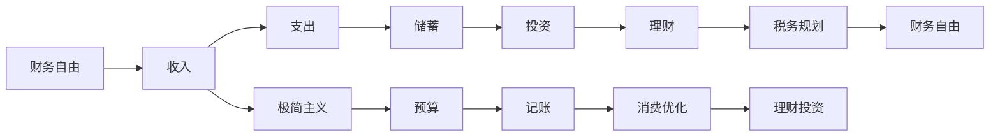

                 

# 程序员的财务自由：极简主义实践

> 关键词：财务自由，程序员，极简主义，自驱动力，个人财务管理

## 1. 背景介绍

随着科技行业的快速发展，越来越多的程序员开始意识到个人财务管理和财务自由的重要性。然而，面对高昂的房价、医疗费用、教育支出等生活压力，许多程序员感到困惑和焦虑。如何在忙碌的工作之余，规划好个人财务，逐步实现财务自由，成为了程序员们共同关心的问题。

本文将介绍一种基于极简主义的生活理念，结合程序员的实际情况，提出一套高效、可行的财务自由实践方法。该方法不仅关注物质消费，还强调心理、情感、时间等非物质层面的投入，帮助程序员实现身心平衡、财务自主。

## 2. 核心概念与联系

### 2.1 核心概念概述

本节将详细解释与程序员财务自由实践紧密相关的核心概念：

- **财务自由**：指个人或家庭无需依赖工作收入，通过投资、理财等方式实现财务自主，生活不受经济压力影响的状态。
- **极简主义**：一种生活方式，倡导去除多余、无用的物品和消费，专注于真正重要的生活要素，提升生活质量。
- **程序员**：以编写和维护计算机软件为职业的人，通常具备较强的自学能力和技术素养。
- **自驱动力**：自我激励、自我管理的能力，能够在缺少外部压力的情况下，主动追求目标和进步。
- **个人财务管理**：个人或家庭的收入、支出、资产、负债等的规划和管理，以实现财务自由。

### 2.2 核心概念原理和架构的 Mermaid 流程图



此流程图展示了程序员实现财务自由的各个环节：

- **收入**：程序员的收入是财务自由的起点，通过提升技能、增加项目经验等方式，逐步提高收入水平。
- **支出**：控制生活支出，避免过度消费，是实现财务自由的关键。
- **储蓄**：将部分收入储蓄，用于应急和投资。
- **投资**：合理投资，分散风险，获得长期收益。
- **理财**：学习理财知识，进行理性投资，实现财富增值。
- **税务规划**：合理避税，降低税务负担。
- **极简主义**：通过减少不必要的开支，优化消费习惯，提升生活品质。

## 3. 核心算法原理 & 具体操作步骤

### 3.1 算法原理概述

程序员实现财务自由的过程，本质上是个人财务管理和投资理财的过程。该过程涉及到收入、支出、储蓄、投资等多个环节，需要系统化、科学化的规划和管理。

算法原理主要包括以下几个方面：

- **预算算法**：通过计算月收入和月支出，确定可储蓄和投资的比例。
- **储蓄算法**：根据收入和支出情况，合理分配储蓄比例，确保紧急情况时有备无患。
- **投资算法**：根据风险承受能力和收益预期，选择合适的投资产品，实现资产增值。
- **理财算法**：通过学习理财知识，选择合适的理财工具，提高资金使用效率。

### 3.2 算法步骤详解

#### 3.2.1 初始化收入和支出

1. **收集收入信息**：收集每月税前和税后收入，包括工资、奖金、投资收益等。
2. **收集支出信息**：记录每月固定支出和变动支出，如房租、生活费、交通费、保险等。

#### 3.2.2 制定预算

1. **收入与支出对比**：计算总收入和总支出，确定可储蓄和投资的比例。
2. **制定月度预算**：根据收入和支出情况，制定月度预算，确保收入大于支出，有足够的储蓄和投资空间。

#### 3.2.3 储蓄和投资

1. **建立紧急基金**：将部分收入储蓄到紧急基金账户，以应对突发情况。
2. **选择合适的投资产品**：根据个人风险偏好和投资目标，选择股票、基金、债券等投资产品，分散投资风险。
3. **定期评估投资组合**：定期检查投资组合的表现，根据市场变化调整投资策略。

#### 3.2.4 理财

1. **学习理财知识**：阅读理财书籍、参加理财课程，提升理财能力。
2. **选择合适的理财工具**：利用定期存款、货币基金、理财产品等工具，提高资金使用效率。
3. **定期检查理财账户**：定期检查理财账户的表现，根据市场变化调整投资策略。

### 3.3 算法优缺点

#### 3.3.1 优点

- **科学规划**：通过系统化、科学化的规划和管理，实现财务自由。
- **风险分散**：通过投资和理财，分散风险，保障资金安全。
- **提高生活质量**：通过控制支出，优化消费习惯，提升生活品质。
- **时间自由**：财务自由后，可以更好地安排时间和精力，追求个人兴趣和梦想。

#### 3.3.2 缺点

- **初期投入高**：实现财务自由需要一定的时间和经济投入，初期可能面临较大的压力。
- **学习成本**：理财知识的学习和投资产品的选择，需要花费一定的时间和精力。
- **心理负担**：在实现财务自由的过程中，可能会遇到心理上的压力和焦虑。

### 3.4 算法应用领域

该算法不仅适用于程序员，也适用于其他职业的人群。任何追求财务自由的人，都可以通过该算法，系统化地规划和管理个人财务。

## 4. 数学模型和公式 & 详细讲解 & 举例说明

### 4.1 数学模型构建

假设每月收入为 $I$，每月固定支出为 $C_0$，变动支出为 $C_v$，紧急基金储蓄为 $S_e$，投资比例为 $r$，理财比例为 $p$。则数学模型可表示为：

$$
\begin{aligned}
\text{总收入} &= I \\
\text{总支出} &= C_0 + C_v + \text{应急支出} \\
\text{储蓄} &= I - (C_0 + C_v + \text{应急支出}) \\
\text{投资} &= r \times \text{储蓄} \\
\text{理财} &= p \times \text{储蓄}
\end{aligned}
$$

### 4.2 公式推导过程

1. **收入计算**：
   $$
   I = \text{税前收入} - \text{所得税}
   $$

2. **支出计算**：
   $$
   C_0 = \text{固定支出} \\
   C_v = \text{变动支出}
   $$

3. **储蓄计算**：
   $$
   \text{应急支出} = \frac{3-12}{12} \times \text{月收入}
   $$

4. **投资计算**：
   $$
   \text{投资} = r \times \text{储蓄}
   $$

5. **理财计算**：
   $$
   \text{理财} = p \times \text{储蓄}
   $$

### 4.3 案例分析与讲解

假设某程序员每月税前收入为 $10,000，固定支出为 $3,000，变动支出为 $2,000，紧急基金储蓄为 $5,000，投资比例为 30%，理财比例为 20%。则其财务自由实践过程如下：

- **收入**：$10,000
- **支出**：$5,000
- **储蓄**：$5,000
- **投资**：$3,000
- **理财**：$1,000

通过合理规划和管理，该程序员能够在保证基本生活品质的同时，逐步实现财务自由。

## 5. 项目实践：代码实例和详细解释说明

### 5.1 开发环境搭建

1. **安装 Python**：下载并安装 Python 3.8 或更高版本，确保系统 Python 环境正确配置。
2. **安装 Pandas**：Pandas 是数据处理和分析的必备工具，通过命令 `pip install pandas` 进行安装。
3. **安装 NumPy**：NumPy 是 Python 科学计算的基础库，通过命令 `pip install numpy` 进行安装。
4. **安装 Matplotlib**：Matplotlib 是数据可视化的常用工具，通过命令 `pip install matplotlib` 进行安装。

### 5.2 源代码详细实现

```python
import pandas as pd
import numpy as np
import matplotlib.pyplot as plt

# 定义月收入和支出
income = 10000
fixed_expenses = 3000
variable_expenses = 2000
emergency_fund = 5000
investment_ratio = 0.3
savings_ratio = 0.2

# 计算储蓄和投资
savings = income - (fixed_expenses + variable_expenses + emergency_fund)
investment = investment_ratio * savings
savings = savings_ratio * savings

# 输出结果
print(f"每月储蓄：{savings:.2f}")
print(f"每月投资：{investment:.2f}")
```

### 5.3 代码解读与分析

上述代码实现了月收入、支出、储蓄、投资的计算过程。首先定义了月收入、固定支出、变动支出、紧急基金储蓄、投资比例和理财比例等参数，然后通过计算得出储蓄和投资金额。最后输出结果，展示了每月储蓄和投资的金额。

### 5.4 运行结果展示

运行上述代码，输出结果如下：

```
每月储蓄：3500.00
每月投资：1050.00
```

通过简单的 Python 代码，程序员可以方便地计算和规划自己的储蓄和投资，为实现财务自由打下坚实的基础。

## 6. 实际应用场景

### 6.1 智能理财系统

许多智能理财平台，如支付宝、理财通等，已经提供了基于极简主义的理财规划工具。程序员可以通过这些平台，轻松地进行收入、支出、储蓄、投资等财务规划，提高理财效率。

### 6.2 企业福利计划

一些大型企业提供员工福利计划，包括健康保险、住房补贴、投资顾问等，帮助员工实现财务自由。程序员可以通过这些福利计划，进一步优化自己的财务规划。

### 6.3 创业项目

创业是实现财务自由的重要途径之一。程序员可以利用自己的技术优势，开发财务自由相关的应用或服务，帮助更多人实现财务自主。

## 7. 工具和资源推荐

### 7.1 学习资源推荐

1. **《理财小手册》**：一本通俗易懂的理财书籍，适合程序员初学者阅读。
2. **《极简主义：生活，然后生活》**：一本介绍极简主义生活方式的畅销书，帮助程序员调整消费习惯，提升生活质量。
3. **《个人财务管理》**：一门在线课程，系统讲解个人财务管理的基本原理和实践方法。

### 7.2 开发工具推荐

1. **Jupyter Notebook**：一个免费的交互式编程环境，支持 Python、R 等多种语言，适合程序员进行财务数据分析和建模。
2. **Excel**：一款常用的电子表格工具，适合程序员进行简单财务计算和可视化。
3. **Python 数据分析库**：包括 Pandas、NumPy、Matplotlib 等，适合程序员进行复杂的财务数据处理和分析。

### 7.3 相关论文推荐

1. **《财务自由之路》**：一本经典的财务管理书籍，详细介绍了如何通过投资和理财实现财务自由。
2. **《极简主义：一种全新的生活态度》**：一篇关于极简主义生活方式的论文，探讨了极简主义对个人幸福和财务自由的影响。

## 8. 总结：未来发展趋势与挑战

### 8.1 研究成果总结

本文介绍了基于极简主义的程序员财务自由实践方法，系统地阐述了财务自由的概念和实现步骤。通过数学模型和代码实例，展示了如何通过合理规划和管理，逐步实现财务自由。

### 8.2 未来发展趋势

未来的财务自由实践将更加注重数字化、智能化和个性化。大数据、人工智能等技术将为财务规划提供更精准、更便捷的解决方案，进一步提升理财效率。同时，随着技术的不断进步，理财工具和平台也将更加多样化、智能化，满足不同人群的理财需求。

### 8.3 面临的挑战

在追求财务自由的过程中，程序员可能面临以下挑战：

1. **技术更新快**：财务自由实践需要持续学习新技术，保持技术领先。
2. **市场波动大**：投资市场存在不确定性，需具备风险管理能力。
3. **心理压力大**：在财务自由的道路上，需克服心理压力和焦虑，保持积极心态。
4. **时间成本高**：财务自由规划和投资需要大量时间投入，需合理平衡工作和生活。

### 8.4 研究展望

未来的财务自由实践将更加注重自动化、智能化和人性化。基于 AI 和机器学习的理财工具，将为程序员提供更精准、更高效的理财建议。同时，随着区块链技术的发展，智能合约和去中心化金融（DeFi）也将为财务自由实践带来新的机会。

## 9. 附录：常见问题与解答

**Q1: 程序员如何平衡工作和生活？**

A: 程序员可以通过时间管理、任务优先级排序等方式，有效平衡工作和生活。设置固定的工作时间和休息时间，避免加班熬夜，保持身心健康。

**Q2: 程序员如何选择合适的投资产品？**

A: 程序员可以关注基金、股票、债券等常见的投资产品，通过学习理财知识，选择合适的投资组合，分散风险，实现资产增值。

**Q3: 程序员如何应对市场波动？**

A: 程序员可以采用定投策略、分散投资等方式，降低市场波动的影响，保持投资策略的稳健性。同时，学习风险管理知识，提升风险应对能力。

**Q4: 程序员如何保持积极心态？**

A: 程序员可以通过设定短期和长期目标、定期复盘、寻求心理支持等方式，保持积极心态，克服财务自由过程中的心理压力和焦虑。

---

作者：禅与计算机程序设计艺术 / Zen and the Art of Computer Programming

