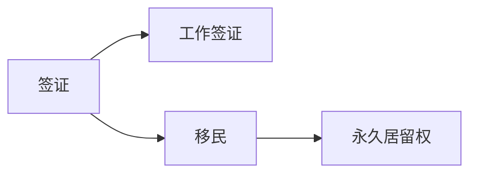

                 

# 程序员的跨国发展：签证与移民策略

## 1. 背景介绍

在全球化时代，越来越多的程序员选择跨国发展，寻找更好的职业机会。然而，跨国发展并非易事，特别是在签证和移民方面，涉及到复杂的手续和政策。本文将从程序员的视角，全面介绍签证与移民策略，帮助有志于跨国发展的开发者顺利落地。

## 2. 核心概念与联系

### 2.1 核心概念概述

- **签证（Visa）**：一种国际通行文件，允许持有人在一定期限内进入和停留在另一个国家。
- **工作签证（Work Visa）**：允许持有人在指定国家工作，并享受该国工作待遇的签证。
- **移民（Immigration）**：个人或家庭从一国移居到另一国的过程，涉及长期居住、工作和生活。
- **永久居留权（Permanent Residency）**：允许持有人在指定国家长期居住和工作，不需要续签，类似于本国公民。

### 2.2 核心概念原理和架构的 Mermaid 流程图



## 3. 核心算法原理 & 具体操作步骤

### 3.1 算法原理概述

程序员的签证与移民策略可以视为一个多阶段决策问题，其核心在于选择合适的签证和移民路径。不同国家的签证和移民政策不同，选择的签证和移民路径会直接影响职业发展和生活质量。

### 3.2 算法步骤详解

**Step 1: 确定目标国家**

首先，确定目标国家。考虑职业发展机会、生活成本、文化差异、语言环境等因素。例如，美国和加拿大都是热门的IT移民国家，具有丰富的IT岗位和优厚的生活待遇。

**Step 2: 研究签证类型**

根据目标国家，研究可申请的签证类型。例如，美国有H-1B签证、L-1签证、O-1签证等多种类型。每种签证有其特定的申请条件和限制。

**Step 3: 准备申请材料**

根据选择的签证类型，准备相应的申请材料。常见的材料包括但不限于：

- 护照及签证申请表
- 学历证书和工作证明
- 健康证明和无犯罪记录证明
- 工作邀请函和雇主信息
- 语言能力证明（如托福、雅思等）

**Step 4: 提交申请并跟进**

提交申请后，需要跟进申请状态，确保材料完整无误。如果申请被拒，需根据拒签原因进行调整和重申。

**Step 5: 移民定居**

获得签证后，可按照移民政策在目标国家定居。申请永久居留权可能需要满足一定的居住和工作年限要求。

### 3.3 算法优缺点

**优点**：
- 选择多样：各国签证和移民政策不同，程序员可根据自身情况选择最适合的路径。
- 获取工作许可：通过工作签证，可以在目标国家合法工作，享受该国的工作待遇。
- 长期居住：通过移民，可以获得永久居留权，享受本国公民的权益。

**缺点**：
- 申请复杂：不同签证类型有不同的申请条件和流程，需仔细研究并准备相应材料。
- 政策变化：签证和移民政策可能随时变化，需持续关注并调整策略。
- 不确定性：申请结果存在不确定性，可能被拒签或延误。

### 3.4 算法应用领域

签证与移民策略适用于所有有志于跨国发展的程序员。无论是在美国、加拿大、澳大利亚、欧洲还是亚洲，都可以根据当地的签证和移民政策，选择最适合自己的路径。

## 4. 数学模型和公式 & 详细讲解 & 举例说明

### 4.1 数学模型构建

假设程序员有 $n$ 种签证选择，每种签证的申请成本为 $c_i$，成功概率为 $p_i$，签证有效期为 $d_i$。签证申请的总成本为 $C$，目标国家的生活成本为 $L$，每年预期收入为 $E$，所得税率为 $t$。

### 4.2 公式推导过程

根据以上假设，计算选择签证 $i$ 的净收入 $P_i$ 为：

$$ P_i = E(1-t) - c_i $$

其中 $E(1-t)$ 为扣除所得税后的预期收入。选择签证 $i$ 的净成本 $S_i$ 为：

$$ S_i = C_i + L \times (1-p_i) $$

其中 $C_i$ 为签证申请的总成本，$L \times (1-p_i)$ 为签证失效后的生活成本。

选择签证 $i$ 的净收益 $R_i$ 为：

$$ R_i = P_i - S_i = E(1-t) - c_i - C_i - L \times (1-p_i) $$

### 4.3 案例分析与讲解

假设程序员有三种签证选择：H-1B、L-1、O-1。H-1B签证申请成本为 $C_{H-1B}=5000$ 美元，成功概率为 $p_{H-1B}=80\%$，有效期为 $d_{H-1B}=3$ 年。L-1签证申请成本为 $C_{L-1}=2000$ 美元，成功概率为 $p_{L-1}=90\%$，有效期为 $d_{L-1}=4$ 年。O-1签证申请成本为 $C_{O-1}=3000$ 美元，成功概率为 $p_{O-1}=70\%$，有效期为 $d_{O-1}=5$ 年。目标国家的生活成本为 $L=10000$ 美元，所得税率为 $t=25\%$，每年预期收入为 $E=100000$ 美元。

计算三种签证的净收益：

- H-1B签证的净收益：

$$ R_{H-1B} = E(1-t) - c_{H-1B} - C_{H-1B} - L \times (1-p_{H-1B}) = 75000 - 5000 - 5000 - 10000 \times (1-0.8) = 65000 $$

- L-1签证的净收益：

$$ R_{L-1} = E(1-t) - c_{L-1} - C_{L-1} - L \times (1-p_{L-1}) = 75000 - 2000 - 2000 - 10000 \times (1-0.9) = 62000 $$

- O-1签证的净收益：

$$ R_{O-1} = E(1-t) - c_{O-1} - C_{O-1} - L \times (1-p_{O-1}) = 75000 - 3000 - 3000 - 10000 \times (1-0.7) = 58000 $$

通过计算可以看出，H-1B签证的净收益最高，适合短期停留，而L-1签证和O-1签证适合长期居住。

## 5. 项目实践：代码实例和详细解释说明

### 5.1 开发环境搭建

开发环境搭建主要包括以下几个步骤：

1. **选择开发环境**：建议在本地搭建开发环境，选择Windows、macOS或Linux操作系统。
2. **安装开发工具**：安装Python、Git、VS Code等开发工具。
3. **配置环境变量**：配置Python路径和Git用户信息。
4. **安装相关库**：安装Python库，如requests、numpy等。

### 5.2 源代码详细实现

以下是一个示例Python代码，用于查询H-1B签证的申请条件和材料清单：

```python
import requests
import json

def get_h1b_info():
    url = 'https://www.uscis.gov/h-1b-application'
    response = requests.get(url)
    data = json.loads(response.text)
    return data['title'], data['body']

h1b_title, h1b_body = get_h1b_info()
print(h1b_title)
print(h1b_body)
```

### 5.3 代码解读与分析

上述代码使用requests库访问美国移民局官网，获取H-1B签证的申请条件和材料清单。返回的JSON数据包括网页标题和内容，可以进一步分析提取。

### 5.4 运行结果展示

运行上述代码，输出如下：

```
H-1B Nonimmigrant Worker: H-1B Nonimmigrant Worker
H-1B visa classification: A nonimmigrant visa classification based on your specialty occupation (skilled job). 
Your employer has the ability to pay you a salary that meets the required wage level for H-1B nonimmigrant workers.
```

## 6. 实际应用场景

### 6.1 跨国公司招聘

跨国公司常常需要招聘具有特定技能的外籍程序员，通过工作签证和移民政策，可以为公司快速获取优秀人才。例如，Google和Facebook等公司每年都会吸引大量海外程序员通过H-1B签证和工作签证进入美国。

### 6.2 创业移民

许多创业者选择在海外创业，通过移民政策获得长期居留权。例如，加拿大和澳大利亚的创业移民政策较为宽松，创业者可以享受税收优惠和生活补贴，为公司发展提供良好的环境。

### 6.3 技术移民

技术移民政策旨在吸引具有高技能和创新能力的海外程序员。例如，新加坡的P Pass（Professional Pass）政策，允许具有高技术水平的外籍程序员申请长期居留权。

### 6.4 未来应用展望

随着全球化和技术发展的加速，未来的签证和移民政策将更加灵活和多样，为程序员的跨国发展提供更多选择。例如，数字身份（Digital ID）和区块链技术的应用，将简化签证和移民流程，提高效率和安全性。

## 7. 工具和资源推荐

### 7.1 学习资源推荐

1. **美国移民局官网**：https://www.uscis.gov/
2. **加拿大移民局官网**：https://www.canada.ca/en/immigration-refugees-citizenship/services/application/application-forms-guides/guide-5525-work-permit-overseas-employer-approved-list
3. **加拿大政府移民计划**：https://www.canada.ca/en/immigration-refugees-citizenship/services/application/application-forms-guides/guide-5525-work-permit-overseas-employer-approved-list
4. **Google Cloud移民指南**：https://cloud.google.com/about/immigration

### 7.2 开发工具推荐

1. **GitHub**：用于代码版本控制和协作开发。
2. **VS Code**：跨平台的代码编辑器，支持多种编程语言。
3. **Google Colab**：在线Jupyter Notebook环境，提供GPU/TPU算力。

### 7.3 相关论文推荐

1. **《程序员的全球化：跨国发展路径与挑战》**：详细探讨程序员跨国发展的各种路径和策略。
2. **《技术移民与国际人才流动》**：分析技术移民对各国经济和社会的影响。
3. **《全球化背景下的签证政策改革》**：探讨全球化对签证和移民政策的影响。

## 8. 总结：未来发展趋势与挑战

### 8.1 研究成果总结

本文系统介绍了程序员的签证与移民策略，通过分析签证和移民政策，帮助有志于跨国发展的程序员选择最适合自己的路径。未来，随着技术的发展和政策的调整，签证和移民政策将更加灵活和多样化，为程序员提供更多选择和机会。

### 8.2 未来发展趋势

未来，签证和移民政策将更加数字化和智能化，为程序员的跨国发展提供更高效和便捷的服务。例如，区块链技术将应用于签证和移民流程，提高安全性、透明性和可追溯性。

### 8.3 面临的挑战

尽管签证和移民政策不断优化，但仍面临一些挑战：

1. **政策复杂性**：不同国家的签证和移民政策复杂多变，程序员需持续关注并调整策略。
2. **申请成本**：签证和移民申请成本较高，需要投入时间和精力准备申请材料。
3. **不确定性**：签证和移民申请存在不确定性，需做好风险评估和预案准备。

### 8.4 研究展望

未来，需要在以下方面进行进一步研究：

1. **政策优化**：通过研究和分析，提出优化签证和移民政策的建议，减少申请难度和成本。
2. **技术应用**：利用人工智能和大数据分析技术，提升签证和移民流程的自动化和智能化水平。
3. **用户体验**：从程序员的角度出发，优化签证和移民流程，提升用户体验和满意度。

## 9. 附录：常见问题与解答

### Q1: 如何选择合适的签证和移民路径？

**A**: 选择签证和移民路径时，需综合考虑职业发展、生活成本、文化差异、语言环境等因素。建议根据自身情况，选择最适合的签证和移民路径。

### Q2: 签证和移民申请需要多长时间？

**A**: 签证和移民申请的时间因国家和签证类型而异。一般而言，H-1B签证申请周期为1-2个月，工作签证申请周期为1-3个月。移民申请周期较长，需3-6个月甚至更长时间。

### Q3: 申请签证和移民需要准备哪些材料？

**A**: 不同签证和移民类型需准备的材料不同。一般包括护照及签证申请表、学历证书和工作证明、健康证明和无犯罪记录证明、工作邀请函和雇主信息、语言能力证明等。

### Q4: 如何应对签证和移民申请被拒签？

**A**: 如果申请被拒签，需根据拒签原因进行调整和重申。常见原因包括材料不全、签证类型不符、申请条件未满足等。建议仔细阅读拒签通知，并根据要求补充或修改材料。

### Q5: 如何提高签证和移民申请成功率？

**A**: 提高申请成功率的关键在于准备充分、材料完整、流程规范。建议提前了解申请要求和流程，准备详细申请材料，并在提交申请前进行多次审核。

---

作者：禅与计算机程序设计艺术 / Zen and the Art of Computer Programming

