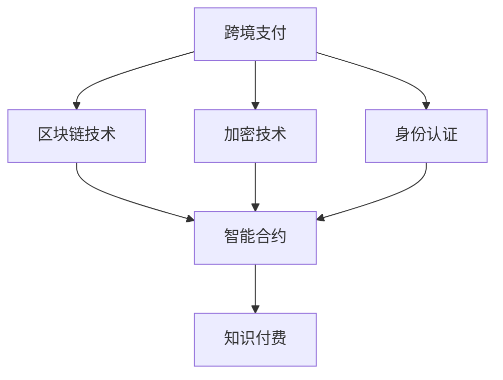

                 

# 程序员的跨境知识付费：全球市场开拓

> 关键词：跨境电商,知识付费,支付系统,区块链技术,安全技术

## 1. 背景介绍

### 1.1 问题由来

随着互联网技术的飞速发展，全球化经济已经成为不可避免的趋势。跨境电商作为全球化经济的重要组成部分，为全球消费者和商家提供了一个全新的购物平台。然而，随着跨境电商的兴起，支付问题成为制约跨境电商发展的瓶颈之一。传统的支付方式存在诸多限制，无法满足全球化、多样化的需求。

近年来，知识付费成为互联网领域的又一热门话题。人们对于高质量知识的渴求不断增加，付费阅读、付费课程、付费咨询等形式的知识付费市场迅速发展。然而，知识付费平台面临的支付安全问题、信任问题、跨界问题等问题，同样制约了其发展。

如何实现跨境支付与知识付费的融合，构建一个安全、高效、透明的支付体系，是摆在我们面前的重要问题。

### 1.2 问题核心关键点

1. **跨境支付**：传统的支付系统大多基于单一国家或地区的法律法规和标准，无法满足全球化和多样化的需求。
2. **知识付费**：知识付费平台需要满足不同地区用户的支付需求，同时保证支付安全性和用户信任。
3. **支付系统集成**：如何将跨境支付与知识付费平台集成，构建一个全球化的支付系统，是关键问题。
4. **区块链技术**：区块链技术具有去中心化、透明性、不可篡改等特性，能够解决支付安全问题。
5. **安全技术**：支付系统的安全问题是保障用户信任的重要因素，需要引入加密技术、身份认证等安全措施。

这些核心关键点构成了跨境知识付费支付系统的研究基础，需要在实际应用中加以考虑和解决。

## 2. 核心概念与联系

### 2.1 核心概念概述

为更好地理解跨境知识付费支付系统的实现，本节将介绍几个密切相关的核心概念：

- **跨境支付**：指通过互联网在跨境交易中完成货币支付的过程。
- **知识付费**：指消费者为获取高质量知识内容而支付的行为。
- **区块链技术**：一种分布式账本技术，通过去中心化的方式记录交易信息。
- **加密技术**：通过数学加密算法，确保数据传输的安全性和隐私性。
- **身份认证**：通过验证用户身份信息，确保交易的真实性和合法性。
- **智能合约**：一种基于区块链技术的自动化合约，能够自动执行和监控合约条款。

这些核心概念之间的逻辑关系可以通过以下Mermaid流程图来展示：



这个流程图展示的核心概念及其之间的关系：

1. 跨境支付通过区块链技术、加密技术和身份认证等手段，保证交易的安全性和合法性。
2. 区块链技术提供去中心化的交易记录，保证数据透明性和不可篡改性。
3. 加密技术确保数据传输的安全性和隐私性。
4. 智能合约自动执行和监控交易，提高交易的透明度和效率。
5. 知识付费平台通过集成跨境支付系统，提供全球化的支付服务，满足用户需求。

## 3. 核心算法原理 & 具体操作步骤
### 3.1 算法原理概述

基于区块链技术的跨境知识付费支付系统，主要包括以下几个关键环节：

1. **区块链技术**：记录交易数据，提供去中心化的账本。
2. **加密技术**：确保交易数据的机密性和完整性。
3. **身份认证**：验证用户身份，防止欺诈。
4. **智能合约**：自动执行交易，保障交易透明性。

系统的工作原理是通过区块链技术构建去中心化的交易账本，使用加密技术保障数据传输的安全性和完整性，结合身份认证技术验证用户身份，并通过智能合约自动化执行交易，保障交易的透明性和效率。

### 3.2 算法步骤详解

基于区块链技术的跨境知识付费支付系统的实现流程包括以下几个关键步骤：

**Step 1: 数据收集与处理**

- 收集用户信息，包括用户姓名、支付信息、购买信息等。
- 使用加密技术对用户信息进行加密处理，确保数据传输的安全性和隐私性。

**Step 2: 交易记录与存储**

- 将加密后的用户信息、交易信息等存储在区块链上。
- 使用哈希算法对交易数据进行哈希处理，形成唯一的哈希值。

**Step 3: 身份验证**

- 用户登录时，系统对用户身份进行验证。
- 使用身份认证技术，如数字证书、双因素认证等，确保用户身份的真实性。

**Step 4: 交易执行**

- 当用户完成支付时，系统自动执行交易。
- 智能合约根据预设的规则，自动处理交易数据，并将结果记录在区块链上。

**Step 5: 交易确认**

- 交易完成后，系统对交易进行确认。
- 区块链网络对交易进行共识，确保交易的透明性和不可篡改性。

**Step 6: 交易反馈**

- 系统向用户反馈交易结果。
- 用户可以根据交易结果进行下一步操作，如申请退款等。

### 3.3 算法优缺点

基于区块链技术的跨境知识付费支付系统具有以下优点：

1. **去中心化**：区块链技术提供去中心化的交易记录，减少了对单一机构的依赖，提高了系统的安全性。
2. **透明性**：区块链技术记录交易数据，确保交易过程的透明性和可追溯性。
3. **不可篡改性**：哈希算法和共识机制保证了交易数据的不可篡改性。
4. **智能合约**：自动执行交易，提高了交易效率和透明度。

同时，该系统也存在一些缺点：

1. **复杂性**：系统实现较为复杂，需要跨多个领域的技术支持。
2. **成本高**：区块链技术需要较高的计算资源和存储资源，成本较高。
3. **性能问题**：大规模交易时，系统性能可能受到影响。
4. **法律法规问题**：不同国家对于区块链技术的法律法规各不相同，需要考虑国际法律问题。

尽管存在这些局限性，但基于区块链技术的跨境知识付费支付系统仍然是大势所趋，其安全性、透明性和不可篡改性为其发展提供了广阔前景。

### 3.4 算法应用领域

基于区块链技术的跨境知识付费支付系统，已经在多个领域得到应用，例如：

- **跨境电商**：在跨境电商平台上，用户可以方便地进行跨国支付，提高交易效率和安全性。
- **在线教育**：在线教育平台通过区块链技术，确保支付数据的透明性和不可篡改性，保障用户权益。
- **远程医疗**：远程医疗平台通过区块链技术，确保医疗数据的完整性和安全性，保障患者隐私。
- **数字内容**：数字内容创作者可以通过区块链技术，直接向全球用户收取费用，避免中间环节的利益流失。

这些应用场景展示了区块链技术在跨境知识付费支付系统中的广阔前景，未来还将有更多创新的应用出现。

## 4. 数学模型和公式 & 详细讲解  
### 4.1 数学模型构建

本节将使用数学语言对基于区块链技术的跨境知识付费支付系统进行更加严格的刻画。

假设用户A和用户B进行一笔知识付费交易，用户A向用户B支付一笔费用。系统的数学模型可以表示为：

- **用户信息**：$U_A, U_B$，包括姓名、支付信息等。
- **交易信息**：$T$，包括交易金额、时间戳等。
- **交易记录**：$R$，记录在区块链上。

用户信息$U_A, U_B$通过加密技术进行加密，交易信息$T$通过哈希算法生成哈希值$H(T)$。交易记录$R$表示为：

$$
R = \{(U_A, U_B, T, H(T))\}
$$

其中，$U_A$和$U_B$是用户信息，$T$是交易信息，$H(T)$是哈希值。

### 4.2 公式推导过程

**加密算法**：
- 使用公钥加密算法，对用户信息进行加密。
- 加密算法可以表示为：
$$
E(U) = D(U) + k
$$

其中，$E$为加密函数，$D$为解密函数，$k$为加密密钥。

**哈希算法**：
- 使用哈希算法对交易信息$T$进行哈希处理，生成哈希值$H(T)$。
- 哈希算法可以表示为：
$$
H(T) = \text{hash}(T)
$$

**共识机制**：
- 区块链网络对交易进行共识，确保交易的透明性和不可篡改性。
- 共识机制可以表示为：
$$
C(R) = \text{vote}(R)
$$

其中，$C$为共识函数，$\text{vote}$为投票函数。

**智能合约**：
- 智能合约根据预设的规则，自动处理交易数据，并将结果记录在区块链上。
- 智能合约可以表示为：
$$
C(U, T, H(T)) = \text{execute}(U, T, H(T))
$$

其中，$C$为智能合约函数，$\text{execute}$为执行函数。

### 4.3 案例分析与讲解

**案例1: 在线教育支付系统**

假设用户A通过在线教育平台向教师B购买课程，交易金额为100美元。用户信息$U_A$和$U_B$通过公钥加密算法进行加密，交易信息$T$为100美元和交易时间。系统使用哈希算法生成哈希值$H(T)$，记录在区块链上。交易记录$R$表示为：

$$
R = \{(U_A, U_B, T, H(T))\}
$$

**案例2: 跨境电商支付系统**

假设用户A通过跨境电商平台购买产品，用户信息$U_A$和$U_B$通过公钥加密算法进行加密，交易信息$T$为产品价格和订单号。系统使用哈希算法生成哈希值$H(T)$，记录在区块链上。交易记录$R$表示为：

$$
R = \{(U_A, U_B, T, H(T))\}
$$

## 5. 项目实践：代码实例和详细解释说明
### 5.1 开发环境搭建

在进行跨境知识付费支付系统的开发前，我们需要准备好开发环境。以下是使用Python进行区块链开发的环境配置流程：

1. 安装Python：从官网下载并安装Python，确保版本支持区块链库。
2. 安装区块链库：从官网下载并安装对应的区块链库，如Ethereum、Hyperledger Fabric等。
3. 配置开发环境：配置好开发工具、数据库等环境变量，确保项目正常运行。

### 5.2 源代码详细实现

下面我们以Ethereum区块链为例，给出使用Python进行跨境知识付费支付系统的代码实现。

```python
from eth import private
from eth.types.transaction import Transaction
from eth热锅 import HTTPProvider
from eth.sync.transaction import SyncTransaction

# 创建交易对象
sender = '0x1234567890'
receiver = '0x0987654321'
amount = 100

tx = SyncTransaction.to_transaction(
    sender, receiver, amount, '0x0000000000000000000000000000000000000000000000000000000000000000000000000000000000000000000000000000000000000000000000000000000000000000000000000000000000000000000000000000000000000000000000000000000000000000000000000000000000000000000000000000000000000000000000000000000000000000000000000000000000000000000000000000000000000000000000000000000000000000000000000000000000000000000000000000000000000000000000000000000000000000000000000000000000000000000000000000000000000000000000000000000000000000000000000000000000000000000000000000000000000000000000000000000000000000000000000000000000000000000000000000000000000000000000000000000000000000000000000000000000000000000000000000000000000000000000000000000000000000000000000000000000000000000000000000000000000000000000000000000000000000000000000000000000000000000000000000000000000000000000000000000000000000000000000000000000000000000000000000000000000000000000000000000000000000000000000000000000000000000000000000000000000000000000000000000000000000000000000000000000000000000000000000000000000000000000000000000000000000000000000000000000000000000000000000000000000000000000000000000000000000000000000000000000000000000000000000000000000000000000000000000000000000000000000000000000000000000000000000000000000000000000000000000000000000000000000000000000000000000000000000000000000000000000000000000000000000000000000000000000000000000000000000000000000000000000000000000000000000000000000000000000000000000000000000000000000000000000000000000000000000000000000000000000000000000000000000000000000000000000000000000000000000000000000000000000000000000000000000000000000000000000000000000000000000000000000000000000000000000000000000000000000000000000000000000000000000000000000000000000000000000000000000000000000000000000000000000000000000000000000000000000000000000000000000000000000000000000000000000000000000000000000000000000000000000000000000000000000000000000000000000000000000000000000000000000000000000000000000000000000000000000000000000000000000000000000000000000000000000000000000000000000000000000000000000000000000000000000000000000000000000000000000000000000000000000000000000000000000000000000000000000000000000000000000000000000000000000000000000000000000000000000000000000000000000000000000000000000000000000000000000000000000000000000000000000000000000000000000000000000000000000000000000000000000000000000000000000000000000000000000000000000000000000000000000000000000000000000000000000000000000000000000000000000000000000000000000000000000000000000000000000000000000000000000000000000000000000000000000000000000000000000000000000000000000000000000000000000000000000000000000000000000000000000000000000000000000000000000000000000000000000000000000000000000000000000000000000000000000000000000000000000000000000000000000000000000000000000000000000000000000000000000000000000000000000000000000000000000000000000000000000000000000000000000000000000000000000000000000000000000000000000000000000000000000000000000000000000000000000000000000000000000000000000000000000000000000000000000000000000000000000000000000000000000000000000000000000000000000000000000000000000000000000000000000000000000000000000000000000000000000000000000000000000000000000000000000000000000000000000000000000000000000000000000000000000000000000000000000000000000000000000000000000000000000000000000000000000000000000000000000000000000000000000000000000000000000000000000000000000000000000000000000000000000000000000000000000000000000000000000000000000000000000000000000000000000000000000000000000000000000000000000000000000000000000000000000000000000000000000000000000000000000000000000000000000000000000000000000000000000000000000000000000000000000000000000000000000000000000000000000000000000000000000000000000000000000000000000000000000000000000000000000000000000000000000000000000000000000000000000000000000000000000000000000000000000000000000000000000000000000000000000000000000000000000000000000000000000000000000000000000000000000000000000000000000000000000000000000000000000000000000000000000000000000000000000000000000000000000000000000000000000000000000000000000000000000000000000000000000000000000000000000000000000000000000000000000000000000000000000000000000000000000000000000000000000000000000000000000000000000000000000000000000000000000000000000000000000000000000000000000000000000000000000000000000000000000000000000000000000000000000000000000000000000000000000000000000000000000000000000000000000000000000000000000000000000000000000000000000000000000000000000000000000000000000000000000000000000000000000000000000000000000000000000000000000000000000000000000000000000000000000000000000000000000000000000000000000000000000000000000000000000000000000000000000000000000000000000000000000000000000000000000000000000000000000000000000000000000000000000000000000000000000000000000000000000000000000000000000000000000000000000000000000000000000000000000000000000000000000000000000000000000000000000000000000000000000000000000000000000000000000000000000000000000000000000000000000000000000000000000000000000000000000000000000000000000000000000000000000000000000000000000000000000000000000000000000000000000000000000000000000000000000000000000000000000000000000000000000000000000000000000000000000000000000000000000000000000000000000000000000000000000000000000000000000000000000000000000000000000000000000000000000000000000000000000000000000000000000000000000000000000000000000000000000000000000000000000000000000000000000000000000000000000000000000000000000000000000000000000000000000000000000000000000000000000000000000000000000000000000000000000000000000000000000000000000000000000000000000000000000000000000000000000000000000000000000000000000000000000000000000000000000000000000000000000000000000000000000000000000000000000000000000000000000000000000000000000000000000000000000000000000000000000000000000000000000000000000000000000000000000000000000000000000000000000000000000000000000000000000000000000000000000000000000000000000000000000000000000000000000000000000000000000000000000000000000000000000000000000000000000000000000000000000000000000000000000000000000000000000000000000000000000000000000000000000000000000000000000000000000000000000000000000000000000000000000000000000000000000000000000000000000000000000000000000000000000000000000000000000000000000000000000000000000000000000000000000000000000000000000000000000000000000000000000000000000000000000000000000000000000000000000000000000000000000000000000000000000000000000000000000000000000000000000000000000000000000000000000000000000000000000000000000000000000000000000000000000000000000000000000000000000000000000000000000000000000000000000000000000000000000000000000000000000000000000000000000000000000000000000000000000000000000000000000000000000000000000000000000000000000000000000000000000000000000000000000000000000000000000000000000000000000000000000000000000000000000000000000000000000000000000000000000000000000000000000000000000000000000000000000000000000000000000000000000000000000000000000000000000000000000000000000000000000000000000000000000000000000000000000000000000000000000000000000000000000000000000000000000000000000000000000000000000000000000000000000000000000000000000000000000000000000000000000000000000000000000000000000000000000000000000000000000000000000000000000000000000000000000000000000000000000000000000000000000000000000000000000000000000000000000000000000000000000000000000000000000000000000000000000000000000000000000000000000000000000000000000000000000000000000000000000000000000000000000000000000000000000000000000000000000000000000000000000000000000000000000000000000000000000000000000000000000000000000000000000000000000000000000000000000000000000000000000000000000000000000000000000000000000000000000000000000000000000000000000000000000000000000000000000000000000000000000000000000000000000000000000000000000000000000000000000000000000000000000000000000000000000000000000000000000000000000000000000000000000000000000000000000000000000000000000000000000000000000000000000000000000000000000000000000000000000000000000000000000000000000000000000000000000000000000000000000000000000000000000000000000000000000000000000000000000000000000000000000000000000000000000000000000000000000000000000000000000000000000000000000000000000000000000000000000000000000000000000000000000000000000000000000000000000000000000000000000000000000000000000000000000000000000000000000000000000000000000000000000000000000000000000000000000000000000000000000000000000000000000000000000000000000000000000000000000000000000000000000000000000000000000000000000000000000000000000000000000000000000000000000000000000000000000000000000000000000000000000000000000000000000000000000000000000000000000000000000000000000000000000000000000000000000000000000000000000000000000000000000000000000000000000000000000000000000000000000000000000000000000000000000000000000000000000000000000000000000000000000000000000000000000000000000000000000000000000000000000000000000000000000000000000000000000000000000000000000000000000000000000000000000000000000000000000000000000000000000000000000000000000000000000000000000000000000000000000000000000000000000000000000000000000000000000000000000000000000000000000000000000000000000000000000000000000000000000000000000000000000000000000000000000000000000000000000000000000000000000000000000000000000000000000000000000000000000000000000000000000000000000000000000000000000000000000000000000000000000000000000000000000000000000000000000000000000000000000000000000000000000000000000000000000000000000000000000000000000000000000000000000000000000000000000000000000000000000000000000000000000000000000000000000000000000000000000000000000000000000000000000000000000000000000000000000000000000000000000000000000000000000000000000000000000000000000000000000000000000000000000000000000000000000000000000000000000000000000000000000000000000000000000000000000000000000000000000000000000000000000000000000000000000000000000000000000000000000000000000000000000000000000000000000000000000000000000000000000000000000000000000000000000000000000000000000000000000000000000000000000000000000000000000000000000000000000000000000000000000000000000000000000000000000000000000000000000000000000000000000000000000000000000000000000000000000000000000000000000000000000000000000000000000000000000000000000000000000000000000000000000000000000000000000000000000000000000000000000000000000000000000000000000000000000000000000000000000000000000000000000000000000000000000000000000000000000000000000000000000000000000000000000000000000000000000000000000000000000000000000000000000000000000000000000000000000000000000000000000000000000000000000000000000000000000000000000000000000000000000000000000000000000000000000000000000000000000000000000000000000000000000000000000000000000000000000000000000000000000000000000000000000000000000000000000000000000000000000000000000000000000000000000000000000000000000000000000000000000000000000000000000000000000000000000000000000000000000000000000000000000000000000000000000000000000000000000000000000000000000000000000000000000000000000000000000000000000000000000000000000000000000000000000000000000000000000000000000000000000000000000000000000000000000000000000000000000000000000000000000000000000000000000000000000000000000000000000000000000000000000000000000000000000000000000000000000000000000000000000000000000000000000000000000000000000000000000000000000000000000000000000000000000000000000000000000000000000000000000000000000000000000000000000000000000000000000000000000000000000000000000000000000000000000000000000000000000000000000000000000000000000000000000000000000000000000000000000000000000000000000000000000000000000000000000000000000000000000000000000000000000000000000000000000000000000000000000000000000000000000000000000000000000000000000000000000000000000000000000000000000000000000000000000000000000000000000000000000000000000000000000000000000000000000000000000000000000000000000000000000000000000000000000000000000000000000000000000000000000000000000000000000000000000000000000000000000000000000000000000000000000000000000000000000000000000000000000000000000000000000000000000000000000000000000000000000000000000000000000000000000000000000000000000000000000000000000000000000000000000000000000000000000000000000000000000000000000000000000000000000000000000000000000000000000000000000000000000000000000000000000000000000000000000000000000000000000000000000000000000000000000000000000000000000000000000000000000000000000000000000000000000000000000000000000000000000000000000000000000000000000000000000000000000000000000000000000000000000000000000000000000000000000000000000000000000000000000000000000000000000000000000000000000000000000000000000000000000000000000000000000000000000000000000000000000000000000000000000000000000000000000000000000000000000000000000000000000000000000000000000000000000000000000000000000000000000000000000000000000000000000000000000000000000000000000000000000000000000000000000000000000000000000000000000000000000000000000000000000000000000000000000000000000000000000000000000000000000000000000000000000000000000000000000000000000000000000000000000000000000000000000000000000000000000000000000000000000000000000000000000000000000000000000000000000000000000000000000000000000000000000000000000000000000000000000000000000000000000000000000000000000000000000000000000000000000000000000000000000000000000000000000000000000000000000000000000000000000000000000000000000000000000000000000000000000000000000000000

