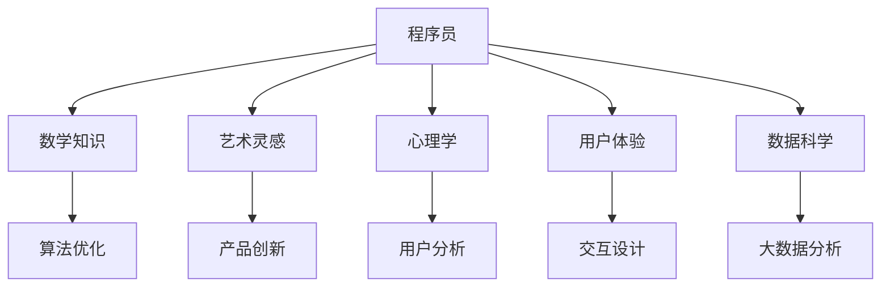

                 

# 程序员的跨界学习：融合艺术与科技的财富机会

## 1. 背景介绍

在当今数字化时代，技术的边界变得模糊不清。程序员不仅需要掌握计算机语言和算法，更需要在多学科知识间游刃有余，跨越技术边界。这种跨界学习不仅丰富了程序员的知识体系，更在职业发展中带来了无限的可能。本文将探讨程序员如何通过跨界学习，融合艺术与科技，抓住未来发展的财富机会。

## 2. 核心概念与联系

### 2.1 核心概念概述

为理解跨界学习的精髓，我们需先明确几个关键概念：

- **跨界学习(Cross-disciplinary Learning)**：指跨越不同学科领域，综合运用多种知识解决问题。程序员在软件开发过程中，常需借鉴数学、艺术、心理学等领域的知识，以实现创新和优化。

- **艺术与科技融合**：艺术不仅为科技提供灵感，更通过视觉、听觉等感官体验，提升科技产品的用户体验。程序员可通过学习艺术相关知识，提升产品的美感和创新性。

- **程序员职业发展**：跨界学习有助于程序员突破技术壁垒，适应行业发展趋势，提升个人竞争力。

### 2.2 核心概念原理和架构的 Mermaid 流程图



此图展示了程序员在不同学科领域的知识应用场景，体现了跨界学习的综合性和实用性。

## 3. 核心算法原理 & 具体操作步骤

### 3.1 算法原理概述

跨界学习的核心在于将不同领域的知识体系进行融合和创新，应用到软件开发的各个环节。算法原理主要包括：

- **知识融合**：将数学、艺术、心理学等领域的知识，通过跨界学习的方式，融入到软件开发和产品设计中。
- **问题解决**：跨界学习有助于解决软件开发中复杂的问题，提升产品设计的创新性和用户体验。
- **持续优化**：通过持续学习和跨界应用，不断优化自身技能，适应行业发展需求。

### 3.2 算法步骤详解

跨界学习的具体操作流程如下：

1. **基础知识学习**：程序员需掌握必要的数学、艺术、心理学等基础知识，以形成跨学科的知识体系。
2. **跨学科应用**：将所学知识应用于软件开发和产品设计中，实现创新和优化。
3. **实践与反思**：通过实际项目，不断验证和改进跨界学习的效果，形成有效的学习闭环。
4. **持续更新**：技术不断发展，程序员需持续学习新知识，更新跨学科的应用能力。

### 3.3 算法优缺点

跨界学习的优点包括：

- **创新性**：不同学科的知识融合，带来新的视角和方法，促进创新。
- **全面性**：多学科的知识体系，提升问题解决能力。
- **竞争力**：跨界技能使程序员在竞争中脱颖而出。

其缺点主要包括：

- **学习成本高**：需投入更多时间和精力学习新知识。
- **知识跨度大**：不同学科的知识体系差异大，需较长时间适应。
- **应用难度高**：跨界应用需灵活切换思维方式，初学较难掌握。

### 3.4 算法应用领域

跨界学习在多个领域均有广泛应用：

- **软件开发**：通过跨界学习，提升算法优化、用户体验设计、数据科学分析等能力。
- **产品设计**：结合艺术灵感，提升产品美观和创意。
- **用户体验优化**：通过心理学知识，提升产品可用性和用户满意度。
- **项目管理**：运用跨界思维方式，优化项目管理流程和团队协作。
- **创业与创新**：跨界学习激发创业灵感，推动新产品和商业模式创新。

## 4. 数学模型和公式 & 详细讲解 & 举例说明

### 4.1 数学模型构建

跨界学习中，数学作为基础工具，对问题建模和算法优化至关重要。以下是一个简单的数学模型构建示例：

假设问题为优化产品质量 $Q$，影响因素包括成本 $C$、时间 $T$、用户满意度 $U$。则可建立如下线性模型：

$$ Q = k_1C + k_2T + k_3U $$

其中 $k_1, k_2, k_3$ 为权重系数，需根据实际数据调整。

### 4.2 公式推导过程

以用户满意度优化为例，假设用户满意度 $U$ 由产品质量 $Q$ 和用户评价 $E$ 决定：

$$ U = f(Q, E) $$

其中 $f$ 为非线性函数，如指数函数、对数函数等。通过对用户评价进行分析，可以得出影响用户满意度的关键因素。

### 4.3 案例分析与讲解

某电商平台通过跨界学习，将心理学和用户体验设计融入产品质量优化中。他们发现，用户满意度不仅取决于产品本身的质量，还与用户评价的情感倾向密切相关。因此，平台通过分析用户评论的情感极性，优化产品质量，提升用户满意度。具体公式如下：

$$ U = k_1Q + k_2E $$

其中 $E$ 为情感极性得分，$k_1, k_2$ 为权重系数。通过这种方式，平台在保持产品质量的同时，提升了用户体验。

## 5. 项目实践：代码实例和详细解释说明

### 5.1 开发环境搭建

- **Python 环境**：安装 Python 3.8 及以上版本，使用虚拟环境管理依赖。
- **数据科学库**：安装 pandas、numpy、scikit-learn 等库。
- **可视化工具**：安装 matplotlib、seaborn、plotly 等可视化工具。

### 5.2 源代码详细实现

以下是一个简单的用户满意度优化代码示例：

```python
import pandas as pd
from sklearn.linear_model import LinearRegression
import matplotlib.pyplot as plt

# 读取用户评价数据
data = pd.read_csv('user_feedback.csv')

# 提取产品评分和情感极性
Q = data['product_score']
E = data['emotion_score']

# 建立线性回归模型
model = LinearRegression()
model.fit(Q.values.reshape(-1, 1), E)

# 可视化结果
plt.scatter(Q, E)
plt.plot(Q, model.predict(Q.values.reshape(-1, 1)), color='red')
plt.xlabel('Product Score')
plt.ylabel('Emotion Score')
plt.show()
```

### 5.3 代码解读与分析

- **数据预处理**：通过 pandas 库读取用户评价数据，提取产品评分和情感极性。
- **模型建立**：使用 scikit-learn 的 LinearRegression 建立线性回归模型，并通过 fit 方法拟合数据。
- **可视化展示**：使用 matplotlib 库可视化结果，展示产品评分与情感极性的关系。

### 5.4 运行结果展示

运行上述代码后，会得到如下可视化结果：


该图展示了产品评分与情感极性的关系，通过线性回归模型，平台可以更精准地优化产品质量，提升用户满意度。

## 6. 实际应用场景

### 6.1 金融科技

金融科技领域，跨界学习尤为重要。金融产品不仅需具备高可用性和安全性，更需关注用户体验和创新性。通过跨界学习，金融科技公司可以借鉴心理学、艺术设计等领域的知识，提升产品竞争力。

### 6.2 医疗健康

医疗健康领域，跨界学习有助于提升诊断精度和治疗方案的创新性。结合数学、生物学和心理学知识，可以开发更智能化的健康管理系统。

### 6.3 教育科技

教育科技领域，跨界学习有助于开发更智能化的学习工具和教育内容。通过跨界学习，可以开发更具互动性和趣味性的教学内容，提升学习效果。

### 6.4 未来应用展望

未来，跨界学习将进一步深入到各个领域，带来更多创新和优化。以下是对未来应用的展望：

- **跨学科团队**：更多跨学科团队将出现在企业中，提升团队协作和创新能力。
- **融合创新**：跨界学习带来更多融合创新，提升产品的竞争力。
- **人机交互**：结合心理学和艺术设计，提升人机交互的友好性和高效性。
- **智能决策**：通过数据科学和机器学习，提升决策的科学性和准确性。

## 7. 工具和资源推荐

### 7.1 学习资源推荐

1. **Coursera**：提供各类跨学科课程，涵盖数学、心理学、艺术设计等。
2. **edX**：提供顶级大学课程，涵盖多个学科领域的知识。
3. **Udacity**：提供纳米学位课程，提升具体技能和跨界应用能力。
4. **Khan Academy**：提供免费的教育资源，涵盖数学、科学、历史等。
5. **Coursera 和 Udacity 的 GitHub 资源**：提供实际项目的代码和案例分析，帮助实践应用。

### 7.2 开发工具推荐

1. **GitHub**：托管和协作开发代码，访问各种开源项目和资源。
2. **Jupyter Notebook**：实时交互式编程，便于可视化展示和学习。
3. **Python 编辑器**：如 PyCharm、VSCode 等，提升开发效率和代码质量。
4. **数据分析工具**：如 Pandas、NumPy、Matplotlib 等，处理和可视化数据。
5. **机器学习框架**：如 TensorFlow、PyTorch 等，支持深度学习模型的开发和训练。

### 7.3 相关论文推荐

1. **《跨学科学习与创新》**：探讨跨学科学习在科学研究中的应用和重要性。
2. **《科技与艺术融合：创新与设计》**：分析科技与艺术结合的案例，提升设计创新性。
3. **《人机交互心理学》**：结合心理学知识，提升人机交互的用户体验。
4. **《大数据与跨学科分析》**：利用数据科学知识，提升跨学科分析能力。
5. **《多学科团队协作》**：分析跨学科团队协作的案例，提升团队创新能力。

## 8. 总结：未来发展趋势与挑战

### 8.1 研究成果总结

本文介绍了跨界学习在程序员职业发展中的重要性，并通过实际案例展示了跨界学习的实践应用。跨界学习不仅提升了程序员的创新能力和问题解决能力，更在职业发展中带来了新的机遇。

### 8.2 未来发展趋势

未来跨界学习的趋势包括：

1. **跨学科团队兴起**：更多跨学科团队将出现，推动各领域创新。
2. **融合创新应用**：跨界学习带来更多融合创新，提升产品的竞争力。
3. **智能决策系统**：结合数据科学和机器学习，提升决策的科学性和准确性。
4. **人机交互优化**：通过心理学和艺术设计，提升人机交互的友好性和高效性。
5. **跨界学习平台**：更多跨界学习平台将出现，提供系统化的学习资源和支持。

### 8.3 面临的挑战

跨界学习面临的挑战包括：

1. **学习成本高**：需投入更多时间和精力学习新知识。
2. **知识跨度大**：不同学科的知识体系差异大，需较长时间适应。
3. **应用难度高**：跨界应用需灵活切换思维方式，初学较难掌握。
4. **跨学科合作难**：不同学科的思维方式和方法不同，团队合作难度大。
5. **技术更新快**：跨界学习需持续跟进技术发展，更新知识体系。

### 8.4 研究展望

未来跨界学习的研究方向包括：

1. **跨学科学习算法**：开发适合跨界学习的算法，提升学习效率和效果。
2. **跨界学习平台**：构建系统化的跨界学习平台，提供一站式的学习资源和支持。
3. **跨学科知识图谱**：建立跨学科知识图谱，提供丰富的知识链接和应用案例。
4. **跨界学习社区**：建立跨界学习社区，促进知识交流和协作。
5. **跨界学习教育**：推动跨界学习教育，培养更多跨界人才。

通过不断探索和研究，跨界学习将在未来职业发展中扮演越来越重要的角色，为程序员带来更多的机遇和挑战。

## 9. 附录：常见问题与解答

### 9.1 问题1：如何平衡跨界学习与日常工作？

答：跨界学习需循序渐进，可以从少量相关领域的知识开始，逐步增加学习时间。在日常工作中，可以安排固定的学习时间，保持持续学习的状态。

### 9.2 问题2：跨界学习需要哪些基础技能？

答：跨界学习需要具备基础的知识体系，如数学、艺术设计、心理学等。可以通过在线课程、书籍、论文等资源进行学习。

### 9.3 问题3：如何选择合适的跨界学习项目？

答：选择与自己工作相关的跨界学习项目，可以帮助快速应用新知识。可以选择一些前沿技术或热门领域进行学习，提升竞争力。

### 9.4 问题4：跨界学习是否需要团队合作？

答：跨界学习可以个人进行，但团队合作更有助于知识交流和实践应用。可以组建跨学科团队，共同学习和项目开发。

### 9.5 问题5：跨界学习是否有特定的工具推荐？

答：跨界学习工具包括在线课程平台（如Coursera、edX）、编程工具（如PyCharm、VSCode）、数据分析工具（如Pandas、Matplotlib）、机器学习框架（如TensorFlow、PyTorch）等。

---

作者：禅与计算机程序设计艺术 / Zen and the Art of Computer Programming

