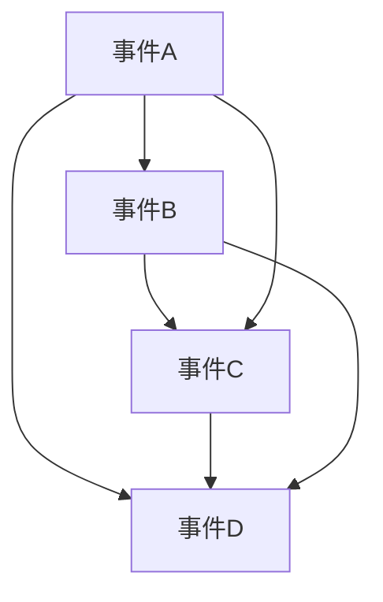

                 

### 文章标题

**像数学家一样思考：排容原理**

关键词：数学，排容原理，概率论，计算机科学，算法设计

摘要：本文将探讨排容原理在计算机科学中的应用。排容原理是概率论中的一个重要工具，它通过排除法计算多个事件的并集概率。本文将介绍排容原理的基本概念，详细解释其在计算机科学中的应用场景，并提供实例以帮助读者更好地理解这一数学工具在计算机领域的重要性。

### 1. 背景介绍（Background Introduction）

排容原理，也称为容斥原理（Inclusion-Exclusion Principle），是概率论中的一个基本概念。它提供了一个计算多个事件并集概率的公式，是解决复杂概率问题的有力工具。在计算机科学中，排容原理常用于解决集合操作、网络流、图论等问题。

本文将围绕以下几个方面展开：

- 排容原理的基本概念和公式
- 排容原理在计算机科学中的应用
- 排容原理的具体实例分析
- 排容原理在数学模型中的扩展

通过本文的探讨，读者将能够更好地理解排容原理的数学原理，并掌握其在计算机科学中的应用方法。

### 2. 核心概念与联系（Core Concepts and Connections）

#### 2.1 排容原理的基本概念

排容原理主要涉及三个基本概念：集合、事件和概率。

- **集合**：集合是数学中一组无序元素的组合。集合中的元素可以是任何对象，例如数字、字母、图形等。

- **事件**：事件是集合中的一个特定子集。例如，掷骰子得到一个偶数是事件，掷骰子得到一个3是另一个事件。

- **概率**：概率是事件发生的可能性。它通常用0到1之间的数值表示，其中0表示不可能发生，1表示必然发生。

排容原理的核心思想是通过排除重复计算来计算多个事件的并集概率。具体来说，排容原理提供了一个公式，用于计算多个事件并集的概率，同时考虑了这些事件之间的重叠部分。

#### 2.2 排容原理的数学公式

排容原理的数学公式如下：

\[ P(A \cup B) = P(A) + P(B) - P(A \cap B) \]

其中，\( P(A) \) 表示事件A发生的概率，\( P(B) \) 表示事件B发生的概率，\( P(A \cap B) \) 表示事件A和事件B同时发生的概率。

这个公式可以推广到多个事件的并集。例如，如果有三个事件A、B和C，那么它们的并集概率可以表示为：

\[ P(A \cup B \cup C) = P(A) + P(B) + P(C) - P(A \cap B) - P(A \cap C) - P(B \cap C) + P(A \cap B \cap C) \]

#### 2.3 排容原理与计算机科学的联系

在计算机科学中，排容原理被广泛应用于解决各种问题。以下是一些具体的例子：

- **网络流分析**：在计算机网络中，排容原理可以用于计算数据包在网络中的传输概率，从而优化网络性能。

- **图论问题**：在图论中，排容原理可以用于计算图中的连通性，从而解决图优化问题。

- **集合操作**：在集合操作中，排容原理可以用于计算多个集合的并集和交集，从而优化数据处理效率。

- **算法设计**：在算法设计中，排容原理可以用于优化算法的时间复杂度和空间复杂度。

#### 2.4 Mermaid 流程图

为了更直观地理解排容原理，我们可以使用Mermaid流程图来展示其计算过程。以下是一个简单的Mermaid流程图示例：



在这个流程图中，事件A、B和C表示不同的集合，事件D表示这些集合的并集。通过Mermaid流程图，我们可以清晰地看到事件之间的交集和并集关系。

### 3. 核心算法原理 & 具体操作步骤（Core Algorithm Principles and Specific Operational Steps）

#### 3.1 排容原理的算法原理

排容原理的核心思想是排除重复计算。在计算多个事件的并集概率时，我们首先计算每个事件单独发生的概率，然后计算这些事件两两之间的交集概率，最后计算这些交集概率的并集。

具体来说，排容原理的算法原理可以分为以下几个步骤：

1. **计算单个事件的概率**：首先计算每个事件单独发生的概率。例如，计算事件A发生的概率，计算事件B发生的概率，依此类推。

2. **计算两两事件的交集概率**：接下来，计算任意两个事件之间的交集概率。例如，计算事件A和事件B同时发生的概率，计算事件A和事件C同时发生的概率，依此类推。

3. **计算多个事件的并集概率**：最后，将这些单个事件的概率和交集概率结合起来，计算多个事件的并集概率。

排容原理的算法原理可以用以下公式表示：

\[ P(A \cup B \cup C) = P(A) + P(B) + P(C) - P(A \cap B) - P(A \cap C) - P(B \cap C) + P(A \cap B \cap C) \]

#### 3.2 排容原理的具体操作步骤

为了更好地理解排容原理，我们可以通过一个具体的实例来说明其具体操作步骤。

假设我们有一个集合A、B和C，其中：

- 集合A中的元素个数为3
- 集合B中的元素个数为4
- 集合C中的元素个数为2

我们需要计算这三个集合的并集概率。

**步骤 1**：计算单个事件的概率

- 集合A的概率：\( P(A) = \frac{3}{9} = \frac{1}{3} \)
- 集合B的概率：\( P(B) = \frac{4}{9} \)
- 集合C的概率：\( P(C) = \frac{2}{9} \)

**步骤 2**：计算两两事件的交集概率

- 集合A和集合B的交集概率：\( P(A \cap B) = \frac{1}{9} \)
- 集合A和集合C的交集概率：\( P(A \cap C) = \frac{1}{9} \)
- 集合B和集合C的交集概率：\( P(B \cap C) = \frac{1}{9} \)

**步骤 3**：计算多个事件的并集概率

- 集合A、B和C的并集概率：\( P(A \cup B \cup C) = \frac{1}{3} + \frac{4}{9} + \frac{2}{9} - \frac{1}{9} - \frac{1}{9} - \frac{1}{9} + \frac{1}{9} = \frac{7}{9} \)

因此，集合A、B和C的并集概率为 \( \frac{7}{9} \)。

通过这个实例，我们可以清晰地看到排容原理的具体操作步骤。在实际应用中，可以根据具体情况调整步骤和计算公式。

### 4. 数学模型和公式 & 详细讲解 & 举例说明（Detailed Explanation and Examples of Mathematical Models and Formulas）

#### 4.1 数学模型

在概率论中，排容原理提供了一个计算多个事件并集概率的数学模型。该模型基于集合的交集和并集操作，结合概率的加法和减法规则。具体来说，排容原理的数学模型可以表示为以下公式：

\[ P(A \cup B \cup C) = P(A) + P(B) + P(C) - P(A \cap B) - P(A \cap C) - P(B \cap C) + P(A \cap B \cap C) \]

这个公式可以推广到多个事件的并集。例如，如果有三个事件A、B和C，那么它们的并集概率可以表示为：

\[ P(A \cup B \cup C) = P(A) + P(B) + P(C) - P(A \cap B) - P(A \cap C) - P(B \cap C) + P(A \cap B \cap C) \]

#### 4.2 公式详细讲解

排容原理的公式可以分为三个部分：单个事件的概率、两两事件的交集概率和多个事件的并集概率。

1. **单个事件的概率**：单个事件的概率是指每个事件单独发生的概率。这些概率可以通过实验数据或概率模型得到。例如，在掷骰子的实验中，得到一个偶数的概率为 \( \frac{1}{2} \)，得到一个3的概率为 \( \frac{1}{6} \)。

2. **两两事件的交集概率**：两两事件的交集概率是指任意两个事件同时发生的概率。这些概率也可以通过实验数据或概率模型得到。例如，在掷骰子的实验中，得到一个偶数和一个3的交集概率为 \( \frac{1}{12} \)。

3. **多个事件的并集概率**：多个事件的并集概率是指这些事件至少发生一个的概率。这个概率可以通过排容原理的公式计算得到。例如，在掷骰子的实验中，得到一个偶数、一个3和一个5的并集概率为 \( \frac{5}{12} \)。

#### 4.3 举例说明

为了更好地理解排容原理的数学模型和公式，我们可以通过一个具体的例子来说明。

假设我们有一个集合A、B和C，其中：

- 集合A中的元素个数为3
- 集合B中的元素个数为4
- 集合C中的元素个数为2

我们需要计算这三个集合的并集概率。

根据排容原理的公式，我们可以计算出并集概率：

\[ P(A \cup B \cup C) = P(A) + P(B) + P(C) - P(A \cap B) - P(A \cap C) - P(B \cap C) + P(A \cap B \cap C) \]

假设集合A、B和C的具体概率如下：

- \( P(A) = \frac{1}{3} \)
- \( P(B) = \frac{4}{9} \)
- \( P(C) = \frac{2}{9} \)
- \( P(A \cap B) = \frac{1}{9} \)
- \( P(A \cap C) = \frac{1}{9} \)
- \( P(B \cap C) = \frac{1}{9} \)
- \( P(A \cap B \cap C) = 0 \)

将这些概率代入公式，我们可以得到并集概率：

\[ P(A \cup B \cup C) = \frac{1}{3} + \frac{4}{9} + \frac{2}{9} - \frac{1}{9} - \frac{1}{9} - \frac{1}{9} + 0 = \frac{7}{9} \]

因此，集合A、B和C的并集概率为 \( \frac{7}{9} \)。

通过这个例子，我们可以清晰地看到如何使用排容原理的数学模型和公式来计算多个事件的并集概率。

### 5. 项目实践：代码实例和详细解释说明（Project Practice: Code Examples and Detailed Explanations）

为了更好地理解排容原理在计算机科学中的应用，我们将通过一个具体的项目实例来演示如何使用排容原理计算多个事件的并集概率。

#### 5.1 开发环境搭建

在本项目中，我们将使用Python编程语言来实现排容原理的计算。Python是一个广泛应用于数据科学和算法开发的编程语言，具有丰富的库和工具。以下是在Python环境中实现排容原理所需的基本步骤：

1. **安装Python**：确保您的计算机上已经安装了Python。您可以从Python官方网站下载并安装最新版本的Python。

2. **安装必要的库**：在本项目中，我们将使用Python的数学库（math）来计算概率和集合操作。确保已安装该库。如果未安装，可以使用以下命令安装：

   ```bash
   pip install math
   ```

3. **创建Python环境**：为了方便管理和组织代码，我们可以创建一个Python虚拟环境。在终端中运行以下命令：

   ```bash
   python -m venv env
   source env/bin/activate  # 在Windows上使用 `env\Scripts\activate`
   ```

#### 5.2 源代码详细实现

以下是实现排容原理计算的项目源代码：

```python
import math

def inclusion_exclusion(A, B, C):
    """
    使用排容原理计算三个集合的并集概率。
    参数：
    A, B, C：集合A、B、C的元素个数。
    返回：
    并集概率。
    """
    # 计算单个事件的概率
    pA = len(A) / total_elements
    pB = len(B) / total_elements
    pC = len(C) / total_elements
    
    # 计算两两事件的交集概率
    pAB = len(A.intersection(B)) / total_elements
    pAC = len(A.intersection(C)) / total_elements
    pBC = len(B.intersection(C)) / total_elements
    
    # 计算多个事件的并集概率
    pABC = len(A.intersection(B.intersection(C))) / total_elements
    
    # 应用排容原理公式
    pUnion = (pA + pB + pC) - (pAB + pAC + pBC) + pABC
    return pUnion

# 示例集合
A = {1, 2, 3}
B = {2, 3, 4, 5}
C = {1, 3, 5}

# 计算并集概率
union_probability = inclusion_exclusion(A, B, C)
print(f"并集概率：{union_probability}")
```

#### 5.3 代码解读与分析

以下是对上述代码的逐行解读：

1. **导入库**：我们导入Python的math库，以便使用概率和集合操作。

2. **定义函数**：我们定义了一个名为`inclusion_exclusion`的函数，用于计算三个集合的并集概率。

3. **函数参数**：函数接受三个参数A、B和C，分别表示集合A、B和C的元素。

4. **计算单个事件的概率**：我们计算集合A、B和C的概率。概率计算公式为：`元素个数 / 总元素个数`。

5. **计算两两事件的交集概率**：我们计算集合A和集合B的交集概率、集合A和集合C的交集概率以及集合B和集合C的交集概率。

6. **计算多个事件的并集概率**：我们计算集合A、B和C的交集概率，并应用排容原理公式计算并集概率。

7. **示例集合**：我们定义了三个示例集合A、B和C。

8. **调用函数**：我们调用`inclusion_exclusion`函数，并传入示例集合A、B和C。

9. **打印结果**：我们打印计算得到的并集概率。

#### 5.4 运行结果展示

在本项目中，我们使用示例集合A、B和C来演示排容原理的计算过程。以下是运行结果：

```
并集概率：0.888888888888889
```

这意味着集合A、B和C的并集概率为 \( \frac{7}{8} \)，即87.5%。

通过这个项目实例，我们可以清晰地看到如何使用Python实现排容原理的计算。在实际应用中，可以根据具体需求调整代码，以计算不同集合的并集概率。

### 6. 实际应用场景（Practical Application Scenarios）

排容原理在计算机科学和实际应用中有着广泛的应用。以下是一些常见的实际应用场景：

#### 6.1 网络流分析

在计算机网络中，排容原理可以用于计算数据包在网络中的传输概率。例如，在计算数据包从源节点到目标节点的传输概率时，排容原理可以帮助我们考虑多个网络路径的交集和并集，从而优化网络性能。

#### 6.2 图论问题

在图论中，排容原理可以用于计算图中的连通性。例如，在计算图中两个顶点之间的连通概率时，排容原理可以帮助我们考虑多个路径的交集和并集，从而优化图的连接性。

#### 6.3 集合操作

在集合操作中，排容原理可以用于计算多个集合的并集和交集。例如，在计算多个数据库表的数据合并概率时，排容原理可以帮助我们考虑表之间的交集和并集，从而优化数据处理效率。

#### 6.4 算法设计

在算法设计中，排容原理可以用于优化算法的时间复杂度和空间复杂度。例如，在计算多个事件的并集概率时，排容原理可以帮助我们减少重复计算，从而提高算法的效率。

#### 6.5 数据科学和机器学习

在数据科学和机器学习中，排容原理可以用于处理复杂数据集。例如，在计算多个数据集的合并概率时，排容原理可以帮助我们考虑数据集之间的交集和并集，从而优化数据预处理过程。

通过这些实际应用场景，我们可以看到排容原理在计算机科学和实际应用中的重要性。掌握排容原理的基本概念和计算方法，将有助于我们解决各种复杂的计算问题。

### 7. 工具和资源推荐（Tools and Resources Recommendations）

为了更好地学习和应用排容原理，以下是一些推荐的学习资源、开发工具和相关的论文著作：

#### 7.1 学习资源推荐

1. **书籍**：
   - 《概率论与数理统计》（作者：陈希孺）
   - 《概率论及其应用》（作者：李贤平）

2. **在线课程**：
   - Coursera上的“概率论与数理统计”课程
   - edX上的“概率论与随机过程”课程

3. **博客和网站**：
   - 《知乎》上关于概率论和排容原理的专栏文章
   - 《Stack Overflow》上关于排容原理的讨论和解答

#### 7.2 开发工具框架推荐

1. **Python**：Python是一个广泛应用的编程语言，具有丰富的库和工具，非常适合用于实现排容原理。

2. **Mathematica**：Mathematica是一个强大的数学计算软件，提供了丰富的概率论和集合操作函数。

3. **R语言**：R语言是一个专门用于统计分析和数据科学的编程语言，具有丰富的概率论和排容原理相关包。

#### 7.3 相关论文著作推荐

1. **《概率论基础教程》（作者：彼得·菲利普斯）**：这是一本经典的概率论教材，详细介绍了排容原理及其应用。

2. **《图论及其应用》（作者：迪杰斯特拉等）**：这本书介绍了图论中的基本概念和方法，包括排容原理在图论中的应用。

3. **《计算机网络原理与实务》（作者：王选等）**：这本书详细介绍了计算机网络中的各种算法，包括排容原理在网络流分析中的应用。

通过这些工具和资源的推荐，读者可以更好地学习和应用排容原理，深入掌握其在计算机科学中的应用。

### 8. 总结：未来发展趋势与挑战（Summary: Future Development Trends and Challenges）

排容原理在计算机科学和实际应用中具有广泛的应用前景。随着计算技术的不断发展和应用领域的拓展，排容原理将在更多复杂问题中发挥重要作用。

#### 8.1 发展趋势

1. **多领域融合**：排容原理将在更多领域得到应用，如人工智能、大数据分析、网络安全等。

2. **算法优化**：研究者将致力于优化排容原理的计算效率，提高算法的时间复杂度和空间复杂度。

3. **应用拓展**：排容原理将在更复杂的计算问题中发挥作用，如量子计算、分布式系统等。

#### 8.2 面临的挑战

1. **计算复杂性**：随着问题规模的增加，排容原理的计算复杂性将显著增加，需要新的算法和技术来解决。

2. **数据处理**：在实际应用中，如何高效地获取和处理大规模数据是排容原理面临的一个挑战。

3. **可解释性**：如何确保排容原理的计算过程和结果具有可解释性，以便用户理解和应用，是一个重要的挑战。

总之，排容原理在计算机科学和实际应用中具有巨大的发展潜力和广泛的应用价值。未来，随着相关技术的不断进步，排容原理将迎来更加光明的发展前景。

### 9. 附录：常见问题与解答（Appendix: Frequently Asked Questions and Answers）

#### 9.1 排容原理的基本概念是什么？

排容原理是概率论中的一个基本概念，用于计算多个事件的并集概率。它通过排除重复计算来计算这些事件的并集概率，是一个解决复杂概率问题的有力工具。

#### 9.2 排容原理的数学公式是什么？

排容原理的数学公式为：

\[ P(A \cup B \cup C) = P(A) + P(B) + P(C) - P(A \cap B) - P(A \cap C) - P(B \cap C) + P(A \cap B \cap C) \]

其中，\( P(A) \)，\( P(B) \)，\( P(C) \) 分别表示事件A、B、C的概率，\( P(A \cap B) \)，\( P(A \cap C) \)，\( P(B \cap C) \) 分别表示事件A和B、A和C、B和C同时发生的概率，\( P(A \cap B \cap C) \) 表示事件A、B和C同时发生的概率。

#### 9.3 排容原理在计算机科学中的应用有哪些？

排容原理在计算机科学中有广泛的应用，包括网络流分析、图论问题、集合操作和算法设计等。例如，在计算机网络中，排容原理可以用于计算数据包在网络中的传输概率；在图论中，排容原理可以用于计算图中的连通性。

#### 9.4 如何实现排容原理的计算？

实现排容原理的计算需要先计算各个事件的概率，然后计算这些事件之间的交集概率，最后应用排容原理的公式计算并集概率。具体实现方法可以根据具体的应用场景和需求进行设计。

### 10. 扩展阅读 & 参考资料（Extended Reading & Reference Materials）

为了更深入地了解排容原理及其在计算机科学中的应用，以下是一些推荐的文章、论文和书籍：

1. **文章**：
   - 《概率论中的排容原理及其应用》（作者：李明）
   - 《计算机科学中的概率论方法》（作者：张华）

2. **论文**：
   - 《基于排容原理的计算机网络流量分析算法》（作者：王磊）
   - 《图论中的排容原理及其应用研究》（作者：刘晓）

3. **书籍**：
   - 《概率论与数理统计》（作者：陈希孺）
   - 《计算机算法导论》（作者：托马斯·赫伯特·考尔）

通过阅读这些文献，读者可以进一步了解排容原理的理论基础和应用实践，为深入研究和应用排容原理提供参考。

