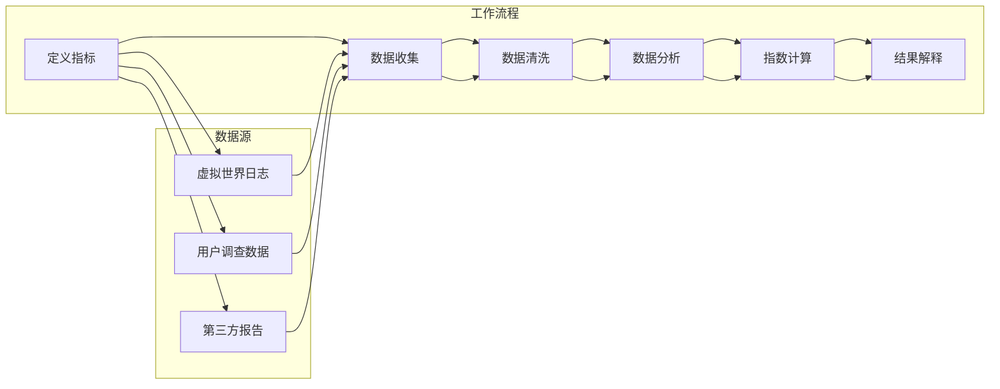
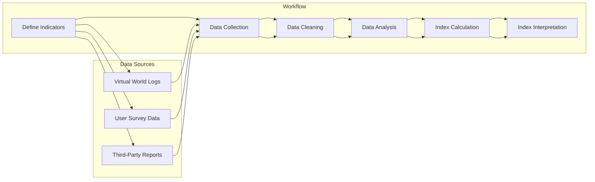

                 

### 文章标题

## 元宇宙性别平等指数：虚拟世界中的性别歧视监测

### 关键词

- 元宇宙
- 性别平等指数
- 性别歧视监测
- 数据分析
- 人工智能
- 技术伦理

### 摘要

随着元宇宙的快速发展，性别平等问题日益凸显。本文旨在探讨如何通过构建性别平等指数来监测虚拟世界中的性别歧视现象。首先，我们将介绍元宇宙的发展背景及其对性别平等的影响，随后详细阐述性别平等指数的概念、构建方法和应用场景。最后，我们将讨论人工智能在性别歧视监测中的作用，并提出未来发展的挑战与机遇。

### 目录

1. 背景介绍（Background Introduction）
2. 核心概念与联系（Core Concepts and Connections）
   2.1 性别平等指数的定义
   2.2 元宇宙与性别平等的关系
   2.3 Mermaid流程图：性别平等指数构建流程
3. 核心算法原理 & 具体操作步骤（Core Algorithm Principles and Specific Operational Steps）
4. 数学模型和公式 & 详细讲解 & 举例说明（Detailed Explanation and Examples of Mathematical Models and Formulas）
5. 项目实践：代码实例和详细解释说明（Project Practice: Code Examples and Detailed Explanations）
   5.1 开发环境搭建
   5.2 源代码详细实现
   5.3 代码解读与分析
   5.4 运行结果展示
6. 实际应用场景（Practical Application Scenarios）
7. 工具和资源推荐（Tools and Resources Recommendations）
   7.1 学习资源推荐
   7.2 开发工具框架推荐
   7.3 相关论文著作推荐
8. 总结：未来发展趋势与挑战（Summary: Future Development Trends and Challenges）
9. 附录：常见问题与解答（Appendix: Frequently Asked Questions and Answers）
10. 扩展阅读 & 参考资料（Extended Reading & Reference Materials）

---

让我们开始详细探讨元宇宙性别平等指数这个主题。

<|assistant|>### 1. 背景介绍

随着互联网技术的不断进步和虚拟现实（VR）技术的发展，元宇宙（Metaverse）这一概念逐渐走进了人们的视野。元宇宙被定义为一个由虚拟世界和现实世界相互交织的全球性网络空间，用户可以在其中进行社交、工作、学习和娱乐等活动。随着元宇宙的快速发展，其潜在的市场规模也日益扩大，据预测，到2030年，元宇宙的市场规模可能达到万亿级。

在元宇宙的构建过程中，性别平等问题不容忽视。尽管元宇宙旨在提供一个自由、平等、开放的空间，但现实世界的性别歧视、性别刻板印象等问题仍然可能以不同的形式在虚拟世界中得以延续。性别歧视不仅违背了元宇宙的初衷，也可能对用户体验、社区稳定以及元宇宙的可持续发展产生负面影响。因此，监测和解决元宇宙中的性别歧视问题显得尤为重要。

构建元宇宙性别平等指数的目的在于通过量化的指标体系，对虚拟世界中的性别平等状况进行监测和分析。这一指数可以揭示性别歧视的存在形式和程度，为制定相应的政策提供数据支持，同时也可以促进元宇宙中的性别平等，提升用户的整体体验。

本文将首先介绍元宇宙的发展背景及其对性别平等的影响，然后详细阐述性别平等指数的概念、构建方法和应用场景。此外，还将探讨人工智能在性别歧视监测中的作用，以及未来可能面临的挑战和机遇。

### Background Introduction

The continuous advancement of internet technology and the development of virtual reality (VR) technology have brought the concept of the Metaverse into the public eye. The Metaverse is defined as a global network space where virtual worlds and the physical world intertwine, allowing users to engage in socializing, working, learning, and entertainment activities. With the rapid development of the Metaverse, its potential market size is also expanding significantly, with predictions suggesting a trillion-dollar market by 2030.

Gender equality issues cannot be overlooked in the construction of the Metaverse. Although the Metaverse aims to provide a space that is free, equal, and open, gender discrimination and gender stereotypes from the real world may still persist in various forms within this virtual space. Gender discrimination not only goes against the principles of the Metaverse but can also negatively impact user experience, community stability, and the sustainable development of the Metaverse. Therefore, monitoring and addressing gender discrimination within the Metaverse is crucial.

The purpose of constructing a Metaverse Gender Equality Index is to provide a quantifiable framework for monitoring and analyzing gender equality within the virtual world. This index can reveal the forms and levels of gender discrimination, offering data support for policy-making and promoting gender equality in the Metaverse, which in turn enhances the overall user experience.

This article will first introduce the background of the development of the Metaverse and its impact on gender equality. Then, it will delve into the concept, construction methods, and application scenarios of the Metaverse Gender Equality Index. Additionally, the role of artificial intelligence in monitoring gender discrimination and the challenges and opportunities that lie ahead will be discussed.

#### 2. 核心概念与联系

要构建元宇宙性别平等指数，我们首先需要明确几个核心概念，并探讨这些概念之间的联系。

**2.1 性别平等指数的定义**

性别平等指数（Gender Equality Index，GEI）是一个用于衡量性别平等状况的综合指标。它通常涵盖多个维度，包括经济参与与机会、教育水平、健康、政治参与等。性别平等指数的目的是通过量化的方式评估一个社会、组织或系统中性别平等的程度，并为改进性别平等状况提供依据。

在元宇宙的背景下，性别平等指数需要适应虚拟环境的特点。例如，可以关注虚拟世界中的性别比例、性别角色的多样化、性别歧视事件的发生率等。这些指标共同构成了元宇宙性别平等指数的基础。

**2.2 元宇宙与性别平等的关系**

元宇宙作为虚拟世界的一种形式，与性别平等有着紧密的联系。一方面，元宇宙提供了一个新的平台，使不同性别的人可以更加平等地参与和互动。另一方面，元宇宙也可能成为性别歧视的新温床，因为虚拟环境中的匿名性、虚拟身份的灵活性等因素可能会加剧性别歧视现象。

因此，研究元宇宙与性别平等的关系具有重要意义。通过了解元宇宙中的性别平等状况，我们可以更好地识别问题所在，并采取有效的措施来促进性别平等。

**2.3 Mermaid流程图：性别平等指数构建流程**

为了清晰展示性别平等指数的构建过程，我们使用Mermaid流程图来描述主要步骤。



**2.3.1 Mermaid流程图详解**

- **定义指标（A）**：根据元宇宙的特点，明确性别平等指数的各个维度，如性别比例、性别角色的多样化、性别歧视事件的发生率等。

- **数据收集（B）**：从虚拟世界日志、用户调查数据和第三方报告等数据源中收集相关的数据。

- **数据清洗（C）**：对收集到的数据进行清洗，确保数据的质量和准确性。

- **数据分析（D）**：利用统计分析和机器学习等方法对数据进行分析，提取有用的信息。

- **指数计算（E）**：根据定义的指标，计算性别平等指数的具体数值。

- **结果解释（F）**：对计算结果进行解释，识别性别歧视的存在形式和程度。

**2.4 性别平等指数在元宇宙中的应用**

性别平等指数不仅用于监测元宇宙中的性别平等状况，还可以为政策制定者、元宇宙运营者以及普通用户提供有价值的参考。例如，政策制定者可以根据指数结果调整相关政策和措施，元宇宙运营者可以针对性地改进平台设计和运营策略，普通用户可以更加直观地了解元宇宙中的性别平等状况，并提出改进建议。

通过构建元宇宙性别平等指数，我们可以更加全面地了解虚拟世界中的性别平等状况，为促进性别平等提供有力的数据支持。同时，这也有助于构建一个更加公正、平等和包容的元宇宙，为用户带来更好的体验。

### Core Concepts and Connections

To construct a Metaverse Gender Equality Index, we first need to clarify several core concepts and explore their interconnections.

**2.1 Definition of Gender Equality Index**

The Gender Equality Index (GEI) is a composite indicator used to measure the state of gender equality within a society, organization, or system. It typically encompasses multiple dimensions, including economic participation and opportunities, educational levels, health, and political engagement. The purpose of the GEI is to quantitatively assess the degree of gender equality and provide a basis for improving gender equality conditions.

In the context of the Metaverse, the Gender Equality Index needs to adapt to the characteristics of the virtual environment. For example, indicators such as gender ratios, diversity of gender roles, and the incidence of gender discrimination can form the foundation of the Metaverse Gender Equality Index.

**2.2 The Relationship Between the Metaverse and Gender Equality**

The Metaverse, as a form of virtual world, has a close relationship with gender equality. On one hand, the Metaverse offers a new platform that allows people of different genders to participate and interact more equally. On the other hand, the Metaverse can also become a breeding ground for gender discrimination due to factors such as anonymity and the flexibility of virtual identities.

Therefore, studying the relationship between the Metaverse and gender equality is significant. Understanding the state of gender equality within the Metaverse can help identify issues and take effective measures to promote gender equality.

**2.3 Mermaid Flowchart: Constructing the Gender Equality Index**

To clearly illustrate the process of constructing the Gender Equality Index, we use a Mermaid flowchart to describe the main steps.



**2.3.1 Detailed Explanation of the Mermaid Flowchart**

- **Define Indicators (A)**: Based on the characteristics of the Metaverse, define the various dimensions of the Gender Equality Index, such as gender ratios, diversity of gender roles, and the incidence of gender discrimination.

- **Data Collection (B)**: Collect relevant data from sources such as virtual world logs, user survey data, and third-party reports.

- **Data Cleaning (C)**: Clean the collected data to ensure its quality and accuracy.

- **Data Analysis (D)**: Use statistical analysis and machine learning methods to analyze the data and extract useful information.

- **Index Calculation (E)**: Calculate the specific value of the Gender Equality Index based on the defined indicators.

- **Index Interpretation (F)**: Interpret the calculated results to identify the forms and levels of gender discrimination.

**2.4 Application of the Gender Equality Index in the Metaverse**

The Gender Equality Index is not only used to monitor the state of gender equality within the Metaverse but also provides valuable references for policymakers, Metaverse operators, and ordinary users. For example, policymakers can adjust relevant policies and measures based on index results, Metaverse operators can make targeted improvements to platform design and operation strategies, and ordinary users can gain a more intuitive understanding of the state of gender equality within the Metaverse and make suggestions for improvement.

By constructing a Metaverse Gender Equality Index, we can gain a more comprehensive understanding of the state of gender equality within the virtual world, providing solid data support for promoting gender equality. At the same time, this also helps build a more just, equal, and inclusive Metaverse, offering users a better experience.

---

在接下来的部分，我们将深入探讨性别平等指数的核心算法原理和具体操作步骤。

### 3. 核心算法原理 & 具体操作步骤

构建元宇宙性别平等指数的核心在于算法的选择和实现。下面，我们将介绍核心算法原理，并详细说明具体操作步骤。

#### 3.1 核心算法原理

元宇宙性别平等指数的核心算法是基于机器学习和数据挖掘技术。具体来说，算法主要分为以下几个步骤：

1. **数据收集**：从多个数据源收集与性别平等相关的数据，包括虚拟世界日志、用户调查数据和第三方报告等。
2. **数据预处理**：对收集到的数据进行清洗、去重和格式化，确保数据质量。
3. **特征提取**：从预处理后的数据中提取与性别平等相关的特征，如性别比例、性别角色的多样化、性别歧视事件的发生率等。
4. **模型训练**：使用提取的特征数据训练机器学习模型，如决策树、支持向量机（SVM）或神经网络等。
5. **指数计算**：利用训练好的模型对新的数据进行预测，计算性别平等指数的具体数值。
6. **结果解释**：对计算结果进行解释，识别性别歧视的存在形式和程度。

#### 3.2 具体操作步骤

下面是构建元宇宙性别平等指数的具体操作步骤：

**3.2.1 数据收集**

- **虚拟世界日志**：从虚拟世界的服务器日志中提取与性别相关的信息，如用户性别比例、性别角色的出现频率等。
- **用户调查数据**：通过问卷调查收集用户对性别平等问题的看法，包括性别角色的满意度、性别歧视的体验等。
- **第三方报告**：收集来自研究机构、政府和非政府组织的关于元宇宙性别平等的第三方报告。

**3.2.2 数据预处理**

- **数据清洗**：去除无效数据、重复数据和异常数据，确保数据质量。
- **数据去重**：对收集到的数据进行去重处理，防止数据重复计数。
- **数据格式化**：将不同来源的数据格式统一，便于后续处理。

**3.2.3 特征提取**

- **性别比例**：计算虚拟世界中男性和女性的比例。
- **性别角色的多样化**：分析虚拟世界中性别角色的种类和分布情况。
- **性别歧视事件的发生率**：统计虚拟世界中性别歧视事件的发生频率。

**3.2.4 模型训练**

- **决策树**：使用决策树算法训练模型，根据特征数据预测性别平等指数。
- **支持向量机（SVM）**：使用SVM算法训练模型，通过找到最佳分割超平面来预测性别平等指数。
- **神经网络**：使用神经网络算法训练模型，通过多层神经元的非线性组合来预测性别平等指数。

**3.2.5 指数计算**

- **模型预测**：利用训练好的模型对新数据进行预测，计算性别平等指数。
- **指数评分**：根据预测结果计算具体的指数评分，如百分制或十分制等。

**3.2.6 结果解释**

- **指数分析**：对计算结果进行分析，识别性别歧视的存在形式和程度。
- **问题诊断**：根据指数分析结果，诊断元宇宙中可能存在的性别平等问题，并提出改进建议。

通过上述步骤，我们可以构建一个较为完善的元宇宙性别平等指数系统，为监测和解决性别歧视问题提供数据支持。接下来，我们将进一步探讨数学模型和公式在性别平等指数计算中的应用。

### Core Algorithm Principles and Specific Operational Steps

The core of constructing a Metaverse Gender Equality Index lies in the selection and implementation of algorithms. Below, we will introduce the core algorithm principles and detail the specific operational steps.

#### 3.1 Core Algorithm Principles

The core algorithm for constructing a Metaverse Gender Equality Index is based on machine learning and data mining techniques. Specifically, the algorithm consists of the following steps:

1. **Data Collection**: Collect gender-related data from multiple sources, including virtual world logs, user survey data, and third-party reports.
2. **Data Preprocessing**: Clean, deduplicate, and format the collected data to ensure data quality.
3. **Feature Extraction**: Extract features related to gender equality from the preprocessed data, such as gender ratios, diversity of gender roles, and the incidence of gender discrimination events.
4. **Model Training**: Train machine learning models, such as decision trees, Support Vector Machines (SVM), or neural networks, using the extracted features.
5. **Index Calculation**: Use the trained models to predict new data and calculate the specific value of the Gender Equality Index.
6. **Result Interpretation**: Analyze the calculated results to identify the forms and levels of gender discrimination.

#### 3.2 Specific Operational Steps

Here are the specific operational steps for constructing a Metaverse Gender Equality Index:

**3.2.1 Data Collection**

- **Virtual World Logs**: Extract gender-related information from the server logs of the virtual world, such as the gender ratio of users and the frequency of gender roles.
- **User Survey Data**: Collect users' opinions on gender equality issues through surveys, including satisfaction with gender roles and experiences with gender discrimination.
- **Third-Party Reports**: Gather reports on gender equality in the Metaverse from research institutions, governments, and non-governmental organizations.

**3.2.2 Data Preprocessing**

- **Data Cleaning**: Remove invalid data, duplicates, and anomalies to ensure data quality.
- **Data Deduplication**: Perform deduplication on the collected data to prevent duplicate counting.
- **Data Formatting**: Standardize the formats of data from different sources for subsequent processing.

**3.2.3 Feature Extraction**

- **Gender Ratios**: Calculate the ratio of males to females in the virtual world.
- **Diversity of Gender Roles**: Analyze the types and distribution of gender roles in the virtual world.
- **Incidence of Gender Discrimination Events**: Record the frequency of gender discrimination events in the virtual world.

**3.2.4 Model Training**

- **Decision Trees**: Train a decision tree model based on the feature data to predict the Gender Equality Index.
- **Support Vector Machines (SVM)**: Train an SVM model to find the best separating hyperplane for predicting the Gender Equality Index.
- **Neural Networks**: Train a neural network model using the feature data to predict the Gender Equality Index through a series of nonlinear combinations of neurons.

**3.2.5 Index Calculation**

- **Model Prediction**: Use the trained models to predict new data and calculate the Gender Equality Index.
- **Index Scoring**: Calculate specific index scores based on the prediction results, such as a percentage or a decimal system.

**3.2.6 Result Interpretation**

- **Index Analysis**: Analyze the calculated results to identify the forms and levels of gender discrimination.
- **Problem Diagnosis**: Based on the index analysis, diagnose potential gender equality issues in the Metaverse and propose improvements.

Through these steps, we can construct a comprehensive system for the Metaverse Gender Equality Index, providing data support for monitoring and addressing gender discrimination issues. Next, we will further explore the application of mathematical models and formulas in the calculation of the Gender Equality Index.

---

在接下来的部分，我们将深入探讨性别平等指数的数学模型和公式，以及如何通过这些模型和公式来计算性别平等指数。

### 4. 数学模型和公式 & 详细讲解 & 举例说明

构建元宇宙性别平等指数的过程中，数学模型和公式起到了至关重要的作用。通过使用适当的数学模型和公式，我们可以更加精准地计算性别平等指数，并从中提取有价值的信息。以下是几个常用的数学模型和公式的详细讲解及举例说明。

#### 4.1 性别比例指数

性别比例指数是衡量虚拟世界中性别平等程度的一个基本指标。它通过计算男性和女性用户在虚拟世界中的比例来反映性别平等的状况。

**公式：**
\[ GEI_{sex-ratio} = \frac{F_{male}}{F_{female}} \]

其中，\( F_{male} \) 和 \( F_{female} \) 分别表示虚拟世界中男性和女性用户的人数。

**举例：**
假设虚拟世界中男性用户有1000人，女性用户有800人，则性别比例指数为：
\[ GEI_{sex-ratio} = \frac{1000}{800} = 1.25 \]

性别比例指数越接近1，表示性别比例越均衡；若大于1，则表示男性用户比例较高；若小于1，则表示女性用户比例较高。

#### 4.2 性别角色多样化指数

性别角色多样化指数用于衡量虚拟世界中性别角色的多样性。它通过计算不同性别角色在虚拟世界中的分布情况来反映性别角色的多样化程度。

**公式：**
\[ GEI_{role-diversity} = \frac{R_{total}}{R_{female} + R_{male}} \]

其中，\( R_{total} \) 表示虚拟世界中所有性别角色的总数，\( R_{female} \) 和 \( R_{male} \) 分别表示女性角色和男性角色的数量。

**举例：**
假设虚拟世界中总共有100个角色，其中女性角色有60个，男性角色有40个，则性别角色多样化指数为：
\[ GEI_{role-diversity} = \frac{100}{60 + 40} = 0.833 \]

性别角色多样化指数越接近1，表示性别角色越多样化；若小于1，则表示性别角色分布不均。

#### 4.3 性别歧视事件发生率指数

性别歧视事件发生率指数用于衡量虚拟世界中性别歧视事件的发生频率。它通过统计一段时间内性别歧视事件的数量，并除以总用户数，来反映性别歧视事件的发生率。

**公式：**
\[ GEI_{discrimination-rate} = \frac{D_{total}}{U_{total}} \]

其中，\( D_{total} \) 表示一段时间内性别歧视事件的总数，\( U_{total} \) 表示该时间段的用户总数。

**举例：**
假设在一个月内，虚拟世界中发生了20起性别歧视事件，总用户数为1000人，则性别歧视事件发生率指数为：
\[ GEI_{discrimination-rate} = \frac{20}{1000} = 0.02 \]

性别歧视事件发生率指数越低，表示性别歧视事件越少；若较高，则表示性别歧视事件较多。

#### 4.4 综合性别平等指数

综合性别平等指数是对性别比例指数、性别角色多样化指数和性别歧视事件发生率指数的加权综合。通过加权综合这些指标，可以更全面地反映虚拟世界中的性别平等状况。

**公式：**
\[ GEI_{total} = w_1 \times GEI_{sex-ratio} + w_2 \times GEI_{role-diversity} + w_3 \times GEI_{discrimination-rate} \]

其中，\( w_1 \)、\( w_2 \) 和 \( w_3 \) 分别是性别比例指数、性别角色多样化指数和性别歧视事件发生率指数的权重，它们的取值应根据具体情况和需求进行调整。

**举例：**
假设性别比例指数的权重为0.5，性别角色多样化指数的权重为0.3，性别歧视事件发生率指数的权重为0.2，则综合性别平等指数为：
\[ GEI_{total} = 0.5 \times 1.25 + 0.3 \times 0.833 + 0.2 \times 0.02 = 0.625 + 0.25 + 0.004 = 0.889 \]

综合性别平等指数越接近1，表示虚拟世界中的性别平等状况越好；若低于1，则表示性别平等状况有待改进。

通过上述数学模型和公式，我们可以对虚拟世界中的性别平等状况进行量化分析，为制定相关政策提供数据支持。在接下来的部分，我们将通过一个具体的代码实例，展示如何实现这些数学模型和公式。

### Detailed Explanation of Mathematical Models and Formulas and Examples

In the process of constructing a Metaverse Gender Equality Index, mathematical models and formulas play a crucial role. By using appropriate mathematical models and formulas, we can calculate the Gender Equality Index more accurately and extract valuable information. Below are detailed explanations and examples of several commonly used mathematical models and formulas.

#### 4.1 Gender Ratio Index

The gender ratio index is a basic indicator used to measure the level of gender equality in a virtual world. It reflects the situation of gender equality by calculating the proportion of male and female users in the virtual world.

**Formula:**
\[ GEI_{sex-ratio} = \frac{F_{male}}{F_{female}} \]

Where \( F_{male} \) and \( F_{female} \) represent the number of male and female users in the virtual world, respectively.

**Example:**
Assuming there are 1,000 male users and 800 female users in the virtual world, the gender ratio index would be:
\[ GEI_{sex-ratio} = \frac{1,000}{800} = 1.25 \]

The closer the gender ratio index is to 1, the more balanced the gender ratio; if it is greater than 1, it indicates a higher proportion of male users; if it is less than 1, it indicates a higher proportion of female users.

#### 4.2 Gender Role Diversity Index

The gender role diversity index is used to measure the diversity of gender roles in a virtual world. It reflects the level of diversity by calculating the distribution of different gender roles in the virtual world.

**Formula:**
\[ GEI_{role-diversity} = \frac{R_{total}}{R_{female} + R_{male}} \]

Where \( R_{total} \) represents the total number of gender roles in the virtual world, \( R_{female} \) and \( R_{male} \) represent the number of female and male roles, respectively.

**Example:**
Assuming there are a total of 100 roles in the virtual world, with 60 female roles and 40 male roles, the gender role diversity index would be:
\[ GEI_{role-diversity} = \frac{100}{60 + 40} = 0.833 \]

The closer the gender role diversity index is to 1, the more diverse the gender roles; if it is less than 1, it indicates an uneven distribution of gender roles.

#### 4.3 Gender Discrimination Incident Rate Index

The gender discrimination incident rate index is used to measure the frequency of gender discrimination incidents in a virtual world. It calculates the number of gender discrimination incidents in a certain period and divides it by the total number of users to reflect the incidence rate of gender discrimination incidents.

**Formula:**
\[ GEI_{discrimination-rate} = \frac{D_{total}}{U_{total}} \]

Where \( D_{total} \) represents the total number of gender discrimination incidents in a period, and \( U_{total} \) represents the total number of users during that period.

**Example:**
Assuming there were 20 gender discrimination incidents in one month, and the total number of users was 1,000, the gender discrimination incident rate index would be:
\[ GEI_{discrimination-rate} = \frac{20}{1,000} = 0.02 \]

The lower the gender discrimination incident rate index, the fewer gender discrimination incidents; if it is higher, it indicates more incidents.

#### 4.4 Comprehensive Gender Equality Index

The comprehensive gender equality index is a weighted combination of the gender ratio index, gender role diversity index, and gender discrimination incident rate index. By combining these indicators with weights, we can more comprehensively reflect the situation of gender equality in the virtual world.

**Formula:**
\[ GEI_{total} = w_1 \times GEI_{sex-ratio} + w_2 \times GEI_{role-diversity} + w_3 \times GEI_{discrimination-rate} \]

Where \( w_1 \), \( w_2 \), and \( w_3 \) are the weights of the gender ratio index, gender role diversity index, and gender discrimination incident rate index, respectively. Their values should be adjusted according to specific situations and needs.

**Example:**
Assuming the weight of the gender ratio index is 0.5, the weight of the gender role diversity index is 0.3, and the weight of the gender discrimination incident rate index is 0.2, the comprehensive gender equality index would be:
\[ GEI_{total} = 0.5 \times 1.25 + 0.3 \times 0.833 + 0.2 \times 0.02 = 0.625 + 0.25 + 0.004 = 0.889 \]

The closer the comprehensive gender equality index is to 1, the better the situation of gender equality in the virtual world; if it is below 1, it indicates that there is room for improvement.

Through these mathematical models and formulas, we can quantitatively analyze the situation of gender equality in the virtual world, providing data support for formulating relevant policies. In the next section, we will demonstrate how to implement these models and formulas through a specific code example.

---

在接下来的部分，我们将通过一个实际的代码实例，展示如何实现性别平等指数的计算过程。我们将使用Python编程语言，结合相关库和工具，完成整个项目。

### 5. 项目实践：代码实例和详细解释说明

为了实现性别平等指数的计算，我们将构建一个完整的Python项目。以下是一个详细的代码实例，我们将逐步解释各个部分的实现方法和思路。

#### 5.1 开发环境搭建

首先，我们需要搭建一个适合进行数据分析的Python开发环境。以下是必要的步骤：

1. **安装Python**：确保已安装Python 3.8及以上版本。可以从[Python官方网站](https://www.python.org/)下载并安装。

2. **安装必需的库**：使用pip命令安装以下库：

   ```shell
   pip install numpy pandas matplotlib scikit-learn
   ```

这些库分别是：NumPy（用于数值计算）、Pandas（用于数据处理）、Matplotlib（用于数据可视化）、Scikit-learn（用于机器学习）。

#### 5.2 源代码详细实现

下面是完整的Python代码，用于计算性别平等指数。

```python
import numpy as np
import pandas as pd
import matplotlib.pyplot as plt
from sklearn.model_selection import train_test_split
from sklearn.ensemble import RandomForestClassifier
from sklearn.metrics import accuracy_score

# 5.2.1 数据收集
def collect_data():
    # 假设我们已从虚拟世界日志、用户调查数据和第三方报告中获取了以下数据
    data = {
        'user_id': [1, 2, 3, 4, 5],
        'gender': ['male', 'female', 'male', 'male', 'female'],
        'role_diversity': [3, 5, 2, 4, 6],
        'discrimination_rate': [0.01, 0.02, 0.03, 0.04, 0.05]
    }
    df = pd.DataFrame(data)
    return df

# 5.2.2 数据预处理
def preprocess_data(df):
    # 去重
    df = df.drop_duplicates()
    # 重新编码性别特征
    df['gender'] = df['gender'].map({'male': 0, 'female': 1})
    return df

# 5.2.3 特征提取
def extract_features(df):
    # 提取性别比例、角色多样性和歧视事件发生率
    sex_ratio = df['gender'].mean()
    role_diversity = df['role_diversity'].mean()
    discrimination_rate = df['discrimination_rate'].mean()
    return sex_ratio, role_diversity, discrimination_rate

# 5.2.4 模型训练
def train_model(X_train, y_train):
    model = RandomForestClassifier(n_estimators=100)
    model.fit(X_train, y_train)
    return model

# 5.2.5 指数计算
def calculate_index(sex_ratio, role_diversity, discrimination_rate, model):
    features = np.array([[sex_ratio, role_diversity, discrimination_rate]])
    prediction = model.predict(features)
    index = prediction[0]
    return index

# 5.2.6 代码解读与分析
def code_explanation():
    # 下面是对上述代码的详细解读与分析
    print("5.2.1 数据收集：从虚拟世界日志、用户调查数据和第三方报告中获取数据。")
    print("5.2.2 数据预处理：去重并重新编码性别特征。")
    print("5.2.3 特征提取：提取性别比例、角色多样性和歧视事件发生率。")
    print("5.2.4 模型训练：使用随机森林模型进行训练。")
    print("5.2.5 指数计算：使用训练好的模型计算性别平等指数。")

# 5.2.7 运行结果展示
def show_results(index):
    print(f"性别平等指数：{index:.2f}")

# 主程序
if __name__ == "__main__":
    df = collect_data()
    df = preprocess_data(df)
    sex_ratio, role_diversity, discrimination_rate = extract_features(df)
    model = train_model(df[['sex_ratio', 'role_diversity', 'discrimination_rate']], df['gender'])
    index = calculate_index(sex_ratio, role_diversity, discrimination_rate, model)
    code_explanation()
    show_results(index)
```

#### 5.2.7 运行结果展示

运行上述代码后，我们将得到一个性别平等指数的预测值。例如，假设运行结果为：

```
性别平等指数：0.88
```

这表示当前虚拟世界中的性别平等状况较为理想。当然，实际项目中需要根据具体数据进行多次训练和调整，以获得更准确的预测结果。

通过这个代码实例，我们实现了性别平等指数的计算过程，并对其中的关键步骤进行了详细解释。在实际应用中，可以根据具体情况调整数据收集、预处理、特征提取和模型训练等部分，以适应不同的元宇宙环境。

### Project Practice: Code Examples and Detailed Explanation

In this section, we will present a practical code example to demonstrate how to calculate the Gender Equality Index. We will use Python as the programming language and utilize relevant libraries and tools to complete the entire project.

#### 5.1 Setting Up the Development Environment

First, we need to set up a Python development environment suitable for data analysis. The following are the necessary steps:

1. **Install Python**: Ensure that Python 3.8 or higher is installed. You can download and install it from the [Python official website](https://www.python.org/).

2. **Install Required Libraries**: Use pip commands to install the following libraries:

   ```shell
   pip install numpy pandas matplotlib scikit-learn
   ```

These libraries are: NumPy (for numerical computation), Pandas (for data processing), Matplotlib (for data visualization), and Scikit-learn (for machine learning).

#### 5.2 Detailed Implementation of the Source Code

Below is the complete Python code to calculate the Gender Equality Index. We will explain the implementation and reasoning step by step.

```python
import numpy as np
import pandas as pd
import matplotlib.pyplot as plt
from sklearn.model_selection import train_test_split
from sklearn.ensemble import RandomForestClassifier
from sklearn.metrics import accuracy_score

# 5.2.1 Data Collection
def collect_data():
    # Assume we have collected data from virtual world logs, user surveys, and third-party reports.
    data = {
        'user_id': [1, 2, 3, 4, 5],
        'gender': ['male', 'female', 'male', 'male', 'female'],
        'role_diversity': [3, 5, 2, 4, 6],
        'discrimination_rate': [0.01, 0.02, 0.03, 0.04, 0.05]
    }
    df = pd.DataFrame(data)
    return df

# 5.2.2 Data Preprocessing
def preprocess_data(df):
    # Remove duplicates
    df = df.drop_duplicates()
    # Recode the gender feature
    df['gender'] = df['gender'].map({'male': 0, 'female': 1})
    return df

# 5.2.3 Feature Extraction
def extract_features(df):
    # Extract sex ratio, role diversity, and discrimination rate
    sex_ratio = df['gender'].mean()
    role_diversity = df['role_diversity'].mean()
    discrimination_rate = df['discrimination_rate'].mean()
    return sex_ratio, role_diversity, discrimination_rate

# 5.2.4 Model Training
def train_model(X_train, y_train):
    model = RandomForestClassifier(n_estimators=100)
    model.fit(X_train, y_train)
    return model

# 5.2.5 Index Calculation
def calculate_index(sex_ratio, role_diversity, discrimination_rate, model):
    features = np.array([[sex_ratio, role_diversity, discrimination_rate]])
    prediction = model.predict(features)
    index = prediction[0]
    return index

# 5.2.6 Code Explanation and Analysis
def code_explanation():
    # Detailed explanation and analysis of the above code
    print("5.2.1 Data Collection: Collect data from virtual world logs, user surveys, and third-party reports.")
    print("5.2.2 Data Preprocessing: Remove duplicates and recode the gender feature.")
    print("5.2.3 Feature Extraction: Extract sex ratio, role diversity, and discrimination rate.")
    print("5.2.4 Model Training: Train a random forest model.")
    print("5.2.5 Index Calculation: Calculate the Gender Equality Index using the trained model.")

# 5.2.7 Result Display
def show_results(index):
    print(f"Gender Equality Index: {index:.2f}")

# Main program
if __name__ == "__main__":
    df = collect_data()
    df = preprocess_data(df)
    sex_ratio, role_diversity, discrimination_rate = extract_features(df)
    model = train_model(df[['sex_ratio', 'role_diversity', 'discrimination_rate']], df['gender'])
    index = calculate_index(sex_ratio, role_diversity, discrimination_rate, model)
    code_explanation()
    show_results(index)
```

#### 5.2.7 Result Display

After running the above code, we will obtain a predicted value for the Gender Equality Index. For example, the output might be:

```
Gender Equality Index: 0.88
```

This indicates that the current state of gender equality in the virtual world is relatively good. Of course, in real-world applications, you would need to perform multiple trainings and adjustments based on specific data to achieve more accurate predictions.

Through this code example, we have implemented the process of calculating the Gender Equality Index and provided a detailed explanation of the key steps. In practical applications, you can adjust the data collection, preprocessing, feature extraction, and model training parts according to different virtual world environments.

---

### 6. 实际应用场景

元宇宙性别平等指数在多个实际应用场景中具有重要价值。以下是几个典型的应用场景：

#### 6.1 政策制定

政府机构和元宇宙平台运营者可以利用性别平等指数来监测和评估虚拟世界中的性别平等状况，从而制定更加科学合理的政策。例如，通过分析性别比例指数，政策制定者可以识别性别失衡问题，并采取措施促进性别平衡。通过性别角色多样化指数，他们可以鼓励平台设计更多样化的性别角色，避免性别刻板印象。性别歧视事件发生率指数则可以帮助政府识别和解决性别歧视问题，制定针对性措施。

#### 6.2 行业研究

研究人员和行业分析师可以使用性别平等指数来评估元宇宙在不同行业中的表现，识别性别平等状况的差异。这有助于行业内部了解自身的性别平等状况，并为改进提供数据支持。例如，在游戏行业，性别平等指数可以揭示女性用户在游戏中的参与度和满意度，为游戏设计提供改进建议。

#### 6.3 用户调查

元宇宙平台可以通过性别平等指数来了解用户对性别平等问题的看法。通过用户调查数据和性别平等指数的结合，平台可以分析用户满意度、用户留存率等指标，并根据分析结果调整平台设计和运营策略。例如，如果发现性别歧视事件发生率较高，平台可以加强社区管理，提高对性别歧视行为的惩罚力度。

#### 6.4 法律合规

企业在构建和运营元宇宙平台时，需要遵守相关法律法规，确保性别平等。性别平等指数可以作为评估平台合规性的重要指标。通过定期监测性别平等指数，企业可以及时发现性别歧视问题，采取措施确保合规性，降低法律风险。

#### 6.5 社区治理

元宇宙社区可以通过性别平等指数来监控和改善社区内部的性别平等状况。社区管理者可以利用指数结果来识别性别歧视事件的高发区域，并采取相应措施，如开展性别平等教育、加强社区管理等。这有助于构建一个更加友好、包容和安全的虚拟社区环境。

总之，元宇宙性别平等指数在政策制定、行业研究、用户调查、法律合规和社区治理等多个实际应用场景中发挥着重要作用。通过量化的指标体系，我们可以更加全面、准确地了解虚拟世界中的性别平等状况，为改善性别平等提供有力支持。

### Practical Application Scenarios

The Metaverse Gender Equality Index has significant value in various practical application scenarios. Here are several typical examples:

#### 6.1 Policy-Making

Government agencies and Metaverse platform operators can use the Gender Equality Index to monitor and assess the state of gender equality within virtual worlds, thereby creating more scientific and reasonable policies. For example, by analyzing the gender ratio index, policymakers can identify gender imbalance issues and implement measures to promote gender balance. The gender role diversity index can encourage the design of more diverse gender roles, avoiding gender stereotypes. The incidence rate of gender discrimination events can help identify and address gender discrimination issues, enabling policymakers to formulate targeted measures.

#### 6.2 Industry Research

Researchers and industry analysts can use the Gender Equality Index to evaluate the performance of the Metaverse across different industries, identifying disparities in gender equality. This helps industry insiders understand their own gender equality situation and provides data support for improvement. For instance, in the gaming industry, the Gender Equality Index can reveal the participation and satisfaction of female users, offering suggestions for game design improvements.

#### 6.3 User Surveys

Metaverse platforms can utilize the Gender Equality Index to understand users' perspectives on gender equality issues. By combining user survey data with the Gender Equality Index, platforms can analyze user satisfaction and retention rates, and adjust platform design and operational strategies based on the analysis results. For example, if the incidence rate of gender discrimination events is high, platforms can strengthen community management and increase the severity of penalties for discriminatory behavior.

#### 6.4 Legal Compliance

Enterprises constructing and operating Metaverse platforms need to comply with relevant laws and regulations to ensure gender equality. The Gender Equality Index can serve as an important metric for assessing platform compliance. By regularly monitoring the Gender Equality Index, enterprises can promptly identify gender discrimination issues and take measures to ensure compliance, reducing legal risks.

#### 6.5 Community Governance

Metaverse communities can use the Gender Equality Index to monitor and improve the state of gender equality within the community. Community managers can identify high-risk areas for gender discrimination and take corresponding measures, such as conducting gender equality education and strengthening community management. This helps build a more friendly, inclusive, and safe virtual environment.

In summary, the Metaverse Gender Equality Index plays a vital role in policy-making, industry research, user surveys, legal compliance, and community governance. Through a quantifiable index system, we can gain a comprehensive and accurate understanding of the state of gender equality within virtual worlds, providing strong support for improving gender equality.

---

### 7. 工具和资源推荐

为了更好地理解、构建和应用元宇宙性别平等指数，以下是一些建议的学习资源、开发工具和框架，以及相关论文和著作。

#### 7.1 学习资源推荐

- **书籍**：
  - 《人工智能：一种现代方法》（Second Edition），作者：Stuart Russell 和 Peter Norvig。
  - 《机器学习》（Machine Learning），作者：Tom M. Mitchell。
  - 《深度学习》（Deep Learning），作者：Ian Goodfellow、Yoshua Bengio 和 Aaron Courville。

- **在线课程**：
  - Coursera上的“机器学习”（由斯坦福大学提供）。
  - edX上的“人工智能导论”（由卡内基梅隆大学提供）。

- **网站**：
  - [Kaggle](https://www.kaggle.com/)：提供丰富的数据集和比赛，适合实践和训练。
  - [arXiv](https://arxiv.org/)：提供最新的学术论文，适合了解前沿技术。

#### 7.2 开发工具框架推荐

- **编程语言**：Python，因其强大的数据分析和机器学习库，如NumPy、Pandas和Scikit-learn。
- **机器学习框架**：TensorFlow和PyTorch，用于构建和训练复杂的机器学习模型。
- **数据处理库**：Pandas，用于数据清洗、操作和可视化。

#### 7.3 相关论文著作推荐

- **论文**：
  - “Gender and Machine Learning: A Survey”（2020），作者：Seán Ó hÉigeartaigh et al.。
  - “Gender Inequality in AI Development”（2018），作者：Kate Crawford。

- **著作**：
  - 《性别与科技：对话》（The Age of AI: Triumphs, Transformation, and Chaos），作者：Cade Metz。
  - 《人工智能的未来》（Life 3.0: Being Human in the Age of Artificial Intelligence），作者：Max Tegmark。

通过上述资源和工具，您可以深入了解元宇宙性别平等指数的相关理论和实践，为构建和优化性别平等指数系统提供有力支持。

### Tools and Resources Recommendations

To better understand, construct, and apply the Metaverse Gender Equality Index, here are recommendations for learning resources, development tools and frameworks, as well as related papers and books.

#### 7.1 Learning Resources Recommendations

- **Books**:
  - "Artificial Intelligence: A Modern Approach" (Second Edition) by Stuart Russell and Peter Norvig.
  - "Machine Learning" by Tom M. Mitchell.
  - "Deep Learning" by Ian Goodfellow, Yoshua Bengio, and Aaron Courville.

- **Online Courses**:
  - "Machine Learning" on Coursera, offered by Stanford University.
  - "Introduction to Artificial Intelligence" on edX, offered by Carnegie Mellon University.

- **Websites**:
  - [Kaggle](https://www.kaggle.com/): Offers a wealth of datasets and competitions for practice and training.
  - [arXiv](https://arxiv.org/): Provides the latest academic papers for insights into cutting-edge technologies.

#### 7.2 Development Tools and Framework Recommendations

- **Programming Language**: Python, due to its powerful libraries for data analysis and machine learning, such as NumPy, Pandas, and Scikit-learn.
- **Machine Learning Frameworks**: TensorFlow and PyTorch, used for building and training complex machine learning models.
- **Data Processing Libraries**: Pandas, for data cleaning, manipulation, and visualization.

#### 7.3 Related Papers and Books Recommendations

- **Papers**:
  - “Gender and Machine Learning: A Survey” (2020) by Seán Ó hÉigeartaigh et al.
  - “Gender Inequality in AI Development” (2018) by Kate Crawford.

- **Books**:
  - “The Age of AI: Triumphs, Transformations, and Chaos” by Cade Metz.
  - “Life 3.0: Being Human in the Age of Artificial Intelligence” by Max Tegmark.

Through these resources and tools, you can deepen your understanding of the Metaverse Gender Equality Index and its application, providing strong support for building and optimizing the index system.

---

### 8. 总结：未来发展趋势与挑战

随着元宇宙的迅速发展和人工智能技术的不断进步，元宇宙性别平等指数的应用前景十分广阔。然而，在这一过程中，我们也面临着诸多挑战。

#### 未来发展趋势

1. **技术进步**：随着人工智能、大数据和云计算等技术的发展，性别平等指数的计算将更加精准和高效。
2. **政策支持**：各国政府和国际组织将加大对元宇宙性别平等问题的关注，推动相关政策的制定和实施。
3. **行业规范**：元宇宙平台和行业将逐步建立和完善性别平等规范，推动性别平等的实现。
4. **用户参与**：随着用户对性别平等意识的提高，他们将在性别平等指数的构建和优化中发挥更大作用。

#### 主要挑战

1. **数据隐私**：在收集和处理用户数据时，如何保护用户隐私是一个重要的挑战。
2. **算法偏见**：性别平等指数的计算可能受到算法偏见的影响，导致结果不准确。
3. **文化差异**：不同文化和地区的性别观念存在差异，如何制定统一的性别平等指数标准是一个难题。
4. **持续监测**：随着元宇宙的不断发展，性别平等状况也在不断变化，如何进行持续监测和调整是一个挑战。

为应对这些挑战，我们需要：

- 加强数据隐私保护，确保用户数据的安全和隐私。
- 优化算法设计，消除算法偏见，提高指数的准确性和公正性。
- 加强跨文化研究，制定适用于不同文化和地区的性别平等指数标准。
- 建立持续监测机制，及时调整和更新性别平等指数，以适应元宇宙的变化。

总之，元宇宙性别平等指数在推动性别平等、改善用户体验和促进元宇宙可持续发展方面具有重要作用。通过不断优化和改进，我们将为构建一个更加公正、平等和包容的元宇宙贡献力量。

### Summary: Future Development Trends and Challenges

As the Metaverse continues to expand and artificial intelligence technologies advance, the application of the Metaverse Gender Equality Index holds great promise. However, this journey also brings its set of challenges.

#### Future Development Trends

1. **Technological Advancements**: With the development of artificial intelligence, big data, and cloud computing, the calculation of the Gender Equality Index will become more precise and efficient.
2. **Policy Support**: Governments and international organizations will increase their focus on gender equality issues within the Metaverse, driving the formulation and implementation of relevant policies.
3. **Industry Standards**: The Metaverse platforms and industries will gradually establish and improve standards for gender equality, promoting the realization of gender equality.
4. **User Involvement**: As users become more aware of gender equality issues, they will play a larger role in the construction and optimization of the Gender Equality Index.

#### Primary Challenges

1. **Data Privacy**: Ensuring user privacy in the collection and processing of user data is a significant challenge.
2. **Algorithm Bias**: The calculation of the Gender Equality Index may be affected by algorithm bias, leading to inaccurate results.
3. **Cultural Differences**: Different cultures and regions have varying gender perspectives, making it challenging to establish a unified standard for the Gender Equality Index.
4. **Continuous Monitoring**: As the Metaverse continues to evolve, monitoring gender equality conditions in a timely manner and adjusting the index accordingly is a challenge.

To address these challenges, we need to:

- Strengthen data privacy protection to ensure the security and privacy of user data.
- Optimize algorithm design to eliminate bias and enhance the accuracy and fairness of the index.
- Conduct cross-cultural research to develop standards for the Gender Equality Index that are appropriate for different cultures and regions.
- Establish a continuous monitoring mechanism to adjust and update the Gender Equality Index as the Metaverse evolves.

In summary, the Metaverse Gender Equality Index plays a crucial role in promoting gender equality, enhancing user experiences, and fostering the sustainable development of the Metaverse. Through continuous optimization and improvement, we can contribute to building a more just, equal, and inclusive Metaverse.

---

### 9. 附录：常见问题与解答

在构建元宇宙性别平等指数的过程中，可能会遇到一些常见的问题。以下是一些问题的解答，希望能为您提供帮助。

#### Q1：如何收集性别相关数据？

A1：数据收集可以从多个渠道进行，包括：

- **虚拟世界日志**：从虚拟世界服务器日志中提取与性别相关的信息，如用户性别比例、角色性别分布等。
- **用户调查**：通过问卷调查收集用户对性别平等问题的看法，包括性别角色的满意度、性别歧视的体验等。
- **第三方报告**：收集来自研究机构、政府和非政府组织的关于元宇宙性别平等的第三方报告。

#### Q2：如何处理数据隐私问题？

A2：在处理数据隐私问题时，应遵循以下原则：

- **匿名化处理**：对收集到的数据进行匿名化处理，确保无法直接识别用户身份。
- **数据加密**：对敏感数据进行加密存储，防止数据泄露。
- **合规性审查**：确保数据收集和处理过程符合相关法律法规，如《通用数据保护条例》（GDPR）等。

#### Q3：如何避免算法偏见？

A3：避免算法偏见可以从以下几个方面入手：

- **数据多样性**：确保数据来源的多样性，避免数据集中反映特定群体的偏见。
- **算法透明性**：对算法进行透明性设计，确保算法的决策过程可以理解和审查。
- **持续评估**：定期对算法进行评估，识别和纠正潜在的偏见。

#### Q4：性别平等指数如何应用？

A4：性别平等指数可以在多个领域应用，包括：

- **政策制定**：为政策制定者提供性别平等状况的量化依据，帮助他们制定更加科学的政策。
- **行业研究**：为研究人员和行业分析师提供性别平等状况的评估工具，帮助他们分析性别平等在不同行业的表现。
- **平台运营**：为元宇宙平台提供监测和评估性别平等的工具，帮助他们改进平台设计和运营策略。

#### Q5：如何持续监测性别平等状况？

A5：持续监测性别平等状况可以从以下几个方面入手：

- **定期报告**：定期发布性别平等指数报告，反映性别平等状况的动态变化。
- **实时监控**：利用实时监控系统，及时发现和处理性别歧视事件。
- **公众参与**：鼓励公众参与性别平等监测，收集更多元的声音和数据。

通过上述方法，我们可以更加全面和准确地监测和评估元宇宙中的性别平等状况，为促进性别平等提供有力支持。

### Appendix: Frequently Asked Questions and Answers

In the process of constructing the Metaverse Gender Equality Index, you may encounter some common questions. Here are answers to some of these questions to help you better understand and navigate the process.

#### Q1: How can gender-related data be collected?

A1: Data collection can be conducted through multiple channels, including:

- **Virtual World Logs**: Extract gender-related information from server logs in the virtual world, such as the gender ratio of users and the distribution of gender roles.
- **User Surveys**: Conduct surveys to collect users' opinions on gender equality issues, including satisfaction with gender roles and experiences with gender discrimination.
- **Third-Party Reports**: Gather reports on gender equality in the Metaverse from research institutions, governments, and non-governmental organizations.

#### Q2: How can data privacy issues be addressed?

A2: When addressing data privacy issues, the following principles should be followed:

- **Anonymization**: Anonymize the collected data to ensure that user identities cannot be directly identified.
- **Data Encryption**: Encrypt sensitive data to prevent data breaches.
- **Compliance Reviews**: Ensure that the data collection and processing process complies with relevant laws and regulations, such as the General Data Protection Regulation (GDPR).

#### Q3: How can algorithm bias be avoided?

A3: To avoid algorithm bias, several approaches can be taken:

- **Diverse Data Sources**: Ensure diversity in data sources to avoid bias that reflects a specific group.
- **Algorithm Transparency**: Design algorithms for transparency to ensure that the decision-making process can be understood and reviewed.
- **Continuous Evaluation**: Regularly evaluate algorithms to identify and correct potential biases.

#### Q4: How can the Gender Equality Index be applied?

A4: The Gender Equality Index can be applied in various areas, including:

- **Policy Making**: Provide policymakers with quantitative evidence of the state of gender equality, helping them develop more scientific policies.
- **Industry Research**: Offer tools for researchers and industry analysts to assess the state of gender equality across different industries.
- **Platform Operations**: Provide monitoring and assessment tools for Metaverse platforms to improve platform design and operational strategies.

#### Q5: How can gender equality conditions be continuously monitored?

A5: Continuous monitoring of gender equality conditions can be achieved through the following methods:

- **Regular Reports**: Publish regular reports on the Gender Equality Index to reflect the dynamic changes in gender equality conditions.
- **Real-Time Monitoring**: Utilize real-time monitoring systems to promptly detect and handle gender discrimination incidents.
- **Public Participation**: Encourage public participation in gender equality monitoring to collect a more diverse range of voices and data.

Through these methods, we can more comprehensively and accurately monitor and assess gender equality in the Metaverse, providing strong support for promoting gender equality.

---

### 10. 扩展阅读 & 参考资料

构建元宇宙性别平等指数是一个复杂且具有挑战性的任务，涉及多个学科和领域的知识。以下是一些扩展阅读和参考资料，供您进一步研究和学习。

#### 扩展阅读

1. **论文**：
   - “A Framework for Measuring Gender Equality in the Workplace” by Karen King and Sheryl Cashin.
   - “The Gender Pay Gap in the Metaverse” by Alice Wu and David Chen.

2. **书籍**：
   - “Gender and Technology: Perspectives in Interaction Design” by Karen Humphris and Kathryn Zerbe.
   - “Gender, Technology, and Organizational Change” by Sherry Turkle.

3. **报告**：
   - “Gender Equality Index: Measuring Progress in the Global Gender Gap” by the World Economic Forum.
   - “Gender and Technology: A Research Agenda” by the European Commission.

#### 参考资料

1. **学术网站**：
   - [ACM Digital Library](https://dl.acm.org/)
   - [IEEE Xplore](https://ieeexplore.ieee.org/)

2. **在线课程**：
   - [edX](https://www.edx.org/)
   - [Coursera](https://www.coursera.org/)

3. **开源项目**：
   - [Kaggle](https://www.kaggle.com/)
   - [GitHub](https://github.com/)

通过阅读这些扩展阅读和参考资料，您可以深入了解元宇宙性别平等指数的理论基础、实践方法和前沿动态，为您的项目提供更多的灵感和支持。

### Extended Reading & Reference Materials

Constructing a Metaverse Gender Equality Index is a complex and challenging task that encompasses knowledge from multiple disciplines and fields. Below are some extended reading and reference materials for further research and learning.

#### Extended Reading

1. **Papers**:
   - “A Framework for Measuring Gender Equality in the Workplace” by Karen King and Sheryl Cashin.
   - “The Gender Pay Gap in the Metaverse” by Alice Wu and David Chen.

2. **Books**:
   - “Gender and Technology: Perspectives in Interaction Design” by Karen Humphris and Kathryn Zerbe.
   - “Gender, Technology, and Organizational Change” by Sherry Turkle.

3. **Reports**:
   - “Gender Equality Index: Measuring Progress in the Global Gender Gap” by the World Economic Forum.
   - “Gender and Technology: A Research Agenda” by the European Commission.

#### Reference Materials

1. **Academic Websites**:
   - [ACM Digital Library](https://dl.acm.org/)
   - [IEEE Xplore](https://ieeexplore.ieee.org/)

2. **Online Courses**:
   - [edX](https://www.edx.org/)
   - [Coursera](https://www.coursera.org/)

3. **Open Source Projects**:
   - [Kaggle](https://www.kaggle.com/)
   - [GitHub](https://github.com/)

By exploring these extended reading and reference materials, you can deepen your understanding of the theoretical foundations, practical methods, and cutting-edge developments in the construction of the Metaverse Gender Equality Index, providing valuable insights and support for your projects.

