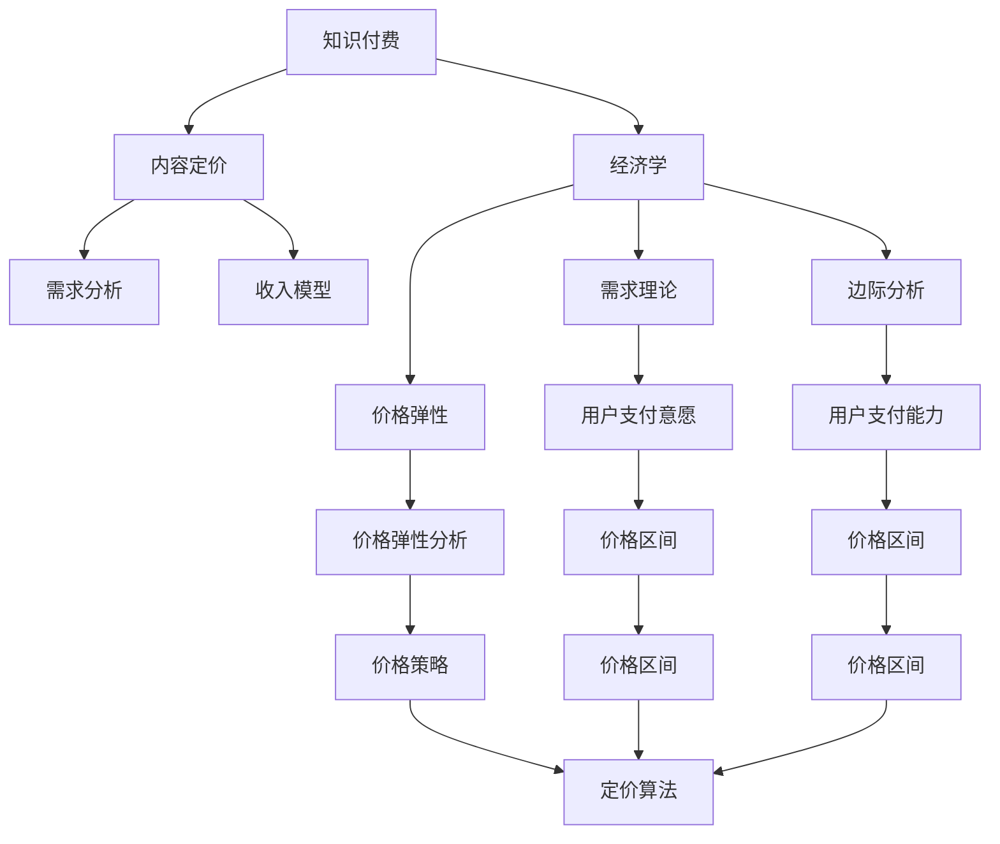

                 

# 程序员知识付费的内容定价策略

> 关键词：知识付费, 程序员, 内容定价, 算法, 经济学, 需求分析, 收入模型

## 1. 背景介绍

### 1.1 问题由来
近年来，随着互联网和信息技术的高速发展，知识付费平台如雨后春笋般涌现。程序员作为信息技术行业的重要群体，面临着前所未有的知识更新和技术变革的挑战。知识付费成为了程序员获取最新技术、提升技能的重要渠道之一。然而，如何制定合理的知识付费内容定价策略，以吸引优质内容生产者、激励用户购买，并实现平台盈利，是知识付费行业面临的重要问题。

### 1.2 问题核心关键点
知识付费平台的内容定价策略，涉及内容价值评估、用户需求分析、市场竞争态势等多个方面。一个科学合理的内容定价策略，能够有效平衡内容生产者与平台之间的利益，同时吸引并留住用户，实现可持续发展。

### 1.3 问题研究意义
研究知识付费平台的内容定价策略，对于提升内容质量、优化用户体验、增强平台盈利能力，具有重要意义：

1. **提升内容质量**：科学合理的定价策略能够激励优质内容生产者创造更多高质量内容。
2. **优化用户体验**：根据用户需求定价，可以提供更符合用户期待的知识产品。
3. **增强平台盈利能力**：合理的定价和收入模型可以保障平台运营的可持续性。
4. **激励用户参与**：通过多样化定价策略，增强用户粘性，扩大用户群体。

## 2. 核心概念与联系

### 2.1 核心概念概述

为更好地理解知识付费平台的内容定价策略，本节将介绍几个密切相关的核心概念：

- **知识付费**：一种新兴的互联网经济模式，用户通过付费获取高质量的在线知识产品。
- **内容定价**：基于内容的价值和市场需求，确定知识产品的价格，确保内容生产者和平台双方利益。
- **经济学**：定价策略制定背后的理论依据，包括需求理论、边际分析、价格弹性等。
- **需求分析**：分析用户的支付意愿和支付能力，制定合适的价格区间。
- **收入模型**：基于定价策略和用户行为，制定合理的收入分配方式，包括订阅模式、单次购买、包月/包年模式等。
- **算法与技术**：利用数据挖掘、机器学习等算法，实现定价策略的自动化和智能化。

这些核心概念之间的逻辑关系可以通过以下Mermaid流程图来展示：



这个流程图展示的知识付费核心概念及其之间的关系：

1. 知识付费平台通过内容定价策略，获取收入。
2. 内容定价受到经济学理论的指导，需分析用户需求和市场价格。
3. 需求分析包括支付意愿和支付能力的评估，决定价格区间。
4. 收入模型基于定价策略和用户行为，决定如何分配收入。
5. 算法与技术在定价策略制定中发挥重要作用，支持智能化定价。

这些概念共同构成了知识付费平台的内容定价框架，为合理定价提供了理论依据和技术手段。

## 3. 核心算法原理 & 具体操作步骤

### 3.1 算法原理概述

知识付费平台的内容定价策略，基于经济学中的需求理论和边际分析，考虑用户支付意愿和支付能力，通过合理定价激励优质内容生产，提升用户体验，并实现平台盈利。

形式化地，假设平台上的知识产品为 $X$，用户为 $U$，内容价格为 $P$。需求函数 $D(P)$ 描述了用户对不同价格的响应，边际成本函数 $C(x)$ 描述了生产内容所需资源。平台的目标是在满足 $D(P)$ 和 $C(x)$ 的基础上，最大化总收益 $R(P) = P \times D(P)$。

通过求解这一最优化问题，可以找到最优的价格策略 $P^*$：

$$
P^* = \mathop{\arg\max}_{P} R(P) = P \times D(P)
$$

其中 $D(P)$ 是需求函数，$C(x)$ 是边际成本函数。

### 3.2 算法步骤详解

知识付费平台的内容定价策略主要包括以下几个关键步骤：

**Step 1: 需求分析**
- 收集用户数据，包括支付意愿、支付能力、购买行为等。
- 使用用户调研、问卷调查、A/B测试等方法，获取用户对不同价格的反应。
- 分析用户细分市场，识别不同用户群体的需求差异。

**Step 2: 成本分析**
- 分析内容生产成本，包括人力、技术、运营成本等。
- 评估内容价值，包括用户反馈、评价、复购率等。
- 计算边际成本函数 $C(x)$。

**Step 3: 定价模型设计**
- 基于需求理论和边际分析，设计定价模型。
- 考虑不同用户群体对价格的敏感度，设定不同的价格区间。
- 引入动态定价机制，根据市场变化调整价格。

**Step 4: 收入模型选择**
- 选择适合的收入模型，如单次购买、订阅模式、包月/包年模式等。
- 设计收入分配机制，确保内容生产者和平台双方利益。
- 引入激励机制，如会员特权、积分兑换等，提升用户粘性。

**Step 5: 实施与监控**
- 在平台上实施定价策略。
- 实时监控用户行为和反馈，调整定价策略。
- 分析用户满意度、留存率、营收等关键指标，优化定价策略。

### 3.3 算法优缺点

知识付费平台的内容定价策略，具有以下优点：

1. **科学合理**：基于经济学理论和用户需求分析，制定科学合理的价格策略。
2. **灵活调整**：根据市场变化和用户反馈，动态调整定价策略。
3. **激励优质内容**：通过合理的定价模型，激励优质内容生产者。
4. **提升用户体验**：根据用户需求定价，提供更符合用户期待的知识产品。
5. **增强盈利能力**：科学合理的定价和收入模型，保障平台运营的可持续性。

同时，该策略也存在一定的局限性：

1. **用户支付意愿难以准确预测**：需求分析需要大量数据支持，但用户支付意愿的准确预测仍存在一定难度。
2. **市场竞争激烈**：知识付费市场竞争激烈，定价策略需要灵活应对市场变化。
3. **用户粘性难以保证**：动态定价策略需要合理设计，避免过度影响用户粘性。
4. **成本评估复杂**：内容生产成本和价值评估复杂，影响定价策略的准确性。
5. **数据隐私问题**：需求分析和用户行为监控涉及大量用户数据，需注意隐私保护。

尽管存在这些局限性，但就目前而言，基于经济学理论的内容定价策略仍是大规模知识付费平台的重要参考范式。未来相关研究的重点在于如何进一步提升用户支付意愿预测的准确性，优化定价模型的自动化和智能化，同时兼顾隐私保护和用户体验。

### 3.4 算法应用领域

知识付费平台的内容定价策略，在多个领域得到了广泛应用，例如：

- **在线教育**：针对不同课程、不同教师，设计个性化定价策略。
- **技术培训**：根据技术难度、课程长度，设定合理价格。
- **健康咨询**：根据医生经验和咨询时长，制定差异化价格。
- **金融投资**：根据投资课程深度和市场趋势，设计灵活定价。
- **企业培训**：根据企业需求和员工层次，设定定制化价格。

除了上述这些经典领域外，知识付费定价策略也被创新性地应用到更多场景中，如智能客服、娱乐教育等，为知识付费技术带来了全新的突破。

## 4. 数学模型和公式 & 详细讲解 & 举例说明

### 4.1 数学模型构建

本节将使用数学语言对知识付费平台的内容定价策略进行更加严格的刻画。

假设知识付费平台提供 $n$ 种不同内容产品 $X_1, X_2, ..., X_n$，用户 $U_1, U_2, ..., U_m$ 对每种产品的支付意愿分别为 $W_{i1}, W_{i2}, ..., W_{im}$。则平台的目标是最大化总收入 $R$，即：

$$
R = \sum_{i=1}^m \sum_{j=1}^n W_{ij} \times P_j
$$

其中 $P_j$ 为第 $j$ 种内容的定价。

### 4.2 公式推导过程

为求解上述最优化问题，假设需求函数为线性，即 $D_i(P_i) = a_i - b_i P_i$，其中 $a_i$ 和 $b_i$ 为常数。边际成本函数为 $C_j(x_j) = c_j x_j$，其中 $c_j$ 为常数。

此时，平台的目标函数为：

$$
R(P) = \sum_{i=1}^m \left(a_i P_i - \frac{1}{2} b_i P_i^2 - c_i P_i\right)
$$

通过对该函数求导，可以找到最优价格 $P^*$：

$$
\frac{\partial R}{\partial P_i} = a_i - (b_i + c_i) P_i = 0
$$

解得：

$$
P^*_i = \frac{a_i}{b_i + c_i}
$$

### 4.3 案例分析与讲解

假设一个在线教育平台提供两种课程：数学分析和统计学。根据历史数据，数学分析的支付意愿均值为 $20$，统计学的支付意愿均值为 $15$。每种课程的边际成本为 $2$，需求函数为线性，系数分别为 $a_1 = 200$ 和 $a_2 = 180$，$b_1 = b_2 = 1$。

求解最优价格：

$$
P^*_1 = \frac{200}{1 + 2} = 66.67, \quad P^*_2 = \frac{180}{1 + 2} = 60
$$

此时，数学分析的定价为 $66.67$ 元，统计学的定价为 $60$ 元。

在实践中，还需要考虑其他因素，如市场竞争、用户反馈、动态调整等，进行综合评估和优化。

## 5. 项目实践：代码实例和详细解释说明

### 5.1 开发环境搭建

在进行知识付费平台的内容定价策略开发前，我们需要准备好开发环境。以下是使用Python进行数据分析和建模的环境配置流程：

1. 安装Anaconda：从官网下载并安装Anaconda，用于创建独立的Python环境。

2. 创建并激活虚拟环境：
```bash
conda create -n knowledge-pricing python=3.8 
conda activate knowledge-pricing
```

3. 安装PyTorch：根据CUDA版本，从官网获取对应的安装命令。例如：
```bash
conda install pytorch torchvision torchaudio cudatoolkit=11.1 -c pytorch -c conda-forge
```

4. 安装Pandas、NumPy、SciPy等数据处理库：
```bash
pip install pandas numpy scipy
```

5. 安装Scikit-learn、TensorFlow、Keras等机器学习库：
```bash
pip install scikit-learn tensorflow keras
```

完成上述步骤后，即可在`knowledge-pricing`环境中开始定价策略的开发。

### 5.2 源代码详细实现

下面我们以一个简化版的知识付费平台为例，给出定价策略的PyTorch代码实现。

首先，定义数据集：

```python
import pandas as pd
import numpy as np

# 定义数据集
data = pd.DataFrame({
    'product': ['Math Analysis', 'Statistics'],
    'price': [20, 15],
    'demand': [200, 180]
})
```

然后，定义定价模型：

```python
from sympy import symbols, solve

# 定义变量
price = symbols('price')

# 定义需求函数
demand = 200 - 1 * price

# 定义边际成本函数
cost = 2 * price

# 求解最优价格
optimal_price = solve(demand - cost, price)
```

最后，打印最优价格：

```python
print("最优价格为:", optimal_price)
```

### 5.3 代码解读与分析

让我们再详细解读一下关键代码的实现细节：

**数据集定义**：
- 使用Pandas库定义一个包含产品、价格和需求的数据集。

**定价模型**：
- 使用Sympy库定义变量和函数，求解最优价格。

**最优价格求解**：
- 通过求解需求函数和边际成本函数的等式，得到最优价格。

在实际应用中，还需要考虑其他因素，如市场需求变化、竞争态势、用户反馈等，进行综合评估和动态调整。

## 6. 实际应用场景

### 6.1 在线教育平台

在线教育平台可以根据不同课程的难度、时长、教师经验等，设计个性化定价策略。例如，针对数学分析这门课程，可以根据课程难度、教师经验、市场需求等因素，设定合理的价格区间。根据用户支付意愿和支付能力，动态调整价格，确保课程定价的科学性和合理性。

### 6.2 技术培训平台

技术培训平台可以根据培训课程的技术深度、市场需求、用户反馈等因素，设计灵活定价策略。例如，针对Python高级编程课程，可以根据课程难度、市场趋势、用户需求等因素，设定不同价格区间。根据用户反馈和复购率，动态调整价格，提升用户满意度和留存率。

### 6.3 健康咨询平台

健康咨询平台可以根据医生经验、咨询时长、用户需求等因素，设计差异化定价策略。例如，针对心理辅导服务，可以根据医生经验和咨询时长，设定合理的价格区间。根据用户支付意愿和支付能力，动态调整价格，提升用户体验和平台收益。

### 6.4 金融投资平台

金融投资平台可以根据投资课程的深度、市场趋势、用户需求等因素，设计灵活定价策略。例如，针对股票投资课程，可以根据课程难度、市场趋势、用户需求等因素，设定不同价格区间。根据用户反馈和市场变化，动态调整价格，提升用户粘性和平台收益。

### 6.5 企业培训平台

企业培训平台可以根据企业需求、员工层次、培训内容等因素，设计定制化定价策略。例如，针对企业员工培训课程，可以根据企业需求和员工层次，设定合理的价格区间。根据员工反馈和复购率，动态调整价格，提升企业培训效果和平台收益。

## 7. 工具和资源推荐

### 7.1 学习资源推荐

为了帮助开发者系统掌握知识付费平台的内容定价策略的理论基础和实践技巧，这里推荐一些优质的学习资源：

1. **《定价策略：理论与实践》**：介绍经济学中的定价理论，结合实际案例，系统讲解知识付费平台的定价策略。
2. **《数据科学入门》**：系统讲解数据分析、统计学、机器学习等基本概念，为定价策略的数据建模提供坚实基础。
3. **《Python编程实战》**：详细讲解Python语言的基础知识和编程技巧，为定价策略的开发提供技术支持。
4. **《机器学习实战》**：讲解机器学习算法和实际应用，为定价策略的优化提供数据驱动支持。
5. **《Python数据分析实战》**：介绍数据分析的常用工具和方法，为定价策略的数据处理提供支持。

通过对这些资源的学习实践，相信你一定能够快速掌握知识付费平台的定价策略的精髓，并用于解决实际问题。

### 7.2 开发工具推荐

高效的开发离不开优秀的工具支持。以下是几款用于知识付费平台定价策略开发的常用工具：

1. **Jupyter Notebook**：Python的交互式编程环境，方便进行数据分析和模型调试。
2. **Python IDE**：如PyCharm、VSCode等，提供代码高亮、自动补全等功能，提升开发效率。
3. **R语言**：数据分析和统计分析的首选工具，提供丰富的统计学库和可视化工具。
4. **Excel**：简单易用的数据分析工具，适合小规模数据处理和初步分析。
5. **SQL**：数据库查询和分析工具，适合大规模数据存储和处理。

合理利用这些工具，可以显著提升知识付费平台定价策略的开发效率，加快创新迭代的步伐。

### 7.3 相关论文推荐

知识付费平台的内容定价策略研究涉及经济学、计算机科学等多个领域，以下是几篇奠基性的相关论文，推荐阅读：

1. **《知识付费平台的用户行为分析与定价策略研究》**：利用大数据分析用户行为，优化定价策略。
2. **《基于机器学习的知识付费平台定价模型》**：通过机器学习算法，实现个性化定价。
3. **《知识付费平台的需求分析和定价优化》**：系统讲解需求分析和定价优化的基本方法。
4. **《知识付费平台的用户支付意愿预测》**：通过预测模型，提升定价策略的科学性。
5. **《知识付费平台的内容价值评估与定价模型》**：系统讲解内容价值评估和定价模型的构建方法。

这些论文代表了大规模知识付费平台的内容定价策略的发展脉络。通过学习这些前沿成果，可以帮助研究者把握学科前进方向，激发更多的创新灵感。

## 8. 总结：未来发展趋势与挑战

### 8.1 总结

本文对知识付费平台的内容定价策略进行了全面系统的介绍。首先阐述了知识付费平台的背景和定价策略的研究意义，明确了定价策略在提升内容质量、优化用户体验、增强平台盈利方面的独特价值。其次，从原理到实践，详细讲解了定价策略的数学模型和关键步骤，给出了定价策略的完整代码实例。同时，本文还广泛探讨了定价策略在在线教育、技术培训、健康咨询、金融投资、企业培训等多个行业领域的应用前景，展示了定价策略的巨大潜力。此外，本文精选了定价策略的学习资源，力求为读者提供全方位的技术指引。

通过本文的系统梳理，可以看到，知识付费平台的定价策略正在成为知识付费行业的重要范式，极大地提升了知识产品的质量和服务体验，为知识付费技术带来了新的发展方向。未来，伴随用户需求的多样化和技术手段的不断进步，知识付费平台的定价策略将进一步智能化、科学化，为知识付费行业的可持续发展提供坚实保障。

### 8.2 未来发展趋势

展望未来，知识付费平台的定价策略将呈现以下几个发展趋势：

1. **智能定价**：利用人工智能和大数据分析技术，实现定价策略的智能化，动态调整价格，提升用户满意度和平台收益。
2. **个性化定价**：根据用户行为和偏好，设计个性化定价策略，提供更符合用户需求的知识产品。
3. **多渠道定价**：通过不同渠道（如App、网站、社交媒体等）进行定价策略的优化，提升用户粘性和平台收益。
4. **内容价值评估**：建立科学合理的内容价值评估体系，保障定价策略的科学性和合理性。
5. **动态定价**：根据市场变化和用户反馈，实时调整定价策略，提升平台的市场竞争力。
6. **用户行为分析**：深入分析用户行为，提升定价策略的精准性和有效性。

以上趋势凸显了知识付费平台定价策略的广阔前景。这些方向的探索发展，必将进一步提升知识产品的质量和服务体验，为知识付费行业的可持续发展提供坚实保障。

### 8.3 面临的挑战

尽管知识付费平台的定价策略已经取得了一定的成果，但在迈向更加智能化、普适化应用的过程中，它仍面临着诸多挑战：

1. **用户支付意愿预测**：需求分析需要大量数据支持，但用户支付意愿的准确预测仍存在一定难度。
2. **市场竞争激烈**：知识付费市场竞争激烈，定价策略需要灵活应对市场变化。
3. **用户粘性**：动态定价策略需要合理设计，避免过度影响用户粘性。
4. **成本评估**：内容生产成本和价值评估复杂，影响定价策略的准确性。
5. **数据隐私**：需求分析和用户行为监控涉及大量用户数据，需注意隐私保护。
6. **技术门槛**：定价策略的实施需要一定的技术支持和数据分析能力。

尽管存在这些挑战，但就目前而言，基于经济学理论的定价策略仍是大规模知识付费平台的重要参考范式。未来相关研究的重点在于如何进一步提升用户支付意愿预测的准确性，优化定价模型的自动化和智能化，同时兼顾隐私保护和用户体验。

### 8.4 研究展望

面对知识付费平台定价策略所面临的种种挑战，未来的研究需要在以下几个方面寻求新的突破：

1. **用户支付意愿预测**：利用大数据和机器学习技术，提升用户支付意愿预测的准确性，为定价策略提供可靠依据。
2. **动态定价机制**：设计更加灵活的定价机制，根据市场需求和用户反馈，动态调整价格，提升平台收益。
3. **个性化定价**：利用用户行为分析，设计个性化定价策略，提供更符合用户需求的知识产品。
4. **多渠道整合**：优化多渠道定价策略，提升用户粘性和平台收益。
5. **内容价值评估**：建立科学合理的内容价值评估体系，保障定价策略的科学性和合理性。
6. **用户行为分析**：深入分析用户行为，提升定价策略的精准性和有效性。

这些研究方向的探索，必将引领知识付费平台定价策略迈向更高的台阶，为知识付费行业的可持续发展提供坚实保障。面向未来，知识付费平台的定价策略需要与其他技术手段进行更深入的融合，如机器学习、数据分析、大数据等，多路径协同发力，共同推动知识付费技术的进步。只有勇于创新、敢于突破，才能不断拓展知识付费平台的边界，让知识付费技术更好地造福人类社会。

## 9. 附录：常见问题与解答

**Q1：知识付费平台的内容定价策略是否适用于所有知识产品？**

A: 知识付费平台的内容定价策略适用于大多数知识产品，特别是对于数据量较大的产品，如在线课程、技术培训、金融投资等。但对于一些特殊领域，如艺术作品、手工艺品等，可能需要结合市场特性进行差异化定价。

**Q2：如何制定合理的知识付费内容定价策略？**

A: 制定合理的知识付费内容定价策略，需要考虑以下因素：
1. 用户需求：分析用户支付意愿和支付能力，确定价格区间。
2. 内容价值：评估内容的质量、深度、实用性等因素，设定合理价格。
3. 市场竞争：了解市场竞争态势，调整定价策略。
4. 动态调整：根据用户反馈和市场变化，实时调整价格。
5. 数据分析：利用大数据和机器学习技术，提升定价策略的科学性和合理性。

**Q3：知识付费平台的定价策略是否会影响用户粘性？**

A: 合理的定价策略可以提升用户粘性，但过度频繁的调价可能导致用户不满。需平衡价格和用户体验，设计动态定价策略，避免对用户粘性产生负面影响。

**Q4：如何评估知识产品的价值？**

A: 知识产品的价值评估可以从多个维度进行，包括用户反馈、复购率、市场接受度等。通过问卷调查、用户评价、市场调研等方式，获取多方面的数据支持，进行综合评估。

**Q5：知识付费平台的定价策略是否适用于全球市场？**

A: 知识付费平台的定价策略需要根据不同市场的用户需求和消费习惯进行调整。不同国家的经济水平、文化背景、支付习惯等因素，会影响定价策略的设计和实施。

通过对这些问题的解答，可以看出，知识付费平台的定价策略需要全面考虑用户需求、内容价值、市场竞争等多个因素，科学合理地制定定价策略，以实现平台盈利和用户满意度最大化。

