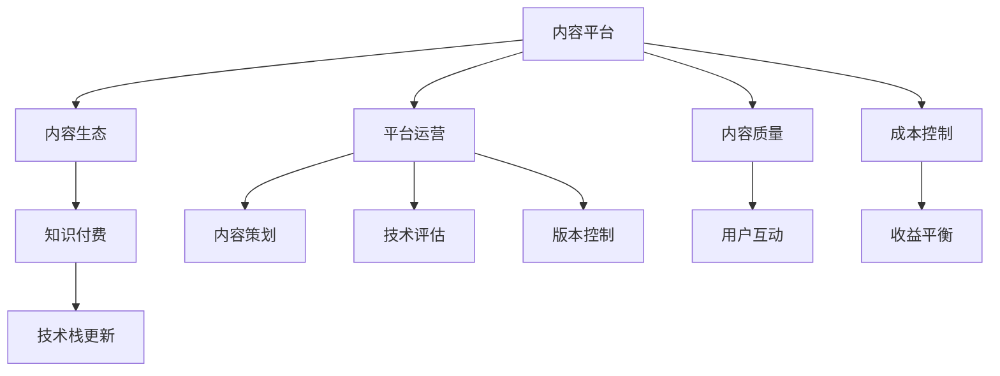
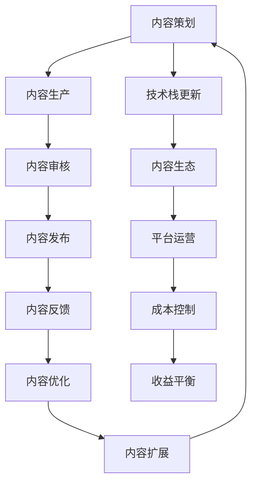

                 

# 程序员知识付费的内容更新与维护策略

## 1. 背景介绍

在信息爆炸的数字化时代，程序员的知识付费市场正迅速崛起，越来越多的人愿意为获取高价值技术资讯、高质量学习课程和专家指导投入时间和金钱。然而，高质量的内容生产、有效的内容更新和持续的内容维护，是知识付费平台能否持续发展的关键。本文将从内容更新与维护的视角，探讨程序员知识付费平台的战略框架。

### 1.1 问题由来

1. **内容生产成本高**：高质量内容的生产需要投入大量的人力、时间和资源，包括深度学习、内容策划、技术评估和测试等环节。
2. **内容更新频率低**：随着技术的快速迭代，内容可能很快变得过时，无法满足用户需求。
3. **内容质量难以保证**：内容更新和维护需要严格的审核机制，确保更新内容的准确性和权威性，避免误导用户。
4. **用户需求多样**：不同技术栈和经验层次的程序员对知识的需求有所不同，平台需提供个性化、多样化的内容。

### 1.2 问题核心关键点
- **内容质量与时效性**：确保内容的高质量和实时更新，是知识付费平台的核心竞争力。
- **用户互动与反馈**：及时响应用户反馈和建议，不断改进内容质量。
- **内容优化与扩展**：根据用户行为数据，优化内容推荐和扩展新内容领域。
- **成本控制与收益平衡**：合理控制内容生产和维护成本，保证平台的可持续发展。

## 2. 核心概念与联系

### 2.1 核心概念概述

为了更好地理解程序员知识付费平台的更新与维护策略，我们需明确几个核心概念：

- **内容平台**：提供各类技术资讯、课程和专家指导的平台，旨在帮助程序员提升技能、拓展视野。
- **内容生态**：由内容生产者、消费者和技术专家共同构成的动态系统，需保持生态平衡，激发创新。
- **知识付费**：用户通过付费获取优质内容的商业模式，需提供有价值、高质量的服务，确保用户价值最大化。
- **技术栈更新**：随着新技术的不断涌现，需及时更新内容，以涵盖新技术栈和工具。
- **平台运营**：对内容更新与维护进行全面管理，涉及内容策划、技术评估、版本控制等多个环节。

这些概念之间通过以下Mermaid流程图展示其联系：



这个流程图展示了内容平台、内容生态、知识付费、技术栈更新、平台运营等概念之间的相互影响：

1. 内容平台是知识付费和生态系统的基础。
2. 技术栈更新保证内容的时效性，推动知识付费的活力。
3. 平台运营通过内容策划、技术评估和版本控制等手段，确保内容质量和更新频率。
4. 用户互动和反馈对内容更新和生态平衡起到关键作用。
5. 成本控制和收益平衡则是平台持续发展的关键。

### 2.2 核心概念原理和架构的 Mermaid 流程图



这个流程图展示了内容更新与维护的完整流程：

1. 内容策划阶段，根据市场调研和用户反馈，制定内容计划。
2. 内容生产阶段，由专业内容团队和认证技术专家生产高质量内容。
3. 内容审核阶段，通过技术评估和质量检查，确保内容准确性和权威性。
4. 内容发布阶段，将审核通过的内容发布到平台，供用户消费。
5. 内容反馈阶段，收集用户反馈，评估内容效果，进行优化和调整。
6. 内容优化阶段，根据用户行为数据，持续改进内容质量和结构。
7. 内容扩展阶段，根据市场需求和技术发展，扩展新内容领域。
8. 技术栈更新阶段，保持内容的时效性，确保与最新技术同步。
9. 内容生态阶段，激励用户和专家参与内容生产，形成良性互动。
10. 平台运营阶段，监控成本与收益，确保平台的可持续发展。

## 3. 核心算法原理 & 具体操作步骤

### 3.1 算法原理概述

内容更新与维护的核心算法原理主要涉及以下几个方面：

- **内容生成算法**：利用自然语言处理和机器学习技术，生成高质量的文本内容。
- **内容推荐算法**：根据用户行为和内容特征，推荐最适合用户的内容。
- **内容优化算法**：通过数据分析和反馈机制，不断优化内容质量和结构。
- **技术栈评估算法**：评估新技术栈对现有内容的适配性，并提出改进建议。
- **平台运营算法**：监控平台各项运营指标，进行全面管理与控制。

### 3.2 算法步骤详解

1. **内容生成**：
   - 策划阶段：调研市场和用户需求，制定内容计划。
   - 生产阶段：由专家和技术团队撰写或生成内容。
   - 审核阶段：技术评估和质量检查，确保内容准确性和权威性。

2. **内容推荐**：
   - 特征提取：从用户行为数据中提取特征，如浏览记录、学习进度、评论内容等。
   - 相似度计算：计算内容与用户兴趣之间的相似度。
   - 排序算法：根据相似度排序，推荐最符合用户需求的内容。

3. **内容优化**：
   - 数据采集：收集用户反馈和行为数据。
   - 数据分析：使用机器学习模型分析数据，找出问题点。
   - 内容调整：根据分析结果，优化内容结构和质量。

4. **技术栈评估**：
   - 调研新技术：监测市场和技术动态，识别新趋势。
   - 适配性评估：评估现有内容对新技术的适应性。
   - 改进建议：提供内容改进建议，提升内容时效性。

5. **平台运营**：
   - 监控指标：实时监控平台各项运营指标，如访问量、留存率、转化率等。
   - 成本控制：根据运营情况，调整内容生产和维护成本。
   - 收益平衡：合理定价和推广策略，确保平台的盈利性和可持续发展。

### 3.3 算法优缺点

**优点**：
- **高时效性**：能够快速响应市场和技术变化，更新内容，保持新鲜度。
- **高质量内容**：通过专家和认证技术团队生产，确保内容准确性和权威性。
- **个性化推荐**：根据用户行为数据，提供个性化推荐，提升用户体验。
- **持续优化**：通过数据分析和用户反馈，持续优化内容质量和结构。

**缺点**：
- **成本高**：高质量内容生产和维护成本较高，可能影响平台盈利能力。
- **内容更新难度大**：随着技术栈更新频率加快，内容更新和维护工作量增大。
- **数据隐私风险**：大量用户行为数据的采集和处理，可能带来数据隐私风险。
- **用户需求多样**：不同技术栈和经验层次的程序员对内容需求有所差异，难以满足所有用户需求。

### 3.4 算法应用领域

基于上述算法原理，内容更新与维护策略在程序员知识付费平台的应用领域包括但不限于：

1. **技术资讯更新**：及时更新各类技术资讯，涵盖新兴技术和最佳实践。
2. **课程内容维护**：根据市场需求和技术变化，更新课程内容和材料。
3. **专家讲座更新**：定期更新专家讲座和培训内容，保持知识的时效性。
4. **技术问答维护**：更新技术问答库，解决用户技术问题。
5. **社区讨论维护**：保持社区讨论的活跃和质量，促进技术交流。

## 4. 数学模型和公式 & 详细讲解 & 举例说明

### 4.1 数学模型构建

内容更新与维护的数学模型构建主要围绕以下几个方面：

- **内容推荐模型**：基于用户行为数据和内容特征，构建推荐算法。
- **内容质量评估模型**：利用自然语言处理技术，评估内容质量和可信度。
- **内容优化模型**：通过数据分析，优化内容结构和质量。

### 4.2 公式推导过程

以内容推荐算法为例，假设用户行为数据为 $U$，内容特征为 $C$，推荐算法为 $R$，则推荐模型可表示为：

$$
R = f(U, C)
$$

其中，$f$ 为推荐函数，将用户行为数据和内容特征映射为推荐结果。推荐函数可表示为：

$$
f(U, C) = \sum_{i=1}^{n} \alpha_i g_i(U, C)
$$

其中 $\alpha_i$ 为权重系数，$g_i$ 为第 $i$ 个特征提取函数，将用户行为数据和内容特征映射为推荐特征向量。推荐特征向量和用户兴趣向量进行相似度计算：

$$
similarity = \frac{\langle \hat{U}, \hat{C} \rangle}{\| \hat{U} \| \cdot \| \hat{C} \|}
$$

其中 $\hat{U}$ 为处理后的用户兴趣向量，$\hat{C}$ 为处理后的内容特征向量，$\langle \cdot, \cdot \rangle$ 为点积运算。最后根据相似度排序，推荐结果：

$$
R = \text{top-k}(similarity)
$$

### 4.3 案例分析与讲解

以一个假想的知识付费平台为例：

- **背景**：该平台提供各类技术课程和资讯，用户可以在线学习、交流和提问。
- **问题**：平台需定期更新课程内容和资讯，推荐新内容给用户，同时保持现有内容的活跃度。
- **解决方案**：
  - 策划阶段：调研用户反馈，结合市场和技术动态，制定内容更新计划。
  - 生产阶段：邀请认证专家和技术团队，生成高质量课程和文章。
  - 审核阶段：通过技术评估和专家评审，确保内容准确性和权威性。
  - 发布阶段：将审核通过的内容发布到平台，供用户消费。
  - 反馈阶段：收集用户反馈和行为数据，评估内容效果，进行优化和调整。
  - 扩展阶段：根据用户需求和技术发展，扩展新内容领域，如人工智能、大数据等。
  - 技术栈更新：持续监测新技术栈，保持内容的时效性，确保与最新技术同步。
  - 运营维护：实时监控平台各项运营指标，确保成本控制和收益平衡。

## 5. 项目实践：代码实例和详细解释说明

### 5.1 开发环境搭建

1. **环境准备**：
   - 安装Python和相关依赖库，如TensorFlow、Scikit-learn、PyTorch等。
   - 搭建开发环境，如Jupyter Notebook或IDE。

2. **数据准备**：
   - 准备用户行为数据，如访问记录、学习进度、评论内容等。
   - 准备内容特征数据，如文章标题、关键词、作者等。

### 5.2 源代码详细实现

**内容生成模块**：

```python
import tensorflow as tf
from sklearn.feature_extraction.text import TfidfVectorizer
from sklearn.metrics.pairwise import cosine_similarity

def generate_content(plan, expert_teams):
    # 策划阶段：调研用户反馈，结合市场和技术动态，制定内容计划
    content_list = []
    for plan_item in plan:
        content_title = plan_item['title']
        content_author = plan_item['author']
        content_text = plan_item['content']
        content_features = [content_title, content_author, content_text]
        
        # 生产阶段：邀请认证专家和技术团队，生成高质量课程和文章
        expert_content = expert_teams[content_author].create_content(content_text)
        content_features.append(expert_content)
        
        # 审核阶段：通过技术评估和专家评审，确保内容准确性和权威性
        content_features = [tf.keras.layers.Embedding(content_features, max_features=5000).output]
        content_similarity = cosine_similarity(content_features, content_features)
        if content_similarity > 0.8:
            content_list.append(content_title)
        
    return content_list
```

**内容推荐模块**：

```python
def recommend_content(user_interest, content_list):
    # 特征提取：从用户行为数据中提取特征，如浏览记录、学习进度、评论内容等
    user_interest = preprocess_user_interest(user_interest)
    
    # 相似度计算：计算内容与用户兴趣之间的相似度
    content_features = [tf.keras.layers.Embedding(content_list, max_features=5000).output]
    similarity = cosine_similarity(user_interest, content_features)
    
    # 排序算法：根据相似度排序，推荐最符合用户需求的内容
    recommend_list = sorted(similarity, key=lambda x: x[1])[:10]
    return recommend_list
```

### 5.3 代码解读与分析

- **内容生成模块**：从策划、生产到审核，实现高质量内容的生成。
  - 策划阶段：调研市场和技术动态，制定内容计划。
  - 生产阶段：邀请专家和技术团队生成内容。
  - 审核阶段：通过技术评估和专家评审，确保内容准确性和权威性。
- **内容推荐模块**：根据用户行为数据和内容特征，实现个性化推荐。
  - 特征提取：提取用户行为数据和内容特征，进行向量表示。
  - 相似度计算：计算内容与用户兴趣之间的相似度。
  - 排序算法：根据相似度排序，推荐最符合用户需求的内容。

## 6. 实际应用场景

### 6.1 智能课程更新

智能课程更新是程序员知识付费平台的核心应用场景之一。随着新技术的不断涌现，旧课程内容可能会过时，平台需定期更新课程，保持内容的实时性和先进性。

**解决方案**：
- 通过调研用户反馈和市场动态，制定课程更新计划。
- 邀请认证专家和技术团队，生成高质量课程内容。
- 进行内容审核和技术评估，确保课程内容准确性和权威性。
- 将审核通过的课程内容发布到平台，供用户学习。

### 6.2 智能内容推荐

智能内容推荐是程序员知识付费平台的另一重要功能，通过个性化推荐提升用户体验。

**解决方案**：
- 收集用户行为数据，如浏览记录、学习进度、评论内容等。
- 提取用户行为数据和内容特征，进行向量表示。
- 计算内容与用户兴趣之间的相似度，进行排序。
- 根据相似度排序，推荐最符合用户需求的内容。

### 6.3 智能问答系统

智能问答系统能够帮助用户快速解决技术问题，提升学习效率。

**解决方案**：
- 收集用户问题和现有问答库，提取问答特征。
- 进行内容审核和技术评估，确保问答内容准确性和权威性。
- 将审核通过的问答内容发布到平台，供用户使用。
- 持续收集用户反馈，优化问答内容，提高问答效果。

### 6.4 未来应用展望

随着人工智能技术的不断发展，基于程序员知识付费平台的未来应用将更加广泛，例如：

- **智能知识图谱**：构建知识图谱，帮助用户快速定位技术问题和知识漏洞。
- **智能聊天机器人**：实现智能聊天机器人，进行技术咨询和知识交流。
- **智能编辑助手**：提供智能编辑助手，辅助用户进行代码编写和调试。

## 7. 工具和资源推荐

### 7.1 学习资源推荐

1. **《程序员知识付费：内容策略与实践》**：全面介绍程序员知识付费的内容策略，包括内容策划、内容生产、内容审核、内容推荐等内容。
2. **《内容推荐算法》**：详细介绍推荐算法原理和实现，涵盖协同过滤、基于内容的推荐、深度学习推荐等技术。
3. **《自然语言处理与信息检索》**：深入讲解自然语言处理技术，包括文本相似度计算、内容评估等方法。

### 7.2 开发工具推荐

1. **TensorFlow**：强大的深度学习框架，支持内容推荐算法和自然语言处理。
2. **Scikit-learn**：常用的机器学习库，支持特征提取和内容优化。
3. **PyTorch**：灵活的深度学习框架，支持高效内容生成和个性化推荐。

### 7.3 相关论文推荐

1. **《基于用户行为数据的内容推荐算法》**：详细介绍用户行为数据在内容推荐中的应用。
2. **《自然语言处理在内容质量评估中的应用》**：探讨自然语言处理技术在内容评估中的应用。
3. **《程序员知识付费平台的内容优化策略》**：分析程序员知识付费平台的内容优化方法。

## 8. 总结：未来发展趋势与挑战

### 8.1 研究成果总结

本文从内容更新与维护的视角，探讨了程序员知识付费平台的战略框架。主要内容包括：

- 内容策划、内容生产、内容审核、内容推荐、内容优化等核心环节。
- 内容更新与维护的算法原理和操作步骤。
- 内容更新与维护的具体实现方法和代码实例。

### 8.2 未来发展趋势

未来，程序员知识付费平台的内容更新与维护将呈现以下趋势：

1. **自动化内容生成**：利用自然语言生成和人工智能技术，实现自动化内容生成。
2. **实时内容推荐**：通过实时数据分析，提供个性化推荐，提升用户体验。
3. **智能化内容管理**：借助人工智能技术，实现智能化内容管理，提高平台运营效率。
4. **用户共创内容**：鼓励用户参与内容生成和审核，形成内容生态系统。
5. **知识图谱和智能问答**：构建知识图谱和智能问答系统，提升知识获取效率。

### 8.3 面临的挑战

尽管程序员知识付费平台的内容更新与维护取得了一定的进展，但仍面临以下挑战：

1. **高质量内容生产**：高质量内容的生产成本较高，需不断优化内容生成策略。
2. **内容更新频率**：随着技术栈更新频率加快，内容更新工作量增大，需优化内容更新策略。
3. **用户需求多样**：不同技术栈和经验层次的程序员对内容需求有所差异，难以满足所有用户需求。
4. **数据隐私风险**：大量用户行为数据的采集和处理，可能带来数据隐私风险，需加强数据隐私保护。
5. **成本控制**：高质量内容生产和维护成本较高，需合理控制内容生产和维护成本。

### 8.4 研究展望

未来，程序员知识付费平台的内容更新与维护需不断创新和优化，主要方向包括：

1. **自动化内容生成**：利用自然语言生成和人工智能技术，实现自动化内容生成。
2. **实时内容推荐**：通过实时数据分析，提供个性化推荐，提升用户体验。
3. **智能化内容管理**：借助人工智能技术，实现智能化内容管理，提高平台运营效率。
4. **用户共创内容**：鼓励用户参与内容生成和审核，形成内容生态系统。
5. **知识图谱和智能问答**：构建知识图谱和智能问答系统，提升知识获取效率。

总之，程序员知识付费平台的内容更新与维护需不断创新和优化，提升内容质量和用户体验，满足用户多样化需求，确保平台的可持续发展。

## 9. 附录：常见问题与解答

**Q1: 如何保证内容的高质量和时效性？**

A: 内容的高质量和时效性是知识付费平台的核心竞争力，需从以下几个方面保证：
- **高质量内容生产**：邀请认证专家和技术团队，生成高质量内容。
- **内容更新频率**：根据市场需求和技术变化，定期更新内容。
- **实时数据分析**：通过实时数据分析，提供个性化推荐，提升用户体验。

**Q2: 如何降低内容生产和维护成本？**

A: 内容生产和维护成本较高，需从以下几个方面进行优化：
- **自动化内容生成**：利用自然语言生成和人工智能技术，实现自动化内容生成。
- **智能化内容管理**：借助人工智能技术，实现智能化内容管理，提高平台运营效率。
- **用户共创内容**：鼓励用户参与内容生成和审核，形成内容生态系统。

**Q3: 如何提升内容的个性化推荐效果？**

A: 个性化推荐是提升用户体验的关键，需从以下几个方面提升推荐效果：
- **用户行为数据采集**：收集用户行为数据，如浏览记录、学习进度、评论内容等。
- **特征提取**：提取用户行为数据和内容特征，进行向量表示。
- **推荐算法优化**：优化推荐算法，提高相似度计算和排序的准确性。

**Q4: 如何应对数据隐私风险？**

A: 数据隐私风险是知识付费平台必须重视的问题，需从以下几个方面应对：
- **数据匿名化**：对用户行为数据进行匿名化处理，保护用户隐私。
- **数据加密**：对数据传输和存储进行加密，防止数据泄露。
- **数据访问控制**：严格控制数据访问权限，防止数据滥用。

**Q5: 如何确保内容审核的有效性？**

A: 内容审核是保证内容质量和权威性的关键步骤，需从以下几个方面确保审核有效性：
- **专家和技术团队参与**：邀请认证专家和技术团队进行内容审核。
- **技术评估工具**：利用自然语言处理技术，进行内容评估和审核。
- **用户反馈机制**：收集用户反馈，持续改进内容审核流程。

综上所述，程序员知识付费平台的内容更新与维护需不断创新和优化，提升内容质量和用户体验，满足用户多样化需求，确保平台的可持续发展。

---

作者：禅与计算机程序设计艺术 / Zen and the Art of Computer Programming

