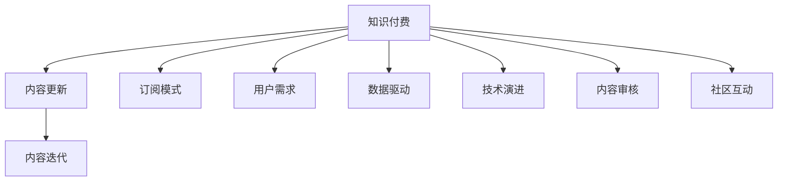

                 

# 程序员知识付费的内容更新与迭代策略

> 关键词：程序员知识付费,内容更新,内容迭代,知识服务,订阅模式,用户需求,数据驱动,技术演进,内容审核,社区互动

## 1. 背景介绍

在知识付费领域，程序员知识服务市场近年来迅速崛起，吸引了大量技术人员和开发者的关注。其核心驱动力在于：一方面，程序员作为IT行业的主要生产力，其技能更新和知识提升尤为关键；另一方面，知识付费平台能够帮助程序员更快速地获取前沿技术、解决实际问题、提升职业竞争力，市场潜力巨大。然而，随着知识付费市场的不断成熟，内容更新与迭代策略变得日益重要。如何高效、持续地提供高质量内容，成为知识付费平台持续发展的关键。

本文旨在系统梳理程序员知识付费的内容更新与迭代策略，帮助平台制定和优化内容生态，提升用户粘性，实现商业价值。首先，我们介绍知识付费的基本概念和背景，随后深入探讨内容更新与迭代的核心概念和联系，最后具体展开内容更新的算法原理、操作步骤、实际应用，以及未来展望。

## 2. 核心概念与联系

### 2.1 核心概念概述

要深刻理解程序员知识付费的内容更新与迭代策略，需要首先了解几个关键概念：

1. **知识付费**：指通过付费方式获取专业知识、技能提升、技术教程等形式的知识内容。知识付费平台如Coursera、Udemy、CSDN学院等，为技术人员提供丰富的学习资源。

2. **内容更新**：指根据用户反馈、行业动态、技术演进等因素，对知识付费平台的内容进行持续修订和完善，以保证内容的准确性、时效性和实用性。

3. **内容迭代**：在内容更新的基础上，通过引入新的技术和方法，持续优化和增强内容质量，提高用户满意度。内容迭代强调的是一种持续改进的策略，而非静态更新。

4. **订阅模式**：知识付费平台的主要收入模式之一，用户通过订阅付费，获取平台提供的各类内容和服务。订阅模式对内容的更新和迭代提出了更高的要求。

5. **用户需求**：技术人员的知识需求复杂多变，涵盖基础学习、项目实践、进阶技巧、行业前沿等多个方面。只有准确把握用户需求，才能提供有针对性的内容。

6. **数据驱动**：内容更新与迭代应基于大量数据进行，包括用户行为数据、反馈数据、技术趋势等，从而制定科学合理的内容策略。

7. **技术演进**：编程技术和工具不断更新，知识付费平台的内容需要紧跟技术演进，保持内容的前沿性。

8. **内容审核**：为确保内容的准确性和安全性，需要对所有发布内容进行严格审核。内容审核是内容管理的重要环节。

9. **社区互动**：知识付费平台应鼓励用户参与内容制作和反馈，形成活跃的社区互动，增强用户粘性和参与感。

这些核心概念之间的逻辑关系可以通过以下Mermaid流程图来展示：



这个流程图展示了知识付费、内容更新、内容迭代与各个核心概念之间的联系：

- 知识付费是平台的基本业务，内容更新和迭代是提升用户满意度的核心手段。
- 订阅模式驱动用户对内容的持续关注，决定了内容更新的频次和质量。
- 用户需求是内容更新的重要依据，需要通过数据驱动和社区互动等方式进行充分调研。
- 技术演进是内容更新的外部驱动力，平台需要持续跟进新技术。
- 内容审核确保内容的合法性和权威性，是内容管理的关键环节。
- 社区互动增强用户参与感，提升内容的活跃度和互动性。

## 3. 核心算法原理 & 具体操作步骤

### 3.1 算法原理概述

程序员知识付费平台的内容更新与迭代，本质上是一个动态调整的优化问题。其核心思想是：根据用户反馈、行业动态和技术演进等因素，通过算法模型自动调整内容策略，确保内容的质量和时效性。具体来说，内容更新与迭代策略可以分为以下几个步骤：

1. **用户需求分析**：通过用户行为数据、问卷调查等手段，分析用户对各类内容的需求，识别热门和冷门内容。
2. **内容匹配度计算**：利用算法模型计算新内容与已有内容的匹配度，以确保新内容能够补充现有内容体系的空白。
3. **内容质量评估**：建立内容质量评估体系，包括内容准确性、实用性、时效性等多个维度，对内容进行综合评估。
4. **内容优化策略**：根据内容匹配度和质量评估结果，制定内容优化策略，包括增补、替换、删除等操作。
5. **内容发布与迭代**：根据优化策略，发布和迭代内容，并在用户中进行广泛推广，收集反馈以进一步优化。

### 3.2 算法步骤详解

内容更新与迭代的具体操作步骤如下：

1. **用户行为数据收集**：
   - 使用Web分析工具（如Google Analytics）收集用户访问行为数据，包括访问时长、页面停留时间、点击率等。
   - 收集用户互动数据，如评论、点赞、分享等。
   - 使用A/B测试等手段分析不同内容形式的受欢迎程度。

2. **用户需求调研**：
   - 通过在线问卷、社交媒体、用户访谈等方式收集用户需求和反馈。
   - 使用文本分析工具（如NLP库NLTK、SpaCy）分析用户评论和反馈，识别热点问题。
   - 分析行业报告和趋势分析（如Gartner、CB Insights），把握技术演进方向。

3. **内容匹配度计算**：
   - 定义内容匹配度指标，如内容相关性、重复率、知识深度等。
   - 使用向量空间模型（Vector Space Model, VSM）或余弦相似度计算新内容与已有内容的匹配度。
   - 结合自然语言处理技术，识别内容中的关键词和短语，并建立关键词匹配表。

4. **内容质量评估**：
   - 定义内容质量评估指标，如评分、阅读完成率、用户反馈等。
   - 利用机器学习模型（如决策树、随机森林、支持向量机）对内容进行质量评估。
   - 使用用户反馈和专家评审进行综合评估，确保评估结果的公正性和客观性。

5. **内容优化策略制定**：
   - 根据内容匹配度和质量评估结果，制定内容优化策略。
   - 使用聚类算法（如K-means、层次聚类）对内容进行分类和分组。
   - 结合用户需求调研和行业趋势分析，制定增补、替换、删除等操作计划。

6. **内容发布与迭代**：
   - 发布优化后的内容，并通过推送通知、邮件等手段在用户中进行广泛推广。
   - 使用A/B测试等手段评估新内容的效果，收集用户反馈。
   - 根据反馈结果，进一步优化内容，形成迭代更新机制。

### 3.3 算法优缺点

基于内容的更新与迭代策略，具有以下优点：

- **用户满意度提升**：通过持续优化和迭代，确保内容的时效性和实用性，提高用户满意度。
- **内容质量控制**：建立内容质量评估体系，确保内容准确性和权威性。
- **资源利用效率高**：通过内容匹配度和优化策略，高效利用现有内容资源，避免重复和冗余。
- **市场竞争力强**：高频率的内容更新和迭代，保持平台在市场中的领先地位。

同时，该方法也存在一些局限性：

- **成本较高**：内容更新和迭代需要投入大量的人力和物力，包括内容调研、质量评估、策略制定等环节。
- **数据需求大**：需要大量的用户行为数据、反馈数据、行业报告等，数据采集和处理成本较高。
- **算法复杂性**：内容匹配度计算、内容质量评估等算法复杂度较高，需要较高的技术能力。
- **用户依赖性强**：高度依赖用户反馈，用户反馈的准确性和积极性直接影响内容策略的有效性。

尽管存在这些局限性，但基于内容的更新与迭代策略仍然是知识付费平台提升竞争力的重要手段。未来相关研究将重点关注如何进一步降低更新成本，提高数据采集效率，提升算法准确性，以及增强用户反馈机制等方向。

### 3.4 算法应用领域

基于内容的更新与迭代策略，已经在知识付费平台中得到了广泛应用，覆盖了几乎所有内容类型，例如：

- 技术博客：针对最新技术动态和编程技巧发布文章。
- 视频教程：录制和发布编程语言、框架、工具等视频教程。
- 代码库：提供开源代码示例，并进行持续更新和维护。
- 专家访谈：邀请技术大咖进行在线访谈，分享经验和见解。
- 项目实战：发布实际项目案例和实战经验，提供项目参考和借鉴。
- 问题解答：收集用户问题和反馈，并发布解决方案和建议。

除了上述这些经典内容外，知识付费平台还将内容更新与迭代策略应用到更多场景中，如可控学习路径、技能认证、社区互动等，为用户提供更全面、系统、实用的技术学习资源。

## 4. 数学模型和公式 & 详细讲解  
### 4.1 数学模型构建

本节将使用数学语言对程序员知识付费平台的内容更新与迭代策略进行更加严格的刻画。

记内容更新与迭代模型为 $M_{\theta}$，其中 $\theta$ 为模型参数。假设内容更新与迭代模型的输入为 $X=\{x_i\}_{i=1}^N$，其中 $x_i$ 表示用户访问内容的记录，如访问时间、点击率、停留时间等。模型的输出为 $Y=\{y_i\}_{i=1}^N$，其中 $y_i$ 表示内容更新与迭代策略下的优化结果，如内容增补、替换、删除等。

定义内容匹配度函数为 $\ell(X, Y)$，用于衡量更新后的内容与用户需求和行业趋势的匹配度。目标函数为最小化内容匹配度损失，即：

$$
\mathop{\min}_{\theta} \ell(X, Y)
$$

在实践中，我们通常使用基于梯度的优化算法（如SGD、Adam等）来近似求解上述最优化问题。设 $\eta$ 为学习率，则参数的更新公式为：

$$
\theta \leftarrow \theta - \eta \nabla_{\theta}\ell(X, Y)
$$

其中 $\nabla_{\theta}\ell(X, Y)$ 为内容匹配度对模型参数 $\theta$ 的梯度，可通过反向传播算法高效计算。

### 4.2 公式推导过程

以下我们以内容匹配度计算为例，推导内容匹配度的数学公式。

定义内容匹配度指标 $\ell_i$，表示内容 $x_i$ 与用户需求和行业趋势的匹配度。假设内容匹配度指标为余弦相似度，则：

$$
\ell_i = \cos(\theta^T x_i)
$$

其中 $\theta$ 为内容特征向量，$x_i$ 为内容特征向量，$\theta^T$ 为 $\theta$ 的转置。

根据上式，可以计算出每个内容的匹配度值。根据内容匹配度值，可以对内容进行排序和筛选，识别出高匹配度的内容，并制定相应的优化策略。

### 4.3 案例分析与讲解

**案例1：技术博客内容更新**

以技术博客内容为例，展示如何使用内容匹配度计算和优化策略。

假设我们收集了某段时间内用户访问技术博客的数据，包括访问时间、点击率、停留时间等。通过文本分析，将每篇文章的关键词提取出来，建立关键词匹配表。假设关键词匹配表为：

| 关键词 | 匹配度 |
| ------ | ------ |
| Python3 | 0.8    |
| Django  | 0.6    |
| Flask  | 0.5    |
| JavaScript | 0.4   |
| React  | 0.3    |

我们希望通过内容匹配度计算，识别出用户最感兴趣的内容，并进行内容优化。

首先，对每篇文章的关键词提取，计算其与用户需求和行业趋势的匹配度。假设每篇文章的关键词提取结果如下：

| 文章标题             | 关键词1       | 关键词2       | 匹配度 |
| -------------------- | ------------ | ------------ | ------ |
| Python3入门指南      | Python3      | Django       | 0.85   |
| Django高级应用实践    | Django       | Flask        | 0.65   |
| Flask实战教程        | Flask        | React        | 0.55   |
| JavaScript高级技巧    | JavaScript   | React        | 0.50   |
| React前端框架快速上手 | React        | React        | 0.90   |

根据上表，我们可以看到用户最感兴趣的内容为《Python3入门指南》和《React前端框架快速上手》，匹配度分别为0.85和0.90。因此，我们可以考虑对《Python3入门指南》进行增补和优化，对《React前端框架快速上手》进行重点推广。

**案例2：视频教程内容迭代**

以视频教程内容为例，展示如何使用内容质量评估和优化策略。

假设我们收集了某段时间内用户观看视频教程的数据，包括观看时间、点赞数、评论数等。通过机器学习模型，计算每段视频的质量评估指标。假设每段视频的质量评估指标如下：

| 视频标题          | 评分    | 阅读完成率   | 点赞数   | 评论数   |
| ----------------- | ------- | ----------- | ------- | ------- |
| Python基础教程    | 4.5     | 0.7         | 300     | 50      |
| Django实战案例     | 4.2     | 0.6         | 200     | 60      |
| Flask项目开发     | 4.1     | 0.5         | 150     | 30      |
| JavaScript高级技巧 | 4.0     | 0.4         | 100     | 20      |
| React高级实战     | 4.5     | 0.8         | 400     | 80      |

根据上表，我们可以看到用户评价最高的视频为《Python基础教程》和《React高级实战》，评分分别为4.5和4.5。因此，我们可以考虑对《Django实战案例》和《Flask项目开发》进行优化和改进，对《JavaScript高级技巧》进行重点推广。

## 5. 项目实践：代码实例和详细解释说明
### 5.1 开发环境搭建

在进行内容更新与迭代实践前，我们需要准备好开发环境。以下是使用Python进行PyTorch开发的环境配置流程：

1. 安装Anaconda：从官网下载并安装Anaconda，用于创建独立的Python环境。

2. 创建并激活虚拟环境：
```bash
conda create -n pytorch-env python=3.8 
conda activate pytorch-env
```

3. 安装PyTorch：根据CUDA版本，从官网获取对应的安装命令。例如：
```bash
conda install pytorch torchvision torchaudio cudatoolkit=11.1 -c pytorch -c conda-forge
```

4. 安装各类工具包：
```bash
pip install numpy pandas scikit-learn matplotlib tqdm jupyter notebook ipython
```

完成上述步骤后，即可在`pytorch-env`环境中开始内容更新与迭代实践。

### 5.2 源代码详细实现

这里我们以视频教程内容迭代为例，给出使用Transformers库对视频内容进行优化的PyTorch代码实现。

首先，定义视频教程的数据处理函数：

```python
from transformers import BertTokenizer
from torch.utils.data import Dataset
import torch

class VideoDataset(Dataset):
    def __init__(self, videos, ratings, durations, tokenizers, max_len=128):
        self.videos = videos
        self.ratings = ratings
        self.durations = durations
        self.tokenizers = tokenizers
        self.max_len = max_len
        
    def __len__(self):
        return len(self.videos)
    
    def __getitem__(self, item):
        video = self.videos[item]
        rating = self.ratings[item]
        duration = self.durations[item]
        
        # 对视频标题进行编码
        encoding = self.tokenizers(video, return_tensors='pt', max_length=self.max_len, padding='max_length', truncation=True)
        input_ids = encoding['input_ids'][0]
        attention_mask = encoding['attention_mask'][0]
        
        # 对视频评分进行编码
        rating = torch.tensor([rating], dtype=torch.float)
        
        return {'input_ids': input_ids, 
                'attention_mask': attention_mask,
                'rating': rating,
                'duration': duration}
```

然后，定义模型和优化器：

```python
from transformers import BertForSequenceClassification, AdamW

model = BertForSequenceClassification.from_pretrained('bert-base-cased', num_labels=5)

optimizer = AdamW(model.parameters(), lr=2e-5)
```

接着，定义训练和评估函数：

```python
from torch.utils.data import DataLoader
from tqdm import tqdm
from sklearn.metrics import accuracy_score

device = torch.device('cuda') if torch.cuda.is_available() else torch.device('cpu')
model.to(device)

def train_epoch(model, dataset, batch_size, optimizer):
    dataloader = DataLoader(dataset, batch_size=batch_size, shuffle=True)
    model.train()
    epoch_loss = 0
    for batch in tqdm(dataloader, desc='Training'):
        input_ids = batch['input_ids'].to(device)
        attention_mask = batch['attention_mask'].to(device)
        rating = batch['rating'].to(device)
        duration = batch['duration'].to(device)
        model.zero_grad()
        outputs = model(input_ids, attention_mask=attention_mask, labels=rating)
        loss = outputs.loss
        epoch_loss += loss.item()
        loss.backward()
        optimizer.step()
    return epoch_loss / len(dataloader)

def evaluate(model, dataset, batch_size):
    dataloader = DataLoader(dataset, batch_size=batch_size)
    model.eval()
    preds, labels = [], []
    with torch.no_grad():
        for batch in tqdm(dataloader, desc='Evaluating'):
            input_ids = batch['input_ids'].to(device)
            attention_mask = batch['attention_mask'].to(device)
            rating = batch['rating'].to(device)
            batch_labels = batch['rating']
            outputs = model(input_ids, attention_mask=attention_mask, labels=rating)
            batch_preds = outputs.logits.argmax(dim=2).to('cpu').tolist()
            batch_labels = batch_labels.to('cpu').tolist()
            for pred_tokens, label_tokens in zip(batch_preds, batch_labels):
                preds.append(pred_tokens[:len(label_tokens)])
                labels.append(label_tokens)
                
    print(accuracy_score(labels, preds))
```

最后，启动训练流程并在测试集上评估：

```python
epochs = 5
batch_size = 16

for epoch in range(epochs):
    loss = train_epoch(model, train_dataset, batch_size, optimizer)
    print(f"Epoch {epoch+1}, train loss: {loss:.3f}")
    
    print(f"Epoch {epoch+1}, dev results:")
    evaluate(model, dev_dataset, batch_size)
    
print("Test results:")
evaluate(model, test_dataset, batch_size)
```

以上就是使用PyTorch对视频教程内容进行优化的完整代码实现。可以看到，得益于Transformers库的强大封装，我们可以用相对简洁的代码完成视频教程内容的优化。

### 5.3 代码解读与分析

让我们再详细解读一下关键代码的实现细节：

**VideoDataset类**：
- `__init__`方法：初始化视频、评分、时长等关键组件。
- `__len__`方法：返回数据集的样本数量。
- `__getitem__`方法：对单个样本进行处理，将视频输入编码为token ids，将评分编码为数字，并对其进行定长padding，最终返回模型所需的输入。

**训练和评估函数**：
- 使用PyTorch的DataLoader对数据集进行批次化加载，供模型训练和推理使用。
- 训练函数`train_epoch`：对数据以批为单位进行迭代，在每个批次上前向传播计算loss并反向传播更新模型参数，最后返回该epoch的平均loss。
- 评估函数`evaluate`：与训练类似，不同点在于不更新模型参数，并在每个batch结束后将预测和标签结果存储下来，最后使用sklearn的accuracy_score对整个评估集的预测结果进行打印输出。

**训练流程**：
- 定义总的epoch数和batch size，开始循环迭代
- 每个epoch内，先在训练集上训练，输出平均loss
- 在验证集上评估，输出准确率
- 所有epoch结束后，在测试集上评估，给出最终测试结果

可以看到，PyTorch配合Transformers库使得视频教程内容的优化代码实现变得简洁高效。开发者可以将更多精力放在数据处理、模型改进等高层逻辑上，而不必过多关注底层的实现细节。

当然，工业级的系统实现还需考虑更多因素，如模型的保存和部署、超参数的自动搜索、更灵活的任务适配层等。但核心的内容更新与迭代范式基本与此类似。

## 6. 实际应用场景
### 6.1 知识付费平台内容管理

程序员知识付费平台的内容管理涉及到大量的内容更新与迭代操作。以下是一些典型的应用场景：

1. **内容动态更新**：
   - 定期发布最新技术动态和趋势分析，保持内容的及时性和权威性。
   - 实时跟踪用户反馈，及时调整内容策略，提升用户体验。

2. **内容个性化推荐**：
   - 根据用户行为数据和反馈，推荐最相关、最受欢迎的内容，提升用户满意度。
   - 利用协同过滤算法，推荐用户可能感兴趣的新内容，增强用户粘性。

3. **内容质量控制**：
   - 建立内容质量评估体系，确保内容的准确性和实用性。
   - 定期进行内容审核，避免有害信息的传播，保障内容安全。

4. **内容多样化开发**：
   - 开发多样化内容形式，如视频教程、技术博客、代码库等，丰富内容生态。
   - 引入专家访谈、项目实战等新形式，提供更多实战经验。

### 6.2 企业内部培训内容管理

企业在知识培训和技能提升方面，也需要依赖内容更新与迭代策略。以下是一些典型的应用场景：

1. **技术培训内容更新**：
   - 根据员工需求，定期更新技术培训内容，涵盖新框架、新技术、新工具等。
   - 通过员工反馈和绩效评估，调整培训计划，提高培训效果。

2. **项目实战内容迭代**：
   - 收集员工在项目实战中的问题和反馈，优化和完善实战内容。
   - 引入最新的项目案例和技术实践，提供实战参考和借鉴。

3. **知识分享社区**：
   - 建立内部知识分享社区，鼓励员工分享技术经验和见解。
   - 利用社区互动，形成积极的学习氛围，促进知识传播和共享。

### 6.3 开源社区内容管理

开源社区同样需要依赖内容更新与迭代策略，以保持社区的活跃性和参与度。以下是一些典型的应用场景：

1. **开源项目维护**：
   - 定期更新和维护开源项目，修复已知漏洞，添加新功能。
   - 通过社区贡献和问题反馈，优化和完善项目代码。

2. **文档和指南更新**：
   - 定期更新和维护项目文档和指南，提供最新的技术参考。
   - 收集用户反馈和问题，优化文档结构和内容，提升用户体验。

3. **社区活动组织**：
   - 组织技术讲座、代码评审、项目评审等社区活动，促进社区交流。
   - 利用社区投票和讨论，收集用户需求和意见，优化社区活动内容。

## 7. 工具和资源推荐
### 7.1 学习资源推荐

为了帮助开发者系统掌握内容更新与迭代策略的理论基础和实践技巧，这里推荐一些优质的学习资源：

1. **《程序员知识付费与内容策略》系列博文**：由知识付费专家撰写，深入浅出地介绍了内容更新与迭代的核心概念和实践技巧。

2. **Coursera《内容策略与用户行为》课程**：斯坦福大学开设的内容策略课程，涵盖内容管理、用户行为、数据分析等多个方面，适合内容管理从业者学习。

3. **Udemy《内容营销与品牌建设》课程**：Udemy上经典的内容营销课程，结合实际案例，讲解内容策略的核心要点。

4. **Content Strategy Academy**：国际知名内容策略培训机构，提供多门内容更新与迭代策略的在线课程，涵盖内容设计、用户调研、数据分析等多个环节。

5. **内容策略社区**：如Medium、HubSpot Academy等，汇聚了大量内容管理从业者和专家，分享实战经验和心得，是学习和交流的好去处。

通过对这些资源的学习实践，相信你一定能够快速掌握内容更新与迭代策略的精髓，并用于解决实际的程序员知识付费问题。

### 7.2 开发工具推荐

高效的开发离不开优秀的工具支持。以下是几款用于内容更新与迭代开发的常用工具：

1. **Jupyter Notebook**：开源的交互式开发环境，支持Python、R等多种编程语言，适合数据科学和机器学习开发。

2. **Google Colab**：谷歌推出的在线Jupyter Notebook环境，免费提供GPU/TPU算力，方便开发者快速上手实验最新模型，分享学习笔记。

3. **PyTorch**：基于Python的开源深度学习框架，灵活动态的计算图，适合快速迭代研究。

4. **TensorFlow**：由Google主导开发的开源深度学习框架，生产部署方便，适合大规模工程应用。

5. **Transformers库**：HuggingFace开发的NLP工具库，集成了众多SOTA语言模型，支持PyTorch和TensorFlow，是进行内容更新与迭代开发的利器。

6. **Weights & Biases**：模型训练的实验跟踪工具，可以记录和可视化模型训练过程中的各项指标，方便对比和调优。

7. **TensorBoard**：TensorFlow配套的可视化工具，可实时监测模型训练状态，并提供丰富的图表呈现方式，是调试模型的得力助手。

合理利用这些工具，可以显著提升内容更新与迭代任务的开发效率，加快创新迭代的步伐。

### 7.3 相关论文推荐

内容更新与迭代技术的发展源于学界的持续研究。以下是几篇奠基性的相关论文，推荐阅读：

1. **《内容推荐系统的最新研究进展》**：深入介绍了内容推荐系统的算法和应用，涵盖协同过滤、内容过滤、混合推荐等多个方面。

2. **《基于知识图谱的内容推荐》**：提出利用知识图谱进行内容推荐的方法，能够更好地关联不同领域的内容，提高推荐效果。

3. **《大规模语料库内容更新与优化》**：讨论了如何在大规模语料库中高效更新和优化内容，保证内容的时效性和实用性。

4. **《深度学习在内容推荐中的应用》**：介绍深度学习在内容推荐中的具体应用，包括基于RNN、CNN等模型的内容推荐系统。

5. **《基于强化学习的内容推荐》**：提出利用强化学习进行内容推荐的方法，通过奖励机制优化推荐效果。

这些论文代表了大规模内容推荐和优化技术的发展脉络。通过学习这些前沿成果，可以帮助研究者把握学科前进方向，激发更多的创新灵感。

## 8. 总结：未来发展趋势与挑战

### 8.1 总结

本文对程序员知识付费的内容更新与迭代策略进行了全面系统的介绍。首先，我们介绍了知识付费的基本概念和背景，明确了内容更新与迭代策略的核心理念。其次，从原理到实践，详细讲解了内容更新与迭代的核心步骤和方法，给出了完整的代码实现和算法分析。同时，本文还探讨了内容更新与迭代在程序员知识付费平台、企业内部培训、开源社区等多个场景中的应用，展示了其广泛的应用前景。

通过本文的系统梳理，可以看到，内容更新与迭代策略是程序员知识付费平台提升竞争力的关键手段，对于平台的用户粘性、内容质量、市场竞争力等方面有着重要作用。未来，随着内容更新与迭代技术的不断成熟，知识付费平台将迎来新的发展机遇，成为IT行业技术学习的重要载体。

### 8.2 未来发展趋势

展望未来，程序员知识付费平台的内容更新与迭代策略将呈现以下几个发展趋势：

1. **技术演进驱动内容更新**：
   - 随着新技术的不断涌现，内容更新与迭代策略将更加依赖于技术演进的趋势，确保内容的前沿性和权威性。
   - 引入机器学习、深度学习等先进技术，提高内容推荐的准确性和个性化程度。

2. **用户需求驱动内容迭代**：
   - 利用大数据分析，准确把握用户需求和行为，进行精准的内容迭代。
   - 建立用户画像模型，实现个性化内容推荐，提高用户满意度。

3. **数据驱动优化内容质量**：
   - 通过海量数据驱动内容质量评估，确保内容的准确性和实用性。
   - 利用自动化工具进行内容审核，避免有害信息的传播，保障内容安全。

4. **多样化形式增强用户粘性**：
   - 开发多样化内容形式，如视频教程、技术博客、代码库等，丰富内容生态。
   - 引入专家访谈、项目实战等新形式，提供更多实战经验。

5. **社区互动提升用户参与感**：
   - 建立社区互动机制，鼓励用户分享内容、反馈意见，形成积极的学习氛围。
   - 利用社区投票和讨论，收集用户需求和意见，优化内容策略。

6. **个性化推荐提升用户体验**：
   - 利用协同过滤、内容过滤、混合推荐等算法，提供精准的内容推荐。
   - 通过深度学习模型，提高推荐系统的准确性和个性化程度。

以上趋势凸显了内容更新与迭代策略的重要性和前景。这些方向的探索发展，必将进一步提升程序员知识付费平台的竞争力和市场价值。

### 8.3 面临的挑战

尽管内容更新与迭代策略在知识付费平台中已经取得了一定的成功，但在迈向更加智能化、普适化应用的过程中，它仍面临着诸多挑战：

1. **数据获取难度大**：
   - 内容更新与迭代策略依赖大量的用户行为数据和反馈数据，数据采集和处理成本较高。
   - 数据隐私和安全问题也需要高度重视，确保数据的合法性和安全性。

2. **算法复杂度高**：
   - 内容匹配度计算、内容质量评估等算法复杂度较高，需要较高的技术能力。
   - 算法模型的训练和优化需要大量计算资源，提升计算效率是重要挑战。

3. **用户参与度不足**：
   - 用户参与度不足会影响内容推荐和迭代的效果，平台需要设计更多互动机制，提升用户粘性。
   - 用户反馈的准确性和积极性直接影响内容策略的有效性，如何激励用户参与仍需探索。

4. **内容多样性不足**：
   - 当前内容更新与迭代策略更侧重于技术文章和视频教程，对其他形式的内容支持不足。
   - 多样化内容的开发和维护需要大量资源和时间，平台需要优化资源分配。

5. **内容质量参差不齐**：
   - 高质量内容往往依赖于专业技术人员，内容生产和维护成本较高。
   - 平台需要建立内容质量保障机制，提高内容创作的效率和质量。

尽管存在这些挑战，但基于内容的更新与迭代策略仍然是知识付费平台提升竞争力的重要手段。未来相关研究将重点关注如何进一步降低更新成本，提高数据采集效率，提升算法准确性，增强用户参与感，并优化内容策略。

### 8.4 研究展望

面向未来，内容更新与迭代技术的研究将从以下几个方面寻求新的突破：

1. **自动化内容生产**：
   - 利用自然语言生成技术，自动化生成技术文章、代码示例等内容。
   - 引入知识图谱和符号化表示，提高内容生成的准确性和可靠性。

2. **多模态内容融合**：
   - 将文本、图像、视频等多种形式的内容进行融合，提供更全面的技术学习资源。
   - 利用多模态数据进行内容匹配度计算，提升内容推荐的准确性和个性化程度。

3. **动态内容优化**：
   - 通过动态调整内容策略，实时优化内容推荐，提高用户满意度。
   - 引入实时推荐系统，提升内容推荐的实时性和准确性。

4. **协同知识网络**：
   - 建立知识图谱和协同网络，将用户、内容、专家进行关联，提供更全面、深入的知识网络。
   - 利用协同网络进行内容推荐，提升用户发现相关知识的能力。

5. **智能推荐算法**：
   - 利用深度学习算法，如神经网络、强化学习等，进行内容推荐和迭代。
   - 引入多任务学习、序列推荐等技术，提高内容推荐的准确性和个性化程度。

6. **跨领域知识整合**：
   - 引入跨领域知识进行内容推荐，提高内容的普适性和实用性。
   - 结合领域知识库和规则库，增强内容推荐的权威性和可信度。

这些研究方向的探索，必将引领内容更新与迭代技术迈向更高的台阶，为程序员知识付费平台提供更全面、深入、高效的技术服务。只有勇于创新、敢于突破，才能不断拓展内容更新与迭代技术的边界，推动程序员知识付费平台的持续发展和进步。

## 9. 附录：常见问题与解答

**Q1：内容更新与迭代策略是否适用于所有知识付费平台？**

A: 内容更新与迭代策略在大多数知识付费平台中都能取得不错的效果，特别是对于数据量较大的平台。但对于一些特定领域的平台，如医学、法律等，仅仅依靠通用内容可能难以很好地适应。此时需要在特定领域内容上进行进一步优化和改进。

**Q2：如何进行内容更新与迭代策略的优化？**

A: 内容更新与迭代策略的优化可以从以下几个方面入手：
1. 优化数据采集和处理流程，确保数据的全面性和准确性。
2. 引入先进的算法模型，如深度学习、强化学习等，提高内容推荐的准确性和个性化程度。
3. 设计多样化的内容形式，丰富内容生态，满足不同用户的需求。
4. 加强社区互动，收集用户反馈和意见，优化内容策略。

**Q3：如何确保内容的权威性和安全性？**

A: 内容的权威性和安全性是内容更新与迭代策略的重要保障。可以通过以下方式确保：
1. 引入专家评审和同行评议，确保内容的准确性和权威性。
2. 建立内容审核机制，对所有发布内容进行严格审核，避免有害信息的传播。
3. 利用数据安全和隐私保护技术，保护用户隐私和数据安全。

**Q4：如何提高内容的个性化推荐效果？**

A: 提高内容个性化推荐效果可以从以下几个方面入手：
1. 利用用户行为数据和反馈数据，建立用户画像模型，进行精准的内容推荐。
2. 引入协同过滤、内容过滤等算法，提高内容推荐的准确性和个性化程度。
3. 结合多模态数据进行内容匹配度计算，提升内容推荐的丰富度和多样性。

**Q5：内容更新与迭代策略在落地部署时需要注意哪些问题？**

A: 内容更新与迭代策略在落地部署时，需要注意以下几个问题：
1. 内容更新和迭代的频率需要根据用户需求和市场变化进行调整，避免过度更新和冗余。
2. 优化内容的存储和检索机制，减少存储和检索成本。
3. 确保内容推荐系统的稳定性和实时性，提升用户体验。
4. 结合用户反馈进行持续优化，增强内容推荐的适应性。

---

作者：禅与计算机程序设计艺术 / Zen and the Art of Computer Programming

