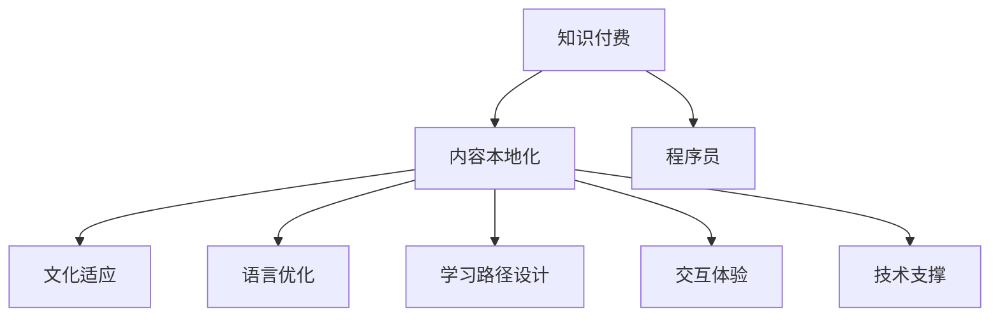

                 

# 程序员知识付费的内容本地化策略

> 关键词：知识付费,内容本地化,程序员,知识变现,教育技术,IT技术,本地化策略

## 1. 背景介绍

### 1.1 问题由来

随着互联网的发展，知识付费成为了一个快速增长的市场。程序员作为知识生产和消费的主力，在这个市场中占据了重要地位。然而，国内的知识付费内容大多以英语为主，国外优秀的教育资源和知识内容难以直接翻译成中文，这不仅限制了国内程序员的学习资源，也难以满足国内市场的需求。同时，由于文化和语言上的差异，直接翻译的内容往往无法达到预期的效果，无法适应国内用户的阅读习惯和理解水平。因此，如何实现程序员知识付费内容的本地化，提升学习效果，成为亟待解决的问题。

### 1.2 问题核心关键点

内容本地化的核心在于理解目标受众的文化和语言特性，并根据这些特性进行内容适配和优化。具体来说，程序员知识付费内容本地化包括以下几个关键点：

1. 文化适应：理解目标受众的文化背景，避免文化冲突。
2. 语言优化：根据目标受众的语言习惯进行语言适配，提高可读性。
3. 学习路径设计：根据目标受众的知识水平和学习习惯，设计合适的学习路径。
4. 交互体验：提升内容的交互性和用户体验，提高学习效果。
5. 技术支撑：使用先进的技术手段实现内容的本地化和优化，提高效率和质量。

这些关键点共同构成了内容本地化的基本框架，对于实现程序员知识付费内容的本地化具有指导意义。

### 1.3 问题研究意义

实现程序员知识付费内容的本地化，对于提升学习效果、促进知识变现、推动教育技术的发展具有重要意义：

1. 提升学习效果：本地化内容更能符合目标受众的文化和语言习惯，减少学习障碍，提高学习效率。
2. 促进知识变现：本地化内容更符合市场需求，有利于提升用户的付费意愿，推动知识变现。
3. 推动教育技术发展：本地化技术的应用，能够推动教育技术的创新和应用，促进教育领域的数字化转型。
4. 满足国内市场需求：国内市场对编程知识的需求量大，实现本地化能够更好地满足市场需求。

## 2. 核心概念与联系

### 2.1 核心概念概述

为更好地理解程序员知识付费内容的本地化策略，本节将介绍几个密切相关的核心概念：

- 知识付费：指用户为获取特定知识和技能，支付一定费用的互联网模式。
- 本地化：指在目标市场本地化内容，以符合目标受众的文化和语言习惯。
- 程序员：指使用计算机编程技能，从事软件开发、维护、测试等技术工作的人员。
- 内容：指知识付费服务中提供的课程、教程、文档、案例等各类学习资料。
- 本地化策略：指为实现内容本地化而采取的具体方法和策略。

这些核心概念之间的逻辑关系可以通过以下Mermaid流程图来展示：



这个流程图展示了一系列关键概念及其之间的关系：

1. 知识付费中的内容需要通过本地化手段，适配目标受众的文化和语言习惯。
2. 本地化内容需要考虑文化适应、语言优化、学习路径设计、交互体验和技术支撑等多个方面。
3. 本地化内容的具体实施需要针对程序员这一特定受众进行针对性的策略设计。

## 3. 核心算法原理 & 具体操作步骤
### 3.1 算法原理概述

程序员知识付费内容本地化的算法原理，可以从以下几个方面进行理解：

1. 目标受众分析：通过用户画像、行为数据等手段，理解目标受众的文化背景、语言习惯和学习需求。
2. 内容适配：根据目标受众的特点，对课程内容进行适配，优化语言表达和文化背景。
3. 学习路径设计：根据目标受众的知识水平和学习习惯，设计合适的学习路径和课程结构。
4. 交互体验优化：引入多媒体、互动问答等手段，提升学习互动性和用户体验。
5. 技术支持：使用数据驱动、机器学习等技术手段，提升内容的适配和优化效果。

这些原理共同构成了程序员知识付费内容本地化的基本框架，对于实现目标受众的本地化具有指导意义。

### 3.2 算法步骤详解

基于上述算法原理，程序员知识付费内容本地化的具体操作步骤可以概括为以下几个步骤：

**Step 1: 目标受众分析**

- 收集目标受众的数据，包括用户画像、行为数据、学习反馈等。
- 使用数据分析工具，对数据进行分析和挖掘，理解目标受众的特点和文化背景。

**Step 2: 内容适配**

- 根据目标受众的特点，对课程内容进行适配，优化语言表达和文化背景。
- 调整课程结构和内容形式，使其符合目标受众的学习习惯和知识水平。

**Step 3: 学习路径设计**

- 根据目标受众的学习需求和知识水平，设计合适的学习路径和课程结构。
- 引入适当的互动练习和实战案例，帮助用户更好地掌握知识。

**Step 4: 交互体验优化**

- 引入多媒体、互动问答等手段，提升学习互动性和用户体验。
- 设计合理的学习进度和反馈机制，及时调整学习路径和内容。

**Step 5: 技术支持**

- 使用数据驱动、机器学习等技术手段，提升内容的适配和优化效果。
- 使用先进的技术手段，实现内容的本地化和优化，提高效率和质量。

### 3.3 算法优缺点

程序员知识付费内容本地化的方法具有以下优点：

1. 提升学习效果：本地化内容更符合目标受众的文化和语言习惯，减少学习障碍，提高学习效率。
2. 促进知识变现：本地化内容更符合市场需求，有利于提升用户的付费意愿，推动知识变现。
3. 推动教育技术发展：本地化技术的应用，能够推动教育技术的创新和应用，促进教育领域的数字化转型。
4. 满足国内市场需求：国内市场对编程知识的需求量大，实现本地化能够更好地满足市场需求。

同时，该方法也存在一定的局限性：

1. 成本较高：本地化需要收集和分析大量的数据，技术实现和内容适配成本较高。
2. 翻译质量难以保证：直接翻译的内容往往难以完全传达原意，需要人工审核和优化。
3. 技术难度大：内容本地化需要涉及多方面的技术和工具，技术实现难度较大。
4. 更新频率较低：本地化内容需要定期更新和维护，工作量较大。

尽管存在这些局限性，但就目前而言，内容本地化仍然是大规模知识付费内容落地的一个重要手段。未来相关研究的重点在于如何进一步降低成本，提升翻译质量和效率，同时兼顾技术实现和用户体验等因素。

### 3.4 算法应用领域

程序员知识付费内容本地化的方法，在教育技术、在线课程、编程培训等多个领域都有广泛的应用，具体包括：

- 在线编程课程：将英文课程适配为中文，提升学习效果，满足国内市场需求。
- 技术培训课程：将技术培训课程本地化，提升培训效果，推动技术知识的传播。
- 开发工具文档：将英文文档本地化，提升用户使用体验，推动工具的普及和应用。
- 技术博客和文章：将英文博客和文章翻译为中文，提高用户阅读体验，扩大受众群体。
- 技术交流社群：将英文社群内容本地化，提升用户参与度，促进技术交流和知识共享。

除了这些常见的应用场景外，本地化方法还可以扩展到更多领域，如企业内训、技术竞赛、开源项目等，提升知识传播和应用的广度和深度。

## 4. 数学模型和公式 & 详细讲解  
### 4.1 数学模型构建

程序员知识付费内容本地化的数学模型，可以从以下几个方面进行构建：

- 用户画像模型：通过收集用户行为数据和反馈信息，构建用户画像模型，理解用户的特点和需求。
- 内容适配模型：构建内容适配模型，根据用户画像对课程内容进行适配和优化。
- 学习路径模型：构建学习路径模型，设计合适的学习路径和课程结构。
- 交互体验模型：构建交互体验模型，提升学习互动性和用户体验。

这些模型通过数据的收集和分析，逐步构建，并不断迭代优化，实现内容的本地化。

### 4.2 公式推导过程

以下我们将以用户画像模型为例，推导其构建的公式。

设用户画像模型为 $P$，其由多个特征向量组成，每个特征向量 $f_i$ 表示用户的一个属性或行为，例如年龄、学习时间、反馈评价等。用户画像模型 $P$ 可以表示为：

$$
P = (f_1, f_2, ..., f_n)
$$

用户画像的构建过程可以通过以下步骤进行：

1. 数据收集：收集用户的学习行为数据、反馈评价、问卷调查等数据。
2. 特征提取：使用特征提取技术，从收集的数据中提取关键特征，形成特征向量。
3. 模型训练：使用机器学习算法，对特征向量进行训练，得到用户画像模型 $P$。

用户画像模型的构建公式可以表示为：

$$
P = \text{Model}(D)
$$

其中 $D$ 为收集到的用户数据集，$\text{Model}$ 为机器学习模型，例如 K-Means 聚类、PCA 降维等。

### 4.3 案例分析与讲解

假设我们收集到一组编程课程的学习数据，通过用户画像模型分析，发现用户年龄分布为18-35岁，平均学习时间为每周10小时，且反馈评价普遍较高。根据这些特点，我们可以选择适配中级难度的课程内容，引入多媒体、互动问答等手段，提升学习互动性和用户体验，同时设计合适的学习路径，例如先学习基础编程知识，再逐步深入。

通过这些适配和优化，我们可以提升课程的本地化效果，更好地满足目标受众的需求。

## 5. 项目实践：代码实例和详细解释说明
### 5.1 开发环境搭建

在进行内容本地化实践前，我们需要准备好开发环境。以下是使用Python进行PyTorch开发的环境配置流程：

1. 安装Anaconda：从官网下载并安装Anaconda，用于创建独立的Python环境。

2. 创建并激活虚拟环境：
```bash
conda create -n pytorch-env python=3.8 
conda activate pytorch-env
```

3. 安装PyTorch：根据CUDA版本，从官网获取对应的安装命令。例如：
```bash
conda install pytorch torchvision torchaudio cudatoolkit=11.1 -c pytorch -c conda-forge
```

4. 安装TensorFlow：由Google主导开发的开源深度学习框架，生产部署方便，适合大规模工程应用。同样有丰富的预训练语言模型资源。

5. 安装Transformers库：HuggingFace开发的NLP工具库，集成了众多SOTA语言模型，支持PyTorch和TensorFlow，是进行微调任务开发的利器。

6. 安装各类工具包：
```bash
pip install numpy pandas scikit-learn matplotlib tqdm jupyter notebook ipython
```

完成上述步骤后，即可在`pytorch-env`环境中开始内容本地化实践。

### 5.2 源代码详细实现

下面我们以编程课程本地化为例，给出使用Transformers库进行内容本地化的PyTorch代码实现。

首先，定义编程课程的数据处理函数：

```python
from transformers import BertTokenizer
from torch.utils.data import Dataset
import torch

class ProgrammingCourseDataset(Dataset):
    def __init__(self, texts, tags, tokenizer, max_len=128):
        self.texts = texts
        self.tags = tags
        self.tokenizer = tokenizer
        self.max_len = max_len
        
    def __len__(self):
        return len(self.texts)
    
    def __getitem__(self, item):
        text = self.texts[item]
        tags = self.tags[item]
        
        encoding = self.tokenizer(text, return_tensors='pt', max_length=self.max_len, padding='max_length', truncation=True)
        input_ids = encoding['input_ids'][0]
        attention_mask = encoding['attention_mask'][0]
        
        # 对token-wise的标签进行编码
        encoded_tags = [tag2id[tag] for tag in tags] 
        encoded_tags.extend([tag2id['O']] * (self.max_len - len(encoded_tags)))
        labels = torch.tensor(encoded_tags, dtype=torch.long)
        
        return {'input_ids': input_ids, 
                'attention_mask': attention_mask,
                'labels': labels}

# 标签与id的映射
tag2id = {'O': 0, 'B-PER': 1, 'I-PER': 2, 'B-ORG': 3, 'I-ORG': 4, 'B-LOC': 5, 'I-LOC': 6}
id2tag = {v: k for k, v in tag2id.items()}

# 创建dataset
tokenizer = BertTokenizer.from_pretrained('bert-base-cased')

train_dataset = ProgrammingCourseDataset(train_texts, train_tags, tokenizer)
dev_dataset = ProgrammingCourseDataset(dev_texts, dev_tags, tokenizer)
test_dataset = ProgrammingCourseDataset(test_texts, test_tags, tokenizer)
```

然后，定义模型和优化器：

```python
from transformers import BertForTokenClassification, AdamW

model = BertForTokenClassification.from_pretrained('bert-base-cased', num_labels=len(tag2id))

optimizer = AdamW(model.parameters(), lr=2e-5)
```

接着，定义训练和评估函数：

```python
from torch.utils.data import DataLoader
from tqdm import tqdm
from sklearn.metrics import classification_report

device = torch.device('cuda') if torch.cuda.is_available() else torch.device('cpu')
model.to(device)

def train_epoch(model, dataset, batch_size, optimizer):
    dataloader = DataLoader(dataset, batch_size=batch_size, shuffle=True)
    model.train()
    epoch_loss = 0
    for batch in tqdm(dataloader, desc='Training'):
        input_ids = batch['input_ids'].to(device)
        attention_mask = batch['attention_mask'].to(device)
        labels = batch['labels'].to(device)
        model.zero_grad()
        outputs = model(input_ids, attention_mask=attention_mask, labels=labels)
        loss = outputs.loss
        epoch_loss += loss.item()
        loss.backward()
        optimizer.step()
    return epoch_loss / len(dataloader)

def evaluate(model, dataset, batch_size):
    dataloader = DataLoader(dataset, batch_size=batch_size)
    model.eval()
    preds, labels = [], []
    with torch.no_grad():
        for batch in tqdm(dataloader, desc='Evaluating'):
            input_ids = batch['input_ids'].to(device)
            attention_mask = batch['attention_mask'].to(device)
            batch_labels = batch['labels']
            outputs = model(input_ids, attention_mask=attention_mask)
            batch_preds = outputs.logits.argmax(dim=2).to('cpu').tolist()
            batch_labels = batch_labels.to('cpu').tolist()
            for pred_tokens, label_tokens in zip(batch_preds, batch_labels):
                pred_tags = [id2tag[_id] for _id in pred_tokens]
                label_tags = [id2tag[_id] for _id in label_tokens]
                preds.append(pred_tags[:len(label_tags)])
                labels.append(label_tags)
                
    print(classification_report(labels, preds))
```

最后，启动训练流程并在测试集上评估：

```python
epochs = 5
batch_size = 16

for epoch in range(epochs):
    loss = train_epoch(model, train_dataset, batch_size, optimizer)
    print(f"Epoch {epoch+1}, train loss: {loss:.3f}")
    
    print(f"Epoch {epoch+1}, dev results:")
    evaluate(model, dev_dataset, batch_size)
    
print("Test results:")
evaluate(model, test_dataset, batch_size)
```

以上就是使用PyTorch对编程课程进行本地化的完整代码实现。可以看到，得益于Transformers库的强大封装，我们可以用相对简洁的代码完成编程课程的本地化。

### 5.3 代码解读与分析

让我们再详细解读一下关键代码的实现细节：

**ProgrammingCourseDataset类**：
- `__init__`方法：初始化文本、标签、分词器等关键组件。
- `__len__`方法：返回数据集的样本数量。
- `__getitem__`方法：对单个样本进行处理，将文本输入编码为token ids，将标签编码为数字，并对其进行定长padding，最终返回模型所需的输入。

**tag2id和id2tag字典**：
- 定义了标签与数字id之间的映射关系，用于将token-wise的预测结果解码回真实的标签。

**训练和评估函数**：
- 使用PyTorch的DataLoader对数据集进行批次化加载，供模型训练和推理使用。
- 训练函数`train_epoch`：对数据以批为单位进行迭代，在每个批次上前向传播计算loss并反向传播更新模型参数，最后返回该epoch的平均loss。
- 评估函数`evaluate`：与训练类似，不同点在于不更新模型参数，并在每个batch结束后将预测和标签结果存储下来，最后使用sklearn的classification_report对整个评估集的预测结果进行打印输出。

**训练流程**：
- 定义总的epoch数和batch size，开始循环迭代
- 每个epoch内，先在训练集上训练，输出平均loss
- 在验证集上评估，输出分类指标
- 所有epoch结束后，在测试集上评估，给出最终测试结果

可以看到，PyTorch配合Transformers库使得编程课程的本地化代码实现变得简洁高效。开发者可以将更多精力放在数据处理、模型改进等高层逻辑上，而不必过多关注底层的实现细节。

当然，工业级的系统实现还需考虑更多因素，如模型的保存和部署、超参数的自动搜索、更灵活的任务适配层等。但核心的本地化范式基本与此类似。

## 6. 实际应用场景
### 6.1 智能编程辅助

基于本地化的编程课程，智能编程辅助工具可以快速帮助程序员提升编程技能。例如，编写本地化的编程指南、构建本地化的在线编程环境、提供本地化的编程课程等，可以帮助程序员快速掌握新技术和框架，提高开发效率。

### 6.2 编程教育平台

本地化的编程教育平台可以更好地服务国内的学生和教师。例如，将编程课程本地化，使其更符合国内的教育体系和教学方法，同时引入互动问答、实时反馈等手段，提升学习效果。

### 6.3 企业内训和编程培训

本地化的编程培训课程可以更好地满足企业内训和编程培训的需求。例如，将编程课程本地化，使其更符合企业内部的技术栈和应用场景，同时提供定制化的编程培训服务，帮助企业员工提升技术水平。

### 6.4 开源社区和开源项目

本地化的开源社区和开源项目可以更好地服务国内开发者。例如，将开源项目文档本地化，使其更符合国内开发者的语言习惯，同时提供本地化的编程工具和库，提高开发效率。

### 6.5 未来应用展望

随着本地化技术的发展，基于本地化的程序员知识付费内容将有更广阔的应用前景。未来，本地化技术将在以下几个方面得到应用：

- 编程课程：将编程课程本地化，使其更符合国内的教育体系和教学方法，提升学习效果。
- 技术培训：将技术培训课程本地化，提升培训效果，推动技术知识的传播。
- 开源社区：将开源项目文档本地化，提高开发效率，服务国内开发者。
- 企业内训：将编程课程本地化，满足企业内训和编程培训的需求，提升员工技术水平。

## 7. 工具和资源推荐
### 7.1 学习资源推荐

为了帮助开发者系统掌握程序员知识付费内容的本地化技术，这里推荐一些优质的学习资源：

1. 《Transformer从原理到实践》系列博文：由大模型技术专家撰写，深入浅出地介绍了Transformer原理、BERT模型、本地化技术等前沿话题。

2. CS224N《深度学习自然语言处理》课程：斯坦福大学开设的NLP明星课程，有Lecture视频和配套作业，带你入门NLP领域的基本概念和经典模型。

3. 《Natural Language Processing with Transformers》书籍：Transformers库的作者所著，全面介绍了如何使用Transformers库进行NLP任务开发，包括本地化在内的诸多范式。

4. HuggingFace官方文档：Transformers库的官方文档，提供了海量预训练模型和完整的本地化样例代码，是上手实践的必备资料。

5. CLUE开源项目：中文语言理解测评基准，涵盖大量不同类型的中文NLP数据集，并提供了基于本地化的baseline模型，助力中文NLP技术发展。

通过对这些资源的学习实践，相信你一定能够快速掌握程序员知识付费内容的本地化技术，并用于解决实际的NLP问题。
###  7.2 开发工具推荐

高效的开发离不开优秀的工具支持。以下是几款用于程序员知识付费内容本地化开发的常用工具：

1. PyTorch：基于Python的开源深度学习框架，灵活动态的计算图，适合快速迭代研究。大部分预训练语言模型都有PyTorch版本的实现。

2. TensorFlow：由Google主导开发的开源深度学习框架，生产部署方便，适合大规模工程应用。同样有丰富的预训练语言模型资源。

3. Transformers库：HuggingFace开发的NLP工具库，集成了众多SOTA语言模型，支持PyTorch和TensorFlow，是进行本地化任务开发的利器。

4. Weights & Biases：模型训练的实验跟踪工具，可以记录和可视化模型训练过程中的各项指标，方便对比和调优。与主流深度学习框架无缝集成。

5. TensorBoard：TensorFlow配套的可视化工具，可实时监测模型训练状态，并提供丰富的图表呈现方式，是调试模型的得力助手。

6. Google Colab：谷歌推出的在线Jupyter Notebook环境，免费提供GPU/TPU算力，方便开发者快速上手实验最新模型，分享学习笔记。

合理利用这些工具，可以显著提升程序员知识付费内容的本地化开发效率，加快创新迭代的步伐。

### 7.3 相关论文推荐

程序员知识付费内容本地化的研究源于学界的持续研究。以下是几篇奠基性的相关论文，推荐阅读：

1. Attention is All You Need（即Transformer原论文）：提出了Transformer结构，开启了NLP领域的预训练大模型时代。

2. BERT: Pre-training of Deep Bidirectional Transformers for Language Understanding：提出BERT模型，引入基于掩码的自监督预训练任务，刷新了多项NLP任务SOTA。

3. Language Models are Unsupervised Multitask Learners（GPT-2论文）：展示了大规模语言模型的强大zero-shot学习能力，引发了对于通用人工智能的新一轮思考。

4. Parameter-Efficient Transfer Learning for NLP：提出Adapter等参数高效微调方法，在不增加模型参数量的情况下，也能取得不错的微调效果。

5. Prefix-Tuning: Optimizing Continuous Prompts for Generation：引入基于连续型Prompt的本地化方法，为如何更好地利用预训练知识提供了新的思路。

6. AdaLoRA: Adaptive Low-Rank Adaptation for Parameter-Efficient Fine-Tuning：使用自适应低秩适应的本地化方法，在参数效率和精度之间取得了新的平衡。

这些论文代表了大语言模型本地化技术的发展脉络。通过学习这些前沿成果，可以帮助研究者把握学科前进方向，激发更多的创新灵感。

## 8. 总结：未来发展趋势与挑战

### 8.1 总结

本文对程序员知识付费内容的本地化方法进行了全面系统的介绍。首先阐述了本地化的背景和意义，明确了本地化在提升学习效果、促进知识变现、推动教育技术发展等方面的重要作用。其次，从原理到实践，详细讲解了本地化的数学模型和操作步骤，给出了本地化任务开发的完整代码实例。同时，本文还广泛探讨了本地化方法在智能编程辅助、编程教育平台、企业内训等多个领域的应用前景，展示了本地化范式的巨大潜力。此外，本文精选了本地化技术的各类学习资源，力求为读者提供全方位的技术指引。

通过本文的系统梳理，可以看到，程序员知识付费内容的本地化方法正在成为知识付费行业的重要范式，极大地拓展了知识传播和应用的边界，为程序员提供更加高效便捷的学习资源。未来，随着本地化技术的不断演进，基于本地化的程序员知识付费内容必将在更多的领域得到应用，为教育技术、编程教育等领域带来新的变革。

### 8.2 未来发展趋势

程序员知识付费内容本地化的未来发展趋势主要包括以下几个方面：

1. 技术不断进步：本地化技术将不断进步，实现更加高效、自动化的内容适配和优化。

2. 场景多样化：本地化技术将应用于更多场景，包括编程课程、技术培训、开源社区等，推动知识传播的普及。

3. 数据驱动：本地化技术将更加依赖数据驱动，通过数据分析和机器学习，实现更加精准的内容适配。

4. 交互性提升：本地化技术将引入更多的交互性手段，提升学习互动性和用户体验。

5. 国际化拓展：本地化技术将向国际化方向拓展，推动全球范围内的知识共享和传播。

6. 个性化定制：本地化技术将实现更加个性化的内容适配，根据用户特点和学习需求，提供定制化的学习资源。

以上趋势凸显了程序员知识付费内容本地化的广阔前景。这些方向的探索发展，必将进一步提升知识传播和应用的效果，为程序员提供更加高效便捷的学习资源。

### 8.3 面临的挑战

尽管本地化技术已经取得了显著进展，但在实现过程中仍面临诸多挑战：

1. 成本较高：本地化需要收集和分析大量的数据，技术实现和内容适配成本较高。

2. 翻译质量难以保证：直接翻译的内容往往难以完全传达原意，需要人工审核和优化。

3. 技术难度大：本地化技术涉及多方面的技术和工具，技术实现难度较大。

4. 更新频率较低：本地化内容需要定期更新和维护，工作量较大。

尽管存在这些挑战，但就目前而言，本地化技术仍然是大规模知识付费内容落地的一个重要手段。未来相关研究的重点在于如何进一步降低成本，提升翻译质量和效率，同时兼顾技术实现和用户体验等因素。

### 8.4 研究展望

面向未来，本地化技术的研究需要在以下几个方面寻求新的突破：

1. 探索无监督和半监督本地化方法：摆脱对大规模标注数据的依赖，利用自监督学习、主动学习等无监督和半监督范式，最大限度利用非结构化数据，实现更加灵活高效的本地化。

2. 研究参数高效和计算高效的本地化范式：开发更加参数高效的本地化方法，在固定大部分预训练参数的同时，只更新极少量的任务相关参数。同时优化本地化模型的计算图，减少前向传播和反向传播的资源消耗，实现更加轻量级、实时性的部署。

3. 引入更多先验知识：将符号化的先验知识，如知识图谱、逻辑规则等，与神经网络模型进行巧妙融合，引导本地化过程学习更准确、合理的语言模型。同时加强不同模态数据的整合，实现视觉、语音等多模态信息与文本信息的协同建模。

4. 结合因果分析和博弈论工具：将因果分析方法引入本地化模型，识别出模型决策的关键特征，增强输出解释的因果性和逻辑性。借助博弈论工具刻画人机交互过程，主动探索并规避模型的脆弱点，提高系统稳定性。

5. 纳入伦理道德约束：在本地化模型的训练目标中引入伦理导向的评估指标，过滤和惩罚有偏见、有害的输出倾向。同时加强人工干预和审核，建立本地化模型的监管机制，确保输出符合人类价值观和伦理道德。

这些研究方向的探索，必将引领本地化技术迈向更高的台阶，为程序员知识付费内容的本地化提供更加全面、高效、可靠的技术支持。

## 9. 附录：常见问题与解答

**Q1：本地化技术的主要挑战是什么？**

A: 本地化技术的主要挑战包括成本较高、翻译质量难以保证、技术难度大、更新频率较低等。这些挑战需要通过技术创新、数据驱动、人性化设计等手段加以克服，以实现更加高效、精准的本地化。

**Q2：本地化技术在未来有哪些发展方向？**

A: 本地化技术在未来的发展方向主要包括技术进步、场景多样化、数据驱动、交互性提升、国际化拓展和个性化定制等。这些方向将进一步推动本地化技术的发展，提升本地化内容的适配和优化效果，为程序员知识付费内容本地化提供更加全面、高效、可靠的技术支持。

**Q3：本地化技术有哪些实际应用场景？**

A: 本地化技术在实际应用场景中包括智能编程辅助、编程教育平台、企业内训和编程培训、开源社区和开源项目等。这些场景的本地化技术应用，可以更好地服务程序员，提升学习效果、推动技术传播、服务企业内训和开发社区。

**Q4：本地化技术对程序员有哪些好处？**

A: 本地化技术对程序员的好处主要包括提升学习效果、促进知识变现、推动技术传播、服务企业内训和开发社区等。通过本地化技术，程序员可以更方便地获取优质的学习资源，提升技术水平，推动技术知识的传播和应用，服务企业和开发社区。

**Q5：本地化技术对知识付费行业有哪些影响？**

A: 本地化技术对知识付费行业的影响主要体现在推动内容本地化、提升学习效果、促进知识传播、服务企业内训和开发社区等方面。通过本地化技术，知识付费平台可以更好地服务国内市场，提升用户满意度，推动知识付费行业的健康发展。

---

作者：禅与计算机程序设计艺术 / Zen and the Art of Computer Programming

