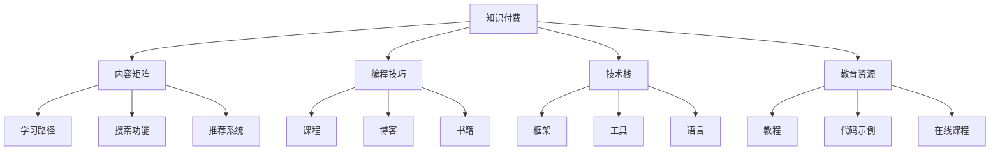

                 

# 程序员知识付费的内容矩阵构建

> 关键词：程序员,知识付费,内容矩阵,编程技巧,技术栈

## 1. 背景介绍

### 1.1 问题由来

随着信息技术的快速发展，程序员的知识体系正处于快速变化之中。一方面，新技术层出不穷，开发者需要不断学习和更新自己的技能才能保持竞争力；另一方面，学习资源也日益丰富，但分散且零散的资源使得开发者难以系统性地掌握新知。知识付费的兴起为解决这一问题提供了新的解决方案。

知识付费平台通过整合优质资源，提供系统性的学习路径，满足程序员对深度知识的需求。同时，知识付费也带来了新的商业模式，推动了教育技术和内容产业的发展。但如何构建有效的知识付费内容体系，使其既满足用户需求，又具有商业可持续性，是当前面临的重要挑战。

### 1.2 问题核心关键点

构建知识付费内容矩阵的核心在于：
- 如何获取高质量的教育资源，满足用户需求？
- 如何将这些资源系统化、结构化地呈现给用户？
- 如何结合商业逻辑，实现平台和内容创作者的共赢？

## 2. 核心概念与联系

### 2.1 核心概念概述

为更好地理解知识付费内容矩阵的构建，本节将介绍几个密切相关的核心概念：

- **知识付费（Knowledge-Paying）**：指用户为获取深度、系统的学习内容而支付费用的模式。知识付费平台通过整合教育资源，提供有价值的学习服务。
- **内容矩阵（Content Matrix）**：指将多种类型的学习内容（如视频课程、文档、直播等）按照用户需求和学习路径进行组合和关联，形成系统的知识结构。
- **编程技巧（Programming Skills）**：指编程中常见的技能和技巧，如数据结构与算法、面向对象编程、软件工程等。
- **技术栈（Technology Stack）**：指软件开发中使用的多种工具、框架和语言的组合，如前端（HTML/CSS/JS）、后端（Python/Java）、数据库（MySQL/PostgreSQL）等。
- **教育资源（Educational Resources）**：指可用于学习编程技巧和技术栈的各种材料，如教程、代码示例、书籍、在线课程等。

这些概念之间的关系可以通过以下Mermaid流程图来展示：



这个流程图展示的知识付费内容矩阵构建的关键要素：

1. 知识付费平台作为连接用户与教育资源的桥梁。
2. 编程技巧和技术栈作为知识付费内容的基础单元。
3. 教育资源被整合为各种形式的学习材料。
4. 内容矩阵通过学习路径、搜索和推荐系统将教育资源系统化。

## 3. 核心算法原理 & 具体操作步骤
### 3.1 算法原理概述

知识付费内容矩阵的构建，本质上是一个教育资源的系统化、结构化过程。其核心思想是：将各类教育资源按照编程技巧和技术栈进行分类和关联，构建系统的学习路径，并通过搜索和推荐系统将资源以最优的方式呈现给用户。

形式化地，假设教育资源集合为 $R$，编程技巧和技术栈集合为 $S$。构建内容矩阵的目标是找到 $R$ 和 $S$ 的映射关系 $M$，使得：

$$
M: R \times S \rightarrow \text{Learning Path}
$$

其中，$\text{Learning Path}$ 表示系统的学习路径，包括从基础到高级的多个阶段。

### 3.2 算法步骤详解

知识付费内容矩阵的构建一般包括以下几个关键步骤：

**Step 1: 资源获取与分类**

- **资源获取**：通过技术栈或编程技巧为标准，采集各种教育资源。如通过爬虫技术自动抓取开源课程、社区讨论、书籍推荐等资源。
- **资源分类**：对采集到的资源进行分类和标注。如将Python编程教程、Java课程视频等分别归类到Python和Java技术栈下。

**Step 2: 内容关联与结构化**

- **内容关联**：根据编程技巧和技术栈，将分类好的资源进行关联。如将Python基础教程、数据结构与算法、Web开发等关联起来，形成完整的学习路径。
- **内容结构化**：将关联好的内容结构化，构建系统的学习路径。如从Python基础到高级、从Web开发到数据科学等，设计合理的层次结构和阶段。

**Step 3: 系统搭建与功能实现**

- **搜索功能**：实现用户根据关键字搜索教育资源的系统。如用户输入“Python编程”，系统返回相关的教程、视频、书籍等。
- **推荐系统**：构建基于用户行为和偏好，推荐个性化教育资源的系统。如根据用户学习路径推荐下一阶段的课程。
- **学习路径设计**：设计从基础到高级的学习路径，如Python基础 -> 数据结构 -> Web开发 -> 数据科学等。

**Step 4: 用户交互与反馈**

- **用户反馈**：收集用户的学习反馈，如完成度、满意度、评价等，用于优化内容和推荐算法。
- **动态调整**：根据用户反馈和学习进度，动态调整推荐内容和路径。如用户在某阶段停留时间过长，系统推荐更高级的课程。

**Step 5: 平台部署与运营**

- **平台部署**：将搭建好的系统部署到云端或本地服务器，提供服务。
- **用户运营**：持续运营平台，不断更新资源和算法模型，提升用户体验。

### 3.3 算法优缺点

知识付费内容矩阵的构建方法具有以下优点：
- **系统化**：将各类教育资源按照编程技巧和技术栈进行关联，形成系统的学习路径，方便用户系统化学习。
- **个性化**：通过搜索和推荐系统，能够提供个性化推荐，满足用户个性化需求。
- **高效性**：节省用户搜索和筛选资源的时间，提升学习效率。

但该方法也存在一定的局限性：
- **资源获取难度**：需要投入大量时间和人力进行资源采集和分类。
- **内容关联复杂性**：不同编程技巧和技术栈之间的关联需要大量的人工标注和知识积累。
- **推荐系统复杂性**：推荐算法的优化和调参需要较高的技术门槛。

尽管存在这些局限性，但就目前而言，构建知识付费内容矩阵仍是大数据和人工智能技术落地应用的重要方向之一。未来相关研究的重点在于如何进一步降低资源获取难度，提高内容关联的自动化程度，以及优化推荐算法，提升用户体验。

### 3.4 算法应用领域

知识付费内容矩阵的构建方法在教育和技术领域得到了广泛应用，包括但不限于以下几个方向：

- **编程教育**：构建Python、Java、Web开发等编程技巧和技术栈的学习路径，满足不同层次的程序员需求。
- **数据科学**：将数据结构与算法、机器学习、深度学习等知识结构化，形成系统的学习路径。
- **前端开发**：涵盖HTML/CSS/JS、前端框架等技术栈，提供全面的前端开发教程。
- **后端开发**：涉及Python、Java、Node.js等编程语言和技术栈，构建后端开发的学习路径。
- **软件工程**：覆盖项目管理、测试、部署等全栈软件开发知识，提供系统化的学习路径。

除了上述这些经典领域，知识付费内容矩阵还可以应用于更多场景中，如自动化运维、云计算、物联网等新兴技术领域，为学习者提供更加全面、系统的教育资源。

## 4. 数学模型和公式 & 详细讲解 & 举例说明
### 4.1 数学模型构建

本节将使用数学语言对知识付费内容矩阵构建过程进行更加严格的刻画。

记教育资源集合为 $R=\{r_1, r_2, \cdots, r_N\}$，其中 $r_i$ 表示第 $i$ 个教育资源。假设资源分类后属于 $S$ 个编程技巧和技术栈，$S$ 为资源-技巧的映射关系，即 $R \rightarrow S$。

内容矩阵的构建目标是为每个编程技巧和技术栈 $s$，找到最佳的学习路径 $L_s$，满足：

$$
L_s: R \rightarrow L_s = \{r_1, r_2, \cdots, r_M\}
$$

其中 $M$ 为第 $s$ 个技巧和技术栈对应的资源数量。

### 4.2 公式推导过程

以Python编程为例，推导内容矩阵的构建公式。

假设资源集合 $R$ 中共有 $N$ 个Python编程教程，每个教程的学习难度不同，用 $D_i$ 表示第 $i$ 个教程的难度系数。设 $s$ 为Python编程技巧和技术栈，则学习路径 $L_s$ 为：

$$
L_s = \{r_i \in R | D_i < D_{i+1}\}
$$

其中 $D_{N+1}$ 表示最高难度系数的教程。

为了简化问题，假设每个教程的学习难度系数为等差数列，设第一课的难度系数为 $D_1=1$，公差为 $d$，则第 $i$ 课的难度系数为：

$$
D_i = 1 + (i-1)d
$$

设 $D_{N+1}$ 为最高难度系数的教程，即：

$$
D_{N+1} = 1 + (N-1)d
$$

根据等差数列的性质，有：

$$
D_{N+1} = 1 + (N-1)d = 1 + (N-2)d + d = 1 + \frac{N-2}{N-1}d + d = 1 + \frac{N}{N-1}d
$$

解得 $d = \frac{D_{N+1}-1}{N}$，即每课的难度系数递增量为：

$$
d = \frac{D_{N+1}-1}{N}
$$

代入学习路径公式：

$$
L_s = \{r_i \in R | D_i < 1 + \frac{N}{N-1}d\}
$$

即学习路径 $L_s$ 包含所有难度系数小于最高难度系数的教程。

### 4.3 案例分析与讲解

假设某知识付费平台收集了100个Python编程教程，难度系数从1到100，公差为1。

**示例1: 初学者路径**
- 难度系数 $D_1=1, D_{100}=100$，取 $d = \frac{100-1}{100}=0.99$
- 学习路径 $L_s$ 包含所有难度系数小于 $1 + \frac{100}{99} \times 0.99 = 1.99$ 的教程，即 $L_s = \{r_1, r_2, \cdots, r_{199}\}$

**示例2: 高级者路径**
- 难度系数 $D_1=1, D_{100}=100$，取 $d = \frac{100-1}{100}=0.99$
- 学习路径 $L_s$ 包含所有难度系数小于 $1 + \frac{100}{99} \times 0.99 = 1.99$ 的教程，即 $L_s = \{r_{901}, r_{902}, \cdots, r_{1000}\}$

## 5. 项目实践：代码实例和详细解释说明
### 5.1 开发环境搭建

在进行知识付费内容矩阵构建实践前，我们需要准备好开发环境。以下是使用Python进行Django开发的环境配置流程：

1. 安装Anaconda：从官网下载并安装Anaconda，用于创建独立的Python环境。

2. 创建并激活虚拟环境：
```bash
conda create -n django-env python=3.8 
conda activate django-env
```

3. 安装Django：
```bash
pip install django
```

4. 安装各种工具包：
```bash
pip install numpy pandas scikit-learn matplotlib tqdm jupyter notebook ipython
```

完成上述步骤后，即可在`django-env`环境中开始内容矩阵构建实践。

### 5.2 源代码详细实现

下面我们以Python编程教程为例，给出使用Django构建知识付费内容矩阵的Python代码实现。

首先，定义教育资源的模型和数据迁移文件：

```python
from django.db import models

class Resource(models.Model):
    title = models.CharField(max_length=255)
    url = models.URLField()
    description = models.TextField()
    category = models.CharField(max_length=255)
    created_at = models.DateTimeField(auto_now_add=True)

    class Meta:
        verbose_name = 'Resource'
        verbose_name_plural = 'Resources'

class Category(models.Model):
    name = models.CharField(max_length=255)
    resources = models.ManyToManyField(Resource)

    class Meta:
        verbose_name = 'Category'
        verbose_name_plural = 'Categories'
```

然后，定义搜索和推荐功能的视图和模板：

```python
from django.shortcuts import render
from django.db.models import Q
from django.views.generic import ListView, DetailView

def search(request):
    query = request.GET.get('q')
    results = Resource.objects.filter(Q(title__icontains=query) | Q(description__icontains=query) | Q(category__icontains=query))
    return render(request, 'search.html', {'results': results})

class ResourceDetailView(DetailView):
    model = Resource
    template_name = 'resource_detail.html'

    def get_context_data(self, **kwargs):
        context = super().get_context_data(**kwargs)
        category = self.object.category
        context['related_resources'] = category.resources.exclude(id=self.object.id).order_by('?')
        return context

def recommend(request):
    user = request.user
    category = user.selected_category
    results = category.resources.order_by('?').exclude(id=user.resource.id)[:5]
    return render(request, 'recommend.html', {'results': results})
```

最后，定义用户注册和登录功能：

```python
from django.contrib.auth.forms import UserCreationForm, AuthenticationForm
from django.contrib.auth import login, authenticate
from django.shortcuts import redirect

def register(request):
    if request.method == 'POST':
        form = UserCreationForm(request.POST)
        if form.is_valid():
            form.save()
            username = form.cleaned_data.get('username')
            raw_password = form.cleaned_data.get('password1')
            user = authenticate(username=username, password=raw_password)
            login(request, user)
            return redirect('home')
    else:
        form = UserCreationForm()
    return render(request, 'register.html', {'form': form})

def login_view(request):
    if request.method == 'POST':
        username = request.POST['username']
        password = request.POST['password']
        user = authenticate(username=username, password=password)
        if user is not None:
            login(request, user)
            return redirect('home')
    return render(request, 'login.html')
```

以上就是使用Django构建知识付费内容矩阵的完整代码实现。可以看到，通过Django的强大视图和模板系统，我们能够快速搭建起搜索和推荐功能，为平台用户提供系统化的学习路径。

### 5.3 代码解读与分析

让我们再详细解读一下关键代码的实现细节：

**Resource模型**：
- `title`：资源标题，用于搜索结果的展示。
- `url`：资源链接，指向在线教程或文档。
- `description`：资源简介，提供资源内容的简要描述。
- `category`：资源分类，用于搜索和推荐。
- `created_at`：资源创建时间，用于时间线展示。

**Category模型**：
- `name`：分类名称，如Python基础、数据结构等。
- `resources`：与资源模型的多对多关系，用于构建学习路径。

**search视图**：
- 获取用户输入的查询字符串 `q`，在数据库中搜索包含查询词的资源。
- 返回搜索结果页，显示匹配的资源列表。

**ResourceDetailView视图**：
- 获取资源的分类信息，并根据用户当前选定的分类，推荐相关的其他资源。
- 展示选定资源的详细信息，包括分类下的其他相关资源。

**register和login视图**：
- 用户注册和登录功能，用于平台的用户管理。

以上代码实现了搜索、推荐、用户管理等核心功能，为知识付费平台的内容矩阵构建打下了坚实的基础。

## 6. 实际应用场景
### 6.1 智能推荐系统

智能推荐系统是大数据和人工智能技术的重要应用之一，也是知识付费内容矩阵的关键组成部分。通过对用户行为和偏好的分析，推荐系统能够个性化地呈现学习资源，提高用户的学习效率和满意度。

例如，在Python编程教程的推荐系统中，系统可以根据用户的历史学习记录和浏览行为，推荐其感兴趣的高质量教程。用户可以使用搜索功能，通过输入特定的编程技巧或技术栈，获取相关的高阶教程。同时，推荐系统还可以根据用户的学习进度和掌握程度，动态调整推荐内容，帮助用户快速掌握新知识。

### 6.2 学习路径规划

学习路径规划是知识付费内容矩阵的核心功能之一。通过将教育资源系统化、结构化，学习路径规划能够帮助用户制定高效的学习计划，逐步提升技能水平。

例如，Python编程学习路径可以包括基础语法 -> 数据结构 -> 面向对象 -> 框架 -> 高级技术栈。用户可以根据自身需求和学习进度，选择相应的学习路径，逐步提升Python编程技能。平台还可以根据用户的学习进度，动态调整学习路径，引导用户进入下一阶段的学习。

### 6.3 知识图谱构建

知识图谱是一种结构化的知识表示方式，能够帮助用户更好地理解和关联各类学习资源。通过构建知识图谱，知识付费平台可以将不同课程、书籍、文章等资源进行关联，形成系统的知识体系。

例如，在数据科学领域，平台可以构建包含数据结构、算法、机器学习、深度学习等多个维度的知识图谱。用户可以通过图谱进行探索，找到相关领域的核心课程和书籍，系统地掌握数据科学技能。

### 6.4 未来应用展望

随着知识付费平台的发展，内容矩阵构建的应用场景将不断拓展，涉及更多领域和用户需求。未来，知识付费平台有望在以下几个方向实现新的突破：

- **跨领域知识整合**：将不同领域的知识进行整合，形成跨学科的知识体系，满足用户的多样化需求。
- **实时动态更新**：通过AI算法，实时动态更新内容矩阵和推荐系统，保证平台内容的先进性和时效性。
- **用户行为分析**：利用大数据和机器学习技术，深入分析用户行为，提供更加个性化、精准的推荐服务。
- **虚拟导师辅助**：引入虚拟导师系统，实时解答用户疑问，提升学习体验。

## 7. 工具和资源推荐
### 7.1 学习资源推荐

为了帮助开发者系统掌握知识付费内容矩阵构建的理论基础和实践技巧，这里推荐一些优质的学习资源：

1. **《Python编程：从入门到实践》**：Python编程基础教程，适合初学者入门。
2. **Coursera《Machine Learning》课程**：斯坦福大学的机器学习课程，深入浅出地介绍了机器学习算法和应用。
3. **Udacity《Python for Data Science》纳米学位**：结合Python和数据科学，系统学习数据处理和分析。
4. **Kaggle**：全球最大的数据科学竞赛平台，提供丰富的学习资源和实战项目。
5. **GitHub**：开源代码托管平台，可以获取大量编程教程和开源项目，供开发者学习和参考。

通过对这些资源的学习实践，相信你一定能够快速掌握知识付费内容矩阵构建的精髓，并用于解决实际问题。
###  7.2 开发工具推荐

高效的开发离不开优秀的工具支持。以下是几款用于知识付费内容矩阵构建开发的常用工具：

1. **Django**：Python的Web开发框架，具有灵活的视图和模板系统，适合构建复杂的功能模块。
2. **Flask**：Python的轻量级Web框架，灵活性高，适用于小型应用和API开发。
3. **React**：JavaScript的前端框架，用于构建动态和交互式的Web应用。
4. **Vue**：JavaScript的前端框架，易学易用，适用于构建复杂的前端应用。
5. **TensorFlow**：Google开源的机器学习框架，支持深度学习模型的开发和训练。
6. **PyTorch**：Facebook开源的深度学习框架，具有动态计算图和易用性，适合学术研究和工程开发。

合理利用这些工具，可以显著提升知识付费内容矩阵构建的开发效率，加快创新迭代的步伐。

### 7.3 相关论文推荐

知识付费内容矩阵构建涉及大数据、人工智能和机器学习等多个领域的交叉研究，以下是几篇奠基性的相关论文，推荐阅读：

1. **《Deep Learning》**：Ian Goodfellow等著，深度学习领域的经典教材，介绍了深度学习的理论和应用。
2. **《Neural Networks and Deep Learning》**：Michael Nielsen著，介绍了神经网络和深度学习的基本概念和实现方法。
3. **《Machine Learning Yearning》**：Andrew Ng著，关于机器学习的实用指南，介绍了机器学习模型的设计和优化。
4. **《推荐系统》**：Wang Nan、Wang Jun著，介绍了推荐系统的基础理论、算法设计和实际应用。
5. **《深度学习与数据挖掘》**：刘建平著，结合深度学习和数据挖掘，系统介绍了相关技术和应用。

这些论文代表了大数据和人工智能技术在知识付费内容矩阵构建领域的研究方向。通过学习这些前沿成果，可以帮助研究者把握学科前进方向，激发更多的创新灵感。

## 8. 总结：未来发展趋势与挑战
### 8.1 总结

本文对知识付费内容矩阵构建方法进行了全面系统的介绍。首先阐述了知识付费的背景和意义，明确了内容矩阵在知识付费平台中的核心作用。其次，从原理到实践，详细讲解了内容矩阵的构建过程，包括资源获取、分类、关联和结构化等关键步骤。同时，本文还广泛探讨了内容矩阵在智能推荐、学习路径规划、知识图谱构建等多个应用场景中的实际价值，展示了内容矩阵构建的广泛应用前景。此外，本文精选了知识付费内容矩阵构建的各类学习资源，力求为读者提供全方位的技术指引。

通过本文的系统梳理，可以看到，知识付费内容矩阵构建方法在大数据和人工智能技术落地应用中起到了重要的作用。这些方法和技术不仅提升了用户的学习效率，还为知识付费平台的商业价值提供了坚实的基础。未来，伴随技术的不断演进，知识付费内容矩阵将进一步拓展应用边界，推动教育技术的深度发展。

### 8.2 未来发展趋势

展望未来，知识付费内容矩阵构建技术将呈现以下几个发展趋势：

1. **数据驱动的智能化**：通过大数据和人工智能技术，深度分析用户行为和学习路径，提供更加精准的推荐和个性化服务。
2. **多模态知识的整合**：将文本、图像、视频等多模态数据进行整合，构建更加全面、丰富的知识体系。
3. **跨学科的知识网络**：构建跨学科的知识网络，满足用户多领域、多学科的学习需求。
4. **实时动态更新**：通过机器学习算法，实时动态更新内容矩阵和推荐系统，保证平台内容的先进性和时效性。
5. **虚拟导师和智能辅助**：引入虚拟导师和智能辅助系统，实时解答用户疑问，提升学习体验。

以上趋势凸显了知识付费内容矩阵构建技术的广阔前景。这些方向的探索发展，必将进一步提升知识付费平台的用户体验，推动教育技术的创新和应用。

### 8.3 面临的挑战

尽管知识付费内容矩阵构建技术已经取得了一定的进展，但在迈向更加智能化、普适化应用的过程中，它仍面临着诸多挑战：

1. **数据获取和标注难度**：高质量教育资源的获取和标注需要大量人力和时间投入，难以大规模扩展。
2. **内容关联复杂性**：不同领域、不同难度和不同类型的资源关联复杂，需要大量的专家知识和智能算法。
3. **推荐系统优化**：推荐算法需要不断优化和调参，才能提供精准的个性化服务。
4. **系统性能和稳定性**：内容矩阵和推荐系统需要高效、稳定地运行，才能满足大量用户需求。
5. **用户隐私和数据安全**：平台需要严格保护用户隐私和数据安全，防止数据泄露和滥用。

这些挑战需要研究者和技术开发者不断优化和改进，才能确保知识付费内容矩阵构建的可行性和可持续性。

### 8.4 研究展望

面对知识付费内容矩阵构建所面临的挑战，未来的研究需要在以下几个方面寻求新的突破：

1. **自动化资源获取和标注**：利用自动化技术和数据挖掘算法，减少人工标注和数据获取的难度。
2. **智能推荐算法优化**：开发更加智能的推荐算法，如协同过滤、矩阵分解等，提升推荐精度和效率。
3. **多模态知识融合**：将文本、图像、视频等多种数据进行融合，构建更加全面、系统的知识体系。
4. **实时动态更新机制**：引入实时动态更新机制，通过机器学习算法，持续优化和更新内容矩阵。
5. **用户隐私保护**：引入隐私保护技术，如差分隐私、联邦学习等，保护用户数据隐私。

这些研究方向的探索，必将引领知识付费内容矩阵构建技术迈向更高的台阶，为知识付费平台的可持续发展提供坚实的技术基础。面向未来，知识付费内容矩阵构建技术还需要与其他人工智能技术进行更深入的融合，如自然语言处理、机器学习等，多路径协同发力，共同推动知识付费和教育技术的发展。

## 9. 附录：常见问题与解答

**Q1：如何选择合适的编程技巧和技术栈？**

A: 选择合适的编程技巧和技术栈，应考虑用户的学习目标和行业需求。如对于初学者，可以选择Python基础、数据结构与算法等入门课程；对于进阶用户，可以选择Web开发、机器学习等进阶课程。此外，平台应根据用户的学习进度和反馈，动态调整推荐内容，保证用户能够逐步提升技能。

**Q2：如何提高推荐系统的精准度？**

A: 提高推荐系统的精准度需要综合优化多个方面，包括：
1. 收集和分析用户行为数据，构建用户画像。
2. 优化推荐算法，如协同过滤、矩阵分解、神经网络等。
3. 引入多模态数据，提升推荐系统的鲁棒性和多样性。
4. 实时动态更新推荐算法，持续优化推荐结果。

**Q3：如何保护用户隐私和数据安全？**

A: 保护用户隐私和数据安全是知识付费平台的重要责任。平台应采取以下措施：
1. 数据匿名化和脱敏处理，防止用户数据泄露。
2. 引入差分隐私和联邦学习技术，保护用户隐私。
3. 加强访问控制和权限管理，防止数据滥用。
4. 定期进行安全审计，发现和修复潜在的安全漏洞。

这些措施需要平台在技术和管理层面共同努力，才能确保用户数据的安全和隐私保护。

**Q4：如何提升内容矩阵构建的效率？**

A: 提升内容矩阵构建的效率需要从数据获取、分类、关联等多个环节进行优化：
1. 引入自动化数据获取和标注技术，减少人工投入。
2. 利用数据挖掘和机器学习算法，自动化分类和关联资源。
3. 采用分布式计算和云服务，加速资源处理和关联过程。
4. 优化算法模型和参数，提升计算效率和准确性。

通过优化数据处理流程和算法模型，可以显著提升内容矩阵构建的效率，满足用户的学习需求。

**Q5：如何评估内容矩阵构建的效果？**

A: 评估内容矩阵构建的效果需要综合考虑用户反馈和平台指标：
1. 收集用户反馈，如满意度、完成度、评价等，分析用户的学习效果。
2. 统计用户留存率和复购率，评估平台的商业价值。
3. 分析推荐系统的准确率和召回率，优化推荐算法和模型。
4. 监控平台性能指标，如响应时间、服务器负载等，保证系统稳定运行。

通过全面评估和优化，可以确保内容矩阵构建的效果，提升平台的用户体验和商业价值。

---

作者：禅与计算机程序设计艺术 / Zen and the Art of Computer Programming

