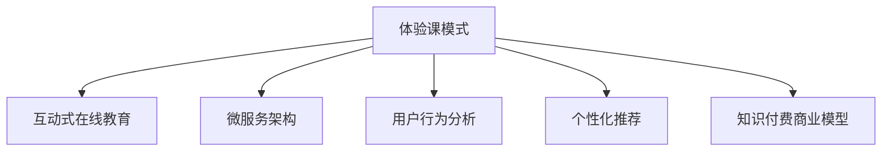

                 

# 程序员知识付费：打造体验课模式

> 关键词：程序员知识付费, 体验课模式, 在线教育, 技术培训, 学习平台, 微服务架构, 用户行为分析, 个性化推荐, 知识付费商业模型

## 1. 背景介绍

### 1.1 问题由来

随着知识经济的蓬勃发展，知识付费成为一种趋势。程序员作为科技行业的重要力量，其知识和技能也越来越受到市场重视。传统的知识获取方式包括书籍、论文、在线课程、技术博客等，但这些方式往往存在内容冗长、互动性差、难以及时更新等问题，已不能满足现代程序员的快速学习和即时沟通需求。

与此同时，在线教育平台如雨后春笋般涌现，许多教育机构、专业博主、技术大咖纷纷进入知识付费市场，为程序员提供多种多样的在线课程和资源。然而，传统的在线教育模式仍面临诸多问题，如课程内容针对性不足、学习进度难以掌握、教学效果评估困难等。

针对这些问题，本文提出了一种新型的在线教育模式——体验课模式，旨在通过高效互动、精准适配、实时反馈等方式，为程序员打造更为高效、便捷的学习体验。

### 1.2 问题核心关键点

体验课模式的核心在于通过游戏化、互动化、个性化、实时化的方式，提升程序员的学习效果。具体来说，体验课模式包括以下几个关键点：

- **游戏化学习**：通过任务导向、角色扮演、积分系统等方式，激发程序员的学习兴趣和动力。
- **互动化教学**：通过实时问答、代码评审、项目实战等互动环节，增强学习过程中的互动性和参与感。
- **个性化适配**：根据程序员的学习进度、知识背景、兴趣偏好等，动态调整课程内容和难度，提供个性化的学习路径。
- **实时反馈**：通过即时反馈和答疑机制，让程序员能够及时了解自己的学习效果，调整学习策略。

## 2. 核心概念与联系

### 2.1 核心概念概述

为更好地理解体验课模式，本节将介绍几个密切相关的核心概念：

- **体验课模式**：一种新型的在线教育模式，强调通过游戏化、互动化、个性化、实时化的方式，提升程序员的学习效果。
- **互动式在线教育**：与传统单向传授知识不同，互动式在线教育重视师生互动、生生互动，增强学习的互动性和参与感。
- **微服务架构**：一种软件架构设计方法，将复杂的应用系统拆分为多个小型服务模块，每个服务模块独立部署、灵活扩展。
- **用户行为分析**：通过收集和分析用户行为数据，理解用户需求和偏好，提供个性化的服务体验。
- **个性化推荐**：根据用户的历史行为和兴趣，推荐其感兴趣的内容，提高用户的学习效率和满意度。
- **知识付费商业模型**：通过知识内容付费，实现内容的商业化运营，同时通过付费机制筛选出有支付能力的用户，提升平台的商业价值。

这些核心概念之间的逻辑关系可以通过以下Mermaid流程图来展示：



这个流程图展示体验课模式与其他核心概念的关系：

1. 体验课模式基于互动式在线教育，强调互动性。
2. 通过微服务架构实现系统的高效、灵活构建。
3. 利用用户行为分析获取用户数据，进行个性化推荐。
4. 知识付费商业模型为体验课模式提供盈利途径。

## 3. 核心算法原理 & 具体操作步骤
### 3.1 算法原理概述

体验课模式的核心算法原理主要包括以下几个方面：

1. **任务导向的游戏化设计**：通过设计任务导向的游戏化环节，激发程序员的学习兴趣和参与感。任务包括编程挑战、代码评审、项目实战等，每完成一项任务，程序员可以获得积分、徽章等奖励。

2. **即时反馈和答疑机制**：利用即时通讯工具（如微信、钉钉等），实现师生的实时交流和反馈。同时，通过智能问答系统，对程序员的疑问进行智能解答，提高互动效率。

3. **个性化推荐算法**：利用机器学习和数据分析技术，根据程序员的学习进度、知识背景、兴趣偏好等，推荐其感兴趣的内容。推荐内容可以是课程、资料、习题、讨论等。

4. **微服务架构的应用**：将体验课平台拆分为多个小型服务模块，每个服务模块独立部署、灵活扩展。通过API接口实现模块之间的交互，提高系统的可扩展性和可靠性。

### 3.2 算法步骤详解

基于体验课模式的核心算法原理，我们可以进一步细化其操作步骤。

**Step 1: 准备开发环境**

- 选择合适的编程语言和框架，如Node.js、React等。
- 安装所需的数据库（如MongoDB、MySQL等）和在线教育平台（如Kaggle、Coursera等）的SDK。
- 配置实时通讯工具和智能问答系统。

**Step 2: 设计课程体系**

- 根据程序员的需求和兴趣，设计多个课程模块，如基础编程、数据结构、算法设计、项目实战等。
- 每个课程模块包含多个任务，每个任务包括学习目标、难度等级、任务描述、预期成果等。
- 设置积分和徽章的分配规则，鼓励程序员完成更多任务。

**Step 3: 开发任务管理系统**

- 开发任务管理系统，实现任务的创建、分配、执行、评审等功能。
- 设计任务流程管理，确保任务的有序进行。
- 实现积分和徽章的自动计算和发放，提升用户的学习动力。

**Step 4: 开发实时互动系统**

- 利用即时通讯工具，实现师生的实时交流和反馈。
- 开发智能问答系统，对程序员的疑问进行智能解答。
- 利用数据分析技术，分析程序员的学习行为和进度，进行个性化推荐。

**Step 5: 搭建微服务架构**

- 将体验课平台拆分为多个小型服务模块，如任务管理服务、互动服务、推荐服务、支付服务等。
- 设计API接口，实现模块之间的交互。
- 利用容器化技术（如Docker）和自动化部署工具（如Jenkins），实现服务的灵活部署和扩展。

**Step 6: 部署和测试**

- 将开发好的系统部署到云平台（如AWS、阿里云等）。
- 进行系统测试，确保各个服务模块能够正常运行。
- 邀请部分用户进行试运行，收集反馈并持续优化系统。

**Step 7: 运营和维护**

- 对系统进行持续的监控和维护，及时发现和修复问题。
- 根据用户反馈和市场需求，持续更新和优化课程体系和互动内容。
- 进行市场推广，吸引更多用户加入体验课平台。

### 3.3 算法优缺点

体验课模式具有以下优点：

1. **激发学习兴趣**：通过任务导向、积分系统、实时反馈等游戏化元素，激发程序员的学习兴趣和参与感。
2. **提高互动效率**：利用即时通讯工具和智能问答系统，实现实时互动和答疑，提高学习效果。
3. **个性化适配**：通过数据分析技术，进行个性化推荐，提高学习效率和满意度。
4. **灵活扩展**：利用微服务架构，实现系统的灵活扩展和高效部署。

同时，体验课模式也存在一些缺点：

1. **成本较高**：开发和部署体验课平台需要较高的技术投入和资金支持。
2. **数据安全风险**：收集和分析用户行为数据，存在数据安全和隐私保护的风险。
3. **用户依赖度较高**：过度依赖平台，可能导致用户自主学习能力下降。
4. **技术门槛较高**：开发和运营体验课平台需要较高的技术门槛和专业知识。

## 4. 数学模型和公式 & 详细讲解 & 举例说明

### 4.1 数学模型构建

在体验课模式中，我们需要构建多个数学模型来优化用户体验和提升学习效果。以下是几个关键的数学模型：

**用户行为分析模型**

用户行为分析模型旨在通过收集和分析用户的行为数据，理解用户需求和偏好，提供个性化的服务体验。模型可以通过以下步骤构建：

1. 定义用户行为指标：如课程完成度、任务提交次数、互动频率等。
2. 收集用户行为数据：通过API接口和数据仓库，收集用户的行为数据。
3. 构建特征工程：将用户行为数据转化为模型输入特征。
4. 训练机器学习模型：如随机森林、梯度提升树、神经网络等，进行个性化推荐。

**个性化推荐模型**

个性化推荐模型通过机器学习算法，根据用户的历史行为和兴趣，推荐其感兴趣的内容。模型可以通过以下步骤构建：

1. 定义推荐目标：如课程推荐、习题推荐、讨论推荐等。
2. 收集用户历史行为数据：如课程完成情况、任务提交情况、互动记录等。
3. 构建推荐特征：如课程难度、任务类型、用户兴趣等。
4. 训练推荐模型：如协同过滤、内容过滤、混合推荐等。

### 4.2 公式推导过程

以用户行为分析模型为例，我们通过以下公式推导过程：

1. **用户行为指标定义**

   $$
   \text{用户行为指标} = \{任务完成度, 互动频率, 课程完成度\}
   $$

2. **用户行为数据收集**

   通过API接口收集用户行为数据，设用户 $u$ 的行为数据为 $\text{user\_data}(u)$，包含多个行为指标 $a_i$，$i=1,2,...,n$。

3. **特征工程**

   将用户行为数据转化为模型输入特征，设特征向量为 $\text{feature\_vector}(u)$，包含多个特征 $f_j$，$j=1,2,...,m$。

4. **推荐模型训练**

   利用机器学习算法训练推荐模型，设推荐模型为 $M$，其输出为用户 $u$ 的个性化推荐结果 $\text{recommend\_result}(u)$。

5. **模型预测**

   将用户行为数据 $\text{user\_data}(u)$ 和特征向量 $\text{feature\_vector}(u)$ 输入推荐模型 $M$，得到用户 $u$ 的个性化推荐结果 $\text{recommend\_result}(u)$。

### 4.3 案例分析与讲解

假设某程序员 $u$ 在体验课平台上学习了多个课程，完成了多个任务。我们通过用户行为分析模型，对其行为数据进行分析，得到其行为指标 $a_i$。然后利用特征工程，将其转化为特征向量 $\text{feature\_vector}(u)$，包含多个特征 $f_j$。

我们将特征向量输入推荐模型 $M$，得到程序员 $u$ 的个性化推荐结果 $\text{recommend\_result}(u)$。推荐结果可以是下一个课程推荐、下一项任务推荐、下一个讨论推荐等。

## 5. 项目实践：代码实例和详细解释说明

### 5.1 开发环境搭建

在进行体验课模式开发前，我们需要准备好开发环境。以下是使用Node.js和React开发的环境配置流程：

1. 安装Node.js：从官网下载并安装Node.js。
2. 创建项目：使用`create-react-app`工具创建React项目。
3. 安装所需依赖：安装React Router、Axios等依赖。
4. 配置实时通讯工具和智能问答系统：安装对应的SDK，并配置API接口。
5. 安装数据库：安装MongoDB、MySQL等数据库，并配置连接池。

完成上述步骤后，即可在项目中开始体验课模式的开发。

### 5.2 源代码详细实现

下面我们以任务管理系统为例，给出使用Node.js和React进行任务管理的PyTorch代码实现。

首先，定义任务管理系统的数据模型：

```javascript
const mongoose = require('mongoose');
const { Schema } = mongoose;

const TaskSchema = new Schema({
  name: {
    type: String,
    required: true
  },
  description: {
    type: String,
    required: true
  },
  difficulty: {
    type: String,
    required: true
  },
  user: {
    type: mongoose.Schema.Types.ObjectId,
    required: true,
    ref: 'User'
  },
  completed: {
    type: Boolean,
    default: false
  }
});

module.exports = mongoose.model('Task', TaskSchema);
```

然后，定义任务管理系统的路由和控制器：

```javascript
const express = require('express');
const router = express.Router();
const Task = require('../models/Task');

router.get('/tasks', async (req, res) => {
  const tasks = await Task.find().sort({ completed: -1 });
  res.send(tasks);
});

router.post('/tasks', async (req, res) => {
  const task = new Task(req.body);
  await task.save();
  res.send(task);
});

router.put('/tasks/:id', async (req, res) => {
  const task = await Task.findByIdAndUpdate(req.params.id, req.body, { new: true });
  res.send(task);
});

router.delete('/tasks/:id', async (req, res) => {
  await Task.findByIdAndDelete(req.params.id);
  res.send('Task deleted');
});

module.exports = router;
```

最后，在React组件中调用API接口，实现任务的展示和操作：

```javascript
import React, { useState, useEffect } from 'react';
import axios from 'axios';
import TaskList from './TaskList';

const TaskManager = () => {
  const [tasks, setTasks] = useState([]);

  useEffect(() => {
    axios.get('/tasks')
      .then(response => {
        setTasks(response.data);
      })
      .catch(error => {
        console.log(error);
      });
  }, []);

  return (
    <div>
      <TaskList tasks={tasks} />
    </div>
  );
};

export default TaskManager;
```

以上代码实现了任务管理系统的基础功能，包括获取任务列表、创建任务、更新任务、删除任务等。开发者可以根据具体需求，进一步扩展任务管理系统的功能。

### 5.3 代码解读与分析

让我们再详细解读一下关键代码的实现细节：

**TaskSchema定义**：
- `name`：任务名称。
- `description`：任务描述。
- `difficulty`：任务难度。
- `user`：任务所属的用户ID。
- `completed`：任务是否已完成。

**任务管理路由**：
- `/tasks`：获取任务列表。
- `/tasks`：创建任务。
- `/tasks/:id`：更新任务。
- `/tasks/:id`：删除任务。

**TaskManager组件**：
- `useState`：定义任务状态。
- `useEffect`：获取任务列表。
- `TaskList`：展示任务列表。

这些代码展示了体验课模式中任务管理系统的实现。开发者可以根据具体需求，进一步扩展任务管理系统的功能，如任务评论、任务评分等。

## 6. 实际应用场景

### 6.1 智能教育平台

体验课模式在智能教育平台中有着广泛的应用前景。通过游戏化、互动化、个性化、实时化的方式，体验课模式可以大大提升学生的学习效果和参与感，使其在短时间内掌握更多的知识和技能。

在技术实现上，可以收集学生的历史学习数据，利用数据分析技术，生成个性化的学习路径和推荐内容。同时，通过实时互动系统，让学生能够随时向教师提出问题，得到及时的解答和指导。这样，体验课模式就能在教育领域中发挥其独特的优势，为学生提供更高效、更便捷的学习体验。

### 6.2 企业培训系统

体验课模式在企业培训系统中同样具有重要应用。通过体验课模式，企业可以高效地组织内部培训，提高员工的技能水平和职业素养。

在实践过程中，企业可以根据自己的需求，设计多个培训课程和任务，每个课程包含多个任务。通过游戏化元素，激发员工的学习兴趣和参与感。同时，利用实时互动系统，让员工能够随时向培训师提出问题，得到及时的解答和指导。这样，企业就可以通过体验课模式，高效地完成培训任务，提升员工的技能水平和企业的竞争力。

### 6.3 在线学习社区

体验课模式还可以应用于在线学习社区，为用户提供一个互动、协作、分享的学习平台。通过体验课模式，用户可以根据自己的兴趣和学习进度，选择适合自己的课程和任务。同时，利用实时互动系统，与其他用户进行交流和协作，共同解决问题。这样，用户就可以在一个互动、协作、分享的环境中，进行高效的学习和交流。

## 7. 工具和资源推荐

### 7.1 学习资源推荐

为了帮助开发者系统掌握体验课模式，以下是一些优质的学习资源：

1. **《用户体验设计》书籍**：介绍用户体验设计的理论和实践，为体验课模式的开发提供理论基础。
2. **《交互设计原则》课程**：介绍交互设计的原则和技巧，提升用户体验。
3. **《游戏化设计》书籍**：介绍游戏化设计的原理和应用，为体验课模式的开发提供灵感。
4. **《机器学习基础》课程**：介绍机器学习的基础知识和算法，为体验课模式中个性化推荐和用户行为分析提供技术支持。

通过这些学习资源，开发者可以更好地理解体验课模式的原理和应用，掌握相关的技术手段，开发出高效、便捷的学习体验。

### 7.2 开发工具推荐

高效的开发离不开优秀的工具支持。以下是几款用于体验课模式开发的常用工具：

1. **Node.js**：基于JavaScript的服务器端运行环境，适合快速迭代研究。
2. **React**：由Facebook开发的UI组件库，用于构建单页应用，适合动态展示任务列表和用户界面。
3. **Axios**：基于Promise的HTTP客户端，用于实现API接口的调用。
4. **MongoDB**：开源的NoSQL数据库，用于存储和管理任务和用户数据。
5. **WebSocket**：支持全双工通信的协议，用于实现实时互动和答疑机制。

合理利用这些工具，可以显著提升体验课模式的开发效率，加快创新迭代的步伐。

### 7.3 相关论文推荐

体验课模式的发展离不开学界的持续研究。以下是几篇奠基性的相关论文，推荐阅读：

1. **《游戏化学习设计》论文**：介绍游戏化学习的理论基础和设计原则，为体验课模式的开发提供理论指导。
2. **《互动式在线教育》论文**：介绍互动式在线教育的实现方法和应用场景，为体验课模式提供技术参考。
3. **《个性化推荐系统》论文**：介绍个性化推荐系统的算法和实现方法，为体验课模式中个性化推荐提供技术支持。

这些论文代表了大语言模型微调技术的发展脉络。通过学习这些前沿成果，可以帮助研究者把握学科前进方向，激发更多的创新灵感。

## 8. 总结：未来发展趋势与挑战

### 8.1 总结

本文对体验课模式进行了全面系统的介绍。首先阐述了体验课模式的背景和意义，明确了其在游戏化、互动化、个性化、实时化等方面的独特优势。其次，从原理到实践，详细讲解了体验课模式的核心算法和具体操作步骤，给出了体验课模式开发的全套代码实例。同时，本文还探讨了体验课模式在智能教育、企业培训、在线学习社区等多个行业领域的应用前景，展示了体验课模式的前景和潜力。此外，本文精选了体验课模式的各类学习资源，力求为开发者提供全方位的技术指引。

通过本文的系统梳理，可以看到，体验课模式正在成为一种新的在线教育范式，为程序员提供了高效、便捷的学习体验。未来，伴随体验课模式的不断优化和普及，程序员的学习方式将迎来新的变革，大大提升其技能水平和职业素养。

### 8.2 未来发展趋势

展望未来，体验课模式将呈现以下几个发展趋势：

1. **游戏化元素不断丰富**：随着技术的发展，游戏化元素将不断丰富，如角色扮演、任务升级、积分系统等，进一步提升用户体验。
2. **互动效率不断提升**：通过实时互动和智能问答系统，体验课模式的互动效率将不断提升，提升学习效果。
3. **个性化推荐不断优化**：利用机器学习和数据分析技术，个性化推荐将不断优化，提高用户的学习效率和满意度。
4. **跨平台扩展不断拓展**：体验课模式将逐步拓展到更多平台，如移动端、桌面端、Web端等，为用户提供更广泛的接入方式。
5. **多模态学习不断拓展**：体验课模式将逐步拓展到更多模态的学习，如视觉、听觉、触觉等，提升用户的学习体验。

以上趋势凸显了体验课模式的广阔前景。这些方向的探索发展，必将进一步提升体验课模式的学习效果和应用范围，为程序员提供更高效、便捷的学习体验。

### 8.3 面临的挑战

尽管体验课模式已经取得了瞩目成就，但在迈向更加智能化、普适化应用的过程中，它仍面临诸多挑战：

1. **技术门槛较高**：开发和运营体验课模式需要较高的技术门槛和专业知识。
2. **数据安全和隐私保护**：收集和分析用户行为数据，存在数据安全和隐私保护的风险。
3. **用户依赖度较高**：过度依赖平台，可能导致用户自主学习能力下降。
4. **商业可持续性**：体验课模式需要大量的资金投入，如何实现商业可持续性是关键问题。

### 8.4 研究展望

针对体验课模式面临的挑战，未来的研究需要在以下几个方面寻求新的突破：

1. **降低技术门槛**：开发更多简单易用的体验课平台，降低技术门槛，吸引更多的用户加入。
2. **加强数据安全和隐私保护**：采用更加严格的数据保护措施，保障用户数据的安全和隐私。
3. **增强用户自主学习能力**：设计更多自主学习任务，提升用户的自主学习能力。
4. **探索新的商业模式**：开发更多创新的商业模式，实现商业可持续性。

这些研究方向将引领体验课模式走向更高的台阶，为程序员提供更高效、便捷的学习体验。面向未来，体验课模式还需要与其他人工智能技术进行更深入的融合，如知识表示、因果推理、强化学习等，多路径协同发力，共同推动自然语言理解和智能交互系统的进步。

## 9. 附录：常见问题与解答

**Q1：体验课模式是否适用于所有课程？**

A: 体验课模式适用于大多数课程，特别是任务导向、实践性强的课程。但对于理论性较强的课程，可能难以通过游戏化元素激发学生的学习兴趣。

**Q2：体验课模式如何实现个性化推荐？**

A: 个性化推荐是通过收集用户的历史行为和兴趣，利用机器学习算法，生成个性化的推荐内容。推荐内容可以是课程、资料、习题、讨论等。

**Q3：体验课模式如何实现实时互动？**

A: 实时互动通过WebSocket协议，实现师生的实时交流和答疑。同时，通过智能问答系统，对学生的疑问进行智能解答，提高互动效率。

**Q4：体验课模式如何实现微服务架构？**

A: 微服务架构是将复杂的应用系统拆分为多个小型服务模块，每个服务模块独立部署、灵活扩展。通过API接口实现模块之间的交互，提高系统的可扩展性和可靠性。

**Q5：体验课模式如何实现用户行为分析？**

A: 用户行为分析通过收集和分析用户的行为数据，理解用户需求和偏好，提供个性化的服务体验。模型可以通过随机森林、梯度提升树、神经网络等机器学习算法进行训练。

这些常见问题的解答，可以帮助开发者更好地理解体验课模式，开发出高效、便捷的学习体验。

---

作者：禅与计算机程序设计艺术 / Zen and the Art of Computer Programming

